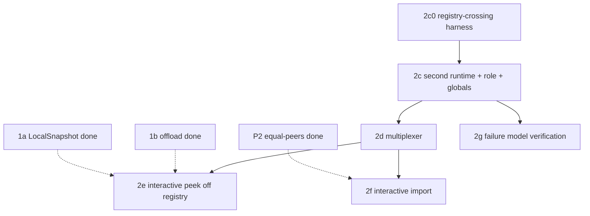

# Stage 2 detailed plan: second interactive compute runtime

Follow-on to `implementation-plan.md`, covering tasks 2c-2g at executable granularity.
Grounded against the clusterd bootstrap, the compute command/response protocol, and the process panic model, and revised after a spec review.

> **Line numbers drift.** Every `file:line` below was accurate at authoring time but the tree moves. Treat them as starting points and `git grep` the named symbol rather than trusting the number.
> **Design prose.** The design's `README.md` and the sibling `20260719_shared_arrangements_across_runtimes/` doc live on the design PR branch (#37747), not on this implementation branch. Cross-check "new components this design requires" against that PR.

## Settled decisions

* **Interactive runtime networking: explicit new CLI/env config.**
  A new `--interactive-compute-timely-config` (env `INTERACTIVE_COMPUTE_TIMELY_CONFIG`) supplies the interactive runtime's own `TimelyConfig` (its own `addresses`, hence its own inter-worker ports). It shares the `process` ordinal and peer count with the maintenance runtime. No new controller-facing listen address, because the multiplexer keeps the single existing endpoint.
* **Verification: a lightweight two-runtime harness (2c0) gates the sharing mechanism; a full-`serve` two-runtime boot test lives in 2c.** See the 2c0/2c split below, which resolves the earlier fallback contradiction.
* **Process globals: role-label metrics, interactive skips global re-init.** Compute metrics gain a maintenance/interactive role label so a second registration does not collide. The interactive runtime does not re-run the non-idempotent process-global initializers.
* **Import queue: unbounded, no overflow handling (first cut).** The change-stream replay queue on the interactive import path is unbounded and never blocks the publisher, so maintenance progress is never coupled to reader speed. The cost is memory growth for a lagging long-lived importer, accepted for the first cut and recorded as a deferred concern (a bound plus publisher-independent shedding is future work, matching the primitive design's own open question).

## Confirmed topology and grounded protocol facts

One controller endpoint. `mz_compute::server::serve` returns a client *builder* `impl Fn() -> Box<dyn ComputeClient>` (`server.rs:87-136`). The process calls `serve` twice, producing a maintenance builder and an interactive builder over two independent `TimelyContainer`s. Task 2d's multiplexer wraps both into one builder handed to the single `transport::serve(args.compute_controller_listen_addr, ...)` (`clusterd/src/lib.rs:490-505`). Both runtimes share the one `ArrangementSharingRegistry`, `persist_clients`, `metrics_registry`, `tracing_handle`, and `txns_ctx`, exactly as storage and compute already share them (`clusterd/src/lib.rs:440-505`).

Protocol facts the multiplexer relies on (grounded):

* `ComputeClient` is a marker alias: `trait ComputeClient: GenericClient<ComputeCommand, ComputeResponse>` (`compute-client/src/service.rs:34-37`), and `Box<dyn ComputeClient>` implements `GenericClient` (`service.rs:39-54`). `GenericClient` gives `async fn send(&mut self, ComputeCommand)` and cancel-safe `async fn recv(&mut self) -> Result<Option<ComputeResponse>>`.
* `ComputeCommand` variants (`protocol/command.rs:38-265`): `Hello{nonce}`, `CreateInstance(Box<InstanceConfig>)`, `InitializationComplete`, `UpdateConfiguration(Box<ComputeParameters>)`, `CreateDataflow(Box<DataflowDescription<RenderPlan, CollectionMetadata>>)`, `Schedule(GlobalId)`, `AllowWrites(GlobalId)`, `AllowCompaction{id, frontier}`, `Peek(Box<Peek>)`, `CancelPeek{uuid}`.
* `ComputeResponse` variants (`protocol/response.rs:29-139`): `Frontiers(GlobalId, ...)`, `PeekResponse(Uuid, PeekResponse, OpenTelemetryContext)`, `SubscribeResponse(GlobalId, ...)`, `CopyToResponse(GlobalId, ...)`, `Status(...)`. Peeks correlate by `Uuid`, collections by `GlobalId`.
* `PeekResponse` (`response.rs:191-200`): `Rows`, `Stashed(Box<StashedPeekResponse>)`, `Error(String)`, `Canceled`. The doc states a 1:1 `Peek`:`PeekResponse` contract keyed by `uuid`.
* `Peek` (`command.rs:449-474`): `target: PeekTarget`, `uuid`, `timestamp`, `literal_constraints`, `finishing`, `map_filter_project`. `PeekTarget` (`command.rs:411-425`) is `Index{id}` (fast path) or `Persist{id, metadata}` (slow path); `target.id()` gives the `GlobalId`.
* `DataflowDescription::is_transient()` (`dataflows.rs:380-383`) is `export_ids().all(|id| id.is_transient())`. There is NO enforced homogeneity: a mixed dataflow returns `false`. The multiplexer must therefore route by `is_transient()` and treat mixed as maintained (safe: interactive serves only wholly-ephemeral work).

## Global constraints

Same as `implementation-plan.md`: base `mh/two-runtime-stage2`, no `as_conversions`, no `std::HashMap`, no `unsafe`, `bin/fmt` plus `cargo check` before done. Everything new is gated behind the interactive runtime being configured (the new CLI arg present), so a single-runtime deployment is byte-unchanged.

## Task graph



---

## Task 2c0: registry-crossing integration harness (the sharing gate)

**Purpose.** A gating Rust test that proves in-process cross-runtime arrangement reading through the registry, using the LIGHTEST possible two-runtime construct so it is always feasible. It does NOT require the full `serve` stack (that boot is proven in 2c). This removes the earlier fallback contradiction: 2c0 is always the bare-`timely` proof, 2c always adds the full-`serve` proof.

**Files:**
* Create: `src/compute/tests/two_runtime_sharing.rs`, a test that:
  * constructs one `ArrangementSharingRegistry`,
  * runs two bare `timely::execute` clusters in one process (runtime A publishes, runtime B reads), sharing that registry (the registry is `Clone` and `Arc`-backed),
  * on A, arranges rows and `publish()`es into the shared registry (reuse the harness shape in `src/compute/src/sharing.rs` `mod tests`),
  * on B, a worker calls `registry.handles_blocking(id, worker_index, timeout)` and asserts `snapshot_at(as_of)` returns A's rows, and that `handles_blocking` blocks until A publishes (a late-publish ordering, as in the 2b test).

**Interfaces produced:** a reusable `two_runtime_sharing` fixture other Stage 2 tests can copy.

**DoD:** the test boots two bare-timely runtimes, publishes on one, reads correct rows on the other through the registry, and the blocking lookup wakes on the late publish. Fails if the handshake or snapshot is wrong. This is the first end-to-end proof that in-process cross-runtime sharing works, independent of `serve`.

---

## Task 2c: second interactive compute runtime + full-serve boot test

**Depends on:** 2c0.

**Files:**
* `src/clusterd/src/lib.rs`:
  * Add CLI/env arg `interactive_compute_timely_config: Option<TimelyConfig>` near `compute_timely_config` (`~95-100`); set its `.process = args.process` (`~422-423`).
  * When present, call `mz_compute::server::serve` a second time (mirror `~475-489`) with the interactive `TimelyConfig`, the SAME `persist_clients`, `sharing_registry`, `txns_ctx`, `tracing_handle`, `metrics_registry`, and a new `role` argument = `Interactive`. Hold the returned interactive builder for task 2d (in 2c it is passed to the multiplexer stub or the boot test; single-endpoint multiplexing lands in 2d). NOTE: the first `serve` currently MOVES `persist_clients` (`~478`); switch it to `Arc::clone(&persist_clients)` as the storage call already does (`~444`) so both compute runtimes share the one cache.
  * Add a hard equal-peers assertion: interactive `workers * num_processes` equals maintenance's, stronger than the workers-per-process-only assert at `~425-429`.
* `src/compute/src/server.rs`:
  * Add `role: ComputeRuntimeRole` (new enum `{ Maintenance, Interactive }`, defined in `mz-compute-types` or `mz-compute`) to `serve` (`~85-93`); store on `Config`/`Worker`; pass into `ComputeState::new`.
  * Use `role` in the timely span name (`cluster/src/client.rs:264`, `name="compute"`) so the two clusters are distinguishable (e.g. `compute` vs `compute-interactive`).
  * Make `ComputeMetrics::register_with` (`~108-118`) and `column_pager::metrics::register` register with the role label so the second registration is distinct, or register the truly-shared ones once.
* `src/compute/src/metrics.rs` (`~153`, `~177`): add the role to the const labels alongside `{"cluster" => "compute"}`.
* `src/compute/src/compute_state.rs`:
  * Add a `role` field to `ComputeState`.
  * Guard so only `Maintenance` runs the non-idempotent process-global initializers: `DICTIONARY_COMPRESSION.store` (`~502-510`), lgalloc config (`~285-299`), `ENABLE_LGALLOC_REGION` (`~317-320`), `memory_limiter` (`~315`), `overflowing::set_behavior` (`~377`). The idempotent pager `set_scratch_dir`/`set_backend` (`~307-313`) and the tiered-policy/`GLOBAL_PAGER` singletons may run from both.

**Test (the full-serve boot proof):** a test (`src/clusterd/tests/` or a compute integration test) that boots BOTH runtimes via the real `serve` path with the new role arg, feeds a `CreateInstance` to each, renders an index on maintenance, and reads it via the registry from an interactive worker. This is where the full-`serve` two-runtime boot is proven (2c0 proved only the bare-timely sharing).

**DoD:** with the interactive config present, two compute runtimes boot in one process via `serve`; metrics carry a role label and do not collide; the interactive runtime does not re-init non-idempotent process globals; equal peers is asserted. With the config absent, exactly one runtime runs, byte-unchanged (verified by a test asserting the single-runtime path is taken when the arg is `None`). CI EXERCISES THE TWO-RUNTIME PATH: this task lands the full-`serve` boot test AND passes `--interactive-compute-timely-config` in at least one running CI configuration (the clusterd integration test the task adds, or a named mzcompose scenario), so the path is not left uncovered. The report names the exact test/workflow that runs it.

---

## Task 2d: process-level command/response multiplexer

**Depends on:** 2c.

**Files:**
* Create: `src/compute-client/src/multiplex.rs` (a `GenericClient<ComputeCommand, ComputeResponse>` impl, i.e. a `ComputeClient`). NOT `PartitionedComputeState` (`service.rs:78-145`), which meets homogeneous partitions; this demuxes heterogeneous runtimes.
* Wire in `clusterd/src/lib.rs`: the single `transport::serve(args.compute_controller_listen_addr, ..., multiplexed_builder, ...)` gets a builder that, per controller connection, builds `Multiplexer::new(maintenance_builder(), interactive_builder())`.

**State:**

```rust
pub struct Multiplexer {
    maintenance: Box<dyn ComputeClient>,
    interactive: Box<dyn ComputeClient>,
    /// Transient GlobalId -> which runtime renders it. Learned from CreateDataflow.
    /// Evicted when the id's AllowCompaction reaches the empty frontier (drop).
    transient_owner: BTreeMap<GlobalId, Runtime>,
    /// Live peek uuids, for exactly-one-response dedup and cancel-race handling.
    /// A uuid is inserted on Peek and removed when its first terminal PeekResponse
    /// is forwarded; a later duplicate for a removed uuid is dropped.
    live_peeks: BTreeSet<Uuid>,
}
enum Runtime { Maintenance, Interactive }
```

**`send` routing (by grounded command type):**
* `Hello`, `CreateInstance`, `InitializationComplete`, `UpdateConfiguration` -> BOTH (lifecycle).
* `CreateDataflow(desc)`:
  * if `desc.is_transient()` AND it carries no subscribe sink (`dataflows.rs` `sink_exports` has no `ComputeSinkConnection::Subscribe`) -> interactive; record every `desc.export_ids()` in `transient_owner` as `Interactive`.
  * else -> maintenance (this covers maintained dataflows, subscribes, and any mixed non-homogeneous dataflow, all safely).
* `Schedule(id)`, `AllowWrites(id)`, `AllowCompaction{id,..}` -> route by `transient_owner.get(id)`: `Interactive` if present, else maintenance. On an `AllowCompaction` to the empty frontier for a transient id, forward then remove it from `transient_owner`.
* `Peek(p)` -> interactive; insert `p.uuid` into `live_peeks`.
* `CancelPeek{uuid}` -> interactive (the peek lives there).

**`recv` merge (poll both clients, e.g. `tokio::select!`, preserving `recv` cancel-safety):**
* `PeekResponse(uuid, resp, otel)` (only interactive produces these): if `uuid` in `live_peeks`, remove it and forward; else DROP (a duplicate after a cancel-vs-complete race). This delivers exactly one response per uuid, including point-lookups (one response, forwarded) and cancel races (first wins, second dropped).
* `Frontiers(gid, ..)`: forward as-is from whichever runtime produced it. Each `gid` is owned by exactly one runtime (maintained on maintenance, transient on interactive), so no meet is needed. Interactive-emitted `Frontiers` for its transient collections ARE forwarded (the controller created those collections behind a read hold and expects their frontiers).
* `SubscribeResponse`, `CopyToResponse`: forward from the owning runtime (maintenance for subscribes).
* `Status`: forward both, unconditionally. Verified safe: `handle_status_response` (`compute-client/src/controller/instance.rs:2286`) is a no-op (`StatusResponse::Placeholder => {}`) and `service.rs` passes `Status` through with no dedup state, so duplicate `Status` responses from the two runtimes are harmless today.

**DoD:** the controller sees one endpoint; every command reaches the correct runtime by the policy above; exactly one `PeekResponse` per uuid (tested: a normal peek, a point-lookup, and a CancelPeek-races-completion case all yield exactly one response); interactive `Frontiers` for transient collections reach the controller; `transient_owner` is evicted on drop so it does not grow unboundedly. Extend the 2c full-serve harness to drive a `CreateDataflow`+`Peek` through the multiplexer and assert the peek is served by interactive.

**Note on `Status` and controller tolerance:** confirm against `compute-client`/controller whether duplicate `Status` responses are safe before choosing forward-both vs forward-one. Record the decision inline.

---

## Task 2e: interactive peek path off the registry

**Depends on:** 2d, and Stage 1's `LocalSnapshot`/offload (1a/1b).

**Files:**
* `src/compute/src/compute_state.rs`, `handle_peek` (grep it; ~`674`, lookup at ~`678`): when `role == Interactive` and the peek target is `PeekTarget::Index{id}`, replace the local `TraceManager` lookup with `sharing_registry.handles_blocking(id, worker_index, timeout)`; take a `LocalSnapshot`-equivalent from the `oks`/`errs` `SharedTraceHandle`s (`snapshot_at`); run the walk via the Stage 1 offload. A snapshot peek holds nothing on the trace. `PeekTarget::Persist` peeks are unaffected (they already bypass arrangements).

**DoD:** a fast-path index peek is served on the interactive runtime, never touching a maintenance worker thread; correctness and the since-gate are unchanged; the snapshot pins no compaction. Validated by extending the harness: an index maintained on maintenance, peeked via the multiplexer, served by interactive, correct rows.

---

## Task 2f: interactive temporary-dataflow import path

> **STATUS: landed known-broken, exploratory only.** The implemented path (`import_index_shared` in `render.rs`) lands a *collection* under the imported index's `GlobalId` because `ArrangementFlavor::Trace` is hardcoded to the `TraceAgent`-based aliases and cannot hold a `SharedTraceHandle`. This is not a mere performance note (as the task review first graded it): the LIR plan reached this import because it says "this input is an index, use it," and downstream operators (delta joins especially) are rendered assuming that arrangement, its key, and its permutation exist. Substituting a collection loses that contract, so the path is both prohibitively expensive (re-arranges what maintenance already holds) and correctness-unsafe (an operator requiring the pre-existing arrangement can render a wrong plan). The real fix is to import *as an arrangement*: make `ArrangementFlavor::Trace` and the render trace type generic over `TraceReader` (or add a flavor variant) so a `SharedTraceHandle`-backed trace slots in where the plan expects the index. Until then the interactive runtime should serve reads via the snapshot peek path (2e), not this import. The behavior/DoD below describe the mechanism as built; treat it as a stub pending the arrangement-preserving rework.

**Depends on:** 2d, and P2 (equal-peers assert in the primitive).

**Files:**
* `src/compute/src/render.rs`: a new import path analogous to `import_index` (grep it; ~`591`) that, on the interactive runtime, sources the imported `Arranged` from `sharing_registry` handles via `SharedTraceHandle::import` (change-stream replay from the dataflow's `as_of`), instead of the local `TraceManager`.

**Behavior:** a slow-path peek or ad-hoc query renders as a temporary dataflow on the interactive runtime importing maintenance arrangements, then drops. The import registers a real read hold at its `as_of`, released on drop. **The replay queue is unbounded, per the settled decision: it never blocks the publisher.** Document at the import site that a lagging importer grows memory unboundedly and that a bound is deferred work.

**DoD:** a slow-path peek renders on the interactive runtime importing a maintenance arrangement and drops cleanly; the import holds only its own `as_of`, released on drop, never below the controller's hold; the publisher is never blocked by a slow importer (the queue is unbounded, not back-pressuring). Validated by the harness. The unbounded-memory risk is documented, not fixed.

---

## Task 2g: failure model verification

**Depends on:** 2c. This is a VERIFICATION + documentation task. The mechanism already exists process-wide; confirm it covers the second runtime and add no new abort machinery unless a gap is found.

**Grounded facts:**
* No `panic = "abort"` profile anywhere (root `Cargo.toml` profiles set none). Process death on panic comes from a panic hook.
* `mz_ore::panic::install_enhanced_handler()` (`ore/src/panic.rs:134-279`) installs a process-global `panic::set_hook` that calls `process::abort()` on any uncaught panic on any thread (outside a `catch_unwind` region). It is installed FIRST THING in `clusterd::main` (`clusterd/src/lib.rs:190-191`), before either `serve`.
* `halt_on_timely_communication_panic()` (`timely-util/src/panic.rs:28-41`, installed at `clusterd/src/lib.rs:262-264`) downgrades `"timely communication error:"` panics to `halt!` -> `libc::_exit(166)`.

**Work:**
* Confirm the enhanced handler is installed before the interactive `serve` call (it is, in `main`), so the interactive runtime's worker and reader threads are covered by the same process-global hook. Add a comment at the interactive `serve` call site recording this shared-fate reliance.
* Confirm no interactive-runtime code path wraps worker execution in a `catch_unwind` that would swallow a worker panic (grep `catch_unwind` in `src/compute/src/`). If one exists on the interactive path, that is the gap to close.
* Test: a subprocess-style test that boots the interactive runtime, induces a worker/reader-thread panic, and asserts the process aborts (nonzero exit). If a subprocess harness is too heavy for this branch, substitute an assertion that `install_enhanced_handler` runs before both `serve` calls plus the `catch_unwind`-absence grep, and record that the full abort behavior is covered by the existing process-global hook rather than re-tested here.

**DoD:** a panic on either runtime's worker or reader thread aborts the process (established by the process-global hook installed before both runtimes); no interactive path swallows a worker panic via `catch_unwind`; the reliance is documented at the interactive `serve` site. No partial-failure path, no fallback rerouting interactive reads onto maintenance.

---

## CI wiring (applies across 2c-2f)

Because the interactive runtime is gated by the new CLI arg's presence (not a dyncfg), no existing suite exercises it by default. As part of 2c (or a dedicated follow-up), pass `--interactive-compute-timely-config` in at least one test configuration (an mzcompose scenario or the clusterd integration test) so CI runs the two-runtime path. Without this, only the 2c0/2c-family Rust harness covers the code. State explicitly in each task's report whether CI exercises the path.

## Deferred (unchanged from implementation-plan.md, plus this stage)

Core-sharing policy, import-queue bound and shedding (2f is unbounded by decision), per-runtime introspection and memory attribution, lease expiry. Measurement or follow-up-design items, not resolved by 2c-2g.
