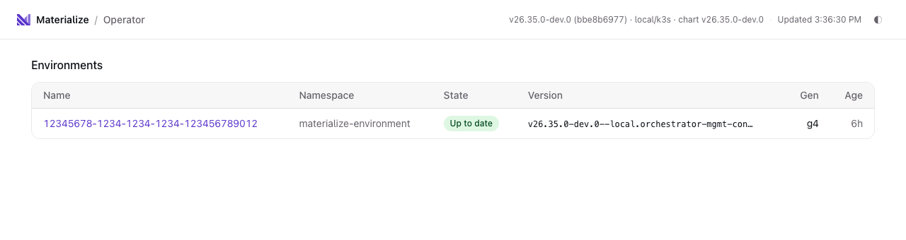
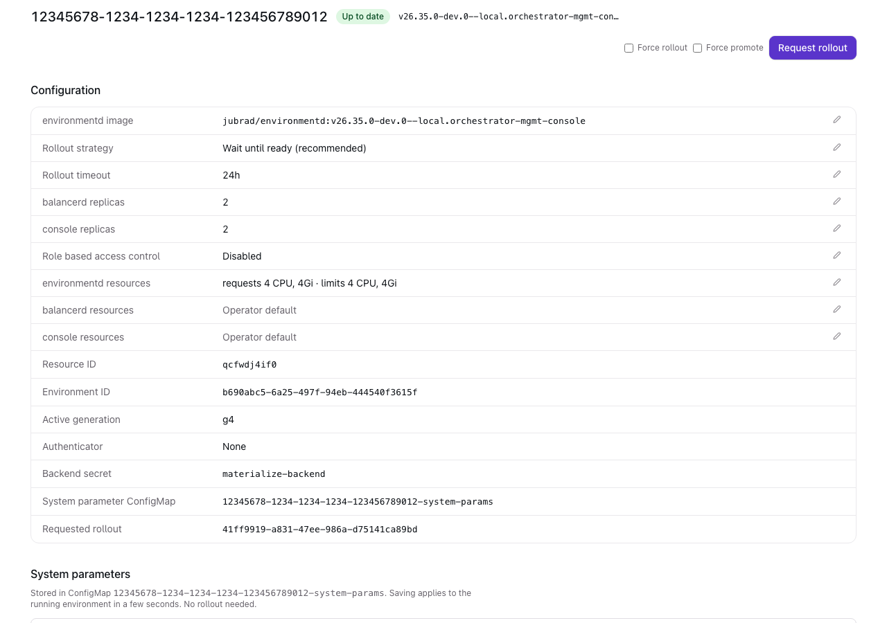
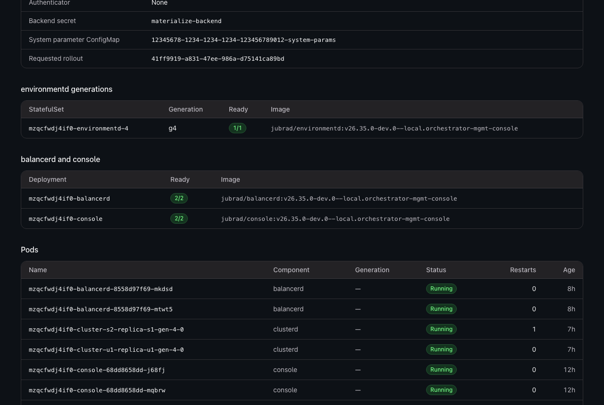
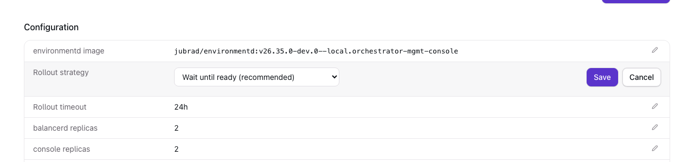
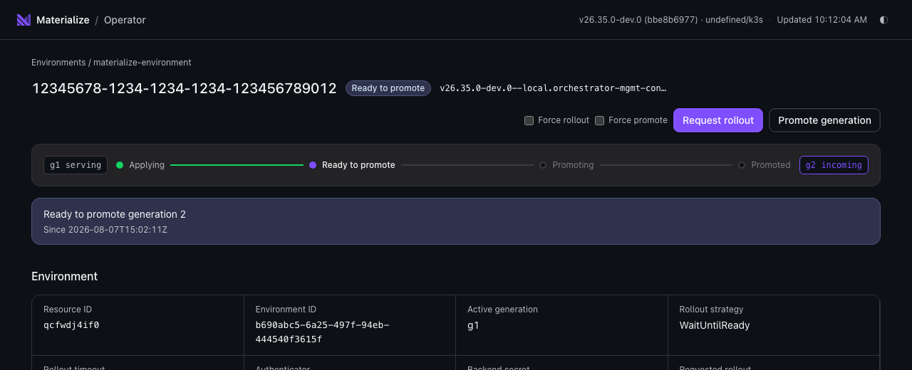

# orchestratord status API and UI

- Associated issues: none yet

## The Problem

orchestratord manages Materialize, Balancer, and Console custom resources,
plus the Kubernetes objects generated from them (StatefulSets, Deployments,
Services, ConfigMaps, Certificates, NetworkPolicies). Today the only ways to
see what the operator is doing are `kubectl` spelunking, operator logs, and
Prometheus metrics. Answering basic questions like "what environments exist,
what version are they running, is an upgrade in flight, is it stuck waiting
for promotion" requires knowing the CRD status conventions (the `UpToDate`
condition and its reasons) and the per-generation resource naming scheme.

Managing system parameter defaults is similarly opaque: they live in a
ConfigMap referenced by `spec.systemParameterConfigmapName`, with a JSON
document under a magic `system-params.json` key.

## Success Criteria

- An operator of a self-managed Materialize installation can see, in one
  place: all Materialize environments, their running and desired versions,
  rollout state (including waiting-for-approval and ready-to-promote states),
  and the health of the generated workloads (environmentd StatefulSets and
  pods, balancerd and console Deployments).
- Common rollout actions are available without hand-editing YAML: request a
  rollout, force a rollout with no spec changes, promote a pending
  `ManuallyPromote` rollout.
- The system parameter ConfigMap can be viewed and edited with JSON
  validation.
- No new deployables. The API and UI ship inside the existing orchestratord
  binary and pod.
- The UI has no build step and no external dependencies at runtime.

## Out of Scope

- Authentication and authorization. The server binds a ClusterIP-only port.
  Anyone with network access to the pod (or `kubectl port-forward` rights)
  has full access. Auth can be layered on later without changing the API
  surface.
- Editing arbitrary spec fields of the Materialize CR. The API exposes a
  small set of intentional mutations, not a generic YAML editor. `kubectl`
  remains the tool for everything else.
- Any data-plane visibility (SQL-level objects, cluster replica status inside
  Materialize). This is a control-plane view only.
- Multi-cluster. The API serves the cluster the operator runs in.

## Solution Proposal

Embed a fourth HTTP server in the orchestratord process, alongside the
existing webhook (8001), metrics (3100), and profiling (8004) servers. The
operator already holds a kube `Client` with exactly the RBAC needed to read
and write the resources involved, so a separate deployment would only add an
image, a ServiceAccount, RBAC duplication, and version skew for no benefit at
this scale.

New module `src/orchestratord/src/api.rs` with an axum `Router`, started from
`bin/orchestratord.rs` behind a new `--api-listen-address` flag (default
`[::]:8002`). The router serves:

- `GET /` — the UI, a single self-contained HTML file embedded via
  `include_str!`.
- `GET /api/...` — the JSON API below.

### API

All responses are JSON. Errors use a uniform `{ "error": "message" }` body
with an appropriate status code. Kube API errors pass through their status
codes (404, 409, etc.) where meaningful.

Read endpoints:

- `GET /api/health` — 200 if the server is up and can reach the Kubernetes
  API (a cheap `Api::<Materialize>::all().list(limit=1)` probe).
- `GET /api/info` — operator build version, cloud provider, region, helm
  chart version, and relevant feature flags (`create_balancers`,
  `create_console`). Source: the controller `Config`.
- `GET /api/materializes` — all Materialize CRs across namespaces. Each item
  is a summary: namespace, name, resource id, environment id, spec image ref,
  running image ref (`status.lastCompletedRolloutEnvironmentdImageRef`),
  active generation, rollout strategy, the `UpToDate` condition
  (status/reason/message/lastTransitionTime), whether a rollout is requested
  but incomplete, and creation timestamp.
- `GET /api/materializes/:namespace/:name` — full detail:
  - the summary fields above, plus spec fields relevant to operations
    (backend secret name, authenticator kind, system parameter ConfigMap
    name, replica counts, rollout request timeout, requestRollout /
    forcePromote / forceRollout values),
  - full status including all conditions,
  - owned workloads, discovered via the
    `materialize.cloud/mz-resource-id=<resource_id>` label selector:
    environmentd StatefulSets (per generation, with ready/total replicas and
    image), balancerd and console Deployments, Services, and pods (name,
    phase, ready, restart count, image, start time, node),
  - recent Kubernetes events for the Materialize resource and its
    StatefulSets/Deployments (best effort, capped at 50, sorted newest
    first).
- `GET /api/balancers` and `GET /api/consoles` — the Balancer and Console CRs
  with name, namespace, image ref, replicas, and conditions.

Mutations (all narrow, intentional operations on the v1alpha1 stored
version):

- `POST /api/materializes/:namespace/:name/rollout` — body
  `{ "forceRollout": bool, "forcePromote": bool }` (both default false).
  Sets `spec.requestRollout` to a fresh UUID. With `forceRollout`, also sets
  `spec.forceRollout` to that UUID (rollout proceeds even with no resource
  changes). With `forcePromote`, also sets `spec.forcePromote` to that UUID
  (skips waiting for cluster catchup). Returns the new rollout UUID.
- `POST /api/materializes/:namespace/:name/promote` — promotes a pending
  rollout by setting `spec.forcePromote = spec.requestRollout`. Intended for
  the `ManuallyPromote` strategy once the status reason is `ReadyToPromote`,
  but valid whenever a rollout is in progress. 409 if no rollout is pending.
- `PUT /api/materializes/:namespace/:name/config` — the editable slice of the
  spec as one endpoint: `environmentdImageRef`, `rolloutStrategy`,
  `rolloutRequestTimeout`, `balancerdReplicas`, `consoleReplicas`,
  `enableRbac`, and per-component `resources`. Every field is optional and only
  the ones present are changed, so the UI can save a single row without
  restating the rest. A component under `resources` given as `null` has its
  override cleared. `requestRollout` bumps the rollout in the same write, and
  is ignored when nothing changed so a no-op save cannot start one.

  The proposed image is checked against the same upgrade window the controller
  enforces, by running the check against a candidate copy of the resource
  rather than reimplementing the rule, so an illegal jump is rejected with 400
  instead of landing in the spec and surfacing later as `FailedDeploy`. The
  rollout timeout is parsed for the same reason: the CRD silently falls back to
  its default on an unparseable value, which would otherwise accept a setting
  that never applies.

  The response lists which fields changed and whether a rollout is needed.
  Only `environmentdImageRef`, `enableRbac`, and environmentd's own resources
  are part of the environmentd StatefulSet, and therefore hashed into the
  Materialize status. Rollout strategy, the rollout timeout, replica counts,
  and balancerd and console resources reach their targets without a new
  generation, since they flow to the Balancer and Console resources that their
  own controllers reconcile.

- `GET /api/materializes/:namespace/:name/system-params` — returns the parsed
  JSON object from the `system-params.json` key of the ConfigMap named by
  `spec.systemParameterConfigmapName`. Returns `{ "configmapName": null,
  "params": null }` if the spec field is unset, and `"params": null` if the
  ConfigMap or key is missing.
- `PUT /api/materializes/:namespace/:name/system-params` — body is a JSON
  object of system parameters. Writes it (pretty-printed) to the
  `system-params.json` key, creating the ConfigMap if it does not exist. If
  `spec.systemParameterConfigmapName` is unset, first patches the spec to
  point at `<materialize-name>-system-params` and then creates that
  ConfigMap. Non-object bodies are rejected with 400.

  NOTE: the operator mounts this ConfigMap into environmentd and passes
  `--config-sync-file-path` with a one second `--config-sync-loop-interval`.
  environmentd re-reads the file on every tick of that loop and applies
  changes through `ALTER SYSTEM`, so edits reach a running environment
  without a rollout. End to end latency is dominated by how fast the kubelet
  refreshes the mounted file, not by the loop.

  To avoid waiting out the kubelet's refresh period, the write also stamps a
  `materialize.cloud/system-params-refreshed-at` annotation onto the
  environmentd pods, which triggers a pod sync and re-projects the volume
  immediately. This annotates the live pods, not the pod template: the
  template is part of the StatefulSet, which is hashed into the Materialize
  status, so touching it would create a new generation and roll the
  environment out on every save. The nudge is best effort, since the write
  has already landed by then.

  Two cases break that, and the response reports both rather than assuming.
  `rolloutRequired` is true only when the write had to add
  `systemParameterConfigmapName` to the spec, since that adds the volume
  mount and the sync arguments to the StatefulSet and so needs a rollout
  before the loop exists. `syncSupported` is false when environmentd predates
  `V26_1_0`, where the operator never mounts the ConfigMap and the values
  have no effect at all.

Both mutations that touch the spec use `Api::replace` on a freshly-`get`ed
object so a conflicting concurrent edit fails with 409 rather than being
clobbered.

### UI

One HTML file (`src/orchestratord/src/api/ui.html`) with inline CSS and
vanilla JavaScript. No framework, no bundler, no external fonts or CDNs.

- Overview: table of environments with namespace/name, running → desired
  image (highlighted when they differ), rollout state badge derived from the
  `UpToDate` condition (`Applied`, `Applying`, `ReadyToPromote`, `Promoting`,
  `WaitingForApproval`, `FailedDeploy`, `RolloutTimeout`), active generation,
  and age. Auto-refreshes every 5 seconds via `fetch`.
- Detail view (client-side routing on `location.hash`), in order: the rollout
  rail and condition message, the configuration card, then what is actually
  running (environmentd StatefulSets per generation, balancerd and console
  Deployments, pods with phase and restart counts, services), the system
  parameter editor, and recent events. Configuration and runtime state are
  kept as separate sections because they answer different questions: what the
  environment is meant to be, and what it currently is.
- Configuration lives in one card rather than being spread across sections.
  Each row shows the current value, and the editable ones carry a pencil that
  swaps that row into an inline editor with save and cancel: a text field for
  the image, a select for the rollout strategy and for RBAC, quantity fields
  for each component's requests and limits (empty meaning inherit the operator
  default), and plain fields for the timeout and replica counts. Rows whose
  change only lands through a rollout say so in the editor. Rows the operator
  owns, or that must not change on a live environment, render without a
  pencil.

- Other actions on the detail view: "Request rollout" (with force-rollout and
  force-promote checkboxes), "Promote" (shown when a rollout is pending), and
  a system parameters editor (textarea with client-side JSON validation, save
  via PUT). Destructive or disruptive actions confirm first, and the API error
  is shown verbatim on failure, with the edited row left open so the entered
  value is not lost.

- Because the page polls, an edit in progress must never be overwritten by a
  refresh. Every editable field records the value it was rendered with in a
  `data-initial` attribute, and the refresh is skipped while any field is
  focused or diverges from that value. Saving marks the field current again,
  which releases the hold.

### Screenshots

The environment list, answering "what is running, is it healthy, is an upgrade
in flight" at a glance:

The configuration card, with the editable rows carrying a pencil:

What is actually running, kept separate from the configuration above it:

Editing a row in place. The rollout strategy is a select, since it is a closed
set and one of its values causes downtime:

A rollout in flight, showing the controller's own stages:

### Helm chart

- `deployment.yaml`: always expose `containerPort: 8002, name: api`.
- `service.yaml`: render the Service when `operator.api.enabled` (new value,
  default `true`) or `operator.args.installV1CRD` is set, and include the
  `api` port when `operator.api.enabled`. The Service stays ClusterIP.
- `clusterrole.yaml`: add `events` (`get`, `list`) to the core API group
  rule, for the events endpoint.
- `values.yaml`: new `operator.api.enabled` toggle. When disabled, the
  container still runs the server (harmless, unreachable without the Service
  port), keeping the operator args independent of the toggle.

## Minimal Viable Prototype

The implementation above is itself close to minimal. The MVP cut, if needed:
read-only endpoints plus the overview UI, no mutations. The mutation
endpoints are small and well-isolated, so they ship in the same change here.

## Alternatives

- Separate API/UI deployment. Rejected: duplicates RBAC and packaging,
  invites version skew with the CRDs, and the expected traffic (a handful of
  admins) does not justify an independent lifecycle. Argo-CD-style split API
  servers pay off at a much larger scale than this.
- Serve the UI from the existing metrics or profiling ports. Rejected: those
  have established scrape/debug semantics, and mixing a mutating API into
  the metrics port would surprise anyone who has exposed it for Prometheus.
- Build the UI with a framework (React/Svelte) and a bundler. Rejected for
  now: adds a JS toolchain to the build for a small dashboard. A single
  static file keeps the Docker image and CI untouched. If the UI grows, this
  decision is cheap to revisit since the API is the stable boundary.
- Expose generic CR editing (PATCH with arbitrary JSON). Rejected: with no
  auth, the API should expose the smallest useful set of mutations, each with
  clear semantics, rather than a general write path.

## Open questions

- Should the API refuse mutations when `--disable-authentication` is not set
  once auth exists? (Placeholder for the future auth design; today there is
  no auth by construction.)
- Whether to surface pod resource usage (the operator can already read
  `metrics.k8s.io` when `--collect-pod-metrics` is set). Left out to keep the
  first cut small.
