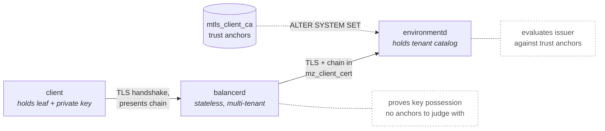
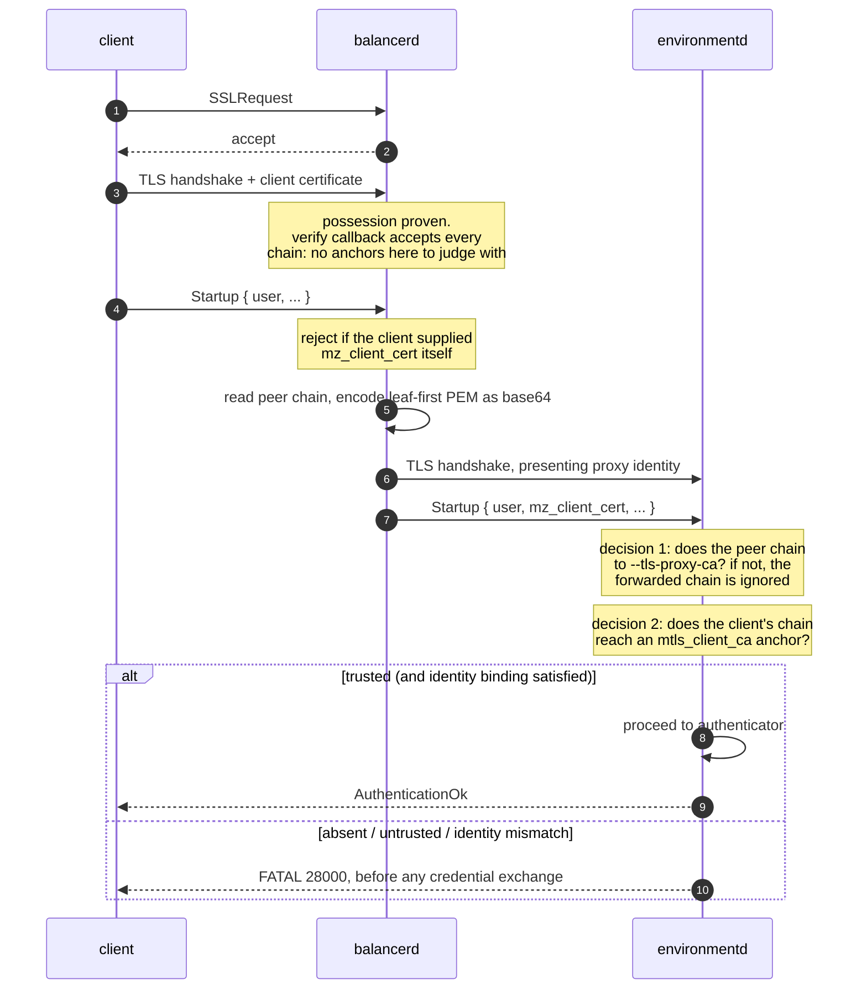
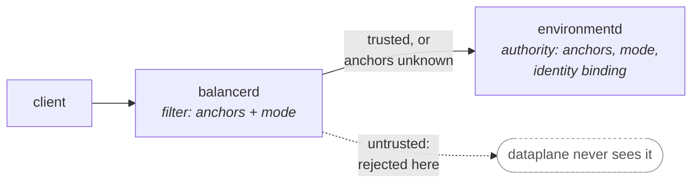

# Mutual TLS client authentication

- Associated: MaterializeInc/materialize#38419 (this design),
  MaterializeInc/materialize#38420 (prototype)

## The Problem

Today the only mechanisms to restrict user access are user authentication, and
network policies. The latter uses IP allow lists to provide a deeper level
of access restrictions that actually prevents auth challenges to materialize
wholesale putting a harder boundary on access. IP allowlists are not the best
fit for all customers:

* Egress IPs are not stable. Customers behind NAT gateways, corporate VPNs,
  cloud NAT pools, or serverless platforms cannot enumerate their source
  addresses, so they either give up on network policies or widen them until
  they mean nothing.
* An IP is not an identity. Anyone sharing the allowlisted egress path (a
  compromised pod in the same VPC, another tenant of the same NAT gateway)
  inherits the admission decision.
* IP squatting presents itself as a new concern, particularly for those using
  cloud services.
* Egress IPs are not always subject to fine grain control such as when a shared
  corporate network is used.
* Maintaining the allowlist is a human process with no expiry. There is no
  rotation, no revocation, and no cryptographic proof behind an entry.

Customers with a strict posture would be better served by requiring possession
of a private key whose certificate was issued by an authority the customer
controls, via mTLS.

The obstacle specific to Materialize is `balancerd`. Every connection to a
cloud environment lands on `balancerd`, which terminates TLS and opens a
*separate* pgwire connection to `environmentd`. The client certificate is
consumed by a process that has no catalog, no tenant configuration, and is
deliberately stateless and shared across all tenants. `environmentd`, which
does have the tenant's configuration, never sees the certificate at all.

## Success Criteria

1. An operator can require that every external SQL connection present an X.509
   certificate that chains to an authority the tenant configured, and can do so
   without an `environmentd` restart.
2. The requirement holds for connections that arrive through `balancerd`.
3. The trust anchors are tenant configuration, expressed in SQL, durable in the
   catalog, and changeable at runtime.
4. A connection presenting no certificate, an expired certificate, or a
   certificate from an untrusted issuer is rejected before any password,
   token, or SASL exchange occurs.
5. Failing closed is the default: a misconfiguration denies connections rather
   than admitting them. In particular, `environmentd` must not accept a
   forwarded identity from an unauthenticated peer.
6. No behaviour change, and no measurable connection-setup cost, for
   deployments that have not opted in.

## Out of Scope

* Replacing network policies. mTLS is an additional, independent admission
  gate. An operator who wants mTLS to be the only gate sets their network
  policy to allow everything. Fusing the two (a network policy rule keyed on
  certificate issuer rather than CIDR) is a plausible follow-up and is
  discussed under Alternatives.
* Using the certificate as the *authenticator*, i.e. logging in with a
  certificate and no password. This design treats the certificate as an
  admission gate and, optionally, as an assertion that must agree with the
  username. Certificate-only login is a natural extension once the identity
  plumbing exists.
* Certificate revocation lists and OCSP. Discussed under Open questions.
* Choosing mTLS *per surface*. An authority applies to the whole environment,
  so requiring mTLS requires it of pgwire, the SQL HTTP API, and webhook
  senders alike. Since third-party webhook senders cannot present a client
  certificate, `require` costs an operator their webhook sources until the
  surfaces can be separated by port; see "One policy for every surface, and
  what that costs".
* mTLS for internal listeners, cluster-to-cluster traffic, or `clusterd`.
* Verification at `balancerd` (phase 2), separating the surfaces (phase 3), and
  `CREATE CERTIFICATE AUTHORITY` (phase 4); see Roadmap. `environmentd` is the
  sole enforcement point in phase 1, so untrusted connections do reach the
  dataplane before being rejected there.

## Five Core Decisions

1. **Where is the request terminated?** `balancerd`, `environmentd`, or both.
2. **Which identities are impacted?** Everyone, or particular roles.
3. **Which endpoints are impacted?** Every external surface, or particular ones.
4. **How does an operator define it?** System parameters, a catalog object, or
   something outside SQL.
5. **Is the certificate enforcing or identifying?** A door key that admits
   anyone holding it, or an assertion about who the holder is.

**Moving question 1 toward the edge constrains questions 2 and 5.** A filter in
front of the dataplane may only reject on what it can determine with certainty,
or it breaks clients the authoritative check would have admitted. A proxy can
evaluate a certificate chain against a set of anchors, and can tell surfaces
apart if they are separated by port. It has no role graph, and in most resolver
modes it does not learn the username the adapter will settle on. So per-identity
scope and identity binding stay authoritative-side however far the filter moves.

## Solution Proposal

The design rests on one observation: **proof of possession and trust
evaluation are separable.**

When a client completes a TLS handshake that includes a client certificate, the
`CertificateVerify` message proves the client holds the corresponding private
key. That proof is inherently local to whoever terminated the handshake, and
`balancerd` is the only process positioned to obtain it. But deciding whether
the certificate's *issuer* is acceptable is a pure function of the certificate
chain and a set of trust anchors. It needs no live handshake, and it can happen
anywhere the chain and the anchors are both available.

So: `balancerd` obtains the proof and forwards the chain. `environmentd`, which
holds the tenant's trust anchors, evaluates it. `balancerd` never needs to know
any tenant's certificate authority, and stays stateless.



The split is the whole design. Possession can only be proven where TLS
terminates, and trust can only be evaluated where the tenant's configuration
lives. Those are two different processes, so the chain travels between them.

A connection through the balancer therefore involves two independent trust
decisions over two different handshakes:



Connecting straight to `environmentd` collapses this: the peer certificate *is*
the client certificate, decision 1 finds no proxy, and decision 2 runs on the
handshake chain. Self-managed deployments get mTLS with no proxy involved.

### 1. `balancerd` requests and forwards, but does not judge

`balancerd`'s pgwire acceptor is configured to request a client certificate
(`SSL_VERIFY_PEER` without `FAIL_IF_NO_PEER_CERT`) with a verification callback
that accepts every chain. OpenSSL still validates the `CertificateVerify`
signature, so possession is proven. Only the *trust* decision is suppressed,
because `balancerd` has no basis on which to make it.

Suppressing the trust decision is what makes this work. A `balancerd` that
validated chains would need every tenant's trust anchors pushed to it by the
control plane, turning a stateless shared proxy into a stateful one with a
fan-out cache invalidation problem, and coupling tenant-visible SQL (`ALTER
SYSTEM SET ...`) to a control-plane propagation delay.

After the handshake, `balancerd` serialises the leaf certificate and any
intermediates the client sent into the `mz_client_cert` startup parameter,
alongside the `mz_forwarded_for` and `mz_connection_uuid` parameters it already
injects. As with those, a client that supplies `mz_client_cert` itself is
rejected outright.

Encoding: PEM blocks, leaf first, concatenated, then base64 (standard alphabet,
no line breaks) so the value survives a protocol that carries NUL-terminated
strings. A 2048-bit RSA leaf plus one intermediate is roughly 2.5 KiB encoded,
which is immaterial next to the startup message's `i32` length field. A cap
(64 KiB) is enforced on both ends so a hostile client cannot make `balancerd`
buffer an unbounded chain.

### 2. `environmentd` authenticates `balancerd` before believing it

A forwarded identity is only as trustworthy as the peer asserting it. Today
`environmentd`'s external pgwire port already accepts `mz_forwarded_for` from
anyone who can reach it. That is tolerable for a hint used in logging and
network-policy evaluation, but not for the mechanism we are asking customers to
use *instead of* network policies. An attacker who can
reach `environmentd` directly would otherwise forge `mz_client_cert` and walk
straight through the new gate.

So the `balancerd` → `environmentd` leg becomes mutually authenticated:

* `balancerd` gains `--internal-tls-cert` / `--internal-tls-key` and presents
  that identity when `--internal-tls` is set. (Today this connector runs with
  `SslVerifyMode::NONE` and no client certificate.)
* `environmentd` gains `--tls-proxy-ca=<path>`: the authority that issues proxy
  identities. It is a file, not SQL, because it is infrastructure identity that
  must be trustworthy before any SQL is evaluated, and because it is the
  deployer's concern rather than the tenant's.
* `environmentd` honours `mz_client_cert` only from a peer whose own
  certificate chains to `--tls-proxy-ca`. If no proxy CA is configured, the
  parameter is ignored entirely and a connection that depended on it is
  rejected. Fail closed.

`environmentd` therefore ends up with two independent trust decisions over the
same handshake, which is why it also requests client certificates with a
permissive callback and defers both:

| peer certificate chains to | meaning |
| --- | --- |
| `--tls-proxy-ca` (file) | a trusted proxy, so it may assert `mz_client_cert` |
| a SQL-configured trust anchor | an end client connecting directly |
| neither | no certificate identity |

### 3. Trust anchors and policy come from SQL

Three system parameters, following the pattern established by the OIDC
authentication work (`oidc_issuer`, `oidc_audience`, `oidc_authentication_claim`):

```sql
ALTER SYSTEM SET mtls_client_ca = '-----BEGIN CERTIFICATE-----...';
ALTER SYSTEM SET mtls_mode = 'require';
ALTER SYSTEM SET mtls_identity_binding = 'common-name';
```

* **`mtls_client_ca`**. A PEM bundle of trust anchors. A bundle rather than a
  single certificate, so an operator can stage a CA rotation by trusting the
  old and new authorities simultaneously, and can trust several authorities at
  once. This is the same shape as every `--client-ca-file` in the ecosystem.
  Every certificate in the bundle is a valid chain terminus, so pinning an
  intermediate works (see the prototype findings below).
* **`mtls_mode`**.
  * `disable` (default): certificates are ignored.
  * `allow`: a certificate that chains to an anchor is recorded, and a
    connection without one is still admitted. This is the rollout mode. It lets an
    operator watch the metric climb and confirm every client is issuing
    certificates before flipping to `require`.
  * `require`: external logins must present a certificate that chains to an
    anchor. Internal users (`mz_system`, `mz_support`) are exempt, matching the
    existing network-policy carve-out. Internal listeners are secured by the
    deployment, not by tenant SQL.
* **`mtls_identity_binding`**.
  * `none` (default): any trusted certificate admits any username. The
    certificate is a gate, orthogonal to authentication.
  * `common-name`: the leaf's Subject Common Name must equal the connecting
    username. This is PostgreSQL's `clientcert=verify-full`, and it turns the
    certificate into a second factor bound to the identity rather than a shared
    door key.

Enforcement sits in `mz_pgwire::protocol::run`, immediately after the
`allowed_roles` check and *before* the authenticator is dispatched. An
unauthorised client is turned away without being offered a password prompt, a
SASL challenge, or a token exchange, which is the property that makes this a
real replacement for a network-level gate. Rejections use
`SqlState::INVALID_AUTHORIZATION_SPECIFICATION`.

The trust store is parsed from the PEM bundle and cached, keyed on the bundle
contents, so the OpenSSL parse happens once per configuration change rather
than once per connection.

### 4. Why system parameters in phase 1

**Decision: system parameters for phase 1.** A `CREATE CERTIFICATE AUTHORITY`
catalog object is the better end state and is specified in full under
Alternatives, but it belongs to phase 4 (see Roadmap), not to the first
iteration.

Three reasons. First, it is the pattern the most recent authentication feature
in the codebase already uses. OIDC is configured entirely through dyncfgs and
nobody has found that limiting. Second, a PEM bundle in one parameter is not a
capability reduction for the *trust* decision itself, which is a set membership
test over anchors. What the object model adds is naming and per-anchor policy.
Third, and most importantly, the interesting risk in this project is the
`balancerd` path, not the storage of a PEM blob. Spending the first iteration
on catalog boilerplate would validate nothing.

The migration is mechanical and forward-compatible. Enforcement takes a trust
store and a policy, so `CREATE CERTIFICATE AUTHORITY` rows would build the same
`MtlsPolicy` the bundle builds today and `MtlsPolicy::check` would not change.
Nothing built here becomes throwaway.

The triggers for moving to phase 4 are specific. First, **a customer who needs one
authority scoped to a subset of roles**: that is the one capability a PEM bundle
cannot express, since every anchor in a bundle is equally powerful.
Per-authority identity binding is the second. Edge filtering is *not* a
trigger: phase 2 moves filtering to `balancerd` while system parameters are
still the configuration surface (see Roadmap).

### Carrying the chain over HTTP

`balancerd`'s HTTPS listener splices raw TCP after terminating TLS and never
parses HTTP, so it cannot inject a header the way Envoy injects
`x-forwarded-client-cert`. Teaching it to parse HTTP for this would be a
significant regression in what that path is.

The mechanism that fits is already half-built: `balancerd` can prepend a PROXY
protocol v2 header to the upstream connection (`INJECT_PROXY_PROTOCOL_HEADER_HTTP`),
and `environmentd`'s HTTP server already parses one
(`take_proxy_header_address`). PROXY v2 carries typed TLVs, including a
registered `PP2_TYPE_SSL` block, and a TLV's `u16` length comfortably holds a
certificate chain. Carrying the chain as a TLV also unifies the two paths: the
same header could replace the pgwire startup parameter, at the cost of a
`balancerd` change on a path that currently needs none.

So the transport is solvable, and HTTP is in scope. The prototype implements
pgwire first because that is where the customer requirement lives; wiring the
HTTP path is remaining implementation, not an unanswered design question.

#### One policy for every surface, and what that costs

An authority applies to every external path: pgwire, the SQL HTTP API,
WebSocket, and webhook sources alike. Internal listeners are excluded, as they
are from network policies, because they are secured by the deployment rather
than by tenant configuration. Choosing *per surface* is the non-goal; covering
the external surfaces is the intent.

That is the simplifying choice, and it is worth being explicit about what it
buys and what it costs.

What it buys is that no component has to tell the surfaces apart. In particular
the objection that would otherwise block edge filtering on HTTPS disappears:
`balancerd` splices raw TCP and cannot distinguish `/api/webhook/...` from
`/api/sql` without parsing HTTP, but under a single policy it does not need to.
Filtering is all-or-nothing per connection, which is exactly the desired
semantics rather than a limitation to work around.

What it costs is that **`mtls_mode = 'require'` breaks webhook sources.**
`/api/webhook/**` is posted to by third parties, and a payment processor or a
git host offers nowhere to configure a client certificate. An operator who
requires mTLS is choosing to give up webhook ingestion until the surfaces can be
separated. The same applies to the console, where browsers can present client
certificates but the prompt is poor UX and enterprise policy often blocks it.
This is a real footgun and the `require` documentation has to say so plainly.

There is an implementation consequence worth recording, because the obvious
placement is wrong under this model. `auth_middleware` is attached to
`base_router`, and the webhook router is built standalone and merged into the
outer router, so it never passes through authentication; that is why
`authenticator_kind: "Frontegg"` does not break webhooks today. Putting the mTLS
check there would therefore exempt webhooks by construction, which is precisely
what we do *not* want. It belongs on the merged router, or better, evaluated
once per connection when the TLS stream is accepted, since the certificate is
fixed for the life of the connection while keepalive and HTTP/2 multiplexing put
many requests on it.

The future direction is phase 3 under Roadmap: give webhooks their own
`environmentd` port so they are a distinct surface rather than a path prefix, and let an operator choose independently whether pgwire, the SQL
HTTP API, and webhooks each require a certificate. Separating by port means the
edge learns the surface from the listener a connection arrived on, with neither
an HTTP parser nor SNI.

Separately, and independently of mTLS: network policies do not cover webhook
requests today. The webhook path never creates a session, so
`handle_startup_inner` never runs and `client_ip` is not plumbed in. That is a
coverage gap rather than an impossibility, since vendors commonly publish the
CIDR ranges their webhooks originate from and an operator could allow them. It
is worth confirming whether the current behaviour was chosen or merely happened.

### Observability

* `balancerd`: `mz_balancer_client_certs_forwarded_total{source, presented}`,
  counting how many connections presented a certificate. This is what an
  operator watches during a rollout in `allow` mode.
* `environmentd`: `mz_pgwire_client_cert_validations_total{source, result}`
  with `result` in `trusted`, `untrusted_issuer`, `absent`,
  `identity_mismatch`, `no_trust_anchors`, `forwarded_by_untrusted_peer`.
  An expired certificate counts as `untrusted_issuer`, because OpenSSL reports
  expiry as a chain-validation failure and the two are not worth separating for
  an operator. `forwarded_by_untrusted_peer` is a security signal rather than an
  error: someone is talking to `environmentd` directly and claiming to be a
  proxy.

Rejections log at `warn!` with the leaf's subject and issuer, never the
certificate itself.

## Roadmap

Four phases. Each is independently shippable and each delivers something the
previous one cannot, so none of them is a prerequisite kept around for its own
sake. In terms of the five questions: phase 1 answers all five, and each later
phase moves one, taking question 4 along when the new scope has nowhere else to
live.

| | 1. terminated at | 2. identities | 3. endpoints | 4. defined by | 5. certificate is |
| --- | --- | --- | --- | --- | --- |
| **Phase 1** | `environmentd` | all | all external | system parameters | gate, optionally a CN assertion |
| **Phase 2** | `balancerd` filters, `environmentd` decides | all | all external | system parameters | unchanged |
| **Phase 3** | unchanged | all | per surface | per-surface parameters | unchanged |
| **Phase 4** | unchanged | per authority | per surface | catalog object | gate, assertion, and authorization scope |

**Each phase moves one question, or two that are genuinely coupled.** Phase 1 to
phase 2 changes only where termination happens. Phase 3 changes which endpoints
are covered, and with it how policy is spelled, because "require on pgwire, not
on webhooks" has nowhere to live in a single global mode. Phase 4 changes which
identities are covered, and with it how policy is spelled again, because a PEM
bundle has nowhere to put a role restriction. No phase moves a column that a
later phase has to move back.

**Endpoints before identities.** Question 3 is answered first because it removes
a blocker rather than adding expressiveness: until the surfaces are separable,
turning mTLS on costs an operator their webhook sources, since third-party
senders cannot present a certificate. Question 2 is a refinement a customer can
live without.

**Phase 1, specified above. System parameters, `environmentd` validates.**
`ALTER SYSTEM SET mtls_client_ca`, and `environmentd` is the sole enforcement
point. Untrusted connections do reach the dataplane, and are rejected there
before any credential exchange. `balancerd` captures and forwards the chain but
does not judge it. This closes the customer requirement.

**Phase 2. System parameters, `balancerd` filters.** *Moves question 1 only.*
`balancerd` fetches the tenant's mTLS configuration from `environmentd` over a
cacheable API, verifies locally, and refuses to open the upstream connection
when the chain is untrusted. `environmentd` keeps checking and stays authoritative, so the edge is
a filter and a stale or unavailable cache degrades filtering rather than
correctness. This delivers the security property: unauthorized traffic stops
before the dataplane.

**Phase 3. Separate the surfaces.** *Moves question 3, and question 4 with it.*
Give webhooks their own `environmentd` port so they are a distinct surface
rather than a path prefix, and let an operator choose independently whether
pgwire, the SQL HTTP API, and webhooks each require a certificate. This unblocks
adoption for anyone using webhook sources, who until now has had to choose
between mTLS and webhook ingestion.

A port is enough, and a separate hostname is not required. The two facts the
edge needs are independent and come from different places: the *surface* comes
from the listener a connection arrived on, and the *tenant* comes from the SNI
servername. A webhook listener on its own port serving the same hostname gives
both, with no HTTP parsing, no new DNS, and no certificate changes. The client
URL simply gains a port.

Whether to add a hostname anyway is a reachability question rather than a
routing one. Webhook senders are third parties, and some will not post to a
non-standard port, whether because their configuration rejects it or because
their egress policy allows only 443. A `webhooks.<env>` hostname on 443 avoids
that at the cost of DNS, a certificate SAN, and SNI-pattern routing in
`balancerd`. Port first, hostname if the senders demand it.

#### A note on SNI

Separating webhooks by hostname relies on SNI, which is a non-issue for the
surface that needs it. `HttpsBalancer` already routes purely on the SNI
servername, its no-SNI path is commented as "not expected for HTTPS in
practice", and HTTPS clients send SNI as a matter of course. So a
webhook-specific hostname resolves the same way every other HTTPS hostname
already does.

SNI is only optional on pgwire, and pgwire does not need it here: it is a single
surface, so there is nothing to discriminate. Using SNI to learn the *tenant*
early, which would let phase 2's filter reject before the Frontegg credential
exchange, is a separate and optional matter, discussed under "The question phase
2 has to answer". It is an optimization rather than a requirement, because
`environmentd` is authoritative either way and only the earliness of the
rejection differs.

**Phase 4. `CREATE CERTIFICATE AUTHORITY`.** *Moves question 2, and question 4
with it: a PEM bundle has nowhere to put a role restriction.* The
catalog object replaces the PEM bundle, buying `FOR ROLES` scoping,
per-authority identity binding, named rotation, and audit. This delivers
expressiveness, and it is the last of the four because a customer can run
without it. The new expressiveness is enforced at `environmentd`, not at the
edge, for the reason below.

The order is blockers before refinements. Phase 2 keeps unauthenticated traffic
off the dataplane, which is the security property customers are asking for and
much the cheapest build. Phase 3 removes the reason an operator with webhook
sources cannot turn mTLS on at all. Phase 4 is the only one a customer can
reasonably run without, so it goes last.

### Why phase 2 does not wait for the catalog object

An earlier draft of this document argued that the catalog object and edge
filtering had to ship together, on the grounds that a set of named objects is a
better thing to distribute than the current value of a string. That is true
about the *payload* and wrong about the *sequencing*. The reusable asset in
phase 2 is the transport: the endpoint, ETag revalidation, the cache, the
fail-open behaviour, and `balancerd`'s verify path. None of that cares whether
the payload describes one anonymous bundle or twelve named authorities.

To keep phase 4 from disturbing the wire at all, **give the phase 2 payload its
phase 4 shape from the start**: a list of authorities with a generation, where
phase 2 projects the PEM bundle into entries with no name and no role scope.

```json
{
  "generation": 41,
  "mode": "require",
  "identity_binding": "none",
  "authorities": [
    { "name": null, "for_roles": null, "certificate": "-----BEGIN..." }
  ]
}
```

Phase 4 then starts populating `name` and `for_roles` and changes nothing about
how the data moves or is cached.

### What each phase preserves

* The wire format and the proxy-authentication model never change.
  `environmentd` still needs the chain to make the authoritative decision, so
  `mz_client_cert` and `--tls-proxy-ca` stay exactly as built in phase 1.
* `MtlsPolicy::check` is the same function throughout. It takes a chain, a trust
  store, and a username, and has no catalog or adapter dependency, so phase 2
  links it into `balancerd` unchanged.
* Trust anchors from `CREATE CERTIFICATE AUTHORITY` build the same in-memory
  trust store the PEM bundle builds today, so phase 4 does not touch enforcement.

### What the edge can soundly enforce

`balancerd` knows nothing about roles, and it should not learn. Role membership
lives in the catalog, and a proxy that had to resolve it would need the role
graph, its inheritance, and its invalidation. So the *membership* reading of
`FOR ROLES`, "the connecting user is a member of one of these roles", cannot be
enforced at the edge.

That is correct layering rather than a shortfall. The edge filter answers "is
this connection from an authority we recognise", which is admission. `FOR ROLES`
answers "may this identity log in as this role", which is authorization, and
authorization has always belonged to `environmentd` because RBAC lives in the
catalog.

There is a structural reason too, independent of where the role graph lives.
Materialize does not separate read from write at the network layer: there is one
pgwire endpoint and one SQL HTTP endpoint, and every role reaches the same one.
So knowing the role earlier would not let the edge route, rate-limit, or reject
differently in any way that maps onto blast radius. Role judgement at the edge
would buy nothing structural even if the data were free, which is a better
reason not to do it than the cost of getting the data there.

A certificate from a trusted but role-scoped authority *is* admissible. It is
simply not authorized to be `admin`, and `environmentd` is the thing that knows
that. The edge filters the unknown, `environmentd` filters the
known-but-unauthorized, and the residual exposure is a connection slot consumed
by a client holding a genuinely trusted certificate, which is a much smaller
surface than one holding a certificate from an authority nobody configured.

The general rule this implies is worth stating, because it constrains every
future addition to the edge filter:

> A filter that can produce false rejections is worse than no filter, because it
> breaks clients `environmentd` would have admitted. The edge may only reject on
> conditions it can evaluate with certainty from data it holds.

Applied to the policy:

| check | edge | `environmentd` |
| --- | --- | --- |
| chain reaches a trusted anchor | yes | yes |
| `mtls_mode` | yes | yes |
| authority is enabled | yes, by omitting disabled ones from the payload | yes |
| CN equals the login user | sound only where `balancerd` authenticates; see below | yes |
| `FOR ROLES` as a set of login names | same condition as above | yes |
| `FOR ROLES` as role membership | no | yes |

### Identity checks at the edge: available in one mode, valuable in the other

A check on the *login name* is within reach in a way role membership is not, but
it is only sound when `balancerd` knows the username `environmentd` will settle
on, and that depends on the resolver:

* **Frontegg resolution.** `balancerd` performs the same Frontegg
  authentication `environmentd` will, and already holds the resulting
  `auth_session`; it just reads `tenant_id()` and discards the rest. Taking
  `user()` from it gives exactly the canonical username `environmentd` uses, so
  the comparison is sound.
* **SNI routing, and every pass-through mode.** `balancerd` does not
  authenticate, so it has only the username the client claimed in its startup
  message. `environmentd` may settle on something else. Frontegg canonicalises
  casing, and OIDC is sharper still: `environmentd` takes the session username
  from the JWT's authentication claim, so the startup parameter may be unrelated
  rather than merely cased differently.

These line up awkwardly. The mode where the check is *sound* is Frontegg
resolution, which is also the mode where the credential has already been
collected before the check can run. The mode where an early rejection is most
*valuable* is SNI routing, where `balancerd` can refuse before any credential is
exchanged, and that is precisely where it does not know the username.

Awkward is not worthless, though. Rejecting at the edge in Frontegg mode still
keeps the connection off `environmentd` entirely, and that is the point of the
filter rather than a consolation: a client holding a **valid password but a
certificate issued to someone else** never consumes a connection slot, a TLS
handshake, or a session on the dataplane. Someone who has obtained a working
credential is exactly the adversary the certificate is meant to stop, and
denying them a cheap way to generate load on a tenant's single `environmentd` is
worth something on its own.

The marginal value is narrower than it first appears, because the anchor check
already covers most of that scenario. A valid password with no certificate, or
with one from an untrusted authority, is rejected at the edge by the anchor
check alone, with no notion of identity. What a CN comparison adds is only the
case of a valid password plus a *trusted* certificate issued to a different
user, which is lateral movement rather than an outsider.

So: worth doing eventually in Frontegg mode, not worth blocking phase 2 on, and
never sound in SNI mode. `environmentd` remains authoritative for it regardless.

### The question phase 2 has to answer

Tenant resolution, not the certificate, determines how early `balancerd` can
reject, and the two resolver modes differ:

| resolver | tenant known at | edge filter can reject before |
| --- | --- | --- |
| SNI routing | `ClientHello` | any credential, even before `Startup` |
| Frontegg | after the password is authenticated | contacting `environmentd` |

In Frontegg mode `balancerd` cannot know which anchors apply until it has
collected the password and authenticated it, so the "reject before any
credential exchange" property that phase 1 gives at `environmentd` does not hold
at the edge filter. The credential goes to the identity provider rather than to
Materialize, and the dataplane is still untouched, so this is probably
acceptable. But it is a real asymmetry, and phase 2 has to decide whether edge
filtering is SNI-mode only, where it is strongest, or whether post-Frontegg
filtering is good enough.

Phase 3 answers this by picking the first option, though only as a side effect:
requiring SNI so the edge can tell surfaces apart also means the Frontegg branch
is never taken, so the asymmetry disappears for environments that have reached
phase 3. It does not disappear for phase 2 on its own, which is why phase 2 has
to answer the question rather than wait.

Distribution mechanisms are compared under Alternatives. The cacheable
`environmentd` API is the assumed choice for phase 2; a Kubernetes
`ClientAuthority` CRD watch is the alternative, better on freshness and worse on
coupling.

## Minimal Viable Prototype

Working end to end, both directly against `environmentd` and through
`balancerd`, in MaterializeInc/materialize#38420. Roughly 950 lines across the
crates below.

It covers pgwire. The HTTP, WebSocket, and webhook paths are in scope for the
feature and are not yet wired; see "Carrying the chain over HTTP".

| Where | What |
| --- | --- |
| `mz-pgwire-common::client_cert` | The `mz_client_cert` wire format: chain to base64 PEM and back, with a size cap |
| `mz-pgwire-common::Conn::peer_cert_chain` | Pulls the chain out of a finished handshake (the leaf sits outside the peer chain on the server side, so it is prepended) |
| `mz-server-core::ClientCertMode` | `--tls-request-client-certs`: requests certificates with a permissive verify callback |
| `mz-authenticator::client_cert` | The trust decision: `MtlsPolicy`, `ProxyCa`, `TrustStoreCache` |
| `mz-pgwire::protocol` | The enforcement point, before the authenticator dispatches |
| `mz-pgwire::server` | Resolves which certificate speaks for the client, direct or forwarded |
| `mz-balancerd` | Captures and forwards the chain, and presents its own identity upstream |

### Try it

```console
# One CA for clients, one for the proxy identity, one for serving certs.
$ environmentd --tls-mode=require --tls-cert=server.crt --tls-key=server.key \
    --tls-request-client-certs --tls-proxy-ca=proxy-ca.crt
$ psql -h localhost -p 6877 -U mz_system -c \
    "ALTER SYSTEM SET mtls_client_ca = '$(cat client-ca.crt)'; \
     ALTER SYSTEM SET mtls_mode = 'require'"

$ psql "sslmode=require host=localhost user=materialize"
FATAL: a client certificate is required
$ psql "sslmode=require host=localhost user=materialize \
        sslcert=client.crt sslkey=client.key"
materialize=>
```

### Tests

`cargo test -p mz-authenticator --lib client_cert` runs 14 tests over the policy
itself: trusted and untrusted issuers, expired leaves, chains through an
intermediate, a pinned intermediate as the sole anchor, multi-anchor bundles,
malformed anchors, each mode, the CN binding, trust-store cache reuse and
invalidation, and proxy-authority scoping.

`bin/cargo-test -p mz-environmentd --test mtls` runs 8 tests over the direct
path: each mode's behaviour, runtime mode and anchor changes taking effect
without a restart, the CN binding, intermediate chains, and the internal-user
exemption.

`bin/cargo-test -p mz-balancerd --test server` runs 3 tests over the forwarded
path: mTLS end to end through the balancer including anchor rotation, a
balancer with no proxy identity having its assertion ignored, and a client that
supplies `mz_client_cert` itself being rejected.

### Two things the prototype changed about the design

**Trust anchors need `X509_V_FLAG_PARTIAL_CHAIN`.** Without it, OpenSSL insists
on building a chain to a self-signed root, so an operator who pins an
intermediate (a sub-CA scoped to one team, say) gets "unable to get issuer
certificate" for the exact authority they named. The flag makes every
certificate in the bundle a valid terminus, which is what "these are my trust
anchors" should mean. Found by a test that assumed the obvious behaviour.

**A missing Common Name must not compare equal to an empty username.** The
first cut treated an absent CN as the empty string. pgwire defaults an absent
`user` parameter to the empty string too, so a certificate from a SPIFFE-shaped
PKI (identity in a URI SAN, CN empty) would have satisfied a `common-name`
binding against an empty username. An absent CN now fails the binding
outright.

## Alternatives

Each of these answers the five questions differently from the chosen design, and
in most cases differs on exactly one. That is what distinguishes them from the
phases: a phase is a move this design intends to make, an alternative is a move
it declines to make, or defers.

| | 1. terminated at | 2. identities | 3. endpoints | 4. defined by | 5. certificate is |
| --- | --- | --- | --- | --- | --- |
| *This design, phase 1* | `environmentd` | all | all external | system parameters | gate, optionally a CN assertion |
| `balancerd` decides | `balancerd` alone | all | all external | pushed to the proxy | unchanged |
| TLS passthrough | `environmentd`, real handshake | all | all external | system parameters | unchanged |
| Network policy rule | `environmentd`, after authentication | per policy | all external | existing object | gate |
| Certificate as authenticator | `environmentd` | all | all external | system parameters | the sole credential |

The network policy row is the instructive one. It differs on question 1 in a way
that looks minor and is not: a network policy is evaluated in the coordinator
during `handle_startup`, which happens *after* authentication, so it cannot
deliver the property this design exists to provide.


**`CREATE CERTIFICATE AUTHORITY`, a first-class catalog object (phase 4).** The
better end state, deferred rather than rejected. Independent of the edge
filtering entry below; see Roadmap.
Modelled on `CREATE NETWORK POLICY`, which is the established shape in this
codebase for a named, RBAC'd, non-schema object with structured options.

```sql
CREATE CERTIFICATE AUTHORITY corp_root (
    CERTIFICATE = '-----BEGIN CERTIFICATE-----...-----END CERTIFICATE-----'
);

-- The capability a PEM bundle cannot express: an authority scoped to a
-- subset of roles, with its own identity binding.
CREATE CERTIFICATE AUTHORITY partner_ca (
    CERTIFICATE = '...',
    FOR ROLES = (analytics_ro, reporting),
    IDENTITY BINDING = 'common-name',
    ENABLED = true
);

ALTER CERTIFICATE AUTHORITY corp_root SET (CERTIFICATE = '<rotated>');
ALTER CERTIFICATE AUTHORITY partner_ca SET (ENABLED = false);
ALTER CERTIFICATE AUTHORITY corp_root RENAME TO corp_root_2027;
ALTER CERTIFICATE AUTHORITY corp_root OWNER TO security_team;

DROP CERTIFICATE AUTHORITY IF EXISTS partner_ca;

GRANT USAGE ON CERTIFICATE AUTHORITY corp_root TO security_team;
ALTER DEFAULT PRIVILEGES FOR ALL ROLES
    GRANT USAGE ON CERTIFICATE AUTHORITIES TO auditors;

SHOW CERTIFICATE AUTHORITIES;
SHOW CREATE CERTIFICATE AUTHORITY corp_root;
SELECT id, name, subject, issuer, not_after, enabled, fingerprint
FROM mz_internal.mz_certificate_authorities;
```

`mtls_mode` stays a system parameter either way, since it is global rather than
per-authority.

What this buys over the bundle:

* **`FOR ROLES`.** "This partner's CA may only admit `analytics_ro`." Not
  expressible with anchors in one string, where every anchor is equally
  powerful. This is the deciding capability. Enforced at `environmentd` only:
  `balancerd` has no role graph, and role scoping is authorization rather than
  admission. A literal login-name reading is within reach at the edge but not
  worth it; see "What the edge can soundly enforce" under Roadmap.
* **Per-authority `IDENTITY BINDING`.** A CN-shaped corporate CA and a
  SPIFFE-shaped workload CA can coexist; a single parameter forces one global
  choice.
* **Rotation and audit as operations rather than string surgery.** Add the new
  authority, watch the metric drain, `DROP` the old one by name. Two operators
  rotating concurrently do not clobber each other, and subject/expiry/
  fingerprint are queryable instead of buried in a blob.

What it costs: new keywords (`CERTIFICATE`, `AUTHORITY`, `AUTHORITIES`,
`BINDING`), `Statement::{Create,Alter,Drop}CertificateAuthority`, an
`ObjectType::CertificateAuthority` threaded through drop/rename/owner/grant, a
`CertificateAuthorityId` in `mz_repr`, a durable protobuf object and catalog
version bump, a `CatalogCertificateAuthority` trait, planner and sequencer
support, two builtin tables, audit-log variants, `mz-deploy` support, and
`SHOW CREATE` round-trip tests. That is the `NetworkPolicyId`-shaped footprint.

One sub-question if this is built: inline `CERTIFICATE = '...'` or a `SECRET`
reference? A CA certificate is public by definition, so a secret is
semantically wrong, but it would supply blob storage and rotation machinery for
free. The prototype uses an inline literal.

**`balancerd` verifies too, as a filter in front of the dataplane (phase 2).**
Deferred, and worth building. Does not depend on the catalog object above; see
Roadmap. This is the strongest security posture available: an
unauthorized client never reaches `environmentd` at all.

The version of this idea that fails is "move the trust decision to
`balancerd`". That makes a stateless multi-tenant proxy the authority on tenant
access control, so a stale or missing anchor cache becomes an access-control
error, and `ALTER SYSTEM SET mtls_client_ca` only takes effect after an
unbounded propagation delay.

The version that works keeps `environmentd` authoritative and adds `balancerd`
as a *filter*. Both check; only one decides. Staleness in the proxy's copy then
degrades filtering, never correctness. A missing or expired cache entry means
`balancerd` forwards and lets `environmentd` reject, which is exactly today's
behaviour. That single property is what makes the whole thing tractable, and it
is why this is additive: **nothing in the design above changes.** The wire
format, the proxy authentication, and the `environmentd` enforcement all stay
as they are.



What it buys, beyond what `environmentd`-side enforcement already gives:

* Unauthenticated traffic never reaches the dataplane, so a bug anywhere in
  `environmentd`'s pgwire, TLS, or startup-parameter handling stops being
  reachable by clients that cannot present a trusted certificate.
* Connection floods are absorbed at a horizontally scalable stateless tier
  rather than at the single `environmentd` per tenant, where connection slots
  and memory are the scarce resource.
* It generalises. The same distribution mechanism could carry network policy
  CIDRs, letting `balancerd` drop disallowed addresses before the dataplane.
  Network policies are evaluated in the coordinator today, well after the
  connection has been accepted and authenticated, so they have the same
  shape of gap.

Two places the check can sit, with different reach:

1. **During the handshake**, rejecting before the TLS session completes. The
   `ClientHello` carries SNI, and OpenSSL's servername callback runs before the
   client's certificate is verified, so the connection's verify store can be
   selected per tenant there (swapping the `SslContext`, as a
   multi-certificate server does, or setting a per-connection verify store).
   Strongest, but only available in SNI-routing mode: Frontegg resolution needs
   the password, which is inside TLS.
2. **After the handshake, before dialing upstream.** `balancerd` already has
   the chain at this point, because it forwards it. It resolves the tenant, in
   either mode, evaluates, and refuses to open the upstream connection. The
   dataplane is still never touched. This works everywhere and is much the
   simpler build.

Shape 2 is the place to start, and it is close to free: the policy code in
`mz_authenticator::client_cert` deliberately has no catalog or adapter
dependency (it needs only `mz-pgwire-common`, `mz-dyncfg`, and the config
constants, two of which `balancerd` already links), so moving it to a leaf
crate and calling `MtlsPolicy::check` from the proxy is mechanical. Identity
binding stays at `environmentd` in both shapes, since the proxy has no reason
to be authoritative about usernames.

The remaining work is distribution. Pushing every tenant's authorities to every
replica eagerly does not scale, since a balancer serves every tenant in its
region, but only tenants that enable mTLS have any authorities at all, so
whatever is distributed is sparse. Two mechanisms fit, and the catalog stays the
source of truth in both.

**A `ClientAuthority` CRD that `balancerd` watches.** `environmentd` reflects
the catalog into a per-tenant CRD, and `balancerd` keeps an
`ArcSwap<BTreeMap<TenantId, ClientAuthority>>` updated from a watch, holding
already-parsed `X509Store`s so the connection path is a map lookup and one
signature verification. Convergence is push-driven and takes milliseconds, with
no TTL, no stampede on rotation, and no cold-cache miss after the initial list.
`environmentd` already links `mz-cloud-resources` and builds a
`KubernetesOrchestrator`, so it has the CRD types and a kube client already; the
reflection is a write on catalog change plus a periodic reconcile.

The cost is that `balancerd` gains Kubernetes API access, which it has no
dependency on today. Read-only, namespace-scoped, single-resource RBAC contains
it, but giving the internet-facing proxy cluster credentials is a real change to
its threat profile and the mirror image of the tenant-PEM concern below. It also
does not work for deployments without the operator.

**An authoritative, cacheable API on `environmentd`.** `balancerd` fetches a
tenant's authorities from that tenant's `environmentd` over the internal HTTP
port, caches them in an LRU, and revalidates with an ETag so unchanged
configuration costs a `304`. No new service discovery is needed, because
`balancerd` already resolves tenant to `environmentd` address in order to proxy
at all. A long-poll variant (`?wait=<generation>`) recovers most of the watch's
push latency without a watch.

This keeps `balancerd` free of Kubernetes, works in self-managed and
non-Kubernetes deployments, and has one fewer consistency hop, since
`balancerd` reads from the authority itself rather than from a reflection of it.
The costs are a cold-start fetch per tenant after a restart and a dependency on
`environmentd` being reachable, which it must be anyway for the connection to
be proxied.

|  | CRD watch | cacheable `environmentd` API |
| --- | --- | --- |
| `balancerd` needs k8s credentials | yes | no |
| Works without the operator | no | yes |
| Hops from source of truth | two | one |
| Freshness | push, milliseconds | revalidation, or long-poll |
| Service discovery | k8s watch | reuses tenant resolution |
| Cold start after restart | list once | lazy, per tenant |

The API is the better default for those reasons, with the CRD watch worth adding
for cloud if push latency turns out to matter. Either way a dropped watch or a
failed fetch is safe: `balancerd` forwards and `environmentd` decides, which is
phase 1's behaviour.

One residual concern from the rejected version survives: this puts a
tenant-controlled PEM blob into a shared multi-tenant process's parsing path.
It is the same OpenSSL X509 parsing already exposed to client certificates on
that port, and a size bound plus per-tenant cache limits contain it, but it is
worth naming.

**TLS passthrough: `balancerd` routes on SNI without terminating.** The
strongest version of the feature, because the certificate reaches
`environmentd`'s own handshake and nothing is delegated. `balancerd` would
answer the pgwire `SSLRequest`, peek the `ClientHello` for SNI without
completing a handshake, replay the `SSLRequest` exchange upstream, and splice.
Rejected for now because it is only available in SNI-routing mode (Frontegg
resolution needs to read the password, which is inside TLS), and because
everything `balancerd` currently injects into the startup packet
(`mz_connection_uuid`, `mz_forwarded_for`) becomes unreachable, taking
per-tenant byte metrics and connection correlation with it. Worth revisiting as
a mode rather than a replacement: a tenant on SNI routing who wants end-to-end
mTLS could opt into a passthrough listener.

**Fold certificates into network policies**, e.g. a rule that matches on
issuer DN instead of a CIDR. Attractive because it puts one admission concept
in one place and reuses the existing object, RBAC, and `mz-deploy` support.
Rejected as the starting point because a network policy rule is evaluated in
the coordinator during `handle_startup`, which happens *after* authentication.
An admission gate that runs after the password exchange does not deliver the
property customers are asking for. Unifying the two once the certificate is
available earlier in the connection is a reasonable follow-up.

**A shared secret or HMAC binding the forwarded parameter** instead of mutual
TLS on the internal leg. Cheaper to deploy, no proxy CA to manage. Rejected
because it introduces a new secret with no rotation story into the connection
path, when the internal leg is already TLS and adding a client certificate to
it is a strictly smaller change with a standard rotation story.

**Certificate as authenticator** (`AuthenticatorKind::ClientCertificate`),
replacing the password exchange entirely. This is where the feature probably
wants to end up, and the plumbing here is a prerequisite. Out of scope now
because it changes what a Materialize login *is* and interacts with role
auto-provisioning, whereas the admission gate composes with every existing
authenticator untouched.

## Open questions

* **Revocation.** Neither CRLs nor OCSP are handled. Short-lived certificates
  (the SPIFFE/service-mesh model) sidestep the problem, and rotating
  `mtls_client_ca` revokes an entire authority. But a customer who wants to
  revoke one leaf has no mechanism. Is a deny-list of serial numbers or
  fingerprints enough for phase 1?
* **Which identity field binds to the username?** `common-name` is what
  PostgreSQL does and what a CN-shaped corporate PKI produces, but a
  SPIFFE-shaped PKI puts the identity in a URI SAN (`spiffe://.../workload`)
  and leaves the CN empty. `mtls_identity_binding` should probably grow
  `san-dns`, `san-uri`, and a regex-extract form. Which do customers actually
  have?
* **Should the verified principal be visible in SQL?** A `mz_client_cert_subject`
  read-only session variable, and a column in `mz_sessions` and the statement
  log, would let operators audit which certificate opened which session. Cheap
  to add. Is it wanted?
* **Certificate requesting is a global `environmentd` setting in the POC**
  (`--tls-request-client-certs`), because `environmentd` builds one
  `SslContext` shared by every listener. Should it move into the per-listener
  config (`SqlListenerConfig`), which would mean a per-listener `SslContext`?
  Requesting a certificate is harmless on a listener that ignores it, so this
  is a tidiness question, not a correctness one.
* **Should CI default `mtls_mode` to `allow`?** Project convention is that a new
  flag defaults off in production but on in the test configuration, so the new
  path gets exercised before it earns trust. That does not translate cleanly
  here: `require` in CI would break every test, since no test client presents a
  certificate. `allow` with no anchors configured is a no-op for admission but
  would run the policy read and mode parse on every connection in every
  mzcompose test, which is cheap coverage for a regression in that path. The
  prototype leaves the default at `disable` and registers all three parameters
  as uninteresting (matching how the OIDC parameters are registered), because
  turning this on fleet-wide in CI has a broad blast radius for modest gain.
  Worth a second opinion.
* **`mtls_mode = 'require'` with an empty `mtls_client_ca`** locks everyone out
  by design. The network-policy code logs loudly in the analogous situation
  (default policy missing). Should `ALTER SYSTEM SET mtls_mode = 'require'`
  instead refuse when no anchors are configured, the way `network_policy`
  validates that the named policy exists?
* **Were webhooks meant to be outside network policy?** They are today, and for
  a structural reason rather than an explicit carve-out: the webhook path never
  creates a session, so the policy check never runs. Unlike mTLS this is not
  forced, since vendors publish their webhook CIDRs. Someone should confirm
  whether that is the intended behaviour, independently of this design.
* **Interaction with Frontegg's own TLS requirements** in cloud: `balancerd`
  already requires TLS when Frontegg resolution is configured, so requesting a
  certificate is free there. But cloud's `balancerd` fleet would begin sending
  `CertificateRequest` to every client of every tenant, including tenants with
  mTLS disabled. Clients are supposed to ignore a `CertificateRequest` they
  cannot satisfy, but we should confirm that against the driver matrix before
  enabling it fleet-wide, and gate it on a dyncfg so it can be rolled out and
  rolled back.
