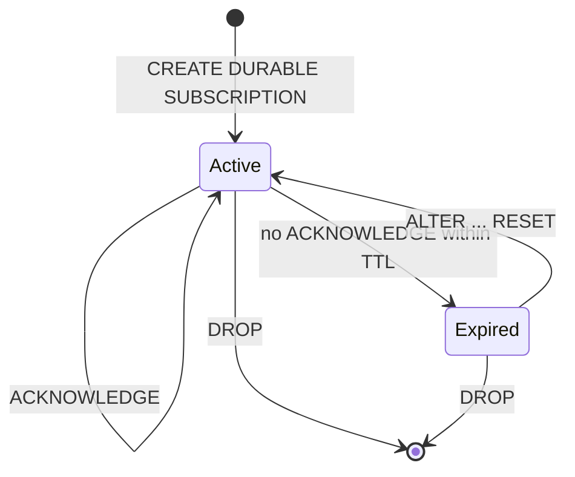

# Durable subscribe

- Associated: no tracking issue filed yet, see "Open questions".

## The Problem

`SUBSCRIBE` cannot be resumed. A client that loses its connection has no way to
continue from where it stopped, so it must re-run the subscribe and process a
fresh snapshot before it sees a single new update. The cost falls on exactly the
clients least able to absorb it, because a browser tab or an edge function
reconnects often and holds no durable local state to fall back on. This makes
reconnection a data-volume event rather than a control-plane event.

The gap is not a missing streaming mechanism. `SUBSCRIBE ... AS OF t WITH
(SNAPSHOT = false)` already expresses "give me the diffs after `t`". What is
missing is any guarantee that `t` remains readable: nothing holds the
collection's `since` on the consumer's behalf, and the default compaction window
is one second (`DEFAULT_LOGICAL_COMPACTION_WINDOW_MILLIS` in
`src/adapter-types/src/compaction.rs`). A client that remembers a timestamp and
comes back a second later finds it already compacted away.

Our own console demonstrates the workaround and its cost.
`console/src/api/materialize/SubscribeManager.ts` opens one dedicated WebSocket
per subscribe, and on reconnect it re-runs the subscribe from scratch, holding
the stale snapshot behind a `resubscribing` flag until a new snapshot completes.
The manual escape is documented in
`doc/user/content/transform-data/patterns/durable-subscriptions.md`, a shipped
private-preview feature already titled "Durable subscriptions", which instructs
users to set a `RETAIN HISTORY` duration, record progress timestamps themselves,
and resume with `AS OF <last_progress_mz_timestamp - 1>`. Every part of that is
a responsibility we are asking the client to carry, including the off-by-one.

A second problem sits underneath the first. `SUBSCRIBE` has no persisted output,
so it has no reconciliation point of the kind that makes materialized views
robust. The materialized view sink is self-correcting because it reads its own
output shard back through persist feedback into a `Correction` buffer
(`src/compute/src/sink/correction_v2.rs`) and writes only the delta needed to
make the shard match the dataflow's desired output, which is what survives
restarts and replica changes. Resume correctness for a subscribe would otherwise
rest on the client's unverifiable claim about what it holds.

## Success Criteria

* A client that reconnects within an agreed window continues from where it
  stopped, with no new snapshot and no gap.
* The server owns the resume point. A client is not required to durably remember
  a timestamp, because the clients that need this most cannot.
* History retained on a consumer's behalf is bounded, and the bound holds while
  the consumer is connected, not only across reconnections.
* The bound is expressed per consumer and does not require the consumer to
  reason about the target's refresh or ingestion schedule.
* Retention is visible. An operator can see which consumer holds history and how
  far behind it is.
* Losing the resume point is a named, loud failure. No configuration or failure
  sequence may produce a silently skipped range of updates.
* The mechanism is reachable from the transports clients actually use: the
  WebSocket SQL API, and pgwire from any mainstream driver.

## Out of Scope

* **Arbitrary SQL.** A subscription reads one collection, optionally through a
  projection and filter. See "Query scope".
* **Indexes and views as targets.** An arrangement lives in cluster memory, so
  no durable hold can be offered over it.
* **Exactly-once delivery.** See "Delivery semantics", which explains why this
  is a deliberate step back from what the manual pattern can achieve, and how
  such consumers are still served.
* **The PostgreSQL replication protocol.** `CopyBoth` is not implemented in
  `src/pgwire/`, and "Alternatives" explains why adding it would not reach most
  clients anyway.
* **Concurrent readers of one subscription.** A subscription is single-reader by
  construction.
* **Changing materialized view self-correction.** This design consumes it and
  does not modify it.
* **Fixing the as-of selection of newly created objects.** A subscription's hold
  lowers the as-of chosen for objects created later over the same inputs. This
  is a pre-existing property of as-of selection that the feature makes easier to
  trigger. See "Known quirks and interactions".

## Solution Proposal

A durable subscription is a named catalog object that holds a read hold on a
storage collection, and that the consumer advances by acknowledging what it has
committed. The hold defines a window of readable time, the consumer's
acknowledgement is what moves the window's lower edge, and a wall-clock time to
live bounds how long the window may stay open without progress. A consumer that
reconnects reads from wherever inside that window it likes, and by default from
the position the server remembers.

### Read holds and read policies

This design leans on a distinction the codebase makes in its mechanisms but has
never written down, and getting it wrong is what made the first draft of this
document unimplementable. The three concepts are:

* A **read policy** is a rule that derives a frontier from a collection's write
  frontier, re-evaluated as that frontier advances. `RETAIN HISTORY` and the
  one-second default are policies. A policy expresses "keep this much history
  behind the frontier", so it moves forward on its own.

* A **read hold** is a token, acquired by a named party at a specific frontier
  and released explicitly. `acquire_read_holds` grants one at the collection's
  current `since` and returns `Result<Vec<ReadHold>, CollectionMissing>`;
  `ReadHold::try_downgrade` moves it and can fail. A hold expresses "this party
  still needs to read from here".

* The **capability**, and therefore `since`, is the meet of the policy-derived
  frontier and every outstanding hold.

A durable subscription is a party that holds a hold. It is emphatically not a
policy, and the first draft's `ReadPolicy::ValidFrom` plus
`ReadPolicy::Multiple` composition does not work:

* `ReadPolicy::Multiple` has zero construction sites in the tree. It is an
  unexercised variant, and `Multiple(vec![])` yields an empty antichain, which
  drops the collection.
* Policy installation is a one-way ratchet. In
  `src/storage-client/src/storage_collections.rs`, the new capability is applied
  only `if PartialOrder::less_equal(&collection.implied_capability, &new_read_capability)`,
  while `collection.read_policy = policy` is stored unconditionally. Installing
  a lower frontier behind an already-advanced capability is a silent no-op, and
  the trait documentation says so: it "will not 'recover' the read capability if
  the prior capability is already ahead of it".
* The installation API cannot express it. Policies are derived from a bare
  `CompactionWindow` at every call site, and bootstrap groups collections by
  `CompactionWindow`, so there is no shape in which a per-collection constant
  frontier survives.
* Any later `ALTER ... RETAIN HISTORY`, or the periodic metrics-retention
  update, re-installs a window policy over the collection and would irreversibly
  discard the subscription's contribution.
* Policies report nothing. `set_read_policies` returns `()`, and when persist
  refuses a since downgrade the returned frontier is discarded by the caller. A
  hold, by contrast, tells you the frontier you actually got.

Holds also already interoperate with the rest of the system in the ways this
feature needs: `DROP` honors holds, and holds are deliberately acquired at the
earliest readable time specifically so that one controller can hold a frontier
back while another acquires at the same early point.

### The readable window

The subscription's durable state is a single frontier, `H`, the earliest as-of a
reader may request. The hold keeps `since <= H`, so the readable window is
`[H, upper)` and a reader may attach at any as-of inside it.

`H` is derived from the acknowledgement, and the conversion is where the first
draft was wrong. The subscribe sink decides what to emit in
`src/compute/src/sink/subscribe.rs`:

```rust
let beyond_as_of = if with_snapshot {
    as_of.less_equal(time)
} else {
    as_of.less_than(time)
};
```

Without a snapshot, an as-of of `t` emits times **strictly greater** than `t`.
So a client that has processed everything before `t` and wants to resume at `t`
must read with as-of `t - 1`, which requires `since <= t - 1`. Storing the
acknowledged frontier and converting at every use site invites exactly the
off-by-one the manual pattern documents, so instead:

**`ACKNOWLEDGE ... AT t` sets `H := t - 1`.** One conversion, in one place, at
the moment the claim is recorded. Everything downstream, the hold, the default
as-of, the window bound, and the introspection column, reads `H` directly and
performs no arithmetic.

```text
                H = ack - 1
                |
   compacted    |<------ readable window ------>|
   ------------ [ ============================= ) ------->
                                              upper
```

The two attach forms both land inside the window. `SNAPSHOT = false` with as-of
`H` yields times greater than `H`, meaning at or after the acknowledged
position, which is a gapless continuation. `SNAPSHOT = true` with as-of `H + 1`
yields a snapshot at the acknowledged position followed by later updates, which
is what a client that lost its local state needs.

A client may also pass an explicit `AS OF` anywhere in the window, with the
ordinary meaning it has everywhere else in `SUBSCRIBE`. The window is what the
hold provides, and it is provided to whoever can read the collection: a plain
`SUBSCRIBE TO <target> AS OF <x>` for any `x` in the window also works, and works
*because* a subscription is holding `since` back.

### One hold, not two

A running subscribe dataflow needs its input to stay readable, and today the
compute controller gives it a hold pinned at the dataflow's as-of that never
relaxes for the collection's lifetime. `forward_implied_capabilities` in
`src/compute-client/src/controller/instance.rs` is the only thing that would
relax it, and it returns early unless the cluster has no replicas, then skips
write-only collections with the comment "Collection is write-only, i.e. a sink."
Its own documentation names the consequence: forwarding is what "relaxes read
holds on inputs to forwarded collections, allowing their compaction".

Left alone, that defeats the feature. A client that connects once and stays
connected acknowledges faithfully, its position tracks the write frontier, the
time to live never fires, and `since` sits at its attach-time as-of forever.
Retention would be bounded only across reconnections, which is the abnormal
case.

Therefore the subscription's hold **is** the dataflow's input floor. The durable
attach installs no separate pinned hold; the dataflow reads behind the
subscription's hold, and the hold moves when the client acknowledges. This is
also why the general objection in `forward_implied_capabilities` does not apply
here. That comment worries that advancing a sink's capability could skip input
times across a replica restart, with no way to know whether the external
consumer had seen them. A durable subscription answers exactly that question:
`H` is the client's own statement about what it has processed, so restarting at
`H` is correct by construction rather than a guess.

### Object model

```mzsql
CREATE DURABLE SUBSCRIPTION <name> ON <object> WITH (TTL = <interval>);
CREATE DURABLE SUBSCRIPTION <name> WITH (TTL = <interval>) AS <select>;
```

`TTL` is required. Making it optional would mean a default of unbounded
retention, which is the failure mode this feature exists to avoid.

The object is a durable `create_sql`-based catalog item. Item kind is derived by
parsing the `create_sql` prefix via `item_type()`, so no new durable item shape
is needed for the definition itself, and `to_serialized`/`into_serialized`
return `(create_sql, global_id, BTreeMap::new())` as `Index` does. It owns no
dataflow and no compute of its own, so there is no dataflow plan to bootstrap
and no as-of to select at boot. The boot work is to re-acquire its hold.

Mirroring `Index` is right for serialization and wrong for dependencies.
`dependency_prevents_drop` in `src/sql/src/plan/statement/ddl.rs` keys off the
dependent's item type and returns `false` only for
`CatalogItemType::Index`. A new arm must return `true`, so that dropping a
target with a live subscription requires `CASCADE`. The match is exhaustive, so
omitting the arm is a compile error rather than a latent bug.

`SELECT` on the target is checked at attach as well as at create, because
privileges can be revoked while a subscription sits idle. The statement is
feature-gated, and that flag must set `enable_for_item_parsing: true`, since
bootstrap replans every durable item's `create_sql` through the planner and a
gate that is off in production would fail catalog boot.

### Query scope

The `AS <select>` form accepts a projection and filter over a single collection,
which is exactly the class that lowers to a map-filter-project pushed into the
persist read. That class needs no state, no dataflow, and no rehydration, and
therefore no reconciliation point of its own, which is what keeps it compatible
with a hold on the underlying collection. Filters and projections commute with
differencing, and a projection that collapses distinct rows merely consolidates
their diffs into a valid stream over the projected relation.

Everything else is rejected: joins, aggregations, `DISTINCT`, subqueries, and
more than one collection in the `FROM` clause. Temporal filters over `mz_now()`
are rejected too, because they are not map-filter-project, they require a
dataflow, and they restructure retractions into the far future.

The projection lives in the definition rather than being chosen per attach. Both
are sound, since `H` is a frontier on the underlying collection and any
projection over the same interval is individually correct, but definition-time
means the object fully describes its stream, introspection is meaningful, and a
client cannot change the row shape it deduplicates against between
reconnections.

An error from the projection, such as a division by zero, surfaces as a stream
error. `H` does not move, because only `ACKNOWLEDGE` moves it, so the client
reconnects into the same error until the offending data changes.

### Attaching

```mzsql
SUBSCRIBE USING DURABLE SUBSCRIPTION <name> WITH (PROGRESS, SNAPSHOT = false);
```

The form takes no target, because the object already names it. Omitting `AS OF`
resolves it from `H`, which is the intended path and the one that requires no
arithmetic from the client.

`AS OF` is accepted, with the ordinary semantics it has everywhere else in
`SUBSCRIBE`, and must fall inside the window. It exists for consumers that track
their own position and are ahead of what they have acknowledged, which would
otherwise re-receive the whole unacknowledged window on every reconnection. The
alternative of forbidding it is recorded under "Alternatives".

Keeping the ordinary semantics keeps the `-1`. Under `SNAPSHOT = false`, an
as-of of `t` emits times strictly greater than `t`, so a consumer resuming at its
committed position `T` must pass `T - 1`. This is a documented pitfall rather
than a solved problem, and it is a silent one: passing `T` skips every update at
`T`. Consumers that would rather not carry the arithmetic have a strictly safer
option, since updates carry `mz_timestamp`: omit `AS OF`, resume from `H`, and
discard everything below `T` on receipt. The failure mode of a filter is
redundant data; the failure mode of an off-by-one as-of is missing data.

`UP TO` is also accepted. It constrains the upper edge, where the
`!up_to.less_equal(time)` boundary yields a clean half-open interval and no
arithmetic trap, so a batch consumer can drain up to a timestamp, commit,
acknowledge that same timestamp, and exit.

### Snapshot on resume

**`SNAPSHOT` defaults to `false` on the durable form**, inverting the default of
plain `SUBSCRIBE`. Resuming is the whole point of the statement, and a default
that re-snapshots would make it useless without an explicit option. The
inconsistency is deliberate and worth the surprise.

The snapshot, when requested, is always taken **at the acknowledged position**,
never at the latest time. A snapshot at the latest time would leave the client
holding state at a time it has not acknowledged and cannot name, silently
invalidating its position.

That yields three modes, spanning what a resuming client can want:

* **Continue.** `SNAPSHOT = false`, as-of `H`. The client holds state at or past
  the acknowledged position and wants the diffs onward. The common case, and the
  default.

* **Reconcile at position.** `SNAPSHOT = true`, as-of `H + 1`. The client knows
  its position but suspects its state has diverged, and wants the authoritative
  state *at the position it claims* so it can compare. This is the same
  operation the materialized view sink performs against its own output shard,
  and it is readable because the hold keeps `since <= H`.

* **Restart.** `ALTER DURABLE SUBSCRIPTION ... RESET`, then attach. The client
  lost everything and wants current state. Reconciling at an old position would
  deliver historical state plus every diff since, which is strictly more work
  than a snapshot at the current time, and `RESET` already carries the right
  meaning: consent to a gap.

Three modes across two statements, with no fourth mechanism. If a client
reconciles when it meant to restart, the waste is bounded by the time to live.

`WITH (PROGRESS)` is required whenever the client intends to acknowledge. A
progress message is the only thing that establishes that a timestamp is
complete: not every timestamp produces one, and a row at time `t` does not imply
that `t` is finished. Without progress messages a client cannot compute a safe
acknowledgement at all, so this is a requirement rather than a recommendation.

**The attach must read the storage collection, not an index.** When an index
exists on the target, dataflow construction imports the index instead of the
source, which puts a compute collection in the id bundle, and subscribe
constrains its as-of by `least_valid_read()` over the whole bundle. The
subscription holds the storage `since`; the index's compute `since` follows the
one-second default, so a resume from an older position would fail with
`AdapterError::ImpossibleTimestampConstraints`. For an indexed relation, which
is the normal case for the console, that would make every resume fail. Reading
from storage is also the cheaper path, since it avoids rehydration.

Attach takes an epoch and fences any previous reader, whose stream errors out.
Fencing rather than lease expiry suits the intended clients, because a
disconnected browser tab usually leaves a half-open connection the server has
not yet noticed, and waiting for a lease to expire would make a legitimate
reconnect fail for seconds.

### Acknowledging

`ACKNOWLEDGE DURABLE SUBSCRIPTION <name> AT <timestamp>` asserts that the client
has durably processed every update at times strictly before the given timestamp,
and sets `H := timestamp - 1`.

**`ACKNOWLEDGE` must not be classified as DDL.** `must_serialize_ddl` returns
early when `!StatementClassification::from(stmt).is_ddl()`, and a DDL
classification would be actively harmful: the first acknowledgement in a
subscribe transaction would take the environment-wide `serialized_ddl` lock,
held until the transaction ends and therefore for the life of the subscribe,
blocking all other DDL; a second one in the same transaction would soft-panic.
The statement needs its own non-DDL durable write path.

`ACKNOWLEDGE` is monotone, idempotent, and non-transactional. It takes effect
immediately and is not rolled back, because the client really did commit the
data. Validation requires no stream context, which is what allows it to arrive
on any connection: the new value must be at or above the current one, and at or
below the target's write frontier. Ordering against the row stream is
irrelevant, since an acknowledgement is a claim about the client's own state.

The in-memory value is a coalescing buffer. A periodic task writes it durably
and downgrades the hold. Retained history is therefore the client's true
position plus at most one flush interval. Because the durable write is what
authorizes compaction, a lost flush costs retention, never correctness.

Cursor state lives in a dedicated durable `StateUpdateKind` rather than in
`create_sql`. Rewriting `create_sql` per flush is possible, and
`Op::AlterRetainHistory` is precedent for mutating a durable item that way, but
it would make every flush a full catalog transaction with an audit-log entry and
turn `SHOW CREATE` into a moving value. `create_sql` is a definition and `H` is
state.

At the scale this must support, the flush is the hot path. See "Scale".

### Expiry

The time to live is measured on the **wall clock**, as time since the last
acknowledgement, not as a distance between `H` and the write frontier.

Anchoring it to the write frontier fails in both directions. A `REFRESH` MV
rounds its frontiers up to the next refresh, so its lag is at least one refresh
interval even for a client that acknowledges instantly, and a correct time to
live would have to be aware of every refresh policy in the object's ancestry,
the way replica expiration computes its offset. In the other direction a stalled
source, a paused source, or a zero-replica cluster freezes the frontier, so a
frontier-anchored time to live never fires precisely when releasing the hold
matters most. A wall clock is uniform across every target type and needs no
knowledge of the target's schedule.

The last-acknowledgement wall-clock time is recorded durably alongside `H`,
which the periodic flush is already writing. Keeping it only in memory would
grant every subscription a fresh time to live on every environment restart.

On expiry the subscription is marked expired durably and only then is the hold
released. Ordering matters: releasing first and crashing before recording expiry
would leave a subscription that looks valid while `since` has advanced past its
`H`. Recording expiry first is self-healing, because an expired subscription
acquires no hold on boot. The reverse crash, a recorded expiry with the hold
still held, resolves itself the same way.

The object survives expiry, which is what makes the state reportable. Attach
fails with an error naming the subscription, the position it expired at, and the
lag that killed it. `ALTER DURABLE SUBSCRIPTION <name> RESET` re-arms it at the
current frontier, preserving identity, ownership, and grants, and making the
client's consent to a gap explicit. `RESET` on a subscription that has not
expired is an error, since it would silently fence a live reader.



Expiry is evaluated by the same periodic task that flushes, which already holds
the state it needs. Evaluating it lazily at attach would need no background task
but would never release an abandoned subscription's hold.

`CREATE` must reject a time to live below a fixed multiple of the flush cadence.
The value compared against the time to live is the durable one, which trails the
client's claim by up to one flush interval, so a time to live near the cadence
would expire clients that are acknowledging correctly.

### Delivery semantics

A durable subscription is **at-least-once**. The client commits, then
acknowledges, and a failure in between means re-delivery. Consumers must
deduplicate on the timestamp and row, and must not treat the stream as an event
log, because a resumed interval may consolidate differently than it did
originally.

This is a deliberate step back from what the manual pattern achieves, and the
existing user documentation is explicit that writing the data and the position
in one transaction is what makes that pattern exactly-once. A server-side
cursor structurally cannot offer that, because the acknowledgement is a separate
round trip after the commit.

Such consumers are still served. One that records its own committed position `T`
in the same transaction as the data keeps exactly-once, and the subscription
supplies the retention guarantee that the history back to `H` is still there. It
has two ways to skip what it already has:

* **Discard on receipt.** Resume from `H` and drop every update below `T`. Costs
  bandwidth proportional to the unacknowledged window, and cannot lose data.
* **Position the read.** Pass `AS OF T - 1`. Costs nothing, and loses data
  silently if the arithmetic is wrong.

Filtering is the better default and positioning is the better optimization. The
consumer keeps owning correctness either way, which is where it has to live,
since only the consumer knows what it committed.

### Scale

The target is one to ten thousand concurrent subscriptions, which are
**provisioned per logical consumer** and reused across reconnections, not
created per session or per page load. The distinction is load-bearing: creating
a subscription is a catalog transaction on the coordinator, and every durable
item is replanned at boot, so churn is far more expensive than population.

Three consequences for the implementation:

* **The flush must batch.** Ten thousand subscriptions flushing individually
  once a second is ten thousand catalog transactions per second, which is not
  viable. One durable write must carry many cursors, and the cadence must scale
  with population rather than being a fixed per-subscription interval.

* **The per-collection minimum must be incremental.** Recomputing a
  collection's floor by scanning its subscriptions on every flush is quadratic
  in the shared-collection case, which is the case ten thousand implies.

* **Boot cost is linear in population.** Ten thousand items add replanning work
  at startup. This is the price of the catalog-item model and the reason
  subscriptions must not be per-session.

### Observability

`mz_durable_subscriptions` reports each subscription's name, target, owner, time
to live, `H`, wall-clock time since last acknowledgement, validity state, and
the position at which an expired subscription died. The cursor rows are
available through `mz_catalog_raw`, which exposes durable `StateUpdateKind`
rows, but the lag column is not catalog state: write frontiers live in
`mz_internal.mz_frontiers`, so the relation needs a join against an
introspection source. `mz_catalog_raw` is system-user only, so the
operator-facing relation needs its own grants.

The name is deliberately distinct from `mz_internal.mz_subscriptions`, which
lists running `SUBSCRIBE` statements and is what the console and the in-tree
cancellation tests join against. A durable subscription appears in the new
relation whether or not anything is reading it. `mz_history_retention_strategies`
is the closest prior art for retention observability and the new relation should
be consistent with it.

A `parse_catalog_create_sql` arm is required. Contrary to a claim in an earlier
draft, that function has no catch-all: the match is exhaustive by design, with
the in-source rationale that "one unclassified `create_sql` takes out
`mz_objects`, `mz_indexes`, and every sibling view at once", so a new statement
variant is a compile error. The real hazard is landing in the reject group where
`Subscribe(_)` already sits, which would break every catalog view that scans
`Item` rows.

### Protocol

Which acknowledgement channel is available depends on how the client reads, and
the binding constraint is a property of the PostgreSQL protocol rather than of
any driver. During plain `COPY OUT` there is no legal frontend-to-server data
path: the protocol documentation states the frontend cannot abort the transfer
except by closing the connection or issuing a cancel request, and libpq's
`PQputCopyData` admits `COPY_IN` and `COPY_BOTH` while excluding `COPY_OUT`.
Drivers then fail in incompatible ways, from silent indefinite queueing in
node-postgres to a thread block in pgjdbc to an immediate error in pgx, asyncpg,
and postgres.js to a compile error in sqlx. Our own loop matches the constraint:
it selects on `wait_closed`, which polls socket readiness on a timer and never
reads bytes.

| Read path | Ack channel |
| --- | --- |
| `DECLARE` plus `FETCH` | `ACKNOWLEDGE` between `FETCH`es, same connection |
| Streaming `COPY OUT` | Second connection, protocol-mandated |
| WebSocket | Same connection, inbound frame |

Interleaving between `FETCH`es is reachable from every mainstream driver,
because each `FETCH` is a self-contained round trip that releases whatever
per-connection lock the driver holds, and it is already what our documentation
recommends. Naming the object is what makes the second-connection path clean:
cancellation must locate a session through `mz_subscriptions` and `mz_sessions`,
whereas an acknowledgement addresses the subscription by name.

An earlier draft claimed all three paths need `TransactionOps::Subscribe`
relaxed. They probably do not. That op is recorded only when the subscribe's
`when` is `QueryWhen::Immediately`, and a durable attach resolves an as-of, so
the durable form does not enter the gate at all. The load-bearing protocol
requirement is the non-DDL classification described under "Acknowledging".

For WebSocket the server is half-duplex per statement: `run_ws` reads one
request, executes it to completion while holding the socket, and only then reads
again, while `connection_error` writes a periodic ping without ever reading. The
minimal change is a tight allowlist rather than general concurrency: split the
socket, add one inbound arm to the subscribe loop's `select!`, and process only
`ACKNOWLEDGE` there. That arm is polled in a loop so it must be cancel-safe, and
`connection_error` doubles as the liveness prober, which wants revisiting once a
real reader exists.

### Known quirks and interactions

These are consequences of existing behavior that this design does not fix.
Documenting them is deliberate; fixing them is separable work.

* **A subscription's hold lowers the as-of of objects created later.**
  `CREATE MATERIALIZED VIEW`, `CREATE INDEX`, and `CREATE SINK` all take their
  as-of from `least_valid_read()` over their inputs, so one lagging subscriber
  makes a subsequent create backfill the whole retained history. For
  materialized views that as-of is written durably into `create_sql`. Retention
  is therefore not consumer-local, and the wall-clock time to live is the only
  thing bounding the blast radius.

* **Read-only mode and zero-downtime upgrade.** Every existing read policy is a
  function of the write frontier, which is what makes two generations agree
  without coordination; `H` is durable state, so it is the first floor two
  generations could disagree about. Concretely: `SUBSCRIBE` is permitted in
  read-only mode while a new `Plan::Acknowledge` would fall into the planner's
  catch-all and be refused, so clients would attach, stream, and have every
  acknowledgement rejected until the time to live killed a subscription whose
  client did nothing wrong. The flush and expiry task must be read-only gated,
  like every comparable periodic coordinator task. Note that the obvious gate is
  the wrong one: savepoint mode, which zero-downtime upgrade uses, reports
  itself as not read-only.

* **Name transforms and hand-maintained matches.** `src/sql/src/ast/transform.rs`
  carries several matches over statement kinds that end in `unreachable!()`, and
  the most recently added item kind is missing from one of them. These run for
  every item in a renamed schema, so `ALTER SCHEMA ... SWAP`, the documented
  blue/green cutover, panics the coordinator without a new arm.

* **Blue/green cutover is a name swap.** Ids and shards are untouched, so a
  subscription keeps streaming the decommissioned collection, and the
  documented teardown then produces exactly the "does not exist" ambiguity this
  design rejects for expiry.

* **`ALTER TABLE ... ADD COLUMN`** mints a new `GlobalId` on the same shard, and
  with `SNAPSHOT = false` there is no boundary at which to signal the arity
  change. Expiring subscriptions on the target is the chosen behavior; the hold
  itself survives.

* **Rollback ordering.** `item_type()` panics on an unknown `create_sql` prefix,
  and topological sorting parses every item's `create_sql` with `expect`. Both
  sit upstream of the feature flag, so once a single row exists, rolling back to
  a binary that predates the parser makes the environment unbootable. This is a
  release-ordering constraint, not something a test catches.

* **Empty and regressing frontiers.** The tree already carries three
  incompatible conventions for the lag of a collection with an empty upper. The
  wall-clock time to live sidesteps this for expiry, but the introspection lag
  column still has to pick one.

* **Stale as-ofs on transaction-managed tables** are supported by design but are
  not a hot path today, and read-only mode has no transaction-shard handle at
  all. Which of the logical and physical uppers acknowledgement validation
  compares against needs to be pinned down.

## Minimal Viable Prototype

The prototype is the hold path end to end against a table, with no expiry, no
fencing, no projection, and no observability. Create the object, acquire a hold
and downgrade it from a synchronously written `H`, implement `ACKNOWLEDGE` as a
non-DDL statement, and drive it from testdrive: acknowledge, restart
`environmentd`, reattach with `SNAPSHOT = false`, and assert the stream resumes
with neither a snapshot nor a gap.

That validates the four claims this design rests on and is cheapest to be wrong
about: that a hold re-acquired from durable state genuinely survives a restart
where a policy would not, that `H = ack - 1` puts the boundary in the right
place, that a non-DDL `ACKNOWLEDGE` neither deadlocks nor panics inside a
subscribe transaction, and that the attach reads storage rather than an index.
Add an index to the target as part of the test, since that is the case that
would otherwise fail every resume.

It deliberately does not validate the batched flush, the wall-clock time to
live, or the WebSocket path.

A second spike is worth running against the console, the intended first
consumer, whose reconnect logic this feature replaces: point `SubscribeManager`
at a durable subscription and delete the `resubscribing` path.

## Alternatives

**A read policy contribution rather than a hold.** This was the first draft, and
"Read holds and read policies" records why it fails: `ReadPolicy::Multiple` is
unconstructed, installation only ratchets capabilities upward, the installation
API is keyed by `CompactionWindow`, an ordinary `ALTER ... RETAIN HISTORY` would
discard the contribution, and nothing in the path reports failure.

**Resuming from `since` with no durable position.** Since compaction is monotone
and durable in persist, `since` is itself a record of progress, suggesting a
resume at `max(H, since)` with nothing stored hot. The default compaction window
is one second, so `since` records what other readers permit rather than what
this consumer consumed, and it is exact only when the subscription is the sole
reader. Worse, when the in-memory position has moved past the last flush, a
restart would resume above the durable position and skip the difference. Safe
under the commit-before-acknowledge contract, but silent.

**A duration-based floor, meaning `RETAIN HISTORY` alone.** This is the shipped
manual pattern. A duration is a guess in both directions, too short bricking the
client with no explanation and too long growing storage with no consumer to
attribute it to, and it leaves the client responsible for remembering a
timestamp. It remains the right answer for exactly-once consumers, which is why
it stays documented rather than being replaced.

**A frontier-anchored time to live.** More directly expresses "bound the
retained history", and was the first draft's choice. It requires every consumer
of a `REFRESH` MV to reason about every refresh policy in the ancestry, and it
never fires for a frozen frontier, which is when releasing the hold matters
most.

**An object owning its own query and output shard.** Self-contained, with one
`DROP` cleaning up compute, storage, and cursor together, and an unambiguous
hold because the reader is the only consumer. It duplicates compute and storage
whenever consumers share a query, and one object per consumer does not reach the
target scale.

**Cursor state in `create_sql`, or outside the catalog.** The former makes every
flush a catalog transaction with an audit entry and a moving `SHOW CREATE`; the
latter is cheapest per write but reintroduces two durable locations that must
agree on create and drop.

**Forbidding `AS OF` on the durable form.** Considered, because the `less_than`
boundary makes a client-supplied timestamp a silent-data-loss pitfall, and
because discarding on `mz_timestamp` covers the same need with a failure mode of
redundancy rather than silence. Rejected because avoiding one documented pitfall
is the only thing it buys, while the cost is real: a consumer that acknowledges
lazily would re-receive its entire unacknowledged window on every reconnection,
with no way to opt out. Two positioning conventions, an inclusive keyword for the
durable form alongside the exclusive `AS OF` elsewhere, was also considered and
rejected as worse than the pitfall, since it makes users learn a second
convention that exists in exactly one place.

**Non-exclusive readers.** Taking the maximum of concurrent acknowledgements
needs no epoch, but two readers would advance each other's floor past unread
data, which is undetectable data loss.

**Advancing the hold on expiry instead of expiring the subscription.** Reclaims
storage while keeping the subscription usable, at the cost of the client
receiving a later stream and never learning a gap occurred.

**Dropping the object on expiry.** Frees the name, but "does not exist" is
indistinguishable from a typo, so the client cannot tell it must handle a gap.

**`CopyBoth`.** The idiomatic PostgreSQL answer, with ordering for free. It does
not exist in `src/pgwire/`, we are only a `CopyBoth` client against upstream
PostgreSQL, it is absent from several major drivers and ack-only in others, and
it inherits the walsender simple-query restriction and pooler refusal.

## Follow-up work

**A consistent cut across several collections.** One subscription over multiple
collections sharing a position would deliver a resumable, consistent
multi-relation cut, which is the capability that replication slots, warehouse
change streams, and log-based consumer groups do not provide. The single-target
design here is the smaller first step, and multiple targets extend the same hold
and cursor machinery rather than requiring a different one.

**As-of selection for newly created objects.** The quirk above is worth fixing
on its own merits: a new dataflow needs a readable as-of, not the oldest
readable one.

**Relaxing sink input holds in general.** This design special-cases durable
subscriptions because their consumer's position is known. The same reasoning may
generalize to other sinks that track consumer progress.

## Open questions

* No tracking issue exists yet. One must be filed and linked above before this
  document merges.
* What are the default flush cadence, the minimum time to live as a multiple of
  it, and the dyncfg ceiling on the time to live?
* Can the durable attach be made to bypass index import cleanly, or does that
  need a change to dataflow construction? This is the one implementation
  question that could change the shape of the attach path.
* How is the wall-clock time to live evaluated across a long environment
  outage? Recording the last-acknowledgement time durably means a multi-hour
  restart expires every subscription on boot, which is defensible but should be
  a deliberate choice.
* Is `ALTER DURABLE SUBSCRIPTION ... RESET` in the first release, or is `DROP`
  and `CREATE` acceptable initially at the cost of re-granting privileges?
* Can retained bytes be attributed to an individual subscription, or only to the
  collection?
* Which upper does acknowledgement validation compare against for a
  transaction-managed table, logical or physical?
* Once the WebSocket subscribe loop has a real reader, should liveness move from
  writing pings to observing pongs?
