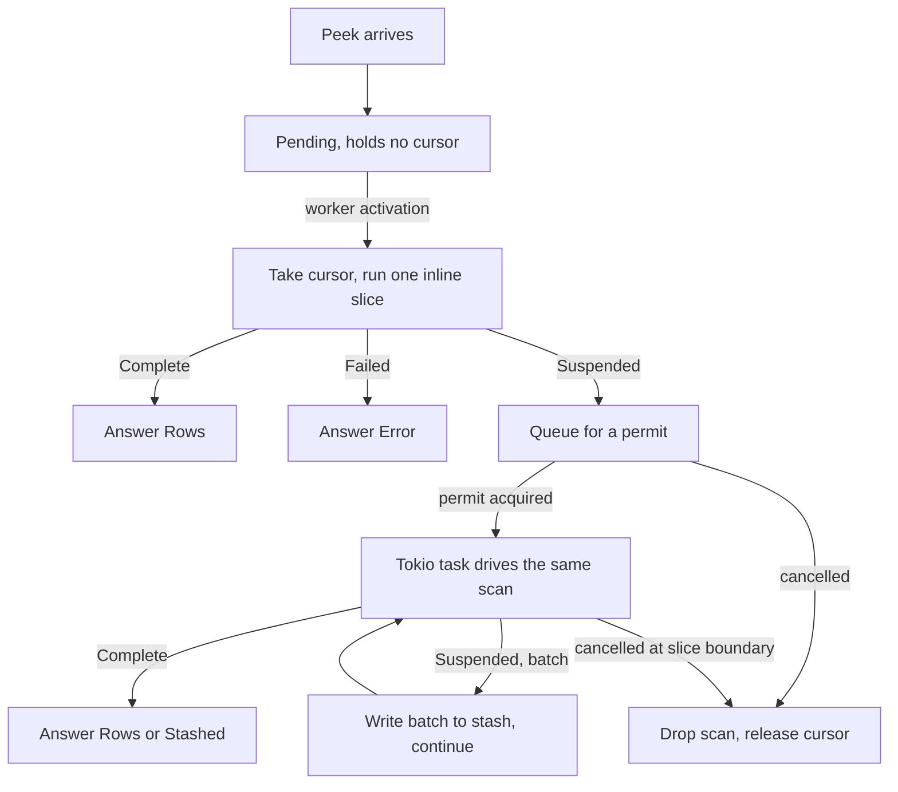

# One execution path for index peeks

- Associated:
  [CPU-217](https://linear.app/materializeinc/issue/CPU-217),
  [CPU-195](https://linear.app/materializeinc/issue/CPU-195)

Scope. This covers how a fast-path index peek's arrangement walk is executed:
where it runs, how it is bounded, how it is cancelled, and how it hands results
to the peek response stash. It does not change what a peek returns, how peeks
are planned, or how the adapter routes them. Persist fast-path peeks keep their
own path, because they read a different substrate.

## The problem

A fast-path index peek walks an arrangement cursor to collect its result. Today
that walk runs inline on the single-threaded timely worker that received the
peek, to completion, with no preemption point. A large scan therefore holds the
worker for its full duration: dataflows are not scheduled, commands are not
handled, peeks queued behind it wait, and the peek cannot observe its own
cancellation. This is the defect that three separate efforts have attacked from
three directions, and the reason to settle on one execution path before adding a
fourth.

The direct cost is head-of-line blocking, and it is measured. A point lookup
behind three concurrent scans reached 5783.7 ms; the same lookup with the walk
moved off the worker reached 180.4 ms. A skewed point lookup over a hot key was
slow on 58 of 261 samples inline, and 0 of 261 with the walk moved. Peeks
broadcast to every worker and retire only when all have answered, so one worker
holding its thread delays every peek in flight, not just the peeks behind it on
that worker.

The indirect cost is that the workarounds have multiplied. There are now three
`PendingPeek` states for one target type, two independent accumulation loops,
and two places where a walk is thrown away and restarted. Each was a reasonable
local fix. Together they are more mechanism than the problem needs, and the
combination is what this document replaces.

## What exists today

Four code paths serve or propose to serve an index peek.

**Inline walk.** `IndexPeek::seek_fulfillment` gates on frontiers, then
`collect_finished_data` scans the error trace and `collect_ok_finished_data`
walks the oks trace to completion. No budget, no preemption.

**Stash diversion.** When accumulated bytes cross
`peek_response_stash_threshold_bytes`, the walk returns
`PeekStatus::UsePeekStash` and **discards everything it accumulated**
(`compute_state.rs`, the `total_size > peek_stash_threshold_bytes` branch).
`process_peek` then builds a fresh iterator over the same trace and starts
again, which the code acknowledges: "A fresh walk over the same trace: the
iterator that produced `UsePeekStash` was consumed deciding that the result is
too big to return inline." The restarted walk becomes a `PendingPeek::Stash`,
whose rows the worker pumps across activations into a tokio upload task through
a bounded channel.

**Offloaded walk (#38429).** Takes owned cursors and walks them on a tokio
blocking task, so the serving worker is free. It pays the same restart:
`snapshot_for_offload` takes a *second* cursor up front, held for the life of
every stash-eligible peek, purely so the walk can start over on diversion.

**Cooperative walk (#38040).** Makes the inline walk resumable.
`PeekResultIterator::step(&mut fuel) -> Step` returns `Step::OutOfFuel` from
inside the scan loop, charging one unit per cursor position. This is the only
one of the four that bounds a scan against an adversarial input, and it is the
piece this design keeps.

Two observations make the consolidation possible.

**The discarded prefix was always reusable.** Stash eligibility requires
`RowSetFinishing::is_streamable`, which is `order_by.is_empty() && project ==
identity`. The accumulation loop only thins when `num_rows_needed()` is `Some`,
and for empty `order_by` that branch truncates and returns a *complete* answer
rather than continuing. So at the moment of diversion the accumulated rows have
never been sorted, thinned, or reordered. They are an in-order prefix of the
stream, and handing them onward is correct. The restart buys nothing.

**The reason for the worker pump no longer holds.** `StashingPeek` documents its
channel as necessary because "the underlying trace reader is not Send/Sync".
That is false. `TraceReader::cursor` returns its batches by value, and since the
Arc-backed production spines those batches are `Arc`s, so the pair it returns
owns what it reads and crosses threads as it stands. `PeekResultIterator<..>:
Send` is asserted in `peek_result_iterator.rs`, and `spawn_offloaded_walk`
already ships production cursors to another thread.

## Design

One scan type, driven in two placements, with the stash as a state transition
rather than a restart.



### The scan

`PeekScan` owns the oks cursor, the errs cursor, the accumulated rows, the size
accounting, and the literal state. It performs no IO and never awaits. Its
`step` returns:

```rust
enum ScanOutcome {
    /// Stopped with work left. `batch` is present when accumulation crossed the
    /// stash threshold: an in-order prefix the driver must take, because the
    /// scan cannot both hold it and keep going.
    Suspended { batch: Option<RowBatch> },
    Complete(PeekResponse),
    Failed(PeekError),
}
```

`Suspended` is one state with an independent payload rather than two variants,
because a scan can run out of budget and cross the stash threshold on the same
step. The two facts a driver needs are "it stopped" and "is there a batch to
dispose of", and those are orthogonal.

### The two drivers

**Inline.** Runs from the worker's peek processing, one slice per peek per
activation. It never inspects `batch` and never performs IO: `Complete` and
`Failed` answer directly, `Suspended` moves the whole scan to the tokio queue.
The invariant that the inline driver performs no IO is what keeps the design
free of async colouring, and it is load-bearing rather than incidental.

**Tokio.** Holds a permit, drives the same `step` in a loop, writes a batch to
the peek stash when one is produced, checks for cancellation at each slice
boundary, and yields. Because the scan survives the diversion, the stash upload
is fed by the walk that is already running rather than by a second walk.

### Placement policy

A peek runs its first slice inline with a small budget, sized so that point
lookups finish there and nothing else does. If it completes, the peek never
leaves the worker and its latency is what it is today. If it suspends, it is
measured to be expensive and moves off the critical path. Cost is measured
rather than predicted, which is what makes a skewed point lookup over a hot key
behave correctly without being special-cased: it enters as a point lookup,
overruns the inline budget, and offloads.

### Bounding concurrency

The tokio side is bounded by a replica-wide semaphore. A scan acquires a permit
before running and holds it until it completes or is dropped. Excess scans queue
in the semaphore rather than running, so a peek storm costs queue entries rather
than threads and retained batches. Permits release on drop, including on panic,
so no expiry or renewal is needed.

Two queues exist and they have different costs, which the implementation must
keep distinct. A peek waiting for its first inline slice holds only the `Peek`
itself and is genuinely free. A scan waiting for a permit holds its cursor, and
therefore `Arc` handles that pin batches against physical compaction, plus its
accumulated prefix. Taking the cursor at dispatch rather than at arrival is what
keeps the first queue free.

### Budgets

All budgets are counted in **consumed values**, meaning cursor positions
visited, not rows returned. This is not a stylistic choice. `PeekResultIterator`
loops internally when the MFP rejects a row, stepping the cursor and continuing
without returning, so a selective filter over a large arrangement produces no
rows while walking arbitrarily far. Counting returned rows yields a budget such a
peek never spends. `rows_processed` already increments per position visited,
before extraction, and #38040's fuel uses the same unit.

Time-based budgets are deliberately excluded. They are nondeterministic, make
behaviour irreproducible between runs and under load, and require a clock-read
granularity hack to be affordable. A count of consumed values is deterministic
and is the quantity that actually bounds the work.

Three parameters:

* **Inline budget**, default 1024 consumed values. How far a peek may walk on
  the worker before it is offloaded. Sized for point lookups, not for scans.
* **Yield granularity**, default 10000 consumed values. How often a promoted
  scan checks for cancellation and yields. At a plausible 100ns to 1us per
  position this bounds cancellation latency to single-digit milliseconds, while
  keeping the yield overhead immaterial.
* **Permit count.** How many scans may hold a tokio slot at once. This bounds
  retained batches and runtime threads, and is the value the queue backs up
  behind.

All three are read through handles rather than values, so a configuration change
reaches scans already in flight without discarding work they have done. This
follows #38158, which needed the same property for the same reason.

### Cancellation

Cancellation must work in five states, and the fifth is the one that needs more
than a check.

1. **Pending, pre-slice.** Removed from the pending map. Holds nothing.
2. **Mid inline slice.** The slice is bounded by the inline budget, so it
   finishes; cancellation is observed before promotion.
3. **Queued for a permit.** Leaves the queue, dropping the scan and releasing
   its cursor and prefix.
4. **Running on tokio.** Observed at a slice boundary.
   `handle_cancel_peek` removes the `PendingPeek`, which drops the result
   channel's receiver, so the scan sees a closed sender without any additional
   mechanism.
5. **Mid stash upload.** Partial batches already written to the stash shard must
   be cleaned up, or they leak blobs. This is what `StashingPeek`'s abort handle
   does today and it is the part of that type which survives.

### Literal constraints

`Literals::seek_next_literal_key` performs one `seek_key` per literal that has
no matching key, and is called both from `Literals::new` and from `step_key`.
The call from `new` is outside any budget, and the call from `step_key` is
charged one unit for the whole loop, so an `IN` list of mostly-absent values can
walk far outside its budget in both places. The fix is to pass fuel into that
loop and let it suspend mid-way. `new` then does not seek at all, because the
first `step` does it under budget.

## What this deletes

* Both restarts: `PeekStatus::UsePeekStash` as a control-flow return, and
  `snapshot_for_offload`'s spare `oks_stash` cursor.
* `PendingPeek::Stash`, `StashingPeek::start_upload`, `StashingPeek::pump_rows`,
  and its `peek_iterator` and `rows_tx` fields.
* `PEEK_STASH_NUM_BATCHES`, which is worker-pump granularity and meaningless
  once nothing pumps.
* `OffloadSnapshot` and `IndexOffloadPeek` from #38429, replaced by the scan plus
  a permit.
* The `time:` half of the yielding configuration.

`PendingPeek` ends with fewer index-peek states than it has today, not more.

## Relationship to the open PRs

This work happens in the scope of #38429. #38040 and #38158 are not merged
first and then subsumed. Their commits are absorbed into this branch with
attribution, because merging work we would immediately rewrite costs review
effort twice and leaves the tree carrying mechanism that never had a user.

**From #38040 (Aljoscha Krettek).** The budget-aware iterator:
`PeekResultIterator::step(&mut fuel) -> Step`, fuel charged per cursor position,
`Step::OutOfFuel` returned from inside the scan loop, and `next` reimplemented
over `step`. This is the load-bearing piece and it is kept close to as written.
The placement policy, the per-activation budget accounting, and the time-based
half of `YieldSpec` are not carried over.

**From #38158.** The consumed-values counter and the structured `PeekError` with
its SQLSTATE reporting and bincode mirror type. That PR deliberately stopped at
the peek stash because "a stashed peek restarts its scan ... and the restart then
charges the same rows twice". Deleting the restart is exactly what this design
does, so the work it deferred becomes trivial: the count continues because the
scan does.

Sequencing note: #38158 changes `PeekResponse::Error` into a structured type and
rewrites `merge_peek_responses` precedence. This design touches the same enum and
the same function. The protocol-level change should be settled first, and this
design's `Failed(PeekError)` assumes it.

## What is unknown

**Whether the inline budget is right.** 1024 consumed values is a starting
estimate, not a measurement. Too low and ordinary peeks pay a promotion they did
not need; too high and the worker stalls it was meant to prevent. The cheapest
experiment is a latency histogram of inline-completed peeks against consumed
values, taken on a real workload, to see where the point-lookup population ends.

**Whether peek CPU needs its own bound.** Today one blocked worker implicitly
caps peek CPU at one core per worker. Promoted scans remove that: N concurrent
scans use N cores, and the permit count is then doing load-shedding duty rather
than only memory duty. Whether that starves dataflow maintenance under a peek
storm is not known and should be measured before the permit default is chosen.

**The regression band.** A peek that overruns the inline budget by a little now
pays promotion plus a retirement step where today it finishes inline. It is
bounded by one slice plus one activation, but it is a real regression for peeks
sitting just past the budget, and its width should be measured rather than
argued.
