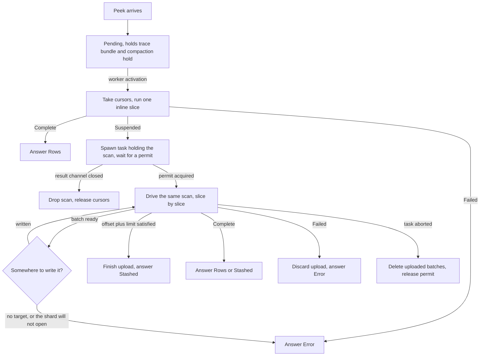

# One execution path for index peeks

- Associated:
  [CPU-217](https://linear.app/materializeinc/issue/CPU-217),
  [CPU-195](https://linear.app/materializeinc/issue/CPU-195)

Scope. This covers how a fast-path index peek's arrangement walk is executed:
where it runs, how it is bounded, how it is cancelled, and how it hands results
to the peek response stash. It does not change what a peek returns, how peeks
are planned, or how the adapter routes them. Persist fast-path peeks keep their
own path, because they read a different substrate.

## The problem

A fast-path index peek walks an arrangement cursor to collect its result. Today
that walk runs inline on the single-threaded timely worker that received the
peek, to completion, with no preemption point. A large scan therefore holds the
worker for its full duration: dataflows are not scheduled, commands are not
handled, peeks queued behind it wait, and the peek cannot observe its own
cancellation. This is the defect that three separate efforts have attacked from
three directions, and the reason to settle on one execution path before adding a
fourth.

The direct cost is head-of-line blocking, and it is measured. A point lookup
behind three concurrent scans reached 5783.7 ms. The same lookup with the walk
moved off the worker reached 180.4 ms. A skewed point lookup over a hot key was
slow on 58 of 261 samples inline, and 0 of 261 with the walk moved. Peeks
broadcast to every worker and retire only when all have answered, so one worker
holding its thread delays every peek in flight, not just the peeks behind it on
that worker.

Those figures come from a prototype that moved the walk to a second compute
runtime, measured on a personal staging region and written up in the "Interactive
read isolation" evaluation document. The stack this document heads was measured on
that region by an open-loop driver holding a fixed arrival schedule rather than a
closed loop, so the offered load does not fall as the server slows. That driver is
not in the repository, so these are one-off staging observations rather than
numbers a reader can reproduce from the tree. At 10 point lookups per second for 30
seconds behind three concurrent hot-key walks, the inline arm answered at a p99 of
5720.4 ms and exceeded 200 ms on all 300 samples, and the offloaded arm answered at
a p99 of 110.7 ms and exceeded it on none. The offloaded distribution spans 11.6 ms
from its median to its maximum, which is round-trip time and nothing else, and the
substrate counter confirms the inline arm offloaded no walk, so the control is
verified rather than assumed.

The indirect cost is that the workarounds have multiplied. There are two
`PendingPeek` states for one target type and a third proposed, two independent
accumulation loops, and two places where a walk is thrown away and restarted. Each was a reasonable
local fix. Together they are more mechanism than the problem needs, and the
combination is what this document replaces.

## What exists today

Four code paths serve or propose to serve an index peek. This section, and the
Deleted list below, describe the tree this design was written against, so the
types named here are the ones the stack replaces rather than ones a reader finds
in it today.

**Inline walk.** `IndexPeek::seek_fulfillment` gates on frontiers, then
`collect_finished_data` scans the error trace and `collect_ok_finished_data`
walks the oks trace to completion. No budget, no preemption.

**Stash diversion.** When accumulated bytes cross
`peek_response_stash_threshold_bytes`, the walk returns
`PeekStatus::UsePeekStash` and **discards everything it accumulated**
(`compute_state.rs`, the `total_size > peek_stash_threshold_bytes` branch).
`process_peek` then builds a fresh iterator over the same trace and starts
again, because the iterator that produced `UsePeekStash` was consumed deciding
that the result is too big to return inline. The restarted walk becomes a
`PendingPeek::Stash`,
whose rows the worker pumps across activations into a tokio upload task through
a bounded channel.

**Offloaded walk (#38429).** Takes owned cursors and walks them on a tokio
blocking task, so the serving worker is free. It pays the same restart:
`snapshot_for_offload` takes a *second* cursor up front, held for the life of
every stash-eligible peek, purely so the walk can start over on diversion.

**Cooperative walk (#38040).** Makes the inline walk resumable. A `PeekScan`
owns the cursor and the accumulated rows across activations, and
`PeekResultIterator::step(&mut fuel) -> Step` returns `Step::OutOfFuel` from
inside the scan loop, charging one unit per cursor position. This is the only
one of the four that bounds a scan against an adversarial input, and it is the
piece this design keeps.

Two observations make the consolidation possible.

**The discarded prefix was always reusable.** Stash eligibility requires
`RowSetFinishing::is_streamable`, which is `order_by.is_empty() && project ==
identity`. The accumulation loop only thins when `num_rows_needed()` is `Some`,
and for empty `order_by` that branch truncates and returns a *complete* answer
rather than continuing. So at the moment of diversion the accumulated rows have
never been sorted, thinned, or reordered. They are an in-order prefix of the
stream, and handing them onward is correct. The restart buys nothing.

**The reason for the worker pump no longer holds.** `StashingPeek` documented its
channel as necessary because "the underlying trace reader is not Send/Sync", on the
`rows_tx` field in `peek_stash.rs`. That is false. `TraceReader::cursor` returns its batches by value: `peek_result_iterator.rs`
defines `TraceStorage<Tr> = Vec<Tr::Batch>`, so the `(cursor, storage)` pair it
returns owns what it reads and crosses threads as it stands. #38429's
`spawn_offloaded_walk` ships production cursors to another thread on that
strength.

## Design

One scan type, driven in two placements, with the stash as a state transition
rather than a restart.



### The scan

`PeekScan` owns the oks cursor, the errs cursor, the accumulated rows, the size
accounting, and the literal state. It performs no IO and never awaits. Its
`step` returns:

```rust
enum ScanOutcome {
    /// Stopped with work left.
    Suspended,
    /// Finished. Carries the rows accumulated since the last batch was taken.
    Complete(RowBatch),
    Failed(PeekError),
}
```

`Suspended` carries no payload. A scan that suspends is not going anywhere, so
it retains its accumulated prefix and exposes it by a pull instead:

```rust
impl PeekScan {
    /// Takes a full batch if accumulation has crossed the stash threshold.
    fn take_batch(&mut self) -> Option<RowBatch>;
}
```

The tokio driver calls `take_batch` on a suspension and writes whatever it gets,
a `Complete` slice having carried its rows out in the outcome, and the inline
driver never calls it. Nothing is handed by value to a
driver that has no way to dispose of it, so "committed rows are never dropped"
is a structural property of the interface rather than a discipline each driver
has to keep. Crossing the stash threshold therefore needs no special rule
anywhere: an inline slice that crosses it, and a scan that crosses it on the
slice before it queues for a permit, both simply hold the batch until a driver
that can write it asks. The per-peek retention bound follows from the same
shape, since a scan that has a full batch to give away is one that stops
growing its prefix. It follows only for a scan that may use the stash, because a
peek carrying an `ORDER BY` or a non-identity projection fills no batch and its
prefix is bounded by `max_result_size` alone.

A scan that diverts to the stash leaves `max_result_size` behind, and that is the
point of the stash rather than a gap in the ceiling. `max_result_size` caps what
`environmentd` materializes for one query, and a stashed answer is never
materialized there: the adapter reads it back in chunks of
`compute_peek_response_stash_read_batch_size_bytes` and streams them on. The
large-result design (`doc/developer/design/20250415_large_select_result_size.md`)
names lifting that limit for streamable queries as its goal. What bounds a stashed
answer is `max_query_result_size`, which the incremental finishing applies to the
rows the client receives, after `OFFSET` and `LIMIT` and summed over the chunks.
The scan therefore measures only what it holds, which for a stash-eligible scan
never exceeds the threshold plus one row, and the controller's cross-worker check
reads the inline rows alone, as it did before this design.

`RowBatch` is a type alias for `Vec<(Row, NonZeroI64)>` rather than a newtype.
That is the item form `PeekResultIterator` already yields
(`src/compute/src/compute_state/peek_result_iterator.rs`) and the item form the
peek stash path carries at both ends of this change, the `rows_tx` channel it
deletes and the `StashUpload::push` that replaces it
(`src/compute/src/compute_state/peek_stash.rs`), so the path that moves large
volumes never converts. Conversion to `NonZeroUsize` happens only where
`RowCollection::new` (`src/expr/src/row/collection.rs`) demands it for an inline
answer, over rows that are being returned anyway, which is the conversion the
inline accumulation loop already performs per row. A newtype is not used because
the invariant that matters, that a batch is an in-order prefix of the stream, is
a property of how the rows were produced and is not something a wrapper can
enforce.

A scan that has diverted to the stash cannot build its own `PeekResponse`,
because a `Stashed` response depends on the outcome of an upload the scan does
not perform. `Complete` therefore carries the rows the scan still holds and the
driver assembles the response around them: the inline driver builds a
`RowCollection`, and the tokio driver finishes its upload and answers with the
stashed handle. That split is what keeps the scan free of IO, and it is the
reason `ScanOutcome` names rows rather than responses.

A scan has two phases, errors first and then oks, and both spend the same
budget. The error phase is not free work that can precede the budgeted part. The
walk this design replaces read the error trace inline, in a `while
cursor.key_valid(&storage)` loop with no bound: a key whose diffs cancel to zero
was stepped over rather than answered, so a trace that accumulated many such keys
was walked in full before a single ok row was read. That was an unbounded inline
stall in the same place the oks walk was one. Charging the error cursor's
positions like any others, and letting the scan suspend part-way through them, is
what removes it.

Neither phase is charged for the position on which it finds its cursor exhausted,
so a walk costs what it inspected and no more. The charge also has to be
independent of how the walk is sliced, which means every advance that can suspend
runs before the per-position charge: charging first buys a position a suspended
advance never reaches, and the resumed call buys it again. A literal seek is such
an advance, which is why a sliced walk over a literal list once cost one unit per
key transition more than the same walk run in one call.

### The two drivers

**Inline.** Runs from the worker's peek processing, one slice per peek per
activation. It performs no IO: `Complete` and `Failed` answer directly, and
`Suspended` moves the whole scan to the tokio queue. It never calls
`take_batch`, so an inline slice that crosses the stash threshold on its own,
which one sufficiently wide row is enough to do, needs no handling at all. The
batch stays with the scan and travels with it into the queue.

**Offloaded.** An offloaded scan is driven by an async task that owns a permit
and steps the scan on the blocking pool. The scan stays on its blocking thread
for as long as it has nothing to await: it drives the same `step` in a loop,
checks for cancellation and re-reads its configuration every yield granularity
of positions, and returns to the task only when it has an answer or a full
batch. The task writes the batch to the peek stash and sends the scan back to
the pool. Because the scan survives the diversion, the stash upload is fed by
the walk that is already running rather than by a second walk. The invariant
that only this driver performs IO is what keeps the design free of async
colouring, and it is load-bearing rather than incidental.

The walk runs on the blocking pool rather than on a runtime worker because a
slice is CPU-bound for its whole length, and a runtime worker held for that
long holds up the persist IO, gRPC and heartbeats that share the runtime. It
stays on its blocking thread between slices rather than returning to the task
after each one because that round trip costs two thread wakes, which on a small
machine is more than a slice of ten thousand positions. Measured on the
`FastPathFilterNoIndex` feature benchmark, a million-row walk cut into
returning slices cost 13% more than the same walk inline, and a walk that stays
on its thread 3% more. The blocking pool's size does not become a second bound
because the semaphore admits at most one walk per worker, far below the pool's
capacity, and a cancelled walk holds its thread only until its next check.

### Placement policy

A peek runs its first slice inline with a small budget, sized so that point
lookups finish there and nothing else does. If it completes, the peek never
leaves the worker and its latency is what it is today. If it suspends, it is
measured to be expensive and moves off the critical path. Cost is measured
rather than predicted, which is what makes a skewed point lookup over a hot key
behave correctly without being special-cased: it enters as a point lookup,
overruns the inline budget, and offloads.

### Bounding concurrency

The tokio side is bounded by a semaphore. A scan acquires a permit before running
and holds it until it completes or is dropped. Excess scans queue in the semaphore
rather than running, so a peek storm costs queue entries rather than threads.
Permits release on drop, including on panic, so no expiry or renewal is needed.

**Permits bound the number of running scans, and nothing else.** The bound is a
fraction of the timely workers the runtime that owns the semaphore runs, and it
defaults to one scan per worker. Today a peek that blocks its worker consumes one
core, and that coupling is the only thing capping peek CPU: the walk and the
worker share a thread, so peek CPU is self-limiting at one core per worker.
The offload breaks the coupling, and without a bound N concurrent scans would use N
cores whatever the replica's shape. One permit per worker preserves exactly the
ceiling that exists today, which is why it is the default rather than a tuned
number.

A fraction rather than a count, because a count has to be retuned for every
replica size while a fraction scales with the replica on its own. The unit admits
one scan per worker, half of it one per two workers, and the bound is floored at
one scan, since a fraction asking for less than one walk would stop every offloaded
peek rather than pacing it.

The workers it is a fraction of are the ones the semaphore reaches, and that is
decided where the semaphore is constructed: per `serve` call
(`src/compute/src/server.rs`), not per process and not per replica. A replica
spread over several processes admits the bound once per process, and a process
running a maintenance and an interactive runtime side by side builds two
semaphores and admits it once per runtime. The second is a known over-admission,
recorded where the semaphore is built, and closing it needs the bound shared
across the runtimes of a process rather than owned by one of them.

The count also meets the machine it runs on. Where the worker count equals the
core count, a saturated bound puts a CPU-bound walk on a blocking thread per
core while the timely workers and the runtime keep their own threads, so the
process is oversubscribed by the number of running walks. That is the number to
measure before the offload is armed anywhere that serves traffic.

**The permit travels with the scan, not with the `PendingPeek`.** This is an
invariant, not an implementation detail. #38429 puts the guard in
`IndexOffloadPeek::_in_flight`, which lives in the `PendingPeek`, so
`handle_cancel_peek` removing that entry releases the slot while the
`spawn_blocking` walk, which cannot be aborted once it has started, is still
running and still retaining its batches. The accounting then reports capacity
the replica does not have, and it reports it under exactly the load where the
cap matters. The permit therefore crosses to the blocking pool with the scan
and back, so that its release coincides with the release of the memory it
accounts for, and an aborted task cannot separate the two.

**Retention is monitored, not capped.** Peek memory has two components, and the
permit count bounds neither, because both scale with live scans rather than with
running ones.

* **Shared batch pinning.** A cursor holds `Arc` batches, so retention is
  proportional to the number of distinct objects peeked times the churn absorbed
  since the oldest pin. Queued scans over the same index at the same timestamp
  pin the *same* `Arc`s, so this does not scale with peek count. What it scales
  with is how long a pin lives, which is drain rate.
* **The accumulated prefix.** This is genuinely per-scan. A scan that may use the
  stash holds at most `peek_response_stash_threshold_bytes` of it plus the row
  that crossed the threshold, because crossing it leaves a batch waiting to be
  taken rather than a growing prefix, and that is a property of `PeekScan` rather
  than of a driver, so it holds for a queued scan as it does for a running one. A
  peek that may not use the stash, one carrying an `ORDER BY` or a non-identity
  projection, fills no batch: its prefix is bounded by `max_result_size` alone,
  which at the default is 1 GB. Such a peek is never offloaded for latency either,
  so what it retains it retains on the worker.

Drain rate is therefore the control on both, and the queue is observed rather
than capped. Queue depth and permit wait time are the signals, and growth in
either is what an operator alerts on. Capping retention would mean capping the
queue, and capping the queue means failing peeks, which is a worse outcome than
the residency it would avoid.

**Load shedding gets no mechanism.** Queue growth is a symptom to alert on, not
a control point to act on automatically. Rejecting a peek is user-visible, and a
design whose purpose is to stop peeks from blocking each other does not
introduce a way to fail them speculatively.

Neither retention component is a new retention class. `PendingPeek::index`
(`src/compute/src/compute_state.rs`) sets logical compaction to the peek's
timestamp and physical compaction to the empty frontier the moment the peek
arrives, so every pending peek pins today. This design changes how long those
holds are held, not whether they exist, and the honest way to state the cost is
as added residency time on a hold that already exists.

Two queues exist, and both retain. A peek waiting for its first inline slice
holds its `TraceBundle` and the compaction hold that arrival installed. A scan
waiting for a permit holds cursors over batches it has already taken, plus its
accumulated prefix. The difference is which end of the trace is pinned and for
how long, not free against costly, so the implementation must not treat the
pre-slice queue as free. After the first slice every non-trivial peek is in the permit queue, which is
the population this design exists to serve, so the pre-slice queue is expected to
be the shorter of the two. That expectation is not measured.

### Budgets

All budgets are counted in **consumed values**, meaning cursor positions
visited, not rows returned. This is not a stylistic choice. `PeekResultIterator`
loops internally when the MFP rejects a row, stepping the cursor and continuing
without returning, so a selective filter over a large arrangement produces no
rows while walking arbitrarily far. Counting returned rows yields a budget such a
peek never spends. `rows_processed` already increments per position visited,
before extraction, and #38040's fuel uses the same unit.

Budgets are count-only, and time bounds are excluded for two reasons. The first
is that under memory pressure a time budget anti-correlates with progress: one
major fault consumes the slice, so a scan completes one or two positions per
slice and pays a slice boundary once per position, while a count budget
guarantees N positions of progress however slow each one is. Flooring both budgets
and the yield granularity at one position prevents livelock, but it does not
prevent that degradation, because one position per slice is precisely what the
floor permits. The second is that a time bound at this granularity is inert rather
than weaker: in #38040's `src/compute/src/yielding.rs`, `Budget::CLOCK_INTERVAL`
is 1024, and that constant's own doc comment says a time bound cannot be observed
sooner than that many work units, because the clock is read once per interval. At
an inline budget of about 1024 positions the deadline is unreachable by
construction, and lowering the interval is not free, since it exists to amortise
the clock read over slices that can run to tens of millions of units.

The consequence is worth stating plainly rather than leaving implicit. A worker
stall under swap is bounded in cursor positions, not in wall-clock time, so a
pathologically slow slice is a pathologically slow slice and nothing caps it.
That is accepted. The peek offloads after one slice regardless of how long the
slice took, so what is unbounded is the duration of a single slice, not the
worker's availability across slices.

Four parameters:

* **Inline budget**, default 1024 consumed values. How far a peek may walk on
  the worker before it is offloaded. Intended to cover point lookups and nothing
  else, which is an estimate rather than a measurement, as What is unknown says.
* **Per-activation budget**, default 8192 consumed values, eight times the inline
  budget. What all peeks together may spend in one worker activation.
  `ActiveComputeState::process_peeks` (`src/compute/src/compute_state.rs`)
  iterates every pending peek on every activation, so a per-peek inline budget
  with no aggregate lets N pending peeks cost N times the inline budget in a
  single pass, unbounded in N. Count-only, and both counters live in one
  `InlineBudget` (`src/compute/src/compute_state/peek_budget.rs`), armed by the
  first peek of an activation that asks for a slice rather than by whoever begins
  the activation, because a peek arriving between two sweeps is granted its slice
  where it arrives and would otherwise draw on fuel nothing had read.
* **Yield granularity**, default 10000 consumed values. How often an offloaded
  scan checks for cancellation and re-reads its configuration. At a plausible
  100ns to 1us per position this bounds cancellation latency to about 10 ms. A
  check is a few loads on the thread that is already walking, so a finer
  granularity costs little. It is an upper bound rather than a period: a walk
  whose rows are bound for the stash suspends once its accumulation crosses
  `peek_response_stash_threshold_bytes`, by far the smaller trigger at that
  parameter's default, so such a walk returns to its task per batch.
* **Permit fraction**, default `1.0`, a fraction of the timely workers a compute
  runtime runs. How many offloaded scans may run at once, floored at one scan.
  Expressed as a fraction so the bound scales with the replica rather than being
  retuned per size. It bounds running scans and nothing else, and the queue that
  forms behind it is a signal rather than a second bound.

A peek passed over for want of budget is served before the peeks that were served
ahead of it, which the peeks awaiting a turn carry themselves. They are a queue:
a sweep serves it from the front and returns what it could not retire to the
back, so the order that survives a sweep is the order the next one owes, and a
peek arriving later queues behind one that has already waited. Holding them
keyed by uuid instead would let a later arrival with a lower uuid take a
passed-over peek's turn, and do so on every activation.

The peeks a driver has taken over sit in a queue of their own, because they need
opposite treatment. They draw no budget, since their work is not on the worker,
so the sweep polls all of them. The peeks awaiting a turn all draw on one
aggregate that does not refill within an activation, which makes the first peek
the budget cannot serve also the last, so the sweep stops there rather than
walking the rest of the queue to pass each one over.

The worker also has to get back to such a peek, and nothing else brings it there:
the peeks that spent the budget were answered or offloaded, and neither leaves an
activation behind. The sweep runs at the bottom of the worker loop and the loop
parks at the top of the next iteration, on the same thread, so the loop reads
whether a peek is waiting and steps without parking rather than the sweep waking a
thread that is about to step anyway.

All four are read through handles rather than captured as values, so a
configuration change reaches walks already in flight without discarding the
positions they have visited. Where each is read differs. The two budgets are read
where an activation arms its fuel, the yield granularity at every slice boundary
of an offloaded walk, and the permit fraction once, on the worker, where the walk
queues for admission rather than between its slices. Lowering the fraction
therefore takes back only the permits free at that moment, and the remainder
arrives as the walks holding them finish.

All five parameters, the switch included, are replica-scoped. Each bounds or paces
work inside a replica process and none of them changes the answer a peek gives, so
there is nothing an environment-wide pin would buy that would justify denying an
operator the per-replica targeting every other replica-scoped parameter allows. A
peek is broadcast to every replica of its cluster and the first answer wins, so a
value differing by replica does mean the same peek may walk inline on one and
offloaded on another. The two paths are required to agree; where they do not, that
is a defect to fix rather than a reason to scope the parameters coarsely.

### What it reports

A latency change on its own cannot tell the offload working apart from the
offload never having been reached, so the placement reports whether it engaged.
`mz_index_peek_walks_total` counts walks that reached an outcome, labelled by the
substrate they ended on, `inline` on the timely worker and `offloaded` away from
it. A walk cancelled before it reaches an outcome is counted on neither, which is
what keeps the two labels summing to the walks that ended.
`mz_index_peek_stashed_total` counts the walks that answered with a stash handle,
always a subset of `offloaded`, because the driver that writes to the stash is the
offloaded one.

The queue this design deliberately does not cap is instrumented instead.
`mz_index_peek_permit_queue_depth` is how many offloaded walks wait for a permit,
and `mz_index_peek_permit_wait_seconds` is how long an admitted walk waited. The
second observes only walks that were admitted, so a walk cancelled while waiting
is absent rather than reported as a long wait. `mz_index_peek_offload_seconds`
covers a walk's whole time away from the worker, the permit wait included, and
`mz_index_peek_total_seconds` covers one visit on the worker, so an offloaded peek
contributes its inline slice to the second and everything after it to
the first. Sustained growth in the depth or the wait is what says the drain rate
is too low, and it is the alert this design asks for in place of a cap.

The phase histograms carry over, and the offload changes what they measure. The
error scan, row iteration and result sort timers each sum the slices a walk was cut
into, so they exclude the gaps between those slices, and for an offloaded walk they
mix the worker's time with the task's, because the slices before the offload ran
on the worker. Cursor setup is the exception: the ok cursor is opened once, where
the scan is built, which is always on the worker.

### Cancellation

Cancellation must work in four states. A cancellation that lands mid inline slice
is not among them: the slice is bounded by the inline budget so it finishes, and
the worker inserts the offloaded peek and returns within the same turn, while
`handle_cancel_peek` runs only on the next command drain. Such a cancellation
therefore arrives in state 3 or 4 rather than in one of its own.

1. **Pending, pre-slice.** Removed from the pending map, which drops the trace
   bundle and its compaction hold.
2. **Queued for a permit.** Leaves the queue, dropping the scan and releasing
   its cursors and prefix.
3. **Running on tokio.** `handle_cancel_peek` removes the `PendingPeek`, and
   dropping it drops `OffloadedPeek::_abort_handle`, which aborts the task and
   with it the scan, the cursors the scan holds, and the permit that admitted it.
   That is the mechanism, and it usually stops the walk before its next slice
   boundary. The closed result channel backs it up rather than driving it: the
   removal also drops the channel's receiver, and a walk that reaches a slice
   boundary first sees the closed sender and returns, which is the same path a
   walk still waiting for a permit takes out of state 2. Both reach the same
   deletion of whatever the upload holds, which is why neither needs mechanism of
   its own.
4. **Mid stash upload.** Partial batches already written to the stash shard must
   be deleted, or they leak blobs. `impl Drop for StashUpload` does that by way of
   the same routine `StashUpload::discard` calls, scheduling the deletion on the
   runtime rather than awaiting it, which is what lets a
   cancelled walk reclaim its parts at all, because an aborted task is dropped
   rather than polled again. The cost is real. Persist hands back a deletable
   handle only by finishing the batch, so a builder holding buffered rows writes
   them out before the delete removes them again, and a builder flushes only at
   `persist_blob_target_size`, 128 MiB by default. The walk's permit is released
   when the walk returns rather than when the deletion completes, so nothing
   bounds how many abandoned uploads carry a part at once, and PER-70 tracks the
   persist-side teardown that would reduce this to a delete and nothing else.

   Two gaps stay open. A replica that dies mid-upload, or one whose runtime is
   already shutting down, leaves its parts behind, and so does a stashed response
   dropped after its walk finished, because a finished batch belongs to the
   response rather than to the upload and rebuilding a deletable batch from it
   needs a `WriteHandle` the task does not hold. Both need a reader-side sweep or
   persist's own garbage collection.

### The answers a failure produces

Two cases that should not happen are answered rather than asserted, because the
alternative to an answer is a peek that waits forever on a walk that has stopped.

An offloaded task that ends without sending drops its result sender, and the worker
polling an entry that is still in its map reads that as a task that died. It
answers the peek with an error and soft-panics, so a panicking walk fails one
query in production and fails the test suite. A walk dropped by a shutting-down
runtime arrives at the same arm, where the log line is noise because the worker is
going away too, and staying silent instead would hide the panic in the case that
matters.

A walk whose scan offers a batch while holding no stash target answers with
`NO_STASH_LOCATION`. It is unreachable by construction, since a target is supplied
exactly where the scan was opened stash-eligible and a scan that is not
stash-eligible offers no batch, and it is answered for the same reason as the
first.

### Literal constraints

`Literals::seek_next_literal_key` performs one `seek_key` per literal that has no
matching key, and was called both from `Literals::new` and from `step_key`. The
call from `new` sat outside any budget, and the call from `step_key` was charged
one unit for the whole loop, so an `IN` list of mostly-absent values could walk far
outside its budget in both places. #38040's `PeekScan::new` documents the first
half of this in a NOTE and leaves it unbudgeted. The fix is to pass fuel into that
loop and let it suspend mid-way, which makes `Literals` a fuel-carrying state
rather than a constructor-time computation. `new` then does not seek at all,
because the first `step` does it under budget.

The literals a peek carries have to be distinct, which the optimizer guarantees
(`mz_transform::literal_constraints`). `seek_key` seeks forward only, so a
repeated literal would seek to the same key twice and return its rows twice.

## What this changes

Deleted:

* The restart: `PeekStatus::UsePeekStash` as a control-flow return. #38429's spare
  `oks_stash` cursor goes with the proposal it belongs to rather than with this
  stack, which never had one.
* `PendingPeek::Stash`, `StashingPeek::start_upload`, `StashingPeek::pump_rows`,
  and its `peek_iterator` and `rows_tx` fields.
* `mz_stashed_peek_seconds`, which timed the worker pump's upload and has nothing
  left to time. It is a user-facing metric, so it leaves
  `doc/user/data/metrics.yml` with the code that reported it.
* `PEEK_STASH_NUM_BATCHES`, which is worker-pump granularity and meaningless
  once nothing pumps, and `PEEK_STASH_BATCH_SIZE` with it. That one counted rows
  rather than bytes, and the upload now takes a batch whenever the scan's
  accumulation crosses `peek_response_stash_threshold_bytes`, so nothing reads a
  row count and turning it would do nothing.
* `OffloadSnapshot` and `IndexOffloadPeek` from #38429, replaced by the scan plus
  a permit. #38429 is unmerged, so these are a proposal this design supersedes
  rather than code the stack removes, and the same holds for the inflight cap it
  proposed alongside them.

Added:

* `RowBatch`, a type alias for `Vec<(Row, NonZeroI64)>`. It names a unit the
  code already moves rather than introducing one.
* An incremental stash-upload handle. `StashingPeek::start_upload` builds its
  own `PeekResultIterator` over the trace bundle and depends on the worker
  calling `pump_rows` to feed the channel `do_upload` drains. The replacement
  takes batches from the driver of a scan that is already running, so the upload
  no longer owns a walk of its own. `do_upload`'s `max_rows` early exit does not
  carry over: the limit belongs to the scan, which holds the finishing and
  produces the rows, so the scan ends the walk where the offset plus limit is
  reached and the upload writes whatever it is handed.
* The semaphore bounding offloaded walks, and the queue behind it.
* A fuel-carrying `Literals` state, so the seek loop can suspend.
* Seven dyncfgs against two removed, so five more than today. The offload brings
  five, the switch and the four parameters above, all of them replica-scoped. The row-iteration limit under it
  brings `enable_compute_peek_row_iteration_limit` and
  `compute_peek_row_iteration_limit`. Removed are `PEEK_STASH_NUM_BATCHES` and
  `PEEK_STASH_BATCH_SIZE`.
* Blob cleanup for a cancelled upload, per cancellation state 4.
* The substrate counters, the permit queue gauges and the offload timer described
  under What it reports. They are what distinguishes the offload working from the
  offload never having been reached, which a latency change alone cannot do.

`PendingPeek` ends with as many index-peek states as it has today, `Index` and
`Offloaded` where there were `Index` and `Stash`, rather than the three a peek
would have under #38429. The mechanism it sheds is larger than the mechanism it
gains. That is the trade the design is making, and it is only worth making if the
result is reversible.

**Kill switch.** `ENABLE_INDEX_PEEK_OFFLOAD`, which #38429 proposes under the
same name, is the rollback path. It is a parameter this design adds rather than
one it keeps, because #38429 is unmerged. It gates the offload for latency and only
that. With it off the inline driver runs a scan until it answers, so a peek that
answers inline runs where it does today and no peek is offloaded for outrunning a
budget.

A scan that suspends because its accumulated rows have grown into a batch bound
for the peek stash is offloaded whichever way the switch is set. The tokio driver
is the one that writes to the stash, so a worker that kept such a scan would hold
one that makes no progress until its batch is taken and would answer the peek
never. Since the restart is deleted, withholding that offload is a functional
regression rather than a change of placement: the stash exists to keep huge
responses off the wire, and off would leave a large streamable peek no route to
it. The switch therefore guarantees that an ordinary peek runs where it used to,
and it must not be documented as a guarantee that no peek leaves the worker.

It does not restore the deleted restart or the deleted types, so the rollback
covers placement only, and a defect in the scan itself is not covered by it. A
design that deletes the mechanism it replaces has no rollback unless one is
named, so it is named here rather than left to the implementation.

The stash transition is outside that rollback in the other direction:
`enable_compute_peek_response_stash` defaults on, so the one-walk stash reaches
every replica whether or not the offload is armed, and turning that parameter off
is not a revert but a change of answer, since a result too large to return inline
then fails on `max_result_size` instead of being stashed.

## The stack

Seven layers, bottom to top. The first two have merged.

* `peek/fueled-iterator` (#38505, merged). #38040's
  `PeekResultIterator::step(&mut fuel) -> Step`.
* `peek/structured-errors` (#38506, merged). #38158's row iteration limit and the
  `PeekError` type it carries.
* `peek/bounded-scan` (#38507). The parts of a walk that sat outside any budget,
  the error trace scan and the literal seek, brought inside one.
* `peek/scan` (#38508). One budgeted scan answering a peek, and the accumulation
  loops it replaces removed.
* `peek/offload-driver` (#38509). The offload, the permit, the tokio driver and
  the switch.
* `peek/stash-transition` (#38510). The stash as a state transition of that scan
  rather than a restart of it.
* `peek/design` (#38449). This document, on top rather than underneath, because
  its Added and Deleted sections describe the end state the layers below reach.

#38158 is absorbed rather than merged separately. It is unmerged upstream, and the
`PeekError` type it introduces is what the `Err` side of a finished `ScanOutcome` assumes,
so carrying it as a layer of this stack is what lets every layer above it name a
structured error at all. Its `merge_peek_responses` precedence is the one this
design inherits rather than rewrites.

**From #38040 (Aljoscha Krettek).** One commit, 18 files, +1324/-324. It already
contains `src/compute/src/compute_state/peek_scan.rs` with a `PeekScan` and a
`ScanOutcome`, a shared `src/compute/src/yielding.rs` holding `YieldSpec` and
`Budget`, a rewire of `src/compute/src/render/join/linear_join.rs` onto that
module, clusterd-test-driver support including a `peek-count` script command,
and a `peek_yielding.spec` suite. The load-bearing pieces this design keeps
close to as written are `step(&mut fuel)` charging one unit per cursor position
and the nested per-peek and per-activation budgets. No guard that a slice advances
the cursor at least once exists, and none is added. A scan handed no fuel suspends
without walking anywhere, and what keeps that from offloading every point lookup is
flooring both budgets and the yield granularity at one position.

The `yielding` module extraction is deliberately not taken. Its distinctive
content is the time half, a count-only peek path needs a `usize` it decrements,
and `linear_join` already owns that type. Extracting a shared module would add
an abstraction for a sharing relationship this design removes.

**From #38158 (Aljoscha Krettek).** The consumed-values counter and the
structured `PeekError` with its SQLSTATE reporting and bincode mirror type. That
PR deliberately stopped at the peek stash because "a stashed peek restarts its
scan ... the restart makes that count charge the same rows twice". Deleting the restart
is exactly what this design does, so the work it deferred becomes trivial: the
count continues because the scan does.

## What is unknown

**Whether the inline budget is right.** 1024 consumed values is a starting
estimate, not a measurement. Too low and ordinary peeks pay an offload they did
not need. Too high and the worker stalls it was meant to prevent. The cheapest
experiment is a latency histogram of inline-completed peeks against consumed
values, taken on a real workload, to see where the point-lookup population ends.

**The regression band.** A peek that overruns the inline budget by a little now
pays an offload plus a retirement step where today it finishes inline. It is
bounded by one slice plus one activation, but it is a real regression for peeks
sitting just past the budget, and its width should be measured rather than
argued.

**What the queue actually retains.** The two-component model above says pinning
scales with distinct objects peeked and churn absorbed rather than with peek
count, but the churn term is workload-dependent and unmeasured. Drain rate is
the control, so what a real churn rate turns into resident bytes has to be
quantified before queue depth and permit wait time can be given alert
thresholds. Until then the memory story is a model, not a bound.

**What the per-activation budget should be.** That an aggregate is required is
settled, and its default is eight times the inline budget, so a burst of eight
point-lookup-sized peeks is served in one activation. The ratio is a choice rather
than a measurement. It trades how quickly a backlog drains against how long one
activation withholds the worker from everything else it serves, and it is easy to
get wrong in a way that shows up only under a peek storm.

**What is left of stash blob cleanup.** Writer-side deletion is decided and
described under cancellation state 4. What stays unresolved is the part a writer
cannot reach, a replica that dies mid-upload and a stashed response dropped after
its walk finished, both of which need a reader-side sweep or persist's own garbage
collection. The writer-side path also pays a 128 MiB flush to earn the handle that
deletes, which PER-70 tracks.

**Whether the kill switch is a sufficient rollback.** It reverts placement, not
the deleted restart, so it does not cover a defect in the scan itself. Whether
that residual risk is acceptable, or whether more of the old path has to survive
behind the flag for one release, should be settled before the deletions land.
