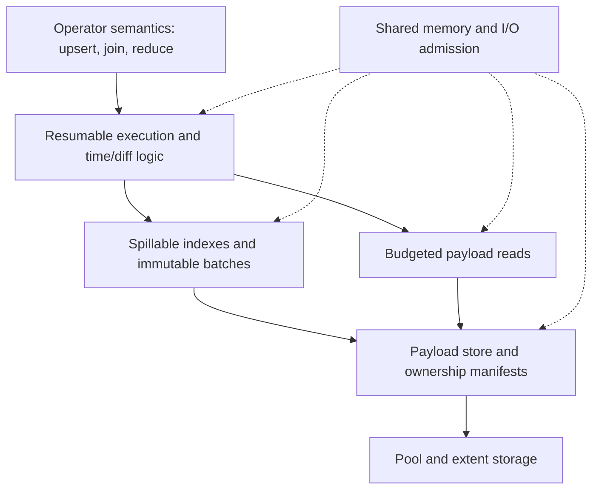

# A shared model for out-of-core operators

- Status: discussion draft, September 8, 2026. Interfaces and rollout gates below are proposals.
- Related: [Buffer-managed dataflow state](20260610_buffer_managed_state.md).
- Related experiment: [upsert hydration optimizations, PR #38719](https://github.com/MaterializeInc/materialize/pull/38719).

## Proposal in brief

Separate operator state into immutable payload storage and a spillable index of
keys, handles, timestamps, and differences. Execute operators through resumable,
budgeted work units that request payloads only when their semantics require them.
Reuse Differential's time and difference machinery where possible, including the
boundary demonstrated by `int_proxy`.

Upsert is the first consumer. Equijoin is the second design and implementation
check. Neither storage nor scheduling should know about source offsets,
latest-value selection, join predicates, or a particular reduction function.

The central hypothesis is that moving compact metadata through repeated merges,
while keeping payload blocks independently owned, reduces byte amplification.
Whether this improves elapsed time depends on the additional lookup, equality,
fragmentation, and payload-read costs. We will measure those costs separately.

## The problem

Our chunked state paths can repeatedly serialize, copy, compress, and decompress
wide rows while sorting or merging updates. Much of that work is needed to move
state through the representation, even when the operation only needs a key,
timestamp, or source ordering field to make its decision.

The existing pool controls chunk residency. It does not by itself separate payload
lifetime from merge lifetime. Smaller chunks, tighter admission, direct compressed
output, and offloaded reads improve the current representation. A shared operator
model should also let a merge keep a payload reference instead of rebuilding the
payload at every generation.

This is broader than upsert hydration. Joins need to find matching groups and
materialize selected pairs. Reductions need to replay histories and reconcile
outputs. All need progress tracking, bounded staging, storage ownership, and an
execution path that can wait for unavailable data without blocking a worker.

## Success criteria

- Upsert and equijoin share payload storage, ownership, memory accounting, and
  read scheduling. Their semantic rules remain in their operator implementations.
- A metadata merge can retain live payloads without decoding or rewriting them.
  Repacking payload blocks is separately scheduled and measured.
- Payloads, indexes, handle translation, ownership metadata, staging, and queued
  work have explicit memory charges. Increasing state beyond the budget does not
  introduce an unbounded resident table of row handles or block descriptors.
- Supported operators make progress under a small budget, including with skew,
  slow reads, output backpressure, cancellation, and concurrent consumers.
- Results and progress agree with existing operators under arbitrary valid
  batching, retractions, timestamp order, compaction, and restarts.
- Deep-state workloads improve without an unacceptable resident-state penalty.
  Proposed acceptance thresholds appear under measurement, rather than assuming
  that fewer copied bytes guarantee faster queries.

## Scope

This proposal covers recreatable local operator state. Persist remains the durable
source of recovery. Local handles do not become part of persisted records or the
wire protocol. Crossing a process boundary materializes or explicitly transfers
owned data rather than sending a process-local handle.

We will preserve existing in-memory implementations during evaluation. Converting
all operators, implementing a new durable store, and selecting a particular kernel
async I/O API are outside the first delivery. General reduction remains a design
requirement, but arbitrary reduction callbacks do not automatically acquire a
bounded-memory implementation through this interface.

## What int-proxy contributes

Differential's `int_proxy` tactics exchange consolidated presentations of:

```text
((key_hash: u64, value_id: u64), time, diff)
```

The tactic performs the time and difference computation. The backend interprets
values and constructs outputs. A join returns matched IDs with joined times and
multiplied differences. A reduce asks the backend for corrections at the times
that require reconciliation.

The two integers have different contracts. `key_hash` partitions independent
work, but collisions are allowed. `value_id` identifies data within the backend's
presentation. Distinct logical data in the same hash group must remain distinct,
and equal data must be presented consistently wherever cancellation is required.
Input and output presentations can have separate ID namespaces.

The local reference reduce backend assigns IDs per window and resolves them
through row vectors. It still clones rows and emits ordinary row batches. The
proxy interface therefore demonstrates a separation of responsibilities, not a
ready-made payload store or an out-of-core guarantee.

Two constraints matter for this design:

1. The callbacks are synchronous. A cold read cannot simply become an `await`
   inside the existing tactic protocol.
2. The reduce window contract requires a complete key-hash group in the window
   that first reports it. A window target does not bound a single enormous group.
   Its novel time support must also survive consolidation: even an update that
   cancels against history can introduce a time requiring reconciliation.

Reference code is in the sibling Differential repository under
`differential-dataflow/src/operators/int_proxy/{mod,reduce,join,vec_backend}.rs`.
This draft describes that local implementation. Materialize currently locks
Differential 0.25.1, whose proxy API must be reconciled with the local work before
integration. Names and signatures here are illustrative, not a compatibility claim.

## Architecture and ownership boundaries



### Payload storage

Store immutable row blocks independently of index batches. A block includes its
record boundaries and encoding information. The store supports batched resolution
of row handles, allowing requests to be grouped by block and decoded together.
The first implementation should reuse the pool's codecs and extent machinery.

Reads initially return owned, budgeted decoded buffers. References into a decoded
buffer are scoped to a read lease. This follows the pool's current copy-out model
and avoids requiring a redesign around borrowed pointers into evictable slots.
A lease retains both the bytes' memory charge and ownership of the source needed
by an unfinished read. Callers cannot retain a naked row reference after the
lease expires.

Block size is a policy choice, separate from index chunk size. Smaller blocks
reduce sparse-read amplification but add metadata and can weaken compression.
Benchmark several sizes rather than baking the upsert workload's preferred size
into the interface. Oversized individual rows require a charged exceptional path
or streaming support, never an unaccounted allocation.

### Identity: handles need not be integers

Use distinct types for storage identity and presentation identity:

| Identity | Meaning | Lifetime |
| --- | --- | --- |
| `RowHandle` | Locates a stored row within a store namespace | While owning batches or read operations retain it |
| `ProxyId` | Identifies semantic data in an operator presentation | Until that presentation's work and output translation finish |
| Group key | Defines independent semantic work | Defined by the operator and its index |

A candidate `RowHandle` representation is `(block_id, row_slot, generation)`.
Moving a block between resident memory and an extent changes its location, not
its identity. Generation checks prevent stale handles from resolving to reused
storage. The store namespace is supplied by the owning batch or execution context.

The current proxy bridge requires `u64`, but the design does not require every
identity to be a `u64`. A backend can translate storage handles to dense integer
IDs for a bounded window. We should keep that adapter before generalizing the
upstream tactic's types unless two consumers demonstrate a need for the latter.
A handle's numeric order does not imply row order.

Physical identity is also not semantic equality. Two independently ingested equal
rows can have different handles. Exact consolidation needs an equality mechanism:
for example, a fingerprint to find candidates followed by byte comparison, with
consistent proxy IDs assigned to equal data during presentation. Fingerprints
alone are insufficient. Such lookup state must be budgeted and spillable too.

Do not require global interning of all live rows. Window-local canonicalization
and merge-time equality resolution are the starting point. Operators can exploit
stronger local knowledge, such as an already-owned output being reused, without
making that knowledge a storage requirement.

### Indexes and batches

An index entry carries the fields required for navigation and operator decisions,
plus references to payloads. Field projection belongs to an index layout or
operator backend. The storage layer does not assume a fixed tuple containing
upsert-specific ordering information.

Keys can themselves be wide. A hash or compact prefix may identify candidate
groups, but exact key comparison can require payload reads. The execution protocol
must permit these reads during navigation and consolidation, not just at final
output. Likewise, a reducer that requires value ordering cannot sort opaque
handles and assume the order matches values.

Index chunks, fences, equality indexes, and manifests must support external
storage. Resident roots and caches have byte budgets. Existing merge machinery
can be reused where it operates on the chosen compact representation. Comparator
or equality paths requiring cold data need an explicit suspend/resume boundary.

### Ownership and reclamation

A `RowHandle` is a locator, not an owning reference. An immutable batch manifest
owns the payload blocks its entries reference. Active reads and unpublished output
builders acquire ownership too. Prefer ownership per block or segment over an
atomic reference count for every row copy.

Publishing an output batch must establish its manifest's ownership before input
ownership is released. Cancellation discards unpublished output and releases its
ownership. Dropping a batch releases references incrementally, with pending
release work charged and able to yield. A block is reclaimable only when no
published batch, builder, or active read owns it. A timestamp frontier alone is
not a reclamation proof.

Coarse ownership can retain mostly dead blocks. Repacking live rows is a separate,
budgeted maintenance operation that creates new blocks and rewrites affected index
references. Old batches and active readers continue to own old blocks until they
retire. Do not introduce an unbounded per-row forwarding map to hide relocation.
Measure the temporary double ownership and charge the rewrite's scratch space.

The ownership manifest and block directory are substantial parts of the work.
Retaining one always-resident `Arc<ChunkHandle>` per live block merely moves the
scaling limit. A production design needs paged directory/ownership metadata,
bounded resident roots, and a way to retire metadata without loading an entire
batch manifest. The current pool API may need extensions at this boundary.

## Execution, progress, and budgets

The execution unit is a continuation with explicit input ownership, progress
holds, and a bounded working set. Its conceptual protocol is:

```text
advance(work_budget)
    -> need_reads(read_set, continuation)
     | produced(output_batch, continuation)
     | yield(continuation)
     | complete
     | error
```

These are protocol outcomes, not proposed Rust signatures. Metadata and payload
reads use the same admission rules. A ready-data step is synchronous and bounded
by bytes or work, with a separate fairness limit so a long CPU-only step yields.
Output backpressure suspends execution without accumulating unlimited ready output.

The driver reserves decode/output memory and I/O capacity before issuing a read.
Completed buffers remain charged until consumed, including while the worker is
busy elsewhere. A limit on running reads alone is insufficient. Several operators
share process-level admission, with per-consumer fairness and an allowance for
work that releases memory. An operator must not hold the whole budget while
waiting for an additional allocation needed to make progress. The prototype must
exercise this deadlock case and establish a reservation/release discipline.

No pool locks, borrowed cursors into mutable state, or uncharged buffers may cross
a suspension. Cancellation retains a running job's lease and permit until that
job actually finishes, then releases them even if its consumer disappeared.
Storage errors invalidate the work and are surfaced through the operator's error
or restart path. Partially built output is not published as a completed batch.

Suspension must preserve Differential's time semantics. Work retains capabilities
or equivalent holds for every timestamp at which it can still emit. A yield or
pending read must not advance the output frontier. Publication and continuation
updates must avoid duplicate output when work resumes. Partial-order timestamps,
compaction, and novel time support remain the responsibility of the time/diff
machinery and its adapter, rather than the payload store.

Time/diff bookkeeping is part of the budget too. Replay histories, pending-time
schedules, and retained presentations must be spillable or have an explicit
admission bound. The tactic's existing resident pending-time map cannot be treated
as free metadata. Any bound must preserve required times and holds, using
backpressure or external state rather than dropping work. This is a dependency of
the resumable tactic design, not something the payload store can solve alone.

There are two integration options: prepare a bounded, fully resident presentation
before invoking a synchronous tactic, or make tactic execution resumable. The
first is useful for a prototype, but cannot provide the complete contract for
large groups or payload-dependent comparisons. The target design requires a
resumable path. We should upstream the smallest suitable execution boundary
rather than duplicate Differential's time logic in each backend.

The initial I/O implementation can offload swap faults and decoding to a bounded
blocking executor. It does not guarantee fault-free worker execution, and it is
not native asynchronous file I/O. The same request/continuation contract should
permit a later file-extent implementation without changing operator semantics.

## Large groups and operator contracts

A hot key can exceed any window budget. Different operators need different
strategies, and declaring an arbitrary split into independent windows is incorrect.

| Consumer | Small representation | Payload access | Large-group strategy |
| --- | --- | --- | --- |
| Upsert | Key, time, source order, optional row handle | Equality and old/new rows needed for output | Stream latest-update selection while preserving the existing feedback and frontier rules |
| Equijoin | Key projection/hash, row handles, time, diff | Exact key checks, predicates, output construction | Block both sides, retain resumable history, and stream matches under output backpressure |
| Threshold or aggregatable reduce | Group identity, value identity or sufficient aggregate, time, diff | Depends on equality and aggregate semantics | Use valid partial state or spillable histories |
| General reduce | Group and value references with histories | Potentially all values in semantic order | Require a streaming callback or external intermediate state; an arbitrary slice callback has no bounded-memory guarantee |

Upsert's source stash can select by source order without reading every row.
Its feedback state still requires exact row identity for retractions and
consolidation. Equality reconciliation after persist readback must not assume
that a deserialized row preserves its former local handle.

Equijoin must enumerate all valid matches even when output greatly exceeds input.
That cost cannot be removed by proxies. Blocking may require rereading one side,
so we must measure actual read amplification and scheduler fairness.

These two consumers should use the same lower layers. If implementing equijoin
requires a second payload store or ownership mechanism, the proposed abstraction
has not met its purpose.

## Minimal viable prototype and delivery

This document precedes a prototype so we can agree on the ownership and execution
boundaries before implementing them. No performance gains from this representation
have been measured yet.

1. Build a small shared store/index experiment with a deliberately tiny budget,
   duplicate logical rows at different handles, asynchronous reads, and cancellation.
   Exercise both an upsert-like selector and an equijoin over it. Keep the interfaces
   provisional until both work. A fully resident metadata directory can be used to
   establish mechanics, but cannot satisfy the out-of-core acceptance gate.
2. Implement spillable metadata and manifests, exact equality reconciliation,
   reclamation, large-group continuations, and publication/progress invariants.
   Demonstrate budget and liveness properties independently of hydration speed.
3. Integrate upsert while preserving its existing time and feedback semantics.
   Compare against v1 and the measured optimization stack. Keep persisted and wire
   representations unchanged so a fresh replica can select either implementation.
4. Integrate equijoin using the same store, admission, and ownership APIs. Validate
   skew and output backpressure. Use a reduction consumer to settle remaining
   value-order and large-group interface questions before claiming broad support.
5. Roll out per consumer behind flags. Production defaults off, test/CI defaults
   on for supported paths. Check small-state overhead and deep-state behavior before
   increasing exposure. Rollback recreates local state from persist rather than
   converting live handles between formats.

## Correctness and measurement

Correctness testing compares output updates and progress with existing operators,
including product timestamps with incomparable elements. Vary input batch order,
negative differences, frontier advancement, compaction, empty inputs, deletion,
and duplicate rows. Force hash collisions and separate physical copies of equal
data. Preserve the case where novel input cancels against history but still
introduces a time requiring reconciliation.

Storage and scheduler tests cover eviction during reads, cancellation before and
after submission, delayed completion, stale handle generations, output publication
before input release, repacking while old batches remain live, scratch exhaustion,
and injected read failures. Run with budgets smaller than a group and with two
competing consumers. Verify both progress and eventual release of charges.
Restart tests reconstruct state from persist and verify that no local handles leak
into durable or exchanged data.

Use the spec-sheet persisted-seed workflow for upsert hydration: load once, stop
the writer, and recreate a replica for each variant. Record the exact image,
configuration, seed shape, worker count, CPU, memory, and usable scratch/swap.
Compare the current optimized representation with the proposed one on the same
build where possible. Keep a v1 control, but do not make v1 parity the only success
criterion for a shared framework.

Measure equijoin separately with fixed input/output cardinalities, selective and
dense matches, skew, and wide join keys. Add steady-state update/retraction runs
and concurrent consumers. The first upsert screening replica has one worker and
half a CPU; it cannot establish production concurrency or scheduling behavior.

Sweep payload width, actual compressibility, state-to-budget ratio, update density,
key skew, worker/core ratio, and payload block size in stages rather than running
an undirected Cartesian product. Include resident-state controls and poorly
compressible data. Randomize or counterbalance variant order, retain failed runs,
and repeat enough trials to report variation rather than one timing.

Collect elapsed time, CPU, worker scheduling delay, time waiting for reads, decode
time, peak RSS, swap, and all memory-ledger components. Count metadata merge bytes,
payload bytes copied/decoded/rewritten, equality lookups and verification reads,
block cache hits, dead-byte retention, reclamation work, and output bytes. Separate
extent creation from physical device traffic. Account for sampling gaps and missing
metrics explicitly. Treat restarts as failed trials, not successful slow runs.

Proposed gates for discussion:

- Correctness and bounded-memory/liveness checks pass for both initial consumers.
- Supported deep-state workloads finish under a fixed budget without growing an
  unaccounted directory, pending-read queue, or output queue.
- On wide-row, deep-state cases with comparable output, reduce payload bytes
  processed by state maintenance by at least 2x versus the optimized chunk path,
  and demonstrate an elapsed-time improvement outside run-to-run variation.
- Target no more than 5% resident-state slowdown for each consumer. If overhead
  exceeds that threshold, investigate layout/admission costs or keep an explicit
  small-state path. These thresholds are proposed acceptance criteria, not forecasts.

## Local mechanics prototype

The prototype lives in [`mz_timely_util::out_of_core`](../../../src/timely-util/src/out_of_core.rs).
It provides a shared payload store, immutable block manifests, resident metadata
batches, and whole-step read admission. A read request owns its blocks before it
can suspend. A blocking read job owns its byte and job permits through
cancellation, and the returned lease retains the byte reservation until its
borrowed output is consumed.

Two consumers share these interfaces: maximum-order selection and equijoin.
Selection rebuilds metadata while reusing existing payload blocks. The resumable
join cursor emits one pair per step and uses the same store to acquire both
payloads atomically. String and composite keys work without integer encoding.

The standalone proxy adapters and live Differential harness are retained in the
local prototype workspace. The benchmark image includes the shared storage and
native columnar upsert integration below, using Materialize's existing Timely
and Differential dependencies. It has no sibling-checkout dependency.

## Live dataflow setup

`out_of_core::live` in the standalone prototype workspace installs
operators into a running Timely dataflow using the local Differential checkout:

1. `store_payloads` exchanges serialized input rows by key, then packs their
   bytes into the worker's payload store. It emits `Stored<V>` values whose
   ordering and equality use a caller-defined logical identity. Each value owns
   its payload block. Handles never cross workers.
2. `arrange_payloads` builds a Differential chunk spine over key hashes, exact
   keys, and stored values. Trace consolidation and merging clone metadata and
   ownership references, without copying payload bytes.
3. `latest` runs `ProxyReduceTactic` through `reduce_with_tactic`. `join` runs
   `ProxyJoinTactic` through `join_with_tactic`. These drivers maintain input and
   output history, compaction frontiers, and capabilities across successive
   input batches. The backends resolve exact identities and hash collisions.
4. `fetch` requests the complete read set for an output record, polls its future
   on the Timely worker, and uses a synchronous activator to resume when I/O
   completes. Blocking pool reads run through the Tokio executor. Each future
   holds an output capability and its stored values until publication. Incoming
   antichain stamps are retained as capability sets before deriving a capability
   at each record's time.

The integration harness runs selection and join together on two workers and
compares both outputs against standard Differential operators. Inputs advance
through multiple epochs and are probed before sending subsequent epochs. It also
covers product timestamps, two-element message stamps, error propagation, a
blocked read that leaves another dataflow schedulable, and dropping a dataflow
while its blocking read still owns admission.

```sh
MZ_DEV_BUILD_SHA=f0e632d1 cargo +1.97.1 nextest run \
  -p mz-timely-util --features out-of-core-prototype --test out_of_core_live

MZ_OOC_EPOCHS=1000 MZ_DEV_BUILD_SHA=f0e632d1 cargo +1.97.1 nextest run \
  -p mz-timely-util --features out-of-core-prototype --test out_of_core_live \
  -E 'test(live_proxy_pipeline_matches_reference_on_two_workers)' --no-capture
```

A local 1,000-epoch run matched both reference outputs. With a 1,024-byte decoded
budget per worker, observed peaks were 1,024 and 992 bytes. Live payload blocks
sampled after each completed epoch peaked at 10 and 5, and both workers released
all blocks on closure. This is a functional small-state run over compressed
extents, not a hydration or disk-throughput benchmark.

The generic live harness remains separate from Materialize's source and compute
renderers. The native upsert integration below uses the same storage and ownership
model with Materialize's current Differential dependency and existing feedback
protocol.

The remaining shared runtime work includes spillable metadata and ownership
indexes, exact row equality where the caller has no logical identity, resumable
window presentation and history loading, decoded-block reuse, and admission covering
queued metadata and output. Production wiring also needs one compatible Timely
and Differential dependency set, row/error codecs, operator shutdown integration,
metrics, configuration defaults, and restart/rehydration validation.

### Resumable join matching

The local proxy join retains direct-cross positions or bilinear replay histories
across calls. Each prepared work unit clones its configured backend, giving it a
private ID interpretation table. A window can produce multiple `cross` calls,
so that table remains valid until the next window or work-unit drop.

`JoinWork::step` returns output, yield, or done. The live driver retains its
capabilities on yield and reactivates the operator, including when exact-key
filtering discards every candidate. Matching defaults to 4,096 candidate matches
and 4,096 replay transitions per quantum. The compatibility iterator consumes
yields internally and provides no scheduling guarantee.

Window presentation, history loading, and consolidation remain synchronous and
can exceed a quantum. The limits bound staged matches and matching transitions,
not the whole activation, input memory, or arbitrary backend output expansion.
A live test checks a 10,000-pair hot key through pool-backed payload fetches.


### Native columnar upsert integration

`enable_upsert_payload_stash` selects a third upsert-v2 state representation. It
is off in production and on in the mzcompose test parameter defaults. It takes
precedence over `enable_upsert_chunked_stash` when upsert-v2 is enabled.

`columnar::payload::PayloadChunk` wraps a normal columnar metadata chunk and a
manifest. The existing Differential chunk batcher and spine handle merging,
advancement, sealing, and compaction. Metadata can spill through the existing
columnar path. Each rewrite retains exactly the referenced payload blocks,
without decoding payloads. The generic bulk-probe interface returns metadata
with the ownership needed to resolve its locators.

The source stash stores keys, times, source offsets, tombstones, and row handles.
Offset selection is the existing `UpsertDiff` semigroup. Payloads are published
after the initial chunker selects its winners, in metadata order. Ineligible updates retain
their handles when re-stashed. The feedback arrangement stores keys and exact
payload identities with ordinary additive diffs. An operator-local weak equality
index uses fingerprints to find candidates, then checks their bytes before
reusing a live handle. It owns no blocks and sweeps dead entries incrementally.
This identity policy is specific to this consumer, rather than required by the
chunk abstraction. Its resident index cost needs measurement.

Source and feedback share one payload store: 2 MiB blocks, a 16 MiB decoded-read
budget, and two blocking read jobs. The drain retains at most two decoded blocks
for reuse across windows. Each 1,024-record window groups emitted updates by
payload locator before decoding, avoiding old/new block alternation. Feedback
canonicalization retains one decoded block. Payloads larger
than a block remain inline, preserving supported row sizes at the cost of the
original row-copying behavior for those rows. Encoded error rows follow the same
path as successful values. The persist format is unchanged.

The upsert driver still owns resume filtering, persist eligibility, frontiers,
metrics, and shutdown. This does not replace that protocol with a generic latest
reduction, and does not install the local proxy join driver into compute. It
requires no Timely or Differential dependency migration.

Limits to measure include the resident equality index and manifests, metadata
reads while pruning ownership, synchronous metadata merges, batching scratch,
and payload block retention when only a few rows remain live. Decoded admission
is shared by the source and feedback operators of one upsert dataflow, not yet
across every operator in the process. The process pool still governs residency.

The hydration comparison adds `v2_payload` alongside `v1` and `v2_all`, using
identical persisted state and fresh replicas. The candidate image must contain
the new flag. The existing overnight image predates this integration.


## Alternatives

**Continue improving combined row chunks.** This has the smallest implementation
cost and preserves write elision for short-lived chunks. It remains the baseline.
It is sufficient if measurements show that byte amplification is no longer the
limiting cost, and avoids the proposed equality and ownership overhead.

**Adopt the existing int-proxy reference backend directly.** This validates tactic
integration, but does not eliminate row copying or provide bounded cold reads,
metadata, or large-group execution. It is a useful reference, not the target store.

**Globally intern every row to an integer.** Equality becomes cheap after lookup,
but the interning index and ownership can dominate memory and I/O. Requiring it
also couples every consumer to a global identity policy. Prefer bounded exact
canonicalization, with stronger interning optional when measurements justify it.

**Use one key/value store for all operator state.** This can supply storage and
lookup, but still needs integration with immutable batch sharing, time histories,
progress, and output backpressure. It may be a backend option rather than the
operator interface itself.

**Make native async I/O the first project.** It can improve read scheduling, but
preserves unnecessary bytes read, written, and decoded. Separate the operator's
resumable contract from the extent implementation so both improvements can be
measured independently.

## Questions for discussion

1. **Execution boundary:** should Differential expose resumable tactics, or a
   smaller replay primitive that a Materialize async driver composes? Preparing
   resident windows is a useful first experiment, not a complete large-group answer.
2. **Ownership granularity:** can block/segment manifests and paged ownership
   metadata provide acceptable dead-byte retention, or do we need finer liveness
   information? What is the minimum pool API extension required?
3. **Equality:** which consumers can canonicalize within a merge or work window,
   and which need a longer-lived spillable equality index? How much cold comparison
   traffic does each approach introduce?
4. **Large groups:** which reduction contracts are worth supporting initially,
   and how should operators declare their streaming or external-state requirements?
5. **Delivery gate:** do we agree that equijoin must exercise the shared runtime
   before these APIs are considered stable, even though upsert ships first?
6. **Performance gate:** are the proposed 2x byte-reduction and 5% resident-overhead
   targets appropriate, and which workloads should decide whether the additional
   storage machinery is justified?
