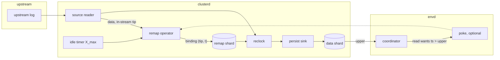

# Tickless frontiers: event-driven timestamp bindings

- Associated: [database-issues#7020] (reclock to latest upper), [database-issues#8885] (probe alignment), [PER-38] (consensus write scalability), [#35046] (reclock to latest is the only variant)

[database-issues#7020]: https://github.com/MaterializeInc/database-issues/issues/7020
[database-issues#8885]: https://github.com/MaterializeInc/database-issues/issues/8885
[PER-38]: https://linear.app/materializeinc/issue/PER-38
[#35046]: https://github.com/MaterializeInc/materialize/pull/35046

## The problem

Every frontier in Materialize advances on a fixed wall-clock ticker, the `timestamp_interval`, which defaults to one second and is pinned to one second by `min_timestamp_interval` and `max_timestamp_interval` (`src/sql/src/session/vars/definitions.rs`).
Sources mint one remap binding per tick from a probe of the upstream system, tables receive one keepalive group commit per tick, and every dependent collection advances its upper in lockstep.
The tick is a batching window that trades freshness for load on three external systems: the persist consensus store, the timestamp oracle, and the upstream databases we probe.
Lowering the interval multiplies all three costs by the same factor, so the interval has stayed at one second even though sub-second freshness is a recurring product ask.

The freshness cost of the tick is structural, not incidental.
Under reclock-to-latest-upper, data committed upstream just after a probe waits for the next probe before it receives a Materialize timestamp, up to a full interval.
The binding then needs the persist append and controller propagation before the new upper is visible to the coordinator, which a 2023 measurement put at roughly 300 ms.
A strict serializable read whose oracle timestamp falls inside that window blocks until the upper becomes visible, so the tick adds latency on the read path as well as staleness on the write path.
The 2024 rollout of reclock-to-latest-upper measured exactly this regression in strict serializable query latency and considered minting bindings one second into the future to hide it.

The load side is equally structural.
Table 1 lists the durable writes one idle tick costs at the defaults, verified against the current tree.
Tables are already amortized through txn-wal and cost nothing per table, but each source costs two compare-and-set operations and each materialized view one, whether or not any data moved.
Production fleets run on the order of ten thousand consensus writes per second at a one second tick, and the consensus store is a major infrastructure cost that scales linearly with that rate, so the fleet cannot absorb a ten times faster tick as-is.

| Cost center | Durable writes per idle tick | Where |
|---|---|---|
| Timestamp oracle | 2 `UPDATE`, 1 `SELECT` | `src/adapter/src/coord/appends.rs` |
| Catalog shard | 1 compare-and-append | `src/catalog/src/durable/persist.rs` |
| txns shard | 1 compare-and-append, 1 compare-and-downgrade-since | `src/txn-wal/src/txn_write.rs`, `src/storage-controller/src/persist_handles.rs` |
| Table data shards | 0 | `src/storage-client/src/storage_collections.rs` |
| Each source | 1 for the remap shard, 1 per export data shard | `src/storage/src/source/reclock.rs`, `src/storage/src/render/persist_sink.rs` |
| Each materialized view | 1 (empty batch) | `src/compute/src/sink/materialized_view.rs` |
| Each introspection collection | 1 | `src/storage-controller/src/collection_mgmt.rs` |

Table 1: Durable writes per idle tick at the default configuration.

Two facts about the current implementation shape the design space.
First, sources never consult the timestamp oracle: the binding timestamp is the clusterd wall clock floored to the interval (`src/storage/src/source/probe.rs`), and the oracle is only written by the coordinator's group commit.
Second, reclock-to-latest-upper is the only reclocking strategy since [#35046], so a binding always maps a probed upstream frontier, never the ingested one, and the remap operator mints from a probe stream rather than from the data frontier (`src/storage/src/source/source_reader_pipeline.rs`).
The critical path for a fresher binding is therefore acquiring the upstream frontier and committing the binding, not any oracle round trip.

## Success criteria

* End-to-end freshness, measured from upstream commit to the moment a strict serializable read can observe the row, is bounded by the ingestion pipeline latency plus a configurable minimum binding interval, and the design supports that interval down to 100 ms within the consensus budget stated below. Today the bound is the pipeline latency plus one second.
* Strict serializable read latency on a source that is receiving data does not regress relative to today. In particular, reads must not wait for upper visibility on every request.
* Upstream probe load per source does not exceed today's: at most one explicit probe per source per maximum binding interval, and no explicit probes while the replication stream itself carries the upstream frontier.
* Durable storage stays bounded: the live size of a remap shard depends on the retention window and partition count, not on the binding rate or the age of the source.
* Restart is deterministic: the remap shard remains the only source of truth for the mapping, and two replicas or two incarnations of a source produce identical reclocked output.
* Consensus write rate is an explicit, configurable budget with a documented formula, and the default configuration does not increase the fleet-wide write rate.
* At an unchanged maximum binding interval, idle collections cost no more durable writes than today, and the environment-level keepalive costs nothing while no reads arrive.

## Out of scope

* Amortizing consensus writes across shards, for example by routing source exports or materialized views through a txn-wal style shared shard. This is the enabler for binding intervals well below 250 ms at fleet scale and gets its own design. This document sizes the budget it would have to meet.
* Introspection and managed collections. They advance on a hardcoded one second tick in the storage controller, independent of `timestamp_interval`, and are unaffected here.
* Sinks. A Kafka sink commits one transaction per input frontier step, so a finer input frontier multiplies sink commits. This document requires that sink input frontiers be quantized and leaves the sink-side cadence knob to a follow-up.
* Bounded staleness and serializable isolation. They do not anchor to source uppers in a way this design changes.
* A durable raw transaction log written before reclocking. See Alternatives.

## Solution proposal

Frontiers advance when work arrives, bounded below by a minimum binding interval and above by a maximum binding interval, and bindings are minted slightly ahead of wall clock by a measured lead so that fresh uppers are visible by the time a read asks for them.
Timestamps keep millisecond granularity, and frontiers advance in steps whose size is set by load rather than by a ticker.
Downstream collections quantize their input frontiers so that a finer source frontier does not multiply their own durable writes.
The timeline advances on demand rather than on a keepalive ticker, so that read timestamps track wall clock without paying for keepalives when nothing is reading.

### Terminology

* `X_min`, the minimum binding interval. No source mints two bindings closer than `X_min` apart. It bounds the consensus write rate of a busy source to two writes per `X_min`.
* `X_max`, the maximum binding interval. An idle source mints a binding at least every `X_max`. It bounds staleness and explicit upstream probe rate for idle sources and is the freshness floor of `mz_now()` driven semantics such as temporal filters. It is the existing `TIMESTAMP INTERVAL`.
* `H`, the binding lead. A binding minted at wall clock `w` carries timestamp `w + H` rather than `w`. `H` is measured per source, not configured.
* `Q`, the quantization step of a downstream collection. Its input frontier is only allowed to advance at multiples of `Q`.

### Bindings

The remap operator mints a binding whenever one of three triggers fires and at least `X_min` has elapsed since the previous binding.
The first trigger is an advance of the upstream frontier observed in the replication stream itself, described per source below.
The second is the idle timer, which fires `X_max` after the previous binding and performs an explicit probe.
The third is a poke from the controller on behalf of a waiting read, which is optional and discussed under Alternatives.
The binding timestamp is `max(now_ms + H, previous_binding + 1)`, floored to the `X_min` grid so that independent sources land on the same timestamps and a join of several sources sees one input frontier step per grid point rather than one per source ([database-issues#8885] describes the cost of misalignment).

The existing `ReclockOperator::mint` contract already enforces what the triggers need.
It only writes a binding if the upstream frontier is not behind the previously bound frontier and the target upper strictly advances (`src/storage/src/source/reclock.rs`), and it resyncs on a compare-and-append mismatch.
An arrival-driven proposal whose ingested frontier is still behind the most recently probed upstream tip is rejected by the first condition, so arrival-driven minting only takes effect once ingestion has caught up with the last probe.
This gives a clean hybrid: while data flows, bindings track the ingested frontier at `X_min` granularity, and at least every `X_max` an explicit probe re-establishes the reclock-to-latest-upper property that a broken upstream connection stalls the source rather than silently advancing it.

Bindings remain monotone in both coordinates by construction, and multiple transactions that arrive within one `X_min` share a timestamp.
The upstream total order survives as a happens-before relation: transactions with distinct bindings keep their order, transactions with the same binding are simultaneous.
This is the same guarantee reclocking gives today at one second granularity (`doc/developer/design/20220411_reclocking_implementation.md`).

### Upstream frontier acquisition

Bounded upstream load requires that a busy source learns the upstream frontier from the data it already receives, and only probes explicitly when idle.

| Source | In-stream frontier | Explicit probe today | Under this design |
|---|---|---|---|
| PostgreSQL | `wal_end` in every `XLogData` and `PrimaryKeepAlive` message, already used for the data frontier (`src/storage/src/source/postgres/replication.rs`) | `pg_current_wal_lsn()` once per tick | Mint from `wal_end`. The existing one second standby status update with the reply flag set requests a keepalive when idle, so the idle probe is free. Drop the separate probe task. |
| Kafka | High watermark per partition in every fetch response, cached by the client library | List-offsets metadata fetch per tick per partition | Mint from cached watermarks of consumed partitions. Keep the metadata fetch at `X_max` for partition discovery. |
| MySQL | None. Binlog heartbeats are not wired to the capability (`src/storage/src/source/mysql/replication.rs`) | `@@global.gtid_executed` once per tick | Arrival-driven bindings bound the ingested frontier. Explicit probe stays at `X_max`. |
| SQL Server | None, the source polls | `fn_cdc_get_max_lsn()` once per tick | Poll cadence is the binding cadence. `X_min` and `X_max` set the poll interval bounds. |
| Load generator | Synthesized | Synthesized per tick | Unchanged, minting at `X_max`. |

Table 2: How each source learns the upstream frontier.

### Binding lead

Without a lead, finer bindings make strict serializable reads slower, not faster.
Today a binding at second `S` covers the interval `[S, S+1)`, and a read whose oracle timestamp falls after the new upper has become visible proceeds immediately, so only reads in the first few hundred milliseconds of each second wait.
With millisecond bindings and no lead, the visible upper always trails wall clock by the pipeline latency, so every read at an oracle timestamp near wall clock waits for the next binding to propagate.
The lead `H` restores the property that the visible upper is ahead of wall clock: a binding minted at `w` with timestamp `w + H` becomes visible at roughly `w + L`, where `L` is the pipeline latency, so choosing `H` at or slightly above `L` keeps reads unblocked.

Each source measures `L` locally as an exponentially weighted average of the time from mint to compare-and-append acknowledgement, plus a fixed allowance for controller propagation, and sets `H` from it, clamped to `[0, X_max]`.
The label a row receives is its upstream commit time plus at most `H + X_min`, which stays inside today's envelope of commit time plus one second as long as `H + X_min <= X_max`.
The lead is a labeling choice and does not change what data exists at any upstream position, so determinism on restart is unaffected.
The lead does interact with the wall-clock lag metric, which compares uppers to wall clock and would read the lead as negative lag. See Open questions.

### Timeline advancement on demand

The coordinator's keepalive group commit exists so that the oracle read timestamp tracks wall clock and tables remain readable at it (`src/adapter/src/coord/appends.rs`).
Under this design the keepalive fires on demand instead of on a ticker: when a strict serializable read finds the oracle read timestamp more than `X_min` behind wall clock, it triggers one keepalive commit and waits for it, coalescing with other waiting reads.
The precedent is the nudge in `src/adapter/src/frontend_read_then_write.rs`, which asks for a commit instead of waiting a full interval.
An idle timer at `X_max` keeps `mz_now()` moving for temporal filters and refresh schedules when no reads arrive.
A sparse read therefore pays one group commit of latency in exchange for a read timestamp within `X_min` of wall clock, where today it reads for free at a timestamp up to one second stale.
The per-environment cost is unchanged under read load and drops to zero when idle, and all of the correctness argument goes through the oracle exactly as today, so the invariants in `doc/developer/guide-adapter.md` hold.

Read timestamp selection itself does not change.
Later timestamps are always safe within a read's real-time bounds, and every advancement of the oracle happens through `apply_write`, so the distributed and monotonicity requirements of the adapter guide are preserved.
This design does not pick read timestamps from source uppers, which the 2023 latency-versus-freshness exploration rejected because a source with a skewed clock could drag the oracle forward.

### Frontier quantization downstream

A materialized view appends one batch per input frontier step, whether or not data moved, and a Kafka sink commits one transaction per step.
Finer source frontiers therefore multiply downstream durable writes unless downstream collections quantize.
A quantizer sits at the input of every dataflow that feeds a durable sink and only passes the input frontier at multiples of `Q`, leaving data timestamps untouched.
The existing temporal bucketing operator in compute (`compute_temporal_bucketing_summary`) shows that coarsening frontiers without changing data timestamps is already an established pattern in the rendering layer.

`Q` defaults to `X_min` for materialized views, which preserves alignment without adding delay, and to `X_max` for sinks, which preserves today's sink cadence.
Both are per-collection knobs so that a specific materialized view can trade consensus writes for freshness.
The quantizer is also the natural place for an adaptive policy later: a sink that observes slow commits can widen `Q` on its own.

### Storage growth

A binding adds one row per changed partition to the remap shard, encoded as an increment so that rows consolidate (`doc/developer/design/20220411_reclocking_implementation.md`).
Compaction consolidates all rows below the shard's since into one row per partition, and the since follows the data shard's since, which lags the upper by the compaction window.
The live row count of a remap shard is therefore the binding rate times the compaction window plus one row per partition, and is independent of source age.
At the proposed defaults that is a handful of rows per source.

Persist state grows with the number of compare-and-set operations only transiently.
Each successful append adds a batch that the spine merges, a rollup is written every 128 sequence numbers, and garbage collection truncates consensus every 32, so state size is bounded by spine invariants and blob count by the merge schedule, both proportional to write rate but not to age.
The data shard sees the same pattern because empty batches do not add parts.
Nothing new is stored: the design changes when existing writes happen, not what is written.

### Determinism on restart

The remap shard is written before any data is reclocked, and the reclock operator holds its capability until the reader has read through the binding (`src/timely-util/src/reclock.rs`), so the data shard upper never exceeds the remap shard upper.
On restart the source reads the data shard upper, maps it back to an upstream position through the remap shard (`reclock_committed_upper` in `src/storage/src/source/source_reader_pipeline.rs`), resumes upstream from there, and re-ingested data receives the bindings already on record.
Arrival-driven minting and the lead do not touch this argument, because both only decide which timestamp a new binding proposes, and proposals become truth only through the compare-and-append on the remap shard.
Two replicas racing to mint resolve through the same compare-and-append, the loser resyncs to the winner's bindings, and both reclock identically, which the existing concurrency test in `src/storage/src/source/reclock.rs` exercises.

### Consensus budget

The durable write rate of the system under this design is

* per busy source: `2 / X_min`
* per idle source: `2 / X_max`
* per materialized view: `1 / Q`
* per environment: `3 / X_min` under read load for oracle, catalog, and txns shard writes, zero when idle

At `X_min = 250 ms` and `X_max = 1 s`, an idle shard writes exactly what it writes today and a busy shard writes four times more, so the fleet-wide rate grows with the fraction of busy shards.
Idle shards only get cheaper when `X_max` is raised, which trades idle staleness and a slower `mz_now()` floor for consensus writes, and is a per-environment choice.
`X_min` defaults to 250 ms and is configurable per environment, so a fleet with many busy shards can raise it back to `X_max` to reproduce today's write rate exactly.
The self-adjusting behavior the problem statement asks for comes from two places: while an append is in flight, arrivals accumulate into the next binding, so steps grow with load, and `X_min` caps the rate when arrivals trickle.
Amortizing appends across shards is what makes `X_min` well below 250 ms affordable at fleet scale, and is out of scope here.

### Configuration and rollout

* `X_max` is the existing `TIMESTAMP INTERVAL` source option and `default_timestamp_interval`, with unchanged meaning.
* `X_min` is a new dyncfg `storage_min_binding_interval`, defaulting to 250 ms. Setting it to `X_max` reproduces today's cadence.
* Event-driven minting and the lead are behind a feature flag that defaults off in production and on in CI, wired through `system_parameter_default` so that sqllogictest, testdrive, and platform checks exercise the new path.
* The lead `H` is observable per source through source statistics.
* `Q` is a per-collection option with the defaults above.

## Minimal viable prototype

The prototype covers the PostgreSQL source and the load generator, because PostgreSQL already carries the upstream frontier in-stream and the load generator gives a controlled arrival rate.
It implements arrival-driven minting with `X_min` and `X_max`, the measured lead, and the demand-driven keepalive, and leaves quantization at its default of `Q = X_min`.
The measurements are end-to-end freshness as the difference between upstream commit time and first visibility in a strict serializable read, strict serializable read latency distribution, compare-and-set rate per shard from persist metrics, and explicit probe count against the upstream database.
Success is a freshness median below `X_min` plus pipeline latency at unchanged read latency and unchanged probe count, with the consensus rate matching the budget formula.

## Alternatives

### Lower the timestamp interval globally

Setting `default_timestamp_interval` to 100 ms gives ten times finer bindings with no code change.
It also multiplies every row of Table 1 by ten, including upstream probes and idle shards, and keeps the read-path latency problem because bindings are still minted at probe time without a lead.
It is the baseline the prototype is measured against.

### Coordinator poke instead of a lead

Instead of minting ahead of wall clock, a strict serializable read whose timestamp exceeds a source upper could ask the controller to have the source mint now.
This keeps labels at upstream commit time but adds a controller-to-cluster protocol with coalescing across many waiting reads, and every such read still pays the full propagation latency.
The lead achieves unblocked reads without a protocol.
The poke remains useful as a targeted mechanism for reads against sources that are idle for longer than `X_max` and could be added later.

### Durable raw log, then deterministic reclocking

The problem statement proposes writing the ingested transaction log durably first, reclocking deterministically in a second step, and garbage collecting reclocked input.
The upstream system already is that durable log: PostgreSQL slots are advanced only after data is durable in persist, Kafka retains by policy, and MySQL retains binlogs, so the current pipeline resumes from upstream deterministically without a copy (`src/storage/src/source/source_reader_pipeline.rs`).
A shard keyed by upstream time would also need a fixed-width codec for `Partitioned` timestamps, which does not exist, and reclock-to-latest-upper assigns timestamps from bindings minted before the data arrives, so timestamps cannot be derived from arrival into a raw log.
The proposal solves a problem the pipeline does not have.

### Non-durable frontier announcements

A source could announce "no data before `t`" to downstream consumers without a compare-and-set, relying on wall clock monotonicity across restarts to never mint below `t`.
A downstream materialized view that sealed times below `t` on that promise would then be wrong if a restarted or skewed replica mints below `t`, silently and permanently.
Frontiers are promises and promises must be durable, so this is rejected.

### Mint a constant distance into the future

The 2023 exploration proposed minting source timestamps a fixed one or two seconds ahead and widening the compaction window to match.
A fixed lead either exceeds the pipeline latency, adding staleness for nothing, or falls short of it under load, reintroducing read waits.
The measured lead in this design is the same idea with the constant replaced by the quantity it was approximating.

### Amortize consensus writes first

Routing source exports and materialized views through a shared shard, in the way txn-wal already does for tables, would let one compare-and-set advance many collections and make small `X_min` affordable everywhere.
It does not by itself improve freshness, because bindings would still be minted per tick, and it does not reduce upstream probes.
It is complementary and is the natural next design once the budget formula above is confirmed by measurement.

## Open questions

* How should the wall-clock lag metric account for the lead? Uppers ahead of wall clock read as zero lag. Each writer can announce its lead through source statistics so the controller subtracts it, or the metric can be anchored on the mint wall clock rather than the binding timestamp. Deferred until the prototype shows how large `H` is in practice.
* Can `X_min` adapt to observed consensus latency at the controller level, so that a struggling consensus store widens binding intervals across all sources instead of relying on operator tuning?
* For MySQL, should the explicit probe cadence while data flows be `X_max`, which makes the source reclock-to-latest-upper only once per `X_max`, or should the binlog heartbeat be wired into the capability to provide an in-stream frontier?
* Does the Kafka client library expose the cached high watermark to the source without a network round trip in the way the source needs, including after a rebalance?
* Which tests encode the one second tick as an assumption? The rollout flag being on in CI will surface them, and they need review rather than blanket relaxation.
* Should `TIMESTAMP INTERVAL` eventually mean `X_min` rather than `X_max`, since users who set it are asking for freshness rather than for an idle cadence? Its one second default reads as an idle cadence today, so it stays `X_max` for now and the question is deferred until `X_min` has a user-facing surface.
