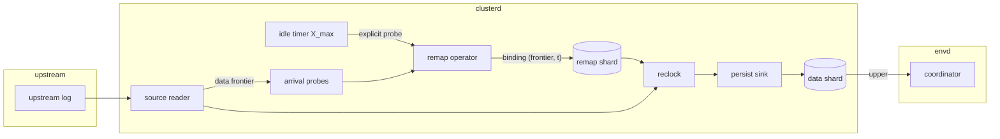

# Tickless frontiers: event-driven timestamp bindings

- Associated: [database-issues#7020] (reclock to latest upper), [database-issues#8885] (probe alignment), [PER-38] (consensus write scalability), [#35046] (reclock to latest is the only variant)

[database-issues#7020]: https://github.com/MaterializeInc/database-issues/issues/7020
[database-issues#8885]: https://github.com/MaterializeInc/database-issues/issues/8885
[PER-38]: https://linear.app/materializeinc/issue/PER-38
[#35046]: https://github.com/MaterializeInc/materialize/pull/35046

## The problem

Every frontier in Materialize advances on a fixed wall-clock ticker, the `timestamp_interval`, which defaults to one second and is pinned to one second by `min_timestamp_interval` and `max_timestamp_interval` (`src/sql/src/session/vars/definitions.rs`).
Sources mint one remap binding per tick from a probe of the upstream system, tables receive one keepalive group commit per tick, and every dependent collection advances its upper in lockstep.
The tick is a batching window that trades freshness for load on three external systems: the persist consensus store, the timestamp oracle, and the upstream databases we probe.
Lowering the interval multiplies all three costs by the same factor, so the interval has stayed at one second even though sub-second freshness is a recurring product ask.

The freshness cost of the tick is structural, not incidental.
Under reclock-to-latest-upper, data committed upstream just after a probe waits for the next probe before it receives a Materialize timestamp, up to a full interval.
The binding then needs the persist append and controller propagation before the new upper is visible to the coordinator, which a 2023 measurement put at roughly 300 ms.
A strict serializable read whose oracle timestamp falls inside that window blocks until the upper becomes visible, so the tick adds latency on the read path as well as staleness on the write path.
The 2024 rollout of reclock-to-latest-upper measured exactly this regression in strict serializable query latency and considered minting bindings one second into the future to hide it.

The load side is equally structural.
Table 1 lists the durable writes one idle tick costs at the defaults, verified against the current tree.
Tables are already amortized through txn-wal and cost nothing per table, but each source export costs one compare-and-set operation and each materialized view one, whether or not any data moved.
Production fleets run on the order of ten thousand consensus writes per second at a one second tick, and the consensus store is a major infrastructure cost that scales linearly with that rate, so the fleet cannot absorb a ten times faster tick as-is.

| Cost center | Durable writes per idle tick | Where |
|---|---|---|
| Timestamp oracle | 2 `UPDATE`, 1 `SELECT` | `src/adapter/src/coord/appends.rs` |
| Catalog shard | 1 compare-and-append | `src/catalog/src/durable/persist.rs` |
| txns shard | 1 compare-and-append, 1 compare-and-downgrade-since | `src/txn-wal/src/txn_write.rs`, `src/storage-controller/src/persist_handles.rs` |
| Table data shards | 0 | `src/storage-client/src/storage_collections.rs` |
| Each source | 1 for the remap shard, 1 per export data shard | `src/storage/src/source/reclock.rs`, `src/storage/src/render/persist_sink.rs` |
| Each materialized view | 1, gated on the previous append landing | `src/compute/src/sink/materialized_view.rs` |
| Each introspection collection | 1 | `src/storage-controller/src/collection_mgmt.rs` |

Table 1: Durable writes per idle tick at the default configuration.

Two facts about the current implementation shape the design space.
First, sources never consult the timestamp oracle: the binding timestamp is the clusterd wall clock floored to the interval (`src/storage/src/source/probe.rs`), and the oracle is only written by the coordinator's group commit.
Second, reclock-to-latest-upper is the only reclocking strategy since [#35046], so a binding always maps a probed upstream frontier, never the ingested one, and the remap operator mints from a probe stream rather than from the data frontier (`src/storage/src/source/source_reader_pipeline.rs`).
The critical path for a fresher binding is therefore acquiring an upstream frontier and committing the binding, not any oracle round trip.

A third fact bounds what finer bindings can deliver on their own.
Strict serializable reads choose the oracle read timestamp, or the collection since if that is later (`src/adapter/src/coord/timestamp_selection.rs`), and the oracle only advances when a group commit applies.
Finer source bindings are therefore invisible to the default isolation level until the oracle also advances more often.
Serializable reads choose the freshest available timestamp and benefit from finer bindings with no other change.

## Success criteria

* End-to-end freshness, measured from upstream commit to the moment a strict serializable read can observe the row, is bounded by the ingestion pipeline latency plus a configurable minimum binding interval, and the design supports that interval down to 100 ms within the consensus budget stated below. Today the bound is the pipeline latency plus one second.
* Strict serializable read latency is bounded: a read on an environment where nothing has advanced the timeline within one minimum binding interval pays at most one group commit, and a read on a busy environment pays nothing extra. Reads on a source that is receiving data never wait for upper visibility.
* Serializable reads observe fresher data with no added latency.
* Upstream probe load per source does not exceed today's: at most one explicit probe per source per maximum binding interval, and no explicit probes are added while data flows.
* Durable storage stays bounded: the live size of a remap shard depends on the retention window and partition count, not on the binding rate or the age of the source.
* Restart is deterministic: the remap shard remains the only source of truth for the mapping, and two replicas or two incarnations of a source produce identical reclocked output.
* Consensus write rate is an explicit, configurable budget with a documented formula.
* At an unchanged maximum binding interval, no collection costs more durable writes while idle than it does today.

## Out of scope

* Amortizing consensus writes across shards, for example by routing source exports or materialized views through a txn-wal style shared shard. This is the enabler for binding intervals well below 250 ms at fleet scale and gets its own design. This document sizes the budget it would have to meet.
* Introspection and managed collections. They advance on a hardcoded one second tick in the storage controller, independent of `timestamp_interval`, and are unaffected here.
* Sinks. A Kafka sink commits one transaction and one progress append per input frontier step (`src/storage/src/sink/kafka.rs`), so a finer input frontier multiplies sink commits. Sinks need the same hold-back operator that this document specifies for materialized views, with their own cadence knob, and that is a follow-up.
* Bounded staleness and serializable isolation, whose timestamp selection this design does not change.
* User-defined timelines. They are advanced from collection uppers and only when a group commit applies (`src/adapter/src/coord/timeline.rs`), so under this design they keep today's cadence and inherit the binding lead. They are unused in practice and are left as they are.
* A durable raw transaction log written before reclocking. See Alternatives.

## Solution proposal

Frontiers advance when work arrives, bounded below by a minimum binding interval and above by a maximum binding interval, and bindings are minted slightly ahead of wall clock by a measured lead so that fresh uppers are visible by the time a read asks for them.
Timestamps keep millisecond granularity, and frontiers advance in steps whose size is set by load rather than by a ticker.
Materialized views hold their output frontier back to a grid so that a finer source frontier does not multiply their own durable writes beyond a bounded rate.
The timeline advances on demand rather than on a keepalive ticker, so that strict serializable read timestamps track wall clock without paying for keepalives when nothing is reading.

### Terminology

* `X_min`, the minimum binding interval. No source mints two bindings closer than `X_min` apart, and binding timestamps lie on the `X_min` grid. It bounds the consensus write rate of a busy source.
* `X_max`, the maximum binding interval. An idle source mints a binding at least every `X_max`, from an explicit probe. It bounds staleness and explicit upstream probe rate for idle sources and is the floor for `mz_now()` driven semantics such as temporal filters. It is the existing `TIMESTAMP INTERVAL`.
* `H`, the binding lead. A binding minted at wall clock `w` carries timestamp `w + H` rather than `w`. `H` is measured per source, not configured.
* `CW`, the compaction window of a collection, one second by default (`src/adapter-types/src/compaction.rs`).
* `Q`, the hold-back step of a materialized view. Its output frontier only advances at multiples of `Q`.

### Bindings

The remap operator mints a binding whenever one of two triggers fires.
The first trigger is an advance of the source's own data frontier, the frontier of what the reader has ingested, delivered to the remap operator as a probe.
The second is the idle timer, which fires `X_max` after the previous binding and performs an explicit probe of the upstream system exactly as today.
Both triggers produce a proposal `(frontier, probe_ts)`, and the remap operator must wake on a changed frontier even when the timestamp is unchanged, because two arrivals inside one grid cell carry the same timestamp and today's wake condition compares timestamps only.

The binding timestamp is `floor_grid(now_ms + H)`, where `floor_grid` rounds down to the `X_min` grid.
A proposal whose floored timestamp is not at or beyond the current remap upper is skipped without minting, and the operator waits for the next probe.
Taking the maximum with the previous binding instead would mint off the grid at arrival rate whenever arrivals are faster than the grid, which defeats the rate bound, and the pending arrival probe fires in the next grid cell anyway.
The target upper is derived from the final timestamp, because `mint` asserts that the upper is beyond the binding timestamp.
Flooring to a shared grid keeps independent sources on the same timestamps, so a join of several sources sees one input frontier step per grid point rather than one per source ([database-issues#8885] describes the cost of misalignment).

The existing `ReclockOperator::mint` contract already enforces what the triggers need.
It only writes a binding if the proposed frontier is not behind the previously bound frontier and the target upper strictly advances (`src/storage/src/source/reclock.rs`), and it resyncs on a compare-and-append mismatch.
An arrival-driven proposal whose ingested frontier is still behind the most recently probed upstream frontier is rejected by the first condition, so arrival-driven minting only takes effect once ingestion has caught up with the last probe.
This gives a hybrid: while ingestion keeps up, bindings track the ingested frontier at `X_min` granularity, and at least every `X_max` an explicit probe re-establishes the reclock-to-latest-upper property that a broken or lagging upstream connection stalls the source rather than silently advancing it.
A rejected proposal is silent today and must carry a counter, because under arrival-driven minting a rejection is the normal case while ingestion catches up and a stuck source would otherwise be indistinguishable from a healthy one.

The proposal must be a complete antichain in the source's time domain, which the data frontier is by construction.
For Kafka the data frontier covers every consumed partition plus the range element for partitions not yet discovered (`src/storage/src/source/kafka.rs`), so it is comparable with the probed frontier.
A proposal assembled from a subset of partitions would be incomparable with the last probed frontier, and the partial order in the `mint` guard would reject it forever.

Bindings remain monotone in both coordinates by construction, and multiple transactions that arrive within one `X_min` share a timestamp.
The upstream total order survives as a happens-before relation: transactions with distinct bindings keep their order, transactions with the same binding are simultaneous.
This is the same guarantee reclocking gives today at one second granularity (`doc/developer/design/20220411_reclocking_implementation.md`).

### Upstream frontier acquisition

Bounded upstream load requires that no explicit probe is added while data flows, and that the idle probe rate stays at `X_max`.
The arrival trigger uses the reader's data frontier, which every source already maintains, so no source needs a new upstream query.

| Source | Data frontier while data flows | Explicit probe at `X_max` | Notes |
|---|---|---|---|
| PostgreSQL | `commit_lsn + 1` per transaction, and the keepalive `wal_end`, which is the last LSN the walsender processed rather than the WAL end (`src/storage/src/source/postgres/replication.rs` module doc) | `pg_current_wal_lsn()` as today, which also feeds the `offset_known` statistic | The eager pre-snapshot probe stays. On filtered publications and hosts with other write-active databases the data frontier trails the true WAL tip, so the `X_max` probe is what keeps the source reclock-to-latest-upper. |
| Kafka | Per-partition consumer positions plus the undiscovered-partition range element | Metadata fetch of high watermarks and partition list as today | The metadata fetch is also partition discovery and cannot be dropped. |
| MySQL | GTID frontier advanced on transaction events | `@@global.gtid_executed` as today | Binlog heartbeats are not wired to the capability and stay that way. |
| SQL Server | Advances only on poll | `fn_cdc_get_max_lsn()` as today | Poll cadence is the binding cadence. `X_min` and `X_max` bound the poll interval. |
| Load generator | Generated frontier | Synthesized | Unchanged. |

Table 2: How each source learns the upstream frontier.

### Binding lead

Without a lead, finer bindings make strict serializable reads slower, not faster.
Today a binding at second `S` covers the interval `[S, S+1)`, and a read whose oracle timestamp falls after the new upper has become visible proceeds immediately, so only reads in the first few hundred milliseconds of each second wait.
With grid bindings and no lead, the visible upper always trails wall clock by the pipeline latency `L`, so every read at an oracle timestamp near wall clock waits for the next binding to propagate.
The lead restores the property that the visible upper is ahead of wall clock.

The requirement is that the newest visible binding covers the read timestamp.
At wall clock `now` the newest visible binding was minted no later than `now - L`, and it was minted at most `X_min` after its predecessor, so its timestamp is at least `now - L - X_min + H`.
The lead must therefore satisfy `H > L + X_min`, and each source sets `H` to an exponentially weighted average of its observed `L`, from mint to compare-and-append acknowledgement plus a fixed allowance for controller propagation, plus `X_min` and a margin.

The lead is bounded above by the compaction window.
The since of a collection is `floor(upper - CW)` at one second granularity (`src/storage-types/src/read_policy.rs`), and a strict serializable read with oracle timestamp within `X_min` of wall clock needs `since <= now - X_min`, which holds whenever `H <= CW - X_min`.
The clamp uses the smallest compaction window across the source's exports and is recomputed when `RETAIN HISTORY` changes.
Together the two bounds require `L + 2 * X_min <= min(CW, X_max)`, which at the defaults of `CW = X_max = 1 s`, `X_min = 250 ms`, and a measured `L` around 300 ms leaves 200 ms of margin, and this inequality is the real upper bound on `X_min` at a given compaction window.

The label a row receives is its upstream commit time plus at most `H + X_min`, which stays inside today's envelope of commit time plus one second under the same inequality.
Serializable reads, which pick the freshest available timestamp, will see `mz_now()` up to `H` ahead of wall clock, exactly as they see it up to one second ahead today.
The lead is a labeling choice and does not change what data exists at any upstream position, so determinism on restart is unaffected.
The lead does interact with the wall-clock lag metric, which saturates at zero when an upper is ahead of wall clock (`src/cluster-client/src/lib.rs`) and would under-report lag by `H`. See Open questions.

### Timeline advancement on demand

The coordinator's keepalive group commit exists so that the oracle read timestamp tracks wall clock and tables remain readable at it (`src/adapter/src/coord/appends.rs`).
Under this design the keepalive fires on demand: when a strict serializable read finds the oracle read timestamp more than `X_min` behind wall clock, it triggers one keepalive commit and waits for it, coalescing with other waiting reads.
The precedent is the nudge in `src/adapter/src/frontend_read_then_write.rs`, which asks for a commit instead of waiting a full interval.
An idle timer at `X_max` keeps `mz_now()` moving for temporal filters and refresh schedules when no reads arrive, at today's cost.
A sparse read pays one group commit of latency in exchange for a read timestamp within `X_min` of wall clock, where today it reads for free at a timestamp up to one second stale, and a busy environment pays nothing extra because a recent keepalive already exists.

A read-triggered keepalive at a rate of at most one per `X_min` stays clear of the committer's throttle, which only sleeps while the allocated write timestamp is ahead of wall clock, and far below the runaway bound on write timestamps.
Read timestamp selection itself does not change for the wall-clock timeline: later timestamps are always safe within a read's real-time bounds, and every advancement of the oracle happens through `apply_write`, so the distributed and monotonicity requirements of `doc/developer/guide-adapter.md` are preserved.
This design does not pick wall-clock timeline read timestamps from source uppers, which the 2023 latency-versus-freshness exploration rejected because a source with a skewed clock could drag the oracle forward.

### Materialized view hold-back

A materialized view mints a new batch description only after the previous append has landed (`src/compute/src/sink/materialized_view.rs`), so it is already self-clocked at one append per persist round trip.
Finer input frontiers raise its append rate from one per tick to one per round trip, which at typical round trips is several times today's rate.
A hold-back operator on the desired frontier, immediately before batch description minting, downgrades the sink's output capability only at multiples of `Q` and leaves data timestamps untouched.
Holding a capability back is always legal because the capability stays behind the data, which distinguishes this from `apply_refresh` in `src/compute/src/sink/refresh.rs`, where rounding a frontier up forces data timestamps up as well.
The empty frontier bypasses the hold-back so that a closing dataflow still closes its shard.

`Q` defaults to `X_min`, which makes materialized view append rates equal to source append rates and keeps materialized view uppers on the same grid as their inputs.
A materialized view that keeps up with its inputs then has an upper at or above `floor_grid(now + H)`, which is ahead of wall clock whenever `H >= X_min`, so strict serializable reads on it do not wait either.
A materialized view that does not keep up is late by its own processing time, exactly as today.
`Q` is a per-collection knob so that a specific materialized view can trade consensus writes for freshness in either direction, and its effects on the hydration signal and the wall-clock lag histogram are the same as those of a slower input.

### Storage growth

A binding adds one row per changed partition to the remap shard, encoded as an increment so that rows consolidate (`doc/developer/design/20220411_reclocking_implementation.md`).
The remap shard since is the meet of the ingestion's forwarded read hold at `floor(data_upper - CW)`, the controller's one step safety hold behind the data upper (`src/storage-controller/src/lib.rs`), and the progress collection's own read policy, and with `CW` at least one second the first dominates.
Compaction consolidates all rows below the since into one row per partition, so the live row count is the binding rate times `CW` plus one row per partition, and is independent of source age.
At the proposed defaults that is a handful of rows per source.

Persist state grows with the number of appends only transiently, but each append has a fixed cost.
An empty append adds no parts and its empty spine batch fuses away, yet it still costs a sequence number, a state diff, a consensus compare-and-set, a clone of the shard state, and a pub-sub fan-out, and the state clone is proportional to the number of batches in the spine.
Rollups are written every 128 sequence numbers and consensus is truncated at rollup boundaries, so state and blob counts are bounded by the merge schedule and proportional to write rate, not to age.
In the storage persist sink one batch is finished per distinct data timestamp inside a description (`src/storage/src/render/persist_sink.rs`), so grid bindings at `X_min` produce `X_max / X_min` times as many batch objects and blob parts as today regardless of any hold-back, while ready descriptions are already coalesced into one compare-and-set by default.
Nothing new is stored, but the per-append fixed cost is why `X_min` and not only the compare-and-set count is the budget unit.

### Determinism on restart

The remap shard is written before any data is reclocked: the remap operator downgrades its capability only after the compare-and-append lands (`src/storage/src/source/source_reader_pipeline.rs`), and the reclock operator's output frontier is bounded by the remap input frontier (`src/timely-util/src/reclock.rs`), so the data shard upper never exceeds the remap shard upper.
On restart the source reads the data shard upper, maps it back to an upstream position through the remap shard (`reclock_committed_upper` in `src/storage/src/source/source_reader_pipeline.rs`), resumes upstream from there, and re-ingested data receives the bindings already on record.
Arrival-driven minting and the lead do not touch this argument, because both only decide which timestamp a new binding proposes, and proposals become truth only through the compare-and-append on the remap shard.
Two replicas racing to mint resolve through the same compare-and-append, the loser resyncs to the winner's bindings, and both reclock identically, which the existing concurrency test in `src/storage/src/source/reclock.rs` exercises.

During a zero-downtime upgrade the read-only generation cannot mint bindings or write the oracle, and its remap handle polls the shard on a hardcoded one second loop (`src/storage/src/source/reclock/compat.rs`).
The read-only generation therefore observes the writing generation's cadence and adds up to one second of its own, exactly as today.
Nothing in this design changes that, and the cutover freshness check should keep tolerating it.

### Consensus budget

The durable write rate of the system under this design is

* per busy source with `N` exports: `(1 + N) / X_min`
* per idle source with `N` exports: `(1 + N) / X_max`, unchanged from today
* per materialized view: `1 / max(Q, persist round trip)`
* per environment: `3 / X_min` under read load for oracle, catalog, and txns shard writes, and `3 / X_max` when idle, unchanged from today

At `X_min = 250 ms` and `X_max = 1 s`, an idle shard writes exactly what it writes today and a busy shard writes four times more, so the fleet-wide rate grows with the fraction of busy exports.
A multi-table PostgreSQL source with forty exports is forty-one busy shards, which is the common shape and the reason the budget is per export.
Idle shards only get cheaper when `X_max` is raised, which trades idle staleness and a slower `mz_now()` floor for consensus writes, and is a per-environment choice that also requires raising `max_timestamp_interval`.
`X_min` defaults to 250 ms and is configurable per environment, so a fleet with many busy exports can raise it back to `X_max` to reproduce today's write rate exactly.
The self-adjusting behavior the problem statement asks for comes from two places: while an append is in flight, arrivals accumulate into the next binding, so steps grow with load, and `X_min` caps the rate when arrivals trickle.
Amortizing appends across shards is what makes `X_min` well below 250 ms affordable at fleet scale, and is out of scope here.

### Configuration and rollout

* `X_max` is the existing `TIMESTAMP INTERVAL` source option and `default_timestamp_interval`, with unchanged meaning. It is clamped to `[min_timestamp_interval, max_timestamp_interval]`, both one second by default, so raising it is an operator action.
* `X_min` is a new dyncfg `storage_min_binding_interval`, defaulting to 250 ms. Setting it to `X_max` reproduces today's cadence.
* Event-driven minting, the lead, and the demand-driven keepalive are behind a feature flag that defaults off in production and on in CI, wired through `system_parameter_default` so that sqllogictest, testdrive, and platform checks exercise the new path.
* The lead `H` and the rejected-proposal count are new per-source statistics and need a source statistics field and a catalog relation change.
* `Q` is a per-collection option with the default above.

## Minimal viable prototype

The prototype covers the PostgreSQL source and the load generator, because PostgreSQL exercises the hybrid of arrival-driven and probe-driven bindings and the load generator gives a controlled arrival rate.
It implements arrival-driven minting with `X_min` and `X_max`, a lead from a fixed configuration value standing in for the measurement, and a faster keepalive standing in for the demand-driven one, and leaves the materialized view hold-back for after the measurement.
The measurements are end-to-end freshness as the difference between upstream commit time and first visibility in a strict serializable read, strict serializable read latency distribution, compare-and-set rate per shard from persist metrics, and explicit probe count against the upstream database.
Success is a freshness median below `X_min` plus pipeline latency at unchanged read latency and unchanged probe count, with the consensus rate matching the budget formula.

### Prototype results

The prototype is on this branch behind `storage_event_driven_bindings`, with `test/tickless-spike/spike.py` as the harness.
It runs a local PostgreSQL source at 20 inserts per second against a local `environmentd` with the optimized profile, one strict serializable reader polling `max(ts)` every 50 ms, and one `SUBSCRIBE` on the progress subsource counting distinct binding timestamps.
Staleness is wall clock at read completion minus the row's upstream commit time, so it includes the read's own latency, and the keepalive is emulated by lowering `default_timestamp_interval` after source creation.
The lead is a fixed value rather than a measurement.

| Mode | Staleness p50 ms | Staleness p95 ms | Read p50 ms | Read p95 ms | Bindings/s |
|---|---|---|---|---|---|
| Baseline, 1 s keepalive | 1035 | 1063 | 950 | 954 | 1.03 |
| Baseline, 250 ms keepalive | 1151 | 1256 | 18 | 751 | 1.03 |
| Event-driven, lead 0, 250 ms keepalive | 299 | 504 | 22 | 254 | 3.92 |
| Event-driven, lead 400 ms, 250 ms keepalive | 581 | 727 | 18 | 22 | 4.06 |

Table 3: One 30 second run per mode, single machine, 20 inserts per second.

Four things follow from the numbers.
The binding rate lands on the grid as designed, four per second against one, and the log shows no rejected proposals, no panics, and no persist errors.
Event-driven bindings without a lead cut median staleness from about one second to 300 ms, which is the pipeline latency plus a fraction of the grid, and the read tail of 254 ms is the wait for the next binding that the lead section predicts.
The lead removes that tail, 254 ms to 22 ms at p95, and pays for it in staleness, 299 ms to 581 ms at the median, so the lead is a read latency instrument and not a freshness instrument, and the sum of read latency and staleness is about the same in both event-driven modes.
The baseline with a one second keepalive shows a 950 ms median read latency, which is the since rounding effect the Binding lead section describes: the source since is floored to the second, the oracle read timestamp lags by up to a second, and every read is pushed to the since and waits for the next keepalive.

A quiet run at one insert per five seconds counted 0.3 bindings per second in both modes, below the expected one per second from the `X_max` probe.
The counter only sees bindings that move the upstream frontier, because a binding that repeats the same frontier at a new timestamp consolidates to nothing in the progress collection, so the harness measures data-bearing bindings and cannot see idle ones.
Idle binding rate needs a persist-level counter, which is the same instrument the rejected-proposal count needs.

## Alternatives

### Lower the timestamp interval globally

Setting `default_timestamp_interval` to 100 ms gives ten times finer bindings with no code change.
It also multiplies every row of Table 1 by ten, including upstream probes and idle shards, and keeps the read-path latency problem because bindings are still minted at probe time without a lead.
It is the baseline the prototype is measured against.

### Coordinator poke instead of a lead

Instead of minting ahead of wall clock, a strict serializable read whose timestamp exceeds a source upper could ask the controller to have the source mint now.
This keeps labels at upstream commit time but adds a controller-to-cluster protocol with coalescing across many waiting reads, and every such read still pays the full propagation latency.
The lead achieves unblocked reads without a protocol.
The poke remains useful as a targeted mechanism for reads against sources that are idle for longer than `X_max` and could be added later.

### Mint from upstream metadata carried in the stream

An earlier draft proposed minting PostgreSQL bindings from the `wal_end` field of every replication message and Kafka bindings from cached high watermarks.
The PostgreSQL keepalive `wal_end` is the last LSN the walsender processed, not the WAL end, so it is a data frontier rather than an upstream tip, and the `XLogData` field is not consulted at all.
Cached Kafka watermarks cover only consumed partitions and produce a frontier incomparable with the probed one.
Using the data frontier directly gives the same arrival signal for every source with no per-source protocol knowledge.

### Durable raw log, then deterministic reclocking

The problem statement proposes writing the ingested transaction log durably first, reclocking deterministically in a second step, and garbage collecting reclocked input.
The upstream system already is that durable log: PostgreSQL slots are advanced only after data is durable in persist, Kafka retains by policy, and MySQL retains binlogs, so the current pipeline resumes from upstream deterministically without a copy (`src/storage/src/source/source_reader_pipeline.rs`).
A shard keyed by upstream time would also need a fixed-width codec for `Partitioned` timestamps, which does not exist, and reclock-to-latest-upper assigns timestamps from bindings minted before the data arrives, so timestamps cannot be derived from arrival into a raw log.
The proposal solves a problem the pipeline does not have.

### Non-durable frontier announcements

A source could announce "no data before `t`" to downstream consumers without a compare-and-set, relying on wall clock monotonicity across restarts to never mint below `t`.
A downstream materialized view that sealed times below `t` on that promise would then be wrong if a restarted or skewed replica mints below `t`, silently and permanently.
Frontiers are promises and promises must be durable, so this is rejected.

### Mint a constant distance into the future

The 2023 exploration proposed minting source timestamps a fixed one or two seconds ahead and widening the compaction window to match.
A fixed lead either exceeds the pipeline latency, adding staleness for nothing, or falls short of it under load, reintroducing read waits.
The measured lead in this design is the same idea with the constant replaced by the quantity it was approximating, and with the compaction window bound made explicit.

### Amortize consensus writes first

Routing source exports and materialized views through a shared shard, in the way txn-wal already does for tables, would let one compare-and-set advance many collections and make small `X_min` affordable everywhere.
It does not by itself improve freshness, because bindings would still be minted per tick, and it does not reduce upstream probes.
It is complementary and is the natural next design once the budget formula above is confirmed by measurement.

## Open questions

* How should the wall-clock lag metric account for the lead? Uppers ahead of wall clock read as zero lag. Each writer can announce its lead through source statistics so the controller subtracts it, or the metric can be anchored on the mint wall clock rather than the binding timestamp. Deferred until the prototype shows how large `H` is in practice.
* Should the lead default to zero? The prototype shows the lead trading staleness for read tail latency one for one. If freshness is the goal, a zero lead with the read tail bounded by `X_min` may be the better default, with the lead reserved for environments that care about read latency.
* Can `X_min` adapt to observed consensus latency at the controller level, so that a struggling consensus store widens binding intervals across all sources instead of relying on operator tuning?
* Should the demand-driven keepalive distinguish reads that touch no table, which only need the oracle advanced and not a txns shard append?
* Which tests encode the one second tick as an assumption? The rollout flag being on in CI will surface them, and they need review rather than blanket relaxation.
* Should `TIMESTAMP INTERVAL` eventually mean `X_min` rather than `X_max`, since users who set it are asking for freshness rather than for an idle cadence? Its one second default reads as an idle cadence today, so it stays `X_max` for now and the question is deferred until `X_min` has a user-facing surface.
