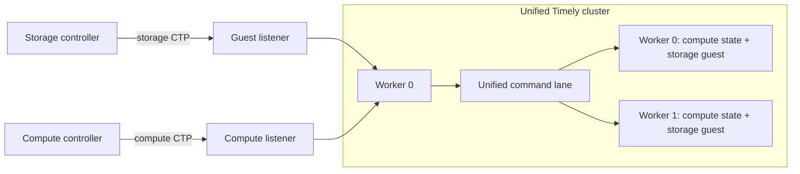

# Unified cluster: host storage objects on the compute Timely cluster

- Associated: [MaterializeInc/materialize#38579](https://github.com/MaterializeInc/materialize/pull/38579)

## The Problem

Every cluster replica process (`clusterd`) today builds two independent Timely
clusters, one serving the storage controller protocol and one serving the
compute controller protocol. Each cluster brings its own worker threads, its
own server loop, its own command sequencing machinery, and its own
introspection story. The split is an artifact of the storage and compute
layers' separate histories, not a requirement of the workloads: both clusters
run on the same machine, share the same process, and serve the same replica.

The split has concrete costs. Storage dataflows are invisible to compute
introspection, so a log-forwarding bridge copies storage Timely logging events
into the compute cluster's logging dataflows, adding code and a copy of every
event. Worker threads are partitioned statically between the two clusters, so
neither side can use the other's idle capacity. Two server loops, two command
sequencers, and two reconciliation implementations must be maintained in
parallel. Unifying the clusters removes all of these.

## Success Criteria

* A replica can serve both the storage and the compute controller protocol
  from a single Timely cluster, with both protocols byte-identical on the
  wire, so controllers and the network transport need no changes.
* Storage objects (sources, sinks, oneshot ingestions) behave identically to
  the two-cluster topology: ingestion progress, statistics, status updates,
  reconciliation, and suspend-and-restart all work unchanged.
* Storage dataflows appear natively in compute introspection
  (`mz_dataflows` and friends), making the storage log bridge obsolete.
* Dataflow construction remains deterministic across workers: all workers
  build all dataflows, storage and compute alike, in the same order.
* The topology is selectable per replica at process start, so the fleet can
  be migrated incrementally and rolled back by restarting replicas.

## Out of Scope

* Unifying the storage and compute controller protocols or controllers. The
  two protocols remain separate connections served by one cluster. Merging
  them is a follow-up cleanup once the unified topology is the only one.
* Removing the legacy two-cluster topology. It remains behind the flag until
  the unified topology has production mileage.
* Isolation between co-hosted storage and compute objects. The unified
  topology deliberately shares workers. Scheduling or placement mechanisms
  that restore isolation (see Open questions) are follow-up work.
* Resource-based worker sizing changes. The unified cluster uses the compute
  cluster's worker count, and sizing policy is unchanged.

## Solution Proposal

We migrate storage *objects* onto the compute Timely cluster, rather than
migrating either runtime onto the other's protocol. The compute worker loop
hosts a guest `StorageState`, the per-worker state struct that storage's own
server loop uses today, constructed through a new constructor that takes the
internal command channel endpoints from the host. Storage's rendering,
reconciliation, and response reporting code runs unchanged. Only the loop
that drives it moves. The storage controller connects to the same process
over a second controller-protocol listener whose per-worker channels feed
into the compute workers.

Correctness hinges on one invariant: all workers must construct all dataflows
in the same order, because Timely identifies dataflows by construction order.
Storage already funnels all rendering through an internal command sequencer,
and compute funnels all commands through its `command_channel`. We generalize
`command_channel` into a single sequencing lane carrying both compute
commands and storage-internal commands. The lane uses a two-hop structure
copied from storage's sequencer: any worker may inject a command tagged with
a per-producer index, worker 0 fixes one definitive global order and splits
commands into per-worker parts, and receivers restore the global order by
index. This also fixes a preexisting weakness in `command_channel`, which
relied on Timely channels preserving input order, a property they do not
guarantee.

Command flow for storage stays semantically what it is today, relocated.
External storage commands arrive on the guest connection and are buffered
until `InitializationComplete`, then reconciled against running state using
storage's existing reconciliation code, split out as a callable method.
Storage-internal commands (`RunIngestion`, suspend-and-restart, and so on)
are injected into the unified lane from any worker, exactly as health
operators inject them into storage's sequencer today. The compute worker
loop gains per-iteration guest duties: accept new guest connections, drain
guest commands, forward async worker responses, and report frontiers, status
updates, and statistics on storage's existing intervals. Parking is capped
while a guest is present so those duties run on time, with the cap derived
from the storage maintenance and statistics intervals.

The topology is fixed at process start and gated by a system parameter. The
storage and compute controllers read the parameter when provisioning a
replica and pass a CLI flag to `clusterd`, so a parameter change takes effect
on replica restart. Following the repository convention, the parameter
defaults off in production and on in CI, so sqllogictest, testdrive, and the
nightly suites exercise the unified topology continuously before it is
enabled anywhere real.

### Semantics change: shared blast radius

The two-cluster topology gives storage objects a scheduling guarantee the
unified topology does not: compute work that blocks a worker thread (for
example a scalar function that sleeps, or any non-yielding operator) can
starve co-hosted storage objects, including the processing of storage
commands on that replica. The storage controller's single-replica object
scheduling has no replica-liveness signal and can schedule an ingestion onto
a replica whose workers are wedged by compute work. We accept and document
this semantics change for the initial rollout: the blast radius of blocking
compute work grows from "compute on this replica" to "this replica". A
liveness-aware scheduling or placement mechanism is tracked as follow-up
work and is a prerequisite for retiring the two-cluster topology, not for
shipping the flag.

## Minimal Viable Prototype

The prototype is complete and validated:
[MaterializeInc/materialize#38579](https://github.com/MaterializeInc/materialize/pull/38579).
It gates the unified topology on an environment variable and was run with the
topology default-on through CI. Validation performed:

* Smoke tests: load generator and PostgreSQL sources ingest, materialized
  views over them advance, introspection reports storage dataflows natively.
* Concurrent source-creation storms on multi-process, multi-worker replicas,
  with zero failures.
* Topology swap against an existing catalog (hundreds of sources) in both
  directions.
* `environmentd` kill and restart mid-storm, replica process restart, and
  suspend-and-restart of a PostgreSQL source (all workers re-render with
  identical `as_of` and `resume_uppers`).
* CI: sqllogictest, testdrive, and the cdc suites pass with expected golden
  churn (the log bridge's replay operators disappear from logging dataflow
  inventories). One testdrive section that asserted the old isolation
  semantics was removed and is covered by the semantics-change documentation
  above.

## Alternatives

* **Protocol-first unification**: merge the storage and compute controller
  protocols first, then unify the clusters
  ([MaterializeInc/materialize#37091](https://github.com/MaterializeInc/materialize/pull/37091),
  closed). This front-loads the highest-risk, highest-churn work (protocol
  and controller changes) before any physical benefit materializes. The
  objects-first approach ships the physical unification with zero controller
  changes and leaves protocol union as a cleanup with an established
  deletion target.
* **Host compute on the storage cluster** instead of the reverse. Compute's
  worker loop is the more featureful host (introspection, logging,
  maintenance scheduling, peek machinery), and compute's `command_channel`
  was the natural seam for the unified lane. Hosting in the other direction
  would move the larger body of state.
* **Keep two clusters, share threads**: pin both clusters' workers to the
  same cores or interleave their threads. This addresses resource
  partitioning only, and keeps both server loops, the log bridge, and the
  introspection split.
* **Placement-based isolation before shipping** (schedule storage objects on
  dedicated workers via dataflow classes): restores isolation but couples
  this work to the multi-runtime placement infrastructure. Deferred to
  follow-up, see Open questions.

## Open questions

* What form does liveness-aware single-replica ingestion scheduling take
  (storage controller heartbeat per replica, or reuse of compute's existing
  liveness signals), and does it gate retiring the two-cluster topology?
* When the two-cluster topology is retired, the storage server loop, the
  storage Timely cluster setup, and the log bridge become dead code. What
  production mileage do we require before deletion?
* The `mz-compute` on `mz-storage` crate dependency is accepted for the
  hosting relationship. Should the guest-facing surface of `mz-storage`
  (`StorageState` construction, reconciliation entry points) be split into a
  narrower crate to shrink the edge?
