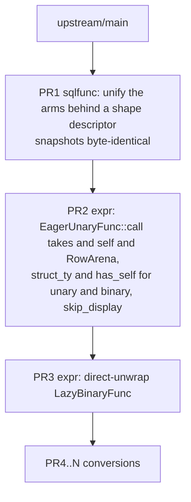

# Canonicalize the `#[sqlfunc]` macro and convert the remaining hand-written functions

* Associated: [#36697](https://github.com/MaterializeInc/materialize/pull/36697) (to be closed), [#36705](https://github.com/MaterializeInc/materialize/pull/36705) (to be closed), [#33805](https://github.com/MaterializeInc/materialize/pull/33805) (closed)
* Associated branches: `sqlfunc-self-arena`, `sqlfunc-binary-direct-unwrap`

## The Problem

The `#[sqlfunc]` attribute macro generates the trait implementations for SQL scalar
functions, and 535 functions in `src/expr/src/scalar/` already use it. Another 69
functions still carry hand-written `EagerUnaryFunc`, `EagerBinaryFunc`,
`LazyUnaryFunc`, `LazyVariadicFunc`, or `EagerVariadicFunc` implementations, which
means their `output_sql_type`, `propagates_nulls`, `introduces_nulls`, and
`could_error` semantics are restated by hand rather than derived from a signature.
Each hand-written implementation is an opportunity for those five methods to drift
out of agreement with the function body. The immediate cause is not the functions
themselves but a gap in the macro.

Sixty of those 69 functions carry state in struct fields, and the macro refuses
stateful unary and binary functions. `unary_func` and `binary_func` in
`src/expr-derive-impl/src/sqlfunc.rs` index `sig.inputs` from position zero, so a
`&self` receiver reaches `arg_type` and produces
`compile_error!("Unsupported argument type")`. Both arms then emit `pub struct
#struct_name;` unconditionally, so there is no way to attach the generated
implementation to a struct that already exists. The variadic arm solved this
problem already and `ArrayIndex` in `src/expr/src/scalar/func/variadic.rs` uses the
solution, but the fix never reached the other two arms.

The macro's own structure is what makes that fix expensive to apply. `sqlfunc.rs`
is 1627 lines, of which `unary_func`, `binary_func`, and `variadic_func` account
for 770 across three independent code paths. The three arms build the same eleven
optional override methods with 19 near-identical `quote!` blocks, enforce modifier
legality with 18 separately written `unknown_field` rejections, and each repeat the
emission of `Display`, `FuncName`, and the original function. Adding one capability
therefore means writing it three times, which is exactly what the abandoned
`sqlfunc-self-arena` branch did.

## Success Criteria

* A capability added to the macro is written once, not once per arity.
* Modifier legality is declared in one place and enforced uniformly, so a modifier
  that does not apply to an arity is rejected rather than silently ignored.
* Stateful unary and binary functions can use `#[sqlfunc]`, including functions that
  need `RowArena` access and functions whose `Display` depends on struct state.
* The count of hand-written scalar function implementations drops from 69 to 16, and
  every remaining one is hand-written for a documented reason rather than for want of
  macro support.
* No change to the SQL semantics, plan output, or `EXPLAIN` rendering of any
  function. Optimizer goldens and sqllogictest results are unchanged except where a
  golden records a function name that the change does not touch.
* The refactor step alone produces byte-identical macro output, proven by the
  existing snapshot suite.

## Out of Scope

**The nine casts generic over `E: Eval`.** `CastArrayToJsonb`, `CastArrayToArray`,
`CastListToJsonb`, `CastList1ToList2`, `CastRecord1ToRecord2`, `CastStringToArray`,
`CastStringToList`, `CastStringToMap`, and `CastStringToRange` hold sub-expressions
in `Box<E>` and evaluate them per element. The generic exists because both
`MirScalarExpr` (`src/expr/src/scalar.rs:1176`) and `LirScalarExpr`
(`src/compute-types/src/plan/scalar.rs:398`) implement `Eval`, a separation
completed by [#37961](https://github.com/MaterializeInc/materialize/pull/37961) on
2026-08-12. Supporting them requires the macro to emit an implementation generic
over a struct type parameter with a trait bound, which is a different mechanism from
the existing generic handling that erases type parameters to `Datum<'a>`. These stay
hand-written and the limitation is documented.

**The seven short-circuiting variadic functions.** `And`, `Or`, `Coalesce`,
`Greatest`, `Least`, `ErrorIfNull`, and `CaseLiteral` do not evaluate every operand.
The macro emits `Eager*` implementations only, which evaluate all arguments before
dispatch, so these cannot be expressed through it. `src/expr/src/scalar.rs:1413`
already documents the non-strictness that makes them special.

**Moving `ErrorIfNull` to the binary path.** It takes two operands and
`LazyBinaryFunc::eval` accepts `exprs: &[&'a impl Eval]`, so the binary path is not
missing the laziness it needs. What holds it in `VariadicFunc` is enum membership:
`src/sql/src/func.rs:5491` and `:6278`, the registration at
`src/expr/src/scalar/func.rs:145`, the non-strict list at
`src/expr/src/scalar.rs:1438`, two fuzz targets, and `EXPLAIN` rendering it as
`CallVariadic` rather than `CallBinary`. That is a planner change in a different
crate and it moves optimizer goldens, so mixing it into a macro stack would make
both harder to review.

**Collapsing per-function monomorphizations into vtable dispatch.** Both closed
predecessor PRs describe themselves as preparation for this. It remains the
motivating direction but is not part of this work.

**The `sqlfunc_doc` branch.** The `#[sqldoc]` experiment touches nearly every
`#[sqlfunc]` call site across 63 files. It is not being pursued, so this design does
not sequence around it.

## Solution Proposal

Refactor the three generator arms behind a single code path parameterized by a shape
descriptor, then use that single path to add the missing capabilities, then convert
the functions. The work lands as a stack of pull requests in which every macro
change precedes every conversion, so a conversion PR only ever exercises capability
that already landed.

### Current state

The 69 hand-written implementations break down as follows. Counts come from a sweep
of `src/expr/src/scalar/func/`.

| Trait | Count | Stateful | Location |
|---|---:|---:|---|
| `EagerUnaryFunc` | 40 | 40 | `impls/*.rs` |
| `EagerBinaryFunc` | 2 | 2 | `impls/list.rs`, `impls/string.rs` |
| `LazyUnaryFunc` | 19 | 18 | `impls/*.rs` |
| `LazyVariadicFunc` | 7 | 1 | `variadic.rs`, `impls/case_literal.rs` |
| `EagerVariadicFunc` | 1 | 1 | `variadic.rs` |

Only `CastStringToInt2Vector` among the unary and binary implementations is a unit
struct. The remaining 60 carry fields, which is the single reason they were left
behind.

Nineteen of the 61 unary and binary implementations use the lazy trait, but ten of
them are eager functions in disguise: their `eval` bodies evaluate the single input
expression, return early on `Datum::Null`, and then do the work. That shape is
exactly `EagerUnaryFunc` plus `propagates_nulls` plus arena access. The other nine
are the generic `E: Eval` casts listed under Out of Scope.

Twenty-four of the 61 have a `Display` implementation that reads struct state, for
example `write!(f, "extract_{}_ts", self.0)` in `impls/timestamp.rs` and a `match`
on `self.length` in `impls/string.rs`.

### Why the arms diverged

The three generators differ in five ways that are real, and in one way that is not.

Real differences:

* The trait path: `crate::func::EagerUnaryFunc`,
  `crate::func::binary::EagerBinaryFunc`, `crate::func::variadic::EagerVariadicFunc`.
* The `Input<'a>` associated type: a bare type, a two-tuple, or a wider tuple.
* Whether `call` receives a `&'a RowArena`.
* The `output_sql_type` signature: `SqlColumnType` for unary against
  `&[SqlColumnType]` for the other two, and a nullability formula that carries a
  `non_nullable_position_checks` term only in the non-unary cases.
* Which modifiers apply, and with which return type. `is_monotone` returns `bool`
  for unary and variadic but `(bool, bool)` for binary.

The difference that is not real is everything else. The table below maps each
optional override method to the arms that build it, and every cell is the same
three-line `quote!`.

| Method | Unary | Binary | Variadic |
|---|:-:|:-:|:-:|
| `could_error` | yes | yes | yes |
| `introduces_nulls` | yes | yes | yes |
| `is_monotone` | yes | yes | yes |
| `is_infix_op` | | yes | yes |
| `propagates_nulls` | | yes | yes |
| `inverse` | yes | | |
| `preserves_uniqueness` | yes | | |
| `is_eliminable_cast` | yes | | |
| `negate` | | yes | |
| `is_infinity_monotone` | | yes | |
| `is_associative` | | | yes |

### The shape descriptor

Represent the shape as an enum with narrow methods, and drive the whole sequence
from one function.

```rust
enum Shape { Unary, Binary, Variadic }

impl Shape {
    fn trait_path(&self) -> TokenStream;
    fn input_assoc(&self, tys: &[syn::Type]) -> TokenStream;
    fn call_params(&self) -> TokenStream;
    fn output_sql_type_sig(&self) -> TokenStream;
    fn nullability(&self, checks: &[TokenStream]) -> TokenStream;
    fn modifiers(&self) -> &'static [(Modifier, ReturnTy)];
}

fn generate(
    shape: Shape,
    func: &syn::ItemFn,
    mods: Modifiers,
    struct_ty: Option<syn::Path>,
    has_self: bool,
) -> darling::Result<TokenStream>;
```

Modifier handling becomes table driven. A `Modifier` enum and a
`Modifiers::iter() -> impl Iterator<Item = (Modifier, &Expr)>` let `generate` walk
the modifiers that are present, check each against `shape.modifiers()`, and emit
every one of the eleven simple overrides through the same template:

```rust
fn #name(&self) -> #ret { #expr }
```

That replaces 19 `quote!` blocks and all 18 hand-written rejections with one loop
and one error message shape. The five modifiers that are not simple overrides,
`sqlname`, `output_type`, `output_type_expr`, `test`, and `skip_display`, stay
explicit in `generate`, because they feed `Display`, the `output_sql_type` body, and
the emission decision rather than producing a trait method.

Emission is shape independent and is written once: the choice between defining a
unit struct and attaching to an external struct, the `Display` implementation or its
suppression, `FuncName`, and re-emitting the annotated function.

The expected result is that the 770 lines of arm code become roughly 180 lines of
`generate`, 120 lines of `impl Shape`, and three entry points of about five lines
each.

One behavior change falls out of the table. Today `is_infinity_monotone` passed to a
unary or variadic function is silently discarded, because both arms destructure it
as `is_infinity_monotone: _`. Under the table it becomes an error. All six uses in
the tree are `mul_*` and `div_*` in `src/expr/src/scalar/func.rs`, all binary, so
nothing in the tree is affected.

### Decisions carried over from the closed predecessors

Two choices from `sqlfunc-self-arena` are adopted rather than reinvented.

`skip_display = true` is the mechanism for state-dependent names. The alternative
considered was extending `sqlname` to accept an expression evaluated with `self` in
scope. Suppression is simpler, it keeps the 24 hand-written `Display` bodies exactly
as they read today, and it costs one modifier and one branch in the shared emission.

`EagerUnaryFunc::call` takes `&'a self` and `&'a RowArena` unconditionally,
mirroring the binary and variadic shapes. This removes the arena axis and the
receiver axis from the descriptor entirely instead of parameterizing them, which is
the point of canonicalizing. It costs a mechanical change at every unary call site
and the blanket implementation in `src/expr/src/scalar/func/unary.rs`.

### The stack



**PR1, the refactor.** Introduces `Shape`, `Modifier`, and `generate`, and rewrites
the three entry points to call it. No capability is added. All 13 existing snapshots
stay byte identical, including
`mz_expr_derive_impl__test__unary_arena_fn.snap`, which today asserts
`compile_error!("Unary functions do not yet support RowArena.")`. That snapshot is
the tripwire: if PR1 accidentally smuggles in capability, it moves.

**PR2, the capabilities.** Changes `EagerUnaryFunc::call` to take `&'a self` and
`&'a RowArena`, updates the blanket implementation and every unary call site,
threads `struct_ty` and `has_self` into the unary and binary shapes, offsets
argument indices past the receiver, and adds `skip_display`. Because the arms are
already unified, this is a change to `generate` plus two constant flags rather than
two copies of the variadic arm. Snapshots move once, and `unary_arena_fn.snap` gains
real output. `RangeCreate` in `variadic.rs` converts here, since it is blocked
solely on `skip_display` and it proves the modifier works.

**PR3, the codegen cleanup.** Removes the blanket `impl<T: EagerBinaryFunc>
LazyBinaryFunc for T` and emits an explicit `impl LazyBinaryFunc` per generated
struct that calls `try_from_result` per argument instead of
`<(T0, T1) as InputDatumType>::try_from_iter`. `ListLengthMax` and `RegexpReplace`
keep the tuple path through a `lazy_via_eager_binary!` declarative macro until their
conversion PRs land. The measurements recorded on the closed
[#36705](https://github.com/MaterializeInc/materialize/pull/36705) were a 4.4%
reduction in `cargo llvm-lines -p mz-expr` (1,289,072 to 1,232,567), elimination of
93,259 lines across 218 copies of the tuple `try_from_iter`, and a 23.5% reduction
in per-variant binary dispatch assembly (949 instructions to 726). Those numbers
were taken against a May 2026 tree and must be re-measured.

**PR4 onward, the conversions.** Each converts hand-written implementations to
`#[sqlfunc]` and deletes the originals. The convertible functions span 20 files, so
the cut is discussed under Open questions.

### Conversion inventory

Fifty-three of the 69 convert. The distribution across files, after removing the
nine out-of-scope generic casts, is:

| File | Convertible |
|---|---:|
| `impls/timestamp.rs` | 16 |
| `impls/string.rs` | 11 |
| `impls/date.rs` | 3 |
| `impls/time.rs` | 3 |
| `impls/list.rs` | 2 |
| `impls/map.rs` | 2 |
| `impls/record.rs` | 2 |
| `impls/array.rs` | 1 |
| `impls/char.rs` | 1 |
| `impls/jsonb.rs` | 1 |
| `impls/numeric.rs` | 1 |
| `impls/range.rs` | 1 |
| `impls/float32.rs`, `impls/float64.rs` | 1 each |
| `impls/int16.rs`, `impls/int32.rs`, `impls/int64.rs` | 1 each |
| `impls/uint16.rs`, `impls/uint32.rs`, `impls/uint64.rs` | 1 each |
| `variadic.rs` (`RangeCreate`, lands in PR2) | 1 |

### Verification

Each PR runs `cargo test -p mz-expr-derive-impl` for the snapshot suite,
`cargo test -p mz-expr`, `bin/sqllogictest --optimized`, and the optimizer goldens,
plus `bin/lint` and `bin/fmt` before commit.

PR1 additionally requires that no snapshot file changes at all, which is a stronger
statement than the suite passing.

The conversion PRs carry a residual risk that the existing suite does not fully
close. When a modifier is absent the macro falls back to a default derived from the
associated types, and its `output_sql_type` computes nullability as
`output.nullable(nullable || (propagates_nulls && input_type.nullable))` rather than
whatever the hand-written body said. A hand-written override that disagreed with the
derived default would change meaning silently if no test exercises that column's
nullability. The mitigation is procedural and costs nothing, because the
`output_type_expr` has to be written anyway: for every function, diff the
`output_type_expr` being written against the `output_sql_type` body being deleted,
and justify any difference in the PR description.

### Dependencies that change

* `EagerUnaryFunc::call` gains `&'a self` and a `&'a RowArena` parameter. Every
  implementor and the blanket `impl<T: EagerUnaryFunc> LazyUnaryFunc for T` in
  `src/expr/src/scalar/func/unary.rs` update in PR2.
* The blanket `impl<T: EagerBinaryFunc> LazyBinaryFunc for T` in
  `src/expr/src/scalar/func/binary.rs` is removed in PR3.
* `is_infinity_monotone` becomes an error on unary and variadic functions.
* `doc/developer/sqlfunc.md` gains the `skip_display` modifier, a corrected arity
  table, and a section naming the two shapes the macro deliberately does not cover.

## Minimal Viable Prototype

The capability half of this design was already built and measured. The closed
`sqlfunc-self-arena` branch implemented `&self` support, arena support, and
`skip_display` for unary and binary, and converted 19 hand-written implementations,
and `sqlfunc-binary-direct-unwrap` implemented the direct-unwrap change on top with
the measurements quoted above. Both are unmergeable today because 26 of the 29 files
they touch changed on `main` and their conversions predate the MIR and LIR
separation, but they establish that the generated code compiles and the tests pass.

The refusal this design removes was confirmed directly against the current tree by
running the macro on a stateful unary and a stateful binary signature through
`mz_expr_derive_impl::test_sqlfunc`. Both produced
`compile_error!("Unsupported argument type")`, locating the refusal at `arg_type`
reaching the `FnArg::Receiver` arm.

No further prototype is proposed before PR1, because PR1 is a refactor whose
acceptance test is that 13 existing snapshot files do not change.

## Alternatives

**Extract shared helpers and keep three arms.** Pull the duplicated `quote!` blocks
into free functions and leave `unary_func`, `binary_func`, and `variadic_func`
calling them. This is the smallest and safest diff and it would shrink the arms by
roughly 40%. It was rejected because it does not address the stated problem: there
would still be three code paths, still 18 separately written rejections, and PR2
would still write its capability into two arms rather than one.

**One body with arity as a parameter.** Treat unary and binary as arity one and
arity two of the variadic generator. This maximizes unification, but the three
traits are not specializations of one another. The `output_sql_type` signature, the
nullability formula, and the `Input<'a>` construction all differ, so the branching
would move from function boundaries into conditionals inside a single body, which
reads worse than the current arms. It also carries the highest risk of moving a
snapshot, which PR1 forbids.

**Rebase the existing drafts and canonicalize afterwards.** This preserves the
review history on [#36697](https://github.com/MaterializeInc/materialize/pull/36697)
and [#36705](https://github.com/MaterializeInc/materialize/pull/36705). It was
rejected on two grounds. The macro portion rebases cleanly, since `sqlfunc.rs`
drifted only 38 lines, but `src/expr/src/scalar/func/impls/` drifted by 3423 added
and 276 removed lines and 26 of the 29 touched files conflict. More importantly, the
branch's conversions of the compound casts hardcode `Box<MirScalarExpr>`, which was
correct against its May 2026 base and is wrong now that `LirScalarExpr` also
implements `Eval`. Landing the capability before the refactor also means writing it
three times and then unwriting two of them.

**Add `&self` by copying the variadic arm into the other two and defer the
refactor.** This is the shortest path to converting the 42 easiest functions. It was
rejected because it is precisely what the closed draft did, and the resulting
triplication is the problem this design exists to remove.

**Keep a dynamic `sqlname` instead of `skip_display`.** Extending `sqlname` to
accept an expression with `self` in scope would let the macro generate all 24
state-dependent `Display` implementations. It was rejected as more machinery for no
gain: the hand-written bodies are already correct and readable, and suppression is
one flag.

## Open questions

**How should the 53 conversions be cut into pull requests?** The agreed granularity
was one PR per source file, on the expectation of 12 files. The convertible
functions actually span 20 files, and 12 of those contain a single function, mostly
the near-identical `Cast*ToNumeric` family. Twenty pull requests for 53 functions is
a large number of CI builds for changes that are individually trivial. A grouping
that preserves file-level reviewability while cutting the build count to eight would
be: the ten numeric-scale casts as one PR, `date.rs`, `time.rs`, the eight
compound-type functions across `array.rs`, `list.rs`, `map.rs`, `range.rs`, and
`record.rs` as one PR, `char.rs`, the six `CastStringTo*` functions, the five
regular expression functions, and `timestamp.rs`. This needs a decision before the
plan is written.

**Are the [#36705](https://github.com/MaterializeInc/materialize/pull/36705)
measurements still representative?** They were taken against a May 2026 tree, before
the MIR and LIR separation changed the shape of the dispatch path. PR3 should
re-measure before claiming the win.

**Where is the vtable dispatch prompt?** Both closed PRs link to
`doc/developer/prompts/sqlfunc-dyn-dispatch.md`, which was never committed on either
branch. If it exists it would inform whether PR3's direct-unwrap is the right
intermediate step or whether it should be skipped in favor of the end state.
