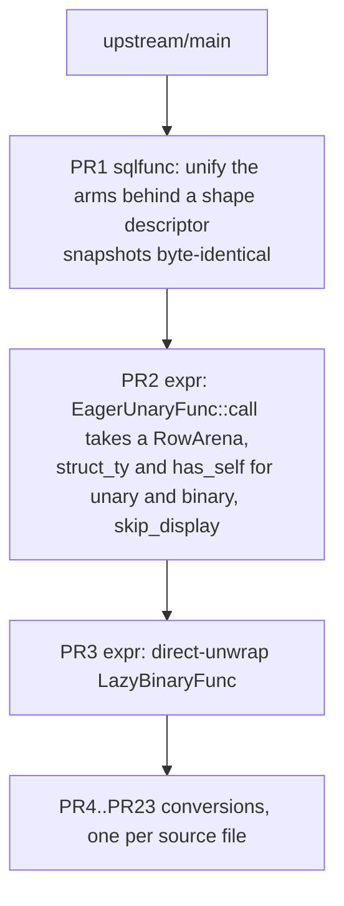

# Canonicalize the `#[sqlfunc]` macro and convert the remaining hand-written functions

* Associated: [#36697](https://github.com/MaterializeInc/materialize/pull/36697) (open draft, to be closed by this work), [#36705](https://github.com/MaterializeInc/materialize/pull/36705) (open draft, to be closed by this work), [#33805](https://github.com/MaterializeInc/materialize/pull/33805) (closed)
* Associated branches: `sqlfunc-self-arena`, `sqlfunc-binary-direct-unwrap`

## The Problem

The `#[sqlfunc]` attribute macro generates the trait implementations for SQL scalar
functions, and 535 functions in `src/expr/src/scalar/` already use it. Another 69
functions still carry hand-written `EagerUnaryFunc`, `EagerBinaryFunc`,
`LazyUnaryFunc`, `LazyVariadicFunc`, or `EagerVariadicFunc` implementations, which
means their `output_sql_type`, `propagates_nulls`, `introduces_nulls`, and
`could_error` semantics are restated by hand rather than derived from a signature.
Each hand-written implementation is an opportunity for those five methods to drift
out of agreement with the function body. The immediate cause is not the functions
themselves but a gap in the macro.

Sixty-two of those 69 functions carry state in struct fields, and 60 of the 61
unary and binary ones do. The macro refuses stateful unary and binary functions.
`unary_func` and `binary_func` in
`src/expr-derive-impl/src/sqlfunc.rs` index `sig.inputs` from position zero, so a
`&self` receiver reaches `arg_type` and produces
`compile_error!("Unsupported argument type")`. Both arms then emit `pub struct
#struct_name;` unconditionally, so there is no way to attach the generated
implementation to a struct that already exists. The variadic arm solved this
problem already and `ArrayIndex` in `src/expr/src/scalar/func/variadic.rs` uses the
solution, but the fix never reached the other two arms.

The macro's own structure is what makes that fix expensive to apply. `sqlfunc.rs`
is 1627 lines, of which `unary_func`, `binary_func`, and `variadic_func` account
for 762 across three independent code paths. The three arms build the same eleven
optional override methods with 19 near-identical `quote!` blocks, enforce modifier
legality with 12 separately written `unknown_field` rejections, and each repeat the
emission of `Display`, `FuncName`, and the original function. Adding one capability
therefore means writing it three times, which is exactly what the abandoned
`sqlfunc-self-arena` branch did.

## Success Criteria

* A capability added to the macro is written once, not once per arity.
* Modifier legality is declared in one place and enforced uniformly, so a modifier
  that does not apply to an arity is rejected rather than silently ignored.
* Stateful unary and binary functions can use `#[sqlfunc]`, including functions that
  need `RowArena` access and functions whose `Display` depends on struct state.
* The count of hand-written scalar function implementations drops from 69 to 16, and
  every remaining one is hand-written for a documented reason rather than for want of
  macro support.
* No change to the SQL semantics, plan output, or `EXPLAIN` rendering of any
  function. Optimizer goldens and sqllogictest results are unchanged. Because
  `skip_display` preserves every hand-written `Display` body verbatim, no function
  name or format changes, so any golden diff is a regression rather than an
  expected outcome.
* The refactor step alone produces byte-identical macro output, proven by the
  existing snapshot suite.

## Out of Scope

**The nine casts generic over `E: Eval`.** `CastArrayToJsonb`, `CastArrayToArray`,
`CastListToJsonb`, `CastList1ToList2`, `CastRecord1ToRecord2`, `CastStringToArray`,
`CastStringToList`, `CastStringToMap`, and `CastStringToRange` hold sub-expressions
in `Box<E>` and evaluate them per element. The generic exists because both
`MirScalarExpr` (`src/expr/src/scalar.rs:1176`) and `LirScalarExpr`
(`src/compute-types/src/plan/scalar.rs:398`) implement `Eval`, a separation
completed by [#37961](https://github.com/MaterializeInc/materialize/pull/37961) on
2026-08-12. Supporting them requires the macro to emit an implementation generic
over a struct type parameter with a trait bound, which is a different mechanism from
the existing generic handling that erases type parameters to `Datum<'a>`. These stay
hand-written and the limitation is documented.

**The seven short-circuiting variadic functions.** `And`, `Or`, `Coalesce`,
`Greatest`, `Least`, `ErrorIfNull`, and `CaseLiteral` do not evaluate every operand.
The macro emits `Eager*` implementations only, which evaluate all arguments before
dispatch, so these cannot be expressed through it. The doc comment and `non_strict`
match at `src/expr/src/scalar.rs:1413-1438` document this for `And`, `Or`, and
`ErrorIfNull` only. The other four are short-circuiting by inspection of their `eval`
bodies in `src/expr/src/scalar/func/variadic.rs` and
`src/expr/src/scalar/func/impls/case_literal.rs`, not by any existing documentation.

**Moving `ErrorIfNull` to the binary path.** It takes two operands and
`LazyBinaryFunc::eval` accepts `exprs: &[&'a impl Eval]`, so the binary path is not
missing the laziness it needs. What holds it in `VariadicFunc` is enum membership:
`src/sql/src/func.rs:5491` and `:6278`, the registration at
`src/expr/src/scalar/func.rs:145`, the non-strict list at
`src/expr/src/scalar.rs:1438`, two fuzz targets, and `EXPLAIN` rendering it as
`CallVariadic` rather than `CallBinary`. That is a planner change in a different
crate and it moves optimizer goldens, so mixing it into a macro stack would make
both harder to review.

**Collapsing per-function monomorphizations into vtable dispatch.** Both superseded
predecessor PRs describe themselves as preparation for this. It remains the
motivating direction but is not part of this work.

**The `sqlfunc_doc` branch.** The `#[sqldoc]` experiment touches nearly every
`#[sqlfunc]` call site across 63 files. It is not being pursued, so this design does
not sequence around it.

## Solution Proposal

Refactor the three generator arms behind a single code path parameterized by a shape
descriptor, then use that single path to add the missing capabilities, then convert
the functions. The work lands as a stack of pull requests in which every macro
change precedes every conversion, so a conversion PR only ever exercises capability
that already landed.

### Current state

The 69 hand-written implementations break down as follows. Counts come from a sweep
of `src/expr/src/scalar/func/`.

| Trait | Count | Stateful | Location |
|---|---:|---:|---|
| `EagerUnaryFunc` | 40 | 40 | `impls/*.rs` |
| `EagerBinaryFunc` | 2 | 2 | `impls/list.rs`, `impls/string.rs` |
| `LazyUnaryFunc` | 19 | 18 | `impls/*.rs` |
| `LazyVariadicFunc` | 7 | 1 | `variadic.rs`, `impls/case_literal.rs` |
| `EagerVariadicFunc` | 1 | 1 | `variadic.rs` |

Only `CastStringToInt2Vector` among the unary and binary implementations is a unit
struct. The remaining 60 carry fields, which is the single reason they were left
behind.

Nineteen of the 61 unary and binary implementations use the lazy trait, but ten of
them are eager functions in disguise: their `eval` bodies evaluate the single input
expression, return early on `Datum::Null`, and then do the work. That shape is
exactly `EagerUnaryFunc` plus `propagates_nulls` plus arena access. The other nine
are the generic `E: Eval` casts listed under Out of Scope.

Twenty-four of the 61 have a `Display` implementation that reads struct state, for
example `write!(f, "extract_{}_ts", self.0)` in `impls/timestamp.rs` and a `match`
on `self.length` in `impls/string.rs`.

### Why the arms diverged

The three generators differ in six ways that are real, and in one way that is not.

Real differences:

* The trait path: `crate::func::EagerUnaryFunc`,
  `crate::func::binary::EagerBinaryFunc`, `crate::func::variadic::EagerVariadicFunc`.
* The `Input<'a>` associated type: a bare type, a two-tuple, or a wider tuple.
* Whether `call` receives a `&'a RowArena`. Binary and variadic do
  (`binary.rs:91`, `variadic.rs:1782`), unary does not (`unary.rs:114`).
* The name of the output-type method. `EagerUnaryFunc` and `EagerBinaryFunc` declare
  `output_sql_type` and carry a separate `output_type` convenience wrapper over
  `ReprColumnType`. `EagerVariadicFunc` has no `output_sql_type` at all: its core
  method is named `output_type` and takes `&[SqlColumnType]` directly
  (`variadic.rs:1784`). PR1 preserves this split exactly, because renaming either
  would move a snapshot.
* The output-type method's parameter and nullability formula: `SqlColumnType` for
  unary against `&[SqlColumnType]` for the other two, with a
  `non_nullable_position_checks` term only in the non-unary cases.
* Which modifiers apply, and with which return type. `is_monotone` returns `bool`
  for unary and variadic but `(bool, bool)` for binary.

The method-name split is the one place where `Shape` cannot pretend the traits are
uniform. `Shape::output_method()` returns both the name and the signature, and
`generate` uses whatever it returns. That is a per-shape quirk carried as data, which
is the honest outcome, not a failure of the decomposition.

The difference that is not real is everything else. The table below maps each
optional override method to the arms that build it, and every cell is the same
three-line `quote!`.

| Method | Unary | Binary | Variadic |
|---|:-:|:-:|:-:|
| `could_error` | yes | yes | yes |
| `introduces_nulls` | yes | yes | yes |
| `is_monotone` | yes | yes | yes |
| `is_infix_op` | | yes | yes |
| `propagates_nulls` | | yes | yes |
| `inverse` | yes | | |
| `preserves_uniqueness` | yes | | |
| `is_eliminable_cast` | yes | | |
| `negate` | | yes | |
| `is_infinity_monotone` | | yes | |
| `is_associative` | | | yes |

### The shape descriptor

Represent the shape as an enum with narrow methods, and drive the whole sequence
from one function.

```rust
enum Shape { Unary, Binary, Variadic }

impl Shape {
    fn modifiers(&self) -> &'static [(Modifier, ReturnTy)];
    fn label(&self) -> &'static str;
    fn trait_path(&self) -> TokenStream;
    fn output_method(&self) -> (proc_macro2::Ident, TokenStream); // name and parameter
    fn takes_arena(&self) -> bool;
    fn nullability(&self, checks: &[TokenStream]) -> TokenStream;
}

fn generate(
    shape: Shape,
    func: &syn::ItemFn,
    mods: Modifiers,
    struct_ty: Option<syn::Path>,
    has_self: bool,
) -> darling::Result<TokenStream>;
```

Modifier handling becomes table driven. A `Modifier` enum and a
`Modifiers::iter() -> impl Iterator<Item = (Modifier, &Expr)>` let `generate` walk
the modifiers that are present, check each against `shape.modifiers()`, and emit
every one of the eleven simple overrides through the same template:

```rust
fn #name(&self) -> #ret { #expr }
```

That replaces 19 `quote!` blocks and all 12 hand-written legality rejections with one loop
and one error message shape. Four of the modifiers that are not simple overrides,
`sqlname`, `output_type`, `output_type_expr`, and `skip_display`, stay explicit in
`generate`, because they feed `Display`, the `output_sql_type` body, and the emission
decision rather than producing a trait method. `test` is not read by `generate` at
all: `sqlfunc.rs` consumes it through `Modifiers::generates_test` to decide whether to
emit a snapshot test alongside the trait impl.

Emission is shape independent and is written once: the choice between defining a
unit struct and attaching to an external struct, the `Display` implementation or its
suppression, `FuncName`, and re-emitting the annotated function.

The win is structural rather than a reduction in line count. The three arms collapse
to one `generate`, three thin entry points, and a `Shape` that declares the six
divergences as data, so a capability is added in one place. Total lines across the
crate's modules go up slightly, because the descriptor machinery, the tests pinning
it, and the doc comments stating the new contracts all cost lines that three
copy-pasted arms did not. Measure the refactor by how many places a new capability
has to touch, which goes from three to one, not by the diff's sign.

One behavior change falls out of the table. Today `is_infinity_monotone` passed to a
unary or variadic function is silently discarded, because both arms destructure it
as `is_infinity_monotone: _`. Under the table it becomes an error. All six uses in
the tree are `mul_*` and `div_*` in `src/expr/src/scalar/func.rs`, all binary, so
nothing in the tree is affected.

### Module layout

`sqlfunc.rs` splits into five modules with an acyclic dependency graph:

* `shape.rs` and `signature.rs` are leaves. `shape.rs` holds the per-arity data:
  `Shape`, `Modifier`, `ReturnTy`, and the three modifier tables. `signature.rs` holds
  the `syn` signature analysis, reading a function's parameters, generics, and return
  type, and references none of the macro's own types.
* `modifiers.rs` depends on `shape` only, for the `Modifier` and `Shape` types that
  `Modifiers::iter` and `reject_inapplicable` check against.
* `generate.rs` depends on `shape`, `signature`, and `modifiers`, since emission needs
  the per-arity data, the signature analysis, and the parsed modifiers together.
* `sqlfunc.rs` is the entry point and depends on all four: it parses the attribute
  into `Modifiers`, classifies the annotated function's arity into a `Shape`, and
  hands both to `generate::generate`.

The graph is acyclic, so each capability is declared in one leaf rather than
negotiated between peers. `shape.rs` does not need to know how a modifier is parsed
and `signature.rs` does not need to know what a modifier is, which keeps a change to
one from forcing a change to the other.

### Decisions carried over from the superseded drafts

Two choices from `sqlfunc-self-arena` are adopted rather than reinvented.

`skip_display = true` is the mechanism for state-dependent names. The alternative
considered was extending `sqlname` to accept an expression evaluated with `self` in
scope. Suppression is simpler, it keeps the 24 hand-written `Display` bodies exactly
as they read today, and it costs one modifier and one branch in the shared emission.

`EagerUnaryFunc::call` gains a `&'a RowArena` parameter unconditionally. This part
does mirror the other two shapes, which already take an arena at `binary.rs:91` and
`variadic.rs:1782`, and it removes the arena axis from the descriptor instead of
parameterizing it.

Whether the receiver also becomes `&'a self` is a separate question and is not
settled by precedent. No `Eager*Func::call` in the tree takes `&'a self` today, all
three take a plain `&self`, and only the outer `Lazy*Func::eval` methods tie the
receiver to `'a`. The reason to consider it is that a stateful function with arena
access may need to produce output borrowed from its own fields, which a plain
`&self` cannot express when the output carries `'a`. The cost is real: tying the
receiver to the same `'a` as `Input<'a>` and `Output<'a>` is a variance change, not
a signature tweak, and any call site holding the function value in a shorter-lived
binding than its input will stop borrow-checking and need restructuring rather than
a mechanical edit. The implementation should start from plain `&self`, which is the
smaller change, and move to `&'a self` only if a conversion actually requires it.
See Open questions.

### The stack



**PR1, the refactor.** Introduces `Shape`, `Modifier`, and `generate`, and rewrites
the three entry points to call it. No capability is added. All 16 snapshots
stay byte identical, including
`mz_expr_derive_impl__test__unary_arena_fn.snap`, which today asserts
`compile_error!("Unary functions do not yet support RowArena.")`. That snapshot is
the tripwire: if PR1 accidentally smuggles in capability, it moves.

**PR2, the capabilities.** Adds a `&'a RowArena` parameter to
`EagerUnaryFunc::call`, updates the blanket implementation and every unary call
site, threads `struct_ty` and `has_self` into the unary and binary shapes, offsets
argument indices past the receiver, and adds `skip_display`. Because the arms are
already unified, this is a change to `generate` plus two constant flags rather than
two copies of the variadic arm. Snapshots move once, and `unary_arena_fn.snap` gains
real output. `RangeCreate` in `variadic.rs` converts here, since it is blocked
solely on `skip_display` and it proves the modifier works.

**PR3, the codegen cleanup.** Removes the blanket `impl<T: EagerBinaryFunc>
LazyBinaryFunc for T` and emits an explicit `impl LazyBinaryFunc` per generated
struct that calls `try_from_result` per argument instead of
`<(T0, T1) as InputDatumType>::try_from_iter`. `ListLengthMax` and `RegexpReplace`
keep the tuple path through a `lazy_via_eager_binary!` declarative macro until their
conversion PRs land. The measurements recorded on the superseded
[#36705](https://github.com/MaterializeInc/materialize/pull/36705) were a 4.4%
reduction in `cargo llvm-lines -p mz-expr` (1,289,072 to 1,232,567), elimination of
93,259 lines across 218 copies of the tuple `try_from_iter`, and a 23.5% reduction
in per-variant binary dispatch assembly (949 instructions to 726). Those numbers
were taken against a May 2026 tree and must be re-measured.

**PR4 through PR23, the conversions.** One pull request per source file, converting
every convertible implementation in that file to `#[sqlfunc]`, deleting the
hand-written originals, and removing the corresponding `func_name!` entries. The
convertible functions span 20 files, so there are 20 conversion pull requests.

One file is the cut rule, applied without exception. No file is subdivided and no
two files are combined, including the twelve files that hold a single function each.
The alternative considered was grouping by function family, which would have reduced
the count to eight, but it mixes two cut rules: some units would be a file and
others a family spanning several files. A single rule makes each unit's boundary
predictable from its name and makes the stack's shape obvious without consulting a
table.

Order within the twenty is by ascending risk, so the pattern is established on the
cheapest reviews first. The twelve single-function files come first, then
`impls/list.rs`, `impls/map.rs`, `impls/record.rs`, `impls/date.rs`, and
`impls/time.rs`, then `impls/string.rs` at eleven functions, and `impls/timestamp.rs`
at sixteen last.

### The conversion PRs share one file

The conversion PRs are not file-disjoint, which affects how the stack is maintained.
The `func_name!` block in `src/expr/src/scalar/func.rs` holds exactly 69 entries, one
per hand-written implementation, and each expands to
`impl FuncName for X { const NAME: &'static str = ...; }`. The macro emits that same
implementation itself, in all three arms. Converting a function therefore requires
deleting its `func_name!` entry in the same commit, or the build fails on a duplicate
trait implementation.

Fifty-two of the 53 conversions delete a line from that block. `RangeCreate` is the
exception: it has no entry today and gains a generated one.

The practical consequence is that all 20 conversion pull requests touch
`src/expr/src/scalar/func.rs`, so each landing requires restacking every branch above
it rather than rebasing independent branches. The entries are sorted alphabetically
and a file's functions are not a contiguous run, for example `impls/int32.rs`
contributes `CastInt32ToNumeric` while the neighbouring entries come from other
files, so adjacent-line conflicts should be expected rather than hoped against.

This is the accepted cost of the one-file cut rule. The conflicts are mechanical,
since every conversion only ever deletes lines from this block and no two pull
requests delete the same line. Resolving them means keeping both sides' deletions.
The stack is landed sequentially, which the repository requires anyway because it
squashes on merge.

### Conversion inventory

Fifty-three of the 69 convert. The distribution across files, after removing the
nine out-of-scope generic casts, is:

| File | Convertible |
|---|---:|
| `impls/timestamp.rs` | 16 |
| `impls/string.rs` | 11 |
| `impls/date.rs` | 3 |
| `impls/time.rs` | 3 |
| `impls/list.rs` | 2 |
| `impls/map.rs` | 2 |
| `impls/record.rs` | 2 |
| `impls/array.rs` | 1 |
| `impls/char.rs` | 1 |
| `impls/jsonb.rs` | 1 |
| `impls/numeric.rs` | 1 |
| `impls/range.rs` | 1 |
| `impls/float32.rs`, `impls/float64.rs` | 1 each |
| `impls/int16.rs`, `impls/int32.rs`, `impls/int64.rs` | 1 each |
| `impls/uint16.rs`, `impls/uint32.rs`, `impls/uint64.rs` | 1 each |
| `variadic.rs` (`RangeCreate`, lands in PR2) | 1 |

### Verification

Each PR runs `cargo test -p mz-expr-derive-impl` for the snapshot suite,
`cargo test -p mz-expr`, `bin/sqllogictest --optimized`, and the optimizer goldens,
plus `bin/lint` and `bin/fmt` before commit.

PR1 additionally requires that no pre-existing snapshot file changes, which is a
stronger statement than the suite passing. The branch does add new
`*_all_modifiers.snap` files as part of exercising the collapsed generator, which is
consistent with this: the requirement is stability of what already existed, not a
frozen snapshot count.

The conversion PRs carry a residual risk that the existing suite does not fully
close. When a modifier is absent the macro falls back to a default derived from the
associated types, for example `propagates_nulls` as `!Self::Input::nullable()`. A
hand-written override that disagreed with the derived default changes meaning
silently.

This applies to every one of the eleven override methods, not only to nullability.
The nullability case is the most visible, because the generated `output_sql_type`
computes `output.nullable(nullable || (propagates_nulls && input_type.nullable))`
rather than whatever the hand-written body said. The more dangerous cases are the
ones that change no query result at all: `preserves_uniqueness`, `is_monotone`,
`inverse`, `is_eliminable_cast`, and `could_error` feed index selection, cast
elimination, and error hoisting, so a disagreement there produces a different plan
for the same answer. `bin/sqllogictest --optimized` compares answers, so it would
not notice, and the optimizer goldens only notice if one happens to pin the plan
shape for that function.

The mitigation is procedural and costs nothing, because the modifiers have to be
written anyway. For each converted function, enumerate every method the hand-written
implementation overrode, confirm the conversion either carries it across as a
modifier or matches the macro's derived default, and record any deliberate
difference in the PR description. Deleting an override without either restating it
or checking the default is the specific mistake to avoid.

### Dependencies that change

* `EagerUnaryFunc::call` gains a `&'a RowArena` parameter. Every implementor and the
  blanket `impl<T: EagerUnaryFunc> LazyUnaryFunc for T` in
  `src/expr/src/scalar/func/unary.rs` update in PR2.
* The blanket `impl<T: EagerBinaryFunc> LazyBinaryFunc for T` in
  `src/expr/src/scalar/func/binary.rs` is removed in PR3.
* The `func_name!` block in `src/expr/src/scalar/func.rs` loses 52 entries across the
  conversion PRs.
* `is_infinity_monotone` becomes an error on unary and variadic functions.
* `doc/developer/sqlfunc.md` gains the `skip_display` modifier, a corrected arity
  table, and a section naming the two shapes the macro deliberately does not cover.
* The rustdoc on `src/expr-derive/src/lib.rs` is corrected in PR2. Its Limitations
  section states "Unary functions cannot yet receive a `&RowArena` as an argument"
  (line 51), which PR2 falsifies, and its `output_type_expr` entry claims the
  modifier "Applies to binary and variadic functions", which `unary_func` already
  contradicts today.
* Both [#36697](https://github.com/MaterializeInc/materialize/pull/36697) and
  [#36705](https://github.com/MaterializeInc/materialize/pull/36705) are closed when
  PR1 opens, with a comment pointing at this design.

## Minimal Viable Prototype

The capability half of this design was already built and measured. The
`sqlfunc-self-arena` branch implemented `&self` support, arena support, and
`skip_display` for unary and binary, and converted 19 hand-written implementations,
and `sqlfunc-binary-direct-unwrap` implemented the direct-unwrap change on top with
the measurements quoted above. Both are unmergeable today because 26 of the 29 files
they touch changed on `main` and their conversions predate the MIR and LIR
separation, but they establish that the generated code compiles and the tests pass.

The refusal this design removes was confirmed directly against the current tree by
running the macro on a stateful unary and a stateful binary signature through
`mz_expr_derive_impl::test_sqlfunc`. Both produced
`compile_error!("Unsupported argument type")`, locating the refusal at `arg_type`
reaching the `FnArg::Receiver` arm.

No further prototype is proposed before PR1, because PR1 is a refactor whose
acceptance test is that 13 existing snapshot files do not change.

## Alternatives

**Extract shared helpers and keep three arms.** Pull the duplicated `quote!` blocks
into free functions and leave `unary_func`, `binary_func`, and `variadic_func`
calling them. This is the smallest and safest diff and it would shrink the arms by
roughly 40%. It was rejected because it does not address the stated problem: there
would still be three code paths, still 12 separately written legality rejections, and PR2
would still write its capability into two arms rather than one.

**One body with arity as a parameter.** Treat unary and binary as arity one and
arity two of the variadic generator. This maximizes unification, but the three
traits are not specializations of one another. The `output_sql_type` signature, the
nullability formula, and the `Input<'a>` construction all differ, so the branching
would move from function boundaries into conditionals inside a single body, which
reads worse than the current arms. It also carries the highest risk of moving a
snapshot, which PR1 forbids.

**Rebase the existing drafts and canonicalize afterwards.** This preserves the
review history on [#36697](https://github.com/MaterializeInc/materialize/pull/36697)
and [#36705](https://github.com/MaterializeInc/materialize/pull/36705). It was
rejected on two grounds. The macro portion rebases cleanly, since `sqlfunc.rs`
drifted only 38 lines, but `src/expr/src/scalar/func/impls/` drifted by 3423 added
and 276 removed lines, and 26 of the 29 files `sqlfunc-self-arena` touches were
changed on `main`. More importantly, the
branch's conversions of the compound casts hardcode `Box<MirScalarExpr>`, which was
correct against its May 2026 base and is wrong now that `LirScalarExpr` also
implements `Eval`. Landing the capability before the refactor also means writing it
three times and then unwriting two of them.

**Add `&self` by copying the variadic arm into the other two and defer the
refactor.** This is the shortest path to converting the 42 easiest functions. It was
rejected because it is precisely what the superseded draft did, and the resulting
triplication is the problem this design exists to remove.

**Keep a dynamic `sqlname` instead of `skip_display`.** Extending `sqlname` to
accept an expression with `self` in scope would let the macro generate all 24
state-dependent `Display` implementations. It was rejected as more machinery for no
gain: the hand-written bodies are already correct and readable, and suppression is
one flag.

## Open questions

**Does `EagerBinaryFunc::call` also need `&'a self`?** PR2 gives the unary trait an
arena but leaves all three receivers as plain `&self`. If a stateful binary function
needs to return arena-borrowed output derived from its own fields, plain `&self`
blocks it. The two stateful `EagerBinaryFunc` implementations are `ListLengthMax`
(`impls/list.rs:312`) and `RegexpReplace` (`impls/string.rs:1363`). Confirm neither
needs it before PR2 fixes the receiver shape, because changing it later is a
variance change across every implementor rather than an additive one.

**Are the [#36705](https://github.com/MaterializeInc/materialize/pull/36705)
measurements still representative?** They were taken against a May 2026 tree, before
the MIR and LIR separation changed the shape of the dispatch path. PR3 should
re-measure before claiming the win. If re-measurement shows a materially smaller
win, PR3 still lands on the grounds that removing the blanket implementation makes
the emitted code per struct explicit and reviewable, but the PR description must
report the measured number rather than repeating the May figures. If it shows a
regression, PR3 is dropped and the conversions proceed without it.

**Where is the vtable dispatch prompt?** Both superseded drafts link to
`doc/developer/prompts/sqlfunc-dyn-dispatch.md`, which was never committed on either
branch. If it exists it would inform whether PR3's direct-unwrap is the right
intermediate step or whether it should be skipped in favor of the end state.
