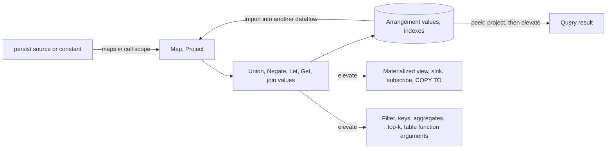

# Cell-scoped errors

* Associated: prototype on branch `datum-error-spike`, behind `enable_compute_cell_errors`.

## The problem

Materialize scopes every evaluation error to a row or to a collection.
An error in a map expression removes the row from the ok collection and adds an error to the error collection, and a query that reads the collection fails.
The error carries no provenance, so projecting away the column that produced it does not remove it.
An indexed view `SELECT id, province, length(sin::int8::text) = 9 AS sin_valid FROM customers` fails `SELECT id, province FROM v` as soon as one `sin` does not parse, and the error message contains the value.
Column-level access control needs the opposite: what a reader sees, errors included, must depend only on columns the reader can see.

## Success criteria

* An error in a map expression is observable only through its column.
* Operators whose semantics for errors in a cell are not defined turn the cell's error into a collection-scoped error, rather than guessing.
* Constant folding, dataflows, and peeks agree on every query.
* With the feature disabled, behavior is unchanged.

## Out of scope

* Persisting error cells. Materialized views, continual tasks, and sinks are boundaries.
* Redacting error payloads. Collection-scoped errors still carry values, which access control has to address separately.
* A mechanized model. This document fixes the rules that a model would check.

## Solution proposal

### Terms

A *cell-scoped error* is a `Datum::Error` in one column of one row.
A *collection-scoped error* is an update in the error collection, which fails every read of the collection.
*Elevating* a row turns its first error datum, in column order, into a collection-scoped error and removes the row from the ok collection.
A *boundary* is a place where rows leave the region in which error datums may exist, so every row crossing it is elevated.

### Representation

`Datum::Error(DatumError<'a>)` holds opaque bytes, the `ProtoEvalError` encoding of an `EvalError`.
`mz_repr` does not interpret the bytes, and `mz_expr` owns the encoding through `EvalError::to_datum` and `EvalError::from_datum_error`.
Rows store an error datum under its own tag with a length-prefixed payload.
`ProtoDatum` refuses to encode an error datum, so a durable encoding never contains one.
An error datum is an instance of every type, the same way `Datum::Dummy` passes the optimizer's type checks.

### Evaluation rules

The rules below define the semantics.
Each names the operator, what it does with error datums, and why.

1. **Map.**
   An error from evaluating a map expression becomes the value of its column.
2. **Column reference.**
   Evaluating a column reference that holds an error datum raises the error.
   All existing scalar error semantics then apply unchanged: `AND` and `OR` mask an error with a short-circuiting value, `CASE` and `If` evaluate only the selected branch, and `COALESCE` stops at the first non-null argument.
   No scalar function needs to know about error datums.
3. **Project.**
   Dropping a column drops its error.
4. **Filter.**
   A predicate decides whether the row exists, so an error in a predicate elevates the row.
   The predicates of one MFP combine like `AND`: `false` masks an error, an error masks `null`, and the reported error is the greatest one, as for scalar `AND`.
   Evaluating them in sequence and stopping at the first error would let the optimizer's predicate order decide whether a row errors, and a reader could steer that order to probe a column it reads only in a predicate.
   This holds within one MFP only.
   Two filters separated by a join, a `Let`, or an arrangement still decide in sequence, and with `p = NULL` before `q = ERROR` they drop a row that one fused filter would fail on.
   Removing that dependence needs `NULL` to absorb `ERROR` in scalar `AND`.
   Join equivalences and temporal bounds are predicates, but they are evaluated in sequence.
5. **Keys.**
   An error in an arrangement key, join key, grouping key, or the implicit key of `DISTINCT` and threshold has no defined meaning, so key evaluation raises and elevates.
   Key expressions go through rule 2, so this needs no dedicated code.
6. **Aggregates.**
   Aggregate inputs are elevated.
   Error semantics for aggregates, for example whether `count(x)` counts an error, are not defined.
7. **Top-k.**
   Top-k reads ordering and grouping columns without evaluating expressions, so it elevates its input.
8. **Table functions.**
   Table function arguments decide which rows exist, so their errors elevate the row.
   Columns passed through a table function, and the maps after it, keep error datums in their cells.
9. **Row-moving operators.**
   Union, negate, `Let`, `LetRec`, `Get`, arrangement values, and the non-key columns of a join pass error datums through unchanged.
   Consolidation compares error datums by their encoded bytes.

A consequence of rules 1 to 9: if an evaluation succeeds under row-scoped errors, it succeeds with the same rows under cell-scoped errors.
A successful row-scoped evaluation hit no error in any map expression it evaluated, and cell-scoped evaluation of the same expressions computes the same values.
Cell-scoped errors therefore only remove failures, and never change a successful result.
The tests support this claim, but nothing proves it yet.

### Boundaries

Error datums exist only inside a dataflow.
Materialized views, continual tasks, sinks, `SUBSCRIBE`, and `COPY TO` are boundaries, so persist never stores an error datum.
Peek results are a boundary.

MFPs at a boundary evaluate in `ErrorScope::Boundary`.
Map expressions produce error datums as inside the dataflow, and only error datums that survive the projection are elevated.
An erroring map expression whose column a peek projects away therefore does not fail the peek, matching rule 3.

### Indexes

An index is not a boundary.
Arrangement values hold error datums, and a peek or an import into another dataflow reads them through an MFP.
A peek that projects away a column with errors succeeds, which is what column-level access control needs from indexed views.
A dataflow that imports the index keeps error datums in cells until one of its own boundaries.
Arrangement keys never hold error datums, because key evaluation elevates.

### Static evaluation

Constant folding must give the answer a dataflow gives.
This design keeps error datums out of constant rows, so that no encoding of a plan has to carry one.
With the feature enabled, `FoldConstants` leaves a `Map` over a constant unfolded when any map expression errors on any row.
Demand analysis can then drop an unused erroring expression, after which folding proceeds, and a used one reaches the dataflow, which scopes the error to its cell.

Folding a scalar expression to an error literal remains correct, because evaluating the literal in a map position produces an error datum under rule 1.
Transforms that remove unused map expressions agree with rule 3.
Under row-scoped errors such removals were a choice the optimizer could make, and under cell-scoped errors they are required.

A peek whose plan is a linear operator around a constant takes the fast path, which evaluates the operator in the adapter under `ErrorScope::Boundary`.
The result matches what a dataflow computes, and the error message keeps the formatting of constant errors, which omits the `Evaluation error:` prefix that dataflow errors carry.
Without the fast path, unfolded maps would change the text of errors that constant folding reported before.

`Eval::could_error` keeps its contract, "could error on non-error input".
A column reference cannot error on non-error input, so it reports `false`.
Rendering that uses `could_error` to select an infallible join path treats every join closure as fallible when the feature is enabled, since its inputs may hold error datums.

### Configuration

The error scope is a property of a cluster, fixed when the cluster is created.
Arrangements hold error datums that every later reader must expect, and all replicas of a cluster must compute the same results, so neither a replica nor the optimizer may change the scope on its own.

`CREATE CLUSTER` reads the parameter `enable_compute_cell_errors` and records the value in the managed cluster's optimizer feature overrides, which the catalog stores durably.
The optimizer applies those overrides for every statement on the cluster, so `OptimizerFeatures::enable_cell_errors` follows the cluster.
The controller passes the same value to the compute instance, which sends it to every replica in `InstanceConfig::cell_errors`.
The value is part of `InstanceConfig::compatible_with`, so a replica created with a different value is replaced rather than reconciled.
Replicas never read the parameter.
Changing it affects only clusters created afterwards, and unmanaged clusters always use row-scoped errors.

The parameter defaults to off in production and on in CI.

### Effect on column-level access control

Indexed and plain views no longer fail reads of columns without errors.
Materialized views are boundaries, so they still fail every read after an error in any column, and the error payload still contains the value.
Payload redaction, or making materialized views carry error datums into persist, would address that.

## Minimal viable prototype

The branch implements the rules above in `mz_repr`, `mz_expr`, `mz_transform`, `mz_adapter`, and `mz_compute`.
`src/expr/src/linear/tests.rs` covers the MFP rules.
`test/sqllogictest/cell_errors.slt` covers indexed views, filters, aggregates, joins, top-k, materialized views, scalar subqueries, and parity between constants, tables, and indexed views.
With the feature enabled, two queries that `test/sqllogictest/error_semantics.slt` marks as "probably wrong" stop failing, and `cell_errors.slt` records their new results.

## Alternatives

* **Redact error payloads only.**
  Error versus no error is itself a one-bit channel, and with reader-controlled predicates it leaks a value one bit at a time.
* **Attach column provenance to collection-scoped errors.**
  A projection could drop errors whose provenance it removes, but provenance through arbitrary expressions is the same information as a cell, stored away from the row it belongs to.
* **Make every operator error-aware.**
  Defining aggregate, key, and ordering semantics for errors is open design work, and elevating is always correct under the rules above.

## Open questions

* `mz_compute_error_counts` counts collection-scoped errors only, so an index whose values hold error cells reports no errors.
  Whether error counts should exist at all is a separate question.
* Whether an error in a join equality surfaces depends on the plan.
  An equality in the arrangement key raises for every row, matched or not, while an equality the planner leaves to the join closure raises only for matched pairs.
  Elevating every column of a join equality at the join's inputs would make the result plan-independent.
* Clusters created during catalog initialization, such as `quickstart`, do not see system parameters and use row-scoped errors.
  Tests that exercise cell-scoped errors create their own cluster.
* There is no syntax to choose the scope per cluster, for example `CREATE CLUSTER ... FEATURES (ENABLE CELL ERRORS)`, and `SHOW CREATE CLUSTER` does not show it.
* Elevation at top-k and sinks re-packs every row, and producing an error datum encodes a protobuf message.
  Neither is measured.
* Which operators could keep error datums instead of elevating, for example top-k on columns outside the ordering key.
* A model that checks the rules and the success-preservation claim.
