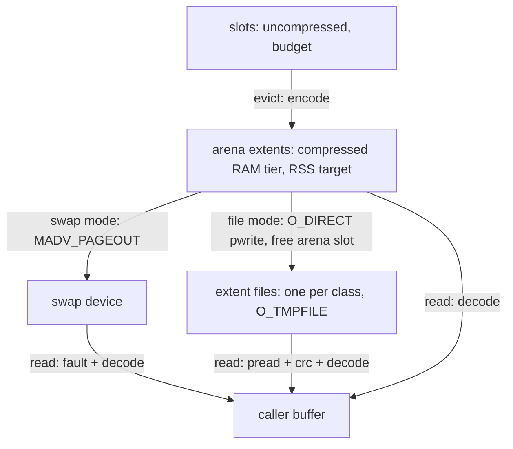
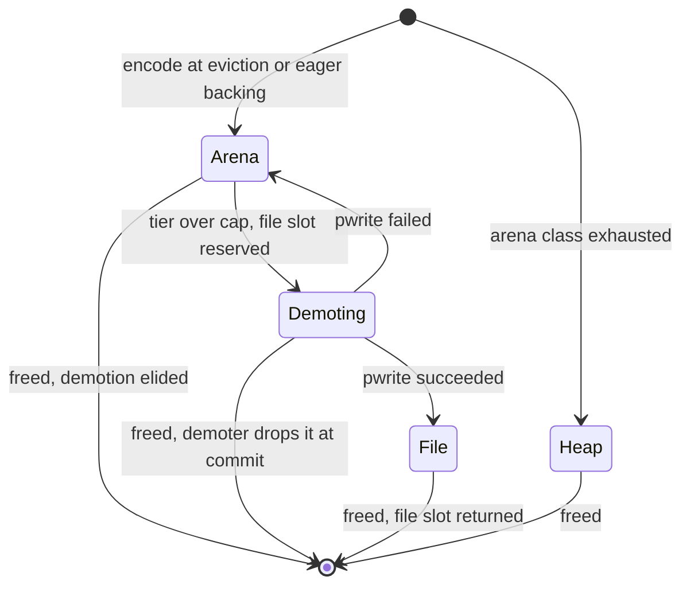

# File extents for the buffer pool

* Associated: [20260610_buffer_managed_state.md](20260610_buffer_managed_state.md) (the pool design this extends, section "File extents (future)"), [20260504_pager.md](20260504_pager.md) (the pager whose file backend this replaces), [CLU-65](https://linear.app/materializeinc/issue/CLU-65/pager).

## The problem

The buffer pool in `mz_ore::pool` has exactly one extent store, and it assumes kernel swap.
An evicted chunk is lz4-compressed into a slot of the pool-owned `ExtentArena`, the compressed-resident tier holds it in RAM, and RSS-target enforcement pushes the oldest extents to the swap device with `MADV_PAGEOUT`.
On a pod without swap that last step never succeeds: `extent_pageout_incomplete` climbs, extents hit `PAGEOUT_RETRY_CAP`, their bytes move to `extent_unreclaimable_bytes`, and cold compressed state accumulates in RAM.
The parent design calls this compression-only offload and names file extents as the complete answer for swapless hosts.

Replicas are provisioned either with swap or with a scratch filesystem, never both, and the choice is fixed for the pod's lifetime.
`provision_replica` in `src/controller/src/clusters.rs` sets `disk_limit` to zero for `swap_enabled` sizes, and the Kubernetes orchestrator mounts an ephemeral `/scratch` volume and passes `--scratch-directory=/scratch` only when the disk limit is nonzero (`src/orchestrator-kubernetes/src/lib.rs`).
The process orchestrator used by the emulator and local development applies the same disk-limit rule (`src/orchestrator-process/src/lib.rs`), but it provisions no swap, so a swap-enabled size there gets neither and runs compression-only, as it does today.
So `clusterd` can tell at startup whether it has a scratch filesystem, and that answer never changes.

This document designs the file backend under that constraint.
The file backend is meant for deployments where the pool is the scratch volume's sole consumer, and it sizes its capacity from the volume's free space as if it were.
In the cloud each replica pod gets its own scratch filesystem, shared with no other replica, and RocksDB-backed upsert is being replaced by the pool and is not recommended alongside compute workloads.
Under the compiled defaults the pool is not alone on the volume: `enable_lgalloc` defaults to on (`src/compute-types/src/dyncfgs.rs`), and lgalloc then keeps its files in the scratch directory, while the pager's file backend uses the scratch directory whenever one is set (`apply_worker_config` in `src/compute/src/compute_state.rs`).
The process orchestrator additionally puts every replica's scratch directory on one shared filesystem.
Sole ownership of the volume is therefore a precondition for enabling the flag, so a deployment that enables it must also disable lgalloc and keep the column pager off the file backend.
CI enables the flag with lgalloc disabled by mzcompose, on volumes that are large relative to test data.
The first deployments are the emulator and self-managed installations configured that way, followed by FS-backed instances in staging.
The swap backend's behavior stays the same, and the rest of the pool (slots, budget, residency states, eviction policy, copy-out reads) is reused unchanged.

## Success criteria

* On a pod with a scratch directory and no swap, pool RSS stays at or below `max(rss target, budget + warm cap)` regardless of state size, while the bytes held in files grow.
  Measured by the existing pool gauges plus new `extent_file_bytes` and `extent_file_allocated_bytes` gauges, under the upsert-v2 hydration workload used for the parent design's staging measurement.
* Steady-state chunk turnover performs no filesystem metadata operations.
  The open file count stays equal to the number of extent classes, and `openat`, `unlink`, and `ftruncate` counts stay at zero after warm-up (checked with `strace -c` on a running `clusterd`).
* Extent I/O bypasses the page cache.
  The cgroup's `memory.stat` `file` and `file_dirty` fields stay flat while `extent_file_bytes` grows.
* Workers perform no extent writes except in the bounded inline backstop, and each cold read of a file extent is exactly one `pread` plus one decode.
  Counted by new `extent_file_writes_inline` and `extent_file_reads` counters.
* A corrupted extent is detected and stops the process instead of returning wrong data.
  Proved by a unit test that corrupts a file extent and expects a panic on read.
* The swap backend is unchanged: the existing pool test suite passes unmodified against it, and every existing `PoolStats` field keeps its meaning in swap mode.

## Out of scope

* Switching backends while the process runs, and mixing swap-backed and file-backed extents in one process.
  The provisioning constraint above makes both unnecessary.
* Warm restart.
  Files are anonymous (`O_TMPFILE`) and die with the process, as swap-backed extents do.
* Asynchronous reads and prefetch into RAM.
  The parent design already leaves asynchronous state access out of scope.
  `io_uring` as a submission mechanism behind the same synchronous contract is a measurement candidate, see Measurement plan.
* Remote extents.
* Non-Linux support beyond compiling and degrading to the swap backend.

## What the pool assumes about swap today

Every swap assumption lives in three places, which bounds the refactor.

* `SwapExtent` (`src/ore/src/pool/extent.rs`) is a concrete type.
  `ChunkState.extent` is `Option<SwapExtent>`, and `SwapExtent::write` is called directly from `insert_extent`, `evict_locked`, and `spill_process` in `src/ore/src/pool.rs`.
* The extent methods encode swap semantics.
  `pageout` is `MADV_PAGEOUT` followed by a pagemap observation, `is_resident` and `pageout_capped` track the observation and its retry budget, `prefetch` is `MADV_WILLNEED`, and `read_range_into` decodes straight from the arena mapping, which faults swapped pages back in and makes the extent resident again.
* `PoolInner` accounting follows from that.
  `read_impl` re-counts a revived extent against the compressed tier, `enforce_compressed_cap` keeps retry-capped extents out of the queue, and `enforce_or_defer_compressed_cap` excludes unreclaimable bytes from its inline backstop.

Everything else is backend-neutral.
Slot regions, the warm pool, budget enforcement, second-chance queues, spill threads, eager backing, admission, and the `ExtentCodec` contract never look past the extent boundary.
The design keeps that boundary and makes what sits behind it a per-process choice.

## Solution proposal

The file backend keeps the compressed-resident tier exactly as it is and replaces only the bottom rung of the ladder.
An evicted chunk is still encoded into an arena slot, which is fast, off-worker, and elides the device entirely if the chunk dies while in RAM.
When RSS-target enforcement would issue `MADV_PAGEOUT` in swap mode, file mode instead writes the arena slot's bytes to a file slot with `O_DIRECT` and frees the arena slot.
A read of a file-resident extent issues one `pread` into an aligned scratch buffer, verifies a checksum, and decodes into the caller's buffer.



### Backend selection is fixed at pool construction

`Pool::with_backend` takes the backend, and the pool keeps it for its lifetime.

```rust
pub enum ExtentBackend {
    /// Compressed extents in the arena, paged to the swap device.
    Swap,
    /// Compressed extents in the arena, demoted to files under `dir`.
    File {
        dir: PathBuf,
        /// Capacity override for tests and the harness. `None` derives
        /// capacity from the volume.
        capacity_bytes: Option<u64>,
    },
}
```

`PoolInner` gains one field, `store: ExtentStore`, an enum with `Swap` and `File(Arc<FileStore>)` arms.
An enum fits better than a trait object: there are exactly two variants, and the pool's accounting differs per variant at a handful of match sites, which a trait would hide behind methods that only one implementation uses.
Making `Pool` generic over the backend is rejected because `Pool` and `ChunkHandle` are named in consumer types across `mz_timely_util`, `mz_compute`, and `mz_storage`, and a type parameter would spread to all of them for a choice that is constant per process.

`ExtentBackend` is the only backend type.
`mz_timely_util::pool_config` constructs the pool on the first `apply_pool_config` call, which takes an `ExtentBackend` by value.
`GLOBAL_POOL` initializes once, so only the first call's backend takes effect, and a later changed flag or scratch directory cannot reconfigure the backend.
This is the code-level form of the provisioning invariant.

`apply_worker_config` in `src/compute/src/compute_state.rs` resolves the backend from the scratch directory and a flag, see Configuration.
`build_pool` in `pool_config` creates the store's directory and opens the pool, and it is the one place that falls back to `Swap`.
If the directory cannot be created or `FileStore::open` fails (unsupported filesystem, permissions, failed alignment probe), the pool runs on `Swap` with one warning and reports the backend it actually chose in a metric.
On a swapless pod that fallback is today's compression-only behavior, so a failure degrades to the status quo rather than to an outage.

### Extent homes

`SwapExtent` becomes `Extent`, which carries the stored length, a checksum, and a home.

```rust
pub(crate) struct Extent {
    /// The allocation size: the arena class size, or the heap layout.
    alloc_size: usize,
    /// Stored (encoded) length in bytes.
    comp_len: usize,
    /// The pageout observation and its retry budget, exactly as `SwapExtent`
    /// tracks them today. Meaningful only in the `Arena` and `Heap` homes.
    resident: bool,
    incomplete_passes: u8,
    /// crc32 of the stored bytes, set when a demotion commits.
    crc: u32,
    /// Whether the file copy was read since demotion.
    read_since_demotion: bool,
    home: Home,
}

enum Home {
    /// An arena slot.
    Arena { arena: Arc<ExtentArena>, class: usize, slot: u32, ptr: *mut u8 },
    /// Global-allocator fallback for an exhausted arena class. Never leaves RAM.
    Heap { ptr: *mut u8, layout: Layout },
    /// File mode, transient: the arena slot still holds the bytes and stays
    /// readable while a demoter writes them to `file_slot` without the chunk lock.
    Demoting { arena: Arc<ExtentArena>, class: usize, slot: u32, ptr: *mut u8, file_slot: FileSlot },
    /// File mode: the bytes live only in the extent file.
    File { store: Arc<FileStore>, slot: FileSlot },
}
```

In swap mode only `Arena` and `Heap` occur, and every method keeps its current behavior, which is what makes the refactor a no-op for swap.
In file mode an extent is born in `Arena` (or `Heap`), may move to `Demoting`, and then to `File`, where it stays until freed.
No transition leads from `File` back to `Arena`.
That keeps a file extent's location immutable for its lifetime, which the read path below relies on.



### The file store

The file store is a small userspace extent allocator over a fixed set of files.

* **Files.**
  One file per extent class, using the arena's existing class ladder (`extent_classes`, page-multiple sizes from one page to the first class that fits `max_stored_len` of the largest chunk class), which the pool passes to `FileStore::open`.
  Each file is opened `O_RDWR | O_DIRECT | O_CLOEXEC | O_TMPFILE` in the scratch directory, so it has no name and the kernel frees its blocks when the process exits, including on crash.
  Where `O_TMPFILE` fails with `EOPNOTSUPP` or `EISDIR`, the store creates a uniquely named file and unlinks it immediately, which has the same lifetime property after a one-syscall window.
  This matters because an ephemeral volume survives a container restart within a pod, so named files from a crashed predecessor would otherwise occupy the scratch disk.
* **Slots.**
  A file slot is `(class, index)` at byte offset `index * class_size`.
  Allocation reuses `region::SlotAllocator` (free lists plus high-water mark) behind one mutex per class, the structure that already serves arena slots.
  Its warm side holds free slots whose blocks are still allocated, and its cold side holds slots whose blocks were punched.
  Free is a push onto the warm side, with no filesystem call.
* **Growth.**
  A slot handed out from the cold side or the high-water mark has no blocks yet, so the store `fallocate`s exactly that slot's range before returning it.
  Preallocation turns `ENOSPC` into an allocation failure before any data is in flight, and slot reuse from the warm side performs no filesystem call at all.
  On ext4 and XFS the first write to a preallocated range still converts an unwritten extent, a one-time metadata update per block that slot reuse never repeats.
* **Capacity.**
  The store charges each allocated slot at its class size against its capacity, and an allocation that would exceed capacity fails.
  Because the pool owns the volume, capacity is `f_bavail * f_frsize` from `statvfs` at open, minus the larger of 1 GiB and 2% of that value.
  `f_bavail` already excludes root-reserved blocks, and the headroom covers filesystem metadata for the preallocated extents plus incidental writers such as logs and core dumps.
  Tests pass an absolute override through `capacity_bytes`.
* **Space return.**
  Freed slots keep their blocks, so reuse never re-allocates and steady state performs no metadata operations.
  Space is returned only on demand: when an allocation fails for capacity while other classes hold free allocated slots, the store punches holes with `FALLOC_FL_PUNCH_HOLE` over free slots of the class with the most free bytes until the allocation fits.
  This handles a shift in the class mix, for example after a hydration completes, exactly when stranded space would block a demotion.
  Punched slots go to the cold side of their class's free list, and the next allocation from one re-grows its blocks with `fallocate`.
* **Alignment.**
  `O_DIRECT` requires the buffer address, file offset, and length to be multiples of the device's direct-I/O alignment.
  The store aligns everything to the page size and probes once at open with a page-aligned write and read, which covers devices with 512-byte and 4 KiB logical blocks (both observed working in phase 0).
  A device whose alignment exceeds the page size fails the probe and gets the buffered fallback.
  Class sizes are page multiples, so offsets are aligned.
  Writes and reads transfer `comp_len` rounded up to the alignment, which never exceeds the class size, and return the transferred length, which the pool counts.
  The arena slot is page-aligned, and the rounded tail lies within the page that already holds the last stored byte, so writing from the arena faults no new pages.
* **Memory-backed filesystems are rejected.**
  A scratch directory on tmpfs stores extents in RAM charged to the cgroup as shared memory, which defeats the store.
  The store checks `statfs` `f_type` at open and refuses `TMPFS_MAGIC` and `RAMFS_MAGIC`, so the pool falls back to `Swap`.
  An `O_DIRECT` probe cannot detect this: on a 7.2 kernel, tmpfs accepted `O_DIRECT` and `O_TMPFILE`, and even accepted an unaligned direct write that ext4 rejected with `EINVAL` (observed with the phase-0 probe).
* **Buffered fallback.**
  If the probe fails with `EINVAL` on a disk-backed filesystem, the store opens without `O_DIRECT` and follows each write with `sync_file_range` and `posix_fadvise(POSIX_FADV_DONTNEED)` over the written range.
  Page cache is then charged to the cgroup transiently, which is acceptable for development and the emulator, and a metric reports which mode is active so production can alert on it.

Per-class files are preferred over one file with per-class offset ranges.
A single file would need its class ranges spaced for the worst-case live set of every class, which runs into ext4's 16 TiB file size limit, and per-class files cost only about two dozen descriptors.

### Demotion

Demotion is file mode's replacement for `MADV_PAGEOUT`, driven by the same `enforce_compressed_cap` loop and the same `extent_queue`.
The difference is that it performs real I/O lasting a fraction of a millisecond, so it must not hold the chunk's state lock while writing.
The protocol follows `spill_process`, which already moves compression out from under the lock.

1. Pop an entry from `extent_queue` and `try_lock` the chunk, requeueing on contention as today.
   Skip the entry unless the extent's home is `Arena`.
2. Reserve a file slot of the extent's class.
   If the store cannot place the extent's class but can place another, move the entry to the back and skip that class's entries for the rest of the pass.
   If it can place no class, push the entry back to the front and end the pass.
3. Set the home to `Demoting`, capture the arena pointer, length, and file slot, and release the lock.
4. Compute the crc32 of the stored bytes and `pwrite` the rounded length at the slot's offset, retrying on `EINTR`.
   A short `O_DIRECT` write is retried whole from the slot's offset a bounded number of times, since resuming mid-buffer could issue an unaligned direct write, and the final attempt's error is classified as under Errors.
5. Lock the chunk (blocking, since holders are bounded) and commit:
   * If the chunk was freed meanwhile, drop the extent, which returns both the arena slot and the file slot.
   * On success, set the home to `File`, return the arena slot with `MADV_DONTNEED`, move the extent's bytes from `extent_resident_bytes` to `extent_file_bytes`, and count a demotion.
   * On failure, set the home back to `Arena`, return the file slot, and handle the error as described under Errors.

`ChunkHandle::drop` must not drop an extent whose home is `Demoting`, because the demoter is reading its arena slot without the lock.
It leaves the extent in place after setting `freed`, and the demoter's commit drops it.
This is the same deferral `WriteInFlight` already uses for slots, applied one level down, and it also guarantees a file slot is never reused while a write to it is in flight.

Reads, budget eviction, and admission all work during `Demoting` without change.
A read decodes from the arena slot, whose bytes are immutable, and eviction and admission never touch an extent's home.

The crc32 is computed on the demoting thread, a spill thread except in the inline backstop, using the `crc32fast` workspace dependency.
It is needed because the lz4 block format carries no checksum and corrupted literal bytes decode without error, and the identity codec used below `compress_min_depth` has no structure at all.
A local ephemeral disk can return corrupted data, and without the checksum that would surface as silently wrong arrangement contents.

### Reads

A plain read of a `File` extent does not need the chunk's state lock for the I/O.
Under the lock, `read_impl` sets the touched bit and captures the file slot, rounded length, `comp_len`, and crc, then releases the lock and performs `pread`, verification, and decode.
This is sound because a `File` home is terminal (it never changes until the extent is freed) and the reader borrows the `ChunkHandle`, so the chunk cannot be freed during the read.
Releasing the lock keeps budget enforcement and admission scans, which `try_lock` chunks, from skipping a chunk just because a worker is waiting on the device.

An admitting read keeps the lock, because it decodes into a slot that it owns only under that lock.
The chunk becomes `BackedResident` with its extent still on file, so evicting it again is a pure page release with no write, which is exactly the clean-victim stock that admission steals from.

The read goes into a thread-local, alignment-aligned scratch buffer sized to the extent's rounded length, followed by the crc check and `ExtentCodec::decode` into the caller's buffer.
The scratch follows the read side's existing policy of releasing capacity above 2 MiB after each read, so a worker keeps at most one chunk-sized buffer.
Stored forms can reach about 8 MiB for the largest incompressible chunk, and that worst case is released immediately.

File mode does not revive a read extent into the compressed RAM tier.
A swap read revives the extent as a side effect of faulting its pages, but a file read would have to allocate an arena slot to do the same, and keeping hot chunks in RAM is the job of admitting reads.
No production consumer calls `read_into_admit` today: the pool reads in `src/timely-util/src/columnar/chunk.rs` use `read_into`, and `correction_v2` uses `take` and `read_into`.
Until the parent design's consumer wiring lands, every re-read of a file extent is one `pread` and one decode, the same profile as a swap re-read of a paged-out extent minus the fault.

`prefetch` and `prefetch_range` are no-ops for `File` extents in this design.
`posix_fadvise(WILLNEED)` has no effect under `O_DIRECT`, and a real prefetch needs an asynchronous read into a buffer that a later read can claim, which the parent design defers.

Range reads keep today's semantics and read the whole extent.
No production consumer calls `read_range_into` or `prefetch_range`, so proportional range reads are not pursued here.

### Errors

Every extent operation is infallible today, and file I/O is not.
The design keeps the pool's public API infallible and handles each error where its consequences are known.

* **Store full** (capacity reached, or `ENOSPC` from `fallocate` or `pwrite`): demotion stops and the extent stays in the arena.
  An `ENOSPC` lowers the store's capacity to its allocated bytes at that moment, for the rest of the process, since the headroom was evidently too small for this filesystem.
  A `pwrite` can hit `ENOSPC` despite the preallocation on a filesystem that allocates on overwrite, so the store punches that slot and takes it back cold, and writes stay enabled.
  Freed slots keep their blocks, so the store keeps serving demotions from them under the lowered capacity.
  RAM then grows past the RSS target, counted by `extent_file_full`, which matches the parent design's current answer to scratch exhaustion (RSS grows and the memory limiter is the backstop).
* **Write error** (`EIO` or any errno from `pwrite` other than `ENOSPC`): the extent returns to `Arena`, a counter increments, and the store disables further writes for the process's lifetime with one warning.
  A device that failed a write is not trusted with more data, and existing file extents remain readable.
* **Read error** (`EIO`, short read, or crc mismatch): the process panics with the class, offset, and expected and observed checksums.
  There is no correct value to return, the state is recreatable from persist, and a restart rebuilds it.

The inline backstop in `enforce_or_defer_compressed_cap` must not fire forever when the store is full or write-disabled, the same reason it already excludes unreclaimable bytes.
A demotion pass that finds the store unable to take any extent it probed sets a full hint.
A committed demotion, a freed file slot, or the enqueue of an extent whose class the store can place clears it.
While the hint is set, inline callers run no demotion pass, and each spill thread retries at most once per park timeout.
With spill threads, the inline backstop also defers while writes are disabled.
A pass over a write-disabled store stops at its first entry and sets the hint, so without spill threads later callers skip the pass as well.

### Where I/O runs

Demotion writes run on spill threads, in the existing `enforce_compressed_cap` call at the top of `spill_worker`'s loop.
Workers run demotion inline only when no spill threads exist or the tier exceeds twice its capacity, as today.
For file mode, an inline pass stops once the tier falls back to twice its capacity rather than to its capacity, leaving the rest to the spill threads.
This bounds a worker's write work to whatever exceeds the backstop threshold rather than the whole overage.

Per the parent design's cost model, a ~2 MiB chunk compresses to ~0.36 MiB on the measured arrangement data.
On the phase-0 machine (see Phase 0 results) one 384 KiB `O_DIRECT` write took 0.43 ms and one 384 KiB read took 0.37 ms on an idle device.
A single synchronous writer already reached the device's write ceiling there, so synchronous `O_DIRECT` `pwrite` on spill threads and `pread` on readers is the default.
Whether `io_uring` submission does better on other devices is decided by the measurement plan rather than by argument.

### The ladder and accounting in file mode

The four rungs keep their meaning, with the bottom rung replaced.

1. **Slots**, bounded by the budget.
2. **Warm free slots**, bounded by `min(budget / 8, 1 GiB)`.
3. **Compressed-resident extents** in the arena, bounded by `max(0, rss target - budget - warm cap)`.
4. **Extent files**, bounded by the store's capacity.
   Overflow stays in rung 3 and grows RSS, counted.

`extent_resident_bytes` keeps its definition as the arena bytes of resident extents.
`extent_pageouts` counts extents that left RAM for the device in either mode, and `extent_unreclaimable_bytes` covers only heap-fallback extents in file mode, since retry caps do not exist there.
`extent_pageout_incomplete` stays at zero in file mode.

New `PoolStats` fields, exported in `src/timely-util/src/pool_config/metrics.rs`:

* `extent_file_bytes`, `extent_file_allocated_bytes`, and `extent_file_capacity_bytes`: live slot bytes of demoted extents, the bytes the store holds on the filesystem (live slots plus free slots that were not punched), and the effective capacity.
* `extent_file_writes` and `extent_file_writes_inline`: demotion writes that reached the device, and the subset run by inline passes rather than spill threads.
* `extent_file_write_bytes_identity` and `extent_file_write_bytes_compressed`: the bytes those writes transferred, split by codec for the compression-floor measurement.
  Every write counter counts the same writes, including those whose chunk was freed before the demotion committed, so the bytes and counts divide into each other.
* `extent_file_reads` and `extent_file_read_bytes`: cold reads and their bytes.
* `extent_file_read_latency`: fixed log2 buckets from 16 µs to 65.536 ms as atomic counters in `PoolStats`, exported as a Prometheus histogram, since a cumulative sum gives only the mean.
* `extent_file_repeat_reads`: file reads of extents already read since demotion, from one bit per extent, which decides whether probe paths should admit.
* `extent_file_full`: demotion passes that left an extent in RAM because the store was full or had writes disabled.
* `extent_file_write_errors`: write failures, after which writes are disabled.
* `extent_file_holes_punched_bytes`: space returned to the filesystem.
* `extent_demotions_elided`: extents freed while still in the arena, in both modes, the extent-level counterpart of `writes_elided`.

The metric help strings that currently say "swap-backed" become backend-neutral, and a `mz_column_pool_backend` info gauge labels the chosen backend and I/O mode (`swap`, `file_direct`, `file_buffered`).

### Configuration

* `enable_column_paged_batcher_file_extents` (new, boolean): `apply_worker_config` selects `File` with the directory `pool` under the scratch directory exactly when a scratch directory exists and this flag is on, and `Swap` otherwise.
  Like any backend, it takes effect only when the pool is installed (see Backend selection).
  Following the repository's flag policy it defaults off in production and on in the test configuration through `system_parameter_default`.
* The budget, RSS target, spill thread, and eager-backing dyncfgs keep their meaning.

`apply_worker_config` computes the scratch path once and feeds the pager and the pool from it.
Capacity has no dyncfg, since the pool owns the volume.
`StorageInstanceContext` needs no change, because compute's config handler already installs the shared pool whenever either subsystem's spill gate is on.

### Code organization

* `src/ore/src/pool/extent.rs`: `SwapExtent` becomes `Extent` with `Home`, keeping `ExtentArena` and the swap paths.
* `src/ore/src/pool/file.rs` (new): `FileStore`, its per-class files and slot allocators, growth, hole punching, aligned I/O, the alignment probe, and a `sys` seam like `region.rs`'s, so tests can inject `ENOSPC`, `EIO`, short reads and writes, and corruption the way `fake_residency::decline_next` injects pageout declines.
* `src/ore/src/pool.rs`: `ExtentBackend`, `ExtentStore`, the demotion protocol in `enforce_compressed_cap`, the unlocked file read in `read_impl`, the deferred drop in `ChunkHandle::drop`, and the new counters.
* `src/timely-util/src/pool_config.rs` and its metrics: `apply_pool_config` taking an `ExtentBackend`, `build_pool` owning directory creation and the fallback to swap, and the new gauges.
* `src/compute/src/compute_state.rs` and `src/compute-types/src/dyncfgs.rs`: backend choice and the new dyncfg.

## A file-mode extent's lifetime, end to end

1. **Evict:** budget pressure hands an unbacked chunk to a spill thread, which encodes it into an arena slot.
   The chunk becomes `Evicted` and its extent is in `Arena`, counted in the compressed tier.
2. **Die in RAM:** if the chunk is freed now, the arena slot returns and `extent_demotions_elided` increments, with no device I/O.
3. **Demote:** the tier exceeds its cap, so a spill thread reserves a file slot, checksums the bytes, writes them with `O_DIRECT` without holding the chunk lock, and commits `File`, returning the arena slot.
4. **Read:** a worker captures the file slot under the lock, then reads, verifies, and decodes without it.
   Residency is unchanged.
5. **Admit:** a probe's admitting read decodes into a slot under the lock, and the chunk becomes `BackedResident` with its extent still on file.
   Evicting it again is a page release with no write.
6. **Free:** the file slot returns to its class's free list with no filesystem call, and holes are punched later only if free space in the class accumulates.

## Testing and measurement

* **Pool unit tests, both backends.**
  The existing pool tests that do not depend on swap observation run against both backends through a helper that builds a pool over a temporary directory.
  The pageout-observation tests stay swap-only.
* **File-mode unit tests:** round trip through a file; demotion under tier pressure; a free during `Demoting` leaves no leaked arena or file slot; a free before demotion elides the write; admission from a file extent; a corrupted file extent panics on read; a store-full pass stops without losing accounting and resumes after frees; a write error disables writes and keeps the extent readable; the capacity override; on-demand hole punching lets a full store serve an allocation of another class; the `O_TMPFILE` fallback path.
  File tests are ignored under Miri, which cannot run the file system calls, as `pool_config`'s test already is for `mmap`.
* **Accounting invariant:** the invariant documented on `note_extent_resident` is extended to cover `extent_file_bytes`, and the concurrent stress test checks it against the surviving chunks once its threads stop.
* **Harnesses:** the `pool_extents` example in `src/ore/examples/` drives a pool directly with `--backend swap|file`, and reports per-phase RSS and CPU, demotion and read rates, the read-latency histogram, and file space.
  The `correction_mem` example in `src/compute/examples/` takes `--pool-scratch-dir` to run the MV sink's correction buffer over the file backend.
  These supply the file-extent numbers the parent design marks as estimates, and the inputs to the I/O interface decision.
* **CI:** mzcompose defaults the flag on, so test replicas with a scratch directory run the file backend once their spill gates install the pool.
  Every mzcompose replica has a scratch directory, and the correction-buffer and upsert spill gates default on there, so the store opens in most runs.
  Demotion starts only once the pool exceeds its RSS target, a fraction of the CI host's RAM, so a test writes to the store only when it holds that much spilled data.
* **Staging:** the parent design's upsert-v2 hydration measurement repeated on a disk-provisioned size, reporting the success-criteria metrics.

## Rollout

1. Refactor `SwapExtent` into `Extent` and `Home` with only the swap arms, plus `ExtentStore::Swap`.
   No behavior change, and the existing tests prove it.
2. Add `FileStore`, demotion, file reads, error handling, and counters, constructed only by tests.
3. Add the backend to `apply_pool_config`, the dyncfg, the metrics, and the selection in `apply_worker_config`.
4. Run the measurement plan on a local machine, the emulator, self-managed, and staging FS-backed instances, then enable by default where a scratch directory exists.
5. Delete the pager's file backend as part of the parent design's pager removal.

## Alternatives

### Write evicted chunks straight to files

Encoding into scratch and writing the file at eviction time would skip the arena in file mode.
It loses the compressed RAM tier, which elides device writes for extents that die soon after eviction and serves re-reads from RAM.
It also places a device write on every eviction, including inline evictions on workers.
The arena path costs one extra copy of the compressed bytes and keeps file mode's behavior aligned with swap mode's.

### Per-chunk files

The pager's file backend writes one file per chunk.
The parent design measured 35.6 s of unlink and inode eviction against 4.3 s of opens in one hydration, a cost this design removes by construction.

### Buffered I/O by default

Buffered writes charge page cache to the replica's cgroup, cache data the pool already caches, and leave writeback timing to the kernel.
The design uses buffered I/O only as a fallback where `O_DIRECT` is unavailable, and reports it.

### File-backed mappings

Mapping the extent files would bring back kernel-scheduled faults and writeback, which the parent design rejects for lgalloc.

### `io_uring`

Asynchronous submission would let one thread keep several writes in flight and would open a path to real prefetch.
It is a candidate in the measurement plan, behind the same synchronous contract to callers, and is adopted only if it wins there.

## Phase 0 results

Phase 0 ran on an `r8gd.4xlarge` scratch instance (kernel 7.0.0-1006-aws) with its 885 GiB instance-store NVMe formatted ext4 with default options.
The probe and fio scripts are in `misc/scratch/pool-file-extents-phase0/`, and the summarized fio output is in `results-r8gd.4xlarge-ext4.md` there.
All runs used 30 s per configuration over a preallocated 64 GiB file, so they measure overwrites of allocated blocks.

### Filesystem support

| Directory | Filesystem | `O_TMPFILE` with `O_DIRECT` | `O_DIRECT` at 512 and 4096 | Unaligned direct write | `fallocate` | Punch hole |
|---|---|---|---|---|---|---|
| Host scratch volume | ext4 | ok | ok | `EINVAL` | ok | ok |
| Host `/tmp` | tmpfs | ok | ok | accepted | ok | ok |
| Container root | overlay | ok | ok | `EINVAL` | ok | ok |
| Container bind mount of the scratch volume | ext4 | ok | ok | `EINVAL` | ok | ok |

On this kernel, the emulator's scratch directory supports every operation the store needs whether it lives on the container's overlay root or on a bind mount.
The buffered fallback stays for older host kernels, where overlay support for `O_DIRECT` was not measured.
tmpfs again accepted every operation including an unaligned direct write, which confirms that only the filesystem-type check rejects it.
ext4's default 5% root reservation already showed up in `f_bavail`, 886 GB available of 934 GB total.

### Device envelope

| Workload (384 KiB unless noted) | Synchronous `O_DIRECT` | `io_uring` | Buffered with `fdatasync` |
|---|---|---|---|
| Write, 1 thread | 0.85 GiB/s, 0.43 ms per write | 0.85 GiB/s at depth 4, 1.7 ms per write | 0.85 GiB/s, 0.43 ms per write and sync, 3.7 times the CPU |
| Write, 4 threads | 0.85 GiB/s, 1.7 ms per write | 0.85 GiB/s at depth 4, 6.9 ms per write | 0.85 GiB/s |
| Read, 1 thread | 0.99 GiB/s, p50 0.38 ms, p99 0.42 ms | same | not measured |
| Read, 16 threads | 1.78 GiB/s, p50 3.3 ms, p99 3.5 ms | same | not measured |
| Read, 64 threads | 1.78 GiB/s, p50 13 ms, p99 14 ms | same | not measured |
| 2 MiB read, 1 thread | 1.78 GiB/s, p50 1.1 ms, p99 2.2 ms | same | not measured |
| 2 writers and 16 readers | writes 0.85 GiB/s total, reads 1.78 GiB/s total, read p50 3.3 ms | same throughput, write latency 14 ms | not measured |

Every configuration hit the same two ceilings, 0.85 GiB/s of writes and 1.78 GiB/s of reads, independent of engine, block size, and thread count, and reads and writes ran at their ceilings concurrently.
Above the ceiling, added concurrency or queue depth only added queueing latency.
On this device `io_uring` therefore has no throughput to win: one synchronous writer saturates writes, and two to four synchronous readers saturate reads.
Buffered writes reached the same throughput as `O_DIRECT` but spent 10.3% CPU per writer against 2.8%, the cost of copying through the page cache.

Consequences for the design, pending a second device class:

* Demotion bandwidth caps at 0.85 GiB/s of stored bytes, about 4.8 GiB/s of logical state at the measured 5.6 times lz4 ratio (estimate), and 0.85 GiB/s for identity-coded extents.
  This is the rate at which the compressed RAM tier can drain, so hydration that evicts faster grows RSS past the target until the backstop engages.
* A cold 384 KiB read costs about 0.2 ms of device time at the read ceiling.
  Many workers reading concurrently queue on that ceiling, which reached 13 ms p50 at 64 readers, so cold-read latency on workers is a bandwidth question, and the repeat-read and admission measurements matter more than the submission interface.
* The default of 2 spill threads is enough to saturate writes on this device.

## Pool measurements

The `pool_extents` harness ran in file mode on the same instance type and filesystem. The script is `pool-matrix.sh` and the table is `results-pool-extents-r8gd.4xlarge.md`, both in `misc/scratch/pool-file-extents-phase0/`.
Each run inserted 32 GiB of 2 MiB chunks into a 4 GiB budget, with bodies that compress to about half and 30% of chunks dying 4096 inserts after their own.
The bodies are synthetic, so the ratios below say nothing about real lz4 ratios.
Before the measurement, an `O_DIRECT` readback probe (`dio-verify.py` there) ran 1.9 million punch, write and read cycles on the device without a mismatch.
No swap-mode baseline ran, because the instance has no swap configured.

* **Device ceiling:** demotion ran at 0.82 to 0.88 GiB/s in every configuration, which is the phase 0 write ceiling.
  The writes are bound by the device, not by the threads. One, two, four and eight spill threads gave the same rate, and `spill_in_flight` sat at its maximum of 64 for 70 to 90% of the fill whenever the tier cap was nonzero.
  A dedicated demotion thread would not help on this device.
* **RSS target:** VmHWM tracked the target. It reached 4174, 4818, 6199 and 7018 MiB for targets of 4506, 5120, 6144 and 8192 MiB, which gave tier caps of 0, 512, 1536 and 3584 MiB.
  The elision rate fell from 0.325 at a 3584 MiB tier to 0.076, 0.030 and 0 as the tier shrank.
  The share of demotion writes that ran inline rose from 0 to 3.1, 5.4 and 14.2%.
  With a tier below a few hundred MiB, worker threads pay for demotion I/O.
* **Cold reads:** with about 1 MiB extents, reads at 16 and 64 readers saturated the device's read ceiling. p50 was 8.3 ms at 16 readers, and at 64 readers p50 was 14 ms and p99 90 ms. A single reader saw p50 0.67 ms.
* **Compression floor:** with 20% of chunks inserted under the identity codec, identity extents made up 34% of device write bytes. Reads per second fell from 3198 to 2547, and VmHWM rose to 8467 MiB, which is 275 MiB above the target.
* **Capacity:** with the store capped at 8 GiB, demotion stopped at the cap with no write errors. The tier stayed in RAM as designed, and VmHWM reached 9458 MiB against the 8192 MiB target.
  Real `ENOSPC` on the device was not exercised. That needs a filesystem small enough to fill.
* **Stranded space:** after churn, allocated file space exceeded live slot bytes by 0.9 to 1.7 GiB, well under the 17 GiB headroom, and no hole punching fired.
* **Repeat reads:** these made up 52 to 82% of file reads. The harness reads random live chunks without admission, so this measures the harness's access pattern, not a workload's.
  The admission decision needs a real probe workload.

## environmentd measurements

A local `bin/environmentd --release` on the same instance tested whether file mode holds state that a swap-less replica otherwise cannot keep.
The scripts and the per-run table are in `misc/scratch/pool-file-extents-envd/`, with `results-envd-r8gd.4xlarge.md` holding the raw numbers.
The workload parks TPC-H `lineitem` at scale factor 10 behind a temporal filter that makes every row valid a day from now, so the rows sit in a buffer that cannot drain.
An index parks them in the arrange site's chunk batcher, with temporal bucketing on, and a materialized view parks them in the MV sink's correction buffer.
Each run creates a fresh 8-worker replica, which the process orchestrator runs under a cgroup `MemoryMax` equal to the size's memory limit, with swap off, lgalloc off, and `compute_dataflow_max_inflight_bytes_cc` at 512 MiB.

Two workload details decide whether anything parks at all.
A TPC-H load generator without a tick interval has an empty write frontier once its snapshot is written, so future-dated rows would pass straight through to the spine, and the parked view therefore reads `lineitem UNION ALL` an empty table to keep its frontier live.
A temporal filter against a constant folds to an empty collection, so the filter adds `l_orderkey % 2` to the future timestamp.
The pool ran with a budget fraction of 0.01 and an RSS target fraction of 0.02 of the instance's 128 GiB, which gives a slot budget of about 1.3 GiB and an RSS target of about 2.6 GiB.

| 8 GiB replica | Index (chunk batcher) | Materialized view (correction buffer) |
|---|---|---|
| No spilling, 32 GiB replica, for reference | 14.1 GiB RSS | 8.2 GiB RSS |
| Spill, no backing store | exited at 25 s with VmRSS at the limit | exited at 33 s with VmRSS at the limit |
| Spill, file store | hydrated in 31 s, peak 5.5 GiB, settled at 3.0 GiB RSS with 4.1 GB on file | hydrated in 36 s, peak 5.2 GiB, settled at 2.7 GiB RSS with 4.5 GB on file |

* **File mode keeps the parked state.**
  Without a backing store the compressed tier has nowhere to go: the relaunched replicas held 4.8 to 5.3 GB of extents in RAM when scraped, and both arms died at the memory limit.
  With the file store both arms hydrated and settled under half the unspilled footprint.
  An earlier swap run of the same workload, at 8 and 4 GiB limits and without the read-ahead bound, settled at 2.6 to 2.9 GiB RSS plus 3.3 to 4.4 GiB of swap, so file mode lands at the swap-backed footprint.
* **Hydration cost:** the file runs hydrated in 31 and 36 s, against 21 to 25 s for the unspilled runs on a 32 GiB replica.
* **4 GiB replicas die in both modes.**
  The pool's budget and RSS target derive from physical RAM, not the replica's limit, so on this host the pool alone claims about 2.6 GiB before non-pool memory.
  Sizing the pool from the replica's limit is a prerequisite for small replicas.
* **Persist read-ahead is unbounded without lgalloc.**
  Without the 512 MiB in-flight cap, a cc replica allocated 4 to 9 GiB in the first second of hydration and was OOM-killed at 4 and 8 GiB, whatever the pool's backend, because fetched parts do not enter the pool.
  Only swap absorbed that burst.
* **The pool is not the binding constraint when nothing parks.**
  An earlier unparked index hydration on a 16 GiB replica peaked at 13.7 GiB in file mode against 14.6 GiB without a backing store, because arrangement building and merging, which do not allocate through the pool, dominate the peak.

## Decisions

* **No promotion.**
  A file extent never returns to the arena, which keeps the unlocked plain read sound.
  Hot data returns to RAM only through admission to a slot, which retains the file copy so re-eviction is free.
* **RSS target.**
  File mode shares swap mode's default, `column_paged_batcher_pool_rss_target_fraction` at 0.25 (`src/compute-types/src/dyncfgs.rs`), until measurement shows a reason to differ.
  In both modes the tier elides device writes for extents that die soon after eviction and serves re-reads without I/O.
* **Compression floor.**
  `column_chunk_compress_min_depth` keeps its default of 1, so depth-0 bodies spill identity-coded and occupy their full size on file once demoted.
  Depth-0 chunks mostly die young, and extent-level elision should keep most of them off the device, which the measurement plan checks.
* **Direct-extent inserts** (`Pool::insert_extent`) need no change: they encode on the inserting thread, and demotion still runs on spill threads.
* **Spill threads** keep their default of 2 until the measurement plan shows saturation.
* **Heap-fallback extents** stay in RAM.
  They cannot be written with `O_DIRECT`, and they occur only when a class exceeds its 1 TiB virtual reservation (`CLASS_CAPACITY_BYTES`).
* **Arena sizing** is unaffected by the file store, since demotion frees the arena slot and arena occupancy stays bounded by the compressed tier.

## Measurement plan

Each unknown has a workload, a metric, and a decision rule.
Environments, in order: a local NVMe machine, the emulator, self-managed, and staging FS-backed instances once available.

* **Phase 0: filesystem support and device envelope.**
  Before any pool code exists, a probe records `O_TMPFILE`, `O_DIRECT` alignment, `fallocate`, and hole-punch support per filesystem, and an fio matrix records the device's envelope for each I/O candidate at the pool's extent sizes (384 KiB for lz4 extents, 2 MiB for identity extents).
  The fio matrix covers demotion writes at 1, 2, and 4 threads, synchronous cold reads at 1, 16, and 64 threads, and 2 writers mixed with 16 readers, each for synchronous `O_DIRECT`, `io_uring` at queue depths 4 and 16, and buffered I/O.
  The machine is an `r8gd.4xlarge` scratch instance (`misc/scratch/pool-file-extents.json`) with its instance-store NVMe formatted ext4 and mounted at `/scratch`.
  The envelope bounds what the pool-level measurements below can reach and shows whether `io_uring` has headroom to win at all.
* **I/O interface.**
  Candidates: synchronous `O_DIRECT` `pread` and `pwrite` (default), `io_uring` submission on spill threads with reads still synchronous to the caller, and buffered I/O with `sync_file_range` and `POSIX_FADV_DONTNEED`.
  Workloads: the `column_pager` merge bench at 2 to 4 times budget pressure with 1 and 16 to 64 threads, upsert-v2 hydration, and the upsert feedback drain as the probe workload.
  Metrics: merge throughput, worker system time, cold-read latency p50 and p99, spill-thread CPU per GiB written, device utilization, and cgroup `file` and `file_dirty`.
  Rule: keep synchronous `O_DIRECT` unless `io_uring` materially improves throughput or p99 read latency at equal or lower CPU in at least two environments, with the threshold fixed after the first local run.
  Buffered I/O is used only where the open-time probe rejects `O_DIRECT`, never chosen on performance.
* **Emulator filesystem support.**
  Record whether `O_DIRECT` and `O_TMPFILE` succeed on the emulator's scratch directory, both on the container overlay and on a bind mount.
  The result picks the emulator's I/O mode and whether its scratch directory needs a dedicated mount.
* **RSS target.**
  Run hydration and steady-state merging at target fractions 0.1, 0.25, and 0.5.
  Compare the demotion elision rate `extent_demotions_elided / (extent_demotions_elided + extent_pageouts)`, file reads per second, and RSS.
  Lower the default if a smaller tier loses little elision and adds no read traffic.
* **Compression floor.**
  Compare `extent_file_write_bytes_identity` with `extent_file_write_bytes_compressed`.
  If identity bytes are a material share of device writes, set the floor to 0 in file mode, since a demoted identity extent costs about 5.6 times the lz4 bytes on the measured data (estimate from the parent design).
* **Spill threads.**
  Watch `spill_in_flight` against `SPILL_IN_FLIGHT_MAX` (64) and the share of evictions that fall back inline.
  If demotion writes saturate the threads, raise the default or give demotion its own thread so compression never queues behind I/O.
* **Repeat reads.**
  If `extent_file_repeat_reads` dominates `extent_file_reads` on the probe workload, wire admission on the probe paths, which is the parent design's pending consumer work.
* **Stranded space.**
  After a hydration followed by steady state, compare `extent_file_allocated_bytes` with `extent_file_bytes`.
  Stranded space below the headroom confirms that on-demand punching rarely fires.
* **Capacity headroom.**
  Fill the store to capacity and confirm that `ENOSPC` appears only on the `fallocate` growth path, never on `pwrite`, and that the latch never trips.
  If it trips, raise the headroom.
