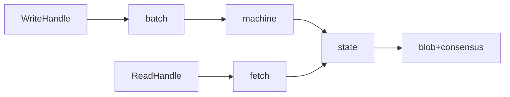
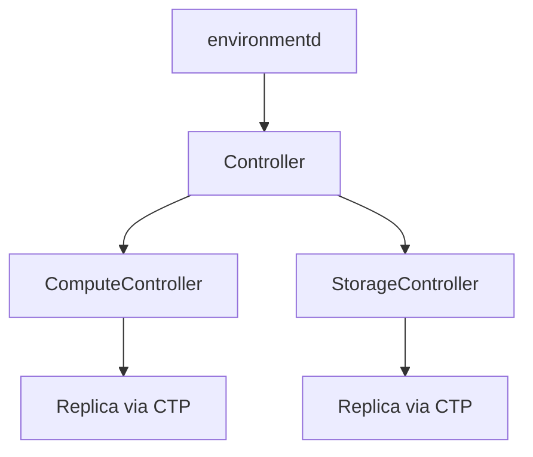

# Cross-cutting flows

Maps common operations to the crate::module paths involved, in execution order.
Use this to trace where code runs for a given concern.

## Query lifecycle (SELECT)

1. **`mz_pgwire::server`** — accepts TCP connection, negotiates TLS
2. **`mz_pgwire::protocol`** — drives per-connection state machine (`query()` / `execute()`)
3. **`mz_pgwire::codec`** — deserializes wire bytes into `FrontendMessage`
4. **`mz_adapter::client`** — `SessionClient::parse()` calls into the parser
5. **`mz_sql_parser::parser`** — recursive-descent parse → `Statement<Raw>`
6. **`mz_sql::names`** — name resolution: `Statement<Raw>` → `Statement<Aug>`
7. **`mz_adapter::coord::sql`** — `plan()` invokes the SQL planner
8. **`mz_sql::plan::statement::dml`** — `plan_select` → calls `query::plan_root_query`
9. **`mz_sql::plan::query`** — SQL AST → `HirRelationExpr`
10. **`mz_sql::plan::lowering`** — decorrelation: `HirRelationExpr` → `MirRelationExpr`
11. **`mz_adapter::coord::sequencer::inner::peek`** — multi-stage peek pipeline
12. **`mz_adapter::optimize::peek`** — MIR optimization → LIR `DataflowDescription<Plan>`
13. **`mz_transform`** — MIR-to-MIR optimization passes (called by optimizer)
14. **`mz_compute_types::plan::lowering`** — MIR → LIR physical plan
15. **`mz_adapter::coord::timestamp_selection`** — `determine_timestamp` via oracle
16. **`mz_adapter::frontend_peek`** — installs peek on compute, awaits result
17. **`mz_compute::server`** — receives `ComputeCommand::Peek`, schedules dataflow
18. **`mz_compute::render`** — renders the LIR plan as a Timely dataflow
19. **`mz_pgwire::protocol`** — serializes result rows back to the client

## Source ingestion (CREATE SOURCE → data in persist)

1. **`mz_sql::pure`** — async purification: inlines external state (schemas, partitions, table lists) into the AST
   * **`mz_sql::pure::postgres`** / **`mysql`** / **`sql_server`** — connector-specific purification
2. **`mz_sql::plan::statement::ddl`** — `plan_create_source` → `Plan::CreateSource`
3. **`mz_adapter::coord::command_handler`** — drives purification, routes to sequencer
4. **`mz_adapter::coord::sequencer::inner`** — `sequence_create_source` → catalog transact
5. **`mz_adapter::coord::ddl`** — `catalog_transact` commits, then `apply_catalog_implications`
6. **`mz_adapter::coord::catalog_implications`** — calls `StorageController::create_collections`
7. **`mz_storage_controller`** — registers shards, sends `RunIngestionCommand` to storage cluster
8. **`mz_storage::storage_state`** — worker receives command, builds ingestion dataflow
9. **`mz_storage::render::sources`** — assembles the source-specific Timely operators
10. **`mz_storage::source::kafka`** / **`postgres`** / **`mysql`** / **`sql_server`** — connector-specific source operator
11. **`mz_storage::source::reclock`** — maps source timestamps to Materialize timestamps
12. **`mz_storage::render::persist_sink`** — writes reclocked data into persist shards

## Materialized view creation

1. **`mz_sql::plan::statement::ddl`** — `plan_create_materialized_view`
2. **`mz_adapter::coord::sequencer::inner::create_materialized_view`** — drives optimizer + catalog transact
3. **`mz_adapter::optimize::materialized_view`** — two-stage: MIR optimize → LIR lower
4. **`mz_transform`** — MIR optimization passes
5. **`mz_compute_types::plan::lowering`** — MIR → LIR
6. **`mz_adapter::coord::catalog_implications`** — installs dataflow via compute controller
7. **`mz_compute_client::controller::instance`** — sends `CreateDataflow` to replica
8. **`mz_compute::server`** — receives command, schedules rendering
9. **`mz_compute::render`** — renders LIR as Timely dataflow
10. **`mz_compute::sink::materialized_view`** — writes output diffs to persist via `WriteHandle`

## Kafka sink lifecycle

1. **`mz_sql::plan::statement::ddl`** — plans `CREATE SINK`
2. **`mz_adapter::coord::sequencer::inner`** — sequences sink creation
3. **`mz_adapter::coord::ddl`** — catalog transact
4. **`mz_adapter::coord::catalog_implications`** — calls storage controller
5. **`mz_storage_controller`** — sends export command to storage cluster
6. **`mz_storage::storage_state`** — receives command, builds export dataflow
7. **`mz_storage::render::sinks`** — dispatches to sink-specific renderer
8. **`mz_storage::sink::kafka`** — encodes rows, writes transactionally to Kafka

## Catalog mutation (DDL)

1. **`mz_sql::plan::statement::ddl`** — plans the DDL statement
2. **`mz_adapter::coord::sequencer::inner`** — calls `catalog_transact`
3. **`mz_adapter::coord::ddl`** — `catalog_transact` / `catalog_transact_with_side_effects`
4. **`mz_catalog::durable::transaction`** — `Transaction` batches mutations → `TransactionBatch`
5. **`mz_catalog::durable::persist`** — `commit_transaction` writes atomically to persist
6. **`mz_adapter::catalog::apply`** — applies `StateUpdate`s to the in-memory `CatalogState`
7. **`mz_catalog::memory::objects`** — in-memory catalog objects updated
8. **`mz_adapter::coord::catalog_implications`** — propagates downstream effects (controller calls, drop cleanup)

## Timestamp selection

1. **`mz_timestamp_oracle::postgres_oracle`** — durable oracle backed by CRDB; provides `read_ts()` / `write_ts()`
   * **`mz_timestamp_oracle::batching_oracle`** — batches concurrent oracle calls for throughput
2. **`mz_adapter::coord::timestamp_selection`** — `determine_timestamp` picks a read timestamp for a query
3. **`mz_adapter::coord::read_policy`** — manages `ReadPolicy` per collection, controlling `since` advancement
4. **`mz_storage_types::read_holds`** — `ReadHold<T>` RAII tokens preventing `since` from advancing past held timestamps

## Persist read/write path

1. **`mz_persist_client::write`** — `WriteHandle`: `append`, `compare_and_append`
2. **`mz_persist_client::batch`** — `BatchBuilder` accumulates updates, flushes parts to blob
3. **`mz_persist_client::internal::machine`** — `Machine` drives CaS loops against consensus
4. **`mz_persist_client::internal::state`** — `State<T>` tracks shard metadata (since, upper, spine)
5. **`mz_persist_client::internal::compact`** — merges runs in the background
6. **`mz_persist_client::internal::gc`** — garbage-collects unreferenced blobs
7. **`mz_persist_client::read`** — `ReadHandle`: `snapshot`, `listen`, `subscribe`
8. **`mz_persist_client::fetch`** — fetches and decodes parts from blob
9. **`mz_persist::s3`** / **`mz_persist::postgres`** — blob (S3) and consensus (CRDB/Postgres) backends

## Controller architecture

1. **`mz_controller`** — unified `Controller<T>` multiplexing compute + storage
2. **`mz_compute_client::controller`** — `ComputeController` manages compute clusters/replicas
3. **`mz_compute_client::controller::instance`** — per-cluster `Instance` state
4. **`mz_compute_client::controller::replica`** — per-replica connection state
5. **`mz_storage_controller`** — `Controller<T>` for storage; manages ingestion/export lifecycle
6. **`mz_storage_controller::instance`** — per-cluster `Instance<T>` and `Replica<T>`
7. **`mz_service::transport`** — Cluster Transport Protocol (CTP): length-prefixed bincode over TCP/UDS
8. **`mz_cluster::communication`** — generation-epoch mesh protocol for Timely workers
