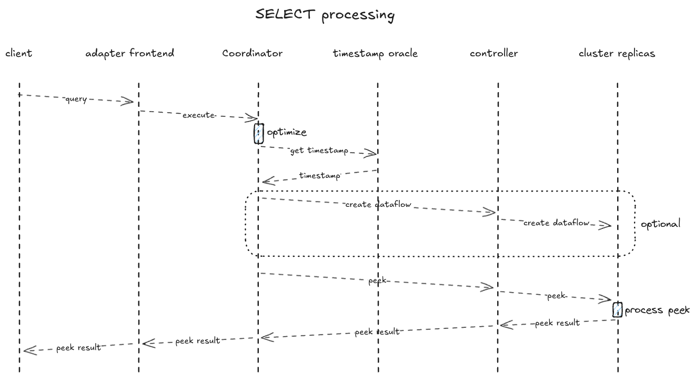

# Life of a Query

_Inspired by [CRDB: Life of a SQL
Query](https://github.com/cockroachdb/cockroach/blob/master/docs/tech-notes/life_of_a_query.md)._

## Introduction

This document aims to provide an overview of the components involved in
processing a SQL query, following the code paths through the various layers:
network protocol, session management, the adapter, query parsing, planning, and
optimization, interaction of the adapter layer and clusters, the storage layer,
and delivery of results from clusters, back through the adapter layer to the
client.

We don't discuss design decisions and historical evolution but focus on the
current code. We also only cover the common and most significant parts and omit
discussing details and special cases. In the following, we will discuss how
SELECT queries are processed, but other types of queries will use the same
components, if in slightly different ways.

## PostgreSQL Client Protocol

Queries arrive at Materialize through the [PostgreSQL wire
protocol](https://www.postgresql.org/docs/current/protocol.html).

The protocol is implemented in the [pgwire
crate](https://github.com/MaterializeInc/materialize/tree/bea88fb10b02792bad73afd79a6350b381a7dcc3/src/pgwire).
Incoming connections are handled in
[handle_connection](https://github.com/MaterializeInc/materialize/blob/bea88fb10b02792bad73afd79a6350b381a7dcc3/src/pgwire/src/server.rs#L105),
which passes on to
[run](https://github.com/MaterializeInc/materialize/blob/b3475aaaf96f9fae4a0d68cbb5202c224d9ce15b/src/pgwire/src/protocol.rs#L127),
and ultimately we create a
[StateMachine](https://github.com/MaterializeInc/materialize/blob/b3475aaaf96f9fae4a0d68cbb5202c224d9ce15b/src/pgwire/src/protocol.rs#L478)
whose
[run](https://github.com/MaterializeInc/materialize/blob/b3475aaaf96f9fae4a0d68cbb5202c224d9ce15b/src/pgwire/src/protocol.rs#L512)
handles the connection until completion.

The state machine has an adapter client
([SessionClient](https://github.com/MaterializeInc/materialize/blob/b3475aaaf96f9fae4a0d68cbb5202c224d9ce15b/src/adapter/src/client.rs#L481))
that it needs to use to accomplish most "interesting" things. It's a client to
the adapter layer, with its main component, the Coordinator. The work of
processing queries and maintaining session state is split between the "front
end" state machine that runs the pgwire protocol and the "back end" adapter
layer that handles talking to the other components.

> [!NOTE]
> We will keep using the terms adapter front end and adapter back end below to
> mean, respectively, the state machine that is responsible for a single
> connection and can do work concurrently with other connections, and the
> adapter/Coordinator which has to sequentialize work and is therefore more
> limited in the amount of work it can do concurrently.
>
> If it is clear from context, we will drop the adapter prefix.

## Adapter / Coordinator

The
[adapter](https://github.com/MaterializeInc/materialize/tree/f641a29d4aad9fcfeb2de535ff54706a1f1d38c4/src/adapter)
is named such because it translates user commands into commands that the other
internal systems understand. It currently understands SQL but is intended as a
generic component that isolates the other components from needing to know
details about the front-end commands (SQL).

A core component is the
[Coordinator](https://github.com/MaterializeInc/materialize/blob/9682eb11f31e2eb8005cb3eae687f81a1bce21bb/src/adapter/src/coord.rs#L1633).
It mediates access to durable environment state, kept in a durable catalog and
represented by the
[Catalog](https://github.com/MaterializeInc/materialize/blob/9682eb11f31e2eb8005cb3eae687f81a1bce21bb/src/adapter/src/catalog.rs#L137)
in memory, and to the controllers for the storage and compute components (more
on that later).

It holds on to mutable state and clients to other components. Access and
changes to these are mediated by a "single-threaded" event loop that listens to
internal and external command channels. Commands are worked of sequentially.
Other parts can put in commands, for example, the front end calling into the
adapter is implemented as sending a command which then eventually causes a
response to be sent back, but the Coordinator will also periodically put in
commands for itself.

> [!NOTE]
> Most of the time, when talking of the _controller_ or _controllers_, we are
> talking about the compute and storage controller, which are driving around
> computation that is happening on clusters or cluster replicas, to be more
> precise. And you will sometimes hear people say just controller when they
> mean the ensemble of the different controllers.

> [!NOTE]
> There is active work in progress on changing this design because it doesn't
> lend itself well to scaling the amount of work that the adapter can do. We
> want to move more work "out to the edges", that is towards the front end
> (which can do work for different connections/sessions concurrently) and the
> controllers for the other components. See [Design Doc: A Small
> Coordinator](/doc/developer/design/20250717_a_small_coordinator_more_scalable_isolated_materialize.md)
> for details.

## Query Processing

Query processing follows these steps:

parsing & describing → logical planning → timestamp selection → optimization & physical planning → execution

## Parsing & Describing

The Materialize parser is a hand-written recursive-descent parser that we
forked from [sqlparser-rs](https://github.com/andygrove/sqlparser-rs). The main
entry point is
[parser.rs](https://github.com/MaterializeInc/materialize/blob/aba45afb39455b84cd64d63c3af50ffcae46fd83/src/sql-parser/src/parser.rs#L129).

Parsing happens completely in the front end, it produces an AST of
[Statement](https://github.com/MaterializeInc/materialize/blob/7fab0d0e12a15799334854dcb3990997bc72e037/src/sql-parser/src/ast/defs/statement.rs#L43)
nodes. The AST only represents the syntax of the query and says nothing about
how or if it can be executed.

Describing is the process of figuring out the result type of a statement. For
this, the front end needs access to the Catalog, for which it needs to call into
the adapter.

Both parsing and describing happen in the front end, with calls into the adapter
as needed. All further steps are orchestrated by the adapter/Coordinator: the
front end passes the AST as a command and will become involved again when
sending results back to the client.

## Logical Planning

Logical planning generates a
[Plan](https://github.com/MaterializeInc/materialize/blob/b3475aaaf96f9fae4a0d68cbb5202c224d9ce15b/src/sql/src/plan.rs#L133)
from the AST. Glossing over some details, this binds referenced names based on
the Catalog as of planning time and determines a logical execution plan. The
entry point is
[plan](https://github.com/MaterializeInc/materialize/blob/b3475aaaf96f9fae4a0d68cbb5202c224d9ce15b/src/sql/src/plan/statement.rs#L274).

One of the differences between the user (SQL) commands that are input to the
adapter and commands for the rest of the system is the use of user-defined and
reusable names in SQL statements rather than the use of immutable, non-reusable
IDs. The binding mentioned above turns those user-defined names into IDs.

As mentioned in the previous section, logical planning happens inside the
Coordinator.

## Timestamp Selection

Another difference between user commands and internal commands is the absence
of explicit timestamps in user (SQL) commands, quoting from
[formalism.md](/doc/developer/platform/formalism.md#adapter):

> A `SELECT` statement does not indicate *when* it should be run, or against
> which version of its input data. The Adapter layer introduces timestamps to
> these commands, in a way that provides the appearance of sequential
> execution.

The internal interface that we use for determining timestamps is
[TimestampOracle](https://github.com/MaterializeInc/materialize/blob/cbaed5e677317feabd97048595e529bf3770547e/src/timestamp-oracle/src/lib.rs#L41).
The production implementation is an oracle that uses CRDB as the source of
truth. See [Design Doc: Distributed Timestamp
Oracle](/doc/developer/design/20230921_distributed_ts_oracle.md) for more
context.

## Optimization & Physical Planning

There are multiple stages to optimization and different internal
representations, and different types of queries or created objects will
instantiate different optimizer pipelines. The optimization pipeline for SELECT
is [this
snippet](https://github.com/MaterializeInc/materialize/blob/bdf9573960cece48e7811db7ef777b973d355fe6/src/adapter/src/coord/sequencer/inner/peek.rs#L568).

The final result of these stages will depend on the type of query we're
optimizing, but for certain types of SELECT and permanent objects it will
include a
[DataflowDescription](https://github.com/MaterializeInc/materialize/blob/53acc93eee1bbbf418fde681389aec0419db8954/src/compute-types/src/dataflows.rs#L40).
Which is a physical execution plan that can be given to the compute layer, to
execute on a cluster.

TODO: Expand this section on optimization, if/when needed.

## Execution on a Cluster

For SELECT, which is internally called PEEK, there are three different execution scenarios:

- Fast-Path Peek: there is an existing arrangement (think index) in the cluster
  that we're targeting for the query. We can read the result from memory with
  minimal massaging and return it to the client (through the adapter).
- Slow-Path Peek: there is no existing arrangement that we can query. We have
  to create a dataflow in the targeted cluster that will ultimately fill an
  arrangement that we can read the result out of.
- Persist Fast-Path Peek: there is no existing arrangement but the query has a
  shape that allows us to read a result right out of a storage collection (in
  persist).

The result of optimization will indicate which of these scenarios we're in, and
the adapter will now have to talk to the compute controller to implement
execution of the query.

Ultimately, for all of these scenarios the adapter will make a call into the
compute controller to read out a peek result. For slow-path peeks it will first
create the dataflow, but the functionality for reading our the result is the
same for fast path and slow path after that. The entry point for setting of the
actual peek is
[peek](https://github.com/MaterializeInc/materialize/blob/4a84902b5bed3bbd605d7d165fa6e0823c88c102/src/compute-client/src/controller.rs#L862).
And the entry point for creating a dataflow is
[create_dataflow](https://github.com/MaterializeInc/materialize/blob/4a84902b5bed3bbd605d7d165fa6e0823c88c102/src/compute-client/src/controller.rs#L759).

The adapter will pass the sending endpoint of a channel to the compute
controller, for sending back the results, and then setup up an async task that
reads from that channel, massages results, and sends them out as another
stream. The receiving end of that second stream is what the adapter returns in
a
[ExecutionResponse::SendingRowsStreaming](https://github.com/MaterializeInc/materialize/blob/b3475aaaf96f9fae4a0d68cbb5202c224d9ce15b/src/adapter/src/command.rs#L362),
to the adapter front end, which handles sending results back out to the pgwire
client.

## Dataflows & Arrangements

Clusters run dataflow computations, and within those dataflows, arrangements
are the structure that data is being kept in. Arrangements are used both for
keeping data internal to the dataflow but also for incrementally maintained
results. For example, an index is a dataflow where at the end we have an
arrangement that a peek can read out of.

On the more technical side, arrangements are multi-versioned indexes. The
[arrangements documentation](/doc/developer/arrangements.md) describes them as
an indexed representation of a stream of update triples `(data, time, diff)`,
organized by key for efficient lookups.

## Controller <-> Cluster Protocol

The adapter talks to the controllers, and the controllers in turn use a
protocol for talking to the clusters and getting responses back. For historic
reasons, compute and storage have separate protocols even though today they can
have computation running on the same cluster. The compute protocol commands are
defined in
[ComputeCommand](https://github.com/MaterializeInc/materialize/blob/32796a0598b4e12615dcc80818de1c5a35ff962d/src/compute-client/src/protocol/command.rs#L51),
and responses are defined in
[ComputeResponse](https://github.com/MaterializeInc/materialize/blob/d369bdb9097ab9589b240aafea9b3ccb05d72061/src/compute-client/src/protocol/response.rs#L42).
Anything from creating dataflows, setting up peeks, sending back peek
responses, dropping dataflows, etc. happens using this protocol. For storage,
the commands and responses are defined in
[StorageCommand](https://github.com/MaterializeInc/materialize/blob/15093acbc73e5a8012a82f316948215daf105f10/src/storage-client/src/client.rs#L111)
and
[StorageResponse](https://github.com/MaterializeInc/materialize/blob/15093acbc73e5a8012a82f316948215daf105f10/src/storage-client/src/client.rs#L622),
respectively.

For the purposes of PEEK (aka. SELECT, remember) processing, the interesting
commands/responses are:

- `ComputeCommand::CreateDataflow` for creating a dataflow in case of a
  slow-path peek
- `ComputeCommand::Peek` for initiating the actual peek
- `ComputeResponse::PeekResponse` with the peek result

Between the controller and the cluster sits a "consolidation layer" that
handles the details of multi-process cluster replicas. For example,
`PeekResponses` from all replica processes get combined and get surfaced to the
controller as only one `PeekResponse`. For peeks, this gets handled in
[absorb_peek_response](https://github.com/MaterializeInc/materialize/blob/f0dcd37dbe63c5a7f46ec2fd6cc8abba231eb002/src/compute-client/src/service.rs#L271).

## Peek "Extraction"

In some way or other, a peek requires that a result be extracted from an
arrangement or straight from persist. In
[handle_peek](https://github.com/MaterializeInc/materialize/blob/a15c9298b3c4b442a295ec1db175ca6b72af6f29/src/compute/src/compute_state.rs#L616)
we set up the machinery for processing a peek and the method that drives peeks
to completion is
[process_peeks](https://github.com/MaterializeInc/materialize/blob/a15c9298b3c4b442a295ec1db175ca6b72af6f29/src/compute/src/compute_state.rs#L993).

From the perspective of the cluster, there are two ways of extracting peek
results. Both fast-path and slow-path peeks ultimately look the same to the
cluster: we extract a result from an arrangement. It's just that for slow-path
peeks the dataflow and arrangement are created just for that peek. This kind of
peek is set up in
[here](https://github.com/MaterializeInc/materialize/blob/a15c9298b3c4b442a295ec1db175ca6b72af6f29/src/compute/src/compute_state.rs#L618)
in `handle_peek`.

A persist fast-path peek does _not_ require an arrangement for extracting a
result. Instead a result is extracted straight from persist with potential
filters and projections applied. The entry point for that is this
[code](https://github.com/MaterializeInc/materialize/blob/a15c9298b3c4b442a295ec1db175ca6b72af6f29/src/compute/src/compute_state.rs#L625),
in `handle_peek`.

Results can be sent back in two ways: inline in the protocol via
`ComputeResponse`, or using the _peek result stash_. The latter allows for
sending back larger results but there are certain restrictions on what shapes
of queries are eligible to use the stash. This has to do with post processing,
which we will describe below. Roughly, queries that don't require post
processing can use the peek stash, so queries that have OFFSET, LIMIT, or ORDER
BY _cannot_ use the large result stash.

For all queries, we start out trying to use the inline result protocol but then
fall back to the stash when we notice the result size getting to large and a
query is eligible. [This
code](https://github.com/MaterializeInc/materialize/blob/a15c9298b3c4b442a295ec1db175ca6b72af6f29/src/compute/src/compute_state.rs#L939)
inside `process_peek` is where that decision happens.

## Delivering Peek Results and Post Processing

Peek results get sent back to the controller from the cluster, inside a
`ComputeResponse::PeekResponse`
([code](https://github.com/MaterializeInc/materialize/blob/d369bdb9097ab9589b240aafea9b3ccb05d72061/src/compute-client/src/protocol/response.rs#L92)),
either inline or using the large result stash. From there they have to get
routed through the adapter and out through the pgwire protocol to the client.

For this, the adapter sets up an async task that waits for the peek response
from the controller, applies post processing when required and then yields it
to a stream. This stream in turn is what gets returned to the adapter front end
(which drives the pgwire state machine, remember) to return the result back to
the client. This is somewhat reminiscent of continuation-passing style, where
the components return "results" early and the whole pipeline for returning the
result is established, but actual data will only flow once the result comes
back from the cluster.

The code that sets up the async task in the adapter is
[create_peek_response_stream](https://github.com/MaterializeInc/materialize/blob/53acc93eee1bbbf418fde681389aec0419db8954/src/adapter/src/coord/peek.rs#L887).
Which in turn gets wrapped in a
[ExecuteResponse::SendResponseStreaming](https://github.com/MaterializeInc/materialize/blob/b3475aaaf96f9fae4a0d68cbb5202c224d9ce15b/src/adapter/src/command.rs#L362)
that makes its way back to the front end code.

As a last step, we then have [this
code](https://github.com/MaterializeInc/materialize/blob/b3475aaaf96f9fae4a0d68cbb5202c224d9ce15b/src/pgwire/src/protocol.rs#L1588)
in the front end that sets up the last piece of the pipeline for sending results
back out to the client once they start flowing.

One final piece of the pipeline for delivering query results is what this
document calls post processing but which the code calls "finishing" (see
[RowSetFinishing](https://github.com/MaterializeInc/materialize/blob/ddc1ff8d2d201c263b5e1ff40effccceb153a767/src/expr/src/relation.rs#L3640)).
We apply any ORDER BY, LIMIT, or OFFSET clauses only _after_ results get back
from the clusters, before sending the result out to the client. This happens
within the async task that routes results from the controller to the front end,
in [this
code](https://github.com/MaterializeInc/materialize/blob/53acc93eee1bbbf418fde681389aec0419db8954/src/adapter/src/coord/peek.rs#L910).
As mentioned above, the presence or not of a Finishing is what determines the
eligibility of a query for the large result stash feature. Queries that require
a Finishing cannot use the stash.

## Query Processing: A Flow Chart

## Query Processing: CPU Work & Network Hops

The above outlined the components involved in processing a SELECT query and the
interactions between them. We didn't explicitly mention how expensive the
different steps are (in terms of CPU cycles) and which steps involve network
hops rather than function calls within a process.

The CPU intensive parts of query processing are:

- Optimization
- Dataflow computation

A peek only requires specific dataflow computation when it is a slow-path peek.
Otherwise, reading out of the arrangement is considered cheap.

Of the interactions outlined above in the flow chart, the network hops are:

- The query from client to the adapter front end, via pgwire
- Getting a timestamp from the timestamp oracle: this involves doing a read query against CRDB
- The `ComputeCommand::CreateDataflow` command sent from controller to the cluster, optional and only required for slow-path peeks
- The `ComputeCommand::Peek` command sent from controller to the cluster
- The `ComputeResponse::PeekResponse` sent from the cluster to the controller
- The result sent back from the adapter front end to the client

## Details

Details on components and concepts that we didn't explain above.

### Durable Storage

At the coarsest level, a Materialize Environment has to types of durable state:

- The _Catalog_, which is the metadata about what objects exists, settings,
  roles, clusters, replicas, etc.
- Collection data, which is both builtin collections and user collections, such
  as Tables, Sources, Materialized Views, etc.

Both of these types of data are stored in persist. The Catalog is stored in a
single persist shard and collection data is also stored in persist shards.

### Persist

Persist is Materialize's durable storage component as described in the (now
maybe slightly outdated) [persist design
document](/doc/developer/design/20220330_persist.md).

The core abstraction is a "shard" - a durable
[TVC](/doc/developer/platform/formalism.md#in-a-nutshell) that can be written
to and read from concurrently. Persist uses a rich client model where readers
and writers interact directly with the underlying blob storage (typically S3)
while coordinating through a consensus system for metadata operations.

Persist is built on two key primitives: `Blob` (a durable key-value store) and
`Consensus` (a linearizable log). The blob storage holds the actual data in
immutable batches, while consensus maintains a state machine that tracks
metadata like shard frontiers, active readers/writers, and batch locations.

### Compute & Storage Controllers

The adapter interacts with clusters and storage collections through two main
controllers: the
[ComputeController](https://github.com/MaterializeInc/materialize/blob/main/src/compute-client/src/controller.rs)
and the
[StorageController](https://github.com/MaterializeInc/materialize/blob/main/src/storage-controller/src/lib.rs).
These controllers act as intermediaries that translate adapter commands into
cluster commands and manage the life cycle of compute and storage resources.

The
[ComputeController](https://github.com/MaterializeInc/materialize/blob/main/src/compute-client/src/controller.rs)
manages "compute flavored" dataflows running on clusters (or rather cluster
replicas, to be precise). It handles the creation and maintenance of indexes,
materialized views, and other dataflows, talking to cluster replicas via the
compute protocol.

The
[StorageController](https://github.com/MaterializeInc/materialize/blob/main/src/storage-controller/src/lib.rs)
manages storage collections including sources, tables, and sinks. For ingestion
from external systems, it needs to install computation on a cluster. Similarly
to the compute controller, communication with the storage parts on a cluster
replica happens via the storage protocol.

Both controllers maintain read and write capabilities for their respective
resources, coordinate compaction policies, and ensure that data remains
accessible as long as needed.

### Clusters and Timely Dataflow / Differential Dataflow

TODO!
