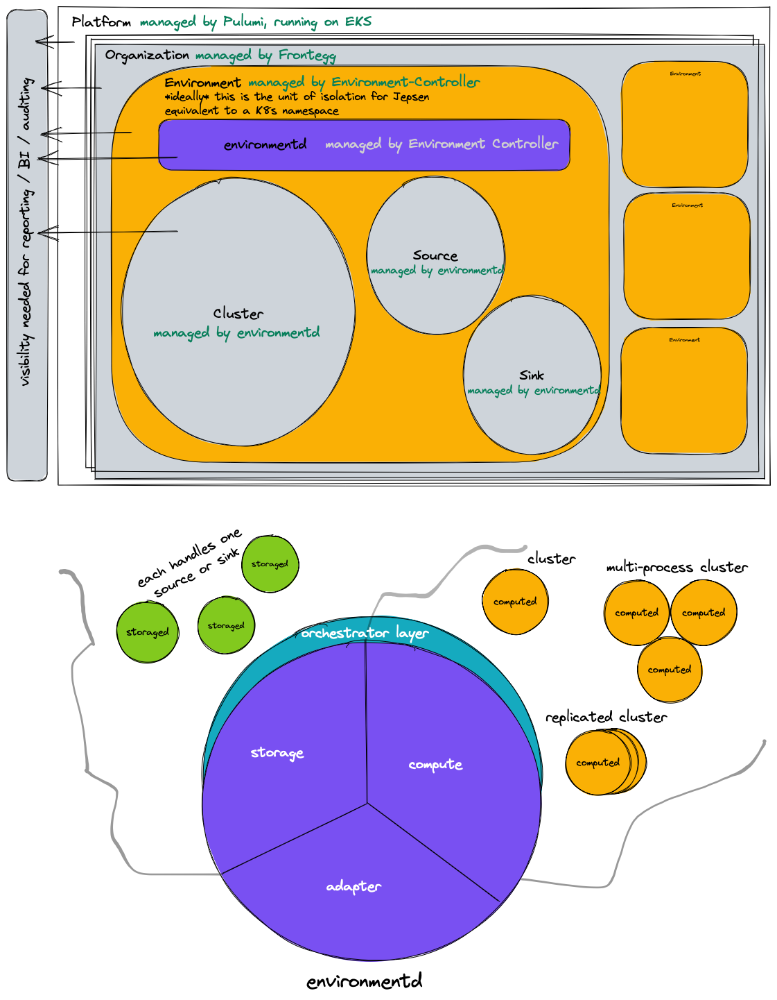

# Materialize Platform: Cloud Architecture

TODO: This document will describe the architecture of the CLOUD OPERATOR
component that spins up the STORAGE, COMPUTE, and CONTROL layers described in
the [Database Architecture](architecture-db.md).

## How to read this document

⚠️ **WARNING!** ⚠️ This document is a work in progress! At this stage it is a
loose collection of raw thoughts.

## Overview diagram

## Customer regions

What's called a ["region"](ux.md#region) in user-facing code will be internally
called an "environment", to avoid confusion with a cloud-provider region.

Each environment will correspond to a namespace in Kubernetes. Each environment
is issued a TLS certificated by Let's Encrypt. We've requested an increased
rate limit from Let's Encrypt, as by default Let's Encrypt will only issue
[50 certificates per domain][letsencrypt-limit].

Environments are managed by the environment controller, which is a Kubernetes
operator that lives in a private repository.

### Service creation

The STORAGE and COMPUTE layers each turn on instances by creating services in
an [`Orchestrator`]. An `Orchestrator` is backed by Kubernetes in the cloud,
and a service corresponds directly to a `StatefulSet`. This may evolve soon.

All ports created by the orchestrator have names.

The Kubernetes orchestrator installs the following labels on all services and
pods that it creates:

  * `environmentd.materialize.cloud/namespace`: the orchestrator "subnamespace"
    in which the service is created. Either `storage` or `compute` at present.

  * `environmentd.materialize.cloud/service-id`: the namespace-provided
    identifier for the service, like "cluster-0" or "runtime".

  * `environmentd.materialize.cloud/port-PORT=true`: A label for each named port
    exposed by the service.

  * `NAMESPACE.environmentd.materialize.cloud/KEY`: arbitrary labels assigned
    at service creation time, prefixed with the `NamespacedOrchestrator`
    that created the label.

Additionally, the service that invokes `environmentd` can pass
`--orchestrator-service-label` to specify additional labels that should be
attached to *all* pods and services created by the Kubernetes orchestrator.

### Secrets

See the [secret design doc](../design/20220303_secrets.md).

## Binaries

There are presently three binaries involved in Materialize Platform:

  * `environmentd`, which hosts the storage controller, compute controller,
    and adapter layers
  * `storaged`, which hosts a storage runtime
  * `computed`, which hosts a compute runtime

There are three separate network protocols:

  * The **controller** protocol, which is how `environmentd` communicates with
    `storaged` and `computed`. This protocol is conventionally hosted on port
    2100.

  * The **storage** protocol, which is how the compute runtime communicates with
    the storage runtime. This protocol is conventionally hosted on port 2101.

  * The **compute** protocol, which is how compute nodes communicate with one
    another. This protocol is conventionally hosted on port 2102.

## Terraform provider

Building a Terraform provider that manages clusters, roles, databases, schemas,
and secrets should be straightforward. Because all of these objects are managed
via SQL, our Terraform provider can be a fork of [terraform-provider-postgresql]
with only minor modifications.

Supporting sources and sinks in the Terraform provider will be more challenging,
because it amounts to remapping the `CREATE SOURCE` and `CREATE SINK` syntax
to Terraform resources, and that syntax is extremely complex.

[letsencrypt-limit]: https://github.com/MaterializeInc/materialize/pull/10319#discussion_r795500101
[`Orchestrator`]: https://dev.materialize.com/api/rust/mz_orchestrator/trait.Orchestrator.html
