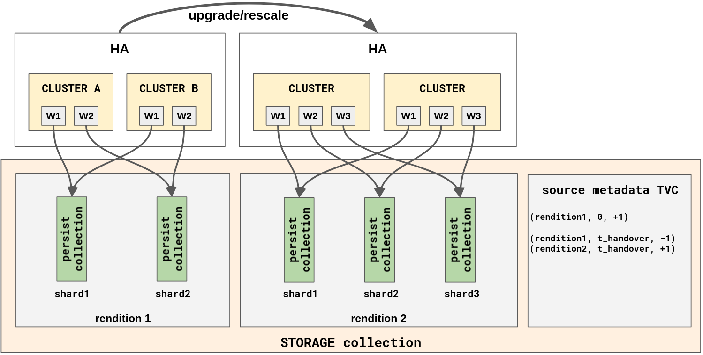
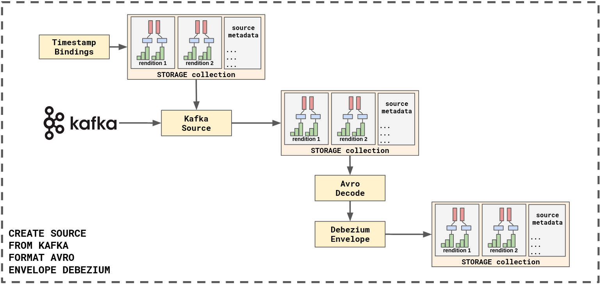

## Storage architecture

STORAGE is responsible for creating and maintaining definite time varying
collections (TVCs) that contain either ingested data from an external source
(e.g Kafka), data sinked from one or more CLUSTER instances, or data coming
from `Insert` requests to the storage controller, providing a table-like
experience.

## The STORAGE collection structure



### Overview

STORAGE is tasked with managing the lifecycle of STORAGE collections (just
collections hereafter). Collections support concurrent, sharded writes from
multiple CLUSTER instances configured in active replication mode. Furthermore,
collections allow writers to "start from scrach" by recreating a completely new
version (rendition) of the collection, perhaps because the writer fixed a bug
that results in slightly different data or because a re-shard is necessary.

A collection consists of one or more renditions. A rendition is a standalone
version of the collection. Each rendition can have one or more shards where the
number of shards is selected at creation and remains static for the lifetime of
that rendition. Each shard maps 1-1 to a `persist` collection.

At any given time `t` the contents of the collection are defined unambiguously
by the contents of **exactly one** of the renditions. The information
describing which rendition is active at any given time is recorded as part of
the metadata of the collection. Readers use this metadata to know the exact
time `t_handover` that they should switch from one rendition to another. This
ensures that even though the collection can transition through multiple
renditions over time every reader always perceives a definite collection
advancing in time.

A shard of a rendition is the endpoint where writing happens. Writers insert
batches of data in a shard by using a write handle on the underlying `persist`
collection backing the shard.

### Renditions

A rendition represents a version of a collection and is described by its name,
its `since` frontier, and its `upper` frontier. The `since` frontier is defined
as the maximum of the `since` frontiers of its shards and its `upper` frontier
is defined as the minimum of the `upper` frontier of its shards (replace
max/min with join/meet for partialy ordered times).

#### Rendition metadata

The contents of the collection overall are described by a metadata `persist`
collection. This rendition metadata collection evolves in time and can be
thought of as instructions to readers that tells them what data they should
produce next. It containing updates of this form:

```
(rendition1, 0, +1)
// At `t_handover` readers should switch from rendition1 to rendition2
(rendition1, t_handover, -1)
(rendition2, t_handover, +1)
```

Readers hold onto read capabilities for the metadata collection that allows
STORAGE to know which renditions should be kept around and which ones should be
garbage collected. In the example above, when all readers downgrade their read
capability beyond `t_handover` the metadata collection can be consolidated and
`rendition1` can be deleted.

Readers interpret advances of the medatata frontier as proof that no rendition
change occured between the previously known frontier and the newly advanced
frontier. Therefore they can proceed with reading their current rendition for
all times not beyond the frontier of the metadata collection.

Readers encountering a change in rendition at some handover time `t_handover`
must produce the necessary diffs such that the resulting collection accumulates
to the contents of `rendition2` at `t_handover`. A simple strategy for doing so
is to produce a snapshot of `rendition1` at `t_handover` with all its diffs
negated and a snapshot of `rendition2` at `t_handover`. More elaborate
strategies could be implemented where for example STORAGE has precalculated the
`rendition2 - rendition1` difference collection for readers to use.

### Shards

A shard is part of a rendition and is the endpoint where writers publish new
data. They can be written to by multiple workers as long as all the workers
produce identical data (i.e their outputs are definite).

It is an error to have multiple writers write conflicting data into a shard and
the contents of the collection are undefined if that happens.

## Components

### Fat client

STORAGE provides a fat client in the form of a library that can be linked into
application that which to consume or produce collections. The fat client will
at the very least be able to import a collection into a timely dataflow cluster
and will handle all the rendition/shard handling logic internally.

### Controller

The STORAGE controller is a library and is hosted by ADAPTER. Its job is to
mediate all STORAGE commands that create, query, and delete collections, create
and handover renditions, and manage read/write capabilities for the collection.
The formalism document expands on the expected API of the STORAGE controller.

All commands are durably persisted and their effect survives crashes and reboots.

## Source ingestion

In response to a CREATE SOURCE command, the STORAGE layer should instantiate a *source ingestion pipeline*.
This pipeline does not need to be a dataflow, but as we will see it is helpful to use timestamps to maintain consistency.

The goal of the source ingestion pipeline is to produce data that can be appended to the `persist` shards of a durable storage collection.
The result of this collection is the primary user-facing output of the source ingestion pipeline.
There may be other auxiliary information, like the reclocking collection, that feeds in to health checks and user-facing diagnostics.

We want source ingestion to satisfy at least these three properties:

1. Definiteness: this should be provided by `persist`, and isn't meant to be something we can screw up.
2. "Fault tolerance": the source should produce specific output even in the presence of unspecified i. failures and restarts, ii. concurrency with other source implementations.
3. "Bounded input reliance": the raw input data we have to keep around to provide these properties should be as limited as possible.

## A recipe for source ingestion

What follows is a recipe for source ingestion that means to provide the three properties listed above.

In addition, the "recipe" aspect of this means to make it "simple" to determine that you have these properties.
You could certainly hand roll something that also has the properties, but then you have a bunch of work to do to convince folks.
By following the recipe, the goal is that you shouldn't have to convince anyone of anything.

### Ingredients

1. We have some "raw sources" of data.

    These sources implement something like our `SourceReader` trait, which has a method `get_next_message()` that produces an ordered sequence of messages.
    Messages come with some ordered "address" (e.g. a (part, offset) pair or a LSN position or byte offset).
    The messages are emitted in an order that matches the address (the address never goes backwards).
    The source can be initialized at an address.
    For each address, the source produces the same message to all readers (or "NA" if it's gone).

2. We have access to the `persist` framework that can record evolving collections

    The framework accepts arbitrary `Append` statements to individual shards and confirm when and whether they are durably recorded.
    It handles contended writes, picking at most one winner, and providing a single consistent history of updates for each shard.
    A collection may be formed of multiple shards, which may not have the same durable frontiers.

3. We have an evolving understanding of what should happen to our data from raw sources to `persist`.

    We want some amount of flexibility here, as we may be surprised by the requirements of source decoding, or new opportunities.
    The "understanding" should reflect deterministic computation.
    Non-determinism is something we can do with an advanced recipe (more `persist` stuff, in the spirit of reclocking, where we record non-deterministic choices).

### The recipe

There is some prep work to do first:

1.  Identify all "raw sources" that contribute to some intended output (e.g. kafka topics, metadata, schema registry).

2.  "Reclock" each input, by choosing and recording in `persist` shards a collection of source addresses that are monotonically increasing (do not go backwards, but needn't always go forward).

    We should use times that roughly track "real time" so that they align with the times of other collections.
    The reclocked inputs are going to be treated as if their data "become available" at the first moment for which the data's address is covered by the reclocking collection.

    As suggested, this may include things like the schema registry that aren't conventional inputs, but nonetheless are external sources that influence the output we will produce.

2. Identify the "state" that a streaming implementation of the intended functionality would need to maintain.

    For example, if we are matching up transaction metadata with the data it references, we may need to maintain some outstanding metadata records and some outstanding data records, until all in a transaction match.
    If we intend to hold back transactions until all strictly prior transactions have completed, we may need to hold on even to some completed transactions, awaiting the completion of the prior work.

3. Create `persist`-backed storage collections for the output and the identified "state".


With this prep work done, the assembly instructions are:

1. To start, determine `t` the `min` write frontier in `persist` for all shards of outputs and all state.

    The time `t` may be strictly less than some of the shards, which will mean that we cannot necessarily write at `t` for all shards.
    This is fine, and will be discussed in just a moment.

2. From time `t` onward, rehydrate the "state" associated with the source pipeline.

3. Restart each raw source from the addresses found in the persisted reclocking collection at `t`.

4. From time `t` onward, continually produce reclocked messages: messages from the raw source whose addresses are translated to timestamps using reclocking information from `persist`.

    It is important that this be based on reclocking information we hear back from `persist`, rather than what we optimistically proposed at `persist`.
    This ensures that the right thing happens in the case there are contending implementations.

    Each raw source should now produce exactly its outputs at times greater or equal to `t`.

5. From time `t` onward, apply the source pipeline to produce at each time:

    a. Changes to push at persist to update the output.

    b. Changes to push at persist to update the state.

    Both of these changes may end up being aimed at a `persist` shard that has already committed updates at that time.
    This can be because on restart not all `persist` shards had the same frontier, or because another storage instance is contending on writes.
    The writes *should* be identical, owing to the determinism of the pipeline so far.
    If they are not identical (an instance could assert they are on any failed write) then a new rendition is required (and perhaps a bug report, if this is unexpected).

These are all of the instructions.
Clearly Step 5. is not fully specified.
The property it must have is that two independent pipelines should produce the same output and state updates.
One way to make this happen is to behave as if each message becomes available at its timestamp, and at each time we "immediately" retire all complete work.
For example, the first timestamp for which we have both transaction metadata and all supporting data messages, we would output those data messages.
Alternately, the first timestamp for which we have both transaction metadata and all supporting data messages, *and no incomplete prior transactions*, we would output those data messages.
The specific choice of what to do depends on our goals, but one attempts to do it as if executing each timestamp one at a time in sequence, and doing all the work that is possible at each timestamp.

### Outcomes

The reason we follow the recipe is because we uphold the desired three properties automatically.

1. *Definiteness.*

    We get definiteness from `persist`.
    I don't think we are able to screw this up.

2. *Fault Tolerance.*

    Our choice of `t` is meant to provide a "consistent snapshot" of our source pipeline.
    It is a moment at which we know exactly where we were in input processing (indicated by the reclocking collection), what our "state" was, and what the output corresponded to.
    With this consistent snapshot, one can resume work and proceed as if without interruption. Multiple concurrent instances should also produce identical outputs, because of the consistent snapshot and deterministic execution (onward, from the reclocking input).

3. *Conciseness.*

    Our choice of `t` should never regress, and as it advances we are certain that we can resume from input addresses indicated by the reclocking collection.
    As long as we continually advance `t`, by continually making state and output durable, we move forward the input addresses on which we rely.
    In the worst case, we migrate the input data to "state", but at least take ownership of the data and allow the input to eventually discard the data.

### Variations

This recipe is prescriptive in an attempt to make it easy to write pipelines that have the required properties.
There are variations that can be employed, introducing complexity where it may be valuable or important.
Two example of this are:

1.  Some inputs may be already-reclocked sources.

    There are good reasons for STORAGE to internally create and manage
    multiple collections that work together to form a final collection. For
    example, in the case where STORAGE is instructed to ingest a source that
    requires Avro decoding and DEBEZIUM envelope processing, STORAGE might decide
    to first create a definite collection of the raw data before decoding and
    envelope processing and compute the final collection based on that. This
    ensures that STORAGE will always have the ability to fix bugs in the Avro
    decoding logic and generate new renditions based on the original raw data that
    have been safely stored in the raw collection.

2.  Some of the pipeline may be non-deterministic.

    If the non-determinism may lead to different results, we need to capture the choices made and play forward from them.
    Reclocking is an example of non-determinism, where it is important to commit the results to `persist`, and then read out of `persist` to be sure to use the commited choices.
    It may be important to use only a single `persist` shard if the non-determinism must be committed all at once (otherwise, the commits might only land in a subset of the shards).


