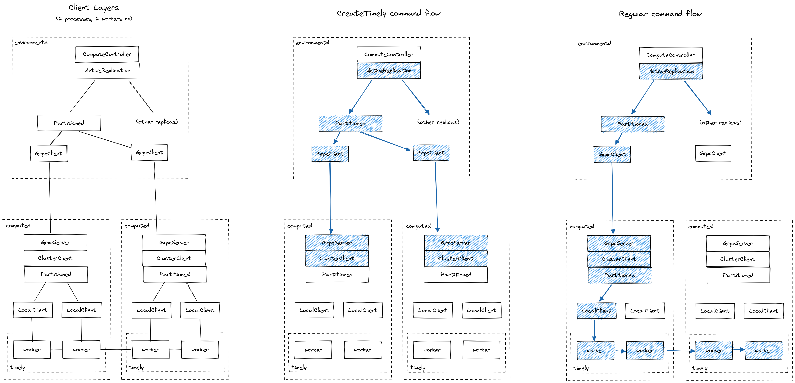

# COMPUTE Layer: Q&A

This document proposes a set of questions to help developers grasp a helpful subset of the implementation concepts of the dataflow runtime portion of the COMPUTE layer of Materialize. This document aims to drill down one level closer to the implementation than the [architecture](architecture-db.md), [formalism](formalism.md), and [boundary](boundaries.md) overview documents. This document does not intend to cover details regarding the query optimizer; we refer the reader to the [Query Compilation 101](/doc/developer/101-query-compilation.md) document and references therein for these details.

## COMPUTE and its Interfaces

### Which modules are responsible for networking and communication with other layers within COMPUTE?

The main serving loop for the COMPUTE layer is in [`src/compute/src/server.rs`](/src/compute/src/server.rs). When initialized, a number of `Worker` objects and `crossbeam` channels are created. Each worker of the COMPUTE layer is given the `Receiver` end of a channel from where compute commands can be received and responses can be sent upon client connections. Subsequently, each worker runs indefinitely in a command processing loop handling all commands submitted by a client to completion (`run` function of `Worker`). Clients attach to the other end of compute worker channels through a gRPC server. The COMPUTE controller running in `environmentd` is a primary example of such a client, which sends commands to a number of COMPUTE replicas (see [Active Replication](/doc/developer/reference/compute/active-replication.md)).

Additionally, a `PersistClientCache` controls communication via `persist` and is shared across all workers in the COMPUTE layer. A persist client can be allocated for a given blob URI / consensus URI combination, and the cache keeps the relevant references for future requests. Blobs can be stored, e.g., in a distributed cloud service such as S3 or — when running the system for local development — in local files.

The COMPUTE layer creates a number of sockets to allow for interaction among processes in a Timely instance (COMPUTE replica) in [`src/compute/src/communication.rs`](/src/compute/src/communication.rs). So this module is actually not directly supporting communication with other layers of Materialize, but rather interfacing resources with Timely.

This figure illustrates the compute networking stack, as well as the flow of commands through the layers:

### What is the set of commands that the COMPUTE layer responds to and what do these commands do at a high level?

The set of available commands can be seen in `ComputeCommand<T>` at [`src/compute-client/src/command.rs`](/src/compute-client/src/command.rs). At a high level, there are commands to: (a) initialize a COMPUTE replica, (b) communicate to a replica that all command reconciliation during initialization has been completed, (c) create dataflows, (d) allow compactions of COMPUTE-managed collections to take place, (e) peek at arrangements, (f) cancel peeks. The types of responses to the commands are listed in `ComputeResponse` at [`src/compute-client/src/response.rs`](/src/compute-client/src/response.rs).

### What is the lifecycle of networking threads in a `computed` process? Do they farm out work to other threads?

TODO

### How does the COMPUTE implementation abstract sinks?

It is important to first distinguish between COMPUTE sinks and Timely Dataflow (TD) sinks. A dataflow in TD is composed of operators. In general, these operators read their input from other operators and direct their output to other operators. A sink in TD is a special kind of operator that is not associated to any other output operators. A sink in TD must thus consume its input. Symmetrically, TD's concept of a source is that of an operator that does not have other operators as input.

COMPUTE manages sets of dataflows and arrangements, as well as their interfacing with the other layers of Materialize. Analogously to TD, COMPUTE sources provide data to the COMPUTE layer, while COMPUTE sinks absorb data from the COMPUTE layer. The primary method to enable such data plane transfers from and to the COMPUTE layer is through `persist`, a library that interfaces the COMPUTE and STORAGE layers. In the case of `persist` sinks, the updates are streamed into a persist shard in STORAGE by a tailor-made TD operator, along with relevant frontier advancements. Another option to externalize dataflow results from COMPUTE is through a `SUBSCRIBE` sink. This type of sink leverages a TD sink operator to send updates back to `environmentd` through an instance of `SubscribeProtocol`.

### What is the sharing model of `persist` clients and how does COMPUTE utilize `persist`?

Compute uses persist for both reading and writing data. For example to sink a dataflow, compute will write it to persist; for reading a source, compute will only ever read from a persist shard. This interaction is abstracted by `persist_sink` and `persist_source` operators.

The [persist design doc](/doc/developer/design/20220330_persist.md) is a good starting point to obtain more details on how persist is structured internally.

### How does the COMPUTE implementation integrate with sources? How is `persist` involved in this process?

The STORAGE layer is responsible for ingesting an external source (e.g., in Kafka or PostgreSQL) and then writing the data to a persist shard. The COMPUTE layer is oblivious to the source itself, since all interactions with source data are mediated through STORAGE. Some attributes of sources are, however, important. A prime example is monotonicity, i.e., the property that a source will not present any retractions, only additions. Monotonicity is exploited in the COMPUTE layer, e.g., for specialized optimizations.

### What roles does a `computed` process play in command reconciliation? How can a `computed` process determine that reconciliation has been achieved?

TODO

## COMPUTE and its Main Server Loop

### What does the main server loop of a computed process do?

TODO

### How many threads run the main server loop? How is work (e.g., compute commands to process) allocated to threads?

TODO

### How are clients of a given computed process abstracted and handled?

TODO

### What is the relationship between a `Worker` with lifetime `'w` and its `ComputeState`?

TODO

### What does an `ActiveComputeState` represent and how does its lifetime `'a` relate to the lifetime `'w` of a `Worker`?

TODO

### How do `Rc`'ed data structures (e.g., compute_logger in ComputeState) behave in terms of lifetime when contrasted with 'w and 'a lifetimes above?

TODO

### What is the function of logging within a `computed` process? What kinds of events are logged?

TODO

### How are the introspection views of Materialize implemented and what is their connection to logging within a `computed` process?

TODO

## COMPUTE and its Relationship to Timely and Differential

### Which arrangement-related code lives in COMPUTE layer modules and which lives inside of Differential?

TODO

### What is a Timely worker and what is a COMPUTE server worker?

TODO

### How is a data-parallel Timely/Differential operator executed over multiple threads within COMPUTE? Can it be executed over multiple processes? How are threads and tasks allocated?

TODO

### What do Timely, Differential, and Reachability events represent and how are they handled by the logging infrastructure of COMPUTE?

TODO

## Life of COMPUTE Commands and Source Updates

### What happens when an interactive query is submitted?

TODO

### What happens when a CREATE DEFAULT INDEX command on a regular view is submitted?

If a unique key is known for the regular view, an index will be created on a unique key (if there are multiple unique keys, the choice may be arbitrary). If no unique keys are known for the regular view, an index will be created that is keyed on all columns of the view. The reason is that we want to distribute rows in the index as evenly as possible across workers.

TODO: describe how indexes are represented in arrangements.

### What happens when a CREATE MATERIALIZED VIEW command is submitted?

TODO

### What happens when a source update arrives?

TODO

### What happens when a source frontier advances?

TODO

### What happens when a dataflow frontier advances?

TODO

## COMPUTE and Operator Rendering

### What is rendering?

Rendering is the process of taking a plan expressed in the low-level intermediate representation (LIR) and outputting a corresponding Timely dataflow operator graph (TDO). The rendering process is thus specialized according to different plan node types, e.g., `TopKPlan`, `ReducePlan`, and so on.

### How is an MFP rendered?

TODO

### How is a TopKPlan rendered?

Consider the naive top-k algorithm: Run through the input collection and keep a priority queue of size k based on the ordering criterion. This algorithm takes linear time to obtain the top-k results; more worryingly, however, it is not very clear how to adapt the algorithm to deal with streaming updates. For example, how can we update the top-k results when one of the top-k records is retracted?

To deal with this problem, our general strategy to render TopKPlan instances creates a hierarchy of specialized TopK reduce operators. This hierarchy is tuned such that we have a fixed number of logarithmically spaced groupings forming what resembles a tournament structure. In particular, we create 16 stages such that even the largest collection sizes can be handled and at the same time each grouping stage is at first working on groups with a bounded number of records (currently 16) to apply the limit and then increasing the size of the groups.

We also provide specialized strategies for monotonic plans, i.e., where no retractions are possible. For monotonic top-1, we can move each row to the difference field and perform a reduction; for monotonic top-k, we perform both intra- and inter-timestamp thinning to ensure a bound on the input size before applying a final top-k reduction stage.

Top-k rendering is in [`src/compute/src/render/topk.rs`](/src/compute/src/render/top_k.rs).

### How is a ReducePlan rendered?

The rendering of a `ReducePlan` has two main components. Firstly, a `FlatMap` operator is employed to ensure that all expressions necessary for reduction are evaluated and created as data columns. Secondly, a subsequent DAG of operators is created depending on the type of reduction.

Arguably, a common type of reduction in SQL is for accumulable aggregates, e.g., SUM or COUNT. Accumulable reductions are the most complex to render and comprise simple aggregates and distinct aggregates. These aggregates are computed in a few steps. Firstly, an `explode_one` operator is employed to move the expressions to be aggregated into a composite `diff` field while performing early aggregation by `consolidate_updates` calls. Then, the simple and distinct aggregates are concatenated and subsequently passed on to an `arrange` followed by `reduce_abelian` chain.

Hierarchical aggregates comprise MIN or MAX. This kind of plan operates similarly to a `TopKPlan` in that multiple stages in a manner resembling a tournament tree are created to compute the min / max values, where each stage is itself a `reduce`. The input is partitioned into buckets by hashing the key up to a given bucket bit precision, where the number of buckets is given by the plan. Then, min / max value computations in each group are propagated up the tree. Each such computation is done by finding the local min / max values, extending the partial output with all elements other than these, and removing these non-qualifying rows from the input.

Basic aggregates are those that do not involve GROUP BY clauses, e.g., `SELECT COUNT(*), SUM(a) FROM table`. The aggregation process is simplified by focusing on one expression / column for each of the basic aggregates (`map`) and then directly applying a `reduce_abelian` that operates on this single column.

A collation plan involves many different types of aggregates, which are independently rendered and concatenated prior to a final `reduce_abelian` step that stitches the results together.

Finally, monotonic plans can be built when we have the information that no retractions will be emitted by the sources. In this case, we can utilize more streamlined operators that do not have to account for deletes or updates in a stream, but only inserts. The monotonic property can be exploited when we operate on snapshots, which is the case of dataflows with `until = as_of + 1`. At the time of writing, the exploitation of monotonicity for one-off SELECTs, an example of such dataflows, is ongoing work. Monotonic aggregates are presently a special case of hierarchical aggregates.

Reduce rendering is in [`src/compute/src/render/reduce.rs`](/src/compute/src/render/reduce.rs). Please see also our documentation regarding [arrangements](/doc/developer/arrangements.md).

### How is a ThresholdPlan rendered?

TODO

### How is a DeltaJoinPlan rendered?

TODO

### How is a LinearJoinPlan rendered?

TODO

### How are sinks rendered?

TODO
