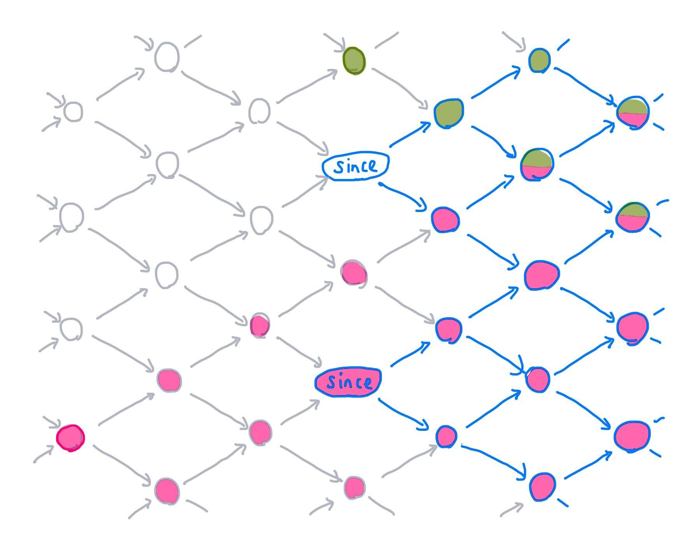

# Materialize Formalism

Materialize is a system that maintains views over changing data.

At Materialize's heart are *time-varying collections* (TVCs).
These are multisets of typed *data* whose contents may vary arbitrarily as function of some ordered *time*.
Materialize records, transforms, and presents the contents of time varying collections.

Materialize's primary function is to provide the contents of time-varying collection at specific times with absolute certainty.

This document details the **intended behavior** of the system.
It does not intend to describe the **current behavior** of the system.
Various liberties are taken in the names of commands and types, in the interest of simplicity.
Not all commands here may be found in the implementation, nor all implementation commands found here.

You may wish to consult the
[VLDB](https://vldb.org/pvldb/vol13/p1793-mcsherry.pdf) and
[CIDR](https://github.com/TimelyDataflow/differential-dataflow/blob/master/differentialdataflow.pdf)
papers on differential dataflow, as well as the [DD
library](https://github.com/TimelyDataflow/differential-dataflow).

# In a nutshell

A *time-varying collections* (TVC) is a map of partially ordered *times* to
*collection versions*, where each collection version is a multiset of typed
*pieces of data*. Because the past and future of a TVC may be unknown,
Materialize represents a TVC as a *partial TVC* (pTVC), which is an accurate
representation of a TVC during a range of times bounded by two *frontiers*: a
lower frontier `since`, and an upper frontier `upper`.

To avoid storing and processing the entire collection version for every single
time, Materialize uses sets of *updates* as a differential representation of a
pTVC. These updates are triples of `[data, time, diff]`: the piece of data
being changed, the time of the change, and the change in multiplicity of that
data. Materialize can *compact* a pTVC by merging updates from the past, and
*append* new updates to a pTVC as they arrive. Compaction advances the `since`
frontier of the pTVC, and appending advances the `upper` frontier. Both compact
and append preserve correctness: these differential representations of a pTVC
are faithful to the "real" TVC between `since` and `upper`.

Materialize identifies each TVC by a unique `GlobalId`, and maintains a mutable map of `GlobalId`s to the current pTVC representing that `GlobalID`'s TVC.

Internally, Materialize is separated into three layers: *storage*, *compute*, and *adapter*.
The storage layer records updates from (e.g.) external data sources. The
compute layer provides materialized views: new TVCs which are derived from
other TVCs in some way. The ability to write and read to these layers is given
by a first-class *capability* object, which constrains when pTVCs can be
compacted and appended to.

Users issue SQL queries to Materialize, but the storage and compute layers are
defined in terms of low-level operations on update triples. The *adapter*
translates these SQL queries into low-level commands. Since SQL does not
(generally) include an explicit model of time, the adapter picks timestamps for
SQL statements using a stateful *timeline* object. To map table names to
`GlobalIds` and capabilities, Materialize maintains a *source* mapping. SQL
indices are maintained by the compute layer.

Finally: Materialize's adapter supports SQL transactions.

# In depth

## Data

The term *piece of data*, in this document, means a single, opaque piece of
arbitrary typed data. For example, one might use a piece of data to represent a
single row in an SQL database, or a single key-value pair in a key-value store.

In this document, we often denote a piece of data as `data`. However, we want
to emphasize that as far as updates are concerned, each piece of data is an
opaque, atomic object rather than a composite type. When we describe an update
to a row, that data includes the entire new row, not just the columns inside it
which changed.

We say "piece of data" instead of "datum" because "datum" has a different
meaning in Materialize's internals: it refers to a cell within a row. In the
CIDR differential dataflow paper, a piece of data is called a "record".

## Times

A *Timeline* is a unique ID (for disambiguating e.g. two sets of integers), a
set of *Materialize times* `T`, together with a *meet* (greatest lower bound)
and *join* (least upper bound), which together form a [lattice](https://en.wikipedia.org/wiki/Lattice_(order)).

```
meet(t1, t2) => t3
join(t1, t2) => t3
```

As with all lattices, both `meet` and `join` must be associative, commutative, and idempotent.

A *time* is an element of `T`. We define a partial order `<=t` over times in
the usual way for join semilattices: for any two times `t1` and `t2` in `T`,
`t1 <=t t2` iff `join(t1, t2) = t2`. We also define a strict partial order over
times `<t`, such that `t1 < t2` iff `t1 <= t2` and `t1 != t2`.

Each `T` contains a minimal time `t0` such that `t0 <=t t` for all `t` in `T`.
Each timeline is therefore [well-founded](https://en.wikipedia.org/wiki/Well-founded_relation).

As a concrete example, we might choose `T` to be the naturals, with `max` as
our join and `t0 = 0`. The usual senses of `<=` and `<` then serve as
`<=t` and `<t`, respectively.

A *frontier* is an antichain of times in `T`: a set where no two times are
comparable via `<=t`. We use frontiers to specify a lower (or upper) bound on
times in `T`. We say that a time `t` *is later than* or *after* a frontier `F`
iff there exists some `f` in `F` such that `f <t t`. We write this `F <t t`.
Similarly we can speak of a time `t` which is later than or equal to `F`, by
which we mean there exists some `f` in `F` such that `f <=t t`: we write this
`F <=t t`.

For integers, a frontier could be the singleton set `F = {5}`; the set of times
after `F` are `{6, 7, 8, ...}`.

The latest frontier is the empty set `{}`. No time is later than `{}`.

A *stateful timeline* is a *timeline* and a *frontier* of the latest times of
all completed events within the timeline.

Throughout this document, "time" generally refers to a Materialize time in some
timeline. We say "wall-clock time" to describe time in the real world. Times
from external systems may be
[reclocked](https://github.com/MaterializeInc/materialize/blob/main/doc/developer/design/20210714_reclocking.md)
into Materialize times.

## Collection Versions

A *collection version* is a [multiset](https://en.wikipedia.org/wiki/Multiset) with (potentially) [negative multiplicitie](http://www.futuresoft.yolasite.com/resources/Petri%20net-%20W.%20Reisig%20Book.pdf)
of data which are all of the same type. Collection versions represent the state
of a collection at a single instant in time. For example, a collection version
could store the state of a relation (e.g. table) in SQL, or the state of a
collection/bucket/keyspace in a key-value store.

The *multiplicity* (or *frequency*) of a piece of data in some collection
version `c` is, informally speaking, the number of times it appears in `c`. We
write this as `multiplicity(c, data)`. We can encode a collection version as a
map of `{data => multiplicity}`.

Multiplicities may be negative: partially ordered delivery of updates to
collection versions requires commutativity. However, users generally don't see
collection versions with negative multiplicities.

The *empty* collection version `cv0` is an empty multiset.

## Time-varying collections

A *time-varying collection* (TVC) represents the entire history of a collection
which changes over time. At any time, it has an effective value: a collection
version. Each TVC is associated with a single timeline, which governs which
times it contains, and how those times relate to one another. Whenever we
discuss a Materailize time in the context of a TVC, we mean a time in that
TVC's timeline.

We model a TVC as a pair of `[timeline, collection-versions]`, where
`collection-versions` is a function which maps a time to a single collection
version, for all times in `timeline`.

A *read* of a TVC `tvc` at time `t` means the collection version stored in
`tvc` for `t`. We write this as `read(tvc, t) => collection-version`.

## Partial time-varying collections

At any wall-clock time a TVC is (in general) unknowable. Some of its past
changes have been forgotten or were never recorded, some information has yet to
arrive, and its future is unwritten. A *partial time-varying collection* (pTVC)
is a partial representation of a corresponding TVC which is accurate for some
range of times. We model this as a timeline, a function of times to collection
versions, and two frontiers: *since* and *upper*: `ptvc = [timeline,
collection-versions, since, upper]`.

Informally, the `since` frontier tells us which versions have been lost to the
past, and the `upper` frontier tells us which versions have yet to be learned.
At times between `since` and `upper`, a pTVC should be identical to its
corresponding TVC.


We think of `since` as the "read frontier": times not later than or equal to
`since` cannot be correctly read. We think of `upper` as the "write frontier":
times later than or equal to `upper` may still be written to the TVC.

A *read* of a pTVC `ptvc` at time `t` is the collection version in `ptvc` which
corresponds to `t`. We write this as `read(ptvc, t) => collection-version`.

We say that a read from a pTVC is *correct* when it is exactly the same
collection version as would be read from the pTVC's corresponding TVC:
`read(ptvc, t) = read(tvc, t)`.

All pTVCs ensure an important correctness invariant. Consider a pTVC `ptvc`
corresponding to some TVC `tvc`, and with `since` and `upper` frontiers. For
all times `t` such that `t` is later than or equal to `since`, and `t` is *not*
later than or equal to `upper`, reads of `ptvc` at `t` are correct: `read(ptvc,
t) = read(tvc, t)`. In the context of a pTVC, we say that such a time `t`
is *between* `since` and `upper`.


In this diagram, times are shown as a two-dimensional lattice forming a partial
order; time generally flows left to right, and the precise order is shown by
arrows. The `since` frontier is formed by two times labeled "since"; the
`upper` frontier is formed by two times labeled "upper". Times later than
`upper` are drawn in orange: these times are in the unknown future of the pTVC.
Times not later than or equal to `since` are drawn in gray: these times are in
the forgotten past. Only times in blue--those between `since` and `upper`--can
be correctly read.

## Update-set representations of TVCs and pTVCs

Because the set of times is in general very large, and because TVCs usually
change incrementally, it is usually more efficient to represent a TVC as a set
of *updates* which encode changes between collection versions. An *update* is a
triple `[data, time, diff]`. The `data` specifies what element of the
collection version is changing, the `time` gives the time the change took
place, and the `diff` is the change in multiplicity for that element.

Given a collection version `cv1` and an update `u = [data, time, diff]`, we can
*apply* `u` to `cv1` to produce a new collection version `cv2`: `apply(cv1, u)
=> cv2`. `cv2` is exactly `cv1`, but with `multiplicity(cv2, data) =
multiplicity(cv1, data) + diff`.

We can also apply a countable set of updates to a collection version by
applying each update in turn. We write this `apply(collection, updates)`. Since
`apply` is commutative, the order does not matter. In practice, these are
computers: all sets are countable. (If you're wondering about uncountable sets,
the [Möbius
inversion](https://en.wikipedia.org/wiki/M%C3%B6bius_inversion_formula) might
be helpful.)

Given a time `t` and two collection versions `cv1` and `cv2`, we can find their
*difference*: a minimal set of updates which, when applied to `cv1`, yields
`cv2`.

```
diff(t, cv1, cv2) = { u = [data, t, diff] |
                      (data in cv1 or data in cv2) and
                      (diff = multiplicity(cv2, data) - multiplicity(cv1, data)) and
                      (diff != 0)
                    }
```

### Isomorphism between update and time-function representations

Imagine we have a TVC represented as a set of updates, and wish to read the
collection version at time `t`. We can do this by applying all updates which
occurred before or at `t` to the empty collection version. This lets us go from
an update-set representation to a time-function representation.

```
read(updates, t) =
  apply(cv0, { u = [data, time, diff] | u in updates and time <=t t })
```

Similarly, given a time-function representation `tvc`, we can obtain an
update-set representation by considering each point in time and finding the
difference between the version at that time and the sum of all updates from
all prior times. If we take Materialize times as the natural numbers, this is
simple: the update set for a given time `t` is simply the difference between
the version at `t-1` and the version at `t`.

```
updates(tvc, t) = diff(t, read(tvc, t - 1), read(tvc, t))
```

In general times may be partially ordered, which means there might be
*multiple* prior times; there is no single diff. Instead, we must sum the
updates from all prior times, and diff that sum with the collection version at
`t`:

```
updates(tvc, t) = diff(t,
                       apply(cv0, prior-updates(tvc, t)),
                       read(tvc, t))
```

The updates prior to `t` are simply the union of the updates for all times
prior to `t`:

```
prior-updates(tvc, t) = ⋃ updates(tvc, prior-t) for all prior-t <t t
```

These mutually-recursive relations bottom out in the initial time `t0`, and the
corresponding initial collection version `read(tvc, t0)`:

```
prior-updates(tvc, t0) = diff(t0, cv0, read(tvc, t0))
```

Using these definitions, we can inductively transform an entire time-function
representation `tvc` into a set of updates for all times by taking the union
over all times:

```
updates(tvc) = ⋃ updates(tvc, t) for all t in T
```

### Update representation of pTVCs

We have argued that the time-function and update-set representations of a TVC
are equivalent. Similarly, we can also represent a pTVC as a timeline, a set of
updates, and the `since` and `upper` frontiers: `ptvc = [timeline, updates,
since, upper]`. To convert between time-function and update-set representations
of pTVCs, we use the same definitions we gave for TVCs above. This gives the
following four-fold structure:


Materialize's goal is to physically store only the update-set representation of
a pTVC, and for that pTVC to be an accurate view into the time-function and
update-set representations of the corresponding TVC. To do this, we need to
ensure each update-set pTVC maintains the correctness invariant: `read(ptvc, t)
= read(tvc, t)` so long as `t` is at least `since` and not later than `upper`.

First, consider the empty pTVC `ptvc0 = [timeline, {}, {t0}, {t0}]`. `ptvc0` is
trivially correct since there are no times not later than than the upper
frontier `{t0}`.

Next we consider two ways a pTVC could evolve, and wave our hands frantically
while claiming that each evolution preserves correctness. This is not an
exhaustive proof--we do not discuss, for example, the question of a pTVC
which contains incorrect updates later than its upper frontier. However, this
sketch should give a rough feeling for how and why Materialize works.

### pTVC append

Let `ptvc = [timeline, ptvc-updates, since, upper]` be a correct view of some
TVC's updates `tvc_updates`. Now consider appending a window of new updates to
this pTVC, and advancing `upper` to `upper'`: `ptvc' = append(ptvc, upper',
new-updates)`.

Which new updates do we need to add? Precisely those whose times are equal to
or later than `upper`, and also *not* equal to or later than `upper'`.

```
ptvc' = [timeline,
         ptvc-updates ⋃ { u = [data, time, diff] in tvc_updates |
                          (upper <=t time) and not ( upper' <=t time)}
         since,
         upper']
```

Is `ptvc'` correct? Because `since` is unchanged and its updates between
`since` and `upper` are unchanged, it must still be correct for any `t` between
`since` and `upper`. And since it now includes every TVC update between `upper`
and `upper'`, it must also be correct for those times as well: their
`prior-updates` are identical, by induction to times which were correct in the
original `ptvc`. `ptvc'` is therefore correct for all times between `since` and
`upper'`.

This allows us to advance the upper frontier of a pTVC by appending new updates
to it (so long as we have every update between `upper` and `upper'`) and still
preserve correctness.

### pTVC compaction

Again, let `ptvc = [timeline, ptvc-updates, since, upper]` be a correct view of
some TVC. Now consider compacting all updates prior to some frontier `since'`,
in such a way that the collection versions read at times later than or equal to
`since'` remain unchanged, to preserve correctness. We write this `ptvc' =
compact(ptvc, since')`:

```
updates' = compact(updates, since')
ptvc' = [timeline, updates', since', upper]
```

Which updates can we compact, and which other updates do we compact them
*with*? Consider this lattice of times flowing left to right, with two times in
its `since` frontier. The set of all times at or after `since` is drawn in
blue. We have also chosen two updates: one outlined in green at the top of the
illustration, and one outlined in pink at the bottom left. The times which
descend from those updates are filled with green or pink, respectively.



Now consider that each of these updates affects some times which are *not* at
or after the `since` frontier. Since pTVC correctness does not require us to be
able to read these times, we are free to "slide" each update around in any way
that preserves the intersection of the update's downstream effects with the
`since` region.


When sliding an update to a new time, which time is optimal? By "optimal", we
mean the time which minimizes the number of downstream times which are *not* at
or after `since`--in essence, how close can we slide an update at time `t` to
the frontier `since` while preserving correctness? As [Appendix A of the K-Pg
SIGMOD
paper](https://github.com/TimelyDataflow/differential-dataflow/blob/master/sigmod2019-submission.pdf)
shows, the answer is:

```
t' = meet (for all s in since) join(t, s)
```


Given our two `since` frontier times of `s1` and `s2`, we found the optimal
time for the pink update at `p` by finding the first time where pink's effects
intersected times at or after `s1`: `join(p, s1)`; and did the same for s2.
Then we projected backwards to the `meet` of those two times:

```
p' = meet(join(p, s1), join(p, s2))
```

Since `join(t, s1) = t` whenever `t` is at or after `s1`, this sliding process
leaves any updates at or after `since` unchanged.

This transform allows us to slide updates forward from past times to new times,
which reduces the number of distinct times in the updates set, but does not
reduce the set's cardinality. However, we can take advantage of a second
property for updates: given two updates `u1` and `u2` with the same `data` and
`time`, and diffs `diff1` and `diff2` respectively, and any collection version
`c`,

```
apply(c, {u1, u2}) = apply(c, [data, time, diff1 + diff2])
```

This allows us to fold updates to the same data together after sliding updates
forward to the same time. Where `diff1 + diff2 = 0`, we can discard `u1` and
`u2` altogether.

In summary: `compact(ptvc, since')` advances `ptvc`'s `since` to `since'`,
slides some of `ptvc`'s updates forward to new times (when doing so would not
affect the computes states at or after `since`), and merges some those updates
together by summing `diff`s for the same `data` and `time`. The resulting pTVC
preserves correctness and likely requires fewer updates to store.

### Time evolution of pTVCs

Materialize's goal is to keep track of a window of each relevant TVC over time.
At any given moment a TVC is represented by a single `ptvc = [updates, since,
upper]` triple. Each TVC begins with the empty `ptvc0`, which is a correct
representation of every TVC. As new information about the TVC becomes
available, Materialize appends those updates using `append(ptvc, upper',
new-updates)`. To reclaim storage space, Materialize compacts ptvcs using
`compact(ptvc, since')`. Since both `append` and `compact` preserve pTVC
correctness, Materialize always allows us to query a range of times (those
between the current `since` and `upper`), and obtain the same results as would
be observed in the "real" TVC.

During this process the `since` and `upper` frontiers never move
backwards---and typically, they advance.

## GlobalIds

A *GlobalId* is a globally unique identifier used in Materialize. One of the
things Materialize can identify with a GlobalId is a TVC. Every GlobalId
corresponds to at most one TVC. This invariant holds over all wall-clock time:
GlobalIds are never re-bound to different TVCs.

There is no complete in-memory representation of a TVC in Materialize: such a
thing would require perfect knowledge of the collection's versions over all
time. Instead, we use GlobalIds to refer to TVCs.

## The TVC Map

To track changing pTVCs over time, Materialize maintains a mutable *TVC
map*. The keys in this map are `GlobalId`s, and the values are pTVCs. Each
`GlobalId` in the TVC map identifies a single logical TVC, and the pTVC that ID
refers to at any point in wall-clock time corresponds to that TVC. In short,
the TVC map allows one to ask "What is the current pTVC view of the TVC
identified by `GlobalId` `gid`?

The life cycle of each `GlobalId` follows several steps:

0. The `GlobalId` is initially not yet bound.

    In this state, the `GlobalId` cannot be used in queries, as we do not yet know what its initial `since` will be.

1. The `GlobalId` is bound to some definition with an initially equal `since`
   and `upper` (e.g. `ptvc0`).

    The partial TVC can now be used in queries, those reading from `since` onward, though results may not be immediately available.
    The collection is initially not useful, as it will not be able to immediately respond about any time greater or equal to `since` but not greater or equal to `upper`.
    However, the initial value of `since` indicates that one should expect the data to eventually become available for each time greater or equal to `since`.

2. Repeatedly, either of the these two steps occur:

    a. The `upper` frontier advances, revealing more of the future of the pTVC.

    b. The `since` frontier advances, concealing some of the past of the pTVC.

3. Eventually, the `upper` frontier advances to the empty set of times, rendering the TVC unwriteable.

3. Eventually, the `since` frontier advances to the empty set of times, rendering the TVC unreadable.

The `GlobalId` is never reused.

# Architecture

We've sketched a formal model for how to represent time-varying collections as
update-set pTVCs, and how we keep track of the current state of those pTVCs
while appending new records to and compacting old records within them. We next
discuss where and how in Materialize these pTVCs are stored, where updates
come from, and how users query them.


Updates flow into Materialize from external systems like Postgres and Kafka.
They arrive first at the *storage* subsystem, which stores raw update triples
for pTVCs. From there, they percolate through the *compute* subsystem, which
uses differential dataflow to maintain materialized views. Each of these
views is *also* a pTVC. Storage and compute cooperate to ensure pTVC
correctness always holds.

Users query Materialize using SQL. That SQL is interpreted by an *adapter*,
which transforms SQL queries into updates, reads, or creation of specific TVCs at specific
times. Those times (where not explicitly specified) are chosen by a *timestamp
oracle*. The adapter sends writes to storage, and reads values from compute.

# Storage and Compute

Materialize produces and maintains bindings of `GlobalId`s to time-varying collections in two distinct ways:

*   The **Storage** layer records explicit TVCs in response to direct instruction (e.g. user DML), integrations with external sources of data, and feedback from Materialize itself.
    The representation in the Storage layer is as explicit update triples and maintained `since` and `upper` frontiers.
    The primary property of the Storage layer is that, even across failures, it is able to reproduce all updates for times that lie between `since` and `upper` frontiers that it has advertised.

*   The  **Compute** layer uses a view definition to transform (possibly
    multiple) input TVCs into a new output TVC. The output TVC varies *exactly*
    with the input TVCs: For each `time`, the output collection at `time`
    equals the view applied to the input collections at `time`. We call this
    process of maintaining an output TVC that varies with input TVCs a
    *dataflow*.

The Storage and Compute layers both manage the `since` and `upper` frontiers for the `GlobalId`s they manage.
For both layers, the `since` frontier is controlled by their users and it does not advance unless it is allowed.
The `upper` frontier in Storage is advanced when it has sealed a frontier and made the data up to that point durable.
The `upper` frontier in Compute is advanced when its inputs have advanced and its computation has pushed updates fully through the view definitions.

## Capabilities

The `since` and `upper` frontiers are allowed to advance through the use of
"capabilities". Layers keep track of the capabilities they've issued, and use
those capabilities to determine when frontiers may advance. Each capability
names a `GlobalId` and a frontier.

* `ReadCapability(id, frontier)` prevents the `since` frontier associated with `id` from advancing beyond `frontier`.
* `WriteCapability(id, frontier)` prevents the `upper` frontier associated with `id` from advancing beyond `frontier`.

A capability presents the `id` and `frontier` values, but is identified by a system-assigned unique identifier.
Any user presenting this identifier has the associated capability to read from or write to the associated pTVC.
Actions which read or write will validate the capability (e.g. in case a lease has expired) and may return errors if the capability is not valid as stated.

Capabilities are durable, and their state is tracked by the system who associates a unique identifier with each.
Capabilities can be cloned and transfered to others, providing the same rights (and responsibilities).
Capabilities can be downgraded to frontiers that are greater or equal to the held frontier, which may then allow the `since` or `upper` frontier to advance.
Capabilities can be dropped, which releases the constraint on the frontier, and the whichever ability (read or write) the capability provided.
These actions are mediated by the system, and take effect only when the system confirms the action.
Users can defer and batch these actions, modulo lease timeouts, imposing only on the freshness and efficiency of the system.

Capabilities may expire, as a lease, which may result in errors from attempts to exercise the capability.

It is very common for users to immediately drop capabilities if they do not require the ability.
The write capability for most TVCs is dropped immediately (by the system) unless it is meant to be written to by users (e.g. a `TABLE`).
The read capability may be dropped immediately if the user does not presently need to read the data.
Capabilities may be recovered by the best-effort command `AcquireCapabilities(id)` to be discussed.

## Storage

The Storage layer presents a narrow API about which it makes guarantees.
It likely has a more verbose diagnostic API that describes its state, which should be a view over the results of these commands.

*   `Create(id, description) -> (ReadCapability, WriteCapability)`: binds to `id` the TVC described by `description`.

    The command returns capabilities naming `id`, with frontiers set to initial values chosen by the Storage layer.

    The collection associated with `id` is based on `description`, but it is up to the Storage layer to determine what the source's contents will be.
    A standarad example is a Kafka topic, whose contents are "added" to the underlying collection as they are observed.
    The Storage layer only needs to ensure that it can reliably produce the updates between `since` and `upper`, and otherwise the nature of the content is up for discussion.
    It is an error to re-use a previously used `id`.

*   `SubscribeAt(ReadCapability(id, frontier))`: returns a snapshot of `id` at `frontier`, followed by an ongoing stream of subsequent updates.

    This command returns the contents of `id` as of `frontier` once they are known, and updates thereafter once they are known.
    The snapshot and stream contain in-line statements of the subscription's `upper` frontier: those times for which updates may still arrive.
    The subscription will produce exactly correct results: the snapshot is the TVCs contents at `frontier`, and all subsequent updates occur at exactly their indicated time.
    This call may block, or not be promptly responded to, if `frontier` is greater or equal to the current `upper` of `id`.
    The subscription can be canceled by either endpoint, and the recipient should only downgrade their read capability when they are certain they have all data through the frontier they would downgrade to.

    A subscription can be constructed with additional arguments that change how the data is returned to the user.
    For example, the user may ask to not receive the initial snapshot, rather that receive and then discard it.
    For example, the user may provide filtering and projection that can be applied before the data are transmitted.

*   `CloneCapability(Capability) -> Capability'`: creates an
    independent copy of the given capability, with the same `id` and
    `frontier`.

*   `DowngradeCapability(Capability, frontier')`: downgrades the given capability to `frontier'`, leaving its `id` unchanged.

    Every time in the new `frontier'` must be greater than or equal to the
    current `frontier`.

*   `DropCapability(Capability)`: downgrades a capability to the final frontier
    `{}`, rendering it useless.

*   `Append(WriteCapability(id, frontier), updates, new_frontier)`: applies `updates` to `id` and downgrades `frontier` to `new_frontier`.

    All times in `updates` must be greater or equal to `frontier` and not greater or equal to `new_frontier`.

    It is probably an error to call this with `new_frontier` equal to `frontier`, as it would mean `updates` must be empty.
    This is the analog of the `INSERT` statement, though `updates` are signed and general enough to support `DELETE` and `UPDATE` at the same time.

*   `AcquireCapabilities(id) -> (ReadCapability, WriteCapability)`: provides capabilities for `id` at its current `since` and `upper` frontiers.

    This method is a best-effort attempt to regain control of the frontiers of a collection.
    Its most common uses are to recover capabilities that have expired (leases) or to attempt to read a TVC that one did not create (or otherwise receive capabilities for).
    If the frontiers have been fully released by all other parties, this call may result in capabilities with empty frontiers (which are useless).

The Storage layer provides its output through `SubscribeAt` and `AcquireCapabilities`, which reveal the contents and frontiers of the TVC.
All commands are durable upon the return of the invocation.

## Compute

The Compute layer presents one additional API command.
The layer also intercepts commands for identifiers it introduces.

*   `MaintainView([ReadCapabilities], view, [WriteCapabilities]) -> [ReadCapabilities]`: installs a view maintenance computation described by `view`.

    Each view is described by a set of input read capabilities, identifying collections and a common frontier.
    The `view` itself describes a computation that produces a number of outputs collections.
    Optional write capabilities allow the maintained view to be written back to Storage.
    The method returns read capabilities for each of its outputs.

    The Compute layer retains the read capabilities it has been offered, and only downgrades them as it is certain they are not needed.
    For example, the Compute layer will not downgrade its input read capabalities past the `since` of its outputs.

The outputs of a dataflow may or may not make their way to durable TVCs in the Storage layer.
All commands are durable upon return of the invocation.

### Constraints

A view introduces *constraints* on the capabilities and frontiers of its input and output identifiers.

*   The view holds a write capability for each output that does not advance beyond the input write capabilities.

    This prevents the output from announcing it is complete through times for which the input may still change.
    The output write capabilities are advanced through timely dataflow, which tracks outstanding work and can confirm completeness.

*   The view holds a read capability for each input that does not advance beyond the output read capabilities.

    This prevents the compaction of inputs updates into a state that prevents recovery of the outputs.
    Outputs may need to be recovered in the case of failure, but also in other less dramatic query migration scenarios.

These constraints are effected using the capability abstractions.
The Compute layer acquires and maintains read capabilities for collections managed by it, and by the Storage layer.

# Adapter

The adapter layer translates SQL statements into commands for the Storage and Compute layers.

The most significant differences between SQL statements and commands to the Storage and Compute layers are:
1.  The absence of explicit timestamps in SQL statements.

    A `SELECT` statement does not indicate *when* it should be run, or against which version of its input data.
    The Adapter layer introduces timestamps to these commands, in a way that provides the appearance of sequential execution.

2.  The use of user-defined and reused names in SQL statements rather than `GlobalId` identifiers.

    SQL statements reference user-assigned names that may be rebound over time.
    The meaning, and even the validity, of a query depends on the current association of user-defined name to `GlobalId`.
    The Adapter layer maintains a map from user-assigned names to `GlobalId` identifiers, and introduces new ones as appropriate.

Generally, SQL is "more ambiguous" than the Storage and Compute layers, and the Adapter layer must resolve that ambiguity.

The SQL commands are a mix of DDL (data definition language) and DML (data manipulation language).
In Materialize today, the DML commands are timestamped, and the DDL commands are largely not (although their creation of `GlobalId` identifiers is essentially sequential).
That DDL commands are not timestamped in the same sense as a pTVC is a known potential source of apparent consistency issues.
While it may be beneficial to think of Adapter's state as a pTVC, changes to its state are not meant to cascade through established views definitions.

Commands acknowledged by the Adapter layer to a user are durably recorded in a total order.
Any user can rely on all future behavior of the system reflecting any acknowledged command.

## Timestamp Oracle

The adapter assigns timestamps to DML commands using a *timestamp oracle*.
The timestamp oracle is a stateful, linearizable object which (at a high gloss) provides a simple API:

```
AssignTimestamp(command) -> timestamp
```

Since the timestamp oracle is linearizable, all calls to AssignTimestamp appear
to take place in a total order at some point between the invocation and
completion of the call to `AssignTimestamp`. Along the linearization order, returned timestamps satisfy several laws:

1. The timestamps never decrease.
2. The timestamps of INSERT/UPDATE/DELETE statements are strictly greater than those of preceding SELECT statements.
3. The timestamps of SELECT statements are greater than or equal to the read capabilities of their input collections.
4. The timestamps of INSERT/UPDATE/DELETE statements are greater than or equal to the write capabilities of their target collection.

The timestamps from the timestamp oracle do not need to strictly increase, and
any events that have the same timestamp are *concurrent*. Concurrent events (at
the same timestamp) first modify collections and then read collections. All
writes at a timestamp are visible to all reads at the same timestamp.

Some DML operations, like UPDATE and DELETE, require a read-write transaction which prevents other writes from intervening.
In these and other non-trivial cases, we rely on the total order of timestamps to provide the apparent total order of system execution.

---

Several commands support an optional `AS OF <time>` clause, which instructs the
Adapter to use a specific query `time`, if valid. If this clause is present,
the adapter will not ask the timestamp oracle for a timestamp. The command will
observe all writes up through `time` (if it reads) and be visible by all reads
from `time` onward (if it writes).

---

## Sources

Materialize supports a `CREATE SOURCE` command that binds to a user-specified name a `GlobalId` produced by the Storage layer in response to a `Create` command.
A created source has an initial read capability and write capability, which may not be at the beginning of time.
Two sources created with the same arguments are not guaranteed to have the same contents at the same time (said differently: Materialize uses *nominal* rather than *structural* equivalence for sources).

Sources remain active until a `DROP SOURCE` command is received, at which point the Adapter layer drops its read capability.

One common specialization of source is the "table".
The `CREATE TABLE` command introduces a new source that is not automatically populated by an external source, and is instead populated by `Append` commands.
The Adapter layer may use a write-ahead log to durably coalesce multiple writes at the same timestamp, as the `Append` command does not otherwise allow this.
The `DROP TABLE` command drops both the read and write capabilities for the source.

## Indexes

Materialize supports a `CREATE INDEX` command that results in a dataflow that computes and maintains the contents of the index's subject, in indexed representation.
The `CREATE INDEX` command can be applied to any collection whose definition avoids certain non-deterministic functions (e.g. `now()`, `rand()`, environment variables).

Materialize's main feature is that for any indexable view, one receives identical results whether re-evaluating the view from scratch or reading it from a created index.

The `CREATE INDEX` command results in a `MaintainView` command for the Compute layer.
The inputs to that command are `GlobalId` identifiers naming Storage or Compute collections.
The command is issued with read capabilities all advanced to a common frontier (often: the maximum frontier of read capabilities in the input).
The command returns a read capability for the indexed collection, which the Adapter layer maintains and perhaps regularly downgrades, as is its wont.
The dataflow remains active until a corresponding `DROP INDEX` command is received by the Adapter layer, which discards its read capability for the indexed collection.

## Transactions

The Adapter layer provides interactive transactions through the `BEGIN`, `COMMIT`, and `ROLLBACK` commands.
There are various restrictions on these transactions, primarily because the Storage and Compute layers require you to durably write before you can read from them.
This makes write-then-read transactions challenging to perform efficiently, and they are not currently supported.
Read-only transactions are implemented by performing all reads at a single timestamp.
Write-only transactions are implemented by buffering all writes and then applying them during commit at a single timestamp.
Read-then-write transactions are implemented by performing all reads at some timestamp greater than or equal to all previous timestamps and then writing at a strictly later timestamp.
Read-then-write transactions are implemented by performing all reads at some timestamp greater than or equal to all previous timestamps and then writing at a strictly later timestamp.
Read-then-write transactions are only considered valid and applied if there are no updates to the query inputs at a time greater than the read timestamp and not greater than the write timestamp.
Read-then-write transactions are ordered using the write timestamp in the total order of all transactions.

It is possible that multiple read-then-write transactions on disjoint collections could be made concurrent, but the technical requirements are open at the moment.

Read-after-write, and general transactions are technically possible using advanced timestamps that allow for Adapter-private further resolution.
All MZ collections support compensating update actions, and one can tentatively deploy updates and eventually potentially retract them, as long as others are unable to observe violations of atomicity.
Further detail available upon request.

It is critical that Adapter not deploy `Append` commands to Storage and Compute until a transaction has committed.
These lower layers should provide similar "transactional" interfaces that validate tentative commands and ensure they can be committed without errors.

## Compaction

As Materialize runs, the Adapter may see fit to "allow compaction" of collections Materialize maintains.
It does so by downgrading its held read capabilities for the collection (identifier by `GlobalId`).
Downgraded capabilities restrict the ability of Adapter to form commands to Storage and Compute, and may force the timestamp oracle's timestamps forward or delay a query response.
