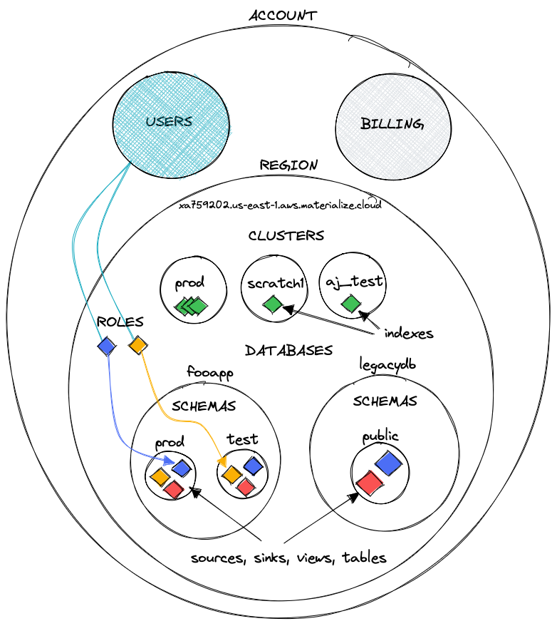
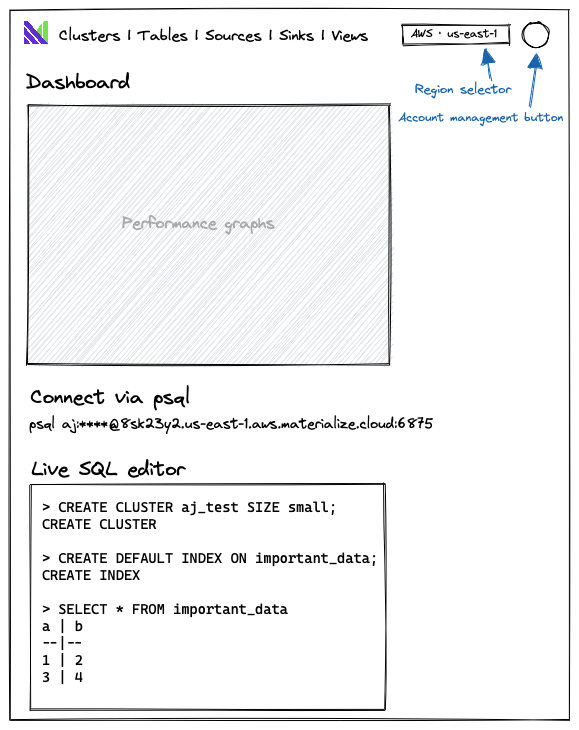

# Materialize Platform: User Experience

## How to read this document

⚠️ **WARNING!** ⚠️ This document is a work in progress! While the underlying
architecture is firm, the particular mapping from architecture to user-facing
concepts described in this document is still up for debate.

This document is a proposal for how we expose the
[architecture](architecture-db.md) of Materialize Platform to users. The
intended user experience drives some of the concepts that we'll want to reflect
in our code. The intended user experience in turn reflects the practical
realities of the tools we have access to.

Terms in this document that represent key user-facing concepts are introduced
with *italics*. The underlying components may use different terminology
internally, but any user-facing interfaces should use the term specified in this
document. For example, the COMPUTE layer is free to use the term COMPUTE
INSTANCE internally, but the user-facing documentation, web UI, and SQL API
should all consistently use the term *cluster*.

## Overview

Depicted below are the tangible concepts that Materialize Platform exposes to
users.



An [*account*](#account) represents a customer of Materialize Platform. An
account has [*users*](#user) and manages [*billing*](#billing).

A [*region*](#region) is a specific region of a specific cloud provider (e.g.,
aws:us-east-1). The region boundary is strong: besides users and billing,
nothing is shared between regions in the same account.

A [*cluster*](#cluster) is the user-facing name for a [COMPUTE
INSTANCE](architecture-db.md#COMPUTE). A region can contain any number of
clusters. A cluster may be replicated for fault tolerance; each redundant copy
is called a [*cluster replica*](#cluster-replica).

A region contains a standard SQL catalog, which contains
[*databases*](#database), which each contain [*schemas*](#schema), which each
contain *database objects*. A database object is one of the following:

  * a [*source*](#source), which imports data into the region;
  * a [*sink*](#sink), which exports data out of the region;
  * a [*table*](#table), which stores data directly in the region;
  * a [*view*](#view), which describes a transformation of sources, tables, and
    other views;
  * an [*index*](#index), which schedules the persistent computation of a source
    or view in a cluster;
  * a [*secret*](#secret), which securely stores credentials for external
    systems.

Note that sources, tables, views, and secrets are shared across all clusters in
the region, while indexes are only shared within a cluster.

A [*timeline*](#timeline) represents a collection of sources (and views derived
from those sources) that are in the same time domain. Timelines live somewhere
within a region, but we are not yet sure where.

A user's access to a region is regulated by [*roles*](#role). A role is unique
to a region and defines what users are allowed to assume the role and which
database objects are readable and writable.

Each region contains a single [STORAGE INSTANCE](architecture-db.md#STORAGE).
Users are not directly aware of this storage instance, but any persistent state
in the region (e.g., table data) is managed by the regions's storage instance.

These concepts are described in more detail in the [User-facing
concepts](#user-facing-concepts) section below.

## User interfaces

### Web UI

We will evolve the existing Materialize Cloud web UI
(<https://cloud.materialize.com>) to reflect the new hierarchy of concepts. The
following wireframe is a very rough sketch of what the Materialize Platform
UI could look like:



The key differences are:

  * The only state that is global to the account is accessed via the account
    management button. All other state is scoped to the region selected in the
    region selector.

  * The concept of a "deployment" has disappeared. The objects attached to a
    deployment have moved to various other parts of the hierarchy. For example,
    there is a single SQL endpoint for the entire region, rather than a SQL
    endpoint for each deployment.

The web UI is the only visual interface, and it is therefore particularly suited
for:

  * User onboarding. The web UI can easily guide new users through creating their
    first source and view.
  * Ongoing user education. The web UI can gently advertise new source types and
    new features.
  * Performance monitoring and debugging. The web UI can display graphs and
    other visualizations to help users diagnose problems with their Materialize
    Cloud account. For example, the [memory usage visualization] could be
    polished and integrated directly into the web UI.

While manual management of clusters, tables, sources, sinks, and views will be
possible via the web UI, we should push larger organizations to use [dbt]
instead, so that their code can be captured in Git.

### `mzcloud` CLI

We will evolve the existing [`mzcloud`] command-line interface into a seamless
SQL shell for power users.

The new tool will be a simple wrapper over `psql` that automatically handles
authentication. Here is a rough sketch of the interface:

```shell
$ mzcloud login aj@foocorp.com
Opening https://cloud.materialize.com/login/SFB33-47281 in your browser...
$ mzcloud connect aws:us-east-1
psql (14.1)
Type "help" for help.

aj@foocorp.com=# CREATE CLUSTER aj_test ...
```

The `mzcloud login` command authenticates with Materialize Cloud via the user's
browser, then stores the resulting authentication token for use by `mzcloud
connect`.

The `mzcloud connect` command discovers the regional SQL endpoint for the
specified region and drops the user into a `psql` session connected to that
endpoint.

The `mzcloud secret` command reads from stdin and installs the value as a
[secret](#secret). This can be more convenient than copy/pasting the secret
value into a `CREATE SECRET` statement, and avoids leaving a copy of the secret
in `~/.psql_history`.

```shell
$ mzcloud secret db.schema.sekret < /foo/bar
# Runs `CREATE SECRET` under the hood.
```

As with the web UI, while manual management of clusters, tables, sources, sinks,
and views will be possible via the SQL shell, we should push larger
organizations to use [dbt] instead, so that their code can be captured in Git.

### dbt

Materialize Platform will interoperate seamlessly with our existing
[dbt-materialize] adapter for [dbt].

dbt allows users to capture their source, view, and sink definitions in Git, and
handles the deployment of updates to those definitions when they change. Version
control for database schemas becomes increasingly important as an organization
scales, as allowing large numbers of users to manually edit source and view
definitions can quickly lead to chaos.

dbt may also be a key part of our story for handling schema upgrades. Imagine
that you want to change the definition of a set of materialized views without
any downtime. A sufficiently intelligent materialize-dbt adapter could create
the new views in a new cluster, wait for them to come up to date with the old
views, then atomically swap the clusters.

Materialize Platform will also offer one-click integration with dbt cloud.

### Other PostgreSQL-compatible drivers and tools

Like Materialize Cloud today, Materialize Platform will support as many
PostgreSQL-compatible tools as possible. Each tool will need to be evaluated on
a case-by-case basis, as tools often require small feature additions or bug
fixes to Materialize.

It may not be possible to support all features of a tools. In rare cases,
building a seamless integration with a tool may involve building a custom,
Materialize-native plugin for that tool.

Prioritizing which tools to support is outside the scope of this document.

### Terraform

dbt is essentially Terraform for databases. By supporting dbt, we eliminate much
of the need for Terraform.

However, while dbt has excellent support for managing views and indexes, and good
support for managing sources and sinks, it is not the ideal tool for managing
clusters, roles, databases, schemas, or secrets. So we might want to build a
Terraform provider to manage these resources types.

## APIs

### Admin API

The admin API is a REST API hosted at <https://admin.cloud.materialize.com>.
It is provided by [Frontegg], our user management provider, and handles
authentication and configuration of account security policies.

The [Frontegg API reference][frontegg-api] specifies this API.

The primary operation that this API provides is the exchange of user credentials
for a short-lived authentication token. User credentials may be a username and
password or an API key.

We don't plan to publicize or document this API, but we don't plan to hide it,
either.

### Global API

The global API is a REST API hosted at <https://cloud.materialize.com/api>. It
handles operations that apply globally to an account rather than to a single
region within an account.

To authenticate with the global API, users supply an authentication token
obtained from the admin API.

We will make the following changes to the [existing API specification][global-api-spec]:

  * Deprecate all operations on the `deployments` resource.
  * Deprecate all operations on the `mz-versions` resource.
  * Add a new API to enable a cloud-provider region for an account:

    `PUT /api/region/{cloud-provider}/{region}`

In the future, we will add billing operations to this API.

As with the admin API, we don't plan to publicize or document the global API,
but we don't plan to hide it, either.

### Region API

The user-facing API for Materialize Platform is the region API. This is the
only API that we will actively advertise to users. The intent is that users
think of the region API as **the** Materialize Platform API.

**The region API is a SQL API.** It is not a REST API. While the API will
be accessible via HTTPS, HTTPS is merely a container for a SQL payload.
This is likely to be a contentious topic. Please see [Why SQL?](#why-sql)
for justification.

This implies that the web UI will communicate with the region API by using
the SQL-over-HTTPS API.

#### Endpoint

The endpoint for the region API is a hostname of the following form:

> CUSTOMER-ID.REGION.CLOUD-PROVIDER.materialize.cloud

For example:

> x32sk13nf.us-east-1.aws.materialize.cloud

This endpoint requires TLS encryption. The server will present a TLS certificate
issued by a trusted root CA.

#### PostgreSQL server

A PostgreSQL protocol server will be accessible at port 6875. The server
processes SQL as described in [PostgreSQL Frontend/Backend Protocol][pgwire].

The PostgreSQL server will support only username/password authentication. The
username must be the email address of a [user](#user) in the account. The
password must be a valid [app-specific password](#app-specific-password) for the
user. This is notably *not* the password that the user would supply to log into
the web UI, as that password is configured to additionally require two-factor
authentication and CAPTCHA completion.

The existing Materialize Cloud support for client TLS authentication will be
removed, with no plans for restoration.

We do not currently expect to need to make any changes to the existing
PostgreSQL protocol server in `materialized`.

#### HTTPS

An HTTPS server will be accessible at port 443.

To authenticate with the HTTPS server, users supply an authentication token
obtained from the [admin API](#admin-api).

The HTTPS server exposes two APIs:

  * `POST /query` executes a batch of SQL statements.

    The request body specifies the SQL string to execute. The request may contain
    multiple SQL statements separated by semicolons. The statements are submitted
    for processing as if they were supplied via the [Simple Query][simple-query]
    flow of the PostgreSQL protocol (i.e., "the statements are executed as a
    single transaction unless explicit transaction control commands are included
    to force a different behavior").

    The response is a JSON array containing the results of each query in the
    request.

    In the future, we may expand the feature set of the HTTPS API to allow
    additional control over query execution and result fetching, a la the
    [Snowflake SQL REST API].

    TODO: fully describe the output format.

    TODO: design support for binding parameters.

  * `ws://<ENDPOINT>/query?query=QUERY` streams the result of a single query
    over the WebSockets protocol.

    This API is particularly useful for listening to the results of `TAIL`
    queries from a browser.

    TODO: fully describe the output format.

#### SQL dialect

The supported SQL dialect will be identical to the dialect of `materialized`
today, with the following changes:

  * The addition of commands to create, drop, and inspect clusters.
  * The addition of a `cluster` session variable that specifies the active
    cluster.
  * The modification of `CREATE MATERIALIZED SOURCE`, `CREATE MATERIALIZED
    VIEW`, `CREATE INDEX`, and `CREATE SINK` to associate the created index with
    the active cluster.
  * The addition of commands to create, drop, and inspect secrets.

These changes are described in more detail in the [Cluster](#cluster),
[Index](#index), and [Secret](#secret) sections below.

#### Future evolution

In the future, we might want support queries in additional languages (e.g.,
Datalog) in the region API. Any such languages would initially be supported
only as an unstable API.

We might also want to expose more direct access to the STORAGE and COMPUTE
layers. It is too early to know whether this access will be provided via
additions to the SQL dialect (e.g., `CREATE VIEW AS UNSTABLE COMPUTE PLAN
'...'`) or via a new API protocol.

## User-facing concepts

### Account

An account contains the resources of a single customer of Materialize Platform.
We do not intend to be prescriptive about what a "customer" is. For example, a
customer may be an individual, an entire organization, or a single team at an
organization.

An account provides centralized billing for all contained regions. This is
likely to be the determining factor when evaluating whether to create one
account per team or a single account for the entire organization. If an
organization wants consolidated billing across all of their teams, they should
register for a single account and use role-based access control to create
permission boundaries between teams as necessary.

An account has an attached security policy, which allows customers to configure
the following:

  * Integration with a single-sign on (SSO) provider
  * Enforcement of two-factor authentication (2FA)

An account should not have API tokens that are associated directly with the
account. All API access should be associated with a user within the account.
The existing "Workspace API tokens" feature in Frontegg should be disabled.

### User

A user is an entity that accesses Materialize Cloud. That entity may be an
actual human, or a service account for a machine.

A user is uniquely identified by an email address. A user can never change her
email address. To effectively change her email address, she must create a new
account with a new email address and delete the old account. This limitation is
not desirable but a result of a design decision in our authentication provider.
The upside is that it is safe to use an email address as a stable and unique
identifier throughout the product. (TODO: verify with Frontegg.)

A user has one password and any number of personal API tokens. A personal API
token consists of a UUID client ID and a UUID secret.

There are two special account-level roles that a user can belong to: "account
owner" and "account member." Account owners have access to the global API (i.e.,
access to billing and enabling new regions) and the ability to invite new users
to the account, while account members do not. The first user in an account is
always an account owner. Account owners are effectively superusers of the region
API, and are not subject to any [per-region roles](#role) when accessing the
region API.

### App-specific password

An *app-specific password* is an alternate encoding of a personal API token
for authenticating with the PostgreSQL protocol. Users should create an
app-specific password for each external service that will connect to Materialize
Platform via the PostgreSQL protocol.

Rationale: the PostgreSQL protocol does not have separate fields for an API
client ID and API secret key, so both values need to be packed into the password
field. Naively packing the UUIDs is unwieldy, however:

```
893677c2-a74c-4ecb-804d-3b7fa0c61fdc:68104da2-3417-442e-a614-f078dac470be
```

But since UUIDs are just 16 bytes each, we can pack them into a much shorter
base64-encoded string:

```py
>>> base64.urlsafe_b64encode(client_id.bytes + secret_key.bytes).decode().rstrip('=')
iTZ3wqdMTsuATTt_oMYf3GgQTaI0F0QuphTweNrEcL4
```

When encoded in this form, we call the value an app-specific password rather
than an API key.

In the web UI, we will need to build a custom interface for managing personal
API tokens that shows the app-specific password form alongside the client ID
and secret.

### Billing

Materialize Platform will bill monthly based on usage. Accounts will be billed
in terms of compute units, storage units, and network transfer units. A strawman
proposal: compute units are virtual machine-hours, storage units are
gigabyte-months, and network transfer units are gigabytes. Only outbound
network traffic is billed.

We expect metering the compute usage of clusters, the storage usage of sources
and tables, and outbound network traffic generated by sinks and query responses,
to be straightforward.

What is not clear is how to bill for the overhead of other system components,
like the compute usage of source ingestion. One candidate proposal is to
additionally bill per gigabyte ingested to cover the compute cost of the
ingestion.

### Region

When an account is created, it does not have any regions. The user's first step
after registering for a new account is to choose one region to activate.

Additional regions can be enabled via a "+ Enable new region" button in the
region selector or somesuch in the web UI, or via the [global API](#global-api).

To prevent disaster, regions cannot be deactivated. Users who wish to deactivate
a region can contact support.

The initially supported regions will be the same regions as supported today
by Materialize Cloud:

  * aws:us-east-1
  * aws:eu-west-1

### Cluster

Clusters are created within a region via a new `CREATE CLUSTER` SQL statement:

```sql
CREATE CLUSTER <name>
    [REPLICA <replica> SIZE {xs|s|m|l|xl} ...]
```

A cluster consists of any number of [replicas](#cluster-replica). The initial
replica set can be specified inline in the `CREATE CLUSTER` statement for
convenience. After cluster creation, the replica set can be managed via
the `CREATE CLUSTER REPLICA` and `DROP CLUSTER REPLICA` commands described in
the next section.

In the (far) future, we plan to build "autoscaling", in which replicas are
automatically managed. Users would specify a desired replication factor and a
minimum and maximum size for their replicas, and Materialize Platform would
automatically shrink or grow the cluster's replicas within those limits in
response to observed resource utilization.

The list of clusters can be observed via the new `SHOW CLUSTERS` statement or
the new `mz_clusters` system catalog table.

Any requests to the cluster will be transparently routed to any live replica, so
the cluster can tolerate failures of `n - 1` replicas before it becomes
unavailable.

It is possible to create indexes in a cluster before it is provisioned, but
attempts to `SELECT` from these indexes will block until the cluster is
provisioned.

Clusters are dropped via a new `DROP CLUSTER` SQL statement:

```sql
DROP CLUSTER <name> [CASCADE];
```

Clusters cannot be dropped while they contain any indexes unless `CASCADE`
is specified.

The active cluster for a session is configured via a new `cluster` session
variable:

```sql
SET cluster = <name>;
```

Users can configure a default cluster for their sessions. How this default is
configured is TODO.

Access to a cluster is gated by SQL permission grants. Users cannot execute
queries on a cluster on which they do not have `USAGE` privileges. Users cannot
create clusters if they do not have the `CREATE CLUSTER` privilege in the
region.

### Cluster replica

A cluster replica is created via a new `CREATE CLUSTER REPLICA` SQL statement:

```sql
CREATE CLUSTER REPLICA <name>
    FOR <cluster>
    SIZE {xs|s|m|l|xl},
    AVAILABILITY ZONE '<az>'
```

Creating a replica allocates persistent compute resources (e.g., EC2 instances)
and begins billing the account for those resources. The SQL statement returns
successfully as soon as the request is received.

A replica may be horizontally scaled across multiple machines. The scaling is
deliberately hidden from users behind the opaque notion of "size".

All machines in a replica run in the specified availability zone (AZ).  For
fault tolerance, users should distribute a cluster's replicas across AZs as
evenly as possible to ensure availability in the event of an AZ outage.

The list of clusters and the status of each can be observed via the new `SHOW
CLUSTER REPLICAS` statement or the new `mz_cluster_replicas` system catalog
table. The exact output of these commands is TODO, but they will include the
provisioning status of the EC2 instances.

Replicas are dropped via a new `DROP CLUSTER REPLICA` SQL statement:

```sql
DROP CLUSTER REPLICA <name>;
```

### Database

A database is a simple container of schemas that can be subject to access
control. It confers no additional semantics.

The only supported privilege is `CREATE`, which allows users to create
schemas in the database.

TODO: should databases be associated with a single [timeline](#timeline)?

### Schema

A schema is a simple container of database objects that can be subject to access
control. It confers no additional semantics.

The only supported privilege is `CREATE`, which allows users to create objects
in the schema.

Databases and schemas are simple namespaces to allow for downstream
organizations and tools to develop opinions about how to structure a Materialize
Platform project.

For example, an organization might achieve separate production and staging
environments by creating a `production` database and a `staging` database, then
using [roles](#role) to limit access to `production` to a trusted set of
engineers and service accounts.

### Source

The user experience of a source is largely unchanged.

The existing `CREATE MATERIALIZED SOURCE` statement is extended to support
specifying the cluster in which to create the index:

```
CREATE MATERIALIZED SOURCE <name> FROM ... [IN CLUSTER <cluster>]
```

If no cluster is explicitly specified, the active cluster is used. If there is
no active cluster, the statement is rejected.

Users cannot read data from a source on which they do not have the `SELECT`
privilege.

Note that if the source references a [secret](#secret), privileges on that
secret are *not* considered when determining whether a user can read the data in
the source. In other words, the `SELECT` privilege on the source grants access
to the data protected by the secret, but not to the secret itself.

Users cannot create a source if they do not have the `CREATE SOURCE` permission
in the region.

### Sink

Like indexes, sinks cause computation to occur, and therefore must be bound to a
cluster.

Users cannot create a sink if they do not have the `CREATE SOURCE` permission
in the region.

We do not yet know how to provide sinks in Materialize Platform. We are,
however, aware of at least two important user experience constraints:

  * The default sink experience must be "exactly once." If a cluster restarts,
    downstream sinks must not reexport data that was previously exported.

  * Sinks must be prepared for the behavior of the COMPUTE layer to change after
    a version upgrade. If we fix a bug in COMPUTE that changes the data computed
    by an index, sinks must detect and communicate this behavior change to
    users. Options include marking the sink as errored and asking users to
    recreate the sink, or emitting the diff between the old computation and
    new computation and then proceeding with export of new values.

### Table

Unlike tables in `materialized`, tables in Materialize Platform will durably
store their data. They will no longer have a mandatory primary index; users
can leave their tables as unindexed storage collections, if they so choose.

Users cannot read data from a table on which they do not have the `SELECT`
privilege.

### View

The user experience of a view is largely unchanged.

The existing `CREATE MATERIALIZED VIEW` statement is extended to support
specifying the cluster in which to create the index:

```
CREATE MATERIALIZED VIEW <name> FROM ... [IN CLUSTER <cluster>]
```

If no cluster is explicitly specified, the active cluster is used. If there
is no active cluster, the `CREATE VIEW` statement is rejected.

Users cannot read data from a view on which they do not have the `SELECT`
privilege. Note that if the view references sources or other views, privileges
on those sources and other views are not considered when determining whether a
user has access to the view.

### Index

The existing `CREATE INDEX` statement is extended to support specifying the
cluster in which to create the index:

```
CREATE INDEX <name> ON <object> (<col>, ...) [IN CLUSTER <cluster>]
```

If no cluster is explicitly specified, the active cluster is used. If there
is no active cluster, the `CREATE INDEX` statement is rejected.

`SHOW INDEXES` and `mz_indexes` will gain an additional column specifying to
which cluster the index belongs.

There are no access control restrictions on individual indexes. Access to
indexes is controlled by the permissions on the cluster containing the index.

### Secret

A secret is a new type of database object that securely stores a confidential
credential.

To create a new secret:

```
CREATE SECRET <name> AS '<secret>';
```

To drop an existing secret:

```
DROP SECRET <name>;
```

To update an existing secret:

```
ALTER SECRET <name> AS '<secret>';
```

The existence of the secret will be stored in the catalog, but the actual
contents of the secret will be securely stored in a secrets management system.

Sources and sinks will need to learn to accept secret references in places that
they currently expect an inline string or file path. Designing that new syntax
is TODO.

In some cases, secrets may need to be updated atomically, e.g., when updating
both the private and public halves of a TLS certificate. To accomplish this,
users can issue any number of `CREATE SECRET`, `DROP SECRET`, and `ALTER SECRET`
statements inside a SQL transaction.

Referencing a secret in a source or sink definition requires that the user who
creates the source or sink has `USAGE` privilege on the secret.

There is intentionally no command to view a secret, though a sufficiently
motivated attacker with the `USAGE` privilege could likely extract a secret with
a well-constructed `CREATE SOURCE` command that references the secret.

### Timeline

TODO: this section is still relatively poorly understood. Are timelines 1:1
with databases, or their own separate entity?

TODO: engage @mjibson.

TODO: add timelines to the overview diagram.

UX thoughts from @frankmcsherry on timelines:

> Within each REGION there may be multiple TIMELINEs, which correspond roughly
> to coordinator timelines. A TIMELINE contains collections, and is the unit
> within which it is possible to query across multiple collections.
>
> The main restrictions we plan to impose on users is that their access to data
> is always associated with a REGION, CLUSTER, and TIMELINE, and attempts to
> access data across these may result in poorer performance, or explicit query
> rejection.

### Role

A role assigns a set of privileges to a group of users. Roles are scoped to a
single region.

Privileges can be granted on databases, schemas, and most database objects.
There are also some special region-scoped privileges that control who can create
certain types of objects, like `CREATE CLUSTER` and `CREATE SOURCE`. Details
about what objects support what privileges are described in the sections above.

The standard SQL `CREATE ROLE` statement will be used to map users to groups,
and the standard SQL `GRANT` and `REVOKE` statements will be used to assign and
unassign permissions to users and groups.

## Assorted considerations

### Version upgrades

Services running outside the context of a customer's region (e.g., the web UI
and the global API) will be continuously deployed.

Services running inside the context of a region will be upgraded to the latest
version of Materialize Platform every week. Users will not be permitted to
choose when upgrades happen, nor will they be permitted to opt out of upgrades.
We reserve the right to change the upgrade frequency as it suits us.

Initially, version upgrades require downtime and so will be scheduled during a
maintenance window. Our goal is to provide zero downtime upgrades, at which
point we will no longer need maintenance windows. At that point we may also
choose to entirely hide the details of the upgrade schedule from our customers.

For a discussion of this policy, see [upgrade cadence](#upgrade-cadence) below.

### Observability

We have two separate challenges ahead of us: internal observability and
external observability.

Internal observability is about providing our customer support engineers and
production engineers with the ability to diagnose problems in our
infrastructure. Materialize Platform will be more difficult to observe than
`materialized` today, because distributed systems are more challenging to
monitor than single-node systems. The root cause of an issue may be a machine
running a different service, and tracing causal chains across machines and
service boundaries is vastly more difficult than tracing function calls through
a single process. Work items revolve around building distributed tracing and
monitoring infrastructure using technologies like the [`tracing`] crate,
[Prometheus], and [OpenTelemetry]. This work has already started.

TODO: engage @guswynn and @antifuchs to think further about internal
observability.

External observability is about providing our customers with insight into the
performance of their Materialize Platform account. We can't provide our
customers with our distributed tracing infrastructure, as that will leak private
details of our infrastructure and is a poor user experience to boot. Instead,
we'll want to provide structured access to curated diagnostic information via
the system catalog. Snowflake's [`QUERY_HISTORY`] view is a good example of this
approach.

A key implication is that there will be no log file in Materialize Platform.
What processes' logs would we even display? Details about what processes are
running will be hidden from users. Any log messages in `materialized` today that
are meant for end-users will need to instead make their messages available via
tables or sources in the system catalog.

### Correctness

Materialize maintains three correctness guarantees.

1. *Transactions in Materialize are strictly serializable with
   respect to the client initiated operations that occur inside of Materialize.*
   Operations include: `SELECT`, `INSERT`, `UPDATE`, and `DELETE` statements
   (but not `TAIL`).
2. *Materialize respects the explicit or implied event order of its sources.
   This includes partial orders.*  In practice this means Materialize assigns
   new timestamps to events in sources.  This assignment of new timestamps is called
   reclocking. Once reclocking occurs, it defines a permanent order of events within
   Materialize. For sources without transactional semantics (basic Kafka streams)
   Maerialize reclocks the events to reflect the order in which the source emits
   each event. For sources that do have transactional semantics (Postgres, Debezium)
   Materialize reclocks events to respect the transactional boundaries.  For partially
   ordered events x and y:
    1.  if *x < y* in the source, then *x ≤ y* in Materialize
    2.  if *x = y* in the source, then *x = y* in Materialize
3. *Materialize provides real time recency guarantees.* This means any write
   committed by an upstream source is reflected in future queries against
   Materialize. Guaranteeing real time recency means that Materialize
   must block on a query until it has complete certainty about the events.
   Blocking may not be desirable in practice, so Materialize makes the behavior
   optional. Non-blocking behavior comes with no guarantees of recency.
4. *Materialize provides durability guarantees with respect to acknowledgements of
   upstream sources.* This means that any data from an upstream source that
   Materialize sends an acknowledgement for (*e.g., the commit of an offset by a
   Kafka source, the acknowledgement of an LSN by a PostgresSQL source, etcetera*),
   will be saved in durable storage.

## Discussion

What follows are my (@benesch's) thoughts on the design tradeoffs that were
evaluated in the above proposal.

### Why are regions siloed?

The ideal user experience would do away with the region silo. Let clusters
access sources from any region. Let clusters span regions and failover between
regions.

But sharing infrastructure across regions causes high latency, high network
transfer fees, and introduces hard distributed systems problems. We don't have a
good handle on how to solve those problems. Colocating the important
infrastructure in a single region eliminates all these problems.

Put another way: we are not confident we can deliver a cross-region Materialize
Platform, but we are confident we can deliver a single-region Materialize
Platform.

### Why clusters?

The ideal user experience would not involve clusters. Users would show up with
a set of queries, and Materialize Platform would automatically schedule those
queries in clusters.

This is absolutely the long-term vision for Materialize Platform, but we don't
yet know how to make it happen.

The problem is somewhat analogous to automatic building of indexes in
traditional databases. The ideal user experience would not involve picking which
indexes to build; it would all be handled by the database system automatically.
Much research has gone into this problem, and yet in practice developers and
DBAs still manually create indexes based on the observed performance of the
system.

### Why are sources, views, et al. shared between clusters?

The general principle is that everything that can be shared *is* shared, to
allow users maximum flexibility where there are no technical blockers. Users can
then apply access control restrictions via [RBAC](#role) to opt-out of sharing
when required.

### Upgrade cadence

A common request from customers is the ability to control when upgrades happen
or to opt out of upgrades entirely. Honoring these requests is not in our best
interests. Weekly upgrades are critical for our engineering velocity:

  * Having only two supported versions massively reduces the state space of the
    software running in production, which reduces bugs. The CLOUD OPERATOR
    doesn't need to handle subtly different behavior in the dozens of deployed
    Materialize Platform; it can limit itself to the most recent two versions.

  * Migrating through breaking changes requires only two weeks.

    Suppose we want to migrate our on-disk metadata format. In week one, we
    release a version that is capable of reading the old format but rewrites all
    data in the new format. In week two, we release a version that can only read
    the new format, and delete the code that reads the old format. The tech debt
    (reading the old format) only lives for two weeks.

    If we were to instead allow customers to stay on an old version for 6-12
    months, we'd be stuck maintaining the code that reads the old format for
    another 12-24 months!

So what do we tell customers? We build trust by making the version upgrade
process absolutely seamless. We write such extensive tests that we are confident
that our release process will rarely cause bugs. [Snowflake releases
weekly][snowflake-releases], so we know this model can be made to work.

If absolutely necessary, we could consider allowing flagged canary accounts 24
hours of early access for new releases, like Snowflake offers for enterprise
customers.

### Environments vs regions

Materialize Cloud internally calls regions "environments" and allows multiple
environments in the same account bound to the same cloud provider region,
differentiated by a user-provided name. I originally intended to make this
document match the code, and started by replacing all use of "region" in this
doc with "environment". In doing so I discovered that replacement made the
user-facing concept substantially less clear, even though it has made the code
substantially more clear. A "region" is a concept that is immediately understood
by a user, whereas an "environment" requires explanation. So I think "region" is
the term we should use in all user-facing material.

Additionally, I think we should initially constrain users to a single
environment per cloud-provider region, for the simple reason that it is easier
to explain. Between databases and schemas, we already have several
user-definable layers in the hierarchy, and I think adding another will cause
confusion. RBAC with databases, schemas, and clusters meet the original design
goal for environments, which was to allow customers to silo their staging and
production infrastructure if they so desired.

If we do discover compelling use cases for allowing multiple environments bound
to the same region, it's easy to allow that later, whereas the reverse would be
a painful breaking change.

### Why SQL?

The idea of the region API allowing only SQL queries has been met with some
skepticism. Here are the arguments:

* There is only one stable API. We don't need to worry about a separate HTTP API
  for the web UI that needs its own versioning and backwards compatibility
  guarantees. We just keep the SQL language stable and the system catalog
  stable, which we already have to do to avoid breaking our customers. The web
  UI then gets to piggyback on this stability for free.

* Unified access control. The same SQL access control rules that regulate what
  actions a user can take from a SQL shell regulate what actions they can take
  from the web UI.

* We get extremely valuable experience using Materialize to power a web UI,
  which is exactly the use case we're selling.

  The APIs we develop to support our own web UI, like tailing cluster
  provisioning updates over WebSockets, are APIs that will also be useful to our
  customers.

I'd like to better understand the arguments against this approach. Here is what
I recall:

  * SQL won't integrate well with monitoring tools.

    Counterpoint: we're going to need to get good at monitoring SQL queries in
    order to support our customers.

  * SQL won't integrate well with TypeScript.

    Counterpoint: Nikhil will personally guarantee that we can generate
    TypeScript bindings for the SQL API.

#### SQL access control

The approach of integrating Materialize's custom object types into the SQL
access control system is modeled after [Snowflake's Access Control
Privileges][snowflake-acl].

I like this approach for several reasons:

  * We don't need to invent a new access control model.

  * We'll likely need to build support for `GRANT` and `REVOKE` for
    PostgreSQL compatibility no matter what. If we invented a new access control
    model, we'd have to figure out how to integrate it with `GRANT` and
    `REVOKE`.

  * Snowflake has also extended the SQL standard with Snowflake-specific
    objects. The fact that they've managed to integrate those objects with the
    SQL permission model is proof that this can be made to work.

My biggest gripe with SQL access control is object ownership. The concept of a
single user owning an object has never seemed particularly useful to me, and
can be actively frustrating when trying to drop or rename an object. We need
to evaluate whether we want to support this.

TODO: engage @andrioni.

### Frontegg

There are a few rough edges around the user experience of authentication that
are a result of using Frontegg as our authentication provider. In particular,
[app-specific passwords](#app-specific-password) and the separation between
account-level roles and region-level roles are quite confusing, and the
inability to change a user's email address is an annoying limitation.

I don't see a better alternative than what's proposed if we want to keep
Frontegg as our authentication provider, though. Should we be considering
rebuilding Frontegg in house via a SQL interface? (Think `CREATE USER`.) This
was Snowflake's approach.

[`mzcloud`]: https://github.com/MaterializeInc/materialize/tree/main/src/mzcloud-cli
[`QUERY_HISTORY`]: https://docs.snowflake.com/en/sql-reference/account-usage/query_history.html
[`tracing`]: https://docs.rs/tracing/latest/tracing/
[dbt-materialize]: https://github.com/MaterializeInc/materialize/tree/main/misc/dbt-materialize
[dbt]: https://www.getdbt.com
[frontegg-api]: https://docs.frontegg.com/reference/getting-started-with-your-api
[frontegg]: https://frontegg.com
[global-api-spec]: https://cloud.materialize.com/api/schema/browse
[memory usage visualization]: https://materialize.com/docs/ops/monitoring/#memory-usage-visualization
[OpenTelemetry]: https://opentelemetry.io
[pgwire]: https://www.postgresql.org/docs/current/protocol.html
[Prometheus]: https://prometheus.io
[simple-query]: https://www.postgresql.org/docs/current/protocol-flow.html#id-1.10.5.7.4
[Snowflake SQL REST API]: https://docs.snowflake.com/en/developer-guide/sql-api/guide.html#checking-the-status-of-the-statement-execution-and-retrieving-the-data
[snowflake-acl]: https://docs.snowflake.com/en/user-guide/security-access-control-privileges.html#global-privileges
[snowflake-releases]: https://docs.snowflake.com/en/user-guide/intro-releases.html#snowflake-releases
[terraform-provider-postgresql]: https://github.com/cyrilgdn/terraform-provider-postgresql
[terraform]: https://www.terraform.io
