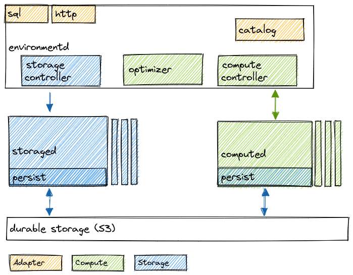

# Materialize Platform Reference Documentation

This space is meant to be an authoritative source for the following types of information:

-   A high-level architecture overview of the various bits of Materialize Platform.
-   Comprehensive documentation or comprehensive list of references to API documentation about the following topics:
    -   Contracts between different components.
    -   Specifications of assumed/intended protocol behavior.

_Note:_ The documentation in this folder should _aways be kept up-to-date and in sync with the source code_.
Whenever you work on something that might break this assumption (most often code changes scoped within an effort driven by an approved design doc), please make sure that your work plan includes an item to update the relevant documentation in this folder. Check the [CONTRIBUTING.md](./CONTRIBUTING.md) for details.

## High-Level Design & Technical Areas

For details, look at the sub-space for the specific area:

-   [ADAPTER](adapter/README.md)
-   [COMPUTE](compute/README.md)
-   [STORAGE](storage/README.md)
