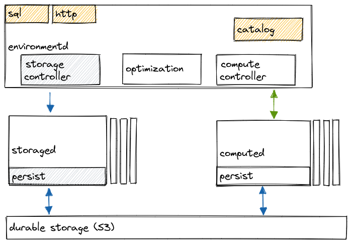

# ADAPTER Reference Documentation

The areas of the database architecture that belong to ADAPTER team are depicted in the diagram below.

The ADAPTER layer is responsible for:

-   SQL interface
-   Transactions
-   Coordination and timelines
-   Version upgrades
