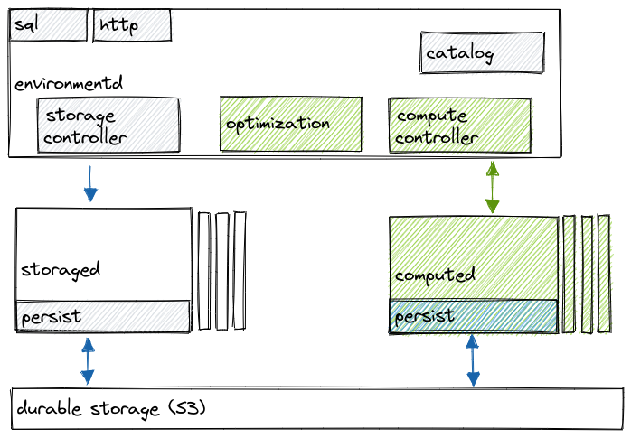

# COMPUTE Reference Documentation

The areas of the database architecture that belong to COMPUTE are depicted in the diagram below.

The COMPUTE layer is responsible for:

-   Dataflow execution
-   Optimization
-   Horizontal scaling
-   Active replication
