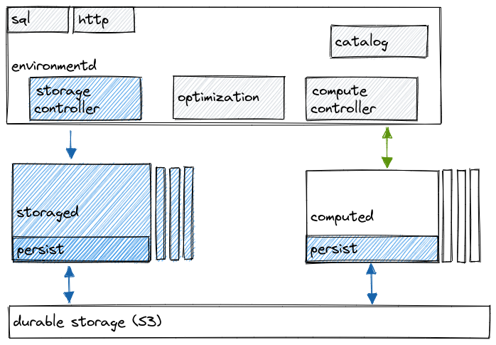

# STORAGE Reference Documentation

The areas of the database architecture that belong to STORAGE team are depicted in the diagram below.

The STORAGE layer is responsible for:

-   Storage
-   Sources and sinks
-   Persistence
-   Reclocking
