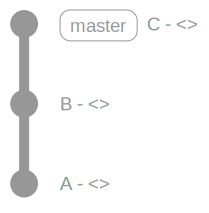
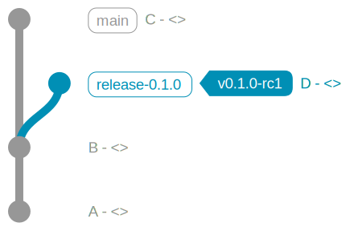
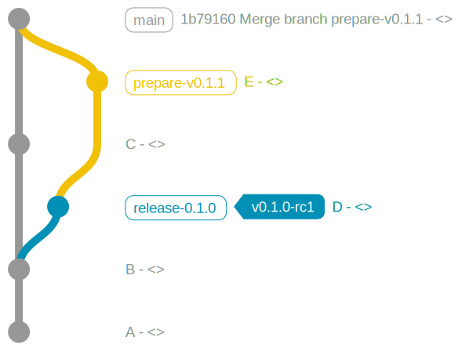
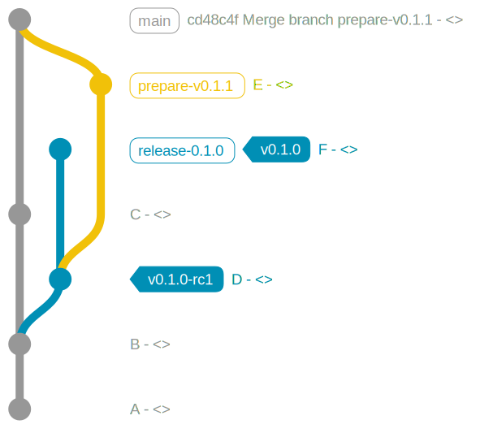
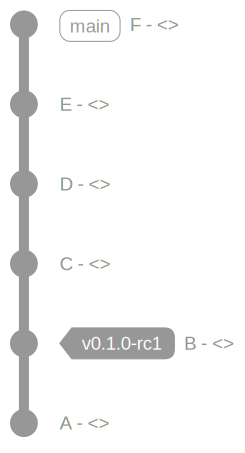
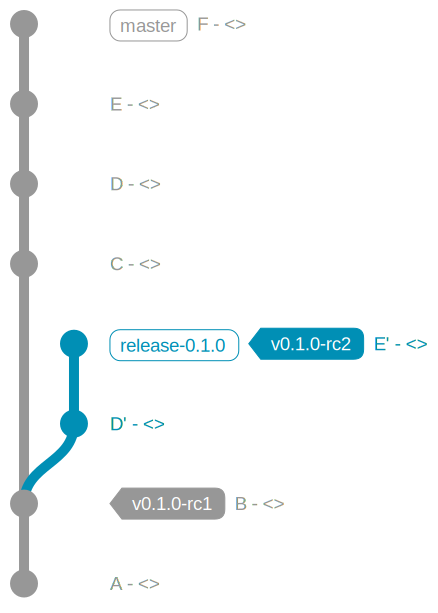
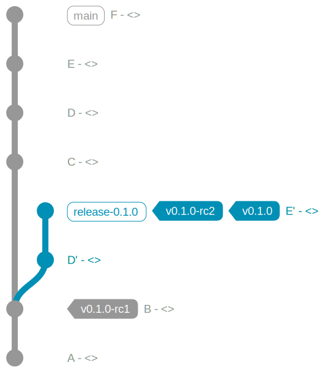
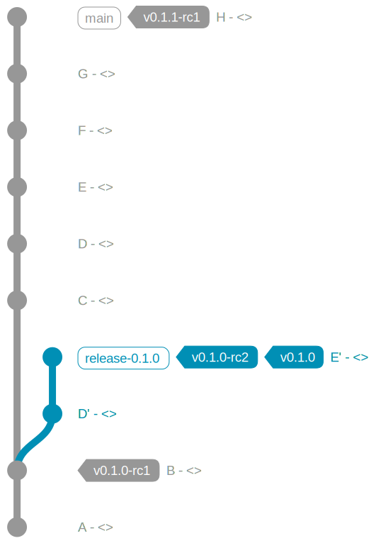

# Creating releases of the `materialized`

## Checklist

In addition to the mechanics of our branching strategy, described here, we have
a release checklist which should be followed (and possibly updated) at every
release.

To view the release checklist, create a new issue using the release template:

  <https://github.com/MaterializeInc/materialize/issues/new?template=release.md&title=release:+v0.#.#>

## Release schedule

See the [Versions: schedule](https://materialize.com/docs/versions/#schedule)
section of our docs.

The release process kicks off every week on Wednesday morning, where "morning"
is determined by the timezone of that week's release manager. The release
commit, however, is not dependent on when the release process starts: it is
always chosen to be the *last* commit on `main` at 05:00 UTC (midnight EST) on
Wednesday. If there were outstanding release blockers at 05:00 UTC, either the
fixes need to be backported on top of that commit or the release needs to be
skipped.

This predictability ensures that teams that need to carefully manage migrations
of on-disk state know at the moment that they press "merge" on a PR whether that
PR is slated for inclusion in the next release or not. These migrations often
make rollbacks impossible, so batching PRs that prevent rollbacks in the same
release decreases the operational burden on the cloud team by decreasing the
number of releases in which rollbacks are impossible.

The release manager has license to skip the release if the fixes for release
blockers are even remotely difficult to backport. One of the reasons we release
every week is to decrease the cost of skipping a release. It's much easier to
decide to skip a release when the next release is a week away, rather than a
month away.

Why Wednesday mornings?

  * Wednesday is never disrupted by a long weekend.
  * Any breakage that occurs over the weekend has two working days to settle.
    If Monday is a holiday, there is still one working day for breakage to
    settle.
  * The release manager has two working days to ship the release. The release
    bleeds into Skunkworks Friday only if something goes wrong.
  * The somewhat-unavoidable rush to squeeze features into a release occurs on
    Tuesday afternoon rather than Thursday or Friday afternoon.
  * 05:00 UTC is before working hours begin in Europe and the US, so release
    managers can start the release Wednesday "morning" in whatever timezone
    they're in.

**Note:** Whether this is the correct policy is undergoing debate. It is,
however, the policy that is currently in effect.

## Basic git workflow

The Materialize release process is based on an "always release main" philosophy, while
still allowing us to produce bugfix releases if they are urgently required. We will
iterate on this release process as we gain experience.

There are two core git artifacts involved in every release:

* Every release is denoted by a git tag that specifically names that release.
* Before the release, there is a "release candidate" git tag that signifies that we are
  planning on making that commit the release.

The goal is to keep it simple while still having high assurance that we are providing
excellent quality software to our users. In all the examples, the goal is 100% automation
of everything that does not explicitly mention a human. Developers are free to add other
steps as they find convenient.

To start a new release version the steps look like:

1. We start with an existing repository, with some work having already been done on it
   main is currently on commit C and we'd like to get B tagged as a release:

   
1. A developer uses the mkrelease script to update license and build files:

        bin/mkrelease -b release-v0.1.0 --checkout B v0.1.0-rc1
        git push origin v0.1.0-rc1

   Resulting in a local repo that looks like:

   

   but note that pushing the `release-0.1.0` branch is not required or recommended.

1. The developer then updates for the next phase of development, off that same commit, so
   so that dev artifacts look correct:

        bin/mkrelease -b prepare-v0.1.1 --no-tag v0.1.1-dev
        git push me prepare-v0.1.1
        gh pr create

   Resulting in a repo that looks like:

   

1. More detailed testing takes place on the artifacts generated by this tag. For all
   tests materialized is not allowed to crash, and all quality of service measurements
   must never fall outside of our accepted bounds.

   The set of tests is:
   * Install apt/rpm packages in clean ubuntu/centos image, and the homebrew package is
     installed on a clean macos image
   * Full SLT (against auto-generated materialize/materialized image)
   * The chbench soak test is run for 72 hours (same docker image)
   * The protobuf soak test is run for 72 hours (same docker image)
1. A human verifies that everything looks good, tags and pushes the `v<VERSION>` tag --
   since there have been no problems, the release branch is up to date:

        git tag -a v0.1.0 v0.1.0-rc1
        git push origin v0.1.0

   At this point the repo should look like:

   
1. Follow the [release checklist](./release-checklist.md)!
1. make announcements and 🎉💃🕺

## Fully elaborated git workflow

So far the release process only describes what happens when things go smoothly, and
releases are bug-free. But there are also several things that can happen that can cause
us to revisit old releases and pre-releases:

1. Testing can fail for reasons unrelated to the materialized codebase.
2. Testing can fail for reasons _related_ to the materialized codebase.
3. Bugs can be found post-release that are considered high-enough severity that we want
   to backport a bugfix.

Depending on the current level of automation, the solution for 1 is either to manually
re-run the tests, or to push a new tag. In the world where we have this fully automated
creating a new tag for `v0.1-rc1` with an `N + 1` suffix to kick off new tests _may_
look like:

    git tag -a v0.1.0-rc2 v0.1.0-rc1
    git push origin v0.1.0-rc2

Alternatively, clicking through some CI interfaces to trigger long-running jobs will be
necessary.

No matter our level of automation, 2 & 3 have a very similar _solution_: push changes to
the `release-X.Y` branch, and eventually tag specific commits in a similar way to the
happy path.

Here is a walkthrough of a bad-case happening at every step in the release process:

1. Ensure that the repo is entirely up to date: `git pull origin`
1. Commit `B` in the main branch is tagged and the release branch is updated:

        git tag -a v0.1.0-rc1 <B>
        git push origin v0.1.0-rc1
1. A pair of issues are discovered that are deemed important enough for us to backport to
   the rc
1. The fixes are tested and merged to `main` as commits `D` and `E`, after some
   unfortunately dangerous work has been commited to main (here as `C`). The repo
   therefore looks like this, and we do _not_ want to import `C` into the release:

   
1. The commits on main are applied to the release branch:

        git checkout release-X.Y
        git cherry-pick D
        git cherry-pick E
1. That is tagged `git tag -a v0.1.0-rc1 HEAD`:

   
1. Both the branch and the tag are pushed:

        git push origin release
        git push origin v0.1.0-rc2
1. Long-running tests succeed again, the release is published to github and all
   distribution channels:

        git tag -a v0.1.0 v0.1.0-rc

   At this point the repo and successful releases looks like:
   
1. Some time later we're ready to release from mainline again, this should be the next
   release. So even though we don't have any features that we would like to market as
   `0.2` we would like to release bugfixes and improvements from mainline. That causes
   the next tag to be on a commit that is an ancestor of main again, allowing the
   release manager to delete the `release-0.1.0` branch that we were using as scratch
   space, and start the process over on main:

        git tag -a v0.1.1-rc1 H
        # run long-running tests
        git tag -a v0.1.1
        git push origin v0.1.1
   causing the repo to look like:

   
1. Now we have released again, and we should follow the [release
   checklist](./release-checklist.md)
