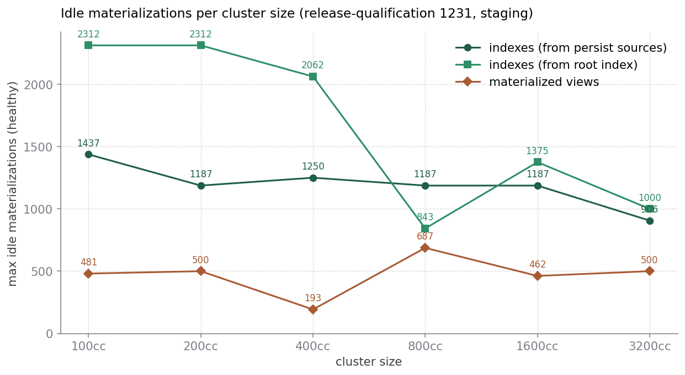
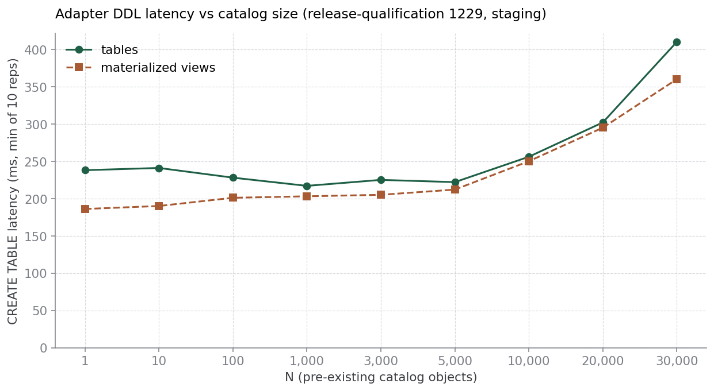

# Spec sheet: idle ceilings, first numbers

- **Date:** 2026-05-20
- **Scope:** `test/cluster-spec-sheet`, scenarios for `envd_objects_scalability` and `cluster_object_limits`.
- **Data sources:** release-qualification builds [1229](https://buildkite.com/materialize/release-qualification/builds/1229) (envd) and [1231](https://buildkite.com/materialize/release-qualification/builds/1231) (cluster), both against `cloud-staging` (aws-eu-west-1).

The spec sheet is a catalogue of idle ceilings — how many things an
environment or a single cluster can carry when those things aren't doing
anything. These are upper bounds. Once real workload (writes, non-trivial
queries, source ingestion) lands on top, the same environment or cluster
will tolerate fewer objects than this. The point of measuring the idle
ceiling is that everything else has to fit underneath it.

This report is the third pass over these scenarios; the first pass
(2026-05-18) used build 1226 and only had two `cluster_object_limits`
variants. Since then we've added a third variant (`indexes_from_index`),
renamed the existing ones to make their topology explicit, and made the
freshness probe more honest about *why* a probe failed.

## What we measure

### `envd_objects_scalability`

Two scenarios, `envd_objects_scalability_tables` and
`envd_objects_scalability_mvs`. Both fix the measurement cluster size at
`100cc` and grow the catalog, measuring two latencies per `N`: adapter
DDL latency (time to `CREATE TABLE m_tmp (a int)`, ten repetitions with
drop-create cycles) and adapter peek latency (time to `SELECT * FROM t`
against a one-row table on the measurement cluster, ten repetitions).

The default `N`-walk is `1, 10, 100, 1k, 3k, 5k, 10k, 20k, 30k`. The
tables scenario adds empty tables to one schema. The MVs scenario adds
trivial structurally-distinct MVs over a one-row base table, spread
across single-replica pad clusters at 10k MVs each — so 30k MVs spans
three pad clusters.

### `cluster_object_limits`

Three scenarios, all of the same shape: per cluster size in
`{100cc, 200cc, 400cc, 800cc, 1600cc, 3200cc}`, find the largest `N` of
idle materializations a single cluster can keep fresh. Each
materialization is derived from a one-row base table that is *never
updated*. The only work the cluster has to do is keep advancing each
materialization's `write_frontier` in step with the table's frontier —
no merges, no real compute, just frontier ticks. When the cluster can't
keep up, the lag in `mz_internal.mz_materialization_lag` starts climbing
and never comes back down.

The three variants differ in topology:

- **`cluster_object_limits_indexes_from_persist_sources`** — `N` indexed
  views each read directly from `base_t`, so each test object has its
  own persist source dataflow. Dominated by persist-source breadth.
- **`cluster_object_limits_indexes_from_index`** — a single root view
  `v_root` with one index on the measurement cluster sits between
  `base_t` and the `N` test indexes. The `N` test indexes read from
  `v_root`, so the optimizer imports the root index's arrangement and
  the whole topology has one persist source regardless of `N`. Isolates
  the "how many compute-only dataflows can a cluster tick" axis from
  persist-source overhead.
- **`cluster_object_limits_mvs_from_persist_sources`** — `N`
  materialized views, each with its own persist source from `base_t`
  and its own persist sink. Dominated by persist-source and
  persist-sink breadth.

Procedure per cluster size:

1. Drop and recreate cluster `c` at that size, plus a one-row `base_t`
   (and, for `from_index`, the root view + index).
2. Walk an `N`-list (geometric to 1k, then +1k up to 30k by default).
   At each `N`, wait up to 5 minutes for all `N` materializations to
   hydrate (`mz_hydration_statuses.hydrated = true`), then take five
   samples of `local_lag` two seconds apart. The point is healthy only
   if every sample is under the threshold (`2 s` by default) and all
   `N` objects are reporting.
3. On the first unhealthy `N`, bisect `(last_healthy, first_unhealthy]`
   four times to narrow the cliff (each step adds or drops objects in
   place rather than rebuilding).
4. Probes that exceed the hydration window are recorded with
   `failure_mode = "hydration_timeout"`; probes that hydrate but fail
   the steady-state lag check are recorded with `failure_mode = "lag"`;
   healthy probes have `failure_mode` empty.

## Results — cluster object limits

Three observations:

**1. The `from_index` variant unlocks ~1.7× more objects on small
clusters.** At `100cc` and `200cc` the cluster carries ~2300 chained
indexes vs ~1200–1400 indexes that each have their own persist source.
This is the variant working as designed: when the optimizer can import
a shared root index instead of opening one persist source per
materialization, the "how many dataflows can a worker tick" axis
dominates the "how many persist sources can a replica pull in
parallel" axis. The two index curves visibly separate at small sizes
and converge as the cluster grows.

**2. Bigger replicas carry fewer idle objects, not more.** Both index
curves trend *down* with cluster size; the MV curve is roughly flat
in the 400–700 range. This matches the timely-dataflow argument:
every worker on a cluster owns a slice of every dataflow on that
cluster and has to tick the frontier on each materialization in its
slice regardless of cluster size. Adding workers does not reduce
per-worker idle work; it shards the same per-object cost across more
workers that each still carry their share, and cross-worker
coordination grows on top of that. So the prediction for purely idle
objects is a flat-to-downward ceiling as the cluster grows, and that
is what we see.

**3. There are spikes worth flagging, not yet acting on.** The
`from_index` curve drops sharply at `800cc` (843 idle indexes, vs 1187
on `from_persist_sources` at the same size). The MV curve dips to 193
at `400cc`, well below its neighbours (481 / 500 / 687). Both look
like single-cell outliers in a single run rather than a real cliff at
those sizes — the bisects converged cleanly, but the surrounding
values don't support a real step-change. The next planned action is a
repeat run to see whether they reproduce; if they do, both warrant
investigation. If they don't, our methodology needs more samples per
size before we publish absolute numbers.

A subtler finding from this run's per-sample data: many of the
"unhealthy lag" failures are actually *stalls*. The `local_lag` value
caps out at `min(lag, 10 × threshold) = 20 s` on the plot, but the
underlying `mz_materialization_lag` reading is `now() − minimum
timestamp` — i.e. the materialization's `write_frontier` has never
advanced past the initial timestamp. That happens when the cluster
reports `hydrated = true` but hasn't actually started ticking the
frontier yet. Distinguishing "stalled at min_ts" from "behind but
moving" is on the follow-up list (probably: wait for
`min(write_frontier) > recent_threshold` before sampling, and emit a
separate `failure_mode = "stalled"`).

## Results — envd objects scalability

The DDL path slows by roughly 1.7–2× between `N=1` and `N=30000`, with
the knee around `N=5k–10k`. Tables and MVs track each other closely;
the slope is essentially the same. The MV baseline at small `N` is
slightly lower than tables, which is mildly surprising given MVs are
the "heavier" object — could be variance, could be a real difference
in the adapter path for MVs at low cardinality, not investigated
further here.

Peek latency is omitted from the plot because it stays in the
90–95 ms band across the entire `N` range; the adapter peek path
isn't sensitive to catalog size in this regime, which is what we
want.

## What's changed since the first cut

The 2026-05-18 garden post described two cluster scenarios
(`cluster_object_limits_indexes`, `cluster_object_limits_mvs`) and a
60-second hydration window. Three things have changed since then.

**New variant: `indexes_from_index`.** Added a chained-index scenario
that isolates compute-only dataflow tick overhead from persist-source
overhead. Implementation: `ClusterObjectLimitsKind.setup_statements`
runs once per cluster-size iteration after `base_t` exists. The
`from_index` kind uses it to create `v_root` + `v_root_primary_idx` on
the measurement cluster; the lag/hydration filters exclude
`v_root_primary_idx` so the root index doesn't count as one of the `N`
test objects.

**Renames for clarity:**

- `cluster_object_limits_indexes` → `cluster_object_limits_indexes_from_persist_sources`
- `cluster_object_limits_mvs` → `cluster_object_limits_mvs_from_persist_sources`
- new: `cluster_object_limits_indexes_from_index`

The new names spell out the topology each variant exercises.
References in our own pipelines were updated; no external (non-repo)
consumers were known.

**Hydration timeout raised to 5 minutes; failure mode is now
recorded.** The earlier 60-second hydration window timed out
deterministically on `1600cc` / `3200cc` at the coarse `N=2000`
step, which yielded a measured "cliff" that was driven by hydration
time, not steady-state capacity — bigger replicas paradoxically
reported smaller max-healthy `N`. The window is now 300 seconds (180 s
first-probe budget after `CREATE CLUSTER c` to absorb cold-start), and
hydration-timeout failures are written to a new `failure_mode` column
in the cluster_object_limits CSV (`"hydration_timeout"` vs `"lag"` vs
empty when healthy). The existing `healthy` 0/1 column is unchanged,
so prior analysis code keeps working.

## Caveats

One run per data point. Every materialization here is derived from a
one-row table that never changes — real workloads will lower these
ceilings, often by a lot. The numbers are also specific to the
`cloud-staging` environment with its current `environmentd` CPU
allocation, `max_credit_consumption_rate`, and LaunchDarkly defaults; a
production environment will land somewhere else. Two of the
cluster-object-limits cells (`from_index` at `800cc`, `mvs` at `400cc`)
look like single-run outliers and should be repeated before being
quoted.

## References

- Code: [`test/cluster-spec-sheet/mzcompose.py`](../../../test/cluster-spec-sheet/mzcompose.py)
- Per-scenario README: [`test/cluster-spec-sheet/README.md`](../../../test/cluster-spec-sheet/README.md)
- Buildkite: [release-qualification 1229](https://buildkite.com/materialize/release-qualification/builds/1229) (envd source), [1231](https://buildkite.com/materialize/release-qualification/builds/1231) (cluster source).
- Raw per-sample CSVs are attached to the Buildkite builds as artifacts.
