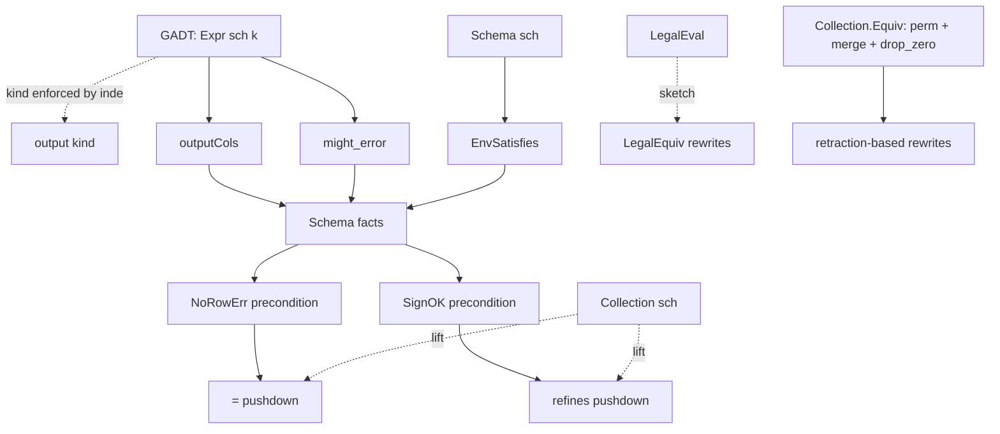

# Semantic model: layers, errors, and equivalence variants

This document is the working reference for the data model and the
equivalence relations the Lean skeleton at `doc/developer/semantics/`
is exploring.
It complements the design doc at
`../design/20260517_error_handling_semantics.md`, which is more
discursive; this file is a layered catalog plus honest notes on what
each variant buys and what it costs.

**Caveat on design-doc-derived claims.**
The design doc is itself a work in progress.
Where this file says "the skeleton does X because the design doc
says Y", treat that as a current modeling choice, not a settled
specification — Y itself may change.
Such claims are flagged inline with "design-doc-derived" so they
can be re-examined when the design doc evolves.

## Type structure

The model uses **schema-indexed (GADT) inductive types**:

* `Datum : ColType → Type` — scalar value indexed by its kind.
  `.bool` only inhabits `Datum .bool`; `.int` only inhabits
  `Datum .int`; `.null` and `.err _` are universal.
* `Expr (sch : Schema n) : ColType → Type` — expression typed by
  input schema and output type. Variadic constructors use a
  mutual `ExprList sch k`.
* `Update sch` / `Collection sch` — schema-indexed collection
  layer.

Kind correctness is enforced at construction: `Expr.not (.lit
(.int 5))` fails to type-check.

Evaluators have closed codomains by construction (no catch-all
`_ , _ => .null` routing): `evalAnd : Datum .bool × Datum .bool
→ Datum .bool`, etc. Algebraic laws (`not_not`, `evalAnd_idem`,
absorption, conditional commutativity) are stated without the
`¬d.IsInt` hypotheses an untyped model would require.

The model has five layers — `Datum`, `Expression`, `Row`, `Schema`,
`Collection` — and a separate dimension of error semantics that cuts
across all of them.
The skeleton deliberately models a single *collection version* in
the sense of `../platform/formalism.md`: a multiset of rows with
diff multiplicities, no time dimension.
Time-varying collections (TVCs) and frontier reasoning are out of
scope at this layer.
After the layers, this doc summarizes the equivalence relations the
optimizer can pick from and the rewrites each enables.

## Architecture: how the pieces fit

The model has four kinds of object, each at a layer of the
catalog:

* **Type-level discipline** lives in the indexing of `Datum`,
  `Expr`, `Update`, and `Collection`. `Expr (sch : Schema n) :
  ColType → Type` enforces kind correctness; ill-typed expressions
  are unconstructible. The output type of an `Expr` is its index,
  trivially.
* **Analyses** at the `Expr` layer that derive *additional* facts
  beyond the type: `Expr.outputCols` (nullable / errable bits),
  `Expr.might_error` (error reachability). These layer on top of
  the GADT — they refine, not replace, the structural typing.
* **Schema facts** at the `Schema n` / `Collection n` layer:
  `Schema.cellErrFree`, `Schema.rowErrFree`, `EnvSatisfies`,
  `Collection.NoRowErr`. Combinators (`Schema.append`,
  `NoRowErr_filter`, `NoRowErr_unionAll`) propagate facts through
  operators.
* **Preconditions** on operator rewrites discharged by schema
  facts. `filter_cross_pushdown_left_strict` requires `NoRowErr`;
  `filter_cross_pushdown_left_refines` weakens to `SignOK`.
* **Relations** pick which rewrites are admissible. `=` is the
  strict surface; `eqErrSet`, `refines`, `LegalEquiv` are
  progressive relaxations. `Collection.Equiv` quotients by
  permutation + consolidation for retraction-based rewrites.

The load-bearing dependency graph: *GADT structure (type) +
analyses (errable / err-reachability) → schema facts →
preconditions → relation-tagged rewrites*.



The catalog below walks the layers (Datum → Expression → Row →
Schema → Collection); the summary table at the end groups the
relations and the rewrites they admit.

## Datum

`Datum` is the cell-level value type, **indexed by its kind**:

```
inductive Datum : ColType → Type
  | bool (b : Bool) : Datum .bool
  | int (n : Int)   : Datum .int
  | null            : Datum k
  | err (e : EvalError) : Datum k
```

`Datum .bool` admits `.bool _`, `.null`, `.err _` only — no `.int`
in this fragment by construction. Same for `Datum .int`. `.null`
and `.err _` are universal: they inhabit every kind. The `.top`
kind admits only `.null` / `.err _` (the unconstrained /
polymorphic case).

`EvalError` is the cell-scoped error payload — currently
`.divisionByZero` and `.overflow`, with the production list
(`src/expr/src/scalar.rs`) much larger.

The four-valued absorption order is `FALSE > ERROR > NULL > TRUE`
for `AND` (and the dual for `OR`), encoded in `evalAnd` / `evalOr`
on `Datum .bool × Datum .bool → Datum .bool`. The codomain is
closed by the indexing — no catch-all `_ , _ => .null` route. The
`Datum.IsErr` and `Datum.IsNull` predicates witness err / null
membership; algebraic laws (`not_not`, identity, idempotence,
conditional commutativity) state without a `¬d.IsInt` hypothesis
because `Datum .bool` rules out `.int` at the type level.

## Expression

`Expr` is the AST for scalar computations, **schema-indexed**:

```
inductive Expr (sch : Schema n) : ColType → Type
  | lit {k} (d : Datum k) : Expr sch k
  | col (i : Fin n)       : Expr sch (sch.types.get i)
  | not  : Expr sch .bool → Expr sch .bool
  | plus : Expr sch .int → Expr sch .int → Expr sch .int
  | minus / times / divide : analogous
  | eq {k} : Expr sch k → Expr sch k → Expr sch .bool
  | lt {k} : Expr sch k → Expr sch k → Expr sch .bool
  | andN (args : ExprList sch .bool) : Expr sch .bool
  | orN  (args : ExprList sch .bool) : Expr sch .bool
  | ifThen {k} (c : Expr sch .bool) (t e : Expr sch k) : Expr sch k
  | coalesce {k} (args : ExprList sch k) : Expr sch k
```

Mutual with `ExprList sch k` to satisfy Lean's nested-inductive
restriction on variadic constructors. The schema indexing makes
ill-typed expressions structurally unconstructible — `Expr.not
(.lit (.int 5))` fails to type-check because `Expr.not` requires
`Expr sch .bool`.

The big-step evaluator is mutual with `evalList`:

```
eval     : (env : Env sch) → Expr sch k → Datum k
evalList : (env : Env sch) → ExprList sch k → List (Datum k)
```

with `Env sch := (i : Fin n) → Datum (sch.types.get i)` — a typed
lookup function whose cells agree with the schema's declared
types. No out-of-bounds case; column indices are `Fin n`.

Static analyses:

* `might_error : Expr sch k → Bool` — conservatively decides
  whether an expression can raise a cell error. Soundness in
  `Mz/MightError.lean`: `might_error_sound` (mutual with
  `args_might_error_sound`) — `might_error e = false` plus
  `EnvErrFree env` implies `¬(eval env e).IsErr`.

Column-reference analyses (`colReferencesBoundedBy`, `colShift`,
`colReferencesUnused`) of the untyped predecessor are subsumed by
the GADT: column references use `Fin n` indices, so out-of-bounds
is unconstructible; column shifting between schemas falls out of
`Subst` (schema-transforming substitution). No `ColRefs` module in
the current model.

## Row

A row is a typed lookup function:

```
Env sch := (i : Fin n) → Datum (sch.types.get i)
```

Each cell carries the kind declared by `sch.types`. Arity is
enforced at the type level (every `Fin n` is in range); ill-arity
rows are unconstructible. There is no separate `RowN n` /
`row.toList` distinction — the schema-indexed function is the
row, and `eval` consumes it directly.

## Schema

Schemas are the structural counterpart to Materialize's
`RelationType`. `Mz/Schema.lean` carries the type-level
definitions (no theorems — predicates that touch values live
elsewhere):

* `ColSchema { nullable, errable : Bool }` — per-column metadata.
* `ColType { bool | int | top }` — per-column SQL type tag.
  `.top` is unconstrained (matches any expected; captures `.null`
  / `.err _` literals).
* `Schema n { cols : Vector ColSchema n, types : Vector ColType n,
  rowErrFree : Bool }`.
* `Schema.free n` — information-free starting point.
* `Schema.append a b` — concatenation along all three components.
* `Schema.cellErrFree sch` — every column claims `errable = false`.

`Schema.types` flows through the GADT type-level indexing of
`Datum`, `Expr`, `Env`, `Update`, `Collection`. Type discipline is
structural — ill-typed expressions and ill-shaped rows are
unconstructible.

Propositional satisfaction (in `Mz/OutputType.lean`):

* `DatumSatisfies cs d` — `Datum k` satisfies a `ColSchema` iff
  `cs.nullable = false → ¬d.IsNull` and `cs.errable = false →
  ¬d.IsErr`. Kind compatibility is structural (the index `k`).
* `RowSatisfies sch env` — every cell's `Datum` satisfies the
  corresponding `ColSchema`.

The `WellTyped` predicate of the untyped predecessor model is
subsumed by the GADT. `Expr.outputKind` disappears as a separate
function — the kind is the index `k` of `Expr sch k`. The
`RowSatisfiesType` / `kind_of_eval` companions are gone for the
same reason.

`Expr.outputCols sch e : ColSchema` in `Mz/OutputType.lean`
derives the output `(nullable, errable)` bits per `Expr`. Precise
on `.lit`, `.col`, and `.not` (preserves both bits). Tight
`errable`-OR-of-inputs on `.plus` / `.minus` / `.times`, `.eq` /
`.lt`, and `.ifThen` (OR over three arms). `.divide` is always
errable. Variadic `.andN` / `.orN` / `.coalesce` remain
conservative (mutual-recursion lifts are open follow-ups).
Soundness theorem `eval_satisfies_outputCols` is mechanized in
`Mz/OutputType.lean` via structural recursion + `evalX_not_err`
lemmas from `MightError`.

`EnvErrFree_of_RowSatisfies` (in `Mz/OutputType.lean`) bridges
`Schema.cellErrFree` + `RowSatisfies sch env` to `EnvErrFree env`
— the substrate that `NoRowErr_filter` consumes.

`coalesce_collapse` (in `Mz/OutputType.lean`) is the
schema-rider: if the head argument of `.coalesce` has
`outputCols` with both `nullable := false` and `errable := false`,
then on a `RowSatisfies` env the coalesce collapses to the head.
Supporting Datum-level lemma `evalCoalesce_cons_concrete` in
`Mz/Coalesce.lean`.

NoRowErr propagation through schema-preserving / -transforming
operators (mechanized in `Mz/Collection.lean`):

* `NoRowErr_negate` — schema-preserving; `(-0 : Int) = 0`.
* `NoRowErr_unionAll` — conjunctive over the input collections.
* `NoRowErr_project` — schema-transforming; `projectOne` leaves
  `err_diff` untouched.
* `NoRowErr_cross` — bilinear err-diff vanishes when both sides'
  `err_diff = 0`; `ring` closes.
* `NoRowErr_filter` — directly takes `∀ rec ∈ s, ¬(eval rec.row
  p).IsErr`. Companion `NoRowErr_filter_of_might_error_false`
  discharges that premise via `Expr.might_error p = false` plus
  per-row `EnvErrFree` (discharged in turn by
  `EnvErrFree_of_RowSatisfies`).

Open obligations on the schema side are listed in
`transforms.md` (sections *Schema-driven rewrites* and
*Output-schema propagation*); that file is the canonical register
of what is and isn't mechanized at the schema layer.

## Collection

A collection is a multiset of rows carrying data and err
multiplicities, **schema-indexed**:

```
structure Update {n : Nat} (sch : Schema n) where
  row : Env sch  -- typed lookup; each cell has the kind sch.types.get i
  diff : Int      -- data multiplicity, retractable
  err_diff : Int  -- err multiplicity, retractable

abbrev Collection {n : Nat} (sch : Schema n) := List (Update sch)
```

Both diffs are ordinary `Int`s, retractable to model
differential-dataflow consolidation. An update with `(diff,
err_diff) = (1, 0)` is a valid output; `(0, 1)` is an erred
output; `(1, 1)` is both (rare but representable). It is the
time-stripped slice of `../platform/formalism.md`'s time-varying
collection: a single collection version.

Operators are typed by their input / output schemas:

* `filter (p : Expr sch .bool) : Collection sch → Collection sch`
  — schema-preserving. `filterOne` evaluates the predicate per
  update: `.bool true` passes through; `.bool false` / `.null`
  zero `diff`; `.err _` migrates `diff` to `err_diff`.
* `project (es : (i : Fin m) → Expr sch_in (sch_out.types.get i))
  : Collection sch_in → Collection sch_out` — schema-transforming
  by the projection vector's output types.
* `negate`, `unionAll` — schema-preserving; pointwise multiplicity
  negation and list concatenation. `negate_negate` proved.
  `unionAll_assoc` proved.
* `cross : Collection sch_l → Collection sch_r → Collection
  (Schema.append sch_l sch_r)` — schema-transforming via
  `Schema.append`. `crossOne` combines two updates with the
  bilinear diff rule `(d, e) * (d', e') = (d*d', d*e' + e*d' +
  e*e')`. Row composition uses
  `Schema.types_get_append_left` / `_right` helper lemmas to
  cast between `(sch_l.append sch_r).types.get i` and
  `sch_l.types.get ⟨i.val, h⟩` (or right-side analog).
  `cross_assoc` is partially mechanized: arity-cast scaffolding
  landed (`Schema.append_assoc_heq`, `Update.cast`,
  `Collection.cast`, `cast_rfl`) plus the multiplicity components
  (`crossOne_diff_eq`, `crossOne_err_diff_eq` via `ring`). Row
  component requires Fin-index manipulation under three nested
  `▸` casts (`Schema.types_get_append_left` / `_right` at two
  nesting levels) — open.

Time, consolidation, distinct, and aggregate are out of scope at
this layer. Lifting to a timed collection is additive on top.

### Order-sensitivity and retraction (`Collection.Equiv`)

`Collection sch = List (Update sch)` under `=` is too fine for
user-observable semantics on two axes:

* **Order.** `unionAll a b` and `unionAll b a` are distinct lists
  even though every downstream consumer treats them as equal.
  Pushdown lemmas that close under `=` rely on both sides
  enumerating updates in the same order; a fusion that reshapes
  enumeration cannot state at `=`.
* **Retraction.** `Update.diff` and `Update.err_diff` are
  retractable `Int`s, but `=` never quotients by consolidation, so
  `[(r, 1, 0), (r, -1, 0)] ≠ []` even though the user observes
  them as the same.

`Collection.Equiv` (mechanized in `Mz/Collection.lean`) is the
smallest equivalence relation closed under three primitive
rewrites: `perm` (`List.Perm` — order), `merge` (same-row diff
combination — consolidation), `drop_zero` (drop a `(r, 0, 0)`
update — zero erasure). Strict `=` is strictly stronger and remains
the safer relation for proofs that close under it; rewrites whose
content is permutation- or consolidation-invariant migrate to
`Collection.Equiv`.

Two demonstrators are mechanized:

* `unionAll_comm_equiv : Equiv (unionAll a b) (unionAll b a)` — via
  `perm` alone.
* `negate_unionAll_self : Equiv (unionAll (negate s) s) []` — pair
  every update with its negation (`perm`), merge to a zero update
  (`merge`), drop (`drop_zero`). The load-bearing retraction
  identity that strict `=` cannot witness.

Existing `=`-tagged rewrites in `transforms.md` continue to hold
unchanged; migrating them to `Collection.Equiv` is mechanical
(strict `=` implies `Collection.Equiv` via `Equiv.refl`) and
deferred until a forcing function appears.

This has a second-order effect on the `refines` lift in
`Mz/Collection.lean`.
`Update.refines` says `a.diff = b.diff ∧ a.err_diff ≥ b.err_diff`,
and `filter_cross_pushdown_left_refines` would close unconditionally
if `recL.diff * recR.err_diff ≥ 0`.
On non-negative diffs that's trivial; on signed `Int` diffs it's a
real side condition (`SignOK`).
Quotienting by consolidation first (or restricting to non-negative
diffs) makes the lift unconditional — `Collection.Equiv` is the
natural home for that strengthening.

## Errors

Three error scopes, mostly orthogonal:

* **Cell-scoped** — `Datum::Error(EvalError)`.
  Lives inside a row.
  Carries a structured payload.
  Surface examples: division by zero, integer overflow, decode error
  on a single column.
* **Row-scoped** — `err_diff` on the update (two-diff model)
  *or* a row-carrier variant `(Row | DataflowError)`.
  The row failed as a whole.
  Surface examples: a `Datum::Error` in a projected column that the
  optimizer chose to escalate; a row whose decoder failed before any
  cell was reached.
* **Collection-scoped** — an absorbing element on the diff
  (`DiffWithError`) or a separate flag.
  Once introduced, the entire collection is poisoned.
  Surface examples: a source that lost its prefix; a fatal indexing
  failure during aggregation.
  Currently spec-only; not mechanized in the post-restart skeleton.

The two-diff baseline carries cell and row scopes natively (cell as
`Datum::Error` in the row, row as `err_diff` multiplicity).
Collection scope is documented in the design doc and historically had
a `DiffWithError` mechanization that was removed at restart; it can be
reintroduced as a flag if a forcing function appears.

### Type-mismatch routing: `.null` vs `.err typeMismatch`

The total evaluator handles type-mismatched operands (e.g.
`evalNot (.int 5)`, `evalAnd (.bool true) (.int 5)`) via a
catch-all that routes to `.null`.
Modeling note in `Mz/PrimEval.lean` calls this a sound
over-approximation of panic: any rewrite sound under `.null` is
also sound under panic, because panic strictly removes
observable rows.

Alternative: route to `.err typeMismatch` (with a new
`EvalError.typeMismatch` variant).
The two routings trade which schema bit picks up the conservative
pollution:

| Bit | `.null` route (current) | `.err` route (alternative) |
| --- | --- | --- |
| `nullable` | conservative `true` on every operator whose catch-all is reachable | clean — operators preserve input `nullable` |
| `errable` | clean — type-mismatch doesn't pollute `errable` | conservative `true` on every operator whose catch-all is reachable |

Other trade-offs:

* **Runtime fidelity.** `.err` is closer to Materialize's
  runtime panic — cell-to-row escalation at sinks would push the
  row out of the data stream, ≈ panic. `.null` keeps the row in
  the data stream with a null cell, which is *less* like panic
  but admits more downstream rewrites.
* **`evalNot_not_err` flips.** Under `.err` route,
  `evalNot (.int n) = .err typeMismatch`, so the existing lemma
  `¬a.IsErr → ¬(evalNot a).IsErr` fails on `.int` inputs.
  `Mz/MightError.lean`'s analyzer would have to look at operand
  types to know when `.not` can err — coupling err analysis to
  type analysis.
* **`coalesce` semantics shift.** Under `.null` route,
  `coalesce(.not (.int 5), NULL) = .null`. Under `.err` route,
  `coalesce(.err typeMismatch, NULL) = .null` (per the
  "`null` beats `err`" tiebreak), so `coalesce` rescues type
  errors. Possibly intended; possibly surprising.

### Error-category separation: implementation bugs vs data-dependent runtime errors

Conflating type-mismatch errors with data-dependent runtime
errors (overflow, division-by-zero, decode failures) under a
single `EvalError` tag — or a single `errable` schema bit —
obscures a real distinction:

* **Implementation-bug errors** — type mismatches.
  A function might be analyzed as `¬might_error` and still
  produce an error on invalid input types, but only because the
  planner failed to reject the expression upstream.
  These are signs of a bug above the evaluator, not of valid
  data hitting a hazard.
  Production handles them by panic.
* **Data-dependent runtime errors** — overflow,
  division-by-zero, decode failures, etc.
  Predictable from operands and operator semantics; appear on
  some data inputs and not others.
  Production handles them by escalating the row to the error
  collection.

The current model collapses both into `.err _` with the same
`Datum.IsErr` predicate.
`might_error` analyzes the data-dependent category; type errors
are out-of-scope for that analyzer.
A future refinement could split `EvalError` into
`EvalError.runtime` vs `EvalError.implementationBug` (or carry a
severity tag), letting the schema's `errable` bit track only the
former and giving `might_error` a precise type discipline.
Until that lands, the two routings (`.null` vs
`.err typeMismatch`) are the practical choice and both pick the
same conservative trade.

Current decision: stay with `.null` for proof tractability.
Document the alternative.
Revisit if the design doc commits to cell-to-row escalation at
sinks for type errors, which would force the `.err` route as the
right model — or if the error-category split lands, which would
remove the `errable`-pollution concern entirely.

### Error-category split (forking decision, deferred)

Materialize's runtime conflates two error categories under one
`EvalError` carrier: implementation bugs (planner type errors,
internal-invariant violations) versus data-dependent runtime errors
(overflow, division-by-zero, decode failure).
A future split lets `errable`, `COALESCE` rescue, and operator
escalation distinguish them.
Three placements are documented in the design doc's
*Alternatives → Error-category split (open future)* section:
new `Datum.panic` (A), collection-scoped absorbing marker (B),
`EvalError.implementationBug` payload variant (C).
Current skeleton stays with the unified `.err _` carrier; revisit
when a downstream forcing function (user-visible `is_panic`,
sink-time escalation policy) lands.

### Divergence from PostgreSQL: `coalesce` rescues errors (design-doc-derived; not settled)

PG's `coalesce(NULL, 1/0)` evaluates `1/0` (no non-null seen yet)
and raises an error.
This skeleton's `evalCoalesce [.null, .err DivByZero] = .null`:
the "null beats err" tiebreaker promotes `.null` over `.err` when
no concrete value is reached.
The all-null case matches PG; the mixed-null-and-err case does not.

This follows a proposal in the design doc's *SQL error semantics →
Non-strict functions* section that generalizes PG `coalesce` so an
err can be rescued the same way a `null` can.
The proposal is **not settled** — it is the single largest
behavioral departure from PG in this catalog, and is worth
re-litigating.
Plausible alternatives include matching PG exactly (rescue null,
surface err), surfacing the err only when no later concrete operand
exists (still diverges from PG, but less than the current model),
or splitting the routing by error category once the
implementation-bug-vs-runtime split lands.
The skeleton's current behavior reflects the design doc as written;
it is a candidate, not a commitment.

### Cell-to-row escalation policy

The two scopes (cell-error in `row`, row-error via `err_diff`) are
modeled as independent; an operator decides per-update whether a
cell error escalates to a row error.
Current per-operator rule in `Mz/Collection.lean`:

* `filter` — predicate `eval` returning `.err _` migrates `diff` into
  `err_diff` (`filterOne` case `.err _`). Cells inside `row` are
  unchanged, so a cell error that didn't reach the predicate stays
  cell-scoped.
* `project` — applies `eval` pointwise; a cell that evaluates to
  `.err _` lands in the output cell. `err_diff` is unchanged.
  Cell errors do *not* escalate to row errors under `project`.
* `cross` — concatenates rows verbatim; bilinear err-diff combines
  the row-level err multiplicities of the two sides. Cells are not
  inspected; cell errors do not escalate.
* `negate`, `unionAll` — multiplicity-only; cells are not inspected;
  no escalation.

Open: `Reduce` and sinks, neither of which is modeled at this
layer. A sink cannot emit a row containing `Datum::Error` to a
downstream system, so its rule must be to escalate cell-err to
row-err. `Reduce`'s rule depends on the aggregate; `SUM` is
strict (cell-err → row-err) per the design doc, `COUNT(*)`
counts the row regardless, `COUNT(expr)` is strict on the expr.

### Two-diff vs separate-collection encoding

Materialize's runtime today carries each logical collection as two
timely streams: `data : Stream<(Row, Int)>` and
`errs : Stream<(DataflowError, Int)>`.
The skeleton's two-diff form and the runtime's separate-collection
form are denotationally close but not equivalent:

* Forward (two-diff → separate-collection) drops the originating
  row from each err update; the err side carries a synthesized
  `DataflowError` payload, either built from the row's cell errors
  or a generic one.
* Reverse (separate-collection → two-diff) drops the structured
  `DataflowError` payload; the err side carries the originating row
  plus `err_diff`.

Neither is a strict superset; the encodings carry orthogonal extra
information.
The skeleton chooses two-diff because the bilinear cross rule lifts
cleanly from the separate-collection product
(`cross (dL, eL) (dR, eR) = (dL × dR, dL × eR ∪ eL × dR ∪ eL × eR)`)
and a single `(diff, err_diff)` record subsumes the "row exists in
both data and error" case that separate-collection splits across
two arrangements.

The skeleton retains the right to project to separate-collection in
the future.
The load-bearing invariant for that projection is that *the err
side of every operator preserves the row carrier*.
`filterOne` honors this (predicate errs migrate `diff → err_diff`
and keep `row` unchanged); `crossOne` honors it (output row is the
append regardless of which side carried the err); the
*Row-scoped errors via carrier replacement* alternative in the
design doc is rejected precisely because it breaks the invariant.
See the design doc's *Sum-type row carrier* alternative for the
encoding closest to the runtime's separate-collection form.

## Equivalence relations explored

SQL leaves evaluation order unspecified outside `CASE`, `AND` / `OR`
short-circuit, and a few other places.
Any optimizer rewrite that touches errors must therefore live above
strict equality on `Datum`.
The skeleton catalogs four candidate relations in `Mz/Equiv.lean` plus
two more discovered during the indexed-arity pilot.

### Strict equality (`=`)

Reference relation.
Closes the data-side laws cleanly: filter / project fuse, identity
laws of `AND` / `OR`, idempotence, `evalPlus` associativity over
unbounded `Int`.

Counterexamples (mechanized in `Mz/EquivBounded.lean`,
`Mz/Equiv.lean`):
* `evalAnd` not commutative on err / err inputs (left-bias).
* `evalPlusBounded` not associative at the bounded-int boundary.
  The main `evalPlus` is on Lean's unbounded `Int` and is
  associative; the bounded form lives in `Mz/EquivBounded.lean` and
  surfaces the boundary counterexample needed by the design-doc
  argument that errors force a non-equality relation.
* `filter_cross_pushdown_left` unsound when right collection has
  `err_diff > 0`. **Counterexample mechanized**:
  `filter_cross_pushdown_left_inexact` in `Mz/Collection.lean`
  witnesses concrete `l`, `r`, predicate where LHS preserves an
  err the RHS drops. The three recovery windows (strict via
  `NoRowErr`, data-side via `eraseRowErr`, refinement via
  `SignOK`) are **open** in the indexed model — proofs require
  reasoning across cross's row composition and substitution-aware
  predicate evaluation, deferred. The encoding insight is
  unchanged: any encoding in which err multiplicity participates
  in cross's multiplication rule produces this gap.

### Error-set equivalence (`eqErrSet`)

`a.eqErrSet b := a = b ∨ (a.IsErr ∧ b.IsErr)`.
Collapses all `.err` payloads into one equivalence class.

What it buys: recovers `evalAnd` commutativity on err / err
(`evalAnd_err_err_eqErrSet_comm`).
What it does not buy: bounded-int associativity (one side is err, the
other value; relation requires both errs or strict equality);
predicate pushdown over `cross` on the err side (update-level carrier
mismatch survives the relation).

### Refinement preorder (`refines`, errors as bottom)

`a.refines b := a = b ∨ a.IsErr`.
Asymmetric.
"Transformed result loses an error" is admissible.

Posture: "no spurious errors" — the transformed result has no errors
the original did not have.

The lift of `Datum.refines` to `Update` / `Collection` is
mechanized in `Mz/Collection.lean`:

* `Row.refines a b := ∀ i : Fin n, (a i).refines (b i)`.
* `Update.refines a b := Row.refines a.row b.row ∧ a.diff = b.diff
  ∧ a.err_diff ≥ b.err_diff` (data multiplicity equal; err
  multiplicity allowed to drop).
* `Collection.refines` — recursive pointwise on equal-length
  lists.

Pushdown `filter_cross_pushdown_left` under a sign side condition
`SignOK sL sR := ∀ recL ∈ sL, ∀ recR ∈ sR, 0 ≤ recL.diff *
recR.err_diff` (intended theorem name
`filter_cross_pushdown_left_refines`) is **open** in the indexed
model. The condition is needed because cross's catch-all branch
gives `LHS.err_diff − RHS.err_diff = recL.diff * recR.err_diff`,
which may be negative under `Int` retractions; non-negative diffs
(the operational regime before consolidation retracts) discharge
`SignOK` trivially. The untyped predecessor mechanized this; the
schema-indexed port is pending the `cross` definition.

### `eraseRowErr` — interior lemma (open in indexed model)

An equivalence relation that zeroes only the row-level err
multiplicity (`err_diff`) while preserving the `row` carrier
verbatim — cell-level errors inside the row are not erased. The
untyped predecessor used `eraseRowErr` to close
`filter_cross_pushdown_left_data` (the data-side half of the
pushdown story) and as an interior step paired with an err-side
argument before any rewrite ships.

**Status:** not mechanized in the indexed model. Round-4
regression; depends on `cross`. The relation is straightforward
to port once `cross` lands.

### Non-determinism (`LegalEval`, foundation sketched)

A relational `LegalEval env e d : Prop` replaces `eval : Env →
Expr → Datum` with "`d` is admissible under *some* legal SQL
evaluation order". Each `Expr` denotes a *set* of `Datum`s. The
deterministic `eval` is one legal outcome
(`legal_of_eval : LegalEval env e (eval env e)`); other admissible
outcomes correspond to other strategies.

**Scope of the current implementation.**
The mechanized `LegalEval` covers binary err-payload
non-determinism only: `Ok` via the deterministic primitive plus
`ErrL` / `ErrR` admit either err payload symmetrically for each
binary op.
Variadic short-circuit (`FALSE AND (1/0)` admitting both outcomes),
collection-level lift, and data-side commutativity are deferred.
This is the foundation, not a SQL-faithful relational eval yet —
the cases where the relational form matters most (short-circuit
absorption, bounded-int associativity over chains) are still to do.

What's mechanized in `Mz/Legal.lean`:

* `LegalEval` inductive with rules for `.lit`, `.col`, `.not`,
  `.ifThen` (SQL-pinned), and binary arithmetic / comparison.
* `.andN` / `.orN` / `.coalesce` deterministic via `eval` (one
  legal outcome only).
* `legal_of_eval` — the deterministic `eval` produces a legal
  outcome.
* `legal_plus_err_either` — both err payloads of
  `(.err e₁) + (.err e₂)` are admissible.
* `LegalEquiv` / `LegalSubsume` — set-equality / set-inclusion
  candidate equivalence relations on `Expr`.
* `plus_comm_legal_errL_to_errR` / `_errR_to_errL` — err-side
  commutativity of `.plus`.

Open follow-ups before this becomes the SQL-faithful posture:

* Variadic short-circuit admissibility (`.andN` / `.orN`).
* Data-side commutativity of binary ops (needs primitive
  `evalPlus_comm_of_no_err` lemma plus a `LegalEval` invariant on
  non-err outcomes).
* Bounded-int associativity: `(x+1)-1` and `x+(1-1)` admit the
  same set of outcomes under `LegalEquiv` (the err and the value
  are both in the set).
* Collection-level lift: `filter` / `project` / `cross` rephrased
  to take a relational scalar evaluator, or `Collection.refines`
  generalized to absorb relational outcomes.

### Per-error-payload diff (open alternative)

`Diff = Int × (EvalError → Int)` with the bilinear cross rule.
Retains structured error payloads through multiplicities.
Open question in the design doc.

Lean evidence accumulated before the restart:
* The bilinear multiplication is a semiring (proved).
* `predicate_pushdown` over `Cross(L, R)` is provably *unsound* under
  this encoding (counterexample mechanized then preserved in branch
  history; documented in `Mz/Equiv.lean` counterexamples docstring).
  This is the same finding the two-diff `eraseRowErr` analysis
  re-derives: the err side does not commute with cross under any
  encoding that multiplies err multiplicity against data multiplicity.

## Summary tables

### Active mechanized layers and relations

Relations and analyses a planner can cite today.

| Layer / variant            | Mechanization                | Sound under                | Open under                                |
| -------------------------- | ---------------------------- | -------------------------- | ----------------------------------------- |
| `Datum k` (indexed)        | `Mz/Datum.lean`              | type discipline structural | overflow / decode / division-by-zero only |
| `Expr sch k` (GADT)        | `Mz/Expr.lean` + `Mz/Eval.lean` | `=` on closed exprs (unbounded `Int`); WellTyped subsumed by GADT | bounded-int counter at `Mz/EquivBounded.lean` |
| `Env sch`                  | `Mz/Eval.lean`               | typed lookup, no OOB case  | —                                         |
| `Collection sch` (two-diff)| `Mz/Collection.lean`         | `=` on data side (`filter` / `project` / `cross` / `negate` / `unionAll`); pushdown counterexample (`filter_cross_pushdown_left_inexact`); arity-cast scaffolding (`Update.cast`, `Collection.cast`, `crossOne_diff_eq` / `_err_diff_eq`) | `cross_assoc` row-component (Fin-index manipulation); pushdown recovery windows (strict / data / refines) |
| `eqErrSet`                 | `Mz/Equiv.lean`              | err / err commutativity (`evalAnd_err_err_eqErrSet_comm`) | bounded-int assoc, pushdown over cross |
| `refines` (`Datum`)        | `Mz/Equiv.lean`              | compositionality (`refines_cong_binary`, per-op corollaries) | rewrites that add err |
| `refines` (`Row` / `Update` / `Collection`) | `Mz/Collection.lean` | Smyth-style lift + refl / trans | pushdown lift open (depends on `cross`) |
| `Collection.Equiv`         | `Mz/Collection.lean`         | `unionAll` commutativity; `negate s ++ s ≈ []` retraction | most `=`-tagged rewrites not yet migrated |
| `NoRowErr` precondition    | `Mz/Collection.lean`         | discharged by `negate` / `unionAll` / `project` / `cross` / `filter` propagation; `EnvErrFree_of_RowSatisfies` bridge in `Mz/OutputType.lean` | — |
| `Expr.outputCols`          | `Mz/OutputType.lean`         | per-`Expr` `ColSchema` derivation + `eval_satisfies_outputCols` soundness; `coalesce_collapse` schema-rider | precision direction (variadic / `.divide` static-safe-divisor) open |
| `might_error` + soundness  | `Mz/MightError.lean`         | `might_error_sound` + `evalCoalesce_not_err_of_some_safe` + variadic safety | — |

### Sketches and history

Relations that are mechanized as foundations / interior lemmas but
not yet usable as user-facing surfaces, plus historical encodings
preserved for the design-doc record.

| Layer / variant            | Status                       | What it buys                                | What's missing                            |
| -------------------------- | ---------------------------- | ------------------------------------------- | ----------------------------------------- |
| `eraseRowErr`              | spec-only (untyped predecessor had it) | filter / cross pushdown — data side only | not yet ported to indexed model; depends on `cross` |
| `LegalEval`                | `Mz/Legal.lean`, foundation  | binary err-payload non-determinism, err-side commutativity, `legal_of_eval`, `LegalEquiv` / `LegalSubsume` | variadic short-circuit, data-side comm, collection lift |
| Per-payload `(Int×ErrCnt)` | branch history               | `=` on commutative-monoid                    | pushdown over cross provably unsound      |
| Collection-scoped diff     | spec-only (design doc §"Global-scoped errors") | absorbing-marker semantics for global failures | not mechanized                            |

The remaining open obligations live primarily on the err side of
operators that mix updates — `cross`, `join`, aggregates over erred
inputs.
The catalog above is the map of which equivalence relation makes which
rewrite go through; the open question driving the design doc is which
of these to settle on as the user-facing surface.

## See also

* `../design/20260517_error_handling_semantics.md` — design doc with
  the discursive treatment of the same material plus alternatives.
* `../platform/formalism.md` — the system-level model in which a
  collection is a time-varying object; this skeleton's `Collection n`
  is the time-stripped slice.
* `transforms.md` — catalog of transforms we want to model and
  their soundness windows.
* `Mz/Equiv.lean` and `Mz/EquivBounded.lean` — the equivalence
  relations and the live bounded-arithmetic counterexample.
* `Mz/Collection.lean` — the indexed-arity collection model and its
  `filter_cross_pushdown_left` finding.
