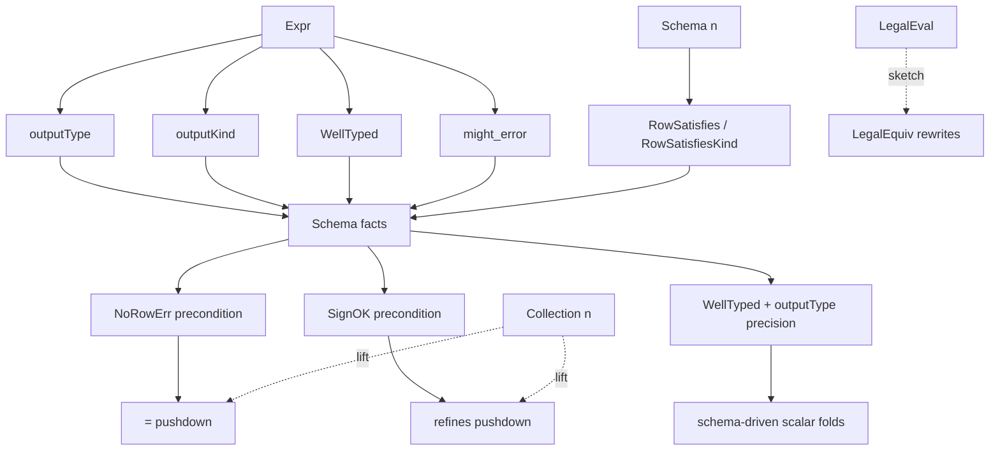

# Semantic model: layers, errors, and equivalence variants

This document is the working reference for the data model and the
equivalence relations the Lean skeleton at `doc/developer/semantics/`
is exploring.
It complements the design doc at
`../design/20260517_error_handling_semantics.md`, which is more
discursive; this file is a layered catalog plus honest notes on what
each variant buys and what it costs.

The model has five layers — `Datum`, `Expression`, `Row`, `Schema`,
`Collection` — and a separate dimension of error semantics that cuts
across all of them.
The skeleton deliberately models a single *collection version* in
the sense of `../platform/formalism.md`: a multiset of rows with
diff multiplicities, no time dimension.
Time-varying collections (TVCs) and frontier reasoning are out of
scope at this layer.
After the layers, this doc summarizes the equivalence relations the
optimizer can pick from and the rewrites each enables.

## Architecture: how the pieces fit

The model has four kinds of object, each at a layer of the
catalog:

* **Analyses** live at the `Expr` layer.
  `Expr.outputType`, `Expr.outputKind`, `Expr.WellTyped`, and
  `Expr.might_error` consume an expression and a `Schema n` and
  produce per-expression schema facts (errable bit, kind, type
  correctness, error reachability).
* **Schema facts** live at the `Schema n` / `Collection n` layer.
  `Schema.cellErrFree`, `Schema.rowErrFree`, `RowSatisfies`,
  `Collection.NoRowErr`.
  Combinators (`Schema.append`, `NoRowErr_filter`,
  `NoRowErr_unionAll`, …) propagate facts through operators.
* **Preconditions** sit on operator rewrites.
  `filter_cross_pushdown_left_strict` requires `NoRowErr`.
  `filter_cross_pushdown_left_refines` weakens that to `SignOK`.
  Future schema-driven scalar folds require `WellTyped` and an
  `outputType` precision bit.
* **Relations** pick which rewrites are admissible.
  `=` is the strict surface; `eqErrSet`, `refines`, `LegalEquiv`
  are progressive relaxations.
  Each precondition discharged by a schema fact unlocks a rewrite
  under one or more relations.

The load-bearing dependency graph: *analyses → schema facts →
preconditions → relation-tagged rewrites*.



The catalog below walks the layers (Datum → Expression → Row →
Schema → Collection); the summary table at the end groups the
relations and the rewrites they admit.

## Datum

`Datum` is the cell-level value type.
The skeleton currently models the four-valued lattice
`{TRUE, FALSE, NULL, ERROR}` plus integers:

```
inductive Datum
  | bool (b : Bool)
  | int  (n : Int)
  | null
  | err  (e : EvalError)
```

`EvalError` is the cell-scoped error payload — currently
`.divisionByZero` and `.overflow`, with the production list
(`src/expr/src/scalar.rs`) much larger.
Numeric, string, and temporal types are intentionally omitted.

The four-valued absorption order is `FALSE > ERROR > NULL > TRUE` for
`AND` (and the dual for `OR`), encoded in `evalAnd` / `evalOr`.
Non-boolean operands (`.int _`) route to `.null` via the catch-all,
closing the codomain of `evalAnd` / `evalOr` to the boolean fragment
`{.bool _, .null, .err _}`. In production, a type-mismatched operand
to `AND` would be caught by the planner type-checker or, failing
that, would panic at runtime — the skeleton's `.null` route is a
sound over-approximation of panic-and-escalate for optimizer
rewrites (any rewrite sound under `.null` is also sound under
panic, because panic strictly removes observable rows).
The `Datum.IsErr` and `Datum.IsInt` predicates are the propositional
witnesses for "this cell errored" and "this cell holds an integer";
laws on arbitrary `Datum` operands of `evalAnd` / `evalOr` carry a
`¬IsInt` hypothesis to rule out the `.null`-routing case.

## Expression

`Expr` is the AST for scalar computations:

```
inductive Expr
  | lit (d : Datum)
  | col (i : Nat)
  | not (a : Expr)
  | ifThen (c t e : Expr)
  | andN (args : List Expr)
  | orN  (args : List Expr)
  | coalesce (args : List Expr)
  | plus / minus / times / divide (a b : Expr)
  | eq / lt (a b : Expr)
```

Binary `Expr.and` / `Expr.or` are sugar over the variadic `andN [a, b]`
/ `orN [a, b]` to match the Rust `MirScalarExpr` variadic-only shape.
Evaluation is the big-step `eval : Env → Expr → Datum`, with
`Env := List Datum` as the positional column lookup.

Static analyses:
* `might_error` — conservatively decides whether an expression can
  raise a cell error.
  Short-circuits literal-false / literal-true absorption and
  literal-nonzero divisors.
* `colReferencesBoundedBy n` — every `.col i` has `i < n`.
  Used as the column-bound hypothesis for predicate pushdown across
  joins.
* `colShift k` — adds `k` to every column reference.
  Used to realign a right-side predicate against the joined env.
* `colReferencesUnused n` — column `n` is never read.
  Used for column-pruning rewrites.

## Row

A row is a length-`n` positional vector of `Datum`s, where the arity
`n` lives in the type:

```
RowN n = List.Vector Datum n
```

The evaluator's `Env = List Datum` is the row "as seen by `eval`":
the arity disappears when the row is handed to a scalar evaluator,
because `eval` is total on `List Datum` (out-of-bounds column
references return `.null` via `Env.get`).
The bridge is `row.toList`.
`Env.get_eq_list_get` and `Env.get_eq_null_of_ge` in
`Mz/PrimEval.lean` capture the evaluator's column-lookup contract.

The indexed form makes arity mismatches unspeakable and surfaces
arity-rewriting obligations (`cross_assoc` needs the cast
`n + m + k = n + (m + k)` via `List.Vector.congr`).

## Schema

Per-column nullability and errability bits plus a collection-level
row-error flag, modeled in `Mz/Schema.lean`. The structural
counterpart to Materialize's `RelationType` on the Rust side.

* `ColSchema { nullable, errable : Bool }` — per-column metadata.
* `Schema n { cols : Vector ColSchema n, rowErrFree : Bool }` — the
  schema as a whole.
* `Schema.free n` — information-free starting point.
* `Schema.append a b` — concatenation, produced by `cross`.

Propositional satisfaction:

* `RowSatisfies sch row` — `¬nullable → row[i] ≠ .null` and
  `¬errable → ¬(row[i]).IsErr` per column.
* `Update.Satisfies sch rec` — row satisfies the column bits *and*
  `sch.rowErrFree → rec.err_diff = 0`.
* `Collection.Satisfies sch s` — every update satisfies.

Schema discharges optimizer obligations whose soundness depends on
column or row-level invariants:

* `NoRowErr_of_satisfies_rowErrFree` — bridge to
  `filter_cross_pushdown_left_strict`'s precondition.
* `evalCoalesce_cons_of_concrete` + `eval_coalesce_pair_of_a_concrete`
  — `coalesce(a, b) = a` when `a` evaluates to a concrete (non-null,
  non-err) value. Schema rider: when `a`'s output column has
  `nullable = false` and `errable = false`, the precondition is
  immediate.
* `NoRowErr_cross` — `cross` preserves row-err-freedom.
* `NoRowErr_filter` — `filter` preserves row-err-freedom when the
  predicate is statically err-free on the input cell schema.
  Combines `might_error_sound` with the schema → `Env.ErrFree`
  bridge `RowSatisfies.toList_ErrFree`.
* `NoRowErr_project` — `project` preserves row-err-freedom
  unconditionally (`projectOne` rewrites `row` but leaves
  `err_diff` untouched).
* `NoRowErr_unionAll` — list concatenation; conjunctive.
* `NoRowErr_negate` — `(-0 : Int) = 0`, so a zero `err_diff`
  stays zero.

Per-column type kind in `Mz/Schema.lean`:

* `ColKind { bool | int | top }` — SQL type tag per column.
  `.top` is the unconstrained / permissive kind (matches any
  expected; captures `.null` / `.err _` literals and untyped
  columns).
* `Schema.kinds : List.Vector ColKind n` — additive field;
  defaults to `.top` per column in `Schema.free`.
* `Schema.append` concatenates kinds along with cols.

Structural type-correctness in `Mz/WellTyped.lean`:

* `Datum.kind d : ColKind` — maps a concrete `Datum` to its
  observable kind (`.null` / `.err _` ↦ `.top`).
* `ColKind.compatible actual expected` — Bool predicate, reflexive
  and `.top`-permissive in both positions.
* `Expr.outputKind sch e : ColKind` — the kind the expression
  produces; precise on `.lit` and the boolean / arithmetic
  fragment, `.top` for conditional and variadic-coalesce.
* `Expr.WellTyped sch e : Prop` — recursive predicate that each
  operator's operands have kinds compatible with what the
  operator expects (`.not` / `.andN` / `.orN` consume bool;
  arithmetic consumes int; `.eq` / `.lt` require same kind on
  both sides). Variadic via mutual recursion through
  `WellTypedArgs` / `WellTypedArgsAllBool`.
* `RowSatisfiesKind sch row` — every cell's kind compatible with
  the schema's declared kind for that column.
* `Expr.kind_of_eval` — soundness theorem: under
  `RowSatisfiesKind`, `(eval row.toList e).kind` is compatible
  with `Expr.outputKind sch e` for every expression. Structural
  recursion on `Expr`; each non-`.col` arm closes via a
  primitive-codomain lemma (`kind_evalPlus`, `kind_evalAnd`,
  etc.) showing that the matching evaluator returns a `Datum`
  whose kind falls in `{outputKind, .top}` regardless of inputs.
  Required tightening `evalNot` to route `.int` to `.null` so its
  codomain is bounded by the boolean fragment; the existing
  `outputType (.not a)` rule weakened from "preserves both bits"
  to `{ nullable := true, errable := outputType(a).errable }` as
  a result.

`WellTyped` is what the optimizer needs to cite to invoke the
precision direction on `outputType`: under well-typing,
type-mismatched operands are ruled out, and `outputType`'s
conservative `nullable := true` for the `.int → .null` catch-all
routes can be tightened to `nullable := input.nullable`.

The first instance — `eval_not_satisfies_precise` in
`Mz/WellTyped.lean` — demonstrates the pattern. The conservative
rule `outputType (.not a) = { nullable := true, errable :=
outputType(a).errable }` is honest under the tightened `evalNot`
(which routes `.int → .null`), but is *misleading* on its own:
for non-null bool or err inputs, evalNot does *not* produce
`.null`. Under the precondition `outputKind a = .bool` (which
rules out `.int` via `kind_of_eval`), the precise schema
`outputType a` is satisfied by `.not a` — preserving both bits
of the input. Optimizers that establish the precondition get the
tighter schema; the conservative form remains the safe default
for arms that can't.

The arithmetic / comparison constructors follow the same
pattern; each needs its own per-case proof. `.not` is the
demonstration; the rest are queued.

Output-schema propagation for `Expr` lives in `Mz/OutputType.lean`:

* `DatumSatisfies cs d` — `Datum` satisfies a `ColSchema` iff the
  `nullable = false` and `errable = false` claims of the schema are
  respected by the datum.
* `Expr.outputType sch e` — derives the output `ColSchema` from
  the input schema. Precise rules for `.lit`, `.col`, and `.not`
  (preserves both bits). Tight `errable`-OR-of-inputs rules for
  `.plus`/`.minus`/`.times`, `.eq`/`.lt`, and `.ifThen` (OR over
  three arms). `nullable := true` on these because the
  four-valued lattice routes type-mismatched operands to `.null`
  even when no input is nullable (e.g. `evalPlus (.bool true)
  (.int 5) = .null`). `.divide` stays conservative (always
  errable for division-by-zero). Variadic `.andN`/`.orN`/
  `.coalesce` remain conservative — mutual-recursion lifts are
  open follow-ups.
* `eval_satisfies_outputType` — soundness theorem. Recursive on
  `Expr` (structural recursion via `match`); each tightened arm
  consumes the matching strictness lemma from `Mz/MightError.lean`
  (`evalNot_not_err`, `evalPlus_not_err`, etc.).

Open obligations on the schema side are listed in
`transforms.md` (sections *Schema-driven rewrites* and
*Output-schema propagation*); that file is the canonical register
of what is and isn't mechanized at the schema layer.

## Collection

A collection is a multiset of rows carrying data and err
multiplicities.
It is the time-stripped slice of `../platform/formalism.md`'s
time-varying collection: a single collection version.
Each entry is an `Update n` (named to match `formalism.md`'s
update-triple vocabulary, minus the time field):

```
structure Update (n : Nat) where
  row : RowN n
  diff : Int      -- data multiplicity, retractable
  err_diff : Int  -- err multiplicity, retractable
```

Both diffs are ordinary `Int`s, retractable to model
differential-dataflow consolidation.
An update with `(diff, err_diff) = (1, 0)` is a valid output;
`(0, 1)` is an erred output; `(1, 1)` is both (rare but representable
under the encoding).
`Collection n = List (Update n)`.

Operators on collections:
* `filter` — preserves `row`, zeroes `diff`, migrates to `err_diff` on
  an `.err` predicate result.
* `project` — applies the projection expression vector pointwise,
  preserving multiplicities; output arity is the projection vector
  length.
* `cross` — concatenates rows; multiplies `diff`s; the cross's
  `err_diff` is the bilinear sum
  `dL · eR + eL · dR + eL · eR`.
  Output arity is `n + m`.
* `negate`, `unionAll` — pointwise multiplicity negation and list
  concatenation.

Time, consolidation, distinct, and aggregate are out of scope at
this layer.
Lifting to a timed collection is additive on top.

### Order-sensitivity caveat

`Collection n` is a `List (Update n)`, so the canonical equivalence
is list equality.
Two collections that are user-observably equal as multisets but
enumerate updates in different orders are *distinct* under `=`.
Concretely, `unionAll a b` and `unionAll b a` are different lists
even though every downstream consumer treats them as equal.

Every "sound under `=`" claim in `transforms.md` is therefore sound
up to the specific list order the operator produces.
Pushdown lemmas at `=` succeed because both sides enumerate updates
in the same order; a fusion that reshapes the enumeration would
not state at `=`.
The natural next step is a `Collection.Equiv` permutation-quotient
(via `List.Perm`) with `=` as a strictly stronger relation used as
a proof shortcut.
That work is open; until it lands, `unionAll` commutativity, `cross`
factor reordering, and any consolidation-style rewrite remain
unstatable.

### Retraction caveat

`Update.diff` and `Update.err_diff` are `Int`, retractable to model
differential-dataflow consolidation.
The model never quotients by consolidation, so a collection
`[(r, 1, 0), (r, -1, 0)]` is *not* equal to `[]` under `=` even
though the user observes them as the same.
Negative diffs propagate through operators correctly but no
theorem witnesses that they cancel — that requires consolidation,
deferred with the time dimension.

This has a second-order effect on the `refines` lift in
`Mz/Collection.lean`.
`Update.refines` says `a.diff = b.diff ∧ a.err_diff ≥ b.err_diff`,
and `filter_cross_pushdown_left_refines` would close unconditionally
if `recL.diff * recR.err_diff ≥ 0`.
On non-negative diffs that's trivial; on signed `Int` diffs it's a
real side condition (`SignOK`).
The frontier is in the diff signature, not the relation — quotienting
by consolidation first (or restricting to non-negative diffs) makes
the lift unconditional.

## Errors

Three error scopes, mostly orthogonal:

* **Cell-scoped** — `Datum::Error(EvalError)`.
  Lives inside a row.
  Carries a structured payload.
  Surface examples: division by zero, integer overflow, decode error
  on a single column.
* **Row-scoped** — `err_diff` on the update (two-diff model)
  *or* a row-carrier variant `(Row | DataflowError)`.
  The row failed as a whole.
  Surface examples: a `Datum::Error` in a projected column that the
  optimizer chose to escalate; a row whose decoder failed before any
  cell was reached.
* **Collection-scoped** — an absorbing element on the diff
  (`DiffWithError`) or a separate flag.
  Once introduced, the entire collection is poisoned.
  Surface examples: a source that lost its prefix; a fatal indexing
  failure during aggregation.
  Currently spec-only; not mechanized in the post-restart skeleton.

The two-diff baseline carries cell and row scopes natively (cell as
`Datum::Error` in the row, row as `err_diff` multiplicity).
Collection scope is documented in the design doc and historically had
a `DiffWithError` mechanization that was removed at restart; it can be
reintroduced as a flag if a forcing function appears.

### Type-mismatch routing: `.null` vs `.err typeMismatch`

The total evaluator handles type-mismatched operands (e.g.
`evalNot (.int 5)`, `evalAnd (.bool true) (.int 5)`) via a
catch-all that routes to `.null`.
Modeling note in `Mz/PrimEval.lean` calls this a sound
over-approximation of panic: any rewrite sound under `.null` is
also sound under panic, because panic strictly removes
observable rows.

Alternative: route to `.err typeMismatch` (with a new
`EvalError.typeMismatch` variant).
The two routings trade which schema bit picks up the conservative
pollution:

| Bit | `.null` route (current) | `.err` route (alternative) |
| --- | --- | --- |
| `nullable` | conservative `true` on every operator whose catch-all is reachable | clean — operators preserve input `nullable` |
| `errable` | clean — type-mismatch doesn't pollute `errable` | conservative `true` on every operator whose catch-all is reachable |

Other trade-offs:

* **Runtime fidelity.** `.err` is closer to Materialize's
  runtime panic — cell-to-row escalation at sinks would push the
  row out of the data stream, ≈ panic. `.null` keeps the row in
  the data stream with a null cell, which is *less* like panic
  but admits more downstream rewrites.
* **`evalNot_not_err` flips.** Under `.err` route,
  `evalNot (.int n) = .err typeMismatch`, so the existing lemma
  `¬a.IsErr → ¬(evalNot a).IsErr` fails on `.int` inputs.
  `Mz/MightError.lean`'s analyzer would have to look at operand
  types to know when `.not` can err — coupling err analysis to
  type analysis.
* **`coalesce` semantics shift.** Under `.null` route,
  `coalesce(.not (.int 5), NULL) = .null`. Under `.err` route,
  `coalesce(.err typeMismatch, NULL) = .null` (per the
  "`null` beats `err`" tiebreak), so `coalesce` rescues type
  errors. Possibly intended; possibly surprising.

### Error-category separation: implementation bugs vs data-dependent runtime errors

Conflating type-mismatch errors with data-dependent runtime
errors (overflow, division-by-zero, decode failures) under a
single `EvalError` tag — or a single `errable` schema bit —
obscures a real distinction:

* **Implementation-bug errors** — type mismatches.
  A function might be analyzed as `¬might_error` and still
  produce an error on invalid input types, but only because the
  planner failed to reject the expression upstream.
  These are signs of a bug above the evaluator, not of valid
  data hitting a hazard.
  Production handles them by panic.
* **Data-dependent runtime errors** — overflow,
  division-by-zero, decode failures, etc.
  Predictable from operands and operator semantics; appear on
  some data inputs and not others.
  Production handles them by escalating the row to the error
  collection.

The current model collapses both into `.err _` with the same
`Datum.IsErr` predicate.
`might_error` analyzes the data-dependent category; type errors
are out-of-scope for that analyzer.
A future refinement could split `EvalError` into
`EvalError.runtime` vs `EvalError.implementationBug` (or carry a
severity tag), letting the schema's `errable` bit track only the
former and giving `might_error` a precise type discipline.
Until that lands, the two routings (`.null` vs
`.err typeMismatch`) are the practical choice and both pick the
same conservative trade.

Current decision: stay with `.null` for proof tractability.
Document the alternative.
Revisit if the design doc commits to cell-to-row escalation at
sinks for type errors, which would force the `.err` route as the
right model — or if the error-category split lands, which would
remove the `errable`-pollution concern entirely.

### Error-category split (forking decision, deferred)

Materialize's runtime conflates two error categories under one
`EvalError` carrier: implementation bugs (planner type errors,
internal-invariant violations) versus data-dependent runtime errors
(overflow, division-by-zero, decode failure).
A future split lets `errable`, `COALESCE` rescue, and operator
escalation distinguish them.
Three placements are documented in the design doc's
*Alternatives → Error-category split (open future)* section:
new `Datum.panic` (A), collection-scoped absorbing marker (B),
`EvalError.implementationBug` payload variant (C).
Current skeleton stays with the unified `.err _` carrier; revisit
when a downstream forcing function (user-visible `is_panic`,
sink-time escalation policy) lands.

### Divergence from PostgreSQL: `coalesce` rescues errors

PG's `coalesce(NULL, 1/0)` evaluates `1/0` (no non-null seen yet)
and raises an error.
This skeleton's `evalCoalesce [.null, .err DivByZero] = .null`:
the "null beats err" tiebreaker promotes `.null` over `.err` when
no concrete value is reached.
The all-null case matches PG; the mixed-null-and-err case does not.

This is a deliberate proposal recorded in the design doc's *SQL
error semantics → Non-strict functions* section: it generalizes
PG `coalesce` so that an err can be rescued the same way a `null`
can.
The consequence — Materialize silently rescues errors PG would
surface — is the single largest behavioral departure in this
catalog, and depends on the design doc's rule that errors are
stronger than `null` for *strict* functions but weaker for
`coalesce`'s rescue role.

### Cell-to-row escalation policy

The two scopes (cell-error in `row`, row-error via `err_diff`) are
modeled as independent; an operator decides per-update whether a
cell error escalates to a row error.
Current per-operator rule in `Mz/Collection.lean`:

* `filter` — predicate `eval` returning `.err _` migrates `diff` into
  `err_diff` (`filterOne` case `.err _`). Cells inside `row` are
  unchanged, so a cell error that didn't reach the predicate stays
  cell-scoped.
* `project` — applies `eval` pointwise; a cell that evaluates to
  `.err _` lands in the output cell. `err_diff` is unchanged.
  Cell errors do *not* escalate to row errors under `project`.
* `cross` — concatenates rows verbatim; bilinear err-diff combines
  the row-level err multiplicities of the two sides. Cells are not
  inspected; cell errors do not escalate.
* `negate`, `unionAll` — multiplicity-only; cells are not inspected;
  no escalation.

Open: `Reduce` and sinks, neither of which is modeled at this
layer. A sink cannot emit a row containing `Datum::Error` to a
downstream system, so its rule must be to escalate cell-err to
row-err. `Reduce`'s rule depends on the aggregate; `SUM` is
strict (cell-err → row-err) per the design doc, `COUNT(*)`
counts the row regardless, `COUNT(expr)` is strict on the expr.

### Two-diff vs separate-collection encoding

Materialize's runtime today carries each logical collection as two
timely streams: `data : Stream<(Row, Int)>` and
`errs : Stream<(DataflowError, Int)>`.
The skeleton's two-diff form and the runtime's separate-collection
form are denotationally close but not equivalent:

* Forward (two-diff → separate-collection) drops the originating
  row from each err update; the err side carries a synthesized
  `DataflowError` payload, either built from the row's cell errors
  or a generic one.
* Reverse (separate-collection → two-diff) drops the structured
  `DataflowError` payload; the err side carries the originating row
  plus `err_diff`.

Neither is a strict superset; the encodings carry orthogonal extra
information.
The skeleton chooses two-diff because the bilinear cross rule lifts
cleanly from the separate-collection product
(`cross (dL, eL) (dR, eR) = (dL × dR, dL × eR ∪ eL × dR ∪ eL × eR)`)
and a single `(diff, err_diff)` record subsumes the "row exists in
both data and error" case that separate-collection splits across
two arrangements.

The skeleton retains the right to project to separate-collection in
the future.
The load-bearing invariant for that projection is that *the err
side of every operator preserves the row carrier*.
`filterOne` honors this (predicate errs migrate `diff → err_diff`
and keep `row` unchanged); `crossOne` honors it (output row is the
append regardless of which side carried the err); the
*Row-scoped errors via carrier replacement* alternative in the
design doc is rejected precisely because it breaks the invariant.
See the design doc's *Sum-type row carrier* alternative for the
encoding closest to the runtime's separate-collection form.

## Equivalence relations explored

SQL leaves evaluation order unspecified outside `CASE`, `AND` / `OR`
short-circuit, and a few other places.
Any optimizer rewrite that touches errors must therefore live above
strict equality on `Datum`.
The skeleton catalogs four candidate relations in `Mz/Equiv.lean` plus
two more discovered during the indexed-arity pilot.

### Strict equality (`=`)

Reference relation.
Closes the data-side laws cleanly: filter / project fuse, identity
laws of `AND` / `OR`, idempotence, `evalPlus` associativity over
unbounded `Int`.

Counterexamples (mechanized in `Mz/EquivBounded.lean`,
`Mz/Equiv.lean`):
* `evalAnd` not commutative on err / err inputs (left-bias).
* `evalPlusBounded` not associative at the bounded-int boundary.
  The main `evalPlus` is on Lean's unbounded `Int` and is
  associative; the bounded form lives in `Mz/EquivBounded.lean` and
  surfaces the boundary counterexample needed by the design-doc
  argument that errors force a non-equality relation.
* `filter_cross_pushdown_left` unsound when right collection has
  `err_diff > 0` (witnessed by
  `filterOne_cross_pushdown_left_unsound`).
  This is the canonical case where the encoding choice (two-diff
  vs separate-collection) determines whether the rewrite holds.
  Any encoding in which err multiplicity participates in the
  cross's multiplication rule produces this gap — the separate-
  collection encoding avoids it precisely because errs do not
  multiply against data on its cross.
  The skeleton chose two-diff for the cleaner bilinear cross rule
  and accepts the pushdown obstruction as the cost; the rewrite
  ships either under `eraseRowErr` (interior), under a static
  `rowErrFree` schema fact, or — eventually — under a lifted
  `refines`. See `transforms.md` "Filter / project / cross
  pushdown" for the three windows.

### Error-set equivalence (`eqErrSet`)

`a.eqErrSet b := a = b ∨ (a.IsErr ∧ b.IsErr)`.
Collapses all `.err` payloads into one equivalence class.

What it buys: recovers `evalAnd` commutativity on err / err
(`evalAnd_err_err_eqErrSet_comm`).
What it does not buy: bounded-int associativity (one side is err, the
other value; relation requires both errs or strict equality);
predicate pushdown over `cross` on the err side (update-level carrier
mismatch survives the relation).

### Refinement preorder (`refines`, errors as bottom)

`a.refines b := a = b ∨ a.IsErr`.
Asymmetric.
"Transformed result loses an error" is admissible.

Posture: "no spurious errors" — the transformed result has no errors
the original did not have.

The lift of `Datum.refines` to `Update` / `Collection` is
mechanized in `Mz/Collection.lean`:

* `Row.refines a b := ∀ i : Fin n, (a.get i).refines (b.get i)`.
* `Update.refines a b := Row.refines a.row b.row ∧ a.diff = b.diff
  ∧ a.err_diff ≥ b.err_diff` (data multiplicity equal; err
  multiplicity allowed to drop).
* `Collection.refines` — recursive pointwise on equal-length
  lists.

Pushdown `filter_cross_pushdown_left` is **mechanized at the
collection level** under a sign side condition
`SignOK sL sR := ∀ recL ∈ sL, ∀ recR ∈ sR, 0 ≤ recL.diff *
recR.err_diff` (`filter_cross_pushdown_left_refines`). The
condition is needed because cross's catch-all branch gives
`LHS.err_diff − RHS.err_diff = recL.diff * recR.err_diff`, which
may be negative under `Int` retractions; non-negative diffs (the
operational regime before consolidation retracts) discharge
`SignOK` trivially. The lift is therefore *not* unconditional, but
strictly weaker than the `NoRowErr sR` precondition that the
strict-equality form requires. The reverse direction is unsound.

### Row-level err erasure (`eraseRowErr`) — interior lemma, not a user-facing relation

`recA.eraseRowErr.diff = recB.eraseRowErr.diff ∧ rows equal`, ignoring
`err_diff`.
Equivalence relation.

**Scope.** `eraseRowErr` zeroes only the row-level err multiplicity
(`err_diff`). The `row` carrier is preserved verbatim — *cell-level
errors inside the row are not erased*. Two updates with the same
multiplicities but different `.err _` cells in `row` are still
distinguished under this relation. The name was `eraseErr` in an
earlier iteration; the rename to `eraseRowErr` captures the scope
honestly. Rewrites that flip a `.bool false` cell to an `.err _`
cell are *not* admitted by `eraseRowErr`.

What it buys: `filter_cross_pushdown_left_data` closes for every
branch of the predicate evaluation
(`filterOne_cross_pushdown_left_data` per update, lifted via
`List.map`).
What it costs: erases the user-visible distinction between "row
filtered out" and "row errored" *at the row-multiplicity level*.

For Materialize, errors are observable in the runtime's error
collection, so `eraseRowErr` cannot underwrite any rewrite the user
can see at the row-multiplicity dimension.
It is strictly an interior fact: a rewrite that preserves
`eraseRowErr` still has to be paired with an err-side argument
(`refines`, schema-driven `rowErrFree`, or a non-determinism
quotient) before it ships.
The summary table at the end of this file lists `eraseRowErr` for
completeness, but it is not a candidate user-facing surface.

### Non-determinism (`LegalEval`, foundation sketched)

A relational `LegalEval env e d : Prop` replaces `eval : Env →
Expr → Datum` with "`d` is admissible under *some* legal SQL
evaluation order". Each `Expr` denotes a *set* of `Datum`s. The
deterministic `eval` is one legal outcome
(`legal_of_eval : LegalEval env e (eval env e)`); other admissible
outcomes correspond to other strategies.

**Scope of the current implementation.**
The mechanized `LegalEval` covers binary err-payload
non-determinism only: `Ok` via the deterministic primitive plus
`ErrL` / `ErrR` admit either err payload symmetrically for each
binary op.
Variadic short-circuit (`FALSE AND (1/0)` admitting both outcomes),
collection-level lift, and data-side commutativity are deferred.
This is the foundation, not a SQL-faithful relational eval yet —
the cases where the relational form matters most (short-circuit
absorption, bounded-int associativity over chains) are still to do.

What's mechanized in `Mz/Legal.lean`:

* `LegalEval` inductive with rules for `.lit`, `.col`, `.not`,
  `.ifThen` (SQL-pinned), and binary arithmetic / comparison.
* `.andN` / `.orN` / `.coalesce` deterministic via `eval` (one
  legal outcome only).
* `legal_of_eval` — the deterministic `eval` produces a legal
  outcome.
* `legal_plus_err_either` — both err payloads of
  `(.err e₁) + (.err e₂)` are admissible.
* `LegalEquiv` / `LegalSubsume` — set-equality / set-inclusion
  candidate equivalence relations on `Expr`.
* `plus_comm_legal_errL_to_errR` / `_errR_to_errL` — err-side
  commutativity of `.plus`.

Open follow-ups before this becomes the SQL-faithful posture:

* Variadic short-circuit admissibility (`.andN` / `.orN`).
* Data-side commutativity of binary ops (needs primitive
  `evalPlus_comm_of_no_err` lemma plus a `LegalEval` invariant on
  non-err outcomes).
* Bounded-int associativity: `(x+1)-1` and `x+(1-1)` admit the
  same set of outcomes under `LegalEquiv` (the err and the value
  are both in the set).
* Collection-level lift: `filter` / `project` / `cross` rephrased
  to take a relational scalar evaluator, or `Collection.refines`
  generalized to absorb relational outcomes.

### Per-error-payload diff (open alternative)

`Diff = Int × (EvalError → Int)` with the bilinear cross rule.
Retains structured error payloads through multiplicities.
Open question in the design doc.

Lean evidence accumulated before the restart:
* The bilinear multiplication is a semiring (proved).
* `predicate_pushdown` over `Cross(L, R)` is provably *unsound* under
  this encoding (counterexample mechanized then preserved in branch
  history; documented in `Mz/Equiv.lean` counterexamples docstring).
  This is the same finding the two-diff `eraseRowErr` analysis
  re-derives: the err side does not commute with cross under any
  encoding that multiplies err multiplicity against data multiplicity.

## Summary tables

### Active mechanized layers and relations

Relations and analyses a planner can cite today.

| Layer / variant            | Mechanization                | Sound under                | Open under                                |
| -------------------------- | ---------------------------- | -------------------------- | ----------------------------------------- |
| `Datum`                    | `Mz/Datum.lean`              | —                          | overflow / decode / division-by-zero only |
| `Expr.eval`                | `Mz/Eval.lean`               | `=` (on unbounded `Int`)   | strict eval order (no non-determinism); bounded-int counter at `Mz/EquivBounded.lean` |
| `RowN n = Vector Datum n`  | `Mz/Collection.lean`         | `=`                        | indexed-arity reasoning verified          |
| `Collection n` (two-diff)  | `Mz/Collection.lean`         | `=` on data side           | err side under `eraseRowErr` / `refines` |
| `eqErrSet`                 | `Mz/Equiv.lean`              | err / err commutativity    | bounded-int assoc, pushdown over cross    |
| `refines`                  | `Mz/Equiv.lean` + `Mz/Collection.lean` | pushdown LHS → RHS under `SignOK` side condition | rewrites that add err; unconditional pushdown |
| `NoRowErr` precondition    | `Mz/Collection.lean`         | pushdown under `=`         | filter preservation needs static pred     |
| `Schema n` (sketch)        | `Mz/Schema.lean`             | coalesce id, cross row-err | project output-schema rules               |
| `Expr.outputType`          | `Mz/OutputType.lean`         | `=` on `.lit` and `.col`   | non-foundational constructors weakest     |
| `Expr.WellTyped`           | `Mz/WellTyped.lean`          | structural predicate + `kind_of_eval` soundness | precision direction on `outputType` open |

### Sketches and history

Relations that are mechanized as foundations / interior lemmas but
not yet usable as user-facing surfaces, plus historical encodings
preserved for the design-doc record.

| Layer / variant            | Status                       | What it buys                                | What's missing                            |
| -------------------------- | ---------------------------- | ------------------------------------------- | ----------------------------------------- |
| `eraseRowErr`              | `Mz/Collection.lean`, interior lemma | filter / cross pushdown — data side only | not user-facing; must pair with err-side argument |
| `LegalEval`                | `Mz/Legal.lean`, foundation  | binary err-payload non-determinism, err-side commutativity | variadic short-circuit, data-side comm, collection lift |
| Per-payload `(Int×ErrCnt)` | branch history               | `=` on commutative-monoid                    | pushdown over cross provably unsound      |
| Collection-scoped diff     | spec-only (design doc §"Global-scoped errors") | absorbing-marker semantics for global failures | not mechanized                            |

The remaining open obligations live primarily on the err side of
operators that mix updates — `cross`, `join`, aggregates over erred
inputs.
The catalog above is the map of which equivalence relation makes which
rewrite go through; the open question driving the design doc is which
of these to settle on as the user-facing surface.

## See also

* `../design/20260517_error_handling_semantics.md` — design doc with
  the discursive treatment of the same material plus alternatives.
* `../platform/formalism.md` — the system-level model in which a
  collection is a time-varying object; this skeleton's `Collection n`
  is the time-stripped slice.
* `transforms.md` — catalog of transforms we want to model and
  their soundness windows.
* `Mz/Equiv.lean` and `Mz/EquivBounded.lean` — the equivalence
  relations and the live bounded-arithmetic counterexample.
* `Mz/Collection.lean` — the indexed-arity collection model and its
  `filter_cross_pushdown_left` finding.
