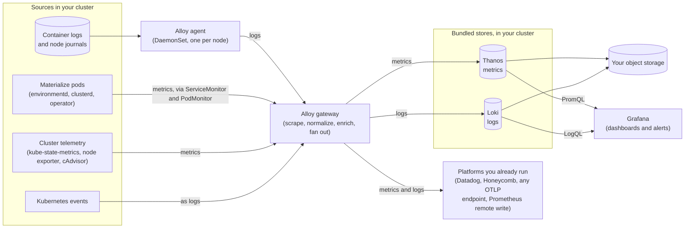

Materialize captures and stores logs and metrics.

1. A **Grafana Alloy agent** runs as a DaemonSet on every node and tails
   container logs.

1. A **Grafana Alloy gateway** does the processing. It receives logs from the
   agents, collects Kubernetes events, and scrapes metrics from Materialize and
   from the cluster using the `ServiceMonitor` and `PodMonitor` resources the
   chart installs. It normalizes and enriches both streams.

1. The gateway **forwards** each stream to one or more destinations. Metrics go
   to any number of metric backends, and logs to any number of log backends.

The default install points the gateway at storage that runs inside your cluster:
**Thanos** for metrics and **Loki** for logs, both persisting to object storage
the Terraform modules create. Neither is something you interact with directly.
You query them through Grafana, and you can add or replace them without changing
how anything is collected.

Because the fan-out happens at the gateway, every destination is configured in
one place, and each one receives its own independently filtered copy.
