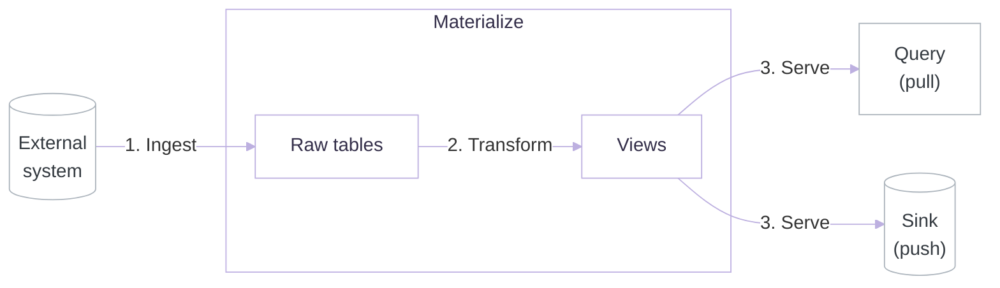

Materialize is designed to transform and serve operational data with the [highest freshness and lowest query latency](/concepts/reaction-time/), with [strong consistency](/get-started/#strong-consistency-guarantees) by default. This page covers how much load and throughput Materialize can sustain while preserving all three, so you can assess Materialize against a specific workload, size compute requirements, and estimate potential cost.

## Approach

At a high level, Materialize ingests data from external systems, joins and transforms it into real-time views, and serves those views to apps and agents over SQL, Kafka, or MCP. Alongside the end-to-end latency from ingestion to serving, it is important to understand performance at each individual step:

1. **[Ingest](/ingest-data/)**: ingesting data from an external system and making it available for use.
2. **[Transform](/transform-data/)**: joining and shaping ingested data into real-time views.
3. **[Serve](/serve-results/)**: serving data to queries, or pushing data downstream to sinks.


These are indicative numbers. For more accurate results, test against your own workload and data.


## Ingest

Ingest performance is measured with four benchmarks: sustained throughput, snapshot throughput, snapshot impact, and horizontal scaling. Each benchmark uses the same setup: a [k6](https://k6.io) load generator writes into the database, Materialize ingests the changes, and probes measure throughput, completion time, and latency.

- **Database**: PostgreSQL 18, db.r6g.2xlarge (8 vCPU, 64 GB).
- **Schema**: a bigint key with two text columns and two timestamps (~100 bytes per row).
- **Load driver**: k6, c7g.4xlarge (16 vCPU, 32 GB).

PostgreSQL is used as the external system, as a widely used operational database and a common change data capture (CDC) source.

### Key concepts

- **[Source](/concepts/sources/)**: A representation of an external system and the data to ingest from it, such as a PostgreSQL database and a subset of its tables, or a Kafka topic. In Materialize, you can create multiple sources against the same external system.
- **[Cluster](/concepts/clusters/)**: A pool of compute (CPU, memory, and disk) that runs a workload.
- **[Cluster size](/self-managed-deployments/appendix/appendix-cluster-sizes/)**: A value from 25cc to 6400cc that specifies how much CPU, memory, and disk a cluster has.
- **Writers**: The number of parallel connections writing to the database.
- **Batch size**: The number of rows written per transaction.

### Benchmark: Sustained throughput

Sustained throughput is the maximum write throughput Materialize can ingest from a single source while staying within a latency target. It is measured by increasing the write rate until p99 latency exceeds two seconds, where latency is defined as the time from a write being committed to the database to that data becoming available in Materialize. It shows that Materialize can process tens of thousands of writes a second, even on a small cluster.

- **Tables**: 1.
- **Batch size**: 100.
- **Run**: 10 minutes.

#### Results






| Cluster size | Writers | Throughput | P50 latency | P99 latency | Max latency |
|---|---|---|---|---|---|
| 100cc | 1 | ~34,000 rows/s | 0.6 s | 1.1 s | 1.3 s |
| 100cc | 2 | ~67,000 rows/s | 0.7 s | 1.3 s | 1.6 s |
| 400cc | 1 | ~38,000 rows/s | 0.6 s | 1.1 s | 1.2 s |
| 400cc | 2 | ~66,000 rows/s | 0.6 s | 1.2 s | 2.4 s |
| 1600cc | 1 | ~36,000 rows/s | 0.6 s | 1.1 s | 1.3 s |
| 1600cc | 2 | ~67,000 rows/s | 0.6 s | 1.1 s | 1.2 s |




### Benchmark: Snapshot throughput

Snapshot throughput is the rate at which Materialize completes the [initial snapshot](/ingest-data/#snapshotting) of a source. It is measured by timing the snapshot of a fixed dataset to completion, across different cluster sizes and table counts. It shows that Materialize ingests a source's data quickly, even for large initial datasets.

- **Writers**: 8.
- **Rows**: 100 million (~10 GB) per table.

#### Results






| Cluster size | Tables | Throughput | Snapshot time |
|---|---|---|---|
| 25cc | 1 | ~98,000 rows/s | ~17 min (1024 s) |
| 25cc | 2 | ~101,000 rows/s | ~33 min (1984 s) |
| 25cc | 4 | ~102,000 rows/s | ~65 min (3904 s) |
| 100cc | 1 | ~330,000 rows/s | ~5 min (304 s) |
| 100cc | 2 | ~368,000 rows/s | ~9 min (544 s) |
| 100cc | 4 | ~391,000 rows/s | ~17 min (1023 s) |
| 400cc | 1 | ~810,000 rows/s | ~2 min (123 s) |
| 400cc | 2 | ~1,090,000 rows/s | ~3 min (184 s) |
| 400cc | 4 | ~1,320,000 rows/s | ~5 min (304 s) |
| 1600cc | 1 | ~810,000 rows/s | ~2 min (124 s) |
| 1600cc | 2 | ~1,610,000 rows/s | ~2 min (124 s) |
| 1600cc | 4 | ~2,190,000 rows/s | ~3 min (183 s) |




### Benchmark: Snapshot impact

Snapshot impact is the load Materialize places on the database when processing the initial snapshot. It is measured by recording peak load during snapshotting, across different cluster sizes and table counts, while the database also handles a steady write workload that simulates normal traffic. It shows that Materialize can safely run against production databases without overwhelming CPU or replication slots, and that you can control that impact by adjusting cluster size.

- **Writers**: 8.
- **Write rate**: ~4,000 writes/s.
- **Rows**: 100 million (~10 GB) per table.

#### Results






| Cluster size | Tables | CPU | Replication slot | Network out |
|---|---|---|---|---|
| 25cc | 1 | 8% | 12.4 KB | 13 MB/s |
| 25cc | 2 | 2% | 12.4 KB | 14 MB/s |
| 25cc | 4 | 2% | 12.4 KB | 14 MB/s |
| 100cc | 1 | 6% | 12.4 KB | 51 MB/s |
| 100cc | 2 | 6% | 12.4 KB | 51 MB/s |
| 100cc | 4 | 6% | 12.4 KB | 51 MB/s |
| 400cc | 1 | 16% | 12.4 KB | 134 MB/s |
| 400cc | 2 | 21% | 12.4 KB | 201 MB/s |
| 400cc | 4 | 21% | 12.4 KB | 204 MB/s |
| 1600cc | 1 | 9% | 12.4 KB | 165 MB/s |
| 1600cc | 2 | 42% | 12.4 KB | 333 MB/s |
| 1600cc | 4 | 59% | 12.4 KB | 505 MB/s |




### Benchmark: Horizontal scaling

Horizontal scaling is how many sources Materialize can ingest in parallel on a fixed cluster while staying within the latency target. It is measured by increasing the number of sources, at one and five tables per source, and recording p99 latency. It shows that many sources can share a single cluster within the latency target, more when each carries fewer tables.

- **Cluster size**: 800cc.
- **Write rate**: ~800 writes/s.
- **Writers**: 1.
- **Batch size**: 1.
- **Run**: 10 minutes.

#### Results






| Tables per source | Sources | P50 latency | P99 latency | Max latency |
|---|---|---|---|---|
| 1 | 1 | 0.6 s | 1.0 s | 1.1 s |
| 1 | 2 | 0.5 s | 1.1 s | 1.2 s |
| 1 | 4 | 0.6 s | 1.1 s | 1.2 s |
| 1 | 8 | 0.6 s | 1.1 s | 1.6 s |
| 1 | 16 | 0.6 s | 1.1 s | 1.1 s |
| 5 | 1 | 0.7 s | 1.3 s | 1.4 s |
| 5 | 2 | 0.8 s | 1.3 s | 1.5 s |
| 5 | 4 | 0.7 s | 1.3 s | 1.4 s |
| 5 | 8 | 0.8 s | 1.3 s | 1.7 s |
| 5 | 16 | 0.8 s | 1.9 s | 3.8 s |




## Transform

Coming soon.

## Serve

Coming soon.
