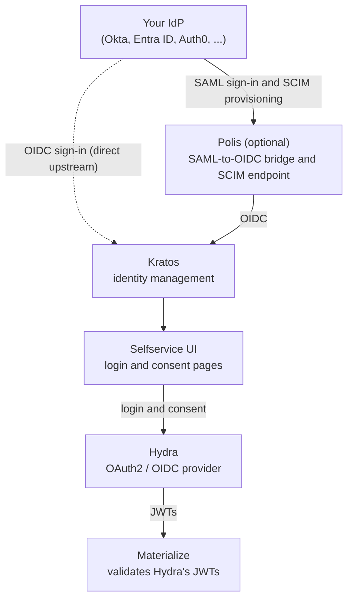



Self-Managed Materialize supports OIDC sign-in directly, as described in
[Simple SSO (OIDC)](/self-managed-deployments/sso/oidc/). For **SAML**, **SCIM
provisioning**, or **federation through an IdP-agnostic proxy**, Materialize
provides an additional Terraform-managed stack that sits in front of
Materialize and acts as the OIDC issuer.

This section walks through deploying that stack, configuring it against your
identity provider, and operating it day to day.

## How it works

### Architecture

When a user opens the Materialize Console, the console redirects to Hydra,
which hands the login to the selfservice UI. The user signs in through your
IdP, either over SAML through Polis or directly over OIDC. Kratos records the
identity, and Hydra issues the tokens the console uses. Materialize validates
each token against Hydra's signing keys and maps the `email` claim to a SQL
role, creating the role on first sign-in.

### Powered by Ory

The stack is built from [Ory](https://www.ory.sh/docs/) components:

| Component | Role |
|---|---|
| **Polis** | Optional. Acts as the SAML service provider for your IdP, translates SAML to OIDC for Kratos, and serves the SCIM endpoint for IdP-driven user provisioning. |
| **Kratos** | Stores identities, runs the login flow, and federates upstream OIDC providers. |
| **Selfservice UI** | Renders the login and consent pages, and mediates between the browser and Kratos and Hydra. |
| **Hydra** | The OAuth2 and OIDC authorization server that Materialize trusts. Issues the JWTs. |
| **Materialize** | The protected application. Trusts Hydra's JWTs and creates SQL roles from the `email` claim on first sign-in. |

Each component is deployed and managed by the Terraform modules in
[`materialize-terraform-self-managed`](https://github.com/MaterializeInc/materialize-terraform-self-managed).
The composite `ory-stack` module wires them together and handles the
integration with your Materialize instance (OAuth2 client registration,
network policies, console TLS).

### What gets deployed

When you apply one of the enterprise examples, Terraform stands up:

- A Kubernetes cluster (AKS / GKE / EKS) sized for both Materialize and Ory
- A Materialize PostgreSQL instance (Cloud SQL / Flexible Server / RDS)
- A separate PostgreSQL instance (or set of databases on a shared instance,
  depending on cloud) for Kratos, Hydra, and Polis
- Object storage for Materialize's persistence backend
- The Materialize operator and a Materialize instance CR
- Kratos, Hydra, and the selfservice UI in the `ory` namespace
- Optional: Polis in the same namespace, with its own TLS termination
  proxy
- cert-manager, with either a self-signed or BYO ClusterIssuer for the
  browser-facing TLS certificates
- Optional: Prometheus and Grafana for observability

If Materialize is already running, you can add only the SSO components. See
[Add to an existing installation](/self-managed-deployments/sso/advanced/existing-installation/).

## What to expect

### Roles involved

Standing up this stack is usually a multi-party effort, though on a smaller
team one person often wears several of these hats.

| Role | Owns | Pages |
|---|---|---|
| Materialize / infra admin | Gathers the prerequisites, then runs the Terraform: sets tfvars (including `enable_polis`, the browser-facing FQDNs, and `saml_providers`), places `idp-metadata.xml` next to the tfvars, and applies. The module wires OIDC into Materialize. | [Prerequisites](/self-managed-deployments/sso/advanced/prerequisites/), the install pages, and [Configure identity providers](/self-managed-deployments/sso/advanced/identity-providers/) |
| IdP / Okta admin | Creates the SAML app (and the optional SCIM app): sets the ACS URL to `https://<your-polis-hostname>/api/oauth/saml` and the audience to `https://saml.boxyhq.com`, exports the IdP metadata XML, assigns users and groups, and hands the metadata (plus the SCIM token) back to the infra admin. | [Configure identity providers](/self-managed-deployments/sso/advanced/identity-providers/) |
| DNS owner | Creates the A / CNAME records pointing at the LoadBalancer IPs after the first apply, so cert-manager can issue the browser-facing TLS certificates. | The install pages and [Prerequisites](/self-managed-deployments/sso/advanced/prerequisites/) |

### Steps involved

End to end, the handoffs run in this order:

1. The Materialize admin gathers the [prerequisites](/self-managed-deployments/sso/advanced/prerequisites/), including a license key that includes the advanced SSO entitlement.
2. The IdP admin creates the SAML application and exports its metadata XML.
3. The Materialize admin applies Terraform with Polis enabled and `idp-metadata.xml` in place.
4. The DNS owner creates the DNS records, and cert-manager issues the TLS certificates.
5. The Materialize admin registers the Polis SAML connection, adds the `saml_providers` block, and re-applies.
6. Optionally, the IdP admin enables SCIM provisioning.
7. Verify sign-in from the Materialize Console.

## Next steps

Work through these pages in order:

1. **[Prerequisites](/self-managed-deployments/sso/advanced/prerequisites/)**: license key, DNS, cert-manager, and Polis requirements
2. **Install**: either [add the stack to an existing installation](/self-managed-deployments/sso/advanced/existing-installation/), or deploy a new one on [Azure](/self-managed-deployments/sso/advanced/install-on-azure/), [GCP](/self-managed-deployments/sso/advanced/install-on-gcp/), or [AWS](/self-managed-deployments/sso/advanced/install-on-aws/)
3. **[Configure identity providers](/self-managed-deployments/sso/advanced/identity-providers/)**: direct OIDC, SAML via Polis, and SCIM provisioning
4. **[Enable role mapping](/self-managed-deployments/sso/advanced/role-mapping/)**: grant Materialize roles from IdP groups
5. **[Operations](/self-managed-deployments/sso/advanced/operations/)**: day-2 tasks such as rotating credentials, adding OAuth2 clients, and managing identities
6. **[Troubleshooting](/self-managed-deployments/sso/advanced/troubleshooting/)**: common errors and fixes
