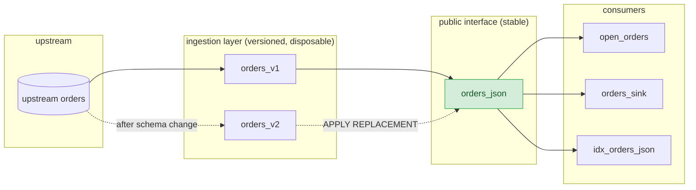

When you create a table from a source, its columns are pinned to the upstream
schema as it existed at that moment. This applies to every source type that
supports [`CREATE TABLE ... FROM SOURCE`](/sql/create-table/): PostgreSQL,
MySQL, SQL Server, and Kafka. Incorporating a schema change means creating a *new* table from the
same source reference, which means recreating every view, index, and sink built
on top of the old one. Every consumer has to be reconfigured, and each
reprocesses its data from scratch.

Instead, publish a single schema-agnostic materialized view whose output type
never changes and absorb schema changes behind it. Downstream objects are never
recreated, and consumers only receive updates for rows whose data actually
changed.

## Overview

The pattern has two halves:

- A stable public interface: a materialized view with exactly one `jsonb`
  column, produced by `to_jsonb()` over the ingesting table. Its output type
  never varies, so it stays replacement-compatible across any upstream schema
  change.

- An interchangeable ingestion layer: versioned tables
  (`orders_v1`, `orders_v2`, ...) created from the same source reference. When
  the upstream schema changes, you create a new table and swap it in underneath
  the public interface using [`ALTER MATERIALIZED VIEW ... APPLY
  REPLACEMENT`](/sql/alter-materialized-view/).



{}

## Create the public interface

### Step 1. Create the source and the first ingesting table

Create the source, then create a table from it. The rest of this page uses
`src` for the source and `orders_v1` for the first ingesting table.



```mzsql
CREATE SOURCE src
  IN CLUSTER ingest_cluster
  FROM POSTGRES CONNECTION pg_conn (PUBLICATION 'mz_pub');

CREATE TABLE orders_v1 FROM SOURCE src (REFERENCE public.orders);
```


```mzsql
CREATE SOURCE src
  IN CLUSTER ingest_cluster
  FROM MYSQL CONNECTION mysql_conn;

CREATE TABLE orders_v1 FROM SOURCE src (REFERENCE shop.orders);
```


```mzsql
CREATE SOURCE src
  IN CLUSTER ingest_cluster
  FROM SQL SERVER CONNECTION mssql_conn;

CREATE TABLE orders_v1 FROM SOURCE src (REFERENCE dbo.orders);
```


```mzsql
CREATE SOURCE src
  IN CLUSTER ingest_cluster
  FROM KAFKA CONNECTION kafka_conn (TOPIC 'orders');

CREATE TABLE orders_v1 FROM SOURCE src
  FORMAT AVRO USING CONFLUENT SCHEMA REGISTRY CONNECTION csr_conn;
```




This pattern requires `CREATE TABLE ... FROM SOURCE`. The legacy source syntax
creates subsources automatically and does not support upstream schema changes.


### Step 2. Create the schema-agnostic materialized view

```mzsql
CREATE MATERIALIZED VIEW orders_json
  IN CLUSTER compute_cluster
AS
SELECT coalesce(jsonb_strip_nulls(to_jsonb(t)), '{}'::jsonb) AS data
FROM orders_v1 t;
```

`jsonb_strip_nulls()` keeps a swap cheap by giving a row whose new column is
`NULL` a byte-identical JSON representation before and after, so Materialize
computes no diff for it. Without it, every row is retracted and reinserted to
add a key whose value is `null`.

`coalesce(..., '{}'::jsonb)` pins the column's nullability. A replacement
materialized view must declare the [same output
schema](/transform-data/updating-materialized-views/replace-materialized-view/)
as its target, *including nullability*. Materialize infers
`jsonb_strip_nulls(to_jsonb(t))` as `NOT NULL` when every column of `t` is `NOT
NULL`, and as nullable otherwise. So the first nullable column added upstream
would change the inferred nullability of the public interface and cause the
replacement to be rejected:

```
ERROR:  replacement schema differs from target schema
DETAIL:  column "data" at position 1: nullability mismatch
         (target: NOT NULL, replacement: NULL)
```

`to_jsonb()` of a row is never `NULL`, so the `coalesce()` branch is
unreachable and only fixes the inferred type.


Include `coalesce()` in the original view definition. Adding it later
requires dropping and recreating the public interface.


### Step 3. Build consumers on the public interface

Downstream objects reference `orders_json` and never the versioned tables:

```mzsql
CREATE VIEW open_orders AS
SELECT (data->>'id')::bigint    AS id,
       data->>'customer'        AS customer,
       (data->>'amount')::numeric AS amount
FROM orders_json
WHERE data->>'status' = 'open';

CREATE INDEX idx_orders_json
  IN CLUSTER serving_cluster
  ON orders_json (data);
```


Extract fields with `->>` and an explicit cast rather than `->`. The `->>`
operator returns `text` regardless of the underlying JSON scalar type, so a
consumer written this way keeps working if an upstream column changes from
`integer` to `text`.


## Detect upstream schema changes

Materialize does not notify you when an upstream schema changes. For PostgreSQL,
MySQL, and SQL Server sources, refresh the source's view of the upstream catalog
and compare it against the columns you are ingesting.

`ALTER SOURCE ... REFRESH REFERENCES` re-reads the upstream catalog and updates
`mz_internal.mz_source_references` without restarting ingestion or triggering a
re-snapshot.

```mzsql
ALTER SOURCE src REFRESH REFERENCES;
```

The query below compares upstream columns against ingested columns and reports
two signals, because neither alone covers every kind of change:

- `column_drift` — a column was added or removed upstream. Detected
  *proactively*: column additions do not interrupt ingestion, so you can
  schedule the migration.
- `stalled` — the ingesting table has already failed. Detected *reactively*.
  Column drops and type changes stall ingestion the moment the upstream DDL
  commits, and a type change is not visible as a column-name difference at all.

```mzsql
WITH source_tables AS (
    -- one row per ingesting table, for every relational source type
    SELECT id, schema_name, table_name FROM mz_internal.mz_postgres_source_tables
    UNION ALL
    SELECT id, schema_name, table_name FROM mz_internal.mz_mysql_source_tables
    UNION ALL
    SELECT id, schema_name, table_name FROM mz_internal.mz_sql_server_source_tables
),
ingesting AS (
    SELECT t.id                                     AS table_id,
           t.source_id,
           d.name || '.' || s.name || '.' || t.name AS mz_table,
           sti.schema_name                          AS up_schema,
           sti.table_name                           AS up_table,
           array_agg(c.name ORDER BY c.position)    AS mz_columns
    FROM mz_tables t
    JOIN source_tables sti ON sti.id = t.id
    JOIN mz_schemas   s ON s.id = t.schema_id
    JOIN mz_databases d ON d.id = s.database_id
    JOIN mz_columns   c ON c.id = t.id
    GROUP BY t.id, t.source_id, d.name, s.name, t.name,
             sti.schema_name, sti.table_name
),
joined AS (
    SELECT i.*,
           r.columns    AS upstream_columns,
           r.updated_at AS refs_refreshed_at,
           st.status,
           st.error
    FROM ingesting i
    JOIN mz_internal.mz_source_references r
      ON  r.source_id = i.source_id
     AND  r.namespace = i.up_schema
     AND  r.name      = i.up_table
    LEFT JOIN mz_internal.mz_source_statuses st ON st.id = i.table_id
)
SELECT mz_table,
       up_schema || '.' || up_table AS upstream_table,
       CASE WHEN status = 'stalled' THEN 'stalled' ELSE 'column_drift' END AS signal,
       status,
       (SELECT coalesce(array_agg(x ORDER BY x), '{}'::text[])
          FROM unnest(upstream_columns) x
         WHERE NOT (x = ANY (mz_columns)))       AS added_upstream,
       (SELECT coalesce(array_agg(x ORDER BY x), '{}'::text[])
          FROM unnest(mz_columns) x
         WHERE NOT (x = ANY (upstream_columns))) AS dropped_upstream,
       refs_refreshed_at,
       left(coalesce(error, ''), 80) AS error
FROM joined
WHERE status = 'stalled'
   OR mz_columns::text[] <> upstream_columns::text[]
ORDER BY mz_table;
```

An empty result means every ingesting table matches its upstream reference. Any
row is an action item. After adding a `channel` column upstream:

```
            mz_table           | upstream_table |    signal    | status  | added_upstream | dropped_upstream
-------------------------------+----------------+--------------+---------+----------------+------------------
 materialize.public.morders_v1 | shop.orders    | column_drift | running | {region}       | {}
 materialize.public.porders_v1 | public.orders  | column_drift | running | {channel}      | {}
```

The query covers PostgreSQL, MySQL, and SQL Server sources in one result set.
Kafka tables are omitted deliberately: their columns come from the Avro reader
schema pinned at `CREATE TABLE`, not from an upstream catalog, so there is no
column list to diff against. See [Kafka sources](#kafka-sources).


`mz_internal.mz_source_references` records upstream column names only; it
carries no type information. A column type change produces no `column_drift`
signal, so the `stalled` check is required.


If a table was intentionally created with a column subset — via `EXCLUDE
COLUMNS`, as in [Absorb a column drop](#absorb-a-column-drop) — it reports a
permanent `dropped_upstream` difference. Exclude those tables from the query, or
maintain an allowlist.

## Absorb a column addition

Adding a column upstream does not disturb an existing table: it keeps
replicating and ignores the new column. Migrate whenever convenient.

1. In the upstream database, add the column:

   ```sql
   ALTER TABLE orders ADD COLUMN region text;
   ```

1. Create a new ingesting table from the same reference; it picks up the new
   column. The public interface continues to serve from `orders_v1` throughout.

   ```mzsql
   CREATE TABLE orders_v2 FROM SOURCE src (REFERENCE orders);
   ```

   

   {}

   

1. Create a replacement materialized view over the new table. The expression is
   unchanged; only the table it reads from differs.

   ```mzsql
   CREATE REPLACEMENT MATERIALIZED VIEW orders_json_v2
     FOR orders_json
     IN CLUSTER compute_cluster
   AS
   SELECT coalesce(jsonb_strip_nulls(to_jsonb(t)), '{}'::jsonb) AS data
   FROM orders_v2 t;
   ```

1. Wait for the replacement to hydrate:

   ```mzsql
   SELECT mv.name, h.hydrated
   FROM mz_catalog.mz_materialized_views AS mv
   JOIN mz_internal.mz_hydration_statuses AS h ON (mv.id = h.object_id)
   WHERE mv.name = 'orders_json_v2';
   ```

1. Apply the replacement and retire the old table:

   ```mzsql
   ALTER MATERIALIZED VIEW orders_json APPLY REPLACEMENT orders_json_v2;

   DROP TABLE orders_v1;
   ```

Rows whose `region` is `NULL` are unchanged by the swap, so only rows that
already carry a value in the new column produce a diff.

## Absorb a column drop

A column drop stalls any table that ingests the dropped column, and the error
propagates to every reader of the public interface. To avoid an outage, create
the replacement ingesting table before the upstream `ALTER TABLE` runs, using
`EXCLUDE COLUMNS` to omit the column that is going away. `EXCLUDE COLUMNS` is
available for PostgreSQL, MySQL, and SQL Server sources.

1. Create a table that excludes the column and swap the public interface onto
   it, while the column still exists upstream:

   ```mzsql
   CREATE TABLE orders_v2
     FROM SOURCE src (REFERENCE orders)
     WITH (EXCLUDE COLUMNS (region));

   CREATE REPLACEMENT MATERIALIZED VIEW orders_json_v2
     FOR orders_json
   AS
   SELECT coalesce(jsonb_strip_nulls(to_jsonb(t)), '{}'::jsonb) AS data
   FROM orders_v2 t;

   -- after orders_json_v2 has hydrated
   ALTER MATERIALIZED VIEW orders_json APPLY REPLACEMENT orders_json_v2;
   ```

1. Drop the column upstream. `orders_v2` never ingested it, so this is a no-op
   for the public interface and every consumer:

   ```sql
   ALTER TABLE orders DROP COLUMN region;
   ```

1. Retire the old table, which is now stalled:

   ```mzsql
   DROP TABLE orders_v1;
   ```

The swap in the first step retracts and reinserts only rows that had a
non-`NULL` value in the dropped column, since only those rows lose a key.


This ordering requires coordination with whoever runs the upstream migration. If
a column is dropped without warning, the ingesting table stalls immediately and
the public interface returns an error until you complete a replacement. See
[Recover from an unplanned change](#recover-from-an-unplanned-change).


## Absorb a column type change

Changing a column's type upstream is unsupported for PostgreSQL, MySQL, and SQL
Server sources: it stalls any table that ingests that column, including widening
changes such as `integer` to `bigint`.

Absorb one without downtime by temporarily excluding the column, running the
type change, then re-including it. The column is absent from the public
interface between steps 1 and 3.

1. Swap the public interface onto a table that excludes the column:

   ```mzsql
   CREATE TABLE orders_v2
     FROM SOURCE src (REFERENCE orders)
     WITH (EXCLUDE COLUMNS (priority));

   CREATE REPLACEMENT MATERIALIZED VIEW orders_json_v2
     FOR orders_json
   AS
   SELECT coalesce(jsonb_strip_nulls(to_jsonb(t)), '{}'::jsonb) AS data
   FROM orders_v2 t;

   -- after hydration
   ALTER MATERIALIZED VIEW orders_json APPLY REPLACEMENT orders_json_v2;
   DROP TABLE orders_v1;
   ```

1. Perform the type change upstream. No table ingests `priority`, so nothing
   stalls:

   ```sql
   ALTER TABLE orders ALTER COLUMN priority TYPE bigint;
   ```

1. Swap onto a table that includes the column again, now with its new type:

   ```mzsql
   CREATE TABLE orders_v3 FROM SOURCE src (REFERENCE orders);

   CREATE REPLACEMENT MATERIALIZED VIEW orders_json_v3
     FOR orders_json
   AS
   SELECT coalesce(jsonb_strip_nulls(to_jsonb(t)), '{}'::jsonb) AS data
   FROM orders_v3 t;

   -- after hydration
   ALTER MATERIALIZED VIEW orders_json APPLY REPLACEMENT orders_json_v3;
   DROP TABLE orders_v2;
   ```

Because `->>` yields `text` for both JSON numbers and JSON strings, consumers
that extract the column with `(data->>'priority')::bigint` need no changes even
if the JSON scalar type changes.

## Recover from an unplanned change

If a column drop or type change reaches the upstream database without advance
notice, the ingesting table stalls permanently:

```
ERROR:  Source error: source must be dropped and recreated due to failure:
        incompatible schema change: source table orders with oid 16385 has been altered
```

While the table is stalled, reads against the public interface return this
error and any open [`SUBSCRIBE`](/sql/subscribe/) terminates. The stall does not
resolve on its own.

Recover with the same replacement flow:

```mzsql
ALTER SOURCE src REFRESH REFERENCES;

CREATE TABLE orders_v2 FROM SOURCE src (REFERENCE orders);

CREATE REPLACEMENT MATERIALIZED VIEW orders_json_v2
  FOR orders_json
AS
SELECT coalesce(jsonb_strip_nulls(to_jsonb(t)), '{}'::jsonb) AS data
FROM orders_v2 t;

-- after hydration
ALTER MATERIALIZED VIEW orders_json APPLY REPLACEMENT orders_json_v2;
DROP TABLE orders_v1;
```

The public interface is unavailable from the moment the upstream DDL commits
until the replacement is applied — roughly the time it takes to snapshot the
table. Consumers that were disconnected must reconnect, but stateful consumers
such as sinks resume without reprocessing, and only rows whose JSON actually
changed produce a diff.

## Kafka sources

Kafka differs from the relational source types in three ways that matter here:

- A Kafka table's columns come from the Avro reader schema resolved when
  `CREATE TABLE` runs, so compatible upstream schema evolution keeps decoding
  and never stalls the table. There is no equivalent of a stalled ingesting
  table to recover from.
- A table does not expose fields added to the topic's schema after it was
  created. Picking those up requires a new table, which is the
  [column addition](#absorb-a-column-addition) flow.
- `EXCLUDE COLUMNS` and `TEXT COLUMNS` are not supported, so the pre-emptive
  ordering used for [drops](#absorb-a-column-drop) and
  [type changes](#absorb-a-column-type-change) does not apply. Project or cast
  fields in a view on top of the table instead.

The public interface and the replacement swap work the same way. Only detection
and the pre-emptive mitigations are relational-specific.

## Considerations

A replacement materialized view does not inherit
[`RETAIN HISTORY`](/transform-data/patterns/durable-subscriptions/#history-retention-period)
from its target. Restate the option on the replacement's definition if you
depend on it. Historical reads that span a swap boundary are not available on
the new collection.

## Related pages

- [Replace materialized views](/transform-data/updating-materialized-views/replace-materialized-view/)
- [`CREATE MATERIALIZED VIEW`](/sql/create-materialized-view/)
- [`ALTER MATERIALIZED VIEW`](/sql/alter-materialized-view/)
- [`CREATE TABLE ... FROM SOURCE`](/sql/create-table/)
- [`jsonb` type](/sql/types/jsonb/)

Source-specific guides to handling upstream schema changes:

- [PostgreSQL](/ingest-data/postgres/source-versioning/)
- [MySQL](/ingest-data/mysql/source-versioning/)
- [SQL Server](/ingest-data/sql-server/source-versioning/)
- [Kafka](/ingest-data/kafka/source-versioning/)
