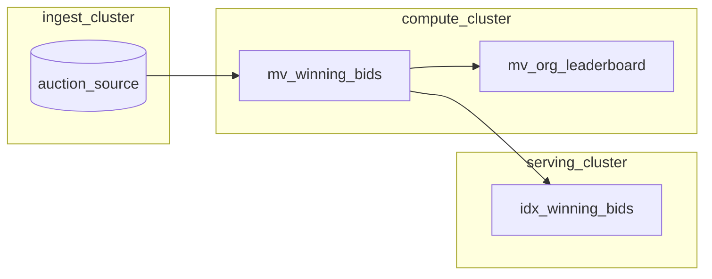


This feature is only recommended for use in development environments. It 


This guide walks you through the steps required to modify the definition of an existing materialized view, while preserving all downstream dependencies.

Materialize is able to replace a materialized view in place, by calculating the *diff* between the original and the replacement. Once applied, the *diff* flows downstream to all dependent objects.

In this guide, you will:
1. Set up a data source
2. Create cascading materialized views and indexes
3. Replace a materialized view with a new definition
4. Apply the replacement, and verify the results

## Guide

### Before you begin

Before using this guide, you should be familiar with:

- [Sources](/concepts/sources/) and how data flows into Materialize
- [Views and materialized views](/concepts/views/)
- [Indexes](/concepts/indexes/) and how they improve query performance
- [Clusters](/concepts/clusters/) and compute resource management

This guide uses a [three-tier cluster architecture](/manage/operational-guidelines/#three-tier-architecture),
with separate clusters for ingestion, computation, and serving.

### Step 1. Set up a data source

For this guide, we'll use the Materialize auction load generator as our data source.

First, create a cluster for ingestion and a schema for the project:

```mzsql
-- Create an ingestion cluster
CREATE CLUSTER ingest_cluster SIZE = 'M.1-small';

-- Create a schema for the project
CREATE SCHEMA IF NOT EXISTS auction_house;
```

Next, create the source in the ingestion cluster:

```mzsql
-- Create auction load generator source
CREATE SOURCE auction_house.auction_source
  IN CLUSTER ingest_cluster
  FROM LOAD GENERATOR AUCTION (TICK INTERVAL '1s')
  FOR ALL TABLES;
```

This creates several tables including `auctions`, `bids`, `users`, and
`organizations` that simulate a live auction environment.

### Step 2. Create cascading materialized views and indexes

Create a compute cluster for the materialized views:

```mzsql
-- Create a compute cluster for materialized views
CREATE CLUSTER compute_cluster SIZE = 'M.1-small';
```

Create a materialized view that identifies winning bids for completed auctions:

```mzsql
-- Materialized view: winning bids
-- Joins auction data to find the highest bid for each completed auction
CREATE MATERIALIZED VIEW auction_house.mv_winning_bids
  IN CLUSTER compute_cluster
AS
SELECT
    a.id AS auction_id,
    a.item,
    a.end_time,
    b.id AS winning_bid_id,
    b.amount AS winning_amount,
    b.bid_time AS winning_bid_time,
    u.id AS winner_id,
    u.name AS winner_name,
    o.id AS winner_org_id,
    o.name AS winner_org_name
FROM auction_house.auctions a
JOIN auction_house.bids b ON a.id = b.auction_id
JOIN auction_house.users u ON b.buyer = u.id
JOIN auction_house.organizations o ON u.org_id = o.id
WHERE a.end_time < mz_now()
AND b.amount = (
    SELECT MAX(b2.amount)
    FROM auction_house.bids b2
    WHERE b2.auction_id = a.id
);
```

Create a downstream materialized view that aggregates winning bids by
organization:

```mzsql
-- Materialized view: organization leaderboard
-- Aggregates winning bids by organization (depends on the winning bids view)
CREATE MATERIALIZED VIEW auction_house.mv_org_leaderboard
  IN CLUSTER compute_cluster
AS
SELECT
    winner_org_id AS org_id,
    winner_org_name AS org_name,
    COUNT(*) AS total_wins,
    SUM(winning_amount) AS total_spent,
    AVG(winning_amount)::NUMERIC(10,2) AS avg_winning_bid,
    MAX(winning_amount) AS highest_winning_bid,
    MIN(winning_amount) AS lowest_winning_bid
FROM auction_house.mv_winning_bids
GROUP BY winner_org_id, winner_org_name;
```

Create a serving cluster and an index on the winning bids view to make results
available in memory for fast queries:

```mzsql
-- Create a serving cluster for indexes
CREATE CLUSTER serving_cluster SIZE = 'M.1-small';

-- Index on the winning bids view
-- Makes results available in memory within the serving cluster
CREATE INDEX idx_winning_bids
  IN CLUSTER serving_cluster
  ON auction_house.mv_winning_bids (auction_id);
```

At this point, you have:
- A source generating auction data
- A materialized view computing winning bids
- A downstream materialized view aggregating results by organization
- An index serving winning bid queries



### Step 3. Replace a materialized view with a new definition

Now suppose you want to modify the winning bids view to only include bids above
a certain threshold. Instead of dropping and recreating the view (which would
require recreating all downstream objects), you can create a replacement.

Use `CREATE REPLACEMENT MATERIALIZED VIEW` to define the updated materialized view:

```mszql
-- Create a new cluster for the replacement materialized view
CREATE CLUSTER replacement_mv_cluster SIZE = 'M.1-small';
```

```mzsql
-- Create a replacement for the winning bids view
CREATE REPLACEMENT MATERIALIZED VIEW auction_house.mv_winning_bids_v2
  FOR auction_house.mv_winning_bids
  IN CLUSTER replacement_mv_cluster
AS
SELECT
    a.id AS auction_id,
    a.item,
    a.end_time,
    b.id AS winning_bid_id,
    b.amount AS winning_amount,
    b.bid_time AS winning_bid_time,
    u.id AS winner_id,
    u.name AS winner_name,
    o.id AS winner_org_id,
    o.name AS winner_org_name
FROM auction_house.auctions a
JOIN auction_house.bids b ON a.id = b.auction_id
JOIN auction_house.users u ON b.buyer = u.id
JOIN auction_house.organizations o ON u.org_id = o.id
WHERE a.end_time < mz_now()
AND b.amount = (
    SELECT MAX(b2.amount)
    FROM auction_house.bids b2
    WHERE b2.auction_id = a.id
)
AND b.amount > 50;  -- New filter: only include winning bids above 50
```

The replacement view:
- References the original view using `FOR auction_house.mv_winning_bids`
- Can run in a different cluster for resource isolation
- Computes results independently while the original continues serving queries
- Must have compatible output columns (same names and types)

Before applying the replacement, wait for it to fully hydrate. Query the
hydration status:

```mzsql
-- Check hydration status of the replacement view
SELECT
    mv.name,
    h.hydrated
FROM mz_catalog.mz_materialized_views AS mv
JOIN mz_internal.mz_hydration_statuses AS h ON (mv.id = h.object_id)
WHERE mv.name = 'mv_winning_bids_v2';
```

Wait until `hydrated` returns `true` before proceeding. The time required
depends on the size of your data and the complexity of the query.


### Step 4. Apply the replacement, and verify the results

Once the replacement materialized view is fully hydrated, apply it. 
When you apply the view, Materialize calculates the diff between the 
and original and the replacement. At this point, the diff is applied 
to the original view, along with all downstream objects.


Applying a replacement will temporarily increase memory usage on the cluster
hosting the materialized view, as well as the clusters hosting all downstream
dependent objects (materialized views and indexes), while the diff is being processed.
This can result in out of memory (OOM) errors.



```mzsql
-- Apply the replacement
ALTER MATERIALIZED VIEW auction_house.mv_winning_bids
  APPLY REPLACEMENT auction_house.mv_winning_bids_v2;
```

After this command completes:
- The original view now uses the updated query definition
- The replacement view is automatically dropped
- Downstream objects will receive the diff, and begin processing it
- No downstream objects need to be recreated

```mermaid
flowchart LR
    subgraph ingest_cluster
        Source[("auction_source")]
    end

    subgraph compute_cluster
        MV1["mv_winning_bids ✓"]
        MV2["mv_org_leaderboard"]
    end

    subgraph serving_cluster
        IDX["idx_winning_bids"]
    end

    Source --> MV1
    MV1 --> MV2
    MV1 --> IDX

    style MV1 fill:#d4edda,stroke:#28a745,color:#155724
```



You can confirm the materialized view is now using the updated definition:

```mzsql
-- Query the updated view for winning bids <= 50. This should return 0 rows
SELECT * FROM auction_house.mv_winning_bids
WHERE winning_amount <= 50;
```

You can also confirm that the downstream leaderboard view reflects the filtered data:

```mzsql
-- Verify downstream view received updates
SELECT * FROM auction_house.mv_org_leaderboard
ORDER BY total_spent DESC
LIMIT 5;
```


### Dropping a replacement

If you decide not to apply a replacement, you can drop it:

```mzsql
-- Drop the replacement without applying
DROP MATERIALIZED VIEW auction_house.mv_winning_bids_v2;
```

This removes the replacement view and leaves the original unchanged.

## Best practices

### Size up clusters before applying a replacement

Since applying a replacement temporarily increases memory usage, consider
[resizing your clusters](/sql/alter-cluster/#resizing) to a larger size before
applying the replacement. This helps ensure sufficient memory is available while
the diff is being processed, and will prevent out of memory errors. 

You can resize back down after the replacement is complete. To automate this
process, you can consider using [mz-clusterctl](https://github.com/MaterializeInc/mz-clusterctl), 
which will auto-scale cluster sizes based on cluster activity.

### Use separate clusters for replacements

Run replacement views in a separate cluster from your production views. This
prevents the replacement's hydration from competing for resources with your
existing workload:

```mzsql
CREATE REPLACEMENT MATERIALIZED VIEW my_schema.mv_example_v2
  FOR my_schema.mv_example
  IN CLUSTER staging_cluster  -- Separate from production
AS ...;
```

## Limitations

### Schema compatibility

The original and replacement materialized views must have compatible schemas.
This includes having identical columns, column order, and constraints.

### Transactions

Applying a replacement within a transaction block is not currently supported. The
`ALTER MATERIALIZED VIEW ... APPLY REPLACEMENT` command must be run outside of
an explicit transaction.

## Related pages

- [Updating materialized views](/transform-data/updating-materialized-views/)
- [`CREATE MATERIALIZED VIEW`](/sql/create-materialized-view)
- [Views](/concepts/views/)
- [Indexes](/concepts/indexes/)
- [Clusters](/concepts/clusters/)
