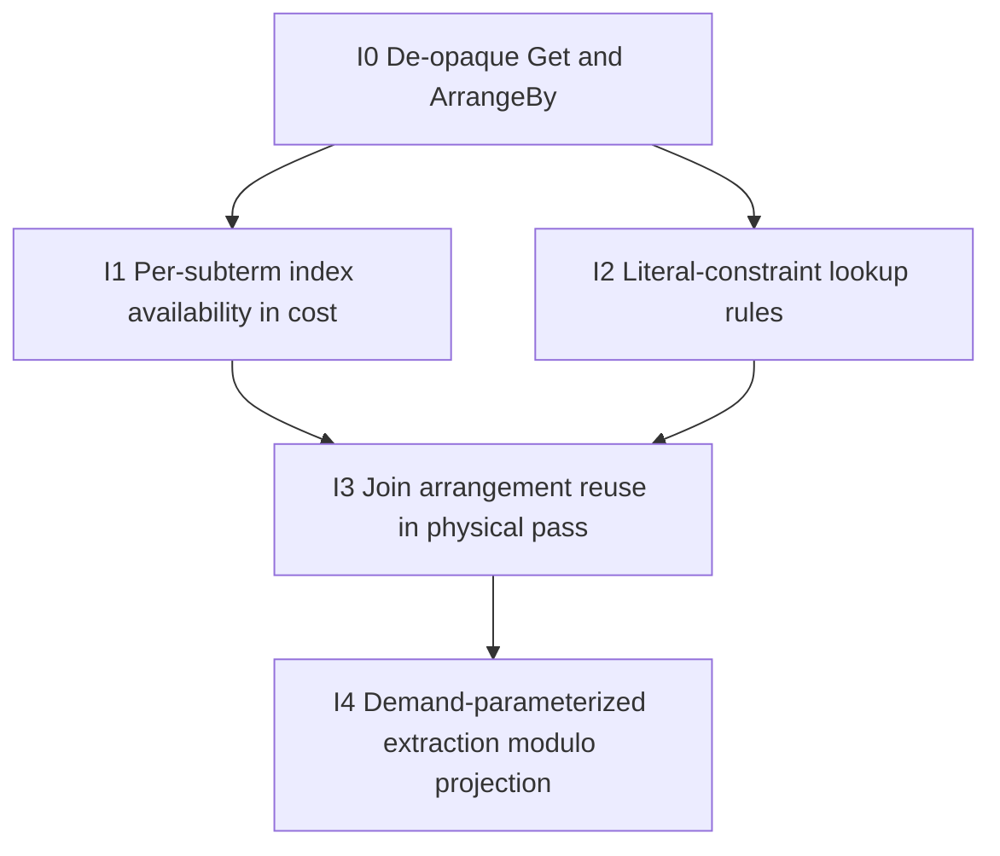

# Index selection in the equality-saturation optimizer: phased plan

Status: planned, subsequent phase (not started).
Prerequisite: the logical-parity workstreams (n-ary join predicate pushdown, the five-transform port) and the existing roadmap Phase 3 (physical `PhysicalEqSatTransform` maturation) land first.
Source of analysis: design spike `a9d1264b` (2026-06-20), recorded in `.superpowers/sdd/progress.md`.

## Goal

Make the equality-saturation optimizer own index and arrangement selection, so a single saturate-and-extract chooses index lookups, arrangement reuse, and (eventually) the projection-narrowed index that fits a query.
This subsumes the production physical transforms `LiteralConstraints` and `JoinImplementation` arrangement reuse, and is the substance of the roadmap's Phase 3 plus the index-aware part of Phase 4.
Index selection is a physical-phase concern, so all work here targets `PhysicalEqSatTransform` (the `optimize`/`optimize_with_availability` path), not the logical pass.
The end-state is index selection as e-matching modulo scalar equivalence and projection, where the cost model weighs index-backed reads against rebuilds within one search.

## Why the obvious shortcut does not work

Demand-parameterized extraction was the tempting lever, because "the cost model would see the demanded columns and pick a covering index."
The spike refuted this: it is necessary but the last and smallest of four prerequisites, and on its own it is zero-diff against the current `demand_pushdown` post-pass.
The real blocker is that the e-graph never represents the reads it would select indexes for: global `Get`, `ArrangeBy`, and indexes are bailed to `Rel::Opaque` at lower time (`src/transform/src/eqsat/lower.rs:174-181`).
The e-graph optimizes the envelope around opaque base reads, so the foundational change is de-opaquing those reads, after which index awareness, rewrite rules, and demand compose on top.

## What production does today (the behavior to subsume)

Three distinct physical-phase decisions, all running after eqsat in the pipeline (`src/transform/src/lib.rs:886-893`).

* **Literal-constraint index lookup** (`src/transform/src/literal_constraints.rs:175-315`).
  A `Get{Global}` under an MFP with literal-equality predicates (`col = 5`) is matched against `indexes.indexes_on(get_id)` keys, the best index is chosen by `(key.len(), inverse cast)`, and the read is rewritten to an `IndexedFilter` semi-join.
  The driver is literal-equality predicates, not column liveness.
* **Join arrangement reuse** (`src/transform/src/join_implementation.rs:298-326, 462-523`).
  Available arrangements per input are collected from plan structure (global indexes, `ArrangeBy` keys, `Reduce` group keys, `IndexedFilter`), and the delta-versus-differential choice counts how many new arrangements each plan needs.
  The driver is which arrangements structurally already exist.
* **Delta-join arrangement requirements** (`src/transform/src/join_implementation.rs:591-619`).
  Arrangement keys are derived from join equivalences; the eqsat entry `plan_as_delta_query` currently passes empty availability, so it always plans fresh arrangements.

## Sub-phases

Each sub-phase is independently committable and gated on its own SLT validation.
The dependency order is I0 then I1 and I2 in parallel, then I3, then optionally I4.

### I0: De-opaque `Get{Global}` and `ArrangeBy` in the eqsat IR

This is the foundational change and the highest-risk one.
Add structured e-node variants for `Get` (carrying `GlobalId` and access strategy) and `ArrangeBy` (carrying keys), replacing the `Rel::Opaque` bail at `src/transform/src/eqsat/lower.rs:174-181`.
Lower must preserve the verbatim round-trip contract, and raise must reconstruct `MirRelationExpr::Get`/`ArrangeBy` identically.
The cost model treats these as leaves, but now with arrangement metadata it can read.

* Files: `src/transform/src/eqsat/ir.rs` (new `Rel` variants), `src/transform/src/eqsat/lower.rs:174-181`, `src/transform/src/eqsat/raise.rs`, `src/transform/src/eqsat/egraph.rs` (e-node handling), `src/transform/src/eqsat/cost.rs`.
* Validation gate: flag-on SLT shows zero diff.
  De-opaquing alone changes nothing semantically; it only makes the reads reasoned-about.
  This proves the round-trip contract holds before any selection logic is added.
* Risk: high.
  `Get`/`ArrangeBy` appear pervasively, and the `LetRec`/recursive-id and `WcoJoin`-commit paths must not break.
  Structural de-opaquing of `FlatMap`, `LetRec`, and non-empty `Constant` stays deferred; only `Get` and `ArrangeBy` are needed here.

### I1: Per-subterm index availability in the cost model

Extend the cost model so an arranged or indexed read is cheaper than a non-arranged one when its key matches what the consumer needs.
Today availability is consulted only in the `WcoJoin` memory term against bare opaque `Get`s (`src/transform/src/eqsat/cost.rs:340-375`), and any intervening Project, Filter, or Map defeats the match.
With I0 in place the cost model can attribute availability to the de-opaqued read node directly, independent of the surrounding envelope.
Availability is seeded from the index oracle, which `PhysicalEqSatTransform::build_availability` already does.

* Files: `src/transform/src/eqsat/cost.rs`, `src/transform/src/eqsat/transform.rs` (availability seeding).
* Validation gate: targeted cost tests in the style of `src/transform/tests/wcoj_decision.rs`, asserting the cost model prefers index-backed reads when available.
* Risk: medium.
  The cost model is cardinality-free, so index preference is encoded through the memory and time terms; the weighting must not distort unrelated decisions.

### I2: Literal-constraint lookup rules

Add rewrite rules that recognize `Filter[col = literal](Get{Global})` and introduce an index-lookup alternative into the e-class, so extraction can choose it by cost.
This subsumes `LiteralConstraints`.
It requires representing the `IndexedFilter` semi-join form in the de-opaqued IR.

* Files: `src/transform/src/eqsat/rules/relational.rewrite` (new rules), `src/transform/src/eqsat/ir.rs` (IndexedFilter form), `src/transform/src/eqsat/raise.rs` (raise the lookup form).
* Validation gate: flag-on SLT optimized plans show index lookups chosen, with `LiteralConstraints` removed from the pipeline, parity-or-better across the corpus.
* Risk: high.
  This duplicates `LiteralConstraints` selection semantics, including best-index choice by key length and cast inversion, which must match to keep parity.

### I3: Join arrangement reuse in the physical pass

Make the physical pass's `WcoJoin`-versus-binary-join decision account for all available arrangements (global indexes, `ArrangeBy`, `Reduce` group keys, `IndexedFilter`), not just bare opaque `Get`s.
With `Get`/`ArrangeBy` de-opaqued and costed, the cost model can see these arrangements at the point of choice.
This subsumes `JoinImplementation`'s delta-versus-differential arrangement counting and the delta-join arrangement requirements.

* Files: `src/transform/src/eqsat/cost.rs`, `src/transform/src/eqsat/raise.rs` (delta planning, currently `plan_as_delta_query` with empty availability), `src/transform/src/eqsat/rules/relational.rewrite`.
* Validation gate: flag-on SLT parity with `JoinImplementation` arrangement choices, with that pass removed, across the full corpus.
* Risk: very high.
  `JoinImplementation` has documented ordering hazards (`src/transform/src/join_implementation.rs:840-857`), and arrangement reuse plus delta requirements are the subtlest part of the physical pipeline.

### I4: Demand-parameterized extraction modulo projection (optional)

Once index matching exists, demand-narrowing at extraction lets the cost model prefer an index that covers exactly the demanded columns, which is index selection modulo projection.
This is the small final piece the spike identified, valuable only after I0 through I3.
Key the extraction memo on `(Id, DemandSet)` and thread demand top-down, transcribing the `Demand` arithmetic (`src/transform/src/demand.rs:104-350`) against `Rel`/`EScalar`, with a cap on distinct demand sets per class to bound the memo blowup against `MAX_ENODES`.

* Files: `src/transform/src/eqsat/egraph.rs:1411-1548` (extraction DP), a new per-operator demand module over `Rel`/`EScalar`.
* Validation gate: flag-on SLT shows narrow-index selection where a covering index exists, with no regression elsewhere.
* Risk: medium given I0 through I3 are in place; the blowup cap and the `Let` cross-use demand union (not expressible bottom-up, see `src/transform/src/eqsat/raise.rs:241-243`) are the main concerns, and the post-pass likely remains for the `Let` case.

## Sequencing and honest cost

This phase follows the logical-parity work and the Phase 3 maturation of `PhysicalEqSatTransform`, which itself must carry join implementations through lower and raise and tune the physical-pass latency (~6.5s on large plans).
The effort is large and re-implements working, subtle physical transforms inside the e-graph, so it is improvement territory beyond strangler-fig parity, not required to delete the logical optimizer.
The payoff is unified cost-based selection of index, join order, and projection in one saturation, which the heuristic pipeline cannot do.
Keep the current `demand_pushdown` post-pass throughout; it is retired only at I4, and only for the cases the e-graph then covers.
