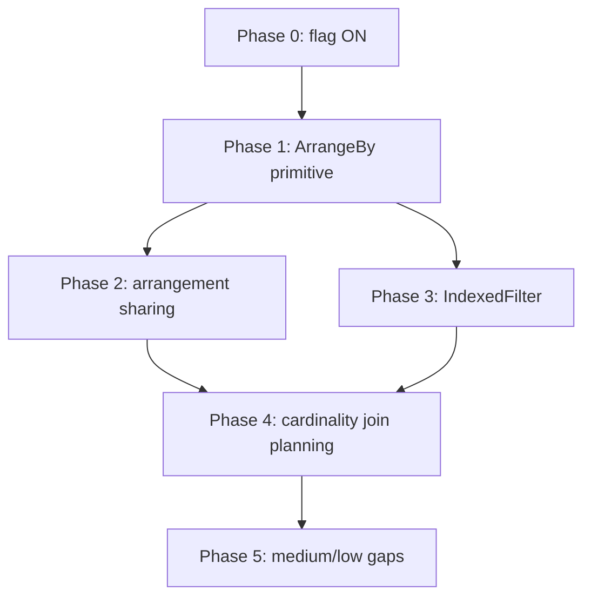

# Physical eqsat gap coverage roadmap

> **For agentic workers:** this is a multi-phase ROADMAP, not a single executable plan.
> Each phase gets its own detailed implementation plan (via `superpowers:writing-plans`)
> when it is scheduled. Phases are ordered by dependency first, then difficulty.

**Goal:** absorb the remaining production physical-optimization behavior into the eqsat pass so the physical placement (`PhysicalEqSatTransform`, now default ON) is a superset of, not a sidecar to, `LiteralConstraints` and `JoinImplementation`.

**Architecture:** introduce an `ArrangeBy` arrangement primitive into the eqsat IR, then build arrangement sharing, index lookups, and cardinality-aware join planning on top of it.
The physical pass stays equivalence- and type-guarded (`adopt_if_type_preserving`); every phase is a sound no-op on mismatch.

## Global constraints

* It is all about eqsat: no HIR changes, no production-transform rewrites outside `src/transform/src/eqsat/`.
* No `as` conversions: use `mz_ore::cast::{CastFrom, CastLossy}`.
* No `unsafe` without a `SAFETY` comment.
* Comments: no em-dash, no structuring semicolons, doc states the contract, reasoning inline, no vendor names; never drop existing comments.
* Rules live in `eqsat/rules/relational.rewrite`; matchers are codegen'd at build time (`build/grammar.rs`, `build/codegen.rs`).
* Soundness gate: physical-property facts (already-arranged-by-key) are sound to assert; SQL-semantic non-linearity (Reduce/TopK/Distinct reject negatives) must never be treated as linear.
* Keep both flags ON; debug correctness bugs immediately while fresh.
* Validate every phase: `cargo test -p mz-transform` (lib + `eqsat.spec`), `eqsat_bench` for perf, and let CI surface SLT EXPLAIN churn.

---

## Status of the prerequisite

* `enable_eqsat_physical_optimizer` flipped to **default ON** (`src/sql/src/session/vars/definitions.rs`), mirroring `enable_eqsat_optimizer`.
  Override handling in `OptimizerFeatureOverrides` already matches the logical flag, so no other edit is needed.
* Consequence to validate: the physical placement now runs across the whole corpus, so CI will surface plan churn (committed `DeltaQuery` for cyclic joins, plus logical rewrites re-applied at physical position).
  This is the intended steady state, same promotion path the logical flag took.

---

## Phase 1: Reify `ArrangeBy` as a first-class IR and e-node (foundational)

**Why first:** both the hardest high-value gaps (IndexedFilter, cardinality-aware join planning) and all of arrangement sharing need an explicit arrangement node.
Today arrangements are implicit, modeled only as memory terms in `cost.rs`, so the optimizer cannot share, remove, or look up through them.

**Files:**
* Modify `src/transform/src/eqsat/ir.rs`: add `Rel::ArrangeBy { input: Box<Rel>, key: Vec<EScalar> }` and the matching `ENode::ArrangeBy { input: Id, key: Vec<EScalar> }`.
* Modify `src/transform/src/eqsat/egraph.rs`: `ENode` hashcons identity must include the key (so `ArrangeBy(x,k1)` and `ArrangeBy(x,k2)` never merge); arity = input arity; analyses pass through the input.
* Modify `src/transform/src/eqsat/lower.rs`: lower MIR `ArrangeBy` to `Rel::ArrangeBy`; a Get reached through an available index is left as-is (Phase 3 introduces the lookup).
* Modify `src/transform/src/eqsat/raise.rs`: raise `Rel::ArrangeBy` back to MIR `ArrangeBy`; ensure round-trip identity for already-arranged inputs.
* Modify `src/transform/src/eqsat/cost.rs`: charge the memory term on `ArrangeBy` (not only implicitly inside Join/Reduce/TopK), preparing for Phase 2's distinct-set accounting.
* Test: `eqsat/raise.rs` roundtrip tests; new IR unit tests in `egraph.rs`.

**Dependencies:** none (the enabling primitive).

**Verify:** roundtrip tests pass; `eqsat.spec` unchanged (ArrangeBy reification alone must not change extracted plans yet); `eqsat_bench` no regression.

---

## Phase 2: Arrangement sharing (L1 + L4 + L2/L3)

**Why second:** turns the Phase 1 primitive into a real win, and is sound and self-contained before the harder index/cardinality work.

**Files:**
* Modify `eqsat/rules/relational.rewrite`: add `arrange_idempotent` rule, `ArrangeBy[k](x) => x where produces_key(x, k)`, tagged `phase physical` (the first real use of the dormant phase mechanism).
  `produces_key` is a new side condition: true when `x` is a Reduce/TopK/Distinct/ArrangeBy/indexed-Get already arranged by `k`.
* Modify `build/grammar.rs` + `build/codegen.rs`: parse the new condition, map it to an `AnalysisNeeds` bit if it reads an analysis (likely a structural check, no analysis).
* Modify `eqsat/cost.rs`: replace per-join-input `input_already_arranged` with a memory charge over the set of DISTINCT `(eclass, key)` arrangements in the extracted plan, charged at most once each (L2/L3); 2nd+ consumer costs 0.
* Modify `eqsat/cse.rs`: confirm `ArrangeBy` e-nodes hoist into `Let` like any shared compound term (L4 should fall out for free once ArrangeBy is a first-class node; add a test rather than special-casing).
* Test: `eqsat.spec` cases with a shared arrangement across two joins (mirror DD `shares_arrangements_across_joins`).

**Dependencies:** Phase 1.

**Verify:** a two-join-one-arrangement plan extracts with a single shared `ArrangeBy`; cost of a multi-consumer arrangement is charged once; `eqsat_bench` no regression; CI EXPLAIN churn is improvement-only.

---

## Phase 3: IndexedFilter / `LiteralConstraints` absorption (Gap 1, CRITICAL) — DONE

**Why third:** the largest production behavior eqsat does not represent, and it is structurally "arranged Get + literal lookup," so it builds directly on the Phase 1 primitive.

**Design correction made during implementation.** The original sketch proposed a declarative rewrite rule `Filter[col = literal](Get g) => IndexedFilter(...) where has_index(g, [col])`, mirroring how `join_to_wcoj` introduces `WcoJoin`.
That mirror does not hold.
`WcoJoin` works as a rule because delta planning is oracle-free and the node carries the same children as `Join`, so a speculative rule plus a cost decision suffices.
IndexedFilter is different on three counts: its key ordering must match a specific index (oracle), its literal rows require imperative MFP analysis (OR-of-AND distribution, `Row` construction), and the production detector `LiteralConstraints::detect_literal_constraints` is coupled to `TransformCtx` (the oracle and notices).
None of that fits a declarative template, so the decision is computed once by the production detector and seeded into the e-graph rather than discovered during saturation.

**What was built:**
* `ir.rs` + `egraph.rs`: `Rel::IndexedFilter`/`ENode::IndexedFilter { input, predicates, committed }`.
  An indexed filter is semantically `Filter[predicates](Get)`, so it carries the same `input` and `predicates` and reuses every `Filter` analysis arm (equivalences, constant columns, keys, nonneg, monotonic, column types), which is sound and exact.
  `committed` is the production realization, carried as an opaque payload.
* `cost.rs`: a constant index-probe work term (degree 0) and no new arrangement memory (the index pre-exists), so the indexed form is strictly cheaper than the sibling `Filter(Get)` and extraction prefers it.
* `raise.rs`: physical raise emits `committed` verbatim; logical raise emits the equivalent plain `Filter` (only for totality, since seeding is physical-only).
* `egraph.rs::seed_indexed_filters` + `transform.rs::collect_indexed_filter_seeds`: the physical pass runs the production `LiteralConstraints` on a clone of each direct `Filter(Get global)`, and seeds an equivalent node into the matching class before saturation.
* `engine.rs` + `eqsat.rs`: thread the seeds through `optimize_with_availability`.

**Scope:** only a direct `Filter(Get)` is seeded; Map/Project envelopes and residual predicates beyond the literal constraint are left to the standalone `LiteralConstraints` pass that still runs downstream.

**Verified:** an integration test (`tests/eqsat_indexed_filter.rs`) drives `PhysicalEqSatTransform` in isolation, so the committed `IndexedFilter` can only come from seeding: it appears with an index present and is absent without.
The offline corpus (`eqsat.spec`) is unchanged (the offline `optimize` path seeds nothing), and the final plan matches the downstream `LiteralConstraints` output, so P3 is golden-neutral.

---

## Phase 4: Structural join planning, with opportunistic cardinality (Gap 2)

**Why fourth and reframed:** Materialize carries no usable cardinality for most relations (sources, MVs), so a statistics-oracle-driven planner has little to work with.
The eqsat cost model is already structural AGM-bound (degrees derived from arities and equivalences), which is exactly what makes WCOJ worst-case-optimal *without* statistics.
So Phase 4 keeps the structural cost model and the sound `join_is_cyclic` guard, and only layers in cardinality where it actually exists.

**Files:**
* Modify `eqsat/cost.rs`: feed EXACT cardinality where available, primarily constant relations (known row counts) and unique-key facts already produced by the Keys analysis, to refine size degrees and break ties.
  No `StatisticsOracle` dependency: when no cardinality is known, fall back to the existing structural AGM degrees unchanged.
* Keep `join_to_wcoj`'s cyclic-only guard: it is structural and sound, and without statistics there is no basis to relax it.
  Revisit only if a concrete plan shows the guard blocking a win the cost model could otherwise rank.
* Modify `eqsat/transform.rs`: thread any cheaply-available cardinality (constants, key facts) into the cost model; do not require a statistics oracle.

**Dependencies:** Phases 1-3 (the planner must be able to choose IndexedFilter and account for shared arrangements before refining join cost).

**Verify:** join-order SLTs match or beat production `JoinImplementation` on the cases where cardinality is known (constant-heavy plans); structural cases unchanged; `eqsat_bench` triangle/mixed within budget.

**Open question:** this phase is the lowest-confidence one precisely because the input data is thin.
It may collapse to "use exact constant cardinality for tie-breaking" and little more, in which case it folds into Phase 2's cost work rather than standing alone.

---

## Phase 5: Remaining medium/low gaps (independent, schedule opportunistically)

**Gap 3, dynamic equivalence (MEDIUM):** the saturation loop already recomputes the Equivalences analysis and canonicalizes (Phase 2a).
Assess whether transitive-closure propagation mid-saturation unlocks rewrites production gets from `EquivalencePropagation`; extend the analysis if a concrete missed rewrite is found.
Do not speculatively build closure machinery.

**Gap 4, Demand in physical phase (MEDIUM):** `raise::demand_pushdown(commit_wcoj=true)` currently omits Demand to avoid corrupting a committed `DeltaQuery`.
Verify whether Demand can run safely after the commit (it must not reshape join inputs), and enable it if so.

**Gaps 5-7, extra CSE / projection / scalar passes (LOW):** production runs a second `RelationCSE`, a post-CSE `ProjectionPushdown::skip_joins`, and the scalar-layer transforms (`CaseLiteral`, `CoalesceCase`).
Fold these into `optimize_inner`'s raise tail only where a measured plan-quality gap exists, mirroring how `coalesce_mfp`/`demand_pushdown` were folded in.

**Dependencies:** none hard; best done after Phase 4 so the join plan is stable.

---

## Non-goals

* **Scalars in the e-graph.** None of P1-P5 require lifting `MirScalarExpr` into the e-graph as scalar e-classes.
  Scalars stay payloads (`EScalar`/`Payload`) on relational e-nodes, canonicalized by the Equivalences analysis and `rewrite_escalars`.
  The `ArrangeBy` key (P1), `produces_key` (P2), and the `col = literal` lookup pattern (P3) are all payload inspections or structural side conditions, not scalar unifications.
  Where a rule misses a match that differs only by scalar form (commutativity, literal normalization), the fix is to strengthen the scalar canonicalization or the side condition, not to lift scalars into the e-graph.
  Scalar e-nodes (scalar CSE, scalar-rewrite saturation) is a separate workstream with its own justification, orthogonal to physical gap coverage.

## Sequencing summary

Each phase ships behind the already-on physical flag, is independently testable, and leaves the pass a sound no-op on any equivalence or type mismatch.
