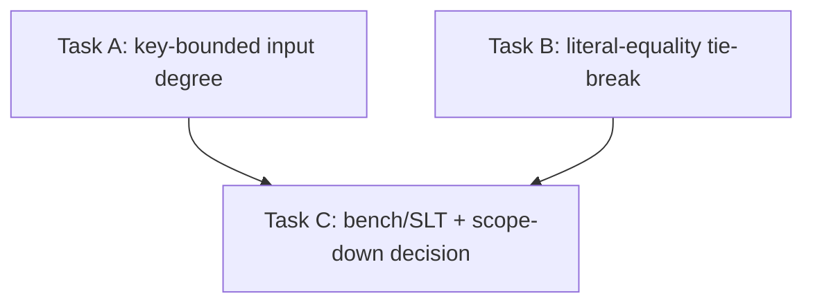

# Phase 4: Structural join planning, with opportunistic cardinality

> **For agentic workers:** this is the detailed implementation plan for Phase 4 of the
> `docs/superpowers/plans/2026-06-21-physical-eqsat-gap-coverage.md` roadmap.
> Read the "Verdict" section first.
> The honest conclusion is that P4 as a standalone "cardinality join planner" is mostly not worth building, and the plan scopes it down to two small, sound, structural refinements of the existing cost model.

## Verdict

P4 should not be built as a standalone cardinality-driven join planner.
The eqsat cost model is deliberately cardinality-free and AGM-bound, and the investigation below shows that the two cardinality sources the brief allows (`Rel::Constant.card` and Keys-analysis unique keys) buy almost nothing for the join decision the roadmap cares about.
Exact constant cardinality is already captured (an empty or constant relation is degree `0.0`), and real MIR constants never even reach the cost model because they bail to `Rel::Opaque`.
A unique key bounds an input's per-probe multiplicity but does not change the exponent-of-N AGM degree that decides WcoJoin-vs-binary-join, so it cannot flip that extraction decision.

Therefore P4 collapses into a small extension of the P2 cost work, with exactly two refinements that genuinely change an extraction decision and are both pure functions of the extracted `Rel` tree (no oracle, no e-graph plumbing):

* **Task A (key-bounded join input):** when a join input carries a proven unique key over its full join key, its output multiplicity per distinct key value is at most one, so its arranged size is bounded by the key-attribute count rather than its arity.
  This refines `size_degree` for that input and breaks ties between join orders the AGM degree leaves equal.
* **Task B (literal-constraint selectivity tie-break):** a `Filter`/`IndexedFilter` with a `col = literal` equality on a join input is a point constraint, so that input contributes a lower-degree term.
  This mirrors production's `FilterCharacteristics::literal_equality` signal without an oracle.

Both are tie-breaks and degree refinements layered on top of the unchanged AGM fallback.
If during implementation Task A or B is found not to change any `eqsat.spec` plan or any cost-model unit comparison, drop it: the roadmap explicitly permits P4 to shrink to "constant/key tie-breaking and little more."

## Goal

Layer the only exact, oracle-free cardinality that exists (unique-key facts; constant relations, which are already handled) into the two-axis AGM cost model as degree refinements and tie-breaks, keeping the cardinality-free AGM bound as the fallback and keeping the `join_to_wcoj` cyclic-only guard intact.

## Architecture

The cost model scores an extracted `Rel` tree purely compositionally: `CostModel::cost(&Rel)` walks the tree and `size_degree(&Rel)` returns an exponent-of-N degree per node.
P4 adds a key-aware and literal-aware refinement to `size_degree` and to the per-join-input arrangement terms, computed from the `Rel` subtree itself via the existing recursion-aware `analysis::rel_keys` and a small structural literal scan.
No oracle, no statistics, no new e-graph plumbing: the refinement is a side computation on the same `Rel` the cost model already receives.
The AGM machinery (`join_degree`, `binary_join_terms`, `agm_degree_subset`) and the `join_is_cyclic` guard are unchanged, so any plan where no key or literal fact applies is costed exactly as today.

## Status of the prerequisite

The investigation that grounds the verdict, with file:line.

### What `Rel::Constant.card` buys: nothing

* `cost.rs:248` costs `Rel::Constant { .. } => 0.0` for `size_degree`, and `collect_work` (`cost.rs:305`) and `collect_memory_into` (`cost.rs:443`, the `_ => {}` arm) emit no term for it.
  So a constant relation is already O(1) = degree 0 on both axes, regardless of `card`.
  The `card` field is never read by the cost model.
* `Rel::Constant.card` is defined at `ir.rs:144-148` and documented as carrying a row count, but `lower.rs:186-198` **bails every MIR `Constant` to `Rel::Opaque`** (the `Constant { .. } | Get { Id::Global(_) } | ... => Rel::Opaque(..)` arm).
  An `Opaque` leaf costs `size_degree = 1.0` (`cost.rs:250`), the base-relation degree.
  So real constants do not even arrive as `Rel::Constant`; they arrive as opaque leaves at degree 1.0.
* The only `Rel::Constant` the pipeline ever synthesizes is the empty relation `card: 0`, produced by saturation rules and detected at `egraph.rs:927` and `egraph.rs:936` (`matches!(n, ENode::Constant { card: 0, .. })`).
  Degree 0 already costs the empty relation correctly.
* Consequence: there is no constant-cardinality lever to pull.
  Refining the cost model by `Constant.card` would change zero extracted plans because no costed `Constant` has `card > 0`.
* Stale-doc note (report only, do not edit): `ir.rs:150` says `Rel::Get` cardinality "comes from the `crate::eqsat::cost::Stats` oracle".
  No `Stats` type exists in `cost.rs` (grep confirms `ir.rs:150` is the sole reference).
  `Rel::Get` is costed at a flat `1.0` (`cost.rs:250`).
  The comment is dead; flag it for the `update-docs` owner or a separate cleanup, not this plan.

### What unique keys buy: a tie-break and one input-degree refinement, never a WcoJoin flip

* The `Keys` analysis (`analysis.rs:165-217`) produces, per e-class, a `KeySet` (`analysis.rs:146-148`).
  `Reduce` establishes its group key (`analysis.rs:185`); `Filter`/`Map`/`ArrangeBy`/`IndexedFilter`/`Threshold` pass keys through (`analysis.rs:194-198`); `Project` remaps (`analysis.rs:199`); `Join`/`WcoJoin` union one key per input offset into the join layout (`analysis.rs:203-205`, via `combine_join_keys` at `analysis.rs:235`).
  A plain `Get`/`Constant`/`Negate`/`Union` yields no keys (`analysis.rs:209`).
* The cost model does **not** consult keys at all: grep for `is_superkey`/`rel_keys`/`Keys` in `cost.rs` returns nothing.
  `size_degree` is arity- and join-structure-driven only.
* The exact fact a key gives: an input keyed by its full join key emits at most one row per distinct key value, so when the AGM cover assigns that input a private (degree-1) vertex (`cost.rs:811-817`, the `shared_touch[i] < arities[i]` branch that forces weight >= 1), the key proves the input's true contribution is the key-attribute count, not its full arity.
  This can lower that input's `size_degree` and therefore its arrangement memory term and its private-vertex LP weight.
* Where a key **cannot** help: the AGM degree is an exponent of N derived from the fractional edge cover (`cost.rs:781-820`).
  Adding "this input has multiplicity <= 1 per key" does not change the cover exponent for the cyclic case, so it cannot make a binary join's leading term drop below the WcoJoin's.
  The WcoJoin-vs-binary decision (`cost.rs` triangle: WcoJoin time 1.5 / memory `[1,1,1]` vs binary time 2.0 / memory `[2,1,1,1]`, asserted in `triangle_wcojoin_dominates`) is unaffected.
  The cyclic-only `join_to_wcoj` guard (below) stays the gate, and a key never relaxes it.
* So the realizable win is: (1) break ties between equal-AGM join orders by preferring the order that probes through a key (fewer rows materialized at an intermediate), and (2) shave one input's degree when it is fully key-covered.
  Both are tie-breaks/refinements, not decision flips.

### Keys availability at cost time, and the minimal plumbing

* The e-class `Keys` analysis runs inside saturation, keyed by e-class `Id` (`egraph.rs:1066`, `run_analysis(&Keys { .. })`), and is **not** threaded into `CostModel`.
  `CostModel::cost` (`cost.rs:284`) receives only a detached `Rel` tree during extraction (`egraph.rs:1318`, `model.cost(&rel)` on a rebuilt subtree), with no e-class context.
* But the recursion-aware `analysis::rel_keys(&Rel)` (`analysis.rs:955`, via `KeysRec`/`rec_analyze`) computes a `KeySet` directly from a `Rel` tree.
  It is sound and self-contained, the same lattice as the e-class analysis (`KeysRec` at `analysis.rs:898-926` mirrors `Keys::make`).
  This is exactly what the cost model needs: a pure function of the `Rel` it already holds.
* Therefore the minimal plumbing is **none beyond a function call**: inside `cost.rs`, call `crate::eqsat::analysis::rel_keys(input)` on a join input to learn its keys, then test `is_superkey(&keys, &join_key_cols)` (`analysis.rs:947`) where `join_key_cols` is the set the existing `join_key_cols_for_input` (`cost.rs:617`) already computes.
  No `CostModel` field, no oracle, no saturation change.
  Cost-time `rel_keys` calls are cheap (joins have few inputs; `rel_keys` is linear in the subtree) and must be memoized per input subtree if profiling shows re-walk cost during the `O(classes^2)` extraction passes (mirror the existing `agm_cache` / extraction `cost_cache` pattern).

### Production JoinImplementation: which structural signals eqsat does not yet use

From `join_implementation.rs` (surveyed):

* Unique-key coverage drives order: `JoinInputCharacteristics` orders lexicographically on `unique_key` first (V1 field order), pre-computing `unique_arrangement[input][pos]` from relation `typ.keys` (`join_implementation.rs:209-212`, `1122-1126`, `1174`, `1357-1380`).
  eqsat's cost model uses no key signal today (confirmed above): **Task A** adopts this structurally via `rel_keys`.
* Filter selectivity drives order: `FilterCharacteristics` (built `join_implementation.rs:247-279`) carries `literal_equality`/`literal_inequality`/`like`/`is_null` and a `worst_case_scaling_factor()` multiplier; `IndexedFilter` literal equalities feed it (`join_implementation.rs:248-255`).
  eqsat already represents `IndexedFilter` (P3) and `col = literal` is visible to `ConstantColumns` (`analysis.rs:504`, `col_eq_literal`): **Task B** adopts the `literal_equality` signal structurally.
* Cardinality estimates are oracle-based and feature-gated: only used when `enable_cardinality_estimates` is set, via `Cardinality::with_stats(stats.as_map())` (`join_implementation.rs:282-294`).
  This is exactly the `StatisticsOracle` dependency the brief forbids; **do not adopt it.**
  Everything else production uses for ordering (arranged, key_length, bound columns) is structural and either already in eqsat's model (arrangement availability, P2) or is Task A.

## Global constraints

* All in `mz_transform::eqsat`: no HIR changes, no production-transform rewrites outside `src/transform/src/eqsat/`, no `StatisticsOracle` dependency.
* No `as` conversions: use `mz_ore::cast::{CastFrom, CastLossy}`.
* No `unsafe` without a `SAFETY` comment.
* Comments: no em-dash, no structuring semicolons, doc states the contract, reasoning inline, no vendor names; never drop existing comments.
* The AGM bound stays the fallback: when no key or literal fact applies, `size_degree` and the join terms are bit-identical to today.
  Every existing `cost.rs` unit assertion (`triangle_wcoj_beats_binary`, `triangle_wcojoin_dominates`, `two_way_join_ties_wcojoin_on_memory`, the index-aware tests) must still pass unchanged.
* Keep the `join_to_wcoj` cyclic-only guard (`relational.rewrite:266-270`, `where join_is_cyclic()`).
  It is structural and sound, and without statistics there is no basis to relax it; a unique key does not change cyclicity.

## Task A: Key-bounded join-input degree and order tie-break

**Why:** a join input whose full join key is a proven unique key emits at most one row per distinct key value, so its arranged contribution is bounded by the key-attribute count, not its arity.
This is the one place an exact key fact refines an exponent-of-N degree, and it is the structural analogue of production's `unique_key`-first ordering.

**Files:**

* Modify `src/transform/src/eqsat/cost.rs`:
  * Add a private helper `fn join_input_is_key_covered(input: &Rel, join_key_cols: &BTreeSet<usize>) -> bool` that calls `crate::eqsat::analysis::rel_keys(input)` and `is_superkey(&keys, join_key_cols)`.
    Contract doc: returns true when the input's join key is a superkey, so the input contributes at most one row per probe.
  * In `collect_memory_into`'s `Rel::Join` and `Rel::WcoJoin` arms (`cost.rs:396-441`), when an input is key-covered, charge its arrangement term at a reduced degree: the input still needs an arrangement, but its size is bounded by the distinct key values it holds, which on this abstract scale is one degree-step below a non-keyed base, floored at 0.
    Keep the existing `input_already_arranged` suppression and the `ArrId::JoinInput` dedup unchanged; the only change is the degree pushed when not suppressed.
  * In `agm_degree_subset` (`cost.rs:781-820`), where an input gets a private (`>= 1`) vertex (`cost.rs:811-817`), a key-covered input's private weight is its key-bounded degree rather than `degs[i]`.
    This is the LP refinement that lets a key-covered input lower an intermediate's degree and thereby break ties between otherwise-equal-AGM left-deep orders in `binary_join_terms` (`cost.rs:535-588`).
    Thread the per-input key-covered bit into `Hypergraph::build` (`cost.rs:665`) so it is available where `shared_touch[i] < arities[i]` is decided; the `AgmKey` memo (`cost.rs:213-224`) must include the key-covered bits so the cache stays exact.
  * Do **not** touch `join_degree`'s leading exponent for the cyclic case: the AGM bound is the worst-case-optimal guarantee and must not be weakened by a per-probe key fact.
    Key refinement applies only to the private-vertex weight and the arrangement memory term, never to the shared-attribute cover exponent.

**Verify:**
* New `cost.rs` unit test: a 2-way join `R(#0,#1) JOIN S(#2,#3) on #1=#2` where `S` is `Reduce`-keyed on its join column extracts the order that probes `S` by its key, and `S`'s arrangement term is strictly lower than the un-keyed sibling, while the AGM leading term is unchanged.
* Regression: `triangle_wcojoin_dominates` and `two_way_join_ties_wcojoin_on_memory` unchanged (no keys present, so the refinement is inert).
* `cargo test -p mz-transform` lib tests pass; `eqsat.spec` change is improvement-only (a keyed join may pick a different but cheaper order; no plan gets worse).

## Task B: Literal-constraint selectivity tie-break

**Why:** a `col = literal` equality on a join input is a point constraint that production scores via `FilterCharacteristics::literal_equality`.
eqsat already canonicalizes such predicates (`ConstantColumns::col_eq_literal`, `analysis.rs:504`) and already prefers `IndexedFilter` (P3, a committed point lookup) over `Filter(Get)`.
Task B closes the remaining gap: a residual `Filter[col = literal]` directly above a join input should make that input rank as a cheap probe, breaking ties between join orders, without claiming a degree drop the AGM cannot justify.

**Files:**

* Modify `src/transform/src/eqsat/cost.rs`:
  * Add a private helper `fn has_literal_equality(input: &Rel) -> bool` that returns true when `input` is (or, through `Project`/`Map`/`ArrangeBy` passthrough, wraps) a `Rel::Filter`/`Rel::IndexedFilter` carrying at least one `col = literal` predicate.
    Reuse the literal-equality recognition shape from `analysis::col_eq_literal` (extract a shared `pub(crate)` recognizer in `analysis.rs` rather than duplicating the `BinaryFunc::Eq` match, so the two stay in sync; do not drop its existing doc comment).
  * In `binary_join_terms` (`cost.rs:535-588`), when comparing candidate left-deep orders that tie on the AGM degree vector, prefer the order that places a literal-equality-constrained input earliest (it shrinks the intermediate first).
    Implement as a secondary key in the `terms_cost(&cand).lt(&terms_cost(c))` comparison (`cost.rs:578`): on a `terms_cost` tie, compare a count of how early literal-constrained inputs appear.
    Keep `terms_cost` itself unchanged (it is also used elsewhere); add the tie-break at the DP comparison site only.
  * This adds **no** new degree to either axis: a literal equality is a selectivity hint, and without statistics we cannot quantify it, so it only orders otherwise-equal plans.
    The AGM degrees and memory terms are untouched.

**Verify:**
* New `cost.rs` unit test: two left-deep orders of a 3-way join tie on AGM degree, one of which probes a `Filter[#0 = 5]`-constrained input first; the DP picks that order.
* Regression: all existing join-order assertions unchanged (no literal predicates present).
* `eqsat.spec` and the join-order SLTs are improvement-or-neutral: a literal-constrained input is ordered no later than before.

## Task C: Bench and SLT validation, and the scope-down decision

**Why:** the roadmap flags P4 as the lowest-confidence phase; Task C is where we decide whether A and B earned their place or whether P4 shrinks further.

**Files:**
* No source changes.
* Run `cargo run --release -p mz-transform --example eqsat_bench 30` (NOT the 2000 default: `eqsat_bench.rs:129-132` defaults to 2000, and the heavy `filter_over_union` plan in the corpus, `eqsat_bench.rs:71`, costs roughly 2.4s/op, so 2000 iters is ~80 minutes; 30-50 iters is enough signal).
  Confirm triangle/mixed plans stay within budget and no plan regresses.
* Run the join-order SLTs and let CI surface `eqsat.spec` EXPLAIN churn; confirm constant-heavy and keyed plans match or beat production `JoinImplementation` and structural-only plans are unchanged.

**Decision gate (carry out, do not skip):**
* If Task A changes no `eqsat.spec` plan and no `cost.rs` comparison, delete Task A.
* If Task B changes no plan, delete Task B.
* If both are inert, P4 ships as documentation only: a note in `cost.rs` that key/literal refinement was evaluated and found not to change any extraction decision under the cardinality-free model, plus this plan recording why.
  That outcome is acceptable and is the roadmap's explicit fallback ("it folds into Phase 2's cost work rather than standing alone").

## Honest scope assessment

This is a deliberately small phase, and it may be smaller still after Task C.
The cardinality-free AGM model is doing the heavy lifting precisely because Materialize has no usable cardinality for sources and MVs, and the two exact sources the brief allows are thin: constant cardinality is already degree 0 and never reaches the cost model as a `Constant`, and a unique key refines a private-vertex weight and an arrangement term but never the cover exponent that decides WcoJoin-vs-binary-join.
What remains is two sound, structural tie-breaks that mirror production's `unique_key`-first and `literal_equality` ordering signals without any oracle, layered strictly on top of the unchanged AGM fallback.
If they prove inert on the corpus, the correct engineering call is to drop them and let P4 fold into the P2 cost work, exactly as the roadmap anticipated.

## Dependencies

* Phases 1-3 (ArrangeBy primitive, arrangement sharing, IndexedFilter), all landed: Task A reuses the per-input arrangement terms from P2 and Task B reuses the `IndexedFilter` node from P3.

## Sequencing

Tasks A and B are independent; do A first (it is the only degree refinement, so it carries the larger risk of `eqsat.spec` churn) and gate B on whether A alone already captures the win.
