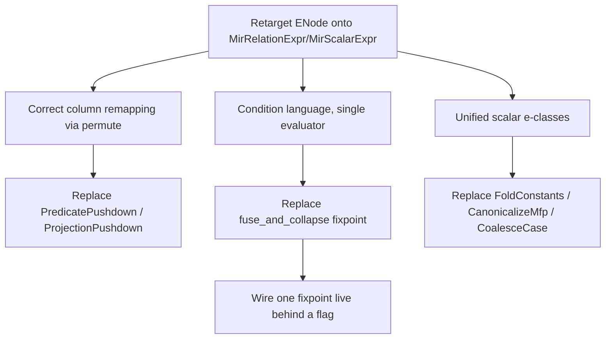

# MIR e-graph design review: replacing real optimizer passes

This review assesses what it would take to replace some of Materialize's MIR optimizer passes with the `mz-transform-egraph` equality-saturation engine.
It is a critique of the current design, not an implementation plan.
The verdict up front: the engine is a faithful, well-engineered prototype of equality saturation over a relational subset, but its current architecture is structurally unsuited to *replace* production passes, for three compounding reasons.
The dual-IR translation layer leaks (lossy round-trips, type loss, leaf bail), every side condition is implemented twice and the two implementations already disagree, and scalars are opaque so the cheapest-to-replace passes (the constant-folding and canonicalization family) are out of reach.
The single highest-leverage change is to retarget `ENode` onto the real `MirRelationExpr`/`MirScalarExpr` instead of the prototype `Rel`/`Scalar`, which removes whole classes of bugs and is the prerequisite for everything else.

## Method and sources

The review reads the engine end to end (`src/transform-egraph/src/`), the rule file (`rules/relational.rewrite`), and the real pipeline construction in `src/transform/src/lib.rs:628-995`.
Line citations are to the worktree at branch `claude/mir-equality-optimizer-sodbej`.
Where the status doc and the code disagree, the code wins and the divergence is flagged in section E.

## A. Rule completeness: can every pass be a rewrite rule?

The real logical pipeline (`src/transform/src/lib.rs:752-820`) and physical pipeline (`lib.rs:822-961`) assemble these passes.
Classifying each by whether it can live in the e-graph as an equality-preserving local rewrite:

* **Local equality rewrites (egraph-expressible, mostly already present).**
  `fusion::Fusion`, `fusion::join::Join`, `fusion::reduce::Reduce`, `compound::UnionNegateFusion`, `UnionBranchCancellation`, `ThresholdElision`, `NormalizeOps`, double-negation.
  These are the engine's bread and butter.
  `merge_filters`, `fuse_projects`, `fuse_maps`, `flatten_union`, `flatten_join_first`, `negate_negate`, `threshold_idempotent`, `distribute_*_union`, `threshold_elision`, `union_cancel` already encode them (`relational.rewrite:32-250`).
  `ThresholdElision` and `UnionBranchCancellation` are arguably the cleanest first replacement candidates because they are pure local identities backed by the `NonNeg` analysis the engine already runs (`analysis.rs:62-90`).
  `WillDistinct` (`lib.rs:636`, eliding a `Distinct` shadowed by an outer one) is the same shape and the same `NonNegative` dependency, so it is a third low-risk candidate.
  `ReduceReduction` (`lib.rs:794`, splitting a multi-aggregate reduce) is a pure structural decomposition with no analysis, also expressible once `Reduce` lowers structurally (M3a).

* **Expressible but not yet written, gated on column remapping (M2a).**
  `PredicatePushdown` (`lib.rs:775`) is the big one.
  Three rules are commented out (`relational.rewrite:117-121, 162-165, 172-177`) because pushing a predicate past a `Project` or into a non-leading join input requires re-indexing the predicate's columns, and the opaque scalar cannot be re-indexed faithfully (see section C, M2a footgun).
  `ProjectionPushdown` (`lib.rs:867`) and `ProjectionLifting` (`lib.rs:630`) are the same shape.

* **Analysis-driven, partly expressible as guarded rewrites.**
  `ReduceElision` (`lib.rs:792`) is present in restricted form: `reduce_elision` fires only when the group key is a unique key and there are no aggregates (`relational.rewrite:204-209`), backed by the `Keys` analysis (`analysis.rs:160-208`).
  The full pass also rewrites aggregates into per-row `Map`s, which needs scalar synthesis the engine cannot do.
  `NonNullRequirements`, `Demand`, `EquivalencePropagation` (`lib.rs:759, 778, 776`) are top-down/bottom-up information-propagation passes that rewrite scalars and equivalences in place; they are not local relational identities and are out of scope without scalar rewriting.

* **Fundamentally non-local or non-equality (cannot be a simple rule).**
  `JoinImplementation` (`lib.rs:875`) is cost-directed: it chooses a join order and delta-vs-differential evaluation, a whole-plan decision, not an equality.
  This is the one pass whose *decision* the engine genuinely wants to make differently (the `WcoJoin` story), but it cannot be expressed as an equality rule that survives raise, because `MirRelationExpr` has no `WcoJoin` node and `raise` collapses `WcoJoin` back to a plain `Join` (`raise.rs:93-110`), discarding the decision.
  `RedundantJoin` (`lib.rs:647, 941`) and `SemijoinIdempotence` (`lib.rs:787`) need to reason about which whole join input is redundant given the equivalences, which the opaque-scalar design forbids (`analysis.rs:155-159` admits this).
  `LiteralLifting` (`lib.rs:798, 868`) and `LiteralConstraints` (`lib.rs:871`) lift literals out and push constraints in, scalar surgery.
  `cse::relation_cse::RelationCSE` (`lib.rs:800, 879, 950`) introduces `Let` bindings, a non-equality structural choice; the engine has a `cse.rs` analogue but it is **not wired into the live path** (see section E).
  `CanonicalizeMfp` (`lib.rs:877`), `coalesce_case::CoalesceCase` (`lib.rs:863`), `FoldConstants` (`lib.rs:707`), `canonicalization::ReduceScalars` (`lib.rs:714`), `case_literal::CaseLiteralTransform` (`lib.rs:892`) are all scalar-internal rewrites, blocked on scalars being opaque.

**Recommendation (A).**
The engine can host the fusion/cancellation/threshold/union family today and predicate/projection pushdown after M2a.
It cannot host the analysis-rich scalar-rewriting passes without M2b, and it cannot host `JoinImplementation`, `RedundantJoin`, `SemijoinIdempotence`, `RelationCSE` as equality rules at all; those are cost-directed or whole-plan and belong outside the saturation core.
So "are all possible rules defined?" answers no, and a meaningful fraction are not even *expressible* as local equality-preserving rewrites.
The realistic replacement target is the fusion fixpoint (`fuse_and_collapse_fixpoint`, `lib.rs:682-700`), not the optimizer.

## B. Conditions as a language vs hardcoded pseudo-functions

Each side condition today costs four edits: a parser arm (`parser.rs:244-313`), a `Cond` enum variant (`dsl.rs:166-228`), a `Rel`-based evaluator (`matcher.rs:226-289`), and an e-class evaluator (`egraph.rs:861-938`).
There are eleven conditions; the two evaluators are 60-plus lines each of near-duplicated logic.
This is not scaling, and worse, the two evaluators have already diverged in ways that are latent soundness bugs:

* **The matcher evaluates analysis conditions directly on the `Rel`; the e-graph uses precomputed fixpoint maps.**
  `matcher.rs:247-258` calls `crate::analysis::rel_non_negative`, `rel_monotonic`, `rel_keys` on the bound subtree, with **no access to `LocalFacts`**.
  `egraph.rs:883-899` reads `an.nn`, `an.mono`, `an.keys`, which *were* seeded with `LocalFacts` (`egraph.rs:810-820`).
  So the greedy/matcher path (`engine.rs:474-483`) and the saturating path can reach opposite verdicts on `non_negative`/`monotonic`/`is_unique_key` for any plan containing a recursive `LocalGet`.
  The matcher path treats a `LocalGet` as having no analysis facts; the e-graph path may have proven it non-negative.
  The greedy optimizer is described as a "foil for comparison" (`engine.rs:12-16`), so this is currently only a correctness gap in test infrastructure, but it is exactly the kind of divergence that will bite when conditions multiply.

* **The e-graph analysis is strictly sharper.**
  The e-class `merge` combines facts across equivalent forms toward more precision (`analysis.rs:204-207, 87-89`), so a key proved by *any* form holds.
  The matcher sees one syntactic form.
  These are not the same function, yet they share a `Cond` variant and a doc comment that implies they are.

A condition *expression language* interpreted once over an abstract "fact environment" removes the duplication.
Sketch:

```
cond  := pred
pred  := support(payload) ⊆ cols(rel)          # uses_only_input
       | support(payload) ⊆ [lo, hi)            # cols_in_range, lo/hi over arity arithmetic
       | len(payload) == 0                       # empty
       | forall s in payload: lit(s) == true     # all_true
       | exists s in payload: lit(s) == false    # any_false
       | fact(rel, NonNeg)                        # analysis lookup
       | fact(rel, Monotonic)
       | superkey(support(payload), fact(rel, Keys))
       | has_node(rel, Constant{card:0})          # is_rel_empty
arith := lit | arity(rel) | arith +/- arith
```

The interpreter takes an environment exposing four primitives over bound names: `support(payload) -> ColSet`, `lit(scalar) -> Option<bool>`, `arity(rel) -> usize`, and `fact(rel, Analysis) -> Domain`.
Both the matcher and the e-graph implement that *environment trait* once each (the only legitimately different part is how `arity` and `fact` are resolved: `Rel`-recursive vs e-class-fixpoint).
The condition logic itself, the comparisons and set operations, is written once.
New conditions become data (a new `pred` form) or, in the limit, parse straight into the expression tree with no Rust change at all.
This collapses four touchpoints to one for the common case and forces the matcher/e-graph divergence into a single, auditable seam (the environment).

**Recommendation (B).**
Adopt the small predicate language.
It is independently valuable even before pass replacement because it eliminates the matcher/e-graph evaluator divergence, which is a live soundness footgun, not a style preference.
Make `LocalFacts` reachable from the matcher's environment so the two paths cannot disagree, or delete the greedy matcher path from the optimization flow entirely (it is only a foil).

## C. Scalar integration

Scalars are opaque interned `MirScalarExpr` carrying `cols`, `is_col`, `lit`, `text` (`ir.rs:42-49`, `interner.rs:53-97`).
No rule rewrites inside a scalar; the only scalar reasoning is the one-shot nullability fold at lower time that sets the `lit` flag (`interner.rs:85-95`).
Three integration paths:

* **Stay opaque with richer metadata.**
  Cheapest.
  Add more cached facts (the `lit` fold is already this).
  Unlocks nothing new structurally; the `sorry` Lean rules, `fold_constants`, `CoalesceCase`, `CanonicalizeMfp` all need to *change* the scalar, not just read a fact about it.
  Dead end for replacement.

* **Separate scalar e-graph.**
  Saturate scalars in their own e-graph, extract canonical forms, re-intern.
  Buys scalar constant folding and `CASE` canonicalization without entangling the two saturations.
  Costs a second engine and, critically, does not solve the column-remapping problem: the relational rule still moves a whole scalar list across a `Project`, and a separately-canonicalized scalar still carries column indices that the relational move must re-base.

* **Unified relational+scalar e-graph (M2b).**
  Scalars become e-classes in the same graph; scalar rewrite rules saturate alongside relational ones.
  This is the only path that unlocks `fold_constants`, `projection_extraction`, `CoalesceCase`, `CanonicalizeMfp`, and the `sorry` rules together, and it is the only path on which column references can be *nodes* the relational rewrites manipulate rather than opaque integers inside opaque text.
  Largest piece by far.

**The column-index remapping problem (M2a) is the crux, and the current code has a faithfulness bug waiting.**
When a relational rule moves a scalar across a projection or into a join input, its `#n` column references must be re-based.
`matcher.rs:481-509` (`map_scalar_cols`) rewrites the scalar's `cols`, `is_col`, and the `#n` digits in `text`, but **keeps the original interner `id`** (`matcher.rs:503`).
`raise.rs:130-135` resolves a scalar purely by `id`, ignoring the rewritten `cols`/`text`.
So if any remapping rule were enabled, raise would emit the *un-remapped* original `MirScalarExpr`, silently producing a wrong plan.
This is precisely why the three pushdown rules are disabled (`relational.rewrite:111, 158, 167`), but the disablement is a workaround, not a fix: the mechanism is unsound as written, and the status doc frames M2a as "mechanical" via `permute_map` (roadmap `M2a`) without noting that the interned-id model has to change first.
A remapped scalar is a *new* `MirScalarExpr` and must be re-interned to a new id; the prototype's text-rewriting `map_scalar_cols` cannot stand in for `MirScalarExpr::permute`.

**Recommendation (C).**
M2a is mislabeled as cheap.
Doing it correctly means the scalar payload must be the real `MirScalarExpr` (so `permute` produces a genuine, re-internable expression), which is the same retargeting that section D recommends.
Once scalars are real expressions in the graph, M2a and a large part of M2b collapse into one change rather than two milestones.
Column references should be e-graph nodes, so a relational move re-bases them by rewriting node children, not by string-substituting `#n` in a `text` field.

## D. IR integration: dual IR vs direct-on-MIR

The engine translates `MirRelationExpr <-> Rel` (`lower.rs`, `raise.rs`) and interns scalars and bailed subtrees as side tables (`interner.rs`).
Concrete costs of this boundary:

* **Lossy round-trips.**
  `raise` of a `Join` calls `MirRelationExpr::join_scalars`, which drops constant-singleton identity inputs (`raise.rs:58-66`), so `raise(lower(x)) != x` byte-for-byte for those.
  The status doc claims "exact round-trip raise" (status doc, M1 bullet); the code documents the exception inline.
  This is fine offline but is a real semantic seam if wired live.

* **Type loss on synthesized nodes.**
  `union_cancel` and `empty_false_filter` synthesize `Empty(r)`, a `Constant { card: 0, arity }` carrying only arity (`relational.rewrite:194-197, 228-232`, `matcher.rs:317-322`).
  `raise` reconstructs it as a constant of `arity` columns all typed `Int64` nullable (`raise.rs:121-127`).
  The real column types are gone.
  A reachable panic on synthesized `Empty` constants was already found and fixed in M1 (status doc, M1 bullet), which is evidence the synthesized-node path is fragile.
  Wired live, this would feed wrong types into the type-recomputing transforms downstream.

* **The opaque-leaf bail fragments the optimization unit.**
  `Constant`, global `Get`, `FlatMap`, `Reduce`, `TopK`, `ArrangeBy`, `LetRec` all bail to opaque `Get { name: "leaf:N" }` (`lower.rs:102-110`).
  A `Reduce` buried under filters becomes an opaque base relation, so `reduce_elision` can never fire on it (the rule exists, `relational.rewrite:204`, but `Reduce` never lowers structurally in M1).
  Every coverage increment is a hand-written `lower` arm plus `raise` arm plus round-trip test, indefinitely.

* **Side-table indirection and id-keyed coupling.**
  Scalars and leaves live in `Vec`s keyed by id (`interner.rs:28-38`); `LocalId` is encoded through `u64::from(&local)` widened to `usize` (`lower.rs:38-47`).
  The arity guard is a `debug_assert_eq!` (`lib.rs:52`), explicitly inadequate for release (the comment says so), and the M1 panic shows the invariant is not free.

Retargeting `ENode` onto the real types means `ENode` variants wrap `MirRelationExpr`'s own structure (children as `Id`s, payloads as real `MirScalarExpr`/`ColumnType`), eliminating `Rel`, `lower`, `raise`, and the scalar/leaf interner.
What it requires: e-graph hash-consing over `MirScalarExpr` (it is `Ord`/`Hash`, already used as `BTreeMap` keys in the interner), an arity/type recomputation that reads from the same `typ()` machinery the real tree uses, and structural handling of `Constant`/`Reduce`/etc. as first-class nodes rather than leaves.
This removes the round-trip-exactness bug, the type-loss bug, the arity guard, and the per-operator bail treadmill in one move, because there is no second IR to keep in sync.
It also makes the M2a remapping correct for free, since the payload is a real `MirScalarExpr` that `permute` rewrites and the graph re-hash-conses.

**Recommendation (D).**
Direct-on-MIR `ENode` is the right long-term design and is the keystone change.
The dual IR was the correct way to *port* a self-contained prototype quickly, but it is the wrong substrate for *replacing* production passes, where exact round-trips and real types are non-negotiable.
Sequence this before M2a/M2b/M3a, because each of those is cheaper or unnecessary once the IR boundary is gone.

## E. Synthesis: realistic first targets, blockers, and inconsistencies



**Most realistic first replacement candidates (value-to-risk).**

* `ThresholdElision` and `UnionBranchCancellation` (`lib.rs:767, 640`): pure local identities, `NonNeg` already implemented, smallest surface.
* The `fuse_and_collapse_fixpoint` family (`lib.rs:682-700`): fusion of filters/maps/projects/joins/unions, all already encoded.
  Replacing this single fixpoint, while leaving the rest of the pipeline intact, is the cleanest demonstration that saturation reaches a fixed point Materialize's ordered fixpoint also reaches, with the upside that saturation cannot get stuck (the distribute-then-merge example, `relational.rewrite:54-62`, is a genuine local-minimum escape).

**Blocked, and on what.**

* `PredicatePushdown`/`ProjectionPushdown`: blocked on correct column remapping, which is blocked on real scalars (section C/D).
* `FoldConstants`/`CanonicalizeMfp`/`CoalesceCase`/`ReduceScalars`: blocked on unified scalar e-classes (M2b).
* `JoinImplementation`: blocked on there being no MIR target for `WcoJoin`; the e-graph's join decision cannot survive raise (`raise.rs:93-110`).
  The status doc's headline win lives here and is the hardest to land.
* `RedundantJoin`/`SemijoinIdempotence`/`RelationCSE`: not equality rules; do not belong in the saturation core.

**Minimal architectural change that unlocks the most.**
Retarget `ENode` onto the real `MirRelationExpr`/`MirScalarExpr` (section D).
It is the common prerequisite for correct remapping, real scalar rewriting, exact round-trips, and real types, and it deletes the dual-IR maintenance burden.
Second, the condition language (section B), to kill the evaluator divergence.

**Recommended sequencing.**
1. Retarget `ENode` onto real MIR types; delete `Rel`/`lower`/`raise`/scalar+leaf interner.
2. Replace the four-touchpoint conditions with the predicate language over a single fact-environment trait.
3. Replace `fuse_and_collapse_fixpoint` behind a flag; A/B it for fixed-point parity.
4. Enable predicate/projection pushdown now that `permute` works on real scalars.
5. Only then attempt scalar e-classes (M2b) and the `JoinImplementation` decision (M3b).

### Inconsistencies found

* **Matcher vs e-graph condition evaluators diverge** (section B): `matcher.rs:247-258` ignores `LocalFacts` and reads one syntactic form; `egraph.rs:883-899` reads the seeded, cross-form-merged fixpoint.
  They can reach opposite verdicts on `non_negative`/`monotonic`/`is_unique_key`.

* **The remapping mechanism is unsound as written** (section C): `map_scalar_cols` rewrites `cols`/`text` but keeps the old interner `id` (`matcher.rs:503`), while `raise` resolves by `id` only (`raise.rs:130-135`).
  Enabling any remapping rule would emit un-remapped scalars.
  The disablement masks this; the roadmap calls M2a "mechanical" and does not flag it.

* **`cse.rs` is dead in the live path.**
  `eliminate_common_subexpressions` (`cse.rs:28`) is documented as the analogue of `RelationCSE`, but neither `lib.rs::optimize` (`lib.rs:44-54`) nor `engine::Optimizer::optimize` (`engine.rs:95-131`) calls it.
  Extraction loses e-graph sharing (`egraph.rs:1089` onward rebuilds a tree), and nothing re-introduces it.
  The status doc's "Leaf dedup -> union_cancel fires" refers to interner dedup (`interner.rs:112-122`), not this module.

* **The cost model's memory axis assumes the time-optimal join order** (`cost.rs:244-264`): `collect_memory` charges `binary_join_terms`, which are the intermediates of the *time-optimal* left-deep order (`cost.rs:255-258` comment admits this).
  A real engine can pick a memory-optimal order independently, so the memory cost can be overstated for binary joins, which is the axis the whole `WcoJoin` win rests on (`cost.rs:42-46`).
  The defensible-win claim (status doc, Key findings) is sensitive to this assumption.

* **The recommendation is not reachable end to end.**
  `Outcome.recommendation` (`engine.rs:104-122`) requires a time-first plan that differs from the memory-first plan and is strictly faster but heavier.
  It is computed only for the top-level Let-free fragment (`engine.rs:57-60` note) and is unit-tested only (`cost.rs:697-734`); the status doc says so ("logic in place, not yet reachable end to end").
  With relocation-only rules and no rule that trades memory for time, the two extractions coincide, so it never fires on real input.

* **Termination guards are symptom fixes.**
  `merge_filters` carries a `not_rel_empty(r)` guard, and the union-drop rules carry `not_rel_empty` guards (`relational.rewrite:32-36, 290-305`), all to stop self-referential `Filter` classes from growing predicate lists without bound.
  The status doc lists "replace the ad-hoc termination guards with a payload-growth detector" as outstanding (status doc, What is left).
  These guards are correct but fragile: each new rule risks reopening the unbounded-growth interaction, and the real fix (a growth detector or a canonical-form discipline) is unbuilt.

* **`raise` synthesizes placeholder types** (`raise.rs:121-127`): `Empty(r)` becomes an all-`Int64`-nullable constant, discarding real column types.
  Harmless offline, wrong if wired live, where downstream type recomputation would observe the placeholder types.

* **The arity guard is debug-only** (`lib.rs:52`): `debug_assert_eq!` on output arity.
  The roadmap notes promoting it to a hard check for M4 (roadmap, M4), but it remains the only structural correctness check between lower and raise, and the M1 panic shows the surrounding invariants are not self-evidently safe.

## Prioritized recommendations

1. **Retarget `ENode` onto `MirRelationExpr`/`MirScalarExpr`; delete the dual IR.**
   Removes the round-trip, type-loss, arity-guard, and per-operator-bail problems at once and is the prerequisite for correct remapping and real scalar rewriting.
2. **Replace the four-touchpoint `Cond` enum with a small predicate language over a single fact-environment trait.**
   Eliminates the matcher/e-graph evaluator divergence, which is a live soundness footgun, and makes new conditions data.
3. **Fix the remapping faithfulness bug before re-enabling any pushdown rule:** a remapped scalar is a new expression and must be re-interned (or, post-retarget, re-hash-consed), never reuse the old id.
4. **Pick `ThresholdElision`/`UnionBranchCancellation` and the `fuse_and_collapse` fixpoint as the first replacement target,** behind a flag, validated for fixed-point parity against the real fixpoint.
5. **Wire `cse.rs` into the optimization flow or delete it;** today it is dead and extraction loses all e-graph sharing.
6. **Revisit the memory cost axis:** charge a memory-optimal join order independently of the time-optimal order, since the `WcoJoin` win depends on this axis.
7. **Defer `JoinImplementation`, unified scalars (M2b), and `RedundantJoin`/`SemijoinIdempotence`/`RelationCSE`;** the first has no MIR target for its decision, the second is the largest piece, and the last three are not equality rules.
