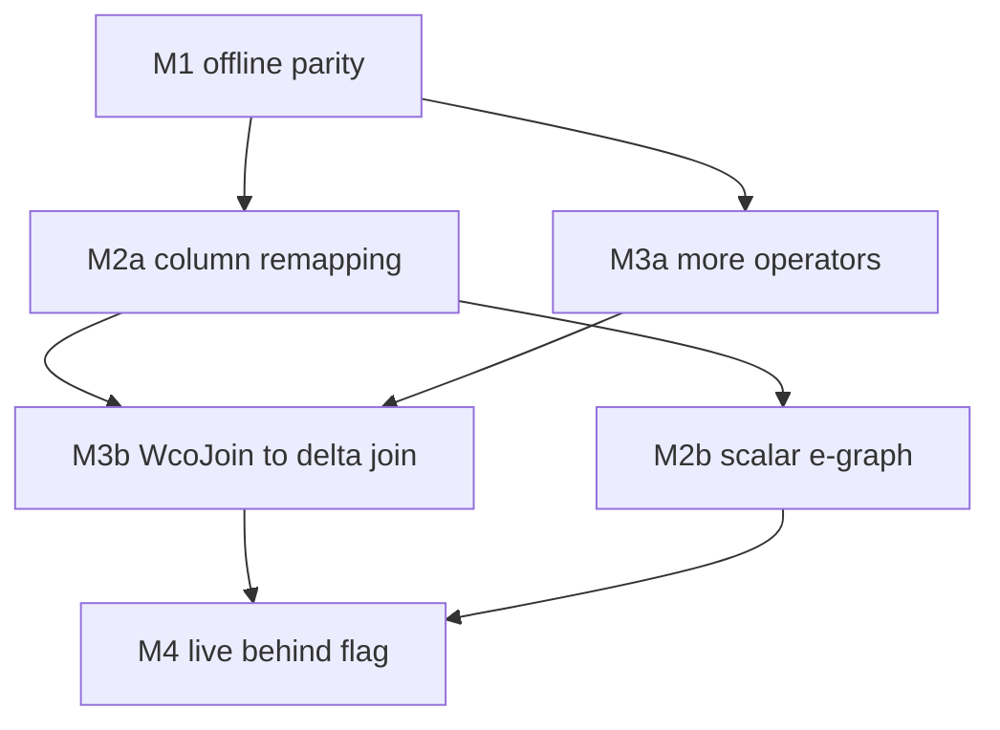

# MIR equality-saturation: roadmap past milestone 1

Milestone 1 landed an offline `mz-transform-egraph` crate that lowers real `MirRelationExpr`, saturates with the ported e-graph engine, and raises back, bailing per-subtree on unsupported variants.
Its active rules are a subset Materialize already implements, so M1 is parity, not improvement, by design.
The improvements live in three directions: rewriting inside scalars, expanding relational coverage, and turning the worst-case-optimal join into a real decision.
This document plans those milestones, their dependencies, and the demonstrable win each unlocks.

## Where M1 stands

The pass is correct and exact on its supported subset.
Verified empirically: on a filtered union, eqsat and Materialize's `predicate_pushdown` produce the identical plan, so there is no regression and no win yet.
The single genuine divergence available today is the triangle join, where the e-graph picks `WcoJoin` (`N^1.5`, AGM bound) over a binary `Join` (`N^2`), but M1 cannot emit it because `MirRelationExpr` has no `WcoJoin` variant.

## Phase-ordering hunt: negative result

A differential harness (`src/transform-egraph/tests/compare_real.rs`) runs a 20-case corpus through both eqsat and the real `logical_optimizer`, costing both under the abstract model.
The result was 3 apparent wins, 4 ties, 13 losses, and none of the wins are genuine.
All three wins are the same cost-model artifact: the real optimizer adds a canonicalizing `Project` over a join to deduplicate columns linked by equivalences, which eqsat omits, so eqsat scores one node cheaper while actually being less complete.
The ties are true parity, and the losses show eqsat lacks semantic scalar folding (`IS NULL` on a `NOT NULL` column is false) and empty-result propagation, which only M2b would add and which would convert losses to ties rather than wins.
The conclusion is that with relocation-only rules, opaque scalars, and the abstract cost model, the e-graph cannot beat Materialize's well-ordered fixpoint on these plans, so the only place a genuine different decision can live is the cost model itself, specifically the cardinality-free AGM decision for cyclic joins.
A caveat for M3b follows from this: Materialize already has an `enable_eager_delta_joins` feature that picks delta (worst-case-optimal) evaluation for cyclic joins, so the e-graph's novel contribution is not "do WCOJ" but a cardinality-free AGM cost model that decides delta versus differential, and M3b must first establish whether that decision actually differs from the existing flag before investing in `DeltaQuery` synthesis.

## Milestone 2: scalar support

Scalar support splits into two phases of very different cost.
The cheap, high-value phase re-enables the rules M1 gated off for column remapping; the expensive phase adds genuine scalar rewriting.

### M2a: column-index remapping (re-enable the gated relocation rules)

The rules disabled in M1 (`push_filter_into_join_first/second`, `push_filter_past_project`) are not scalar rewrites in the deep sense.
They only need to re-index a predicate's column references when it moves across a projection or into a join input, which `MirScalarExpr::permute`/`permute_map` already does mechanically.

* Make the matcher's `shift`/`remap` combinators (already present in the DSL) rewrite the real `MirScalarExpr` via `permute` and re-intern the result, instead of being inert on opaque scalars.
* This threads the interner into template instantiation, the one place M1 deliberately kept it out.
* Re-activate `push_filter_past_project`, `push_filter_into_join_first/second`, and any other relocation-plus-remap rule.
* Win: predicate pushdown through projections and into join inputs, which feeds join planning (M3) better-filtered inputs.

### M2b: scalar rewriting e-graph

The harder phase makes scalars first-class e-graph citizens: scalar expressions become e-classes, scalar rewrite rules (constant folding, `CASE` canonicalization, common-subexpression sharing) saturate alongside relational rules.

* Unlocks the rules emitted with `sorry` in the Lean spec (`Map`/`Project` rules that need column-structure reasoning), plus `fold_constants` and `projection_extraction`.
* Requires a scalar IR in the e-graph (the prototype's `scalar.rs`, dropped in M1, is the starting point) and a scalar cost contribution.
* Largest single piece; defer until M2a and M3 prove the relational core in the live path.

## Milestone 3: expand relational coverage and emit the join win

Two independent threads: stop bailing on common operators, and make the worst-case-optimal join a real decision.

### M3a: lower more operators structurally

Teach `lower`/`raise` to handle `Reduce`, `TopK`, `FlatMap`, and `ArrangeBy` structurally instead of bailing them to opaque leaves.

* `Reduce` is the highest value: `reduce_elision` and reduction pushdown become reachable on real aggregates once the group key and aggregates lower as payloads.
* Each operator is an independent increment: add its `lower` arm, its `raise` arm, and round-trip tests, exactly as M1 added the first nine variants.
* `LetRec` cross-binding e-matching through the recursive back-edge stays last (the prototype handles `LetRec` one level up via the recursion-aware fixpoint, but not e-matching across the back-edge).

### M3b: WcoJoin to delta-join implementation (the demonstrable win)

`MirRelationExpr` has no `WcoJoin` variant, but Materialize already evaluates some joins as delta (leapfrog-style) joins chosen by `JoinImplementation`.

* Map the e-graph's `WcoJoin` extraction decision to forcing a delta-join *implementation* on the raised `Join`, rather than inventing a new relational node.
* The cost lever is the AGM fractional-edge-cover bound, which is cardinality-free, so it makes a decision even with statistics disabled (the common case).
* Win to demonstrate: the triangle join, where the e-graph picks `N^1.5` from the AGM bound while the current heuristic join planner does not select worst-case-optimal evaluation without cardinality estimates.
* This is the first milestone whose output a benchmark can show beating the status quo.

## Milestone 4: wire into the live pipeline

Once M2a and M3 give the pass something Materialize does not already do, register it for real.

* Implement registration of `EqSatTransform` in `Optimizer::physical_optimizer` (or a dedicated `Fixpoint`) behind a feature flag, defaulted off.
* Plumb `StatisticsOracle` through `EqSatOptions` so a non-blank oracle refines leaf sizes; keep the cardinality-free AGM cost as the default when statistics are blank.
* Promote the `debug_assert_eq!` arity guard in `optimize` to a hard check before the pass can run in release.
* A/B the flag on a benchmark corpus (triangle and other cyclic joins first) to quantify the win before defaulting it on.

## Dependency order

M2a and M3a are independent and can proceed in parallel.
M3b (the first demonstrable win) depends on both, because it wants pushed-down, well-shaped joins to plan over.
M2b (full scalar rewriting) is the largest piece and gates only the scalar-aware rules, so it runs alongside rather than blocking the join win.
