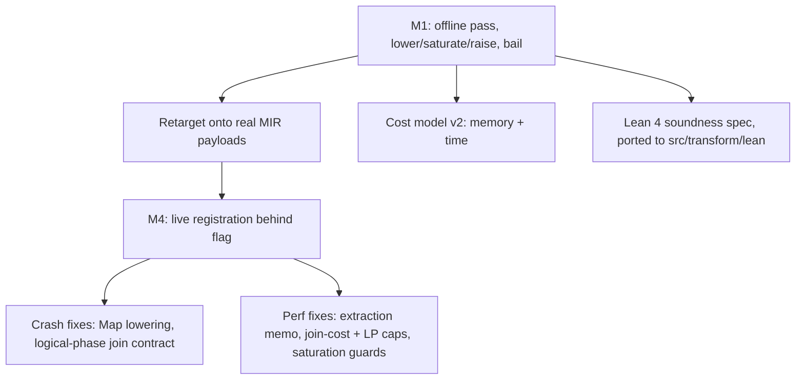

# MIR equality-saturation optimizer: project status

As of 2026-06-19, branch `claude/mir-equality-optimizer-sodbej`.
This is the single source of truth for where the effort stands; the design, roadmap, and scope-expansion plan in this directory hold the detail.

## What this is

An e-graph / equality-saturation optimizer for a subset of `MirRelationExpr`, wired into Materialize as the module `mz_transform::eqsat` (`src/transform/src/eqsat/`).
It lowers real MIR to a thin `Rel` tree carrying real scalar payloads, saturates a rule engine driven by a worst-case-optimal-join matcher, extracts the cheapest plan under a memory-and-time cost model, and raises back, bailing unsupported subtrees to opaque leaves.
The pass is registered in `Optimizer::logical_optimizer` behind the `enable_eqsat_optimizer` feature flag, which is **temporarily defaulted on** so CI exercises it across the test corpus (a TODO in `definitions.rs` tracks reverting it to `false` before the work leaves draft).
The engine began life as the standalone prototype `misc/mir-rewrite-dsl/`; that workspace is now deleted, its Rust ported into `mz_transform::eqsat` and its Lean 4 soundness spec into `src/transform/lean/`.

## Status at a glance

* Engine lives in `mz_transform::eqsat`; the old offline `src/transform-egraph` crate is gone.
* Registered live in `logical_optimizer` behind `enable_eqsat_optimizer` (default on, temporary).
* 32 active rewrite rules, 0 disabled (the two unsound negate-join rules were removed).
* `Reduce` and `TopK` lower structurally; the bail set is `Constant`, global `Get`, `FlatMap`, `ArrangeBy`, `LetRec`.
* The logical pass leaves every join `Unimplemented`; the `WcoJoin`-to-`DeltaQuery` decision ships live via the physical placement (`PhysicalEqSatTransform`, flag `enable_eqsat_physical_optimizer`, default off) and on the offline `optimize` path (see findings).
* Lean 4 spec ported to `src/transform/lean/`: 32 theorems, 13 proved, 19 `sorry` in `Generated.lean` plus 5 `sorry` in `Semantics.lean` (24 total: column-structure, n-ary list laws, and empty-oracle obligations). Regenerate with `cargo run -p mz-transform --example gen-lean`.
* Differential harness `compare_real.rs`: harness registered for the first time as a Cargo test target in this task (Cargo.toml `[[test]]` entries added); as of 2026-06-20 it terminates in ~30s with `SUMMARY: 3 wins / 0 losses / 17 ties`.
The 4 prior empty-propagation losses are now ties, closed by the unsatisfiable rule and canonicalization.
Termination is bounded by three guards: `run_analysis` `MAX_ANALYSIS_ITERS`, Phase 2b mid-loop `MAX_ENODES` recheck, and a bounded `minimize` in the eqsat merge (production `minimize` is unbounded).

## What is done

* **Milestone 1**: structural lower/saturate/extract/raise with bail-to-opaque, the saturating engine, and `apply=eqsat` datadriven tests.
* **Retarget onto real MIR payloads**: `EScalar { expr, lit }` carries the real `MirScalarExpr`; `cols`/`is_col` are live, remap is `permute`; unsupported subtrees live verbatim in `Rel::Opaque`/`ENode::Opaque` (hash-consing dedups them); `LocalGet` carries its original node. The interner is gone.
* **Single condition evaluator**: the e-class evaluator in `egraph.rs` is the only one; the divergent matcher-path evaluator and its sole caller `GreedyOptimizer` are deleted.
* **Cost model v2**: two axes, memory primary (size-weighted by the degree of each arranged collection) and time secondary. A tradeoff `Recommendation` surfaces a faster-but-heavier alternative (logic in place, not yet reachable end to end).
* **M4 live integration**: the engine moved into `mz_transform::eqsat` to break the crate cycle, registered after the logical fixpoints and before the final `Typecheck`. `EqSatTransform` guards on arity: it optimizes a clone and adopts the result only if the arity matches, else `soft_panic_or_log!` and no-op.
* **Crash fixes** (CI was fully red with the flag on):
  * Map lowering folded each scalar against input-only column types, but a `Map` scalar `i` may reference columns `0..input_arity+i`; `escalars_in_map_context` now grows the fold context per scalar.
  * `ProjectionPushdown` (run right after the logical optimizer with `include_joins=true`) panics on any filled-in join implementation, and `delta_queries::plan` installs physical-phase structure. So the live logical pass must emit plain `Unimplemented` joins. Fix: split `optimize` (commits `WcoJoin`-to-`DeltaQuery`, offline) from `optimize_logical` (raises with `commit_wcoj=false`); `EqSatTransform` calls `optimize_logical`.
* **Perf fixes** (a catalog-index optimization took 27s in `EqSatTransform`): the bottleneck was extraction, not saturation. Memoize extraction cost by built `Rel` (cost is compositional, so this is exact); cap exact join-subset costing at `MAX_EXACT_JOIN_INPUTS=8` with a left-deep estimate above it; cap `solve_cover_lp` vertex enumeration at `MAX_LP_VERTICES`. Plus saturation guards: `MAX_ENODES`, per-rule `MATCH_LIMIT` with exponential backoff, and an `EqSatTransform` `MAX_PLAN_SIZE` gate. Result: 27s to zero slow-optimization warnings.
* **Lean 4 spec ported**: emitter at `src/transform/src/eqsat/lean.rs`, proofs at `src/transform/lean/`, generator example `gen-lean`. The emitter is exhaustive over the live rule AST; generation is deterministic.

## Key findings

* **The live pass is parity, not improvement, by design.** Every active rule is one Materialize already implements, and the live pass changes no join selection.
The harness result as of 2026-06-20: `3 wins / 0 losses / 17 ties`.
The prior 4 losses (eqsat extracting `n=2`, a residual Filter, while the real optimizer reaches `n=1`, empty/constant) are now ties, closed by the unsatisfiable-to-empty rule and canonicalization.
The 3 wins remain cost-model artifacts (eqsat omits a canonicalizing `Project`).
* **The genuine divergence is the cost-model decision on cyclic joins.**
On the triangle join with no pre-existing indexes the e-graph proves `WcoJoin` dominates the binary `Join` on both axes: memory `[1.0,1.0,1.0]` versus `[2.0]` and time `[1.5]` versus `[2.0,1.5]`.
`JoinImplementation` picks the dominated binary plan with `enable_eager_delta_joins` off and on, because it weighs arrangement-setup count and cannot see the `N^2` blowup with statistics disabled.
`raise` tags a `WcoJoin` as `JoinImplementation::DeltaQuery` (via `plan_as_delta_query`, reusing `delta_queries::plan`), and that tag survives because `JoinImplementation::action` only replans `Unimplemented`/`Differential`.
Workstream D supplies a physical eqsat placement (`PhysicalEqSatTransform`, flag `enable_eqsat_physical_optimizer`, default off) that commits this decision live, with an index-aware cost model.
The WCOJ win is no longer offline-only: with the flag on it is shipped by the live physical pass.
The flag is default-off pending broader SLT validation.
* **Logical versus physical with e-graphs.** `WcoJoin`/delta is inherently physical: it needs available-arrangement and index facts that exist only in physical optimization, and our cost model is currently index-blind (empty available arrangements). The right structure is two eqsat placements: a logical one for structural rewrites (joins `Unimplemented`, the current state) and a physical one after `JoinImplementation` (fed real arrangements, with `Rel::Join` carrying its implementation through lower/raise). E-graphs in principle dissolve the logical/physical split (one saturation, one global cost, extract the optimum), but Materialize's staged pipeline reasserts the boundary through information availability, physical-operator representation, and pipeline contracts such as `ProjectionPushdown` forbidding filled joins. Realizing the unified vision means replacing a contiguous pipeline segment with one saturation, not inserting eqsat between staged passes.

## Coverage: which pipeline transforms eqsat subsumes

The goal is to subsume the optimizer pipeline (`logical_optimizer` + `physical_optimizer` + `logical_cleanup_pass`) with equality saturation.
This is where each transform stands today.

**Covered** (a live rule performs the same rewrite):

| Transform | Mechanism |
| --- | --- |
| `Fusion` (filter/project/map/union) | `merge_filters`, `fuse_projects`, `fuse_maps`, `flatten_union(_nary)` |
| `compound::UnionNegateFusion` | `distribute_negate_union(_nary)`, `negate_negate` |
| `UnionBranchCancellation` | `union_cancel` plus the empty-drop rules |
| `ThresholdElision` | `threshold_elision` (uses the `non_negative` analysis) |
| `ReduceElision` | `reduce_elision` (uses the `is_unique_key` analysis) |
| `FoldConstants` | empty-propagation rules, the nullability lit-flag, and lower-time `MirScalarExpr::reduce` on every scalar payload |
| `ReduceScalars` | lower-time `MirScalarExpr::reduce` on Filter, Map, Join-equivalence, Reduce-key/aggregate, and TopK-limit payloads |
| `CoalesceCase` | subsumed by lower-time `reduce` (CASE coalescing) |
| `CaseLiteralTransform` | subsumed by lower-time `reduce` (literal CASE rewriting) |
| `CanonicalizeMfp` | raise-time MFP coalescing: each maximal Map/Filter/Project run is extracted into `mz_expr::MapFilterProject`, optimized via `MapFilterProject::optimize`, and re-emitted via `CanonicalizeMfp::rebuild_mfp` (the full production trio) |
| `RelationCSE` | extraction-time CSE: `cse::eliminate_common_subexpressions` runs between extraction and raise, hoisting e-classes referenced more than once in the DAG into `Rel::Let` bindings with fresh ids; raise emits real `MirRelationExpr::Let` + local `Get` (type-threaded); an `is_closed` guard ensures only subtrees with no enclosing-scope local references are hoisted |

**Partial** (movement covered, value inference not):

| Transform | Gap |
| --- | --- |
| `LiteralLifting` | `MapFilterProject::optimize` (called inside the raise-time MFP coalescing) performs the literal-lifting that `LiteralLifting` does within a single MFP run; cross-operator literal lifting (hoisting constants past joins and reductions) remains out of scope |
| `EquivalencePropagation` | the `Equivalences` e-class analysis drives scalar-payload canonicalization (reducer substitution) and unsatisfiable-to-empty collapse; redundant equality-predicate drop is deferred because it needs nullability facts unavailable at saturation time (see note below) |
| `NormalizeLets` | eqsat CSE produces well-formed `Let`/`Get` with fresh ids; a subsequent `NormalizeLets` is reduced to renumbering and inlining, with no structural work remaining |
| `PredicatePushdown` | `push_filter_*` move predicates, but no equivalence-derived predicate synthesis |
| `fusion::join::Join` | `flatten_join_first` only, first input, no join commutativity in the e-graph |
| `JoinImplementation` | A second eqsat placement (`PhysicalEqSatTransform`, flag `enable_eqsat_physical_optimizer`, default off) commits the `WcoJoin`-to-`DeltaQuery` decision live, with an index-aware cost model (skips the arrangement-build memory term for join inputs already arranged on the join key). The WCOJ win is no longer offline-only. Remains Partial: the flag is default-off pending broader SLT validation, and `JoinImplementation` still runs for non-`WcoJoin` joins. Known concern: the physical pass is slow on large plans (~6.5s seen on a builtin-index plan); `MAX_PLAN_SIZE` caps worst cases, but tuning is needed before flag-on promotion. |
| `ProjectionExtraction` / `ProjectionLifting` | only `map_columns_to_projection`; no demand-driven lifting |

**Missing**, in two clusters:

* **Scalar layer**: `LiteralConstraints` and cross-operator literal lifting (the within-MFP literal lifting is now partial via MFP coalescing).
* **Analysis-propagation**: `Demand` and `ProjectionPushdown` (no column-liveness analysis), `NonNullRequirements`, `RedundantJoin`, `SemijoinIdempotence`, `ReductionPushdown`, `ReduceReduction`, `WillDistinct`, and `FlatMapElimination` (`FlatMap` is bailed to opaque).

**Deferred** (structural de-opaquing): lowering `FlatMap`, `ArrangeBy`, `LetRec`, and non-empty `Constant` is deferred because no active rules see through them, the engine already peels recursive scopes via `optimize_scope`, and non-empty `Constant` rows are not tracked in the e-graph.

**Irreducible** (not equality rewrites; eqsat may decide them, but something must still lower): `Typecheck` and `CollectNotices` (validation and diagnostics), and the `MonotonicFlag` annotation.

## Parity status (2026-06-20): first cutover landed, most passes still intact

Honest assessment after workstreams A through E: eqsat does **not yet** replace the fixpoint logical/physical optimizer, but the **first strangler-fig cutover has landed**.
`EqSatTransform` is appended after the logical fixpoints; `PhysicalEqSatTransform` is inserted before `LiteralConstraints` (default off).
**Cutover 1 (done):** the `CanonicalizeMfp` in `logical_cleanup_pass` is now skipped when `enable_eqsat_optimizer` is on (`lib.rs` ~951), because eqsat's raise-time MFP coalescing fully subsumes it.
This was validated by a differential SLT gate (golden output already eqsat-on, so zero new failures means true subsumption): AoC 125/125, LDBC BI 205/205, arithmetic 206/206, all with the pass removed.
That gate is the correct standard, and it now reads "the old pass is gone when eqsat is on and SLT is still green," not "eqsat runs as a harmless extra pass."

The remaining passes are still intact. eqsat is appended *after* the logical fixpoints (it consumes their output), so it can only *add* cleanup, not *replace* a fixpoint: cutting over the fixpoints themselves (phase 1) requires moving eqsat earlier or running it on the raw input, a larger restructuring.
CanonicalizeMfp was cuttable from the current placement only because eqsat's coalesce already produces canonical MFP and the cleanup-pass instance is a later redundancy.
The physical and fast-path `CanonicalizeMfp` instances remain (they run in phases the logical pass does not cover; the physical eqsat pass, flag off, is their path).

**Column-liveness / Demand (done, 2026-06-20).**
The Demand keystone is now built via Option B (a design spike rejected a bottom-up e-class analysis as over-approximate: demand is top-down, and one e-class shared by parents with different liveness cannot carry a single demand fact).
`raise::demand_pushdown` reuses the production `Demand` and `ProjectionPushdown` passes over the raised plan, the same strangler-fig reuse pattern as `coalesce_mfp`.
It is phase-aware: the logical phase (joins `Unimplemented`) runs `Demand` + full `ProjectionPushdown`; the physical phase (filled `DeltaQuery` joins) runs only `ProjectionPushdown::skip_joins`, omitting `Demand` which would corrupt a committed delta plan.
The differential SLT gate is green with zero diff (arithmetic 206/206, AoC 125/125, LDBC 205/205), which proves the narrowing is already subsumed by the downstream pipeline and the standalone `Demand`/`ProjectionPushdown` passes become deletable once eqsat moves earlier.
This unblocks deleting `Demand`, `ProjectionPushdown`, and (with NonNullRequirements) most of deletion phase 1.

Still missing: `RedundantJoin`, `SemijoinIdempotence`, `ReductionPushdown`, `ReduceReduction`, `NonNullRequirements`, `WillDistinct`, `LiteralConstraints`, `FlatMapElimination`.
The cardinality-free cost model caps join-order quality, but that ceiling is shared with the production `JoinImplementation`, so it is orthogonal to parity (it limits beating the heuristic, not matching it).

Next steps to parity, in order:

* **Phase 1 (delete logical fixpoints):** the Demand/liveness mechanism is now in place (`raise::demand_pushdown`, Option-B reuse). Still needs RedundantJoin, SemijoinIdempotence, the Reduce family, NonNullRequirements, and equivalence-derived predicate synthesis (rule-vs-reuse decision per transform in progress). Gate: full SLT green with `fixpoint_logical_01/02` and `fuse_and_collapse` removed. Highest risk (cost model becomes the sole objective).
* **Phase 2 (delete logical cleanup):** C and E already supply CanonicalizeMfp/RelationCSE/NormalizeLets; gated only on validation with those clusters removed. FlatMapElimination must wait for FlatMap de-opaquing. Medium risk (NormalizeLets invariants are load-bearing for rendering).
* **Phase 3 (delete physical join planning):** PhysicalEqSatTransform must plan all joins (not just WcoJoin), carry implementations through lower/raise, and replicate LiteralConstraints; gated on flag-on SLT parity plus a saturation-time budget on large plans (the ~6.5s physical-pass latency resolved). Highest risk.
* **Phase 4 (optional, beyond parity):** unify the two placements into one saturation, unlocking index selection as e-matching modulo scalar equivalence. Improvement, not parity.

Bottom line: the Demand/liveness keystone (the biggest single lever) is built and validated. The remaining phase-1 work is the four/five missing semantic transforms (RedundantJoin, SemijoinIdempotence, the Reduce family, NonNullRequirements), then moving eqsat earlier to enable the actual fixpoint deletions.

## Roadmap: one saturation in place of the pipeline

The end-state is not "no pipeline" but a pipeline reduced to `{bookkeeping} + {one saturate-and-extract} + {lowering}`.
The path is strangler-fig: grow eqsat to subsume one cluster of passes, prove the eqsat-only output is equal-or-better on the SLT corpus, delete those passes, repeat.
Five workstreams supply the capabilities; four deletion phases retire the pipeline.

**Workstreams** (capabilities):

* **(partial) A. E-class analyses.** Re-express Materialize's `analysis::{Equivalences, UniqueKeys, NonNegative, ColumnNames, Arity, Types}` and a column-liveness/demand lattice as egg-style e-class analyses that merge to a fixpoint during saturation. We already carry `non_negative`, keys, nullability, and monotonic. The `Equivalences` analysis is now wired (workstream A): it drives scalar-payload canonicalization via the `reducer()` substitution step and collapses unsatisfiable relations to empty. Demand is now acquired via Option-B reuse (`raise::demand_pushdown`) rather than as an e-class analysis, because demand is top-down and does not fit the bottom-up e-class lattice; the demand-driven projection cluster is thereby covered.
* **(done) B. Scalar canonicalization.** De-opaqued the payloads pragmatically by running `MirScalarExpr::reduce` on payloads at lower time, reusing battle-tested scalar code (the same way the lit-flag is already computed). This buys constant folding, `CoalesceCase`, and `CaseLiteral` without a scalar e-graph. A full scalar e-graph is deferred until a rewrite needs cross-operator scalar saturation.
* **C. MFP coalescing.** At raise time, fold adjacent Map/Filter/Project into `mz_expr::MapFilterProject`, subsuming `CanonicalizeMfp` and part of `LiteralLifting`.
* **(done) D. Index-aware cost and join carry-through.** The cost model now consumes `ctx.indexes` and skips the arrangement-build memory term for join inputs already arranged on the join key.
  A second eqsat placement (`PhysicalEqSatTransform`) is registered before `LiteralConstraints`/`JoinImplementation`, gated on `enable_eqsat_physical_optimizer` (default off), and commits `WcoJoin`-to-`DeltaQuery` live.
  `JoinImplementation` skips `DeltaQuery` joins so the two passes do not conflict.
  The physical pass is slow on large plans (~6.5s seen on a builtin-index plan); `MAX_PLAN_SIZE` caps worst cases; tuning is required before flag-on promotion.
* **(done) E. CSE and Let.** Extraction-time CSE hoists shared e-classes into `Rel::Let` bindings with fresh ids, wired live between extraction and raise via `cse::eliminate_common_subexpressions` with an `is_closed` guard.
  This supplies the `RelationCSE` capability and reduces `NormalizeLets` to renumbering and inlining.
  Structural de-opaquing of `FlatMap`, `ArrangeBy`, `LetRec`, and non-empty `Constant` is DEFERRED (low value without rules that see through them; see deferred section above).

**Deletion phases** (each gated on SLT parity-or-better with the flag on):

1. **Logical fixpoints.** Land A (equivalences, demand, keys) plus B. eqsat then subsumes Fusion, PredicatePushdown, EquivalencePropagation, Demand/ProjectionPushdown, RedundantJoin, SemijoinIdempotence, the Reduce family, LiteralLifting, and FoldConstants. Delete `fixpoint_logical_01`, `fixpoint_logical_02`, and `fuse_and_collapse`. This is the first real pipeline removal.
2. **Logical cleanup.** Workstream C (MFP coalescing) and workstream E (extraction-time CSE) together supply the `CanonicalizeMfp`, `RelationCSE`, and `NormalizeLets` capabilities.
   Both workstreams are complete.
   Deletion of the `logical_cleanup_pass` clusters (`CanonicalizeMfp`, `RelationCSE`, `NormalizeLets`) is gated on flag-on SLT parity.
   `FlatMapElimination` remains in the cleanup pass until de-opaquing is done.
3. **Physical.** Workstream D supplies the `JoinImplementation`/`WcoJoin` capability via `PhysicalEqSatTransform` (default-off flag `enable_eqsat_physical_optimizer`).
Deletion of `fixpoint_physical_01`, `JoinImplementation`, and `LiteralConstraints` is gated on flag-on SLT parity across the full corpus.
When parity is confirmed, delete those passes, leaving only irreducible lowering.
The `LiteralConstraints`/`JoinImplementation` deletion is the substance of index selection, which is decomposed into its own phased plan in `docs/superpowers/plans/2026-06-20-eqsat-index-selection.md` (foundational step: de-opaque `Get`/`ArrangeBy`, since demand-parameterized extraction alone does not unlock it).
4. **Unify (optional).** Collapse the two placements into one saturation only if index availability can be exposed as an analysis to a single graph; otherwise two placements is the honest steady-state.
The index-aware part of this phase (index selection modulo projection) is sub-phase I4 in the index-selection plan.

## Concrete next sequence (measured, post first fixpoint_02 cutover)

The path is driven by an earlier-placement experiment loop: insert eqsat before the fixpoints behind a toggle, run the SLT subset, catalog what breaks, build the proven blocker, repeat.
Confirmed so far: the reorder is soundness-clean (zero wrong-result failures across all variants); the two hard crash blockers were `ReduceReduction` (mixed reduction-type split, landed) and a CSE `LetRec` id-collision (landed).

* **fixpoint_logical_02 cutover** (in progress): remaining gap is plan-quality only, `SemijoinIdempotence` and the `RelationCSE` gap.
* **fixpoint_logical_01**: harder; the load-bearing missing capability is `PredicatePushdown` equivalence-setting (eqsat must emit join equivalence classes that downstream join planning and the strict-join-equivalences Typecheck require) plus `EquivalencePropagation`.
* **fuse_and_collapse**: `FoldConstants` is covered by scalar `reduce` at lower; the snag is `NormalizeLets` `LetRec` normalization, which needs `LetRec` de-opaquing for full subsumption.
* **Phase 2/3/4** as above; Phase 3 (physical join planning plus index selection) is the largest remaining effort and a legitimate stopping point (a fully-eqsat logical optimizer with the heuristic physical pipeline kept).

## Developer iteration tooling (planned, not built)

Cycle time is the dominant friction: any `mz-transform` change relinks `sqllogictest` (links the whole engine), so each iteration is roughly a six-to-ten-minute build plus a five-to-ten-minute run.
The eqsat pass is pure MIR-to-MIR inside `mz-transform`, so the fix is to iterate at that level.
The plan is a replay harness: capture the unoptimized `MirRelationExpr` fed to `EqSatTransform` (it already has Proto/serde for persistence) behind an env var, harvested in one `sqllogictest` run over the heavy files, then replay each fixture through `optimize_logical` in a test or bench that links only `mz-transform` (about a two-minute build, instant run).
This gives fast plan-shape and crash iteration and lets `samply` profile a tiny binary instead of the whole stack.
The one subtlety is capturing the `TransformCtx` (types travel in the MIR, but indexes and features must be captured too); validate fidelity once against a `sqllogictest` golden.
`test/clusterd-test-driver` is complementary: it renders and executes dataflows, so it checks answer-correctness of a plan rather than the optimizer, making it a second-tier correctness gate while `sqllogictest` becomes the final golden gate run rarely.

**A concrete payoff: index selection as e-matching modulo equivalence.**
Today index use is brittle because it matches the lookup key against an indexed key syntactically.
An index on `#0 + 5` goes unused if the plan computed `5 + #0`, and an index on an `int8` column goes unused when type widening leaves the lookup key as `numeric` (or the reverse).
In an e-graph the available index keys are anchored as e-nodes and saturated under the same scalar equality rules as the lookup key (arithmetic commutativity and associativity, sound cast laws, constant folding), so the index is usable precisely when the lookup key and some index key share an e-class, with any guard emitted as a residual filter.
This decouples the form that is written from the forms that are equal, which is exactly what syntactic matching cannot do.
Representation types (`ReprScalarType`, `doc/developer/design/20240522_mir_representation_types.md`) already absorbed the cast class that is a representation no-op, since matching now reasons over the underlying representation and ignores SQL-level modifiers, so `varchar(n)` against `text` or `numeric(p,s)` against `numeric` already match.
The residual the e-graph targets is therefore narrower but real: representation-changing injective casts such as `Int64` to `Numeric`, and expression-form equivalence such as `#0 + 5` against `5 + #0`, neither of which repr types address.
It sits at the intersection of workstream B (scalar equivalences) and workstream D (index-aware cost) and wants both in a single saturation, so it is the strongest concrete argument for the unified placement in phase 4; the pragmatic payload-canonicalization in B2 is not enough, because cast and arithmetic equivalences must be real e-graph rules for the two keys to converge.
The soundness constraint is real: equality lookups require an injective, total cast, so widening `int8` to `numeric` is reversible with an in-range guard while narrowing is not, and each admissible law is a Lean obligation (injectivity suffices, since arrangements are hash-keyed on equality and need no monotonicity).

**The central bet, and the risks.**
Pass *order* in today's pipeline silently encodes heuristic policy (push predicates before planning joins).
eqsat replaces ordering with a single global cost function, so the cost model becomes the optimizer's entire objective; if it is wrong, eqsat will confidently extract worse plans.
Because statistics are disabled (cost is cardinality-free), the hardest decisions such as join order stay heuristic regardless of eqsat, so that ceiling is orthogonal to this work.
Two hard risks to budget for: saturation cost and termination on production plans of hundreds to thousands of nodes (the reason staged pipelines exist is bounded cost), and keeping extraction deterministic so SLT output is stable.

## What is left (near-term, tracked)

* Revert `enable_eqsat_optimizer` to `false` before the work leaves draft (TODO in `definitions.rs`).
* Incremental compositional cost in extraction (compute each node's `Cost` from its children's cached `Cost`, avoiding whole-subtree rebuilds), and `Id`-indexed dense storage (also a prerequisite for any SIMD extraction).
* Replace the ad-hoc termination guards with a payload-growth detector.
* Exercise the cost-model `Recommendation` end to end (it is unit-tested only).
* Discharge the 24 `sorry` Lean obligations (19 in `Generated.lean`, 5 in `Semantics.lean`): column-structure and n-ary list laws are provable; the empty-oracle ones need the `is_rel_empty` fact modeled; and `Semantics.lean` should model `Reduce`/`TopK`/`Distinct` as non-linear (defined only on non-negative bags) so the negative-multiplicity class becomes a provable obligation rather than being masked by a linear model.
* Add a Lean obligation for the lower-time reduction soundness condition. The condition is per-rule semantic identity, not a blanket no-relaxation rule: most rules keep a scalar in an equal-or-stricter context, and the one rule that moves it from a stricter to a looser context (filter pushdown into a join input) stays sound because the join equivalence enforces the strengthened non-null fact on every surviving row, mirroring the production `predicate_pushdown`. Encode the per-rule identity so a future rule that moves a scalar without preserving its evaluated semantics is forced to discharge the obligation.
* ~~**BLOCKER: Fix `run_analysis` non-termination for `Equivalences`.**~~ Resolved (2026-06-20): three guards bound execution: `MAX_ANALYSIS_ITERS` in `run_analysis`, a mid-loop `MAX_ENODES` recheck in Phase 2b, and `minimize_bounded(None, 100)` in the eqsat `Equivalences::merge`.
Production `EquivalenceClasses::minimize` is unbounded (eqsat isolation is precise).
* **Lean obligations for the `Equivalences` consumers** (add to `src/transform/lean/`): (a) the scalar-payload canonicalization consumer preserves the multiplicity denotation because the substituted representative is row-equal to the original scalar under the e-class equivalences; (b) `unsatisfiable => Empty` is sound because contradictory equivalences imply no row can satisfy all predicates simultaneously.
* **Redundant equality-predicate drop is deferred to the typed/physical phase (workstream D).** A `Filter[#a = #b]` over a relation that derives `{#a, #b}` as an e-class equivalence looks redundant, but the analysis derives the same equivalence from both null-rejecting sources (joins on `#a = #b`) and null-preserving sources (`Map[#1 := #0]`). Dropping the filter is only sound when the column is non-nullable, because `NULL = NULL` evaluates to NULL and the filter rejects the row. Column types are unavailable at saturation time, so the drop cannot be done soundly here. The right home is workstream D, where nullability facts are present. Do not re-attempt this in the saturation phase.

## How to run

* Unit tests: `cargo test -p mz-transform eqsat`.
* WCOJ and live-contract tests: `cargo test -p mz-transform --test wcoj_decision`.
* Datadriven: `cargo test -p mz-transform --test test_transforms` (the `eqsat.spec` cases).
* Differential harness: `cargo test -p mz-transform --test compare_real -- --nocapture`.
* Regenerate the Lean spec: `cargo run -p mz-transform --example gen-lean`.

## Branch

`claude/mir-equality-optimizer-sodbej`, base `upstream/main`, unmerged.
Carries this effort's design, plan, roadmap, the live `mz_transform::eqsat` implementation, the Lean spec under `src/transform/lean/`, and this status doc.
