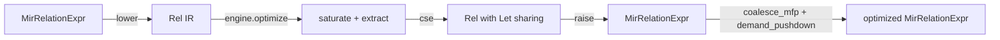

# Equality-saturation MIR optimizer: from-scratch architecture reference

This document describes the equality-saturation optimizer (`mz_transform::eqsat`) as it exists today, in enough detail to rebuild it from scratch.
It supersedes the frozen milestone-1 design (`2026-06-19-mir-egraph-saturation-pass-design.md`) and complements the living status doc (`2026-06-19-mir-egraph-status.md`).
Where the status doc tracks "what is done and what is next", this doc tracks "how the system is built and why".
The two should be read together: the status doc for the roadmap, this doc for the structure.

## Purpose

The optimizer rewrites a subset of `MirRelationExpr` by equality saturation: it builds an e-graph, applies confluent rewrite rules plus congruence closure to a bounded fixpoint, then extracts the cheapest equivalent plan under a cost model.
The long-term goal is to replace a contiguous segment of the staged transform pipeline (`logical_optimizer` + `physical_optimizer` + `logical_cleanup_pass`) with one saturate-and-extract step.
The near-term goal is parity: every active rule mirrors a rewrite Materialize already performs, so the live pass changes results only where it is provably equivalent.

## High-level data flow

The entry points live in `src/transform/src/eqsat.rs`.
Every entry point funnels through `optimize_inner`, which runs the same five stages in order.

* `lower::lower` translates `MirRelationExpr` into the `Rel` IR, interning scalars and bailing unsupported subtrees to opaque leaves.
* `engine::Optimizer::optimize` saturates the e-graph and extracts the cheapest `Rel` tree.
* `cse::eliminate_common_subexpressions` re-introduces sharing lost by extraction, binding repeated subtrees into `Rel::Let`.
* `raise::raise` translates `Rel` back to `MirRelationExpr`, optionally committing `WcoJoin` to a delta-query implementation.
* `raise::coalesce_mfp` and `raise::demand_pushdown` reuse the production `CanonicalizeMfp`, `Demand`, and `ProjectionPushdown` machinery to finish the plan.

## Modules

The crate subtree is `src/transform/src/eqsat/`.

* `ir.rs`: the `Rel` relational IR and `ENode` e-graph node, the `Rel`-subset of `MirRelationExpr`.
* `lower.rs`: `MirRelationExpr` to `Rel`, interning scalars and bailing to opaque.
* `raise.rs`: `Rel` to `MirRelationExpr`, plus `coalesce_mfp` and `demand_pushdown` reuse of production passes.
* `egraph.rs`: the e-graph, congruence/rebuild, `saturate`, and the e-class condition evaluator.
* `engine.rs`: the `Optimizer` that orchestrates saturation, scope peeling, and extraction.
* `matcher.rs`: e-matching of compiled rule left-hand sides against the e-graph.
* `analysis.rs`: e-class analyses (`NonNeg`, `Keys`, `Monotonic`, `Equivalences`, `ConstantColumns`) and the recursion-aware fixpoint.
* `cost.rs`: the two-axis cost model (memory primary, time secondary).
* `extract.rs`: greedy and ILP extractors and the extraction memo.
* `objective.rs`: extraction objectives (`ArrangementCount` memory-first, `TimeFirst`).
* `cse.rs`: extraction-time common-subexpression elimination (binds repeated subtrees into `Let`).
* `dsl.rs`: the rule DSL AST.
* `rules.rs` plus `rules/`: the rule set, compiled from `rules/relational.rewrite` at build time.
* `transform.rs`: the `Transform` wrappers `EqSatTransform` (logical) and `PhysicalEqSatTransform` (physical).
* `lean.rs`: the Lean 4 soundness-spec emitter.
* `validation.rs`: test-only validation helpers.

## The IR (`ir.rs`)

`Rel` is a faithful subset of `MirRelationExpr`.
Supported variants map structurally: `Project`, `Map`, `Filter`, `Join` (carrying `equivalences: Vec<Vec<MirScalarExpr>>`), `WcoJoin`, `Negate`, `Threshold`, `Union`, `Constant` (empty only), `Get`, `Let`/`LocalGet`, `FlatMap`, `IndexedFilter`, and `ArrangeBy`/`ArrangeByMany`.
An unsupported subtree (for example a non-empty `Constant`, or any not-yet-modeled variant) becomes `Rel::Opaque(Box<MirRelationExpr>)`, which the engine treats as an unknown base relation of known arity.
Hash-consing dedups identical opaque subtrees.
Scalars are real `MirScalarExpr` wrapped in `EScalar { expr, lit }`, with `cols` (referenced columns) and `is_col` derived live; column remap is `MirScalarExpr::permute`.

Bail is per subtree, not per plan: a `Reduce` buried under `Filter`s becomes one opaque leaf while the surrounding `Filter`/`Join`/`Union` envelope still saturates.
Every relational rule over an opaque leaf stays valid because no rule inspects a leaf's contents.

## Lowering (`lower.rs`)

Lowering walks `MirRelationExpr` bottom-up, producing `Rel` nodes and interning scalars.
It folds each scalar payload through `MirScalarExpr::reduce` at lower time, which subsumes `FoldConstants`, `CoalesceCase`, `CaseLiteralTransform`, and the scalar parts of `ReduceScalars`.
`Map` lowering grows the type-fold context per scalar, because a `Map` scalar at position `i` may reference columns `0..input_arity+i` (this was an early crash source).
`Let`/`LetRec` are lowered as binding scopes, not relational operators; recursive references become opaque `LocalGet` leaves within a fragment.

## The e-graph and saturation engine (`egraph.rs`)

The e-graph hash-conses `ENode`s into e-classes joined by a union-find, with congruence maintained by `rebuild`.
The e-class evaluator in `egraph.rs` is the single condition evaluator; relational side conditions (`uses_only_input`, `all_columns`, and similar) read the cached scalar metadata.

`saturate(rules, max_iters, locals)` runs the bounded fixpoint.
Each iteration:

* Calls `rebuild` to restore congruence.
* Checks the e-node budget `MAX_ENODES = 600`; once the e-graph exceeds it, saturation stops and extracts from what exists (a sound, if incomplete, saturation).
* Computes the e-class analyses that some active rule reads (unread analyses are skipped as per-round waste).
* Phase 2a: equivalence-reducer canonicalization rewrites scalar payloads of every e-node in a class to canonical representatives and unions the result back.
* Phase 2b: applies compiled rule right-hand sides and unions, rechecking `MAX_ENODES` mid-pass.
* Stops early when a full iteration produces no change.

Saturation guards bound worst-case cost:

* `MAX_ENODES = 600`: e-node budget; equality saturation can explode combinatorially.
* `MATCH_LIMIT` with exponential per-rule backoff: a rule whose match enumeration hits the cap is banned for a doubling number of iterations, throttling explosive rules while the rest keep firing.
* `max_iters = 100` (set in `engine.rs`): the outer iteration cap.

The `Equivalences` analysis is the dominant per-round cost (its `minimize_bounded` scales with equivalence-set size).
Two mitigations are in place:

* `MAX_EQUIVALENCES_ANALYSIS_ITERS = 4`: the inner analysis fixpoint is bounded, yielding a sound under-approximation.
* `EQ_REFRESH_EVERY = 4`: the analysis is recomputed only every fourth changed round, reusing a clone in between.
Reuse is sound because unions only add equalities (a stale result is an under-approximation), and both consumers (Phase 2a canonicalization and unsatisfiable-to-empty) are monotone.

## Analyses (`analysis.rs`)

Lattice-valued e-class analyses, one fact per e-class, run to a (bounded) fixpoint:

* `NonNeg`: non-negativity, drives `threshold_elision`.
* `Keys`: unique keys, drives `reduce_elision`.
* `Monotonic`: monotonicity.
* `Equivalences`: column-equivalence classes, drives Phase 2a canonicalization and unsatisfiable-to-empty collapse.
* `ConstantColumns`: present but currently unconsumed (no rule reads it yet).

Equivalences are created by `Filter`/`IndexedFilter` (predicate equals true), `Join`/`WcoJoin` (the join equivalence scalars), and `Map` (a new column equals its defining scalar).
`Project` restricts existing equivalences, `FlatMap` forwards them, and `Constant`/`Get`/`Opaque` yield bottom.
A `LocalGet` pulls equivalences in from `locals.equivalences`.
The fixpoint is recursion-aware: analyses flow through `LetRec` back-edges via `optimize_scope`.

## Cost model (`cost.rs`)

The cost model has two axes, memory primary and time secondary.

* Memory is the arrangement count, size-weighted by the degree of each arranged collection.
* Time is a secondary tie-breaker.
* `arrange_by_oracle_covered` credits an `ArrangeBy` whose key an available index already maintains.
* `input_already_arranged` credits `Join`/`WcoJoin` inputs that are oracle-covered on the join key, so it does not charge the arrangement-build memory term.

The logical pass constructs the model with empty availability (it cannot see arrangements); the physical pass seeds availability from the index oracle (see `build_availability`).
A tradeoff `Recommendation` can surface a faster-but-heavier alternative plan (the time-first extraction), reported when it is strictly faster on time but strictly heavier on memory.

## Extraction (`extract.rs`, `objective.rs`)

Extraction picks the cheapest representative per e-class to rebuild a `Rel` tree.

* The greedy extractor (`GreedyExtractor`, default for the logical phase) is compositional and uses the cost model directly.
* The ILP extractor (`IlpExtractor`, selected when `enable_eqsat_ilp_extraction` is on, default for the physical phase) solves an integer program for a global optimum.
* The objective is `ArrangementCount` (memory-first: arrangement count, then time, then node count) by default, with `TimeFirst` used for the recommendation alternative.

Extraction cost is memoized by built `Rel` (the cost is compositional, so this is exact), which fixed an early 27-second catalog-index optimization.
Exact join-subset costing is capped at `MAX_EXACT_JOIN_INPUTS = 8` with a left-deep estimate above it, and the cover-LP vertex enumeration is capped at `MAX_LP_VERTICES`.

## Common-subexpression elimination (`cse.rs`)

Extraction returns a tree, losing the e-graph's implicit sharing.
`eliminate_common_subexpressions` re-introduces it: it counts subtree occurrences, binds every compound subtree that occurs at least twice into a `Rel::Let` with a fresh id (above any existing id), and replaces occurrences with `Rel::LocalGet`.
This subsumes `RelationCSE`.

Two guards constrain what is hoisted:

* `is_closed`: only subtrees with no enclosing-scope local references are hoisted, preserving scoping.
* `reads_index_backed_get`: a subtree whose base (after stripping column-preserving `Project`/`Filter`/`Map`) is an `Opaque` global `Get` covered by an available index is left inlined.
Hoisting such a read into a shared `Let` would freeze a narrowing projection in front of the `Get` and defeat `JoinImplementation`'s reuse of the maintained full-width arrangement.
The logical phase passes an empty availability map, so this guard is a no-op there.

## Raise (`raise.rs`)

`raise` translates the extracted `Rel` back to `MirRelationExpr`, re-expanding opaque leaves and restoring scalars.
It threads types through CSE-introduced `Let`/`Get`.
When `commit_wcoj` is true (the offline and physical paths), a `WcoJoin` is tagged as `JoinImplementation::DeltaQuery` via `plan_as_delta_query` (reusing `delta_queries::plan`); the tag survives because `JoinImplementation::action` only replans `Unimplemented`/`Differential` joins.
The logical path raises with `commit_wcoj = false`, emitting plain `Unimplemented` joins, because the immediately following `ProjectionPushdown` (run with `include_joins`) panics on a filled-in implementation.

After raise, `optimize_inner` runs:

* `coalesce_mfp`: extracts each maximal Map/Filter/Project run into `mz_expr::MapFilterProject`, optimizes via `MapFilterProject::optimize`, and re-emits via `CanonicalizeMfp::rebuild_mfp`, subsuming `CanonicalizeMfp` and the within-MFP part of `LiteralLifting`.
* `demand_pushdown`: reuses the production `Demand` and `ProjectionPushdown` over the raised plan.
It is phase-aware: the logical phase runs `Demand` plus full `ProjectionPushdown`; the physical phase runs only `ProjectionPushdown::skip_joins` (running `Demand` would corrupt a committed delta plan).
* A second `coalesce_mfp` tidies the projections demand pushdown introduces.

## Engine orchestration (`engine.rs`)

`Optimizer::optimize` handles `Let`/`LetRec` structurally, because finite saturation cannot represent a recursive fixpoint.

* A maximal Let-free fragment is added to a fresh e-graph, saturated, seeded for indexed filters, and extracted.
* A `Let`/`LetRec` scope goes to `optimize_scope`, which solves the recursion-aware analyses for the bound ids and re-optimizes each binding value and the body for up to `SCOPE_REFINE_ROUNDS = 4` rounds (a rewrite can expose a stronger invariant that unlocks another), stopping early when a round produces no change.
* A node above a scope goes to `optimize_around_scopes`, which replaces each maximal scope with an opaque `LocalGet` placeholder carrying its proven properties, saturates the surrounding fragment, and splices the optimized scopes back.

For a non-recursive `Let`, `optimize_body_with_let_union` optimizes the body in an e-graph that also contains the optimized definition, unioning the `Get id` class to the definition's root so the definition's analysis facts reach the body's reference via congruence.

## Rules (`dsl.rs`, `rules.rs`, `rules/`)

Rules are written in a DSL in `rules/relational.rewrite` and compiled to Rust at build time (per-rule codegen via a chumsky parser in `build.rs`).
Rules carry a phase tag (`logical` or `physical`); `for_phase` filters the rule set.
The active relational rules include filter/project/map/union fusion, filter-through-map and filter-over-union distribution, union flattening and cancellation, double negation, threshold idempotence and elision, reduce elision, empty-on-false-filter and empty propagation, map-of-column-refs to projection, negate and threshold distribution over union, `flatten_join_first`, and the WCO-join exploration (physical phase).
The `Equivalences`-driven canonicalization and unsatisfiable-to-empty collapse run in the engine (Phase 2a), not as DSL rules.

## Live integration (`transform.rs`, `lib.rs`)

Two `Transform` wrappers register the pass in the live pipeline behind per-phase feature flags.

* `EqSatTransform` (logical): appended after the logical fixpoints in `logical_optimizer`, gated by `enable_eqsat_optimizer`.
It calls `optimize_logical` (joins stay `Unimplemented`).
* `PhysicalEqSatTransform` (physical): inserted in `physical_optimizer` after `fixpoint_physical_01` and before `LiteralConstraints`/`JoinImplementation`, gated by `enable_eqsat_physical_optimizer`.
It calls `optimize_with_availability` with index availability from the oracle, commits the `WcoJoin`-to-`DeltaQuery` decision, and uses ILP extraction when `enable_eqsat_ilp_extraction` is on.

Both wrappers share two guards:

* `MAX_PLAN_SIZE = 200`: plans larger than this node count skip the pass (a sound no-op), because saturation cost is superlinear and large plans can take tens of seconds.
* `adopt_if_type_preserving`: the pass optimizes a clone and adopts it only if arity and every column's representation scalar type match the input; on any mismatch it leaves the plan unchanged and `soft_panic_or_log!`s.
Nullability is intentionally not compared (a `Filter` legitimately strengthens columns to non-null).

All three flags (`enable_eqsat_optimizer`, `enable_eqsat_physical_optimizer`, `enable_eqsat_ilp_extraction`) default on this branch but do not exist on `upstream/main`.

## Soundness (`lean.rs`, `src/transform/lean/`)

The rule semantics have a Lean 4 specification.
`lean.rs` emits the live rule AST exhaustively and deterministically (the `gen-lean` example drives it); the proofs live in `src/transform/lean/`.
A separate runtime guard is the differential SLT gate: with the goldens already eqsat-on, removing a subsumed production pass and observing zero new SLT failures proves true subsumption rather than harmless redundancy.

## Coverage

The status doc carries the authoritative per-transform coverage table (covered, partial, missing, deferred, irreducible).
In brief: fusion, union/negate/threshold simplification, reduce/threshold elision, constant folding, scalar reduction, MFP canonicalization, and CSE are covered; equivalence propagation, literal lifting, predicate pushdown, join fusion, and join implementation are partial; demand/projection-pushdown is reused rather than subsumed; `FlatMap`/`ArrangeBy`/`LetRec`/non-empty `Constant` de-opaquing is partially landed and partially deferred.

## Known performance characteristics

* The logical pass on join-heavy queries is the current optimization-time regression (TPCH Q08 about 15x slower optimization with eqsat on, debug build); see `project_egraph_tpch_opt_time_regression` in the agent memory.
The per-call `optimize_inner` cost is small (about 1ms); the aggregate cost is diffuse and not yet isolated to a single hotspot.
* The physical pass is slow on large plans (about 6.5s seen on a builtin-index plan); `MAX_PLAN_SIZE` caps the worst cases but tuning is needed before flag-on promotion.
* The `Equivalences` analysis dominates saturation cost; `EQ_REFRESH_EVERY` is the lever (B2). Seeding the per-round fixpoint (B1-lite) was tested and rejected as 1.3-1.6x slower on eq-heavy plans.

## Future direction: highest-impact changes

The search machinery (e-graph, rules, extraction) is in good shape.
The remaining leverage is in what the optimizer *believes* and whether that belief can be *trusted*, not in more rules or more search.
The changes below are ordered by how hard each gap blocks the end goal: produce equal-or-better plans, soundly, on all plans, in acceptable time.

### 1. Ground the cost model in cardinality estimation

The cost model determines plan quality, and everything downstream of it (extraction, the join orderer, the bushy-vs-left-deep verdict) inherits its errors.
Two structural problems limit it today.
First, AGM gives a worst-case-optimal *bound* via fractional edge cover, not an *estimate*, so it systematically misprices selective joins and anchors plan choices to worst-case shapes.
Real cardinality estimation (histograms, distinct counts, correlation) fed from catalog and persist statistics, and ideally from measured runtime cardinalities of already-running dataflows, would change plan choices fundamentally.
Second, the cost weights are hand-tuned to the status quo, so marginal changes flip plans (the bushy-join probe demonstrated this fragility).
Calibrating the weights against measured dataflow memory and compute over a query corpus turns the model from a guess into a fitted predictor.
The arrangement-sharing redesign (`2026-06-22-eqsat-arrangement-sharing-cost-model-design.md`) is the first step of this.

### 2. Build a soundness oracle

A single wrong plan in production is a data-correctness incident, so soundness is the existential risk and the multiplier on every other change.
Today the defenses are the boundary type guard (`adopt_if_type_preserving`), the Lean spec, the differential SLT gate, and debugging rule bugs while fresh.
Two additions would make the project shippable with confidence: a differential testing harness that runs the old and new optimizers over a large corpus and checks *actual row equivalence on randomized data* (not just typecheck), and per-rule machine-checked equivalence proofs extending the existing Lean spec.
A strong oracle is license to be aggressive: it lets us add rules, raise the size cap, and promote the flag in production without fear, so it de-risks items 1, 3, and 4 simultaneously.

### 3. Scale saturation past the size cap

`MAX_PLAN_SIZE = 200` makes the pass a sound no-op on large plans, so the optimizer is invisible on exactly the complex plans where optimization pays most.
The cap is load-bearing and must not be removed now: saturation cost is superlinear, the `Equivalences` analysis is the unfixed bottleneck, and the blowup was observed on builtin indexes that run at catalog bootstrap.
Removing it today would push catalog bootstrap and large user-plan optimization past their time budgets, a regression rather than a feature.
The work that unlocks coverage is attacking the equivalences hotspot directly (incremental maintenance rather than the periodic-refresh B2 mitigation), egg-style deferred rebuild to batch congruence maintenance, and region or hierarchical saturation so large plans get partial treatment instead of nothing.
Once saturation scales, the right replacement for the node-count cap is a wall-clock budget with graceful bail-out, which extracts as much saturation as fits the time box instead of failing at an arbitrary size cliff.

### 4. Close the loop on physical join planning

The e-graph *costs* join orders, but the actual order and key are decided downstream by `JoinImplementation`, so the cost-model choice does not drive the physical plan.
Absorbing join order and key selection into cost-driven extraction (already in the arrangement-sharing spec) makes the e-graph's decision the committed plan, so the cost work it does actually counts.
This depends on item 1: the loop is only worth closing once the cost model is trustworthy.

### 5. Expose the cost-model knobs

Making the memory-versus-time weight, the cross-product penalty, and the bushy preference explicit parameters makes the tradeoffs steerable and testable.
This is partly a means to item 1 (weights cannot be calibrated until they are addressable), so it lands early in practice despite ranking lower as a standalone change.

### 6. Subsume the contextual-analysis boundary

`Demand` and `ProjectionPushdown` are reused rather than subsumed because they need top-down, contextual liveness, and an e-class is shared across many parents with different demand.
E-graphs handle bottom-up, compositional analysis well (types, keys, sign) and top-down, contextual analysis badly, so this boundary is a genuine architecture limit, not a missing feature.
`LiteralConstraints` stays external for an orthogonal reason: it needs the index oracle.
Subsuming these buys maintainability, not plan quality, so it ranks last or never.

## Testing

* Unit tests: `bin/cargo-test -p mz-transform <filter>` (the `eqsat` module has lower/raise round-trip, cost, extraction, and CSE tests).
* Datadriven: `apply=eqsat` specs under `src/transform/tests/test_transforms`; rewrite with `REWRITE=1 cargo test ...`.
* sqllogictest differential gate: `bin/sqllogictest --optimized -- <file>`; rewrite with `bin/sqllogictest -- --rewrite-results --replica-size=scale=1,workers=2 --replicas=1 <file>`.
The gate is run with goldens already eqsat-on, so zero new failures after removing a production pass proves subsumption.
* Optimization-time benchmark: `OptbenchTPCH` in `misc/python/materialize/feature_benchmark/scenarios/optbench.py`, measuring `EXPLAIN ... WITH(timing)` optimization time over 22 TPCH queries (30% wallclock threshold).

## From-scratch rebuild checklist

1. Define the `Rel` IR as a faithful `MirRelationExpr` subset with an `Opaque` bail variant and interned scalars.
2. Build the e-graph with hash-consing, union-find, and congruence `rebuild`.
3. Implement `lower` (with per-scalar `reduce` and the per-scalar Map type-fold context) and `raise` (with the `commit_wcoj` split).
4. Implement the bounded `saturate` loop with the two-phase rule application, the analyses, and the budgets (`MAX_ENODES`, `MATCH_LIMIT` backoff, `max_iters`, `EQ_REFRESH_EVERY`, `MAX_EQUIVALENCES_ANALYSIS_ITERS`).
5. Implement the two-axis cost model and the greedy and ILP extractors with the extraction memo and the join/LP caps.
6. Implement CSE with the `is_closed` and `reads_index_backed_get` guards.
7. Implement `coalesce_mfp` and the phase-aware `demand_pushdown` by reusing the production passes.
8. Implement the engine scope peeling (`optimize_scope`, `optimize_around_scopes`, `SCOPE_REFINE_ROUNDS`).
9. Author the rule DSL and the build-time codegen, tagged by phase.
10. Register the two `Transform` wrappers with the `MAX_PLAN_SIZE` and `adopt_if_type_preserving` guards, behind the three feature flags, at the documented pipeline placements.
11. Wire the Lean emitter and the differential SLT gate for soundness.
