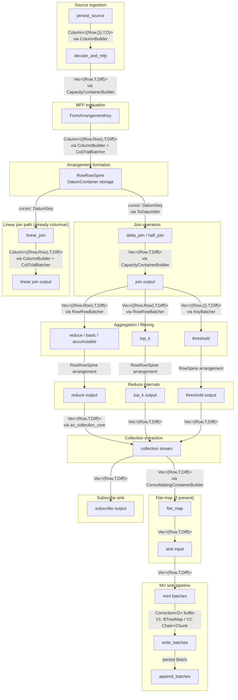

# Freshness investigation log

## Status

Investigation complete across 14 areas. Findings below.

---

## End-to-end freshness model

Data flows through this pipeline, each stage contributing latency:

```
Source (Kafka/PG/MySQL)
  → Persist shard (write via compare_and_append)
    → txn-wal (commit → apply → tidy)
      → persist_source (listen/poll for new batches)
        → Compute dataflow (joins, reduces, top-k, etc.)
          → MV sink (correction buffer → batch → persist write)
            → Controller (frontier aggregation across replicas)
              → Coordinator (timestamp selection, peek serving)
```

---

## 1. Server maintenance interval (HIGH impact)

**Location:** `src/compute/src/server.rs:337-367`

The compute server's main loop runs maintenance every `COMPUTE_SERVER_MAINTENANCE_INTERVAL` (default **10ms**).
Maintenance includes `report_frontiers()`, `report_metrics()`, and `traces.maintenance()`.
Between maintenance windows, `step_or_park(sleep_duration)` can park the worker thread.

This creates a **10ms latency floor** for frontier visibility to the coordinator.
Even if data is processed instantly, the coordinator won't learn about it until the next maintenance cycle.

**Improvement ideas:**
* Reduce to 1ms (tradeoff: ~10x more maintenance overhead, ~0.5-1% CPU).
* Make maintenance event-driven (trigger on frontier advancement rather than timer) — substantial refactor.
* Allow `step_or_park` early wake-up via activator when frontiers advance.

---

## 2. Monotonic top-k 10-second delay (HIGH impact)

**Location:** `src/compute/src/render/top_k.rs:189`

Monotonic top-k uses a `SemigroupVariable` with a hardcoded **10-second** feedback loop delay:
```rust
let delay = std::time::Duration::from_secs(10);
```

This allows the system to retract records that will never again be in the top-k, but it means top-k results lag by up to 10 seconds.

**Improvement ideas:**
* Make the delay configurable per-query or via dyncfg.
* Use adaptive delay based on data characteristics (rate of change).
* Provide a "low-latency top-k" mode that trades memory for freshness.

---

## 3. Persist listen polling (HIGH impact)

**Location:** `src/persist-client/src/internal/machine.rs:1188-1195`

The persist `Listen::next()` uses a **1200ms fixed sleep** as its polling interval, with exponential backoff up to **16 seconds**.
Parameters:
* `NEXT_LISTEN_BATCH_RETRYER_FIXED_SLEEP`: 1200ms
* `NEXT_LISTEN_BATCH_RETRYER_INITIAL_BACKOFF`: 100ms
* `NEXT_LISTEN_BATCH_RETRYER_CLAMP`: 16s

A `StateWatch` broadcast can wake listeners faster, but the default path is poll-based.

**Improvement ideas:**
* Reduce fixed sleep to 100ms (10x improvement, more CRDB load).
* Enable PubSub push for listen path (currently only used for state cache).
* Add metrics to distinguish watch-woken vs. sleep-woken listen calls.

---

## 4. Txn-wal polling and apply phase (HIGH impact)

**Location:** `src/txn-wal/src/operator.rs:446-462`

The txn-wal read path uses separate polling with **1024ms initial backoff**, clamped at **16 seconds**:
* `DATA_SHARD_RETRYER_INITIAL_BACKOFF`: 1024ms
* `DATA_SHARD_RETRYER_MULTIPLIER`: 2x
* `DATA_SHARD_RETRYER_CLAMP`: 16s

Additionally, the three-phase commit model (commit → apply → tidy) means reads at `commit_ts` block until the apply phase completes.
The logical/physical frontier gap requires the `txns_progress` operator to translate frontiers.

**Improvement ideas:**
* Dynamic polling based on write frequency (adapt backoff to actual data rate).
* Reduce initial backoff for latency-sensitive sources.
* Pipeline apply with commit (start apply before commit ACK returns).

---

## 5. Multi-replica frontier aggregation (HIGH impact)

**Location:** `src/compute-client/src/service.rs:191-228`

`PartitionedComputeState` aggregates frontier responses across all replicas using a **meet (minimum) operation**.
A frontier response is only emitted when **all** replicas have reported and there's advancement.
No timeout mechanism exists — the slowest replica dominates.

**Improvement ideas:**
* Add timeout-based fallback (emit best-known frontier after N ms).
* Majority-based frontier reporting (2-of-3 replicas sufficient).
* Independent per-replica frontier tracking for peeks.

---

## 6. Correction buffer staging (MEDIUM impact)

**Location:** `src/compute/src/sink/correction_v2.rs`

CorrectionV2 buffers updates in a `Stage` until they fill a `Chunk` capacity before consolidating and inserting into chains.
For low-throughput MVs, updates can sit in the stage buffer until the next frontier advancement forces a flush.

Chain invariant: each chain has `>= CHAIN_PROPORTIONALITY (= 3)` times as many chunks as the next, triggering consolidation when violated.

**Improvement ideas:**
* Emit partial chunks on frontier advancement (don't wait for full chunk).
* Add time-based flush trigger for low-throughput sinks.
* Make `CHAIN_PROPORTIONALITY` configurable.

---

## 7. Pending peeks block trace compaction (MEDIUM impact)

**Location:** `src/compute/src/compute_state.rs:1117-1138`

When a peek arrives, it captures a `TraceBundle` and sets:
* `set_logical_compaction(peek_timestamp)` — prevents cleanup below timestamp
* `set_physical_compaction(Antichain::new())` — **prevents ALL batch merging**

Long-running peeks hold these constraints indefinitely, causing batch accumulation and degrading subsequent reads.

**Improvement ideas:**
* Allow merging above peek timestamp (only prevent logical compaction below it).
* Release trace reference after stashing large peek results to persist.
* Add peek timeout to prevent unbounded holds.

---

## 8. Join operator yielding (MEDIUM impact)

**Locations:**
* `src/compute/src/render/join/delta_join.rs:372` — yield after 1M records
* `src/compute/src/render/join/linear_join.rs:153-154` — yield after 1M work or 100ms

Both delta and linear joins yield after processing 1M records.
Linear joins also have a time-based yield at 100ms (configurable via `LINEAR_JOIN_YIELDING`).

During large joins, the operator holds the timely thread for the entire fuel budget before yielding, delaying other operators.

**Improvement ideas:**
* Reduce default thresholds for latency-sensitive workloads.
* Make delta join yield threshold configurable (currently hardcoded).
* Add per-dataflow yield configuration.

---

## 9. Logical backpressure (MEDIUM impact)

**Location:** `src/compute/src/render.rs:1768-1835`

When `ENABLE_COMPUTE_LOGICAL_BACKPRESSURE` is enabled (default: false), the `LimitProgress` operator holds back input capabilities.
`COMPUTE_LOGICAL_BACKPRESSURE_INFLIGHT_SLACK` (default: 1s) rounds timestamps, adding up to 1 second of latency.

**Improvement ideas:**
* Reduce slack for freshness-sensitive dataflows.
* Make backpressure adaptive (tighten during low load, relax during high load).

---

## 10. Arrangement maintenance timing (MEDIUM impact)

**Location:** `src/compute/src/arrangement/manager.rs:55-72`

`TraceManager::maintenance()` is the **only** place physical merging happens.
Called every 10ms from the server maintenance loop.
Between cycles, batches accumulate unmerged, slowing cursor-based reads (peeks, joins).

**Improvement ideas:**
* Trigger maintenance on batch count threshold (demand-driven).
* Allow inline merging during operator execution.
* Increase `ARRANGEMENT_EXERT_PROPORTIONALITY` for more aggressive background merging.

---

## 11. Persist write path (MEDIUM impact)

**Location:** `src/persist-client/src/batch.rs:421-425`

Batch builder flushes to blob when `goodbytes() >= BLOB_TARGET_SIZE` (default **128 MiB**).
No time-based flush trigger exists.
For low-throughput sources, small batches can sit in memory indefinitely until the threshold is hit.

`compare_and_append()` is a **synchronous consensus barrier** — all writes block until CRDB/Postgres ACKs.

**Improvement ideas:**
* Add time-based flush (e.g., flush every 1s regardless of size).
* Reduce `BLOB_TARGET_SIZE` for latency-sensitive shards.
* Pipeline consensus writes (async compare_and_append).

---

## 12. Source polling intervals (MEDIUM impact)

**Locations:**
* `KAFKA_POLL_MAX_WAIT`: 1s (storage-types dyncfgs)
* `PG_FETCH_SLOT_RESUME_LSN_INTERVAL`: 500ms
* `MYSQL_REPLICATION_HEARTBEAT_INTERVAL`: 30s

These are upstream of compute but directly affect when new data enters the pipeline.

**Improvement ideas:**
* Reduce Kafka poll to 100ms for low-latency sources.
* Add event-driven Kafka consumption (librdkafka supports it).
* Reduce MySQL heartbeat for change-heavy workloads.

---

## 13. Controller-side frontier processing (MEDIUM impact)

**Location:** `src/compute-client/src/controller/instance.rs:1870-1908`

The controller processes `ComputeResponse::Frontiers` messages and updates `SharedCollectionState` (mutex-protected).
Frontier delivery to clients happens via `maybe_update_global_write_frontier()`.
No debouncing in the protocol — each advancement generates a message.

`AllowCompaction` is reactive (sent when read holds change), not proactive.

---

## 14. Flat-map and decode fuel (LOW-MEDIUM impact)

**Locations:**
* `COMPUTE_FLAT_MAP_FUEL`: 1M (compute-types dyncfgs)
* `STORAGE_SOURCE_DECODE_FUEL`: 100K (persist-client)

These control how much work operators do per activation before yielding.
Lower values improve responsiveness but increase scheduling overhead.

---

## 15. Arrangement size logging overhead (MEDIUM impact for write-heavy workloads)

**Location:** `src/compute/src/extensions/arrange.rs:241-337`, `src/compute/src/logging/differential.rs:349-357`

Logging dataflows share the timely worker with compute dataflows.
`RcActivator` with threshold 128 batches log activations to reduce overhead.

However, **arrangement size activators have no batching** — they fire immediately on every differential batch/merge/drop event via `notify_arrangement_size()`.
Each activation scans ALL batches in the arrangement's `BTreeMap<*const Batch, Weak<Batch>>`, calling `heap_size()` on keys, vals, and upds storage.
With 100+ arrangements on write-heavy workloads, this adds 1-5ms of scheduling overhead per maintenance cycle.

Logging timestamps are rounded to `interval_ms` boundaries, creating a hard staleness lag for introspection queries.

**Improvement ideas:**
* Batch arrangement size activations (e.g., once per millisecond instead of every event).
* Use differential tracking (only scan changed batches) instead of full rescan.
* Make logging interval configurable per-collection.

---

## 16. Timestamp selection and linearizability barrier (MEDIUM impact)

**Location:** `src/adapter/src/coord/timestamp_selection.rs`, `src/timestamp-oracle/src/batching_oracle.rs`

Peek timestamp selection varies by isolation level:
* **Serializable:** Uses `FreshestAvailable` preference — picks `upper.step_back()` (freshest available).
* **Strict serializable:** Uses `StalestValid` preference with oracle constraint — requires `oracle.read_ts().await`, adding oracle round-trip latency.

The batching oracle collects concurrent `read_ts()` calls and issues a single oracle call, returning the same timestamp to all callers.
This trades per-call freshness for throughput.

A **linearizability barrier** exists: if `chosen_ts >= upper` (timestamp in the future of some collection), the coordinator must wait for the write frontier to advance before returning results.

**Improvement ideas:**
* For serializable workloads, freshness is limited by write frontier advancement — optimizing compute pipeline is the path forward.
* For strict serializable, oracle latency is the bottleneck — faster oracle or reduced batching helps.
* Consider allowing queries to opt into `FreshestAvailable` even under strict serializable when real-time recency is enabled.

---

## 17. Backpressure mechanisms (MEDIUM impact, mostly disabled)

**Locations:**
* Physical: `src/storage-operators/src/persist_source.rs` — `max_inflight_bytes` (default: disabled)
* Logical: `src/compute/src/render.rs:1768-1845` — `LimitProgress` (default: disabled)
* Memory: `src/compute/src/memory_limiter.rs` — process-level kill (default: 10s interval)

Physical backpressure (`DATAFLOW_MAX_INFLIGHT_BYTES`) tracks emitted-but-not-retired bytes from persist sources and stalls emission when budget exceeded.
Currently disabled by default — no active flow control on source data rate.

Logical backpressure holds capabilities at 1-second boundaries, preventing sub-second frontier advancement when enabled.

Memory limiter runs independently and **terminates the process** (exit code 167) when memory exceeds limit — no graceful degradation.

**Improvement ideas:**
* Enable physical backpressure with conservative limits (e.g., 1 GiB) to prevent runaway memory growth.
* Set `MEMORY_LIMITER_BURST_FACTOR > 0` for graceful degradation under temporary spikes.
* Add adaptive backpressure that responds to downstream processing rate.

---

## 18. Snapshot hydration blocking (MEDIUM impact, startup only)

**Location:** `src/compute/src/render.rs:1687-1719`, `src/persist-client/src/internal/machine.rs:813-877`

New dataflows with `SnapshotMode::Include` block on `read.snapshot(as_of).await`, entering a watch+sleep retry loop.
`suppress_early_progress()` holds the minimum capability until the frontier advances beyond `as_of`, preventing empty batch insertion during arrangement spine merges (fixes issue #6368).

This delays first frontier advancement for new MVs by seconds to minutes depending on snapshot size.

Subscribe dataflows avoid this via `SUBSCRIBE_SNAPSHOT_OPTIMIZATION` (enabled by default), using `SnapshotMode::Exclude`.

**Improvement ideas:**
* Investigate lazy/streaming snapshot loading to allow partial frontier advancement.
* Pre-fetch snapshots for anticipated dataflows during idle periods.

---

## 19. Worker scheduling model (LOW impact)

No work-stealing between timely workers.
Core affinity is enabled by default on Linux.
Skewed data distribution can cause hot workers, but this is a data layout issue not a scheduling issue.

---

## 20. Coordinator frontier consumption (LOW impact)

**Location:** `src/compute-client/src/controller/instance.rs:936-947`

The controller processes frontier responses synchronously, one at a time via `tokio::select!`.
Each `ComputeResponse::Frontiers` immediately updates `SharedCollectionState` under mutex and delivers `FrontierUpper` to clients.
No batching or debouncing — each advancement is propagated immediately.

Frontier updates do **not** directly trigger pending peeks.
The coordinator polls frontiers via task scheduling, not event-driven notification.

**Improvement ideas:**
* Event-driven peek triggering (notify sequencer when frontier advances past peek timestamp).
* Lock-free frontier reads using atomics instead of mutex.

---

## Deep-dive: hydration vs steady-state

### Hydration (startup)

Bottleneck is **snapshot I/O and arrangement building**, not the maintenance interval.
Sequence: persist snapshot fetch → suppress_early_progress holds capability → arrangement builds from snapshot → frontier advances past as_of → collection marked hydrated.
`suppress_early_progress` prevents memory spikes from empty batch insertion during arrangement hydration.
`HYDRATION_CONCURRENCY` (default 4) is defined but not actively used in scheduling.
`DELAY_SOURCES_PAST_REHYDRATION` (default true) prevents raw source data from overwhelming downstream during upsert rehydration.

**Most promising hydration improvements:**
* Streaming/incremental snapshot loading (partial frontier advancement before full snapshot)
* Better hydration concurrency control (currently implicit)
* Faster snapshot fetch from persist (reduce snapshot read latency)

### Steady state

Bottleneck is the **10ms maintenance interval** for frontier reporting.
Data flows continuously: persist listen → decode → operators → sink.
All operators run without suspension.

**Most promising steady-state improvements:**
* Reduce maintenance interval (but `report_frontiers()` cost scales with collections — see below)
* Event-driven frontier reporting (push instead of poll)
* Dirty-tracking for changed frontiers (skip scanning unchanged collections)

## Deep-dive: maintenance cycle cost

### Per-operation breakdown

| Operation | Cost | Allocations | Work on no change? |
|-----------|------|-------------|-------------------|
| `traces.maintenance()` | O(traces) ~microseconds | 0 | Sets metadata only, no merging |
| `report_frontiers()` | O(collections × probes) | 1-5 Antichain clones | **YES — scans all collections** |
| `report_metrics()` | O(1) | 0 | Negligible |
| `check_expiration()` | O(1) | 0 | Negligible |
| `record_shared_row_metrics()` | O(1) | 0 | Negligible |

`report_frontiers()` is the **sole bottleneck** for increasing tick frequency.
It iterates ALL non-subscribe collections, reads trace uppers, checks input probes, and compares frontiers — even when nothing changed.

### What happens at 1ms interval

With 1000 collections: 1000 frontier scans/second → ~100K comparisons/second just in `report_frontiers()`.
With 100 collections: manageable, ~10K comparisons/second.

`traces.maintenance()` is cheap — `set_physical_compaction` just marks metadata, actual merging happens lazily during operator execution.

### Optimization path for faster ticks

1. **Dirty-tracking**: maintain a `HashSet<GlobalId>` of collections whose frontiers changed since last report. Only scan those. Requires probes or traces to notify on change.
2. **Event-driven reporting**: push frontier updates from operators as they advance, not on timer. Requires deeper integration with timely's progress tracking.
3. **Subsample**: rotate through subsets of collections per tick. Delays discovery but reduces per-tick cost.

## Deep-dive: persist polling (REVISED)

The 1200ms fixed sleep is the **fallback**, not the common case.

With PubSub enabled (default):
* **Same-process writes**: StateWatch notification fires <1ms via broadcast channel (notification sent while holding state lock).
* **Cross-process writes**: PubSub delivers diff → triggers StateWatch notification, 10-100ms typical.
* **Sleep path**: only triggers when no StateWatch notification arrives (PubSub unavailable, no writes happening).

This means persist polling is **NOT the freshness bottleneck** for active workloads.
The 1200ms sleep only matters for idle shards with no PubSub — a rare case in production.

**Revised impact: LOW for active workloads (with PubSub), HIGH only when PubSub is disabled or unavailable.**

## Summary: top freshness bottlenecks (revised)

### Steady-state bottlenecks

| # | Bottleneck | Typical latency | Impact | Tunability |
|---|-----------|----------------|--------|------------|
| 1 | Server maintenance interval | 10ms | HIGH | dyncfg, but `report_frontiers()` scales with collections |
| 2 | Monotonic top-k delay | 10s | HIGH | Hardcoded |
| 3 | Multi-replica aggregation | unbounded (slowest) | HIGH | Not configurable |
| 4 | Join yielding | up to 100ms or 1M records | MEDIUM | dyncfg `LINEAR_JOIN_YIELDING` |
| 5 | Correction buffer staging | variable | MEDIUM | Partial (V1 vs V2 switch) |
| 6 | Pending peeks block compaction | unbounded | MEDIUM | Not configurable |
| 7 | Arrangement size logging | 1-5ms (write-heavy) | MEDIUM | Not configurable |
| 8 | Persist listen polling (PubSub off) | 1.2s | MEDIUM | dyncfg (but PubSub makes this moot) |

### Hydration bottlenecks

| # | Bottleneck | Typical latency | Impact | Tunability |
|---|-----------|----------------|--------|------------|
| 1 | Snapshot I/O from persist | seconds-minutes | HIGH | Snapshot size, persist config |
| 2 | Arrangement building from snapshot | seconds | HIGH | Arrangement complexity |
| 3 | suppress_early_progress hold | duration of snapshot | MEDIUM | Cannot disable (correctness) |
| 4 | Hydration concurrency | 4 parallel (not enforced) | LOW | `HYDRATION_CONCURRENCY` (unused) |

---

## Key dyncfg knobs for freshness tuning

| Parameter | Default | Recommended for freshness | Tradeoff |
|-----------|---------|--------------------------|----------|
| `COMPUTE_SERVER_MAINTENANCE_INTERVAL` | 10ms | 1ms | CPU overhead |
| `LINEAR_JOIN_YIELDING` | work:1M,time:100ms | work:100K,time:10ms | Throughput |
| `COMPUTE_FLAT_MAP_FUEL` | 1M | 100K | Throughput |
| `STORAGE_SOURCE_DECODE_FUEL` | 100K | 10K | Throughput |
| `KAFKA_POLL_MAX_WAIT` | 1s | 100ms | CPU/network |
| `BLOB_TARGET_SIZE` | 128 MiB | 16 MiB | Write amplification |
| `ARRANGEMENT_EXERT_PROPORTIONALITY` | 16 | 32 | CPU during updates |
| `ENABLE_COMPUTE_LOGICAL_BACKPRESSURE` | false | false | Memory vs freshness |

---

# Columnar container migration findings

## Current container usage map

The compute pipeline uses three container families:

1. **`Vec<((K,V),T,D)>`** — used in most render operators (reduce, top-k, threshold, flat-map, MFP).
   Batcher: `RowRowBatcher` / `KeyBatcher` wrapping `MergeBatcher<Vec<...>, ColumnationChunker, ColMerger>`.

2. **`Column<((K,V),T,R)>`** — used in logging, linear joins, and arrangement key formation.
   Batcher: `Col2ValBatcher` wrapping `MergeBatcher<Column<...>, Chunker<TimelyStack>, ColMerger>`.

3. **`DatumContainer`** — specialized Row storage with dictionary compression, used inside arrangement spines (`RowRowSpine`, `RowValSpine`, `RowSpine`).

## Key insight: columnar infrastructure already exists

The `Column<C>` type, `ColumnBuilder`, `Chunker`, and `columnar_exchange` are production-ready.
Logging and linear joins prove the pattern works end-to-end.
The gap is that the **main data path** (reduce, top-k, threshold, delta joins, MFP, sinks) still uses `Vec`.

## High-impact areas for migration

### 1. Inter-operator stream containers (HIGH impact)

**Current:** `Vec<(Row, T, Diff)>` with `CapacityContainerBuilder` / `ConsolidatingContainerBuilder`.
**Target:** `Column<((Row, ()), T, Diff)>` with `ColumnBuilder` / columnar consolidation.

Benefits: amortized allocation, better cache locality during consolidation, zero-copy network transport already works.

Key files: `render/context.rs`, `render/flat_map.rs`, `render/reduce.rs`, `render/top_k.rs`, `render/threshold.rs`.

### 2. Vectorized MFP (HIGH impact, large effort)

**Current:** `MirScalarExpr::eval()` processes one `Datum` at a time.
`DatumVec::borrow_with()` unpacks full Row per evaluation.
Per-row `RowArena` allocation.

**Target:** `eval_batch()` on column batches.
Predicate evaluation produces bitmask.
Column-oriented Datum storage (column of i64, column of string offsets+data).

This is the most impactful change for CPU-bound dataflows.
The challenge is variable-length data and error handling.

### 3. Delta join output (MEDIUM-HIGH)

**Current:** Row-based `RowRowAgent` arrangements, `Vec` output from half_join.
**Target:** `Column` output, matching the pattern already used in linear joins.

File: `render/join/delta_join.rs`.

### 4. Sink correction buffers (MEDIUM)

**Current:** Row-at-a-time insertion into `Stage`/`Chain` structures.
**Target:** Batch insertion from columnar containers, batch consolidation.

Files: `sink/correction.rs`, `sink/correction_v2.rs`.

### 5. Arrangement spine storage (MEDIUM, long-term)

**Current:** `DatumContainer` (byte-packed dictionary-compressed Rows).
**Target:** True columnar key/value storage enabling vectorized comparison.

Challenge: `DatumContainer` already has good compression; columnar must beat it for variable-length Row data.

## What's already in place

* `Column<C>` enum: `Typed(Container)` / `Bytes(Bytes)` / `Align(Region<u64>)` — `src/timely-util/src/columnar.rs`
* `ColumnBuilder<C>`: 2MB chunk targeting, aligned allocation — `src/timely-util/src/columnar/builder.rs`
* `Chunker<TimelyStack>`: sort + consolidate for columnar batches — `src/timely-util/src/columnar/batcher.rs`
* `Col2ValBatcher` / `Col2KeyBatcher`: full batcher aliases — `src/timely-util/src/columnar.rs:40-46`
* `columnar_exchange()`: network partitioning by key hash — `src/timely-util/src/columnar.rs:188`
* Implemented traits: `ContainerBytes`, `PushInto`, `DrainContainer`, `Accountable` on `Column<C>`
* Working end-to-end in logging dataflows and linear join arrangements

---

# Dataflow operator graph and region-allocation analysis

## Operator graph with edge types

The following diagram shows the dataflow operators for a typical SELECT query with joins,
filters, aggregations, and a materialized view sink.
Edge labels indicate container types.



## Container type transitions

| Transition point | From | To | Mechanism |
|-----------------|------|-----|-----------|
| persist_source output | persist Batch | `Column<((Row,()),T,D)>` | ColumnBuilder in source rendering |
| decode_and_mfp output | Column input | `Vec<(Row,T,Diff)>` | CapacityContainerBuilder (row-at-a-time MFP eval) |
| FormArrangementKey | Vec input | `Column<((Row,Row),T,Diff)>` | ColumnBuilder + Col2ValBatcher |
| Arrangement spine | Column batches | `DatumContainer` (byte-packed) | OrdValBuilder with RowRowLayout |
| delta_join output | DatumSeq cursors | `Vec<(Row,T,Diff)>` | CapacityContainerBuilder |
| linear_join output | DatumSeq cursors | `Column<((Row,Row),T,Diff)>` | ColumnBuilder + Col2ValBatcher |
| reduce/topk/threshold input | Vec stream | `RowRowSpine` / `RowSpine` | RowRowBatcher (Vec-based) |
| as_collection_core | Arrangement cursor | `Vec<(Row,T,Diff)>` | CapacityContainerBuilder |
| flat_map output | Vec input | `Vec<(Row,T,Diff)>` | ConsolidatingContainerBuilder |
| MV sink correction | Vec input | BTreeMap (V1) / Chain+Chunk (V2) | Row-at-a-time insert |

## Region allocation status per operator

Region<T> wraps either `Heap(Vec<T>)` or `MMap(MMapRegion<T>)` via lgalloc.
The MMap path provides stable memory addresses and avoids realloc copies.

| Component | Region-allocated? | Container | Notes |
|-----------|------------------|-----------|-------|
| **DatumContainer (arrangement spines)** | Yes | `BytesBatch.storage: Region<u8>` | Already uses lgalloc for large batches |
| **Column::Align** | Yes | `Region<u64>` via `alloc_aligned_zeroed()` | Used for deserialized network data |
| **ColumnBuilder chunks** | Yes | `Region<u64>` via `alloc_aligned_zeroed()` | 2MB target chunks |
| **Chunker<TimelyStack> consolidation** | No | `TimelyStack` (uses `columnation`) | Uses Columnation's Region, not mz_ore::Region |
| **CapacityContainerBuilder** | No | `Vec<(Row,T,Diff)>` | Heap-allocated, per-row Row allocation |
| **ConsolidatingContainerBuilder** | No | `Vec<(Row,T,Diff)>` | Same as above + sort/consolidate |
| **RowRowBatcher / KeyBatcher** | Partial | `ColumnationChunker` merges into `TimelyStack` | Columnation provides region-like semantics |
| **Correction V1** | No | `BTreeMap<T, Vec<Datum>>` | Standard heap allocation |
| **Correction V2** | Partial | `Chunk` uses `columnation` for data storage | Columnation Region, not lgalloc Region |
| **DatumVec (MFP eval)** | No | `Vec<Datum<'a>>` | Temporary, per-row, stack-like usage |
| **RowArena (MFP eval)** | No | `Row`-internal `SmallVec` | Per-batch arena, dropped after eval |

## What would need to change for full region allocation

### Already done (no changes needed)

* **Arrangement spines**: DatumContainer's BytesBatch uses `Region<u8>` — large batches go through lgalloc.
* **Column::Align and ColumnBuilder**: Already use `Region<u64>` with aligned allocation.

### Medium effort

* **Inter-operator Vec streams → Column streams**: Replace `CapacityContainerBuilder<Vec<...>>` and `ConsolidatingContainerBuilder` with `ColumnBuilder<C>`.
  This automatically brings `Region<u64>` allocation to all inter-operator data.
  Files: `render/context.rs` (as_collection_core), `render/flat_map.rs`, `render/reduce.rs`, `render/top_k.rs`, `render/threshold.rs`.
  Blocker: operators must accept `Column` input (DrainContainer iteration) and produce `Column` output.

* **Delta join output**: Switch from `CapacityContainerBuilder<Vec<...>>` to `ColumnBuilder` + `Col2ValBatcher`.
  Pattern already proven in linear joins.
  Files: `render/join/delta_join.rs`, `render/join/mz_join_core.rs`.

* **Reduce/topk/threshold batchers**: Replace `RowRowBatcher` (Vec + ColumnationChunker) with `Col2ValBatcher` (Column + Chunker<TimelyStack>).
  Files: `typedefs.rs` (new type aliases), `render/reduce.rs`, `render/top_k.rs`, `render/threshold.rs`.

### Large effort

* **Vectorized MFP**: Eliminate per-row `DatumVec::borrow_with()` and `RowArena`.
  Replace with batch evaluation on column data.
  The region question becomes moot — column data is already region-allocated in `Column::Align` / `ColumnBuilder` chunks.
  Files: `expr/src/scalar.rs`, `expr/src/linear.rs`, `repr/src/` (columnar Datum representation).

* **Sink correction buffers**: V2's `Chunk` already uses columnation.
  To use `Region<u64>` instead, correction buffers would need to accept `Column` input and store data in `Column` containers.
  Files: `sink/correction.rs`, `sink/correction_v2.rs`, `sink/materialized_view.rs`.

### Not recommended

* **DatumVec for MFP**: This is a temporary scratch buffer, re-used per row.
  Region allocation adds no benefit — the allocation is amortized already.
  The real win is eliminating per-row evaluation entirely (vectorized MFP).

## Critical path for region allocation

The shortest path to region-allocating the main data pipeline:

1. **Convert inter-operator streams to Column** (medium effort).
   This makes all data between operators flow through `ColumnBuilder` which uses `Region<u64>`.
   Single highest-leverage change — every operator benefits.

2. **Convert delta join output to Column** (medium effort, follows from #1).
   Matches linear join pattern. Eliminates the largest remaining Vec allocation site.

3. **Convert reduce/topk/threshold batchers** (medium effort, follows from #1).
   Unifies all batcher types on `Col2ValBatcher`.

After these three steps, the only remaining non-region-allocated data is:
* MFP per-row scratch (DatumVec, RowArena) — eliminated by vectorized MFP.
* Sink correction buffers — independent workstream.
* Timely scheduling/progress internals — out of scope.

---

# Design docs and measurement plan

## Design docs needed

Three areas require design docs due to their complexity, cross-cutting nature, or correctness implications.
Other areas (delta join columnar output, batcher migration, sink corrections, dyncfg tuning) can be handled as PRs with good descriptions — they follow established patterns or are mechanically scoped.

### Design doc 1: Inter-operator stream container migration (Vec → Column)

This is the foundation change.
Every render operator touches stream containers, and the migration order matters.
The design doc should cover:

* How operators consume `Column` input (`DrainContainer` iteration vs batch access).
* How consolidation works on `Column` containers (replace `ConsolidatingContainerBuilder`).
* Migration order — which operators can be converted independently vs which have type-level coupling.
* Whether `as_collection_core` returns `Column` or `Vec` (this propagates everywhere).
* Backward compatibility during incremental migration (can Vec and Column operators coexist in the same dataflow?).
* Files: `render/context.rs`, `render/flat_map.rs`, `render/reduce.rs`, `render/top_k.rs`, `render/threshold.rs`, `typedefs.rs`.

### Design doc 2: Vectorized MFP evaluation

Largest architectural change — introduces a new representation for columnar Datum data and changes evaluation semantics.
The design doc should cover:

* Columnar Datum representation in `repr` (column of i64, column of string offsets+data, nested types).
* Batch `eval_batch()` API on `MirScalarExpr` — bitmask output vs early-return.
* Error handling: per-row errors must map to per-batch with error positions.
* Temporal filter interaction (per-row timestamp modification in `MfpPlan::evaluate()`).
* Incremental path: which scalar expression types to start with (numeric-only?), how to fall back to row-at-a-time for unsupported expressions.
* Files: `expr/src/scalar.rs`, `expr/src/linear.rs`, `repr/src/` (new columnar Datum types), `render/context.rs`.

### Design doc 3: Faster maintenance ticks (report_frontiers optimization)

The 10ms maintenance interval is the steady-state freshness floor.
Lowering it requires making `report_frontiers()` O(changed) instead of O(all collections).
The design doc should cover:

* Dirty-tracking data structure (e.g., `HashSet<GlobalId>` of collections whose frontiers advanced).
* Where frontier changes are detected (trace uppers, input probes) and how they feed the dirty set.
* Impact on `allows_reporting()` and the `reported_frontiers` cache.
* Whether other maintenance work (`traces.maintenance()`, `report_metrics()`) also needs optimization at higher tick rates.
* Target: 1ms maintenance interval with negligible CPU overhead at 10K+ collections.
* Files: `compute_state.rs` (report_frontiers), `server.rs` (maintenance loop), `arrangement/manager.rs`.

## Areas that do NOT need design docs

* **Delta join columnar output** — follows the established linear join pattern (`Col2ValBatcher` + `ColumnBuilder`). PR-level scope.
* **Reduce/topk/threshold batcher migration** — mechanical swap from `RowRowBatcher` to `Col2ValBatcher`, covered by design doc 1.
* **Sink correction buffers** — independent, incremental. PR-level scope.
* **dyncfg tuning** — parameter changes, no code design needed.

## Measuring freshness improvements

### Primary metric: frontier lag

Freshness = time between input frontier advancement and output frontier advancement.
Materialize already exposes this through introspection:

* `mz_internal.mz_compute_frontiers` — current write frontier per collection.
* `mz_internal.mz_compute_import_frontiers` — current input frontiers per dataflow.
* `mz_internal.mz_compute_hydration_times` — time to hydrate each collection.
* `mz_internal.mz_scheduling_elapsed` / `mz_compute_operator_durations` — per-operator CPU time.

Key derived metric:

```sql
SELECT
    m.id,
    m.name,
    f.write_frontier - if.write_frontier AS frontier_lag
FROM mz_materialized_views m
JOIN mz_internal.mz_compute_frontiers f ON m.id = f.id
JOIN mz_internal.mz_compute_import_frontiers if ON m.id = if.id;
```

### Three-tier benchmark structure

**Tier 1: Microbenchmark (per-operator)**

* Measure throughput and latency of individual operators in isolation.
* Useful for: Vec→Column migration, vectorized MFP.
* Method: `cargo bench` with `criterion`, feeding synthetic data through a single operator.
* What to measure: rows/sec, allocations/batch, time-per-batch at fixed batch sizes.

**Tier 2: Dataflow-level benchmark (end-to-end freshness)**

* Fixed dataflow topology (e.g., source → filter → join → aggregate → MV).
* Insert data at known timestamps, measure when the MV frontier advances past those timestamps.
* Useful for: stream container migration, maintenance interval changes.
* Method: `mzcompose` test that inserts rows and polls `mz_compute_frontiers`.

**Tier 3: Workload benchmark (realistic)**

* TPCH-like or customer-representative workloads.
* Measure p50/p99 frontier lag under sustained write load.
* Useful for: validating that improvements compose and don't regress throughput.
* Method: Feature benchmark framework (`misc/python/materialize/feature_benchmark/`).

### Mapping design docs to measurements

| Design doc | Primary tier | Target metric | Baseline to establish |
|------------|-------------|---------------|----------------------|
| Stream containers (Vec→Column) | Tier 1 + Tier 2 | rows/sec per operator, allocation count | Current throughput per operator with Vec containers |
| Vectorized MFP | Tier 1 | rows/sec for filter-heavy expressions | Current MFP eval cost per row (DatumVec + RowArena) |
| Faster maintenance ticks | Tier 2 | frontier lag at 1ms vs 10ms interval | Current frontier lag distribution at 10ms ticks |

### Work breakdown guided by measurement

Each design doc's implementation should be ordered so that each step produces a measurable improvement:

* **Stream containers**: convert one operator at a time, measure Tier 1 after each. Start with `as_collection_core` (highest fan-out).
* **Vectorized MFP**: start with numeric-only expressions, measure Tier 1, then add string support, then temporal filters.
* **Faster ticks**: implement dirty tracking, measure Tier 2 frontier lag at progressively lower intervals (10ms → 5ms → 1ms).

### Existing infrastructure to leverage

* Feature benchmark framework: `misc/python/materialize/feature_benchmark/` — already has latency-measuring scenarios.
* Prometheus metrics exported by `report_metrics()` in the compute server loop.
* OpenTelemetry spans for persist read/write latency.
* `mz_internal` introspection views for frontier lag, operator durations, scheduling elapsed.

---

# Production CPU profile analysis (Polar Signals)

Source: `parca_agent:samples:count:cpu:nanoseconds:delta{comm="clusterd"}`, 1h window (2026-03-12T17:00Z–18:00Z).
Total CPU time sampled: ~526B ns (~526s across all clusterd processes).

## Top-level CPU breakdown

| Component | Cumulative (ns) | % of total | Key functions |
|-----------|-----------------|------------|---------------|
| **Merge batcher** | ~76B | ~14% | `MergeBatcher::push` — sorting and merging update batches |
| **RowStack columnation** | ~36B | ~6.8% | `RowStack as Columnation::copy` — copying Row data into columnation regions |
| **ChangeBatch / frontier tracking** | ~37B + ~29B | ~7% | `MutableAntichain::update_dirty`, `ChangeBatch::compact` — timely progress tracking |
| **MFP evaluation** | ~24B | ~4.5% | `SafeMfpPlan::evaluate_inner` (9B), `MirScalarExpr::eval` (14.5B), `MfpPlan::evaluate` (5.3B) |
| **Row pack/unpack** | ~17B | ~3.2% | `push_datum` (9.2B), `read_datum` (7.9B) |
| **Row comparison** | ~5.3B | ~1% | `Row::cmp` — arrangement lookup/sort |
| **Delta join core** | ~11.5B | ~2.2% | `mz_join_core` — join inner loop |
| **DatumContainer / row_spine** | ~10B | ~1.9% | `BytesBatch::copy_range` (7.2B), `DatumContainer::push` (8.8B) |
| **Columnar Chunker** | ~9B | ~1.7% | `Chunker as ContainerBuilder` — already-columnar consolidation path |
| **ColumnBuilder** | ~5.8B | ~1.1% | `ColumnBuilder as ContainerBuilder` — already-columnar building path |
| **Arrangement operations** | ~120B | ~23% | `arrange::arrangement_core` — building/maintaining arrangements (framework wrapper, includes batcher cost) |
| **MV sink** | ~5B | ~0.9% | `write::render_work` (2.5B), `append::render_work` (1.5B), correction V2 merge (~1B) |
| **Persist client** | ~6B | ~1.1% | State diffs, compaction, S3 blob ops |
| **Row clone** | ~2.3B | ~0.4% | `Row::clone` — unnecessary copies in data path |
| **RefCell borrow** | ~1.9B | ~0.4% | `BorrowRef::new` — arrangement trace access overhead |

## Observations

### Merge batcher + columnation dominates data movement (~21% combined)

`MergeBatcher::push` at ~76B and `RowStack::copy` at ~36B together represent sorting, consolidating, and copying Row data through the Vec-based batcher pipeline.
This is the single largest CPU cost in clusterd outside of framework overhead.
The `Col2ValBatcher` + `Chunker` path (~9B + ~5.8B = ~15B) is already much cheaper — it avoids Row-level copies by working with columnar byte regions.
Migrating remaining operators from Vec batchers to Column batchers (design doc 1) would shift ~76B of MergeBatcher work to the cheaper columnar path.

### MFP evaluation is significant but secondary (~4.5%)

`SafeMfpPlan::evaluate_inner` + `MirScalarExpr::eval` + `MfpPlan::evaluate` total ~24B.
Within this, `read_datum` (7.9B) and `push_datum` (9.2B) show the per-row cost of Row unpacking/repacking.
Vectorized MFP (design doc 2) would eliminate these costs but is not the single largest hotspot.

### Progress tracking is a real overhead (~7%)

`ChangeBatch::compact` (29B) and `MutableAntichain::update_dirty` (37B) represent timely's progress tracking, scaling with operator count.
This is the overhead that makes `report_frontiers()` expensive and constrains maintenance tick frequency.
Directly relevant to design doc 3 (faster ticks via dirty tracking).

### Delta join core is surprisingly cheap (~2.2%)

`mz_join_core` at 11.5B suggests the join inner loop is not the bottleneck.
The cost is in the surrounding data movement — arrangement building (batchers) and output container allocation.
Converting delta join output to Column is worthwhile but PR-level effort.

### Persist and sink paths are not CPU hotspots (<2%)

MV sink (~0.9%) and persist client (~1.1%) are modest.
Correction buffer optimization matters for latency (buffering delay) not CPU throughput.

### Already-columnar path is cheaper

The columnar path (Chunker ~9B + ColumnBuilder ~5.8B = ~15B) vs the Vec batcher path (MergeBatcher ~76B + RowStack ~36B = ~112B) shows a ~7x difference.
This comparison is not perfectly apples-to-apples (different operators, different data volumes), but the direction is clear.

## Revised priority ranking based on profiling

| Priority | Area | Profile evidence | Effort | Design doc? |
|----------|------|-----------------|--------|-------------|
| **1** | Vec→Column migration (batchers + stream containers) | ~112B (21%) merge batcher + columnation | Medium | Design doc 1 |
| **2** | Progress tracking / ChangeBatch | ~66B (7%) frontier tracking overhead | Medium | Design doc 3 |
| **3** | MFP vectorization + Row pack/unpack | ~41B (7.8%) MFP + Row ops | Large | Design doc 2 |
| **4** | Delta join output containers | ~11.5B (2.2%) | Small | PR-level |
| **5** | Sink correction buffers | ~1B (0.2%) | Small | PR-level |

The profiling confirms design doc 1 (Vec→Column) as the clear top priority.
Design docs 2 and 3 are roughly equal in CPU impact (~7% each) but differ in effort — design doc 3 (faster ticks) is smaller scope and would improve latency directly, while design doc 2 (vectorized MFP) is larger scope but improves both throughput and latency.

## Memory profile correlation

Source: `memory:inuse_space:bytes:space:bytes{container="clusterd"}`, 1h window.
Total sampled in-use: ~2.8 PB·samples (sampled integral across all clusterd instances, not a point-in-time snapshot).
Only allocation size (bytes) is available — no allocation count profile type exists.

### Memory breakdown by component

| Component | Cumulative in-use (bytes·samples) | % of total | Notes |
|-----------|----------------------------------|------------|-------|
| **Region (heap path)** | ~1,204T | ~43% | `Region::new_heap` — Vec-backed region allocation (below lgalloc threshold) |
| **Row spine (DatumContainer)** | ~1,121T | ~40% | `BytesBatch::copy_range` — arrangement spine storage |
| **DatumContainer::push** | ~976T | ~35% | `BytesContainer::push` — inserting into arrangement batches |
| **ColumnBuilder** | ~231T | ~8.3% | `ColumnBuilder as ContainerBuilder` — columnar output building |
| **Columnar Chunker** | ~2,275T | ~82% | `Chunker as ContainerBuilder` — columnar consolidation (high overlap with Region) |
| **Merge batcher** | ~1,088T | ~39% | `MergeBatcher::seal` — sealing sorted runs into arrangement batches |
| **RowStack columnation** | ~59T | ~2.1% | `RowStack as Columnation::copy` + `LgAllocRegion::copy_slice` |
| **LgAllocRegion** | ~59T | ~2.1% | `LgAllocRegion::reserve` — lgalloc-backed large allocations |
| **Offset optimization** | ~78T | ~2.8% | `OffsetOptimized::push` — DatumContainer offset lists |
| **Correction V2** | ~1.8T | ~0.07% | `Chain::push_chunk`, `merge_chains`, `merge_2` |
| **Persist parquet encode** | ~2.1T | ~0.07% | `parquet::encode_updates` |
| **Persist parquet decode** | ~0.4T | ~0.01% | `parquet::decode_batch` |

### Key memory observations

**1. Arrangement spine storage dominates memory (~40%)**

`BytesBatch::copy_range` at ~1,121T and `DatumContainer::push` at ~976T represent the bulk of memory held by arrangement spines.
These are the materialized indexes that delta joins and reduce operators maintain.
This memory is persistent (held for the lifetime of the arrangement) and already region-allocated (`Region<u8>` via lgalloc for large batches).

**2. Merge batcher is a major memory consumer (~39%)**

`MergeBatcher::seal` at ~1,088T represents temporary memory used while sorting and sealing batches into arrangement format.
This memory is transient (allocated during batch building, released once sealed into the spine).
The Vec→Column migration (design doc 1) directly targets this: columnar batchers consolidate in-place rather than building separate sorted runs.

**3. Region heap path is the largest single allocator (~43%)**

`Region::new_heap` at ~1,204T means most Region allocations fall below the lgalloc threshold and use standard heap allocation.
This is expected — small batches use Vec internally, only large batches switch to mmap.
The columnar path's `ColumnBuilder` targets 2MB chunks which would more consistently hit the lgalloc threshold.

**4. Columnar path memory is dominated by Chunker (~82% overlap)**

`Chunker as ContainerBuilder` at ~2,275T is surprisingly large — but this heavily overlaps with Region/merge batcher (the Chunker feeds into the same arrangement building pipeline).
The `ColumnBuilder` itself at ~231T is more representative of the unique columnar overhead.

**5. Correction buffers are memory-negligible (<0.1%)**

Correction V2 at ~1.8T confirms that sink correction buffers are not a memory concern.
This aligns with the CPU profile (0.9%) — corrections are a latency concern, not a resource concern.

**6. RowStack columnation is memory-modest (~2.1%)**

`RowStack::copy` + `LgAllocRegion` at ~59T each.
The lgalloc path is working — large columnation regions use mmap.
The Vec→Column migration would reduce this further by eliminating Row-level copies.

### CPU vs memory correlation

| Component | CPU rank | Memory rank | Insight |
|-----------|----------|-------------|---------|
| Merge batcher | #1 (14%) | #2 (39%) | Both CPU and memory hot — top priority for Vec→Column migration |
| Arrangement spines | (included in arrange 23%) | #1 (40%) | Memory-dominant, CPU is in cursor traversal — long-term columnar spine work |
| RowStack columnation | #2 (6.8%) | #5 (2.1%) | CPU-dominant — the copy cost matters more than the memory footprint |
| MFP evaluation | #3 (4.5%) | negligible | Pure CPU cost — vectorized MFP is about compute, not memory |
| Progress tracking | #4 (7%) | negligible | Pure CPU cost — dirty tracking optimization |
| Correction V2 | #6 (0.9%) | #6 (<0.1%) | Low on both axes — deprioritize |
| ColumnBuilder | low (1.1%) | low (8.3%) | Already-efficient columnar path — baseline comparison |

### Implications for design doc prioritization

The memory profile reinforces the CPU-based ranking:

* **Design doc 1 (Vec→Column)** targets the merge batcher, which is both the #1 CPU hotspot (14%) and the #2 memory consumer (39%).
  The memory savings come from eliminating intermediate Vec allocations during batch building.
  The columnar Chunker path uses larger, more lgalloc-friendly allocations.

* **Design doc 2 (vectorized MFP)** is CPU-only — MFP has negligible memory footprint.
  Memory profile doesn't change its priority.

* **Design doc 3 (faster ticks)** is CPU-only — progress tracking has negligible memory footprint.
  Memory profile doesn't change its priority.

* **Arrangement spine storage** (long-term, no design doc yet) is the #1 memory consumer.
  Columnar spine storage could reduce memory footprint, but `DatumContainer` already has dictionary compression.
  Worth investigating separately once the stream container migration is complete.

## Surprising CPU patterns

The following patterns diverge from what the code-level investigation predicted.

### 1. Progress tracking rivals "real work" in CPU cost

**Expected:** Timely's progress tracking (ChangeBatch, MutableAntichain) is lightweight bookkeeping — the bulk of CPU should be in operator logic (joins, MFP, arrangement building).
**Observed:** `ChangeBatch::compact` (~29B) + `MutableAntichain::update_dirty` (~37B) = ~66B, which is 7% of total CPU.
This is comparable to the entire MFP evaluation pipeline (~41B, 7.8%).
Progress tracking is not just a bottleneck for faster maintenance ticks — it is a significant steady-state CPU cost even at the current 10ms interval.

Additionally, `SmallVec::triple_mut` appears at ~7.5B flat, which is unexpectedly high for a pointer/length accessor.
SmallVec is used internally by ChangeBatch.
The flat cost suggests cache misses or branch misprediction on SmallVec's inline-vs-heap discrimination, amplified by the high call frequency of progress tracking.

**Implication:** Design doc 3 (faster ticks) may need to consider not just `report_frontiers()` but also whether the underlying timely progress tracking can be made cheaper.
Reducing operator count per dataflow (operator fusion) would help here too.

### 2. RefCell borrow overhead is measurable

**Expected:** `RefCell::borrow()` should be essentially free — it's a flag check.
**Observed:** `BorrowRef::new` at ~1.9B flat (0.4% of CPU).
This comes from arrangement trace access in `PaddedTrace` / `TraceManager`, called on every arrangement lookup during joins and peeks.
The cost is likely cache misses on the RefCell's borrow flag rather than the branch itself — each trace is a separate heap allocation, and accessing many traces in sequence causes cache thrashing.

**Implication:** This is a secondary finding, not actionable on its own.
But it suggests that reducing the number of distinct arrangement trace accesses per operator activation (e.g., by batching lookups) could have a small but measurable benefit.

### 3. Delta join core is far cheaper than expected

**Expected:** Delta joins are the primary join strategy and were rated MEDIUM-HIGH priority in the investigation for columnar migration.
**Observed:** `mz_join_core` at ~11.5B (2.2%) — far below the merge batcher (14%), progress tracking (7%), or even Row comparison (1%).
The join inner loop itself is efficient.
The cost attributed to "joins" in practice lives in arrangement building (batcher), arrangement maintenance, and output container allocation — not in the join cursor traversal.

**Implication:** Delta join columnar output migration is lower priority than the investigation suggested.
The win from converting delta join output from Vec to Column would reduce output allocation cost, but the join core itself is not the bottleneck.
Arrangement building (which feeds joins) is where the CPU goes.

### 4. RowStack columnation: CPU-heavy relative to memory

**Expected:** Columnation's `copy` operation should correlate with memory — more bytes copied means more memory allocated.
**Observed:** RowStack columnation is 6.8% of CPU but only 2.1% of memory.
The 3:1 CPU-to-memory ratio suggests the copy is expensive per byte — likely due to Row's variable-length internal structure requiring datum-by-datum traversal rather than a bulk memcpy.

**Implication:** The Vec→Column migration would eliminate Row-level copies in favor of bulk columnar copies (which are memcpy-friendly).
The CPU win from this change may be larger than the memory win, which is the opposite of what "avoid allocations" framing suggests.
The real cost is not allocation but the per-datum copy logic in `RowStack as Columnation::copy`.

### 5. Arrangement operator wrapper is 23% cumulative

**Expected:** `arrange::arrangement_core` is a thin wrapper that delegates to the batcher and builder.
**Observed:** 120B cumulative (23%), which is more than the merge batcher (76B, 14%) it wraps.
The gap (~44B) includes operator scheduling overhead, input pulling, and output session management — timely framework costs that surround the actual batch building.

**Implication:** Even after improving the batcher (Vec→Column), arrangement operators will still carry significant framework overhead.
Operator fusion (combining multiple operators into one to reduce scheduling overhead) could be a complementary optimization.
This is consistent with the progress tracking finding — timely's per-operator overhead is a non-trivial tax.

### 6. Columnar Chunker memory is disproportionately large

**Expected:** The columnar path should use less memory than the Vec path since it avoids per-Row allocation.
**Observed:** `Chunker as ContainerBuilder` shows ~2,275T in memory (82% of total), far exceeding the Vec batcher at ~1,088T.
This is misleading due to heavy overlap (Chunker feeds into the same arrangement pipeline), but it means the columnar consolidation path holds large transient buffers.

**Implication:** The Vec→Column migration may not reduce peak memory usage.
The win is in CPU (fewer copies, better cache locality) and in allocation pattern (fewer, larger allocations that hit lgalloc).
Memory benchmarking during the migration should track peak RSS, not just allocation volume.

## Notify=true operators and frontier-driven activation overhead

Timely operators can opt into frontier notifications via `unary_frontier`, `binary_frontier`, `unary_notify`, or `FrontierNotificator`.
These operators get scheduled on **every frontier advance**, even when no data arrives.
This directly contributes to the 7% CPU cost of progress tracking (`ChangeBatch::compact` + `MutableAntichain::update_dirty`).

### Inventory of notify=true operators in compute

**Explicit frontier operators (`unary_frontier` / `binary_frontier`):**

| Operator | File | Notify reason |
|----------|------|---------------|
| `consolidate_pact` | `timely-util/src/operator.rs:540` | Must flush batcher when frontier advances |
| `expire_stream_at` | `timely-util/src/operator.rs:291` | Must release capability at expiration time |
| `suppress_early_progress` | `compute/src/render.rs:1695` | Holds capability until `as_of`, then drops |
| `limit_progress` | `compute/src/render.rs:1778` | Logical backpressure — tracks frontier to limit in-flight data |
| `temporal_bucket` | `compute/src/extensions/temporal_bucket.rs:67` | Reveals staged data when frontier passes bucket boundary |
| `ct_times_reduce` | `compute/src/render/continual_task.rs:886` | Per-timestamp processing via FrontierNotificator |
| `copy_to_s3_error_filtering` | `compute/src/sink/copy_to_s3_oneshot.rs:90` | Error filtering at sink completion |
| `mz_join_core` | `compute/src/render/join/mz_join_core.rs:79` | Physical compaction of acknowledged frontiers (binary_frontier) |

**FrontierNotificator-based operators:**

| Operator | File | Notify reason |
|----------|------|---------------|
| `monotonic_topk_intra_ts` | `compute/src/render/top_k.rs:701` | Accumulates per-timestamp, emits when frontier passes (`unary_notify`) |
| `ct_times_reduce` | `compute/src/render/continual_task.rs:887` | Registers per-timestamp notifications |

**Implicitly notified (inside differential_dataflow):**

| Operator | Call sites in render/ | Notify reason |
|----------|----------------------|---------------|
| `arrange` (via `MzArrange`) | 16 | Must seal batches when frontier advances |
| `reduce` (via `mz_reduce`) | 16 | Must emit outputs when input frontier passes |

**Explicitly not notified (`set_notify(false)`):**

| Operator | File |
|----------|------|
| `unary_fallible` | `timely-util/src/operator.rs:229` |
| `ConcatenateFlatten` | `timely-util/src/operator.rs:703` |
| Context operator builder | `compute/src/render/context.rs:886` |
| Continual task operators | `compute/src/render/continual_task.rs:800,848` |

### Operator count in a typical dataflow

A dataflow for a query like `SELECT ... FROM a JOIN b JOIN c WHERE ... GROUP BY ... HAVING ...` might contain:

* 3 source arrangements (one per input): 3 arrange operators
* 2 delta joins: 2 `mz_join_core` (binary_frontier)
* Join output arrangements: 2 arrange operators
* 1 reduce with arrangement: 1 reduce + 1 arrange
* 1 threshold with arrangement: 1 arrange
* 1 `suppress_early_progress`
* 1 MV sink (no frontier notification)

Total notify operators: **~12 per dataflow**.
With 100 dataflows on a replica, that's ~1,200 operators receiving frontier notifications.

### The multiplication effect

Each frontier advance triggers:
1. Timely sends progress messages to all downstream operators
2. Each notify operator gets scheduled, even if it has no work
3. The operator checks its input, finds nothing, and returns
4. `ChangeBatch::compact` and `MutableAntichain::update_dirty` run for each notification

Cost per frontier advance ≈ O(notify operators) × (scheduling overhead + ChangeBatch compact).

At the current 10ms maintenance interval, if frontiers advance once per tick:
* 100 ticks/s × 1,200 notify operators = 120,000 empty activations/s

At 1ms maintenance interval (design doc 3 target):
* 1,000 ticks/s × 1,200 notify operators = 1,200,000 empty activations/s

This 10x increase in empty activations would amplify the 7% progress tracking cost proportionally, **unless** we also reduce per-activation cost or operator count.

### Implications for design doc 3 (faster ticks)

Design doc 3 must address not just `report_frontiers()` but the broader notification amplification:

1. **Dirty tracking for report_frontiers()** — already planned, avoids scanning all collections.
2. **Reduce empty activations** — operators that are notified but have no work should fast-path.
   `arrange` operators already do this (they check if the batcher has data).
   Other operators (`suppress_early_progress`, `limit_progress`) may not be as efficient.
3. **Operator fusion** — combining adjacent operators (e.g., arrange + reduce) would reduce the total operator count and thus the notification fan-out.
   This is a larger effort but would compound with faster ticks.
4. **Coarsen notification granularity** — instead of notifying on every frontier advance, batch notifications and deliver them at maintenance boundaries.
   This trades notification latency for reduced overhead.

### Potential quick wins

* **Audit `limit_progress`** — this operator exists for logical backpressure (currently disabled by default). When backpressure is off, this operator still gets frontier notifications but does no useful work. Could be conditionally removed.
* **Audit `suppress_early_progress`** — only needed during hydration. Once past `as_of`, this operator is a no-op but still receives notifications. Could self-remove after hydration.
* **Profile empty activations** — use `mz_internal.mz_scheduling_elapsed` to identify operators with high activation count but low elapsed time (= empty activations).
