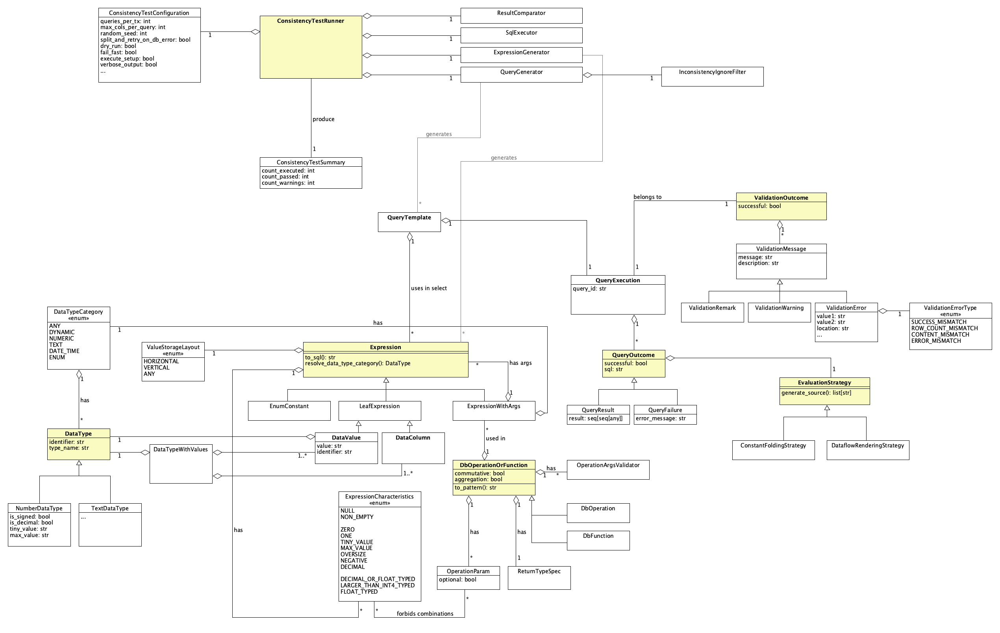

# Output consistency tests

## Overview

**These tests aim to ensure that data-flow rendering (DFR) and constant folding (CTF) produce the same outcome when
evaluating an expression.**

To do so, this test framework generates queries with random expressions based on the input specification (data types,
values per data type, operation and function definitions, and relations between them). Then, it evaluates the same
expressions using data-flow rendering (by accessing table data) and constant folding (by accessing constant data
defined in a view). Finally, it validates and compares the outcome (result data or database error message).

## Getting started

To launch the tests using mzcompose, run
```
bin/mzcompose --find output-consistency down -v && bin/mzcompose --find output-consistency run default
```
To start the tests from a shell, use
```
bin/output-consistency-test --max-runtime-in-sec 60
```

Possible parameters are:
* `--max-runtime-in-sec`: limit the duration of the test execution (`0` is unlimited, but `max-iterations` must be set in
this case)
* `--max-iterations`: limit the number of processed expressions (`0` is unlimited, but `runtime-in-sec` must be set in
this case)
* `--seed`: specify a certain seed to allow reproducibility
* `--dry-run`: only print the queries without executing them
* `--fail-fast`: abort the execution after the first test error (comparison mismatch)
* `--verbose`: print queries and details, otherwise only queries with warnings and errors will be printed
* `--avoid-expressions-expecting-db-error`: try to avoid executing expressions likely producing a database error (e.g.,
division by zero)
* `--max-cols-per-query`: maximum number of columns per query

## Features

### Basic Functionality
* Generate and setup data structures
* Generate queries with random expressions
* Execute queries and collect results
* Validate outcomes of different computation modes of a query template
* Ignore known inconsistencies
* Generate minimal reproducible code snippets
* Split and retry multi-column queries when receiving a database error

### Advanced Features
* Generate expressions with aggregation functions
* Generate nested expressions

## Implementation

### UML Overview



### Relevant Concepts

A `DataType` specifies a SQL data type and belongs to a `DataTypeCategory` (e.g., `INT8` to `NUMERIC`).
A `DataValue` specifies a SQL value (e.g., `100::INT8`) and is associated with a type; each value represents a column
and is used when accessing [horizontally stored data](#horizontal-storage).
A `DataColumn` specifies the column of a type that is used when accessing [vertically stored data](#vertical-storage).
Values of a type and the vertical-storage column are collected in `DataTypeWithValues` to avoid a circular dependency.

`DataValue` and `DataColumn` are two forms of an `Expression`. Another form is the `ExpressionWithArgs`, which is
derived from an operation or function; it specifies a return type category and usually has child expressions.
An expression has `ExpressionCharacteristics`, which describe the content and allow specifying constraints or filters.
Examples appropriate for numeric expression are `NULL`, `MAX_VALUE`, and `NEGATIVE`.
While they are easy to define for values, they will need to be derived for expressions with arguments.

A `DbOperationOrFunction` specifies an operation (e.g., `a * b`) or a function (e.g., `SIN(a)`).
It holds a set of `OperationParam`s; each parameter has a type, a marker whether it is optional, and defined
incompatibilities (e.g., the division operation disallows an expression with characteristic `ZERO` for the second
parameter).
An `ExpressionWithArgs` is created by providing expressions as arguments to a `DbOperationOrFunction`.

A `QueryTemplate` contains one or more expressions. A query shall ideally contain only a single expression if the
expression is expected to produce a database error; otherwise, it shall ingest multiple expressions for performance
reasons. (Note that queries with multiple columns that produce a database error will be split and retried at execution.)
The query template will be executed with each `EvaluationStrategy` (currently data-flow rendering and constant folding)
and produce a `QueryOutcome` per strategy, which is either a `QueryResult` or a `QueryFailure`. The different outcomes
are collected in a `QueryExecution`.

When validating the query outcome, a `ValidationOutcome` will be created for each query execution. It denotes whether
the validation produced a positive result and may contain errors, warnings, and remarks.

The `ConsistencyTestRunner` orchestrates the test run. To do so, it receives a `ConsistencyTestConfiguration` as input,
delegates to `ExpressionGenerator`, `QueryGenerator`, `SqlExecutor`, and `ResultComparator`, and produces a
`ConsistencyTestSummary` as output.

### Value Storage Layouts

#### Horizontal storage

The table or view contains a single row; a data type has a column for each value.

| bool_null | bool_true | bool_false | int2_null | int2_zero | int2_one | int2_max | int2_neg_max | int4_null |
|----------:|----------:|-----------:|----------:|----------:|---------:|---------:|-------------:|----------:|
|      NULL |      true |      false |      NULL |         0 |        1 |    32767 |       -32768 |      NULL |

#### Vertical storage

The table or view contains multiple rows; one column per data type exists.

| row_index | bool_val | int2_val |    int4_val |             int8_val | uint2_val | ... |
|----------:|---------:|---------:|------------:|---------------------:|----------:|-----|
|         1 |     true |        0 |           0 |                    0 |         0 | ... |
|         2 |    false |        1 |           1 |                    1 |         1 | ... |
|         3 |     true |    32767 |  2147483647 |  9223372036854775807 |     65535 | ... |
|         4 |    false |   -32768 | -2147483648 | -9223372036854775808 |         0 | ... |
|         5 |     true |        0 |           0 |                    0 |         0 | ... |
|       ... |      ... |      ... |         ... |                  ... |       ... | ... |

### Package Structure

* `common` contains the configuration and constants
* `data_type` defines the data type structure (actual types are specified in `input-data/types`)
* `data_value` defines the data value structure (actual values are specified in `input-data/values`)
* `execution` contains the logic to execute the statements against the database using pgwire
* `expression` defines the expression structure (expressions are generated at runtime based on types, values, and
operations)
* `generators` contains the expression and query generator
* `input_data` contains the input data used to generate expressions and queries
  * `operations`
  * `params`
  * `types`
  * `validators`
  * `values`
* `known_inconsistencies` contains a filter to allow skipping certain expressions that produce known inconsistencies
* `operation` defines the structure of operations, functions, and their parameters (actual operations are specified in
`input-data/operations`)
* `output` contains the output printer
* `query` defines the query and result structure
* `runner` contains the test runner orchestrating the logic
* `selection` contains the random picker
* `validation` contains the logic to conduct the outcome comparison
